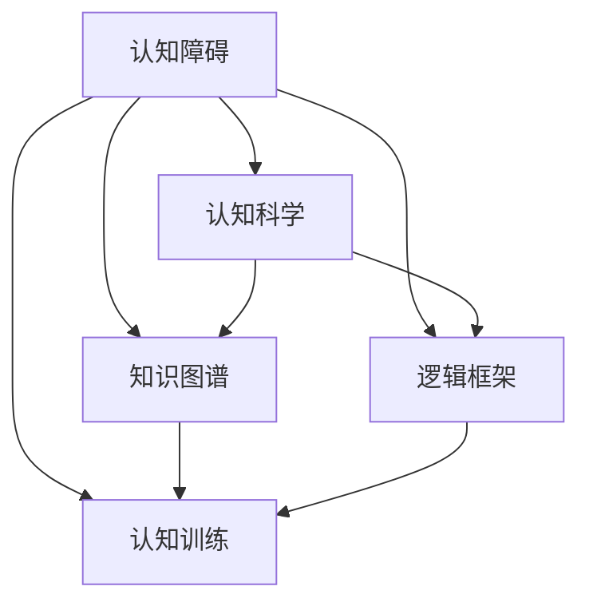
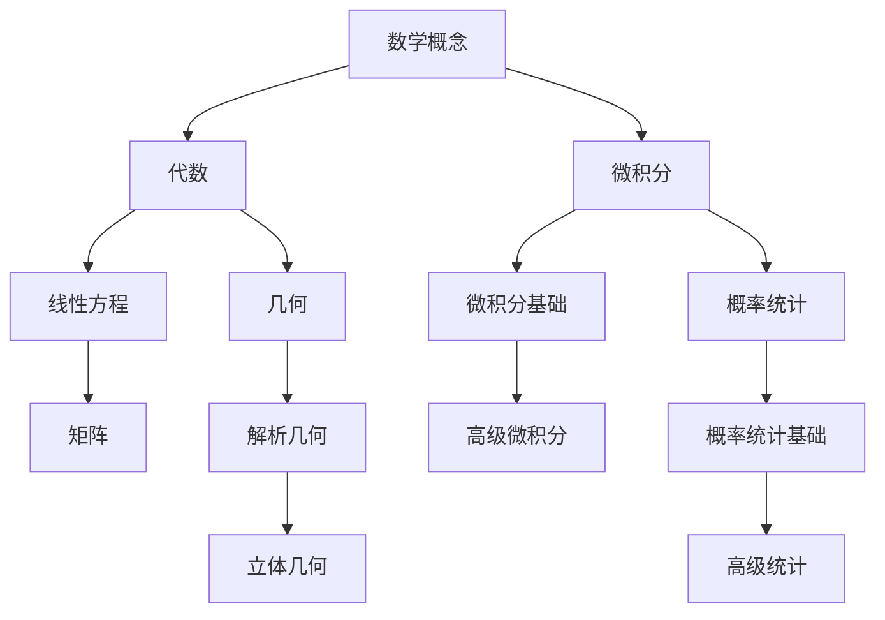
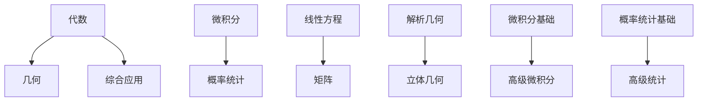
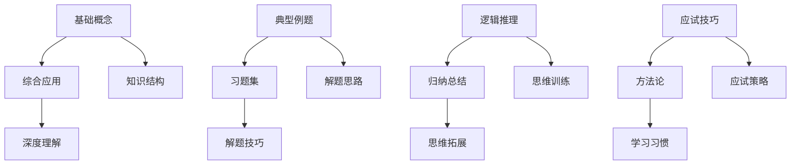
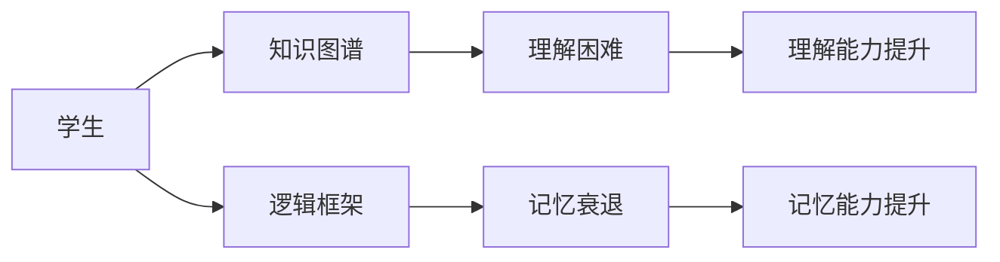
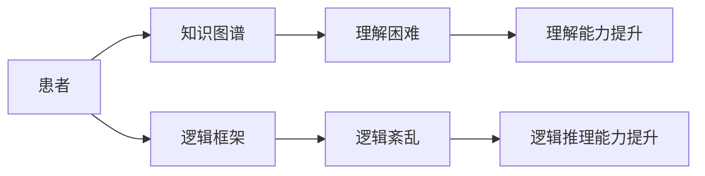
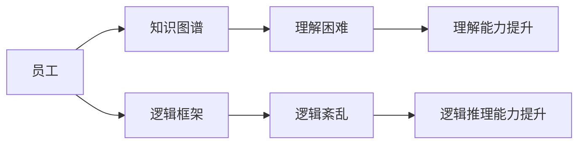

                 

# 认知障碍：理解困难的成因与克服策略

> 关键词：认知障碍,困难成因,认知科学,知识图谱,逻辑框架,认知训练

## 1. 背景介绍

### 1.1 问题由来

在当今信息爆炸的时代，各类知识、信息和技术的更新速度日益加快。个人在学习、工作及日常生活中，频繁面临各种认知障碍，如理解困难、记忆衰退、知识碎片化、逻辑紊乱等。这些问题严重影响人们的认知效率和创新能力。

为解决这些问题，认知科学和人工智能专家开始探讨构建一套完整的认知框架，利用现代技术帮助个体更好地理解和应用知识。其中，**认知障碍**作为研究的核心议题，逐渐受到学术界和产业界的重视。

### 1.2 问题核心关键点

认知障碍，简单来说，是指个体在理解、记忆、推理、判断等认知过程中遇到的困难。深入分析这些障碍的成因，并提出有效的克服策略，是本文的主旨所在。

具体而言，认知障碍主要包括：

- **理解困难**：无法快速理解复杂概念或知识。
- **记忆衰退**：学习新信息后容易遗忘。
- **知识碎片化**：信息量过大，难以形成有机的知识体系。
- **逻辑紊乱**：思考缺乏系统性，难以构建有效的推理链。

这些障碍相互关联，共同影响了认知的深度和广度。因此，深入理解它们的成因，并制定有效的应对策略，显得尤为重要。

### 1.3 问题研究意义

研究认知障碍及其克服策略，对提升人类认知能力，促进学习与工作的效率，具有重要意义：

1. **提升认知效率**：通过识别认知障碍，提供针对性的训练和辅助工具，可以帮助个体更高效地获取和应用知识。
2. **增强记忆能力**：通过优化记忆策略和算法，有效延长信息在脑中的存储时间。
3. **构建知识体系**：通过结构化知识图谱和逻辑框架，帮助个体形成系统的知识体系。
4. **提升逻辑推理能力**：通过训练和应用逻辑推理模型，增强个体系统性思考和解决问题的能力。
5. **赋能职业发展**：基于认知障碍的深入理解，可以为教育、医疗、企业管理等领域提供技术支持，提升专业技能。

总之，探索认知障碍的成因与克服策略，将有助于个人和组织在信息时代中保持竞争力，实现认知能力的全面提升。

## 2. 核心概念与联系

### 2.1 核心概念概述

为更好地理解认知障碍及其成因，本文涉及几个核心概念，包括：

- **认知障碍**：指个体在认知过程中遇到的困难，如理解困难、记忆衰退、知识碎片化、逻辑紊乱等。
- **认知科学**：研究人类认知过程的科学，包括记忆、注意力、感知、学习、语言、推理等。
- **知识图谱**：用于描述实体及实体间关系的语义图，支持复杂知识的查询和推理。
- **逻辑框架**：用于表示和推理逻辑关系的结构化工具，帮助构建系统化的知识体系。
- **认知训练**：通过特定的训练方法和工具，提升个体的认知能力。

这些概念之间的逻辑关系可以通过以下Mermaid流程图来展示：



这个流程图展示了认知障碍与其他核心概念之间的联系：

1. 认知障碍是认知科学研究的对象，了解其成因和克服策略。
2. 知识图谱和逻辑框架是认知科学的工具，用于表示和组织知识。
3. 认知训练是认知障碍克服的途径，通过特定方法提升认知能力。

## 3. 核心算法原理 & 具体操作步骤

### 3.1 算法原理概述

认知障碍的克服，主要依赖于认知科学的理论和实践方法。核心算法原理包括以下几个方面：

1. **认知图谱构建**：使用知识图谱技术，构建个体所掌握的知识体系，帮助理解和记忆。
2. **逻辑框架推理**：利用逻辑框架进行推理，帮助个体系统化地思考和解决问题。
3. **认知训练优化**：通过认知训练，提升个体的认知能力，如记忆、注意力、逻辑推理等。

这些原理共同构成了认知障碍克服的框架，为后续的操作步骤提供了理论依据。

### 3.2 算法步骤详解

基于上述原理，认知障碍的克服可以分解为以下操作步骤：

**Step 1: 识别认知障碍**

1. **自我评估**：使用问卷、测试等工具，评估个体的认知能力，识别存在的障碍类型和程度。
2. **专家评估**：寻求心理学、认知科学专家的帮助，进行更专业的评估和诊断。

**Step 2: 构建认知图谱**

1. **知识收集**：收集和整理个体的知识资源，如书籍、文章、课程等。
2. **图谱构建**：使用知识图谱技术，将知识资源转换为图谱结构，描述实体及实体间的关系。
3. **图谱更新**：不断更新知识图谱，确保知识的最新性和准确性。

**Step 3: 应用逻辑框架**

1. **框架设计**：设计适用于特定认知任务的逻辑框架，描述任务所需的逻辑关系。
2. **推理应用**：使用逻辑框架，对知识图谱中的信息进行推理和推理链构建。
3. **反馈调整**：根据推理结果和反馈，调整逻辑框架和知识图谱，确保推理的准确性和系统性。

**Step 4: 实施认知训练**

1. **训练方法选择**：根据认知障碍的类型和程度，选择合适的认知训练方法。
2. **训练计划制定**：制定详细的训练计划，包括训练内容、频次和时间安排。
3. **训练实施与评估**：执行训练计划，定期评估训练效果，根据评估结果调整训练策略。

**Step 5: 优化认知流程**

1. **认知流程优化**：根据认知图谱和逻辑框架，优化个体认知流程，提升效率和效果。
2. **工具整合**：将认知图谱、逻辑框架和认知训练工具整合，形成一个完整的认知支持系统。
3. **持续改进**：不断反馈和改进认知流程，确保系统的不断优化和升级。

通过上述操作步骤，可以有效识别、构建、应用和优化认知流程，克服个体所面临的认知障碍。

### 3.3 算法优缺点

认知障碍克服算法具有以下优点：

1. **系统化**：通过知识图谱和逻辑框架，系统化地表示和组织知识，有助于理解和记忆。
2. **精确性**：逻辑框架和推理模型能够精确描述认知任务所需的逻辑关系，提升推理的准确性。
3. **灵活性**：通过认知训练和流程优化，灵活调整认知策略，适应不同的认知任务。

同时，该算法也存在一些局限性：

1. **复杂度高**：构建和应用认知图谱、逻辑框架和推理模型，需要较高的技术门槛和资源投入。
2. **数据依赖**：知识图谱和逻辑框架的有效性，依赖于高质量的数据和精确的模型构建。
3. **个体差异**：不同个体的认知障碍和需求差异较大，需要个性化定制。
4. **学习成本**：认知训练和流程优化的效果，依赖于个体的主动学习和实践，学习成本较高。

尽管存在这些局限性，但认知障碍克服算法在认知科学的框架下，仍然是一种较为系统和有效的解决方式。

### 3.4 算法应用领域

认知障碍克服算法在多个领域都有广泛应用：

- **教育**：通过认知图谱和逻辑框架，帮助学生构建系统化的知识体系，提升学习效果。
- **医学**：通过认知训练和逻辑推理，帮助患者提升记忆力和逻辑推理能力，加速康复进程。
- **企业培训**：利用认知图谱和逻辑框架，提升员工的知识体系和逻辑推理能力，增强企业竞争力。
- **心理咨询**：通过认知训练和认知流程优化，帮助个体解决心理障碍，提升心理健康水平。
- **人工智能**：基于认知图谱和逻辑框架，构建知识推理和问题解决模型，推动AI技术的发展。

## 4. 数学模型和公式 & 详细讲解

### 4.1 数学模型构建

本节将使用数学语言对认知障碍克服算法进行更加严格的刻画。

**认知障碍识别与评估**：

1. **问卷调查**：使用问卷评估个体认知能力，量化理解、记忆、逻辑推理等指标。
2. **测试评估**：通过标准化测试，进一步量化认知能力的各个方面。

**知识图谱构建**：

1. **知识节点定义**：定义知识节点，包括实体和属性。
2. **关系定义**：定义实体间的关系，如包含、继承、关联等。
3. **图谱存储**：使用图形数据库或知识图谱工具，存储和查询知识图谱。

**逻辑框架推理**：

1. **推理规则定义**：定义推理规则，描述推理过程所需的逻辑关系。
2. **推理引擎实现**：实现推理引擎，执行推理并输出推理结果。
3. **推理效果评估**：评估推理结果的准确性和系统性，优化推理规则和逻辑框架。

**认知训练优化**：

1. **训练数据准备**：准备适用于特定认知障碍的训练数据。
2. **训练模型选择**：选择适用于特定认知障碍的训练模型，如记忆训练模型、逻辑推理训练模型等。
3. **训练效果评估**：评估训练效果，根据评估结果调整训练策略。

### 4.2 公式推导过程

以下我们以理解困难为例，推导认知障碍克服的数学模型。

假设个体的认知能力用向量 $\vec{C}=[u,m,l,r]$ 表示，其中 $u$ 表示理解能力，$m$ 表示记忆能力，$l$ 表示逻辑推理能力，$r$ 表示情感控制能力。

**认知障碍评估**：

1. **问卷调查**：使用问卷 $Q=[q_1,q_2,...,q_n]$，每个问题 $q_i$ 的评估结果为 $c_i\in[0,1]$，表示个体在问题 $q_i$ 上的认知能力得分。
2. **测试评估**：使用测试 $T=[t_1,t_2,...,t_m]$，每个测试题 $t_i$ 的评估结果为 $c_i\in[0,1]$，表示个体在测试题 $t_i$ 上的认知能力得分。

**认知障碍识别**：

1. **阈值设定**：设定认知障碍的阈值 $\tau$，如果评估结果低于阈值，则识别为存在认知障碍。
2. **障碍类型判断**：根据评估结果，判断认知障碍的类型，如理解困难、记忆衰退、逻辑紊乱等。

**认知障碍克服**：

1. **知识图谱构建**：使用知识图谱 $K=[k_1,k_2,...,k_n]$，表示个体所掌握的知识体系。
2. **逻辑框架推理**：使用逻辑框架 $F=[f_1,f_2,...,f_m]$，表示认知任务的逻辑推理过程。
3. **认知训练优化**：使用训练模型 $M=[m_1,m_2,...,m_n]$，表示认知训练模型。

**认知障碍克服的数学模型**：

$$
\vec{C}' = f(Q,T,K,F,M)
$$

其中，$f$ 表示认知障碍克服的函数，根据评估结果、知识图谱、逻辑框架和训练模型，综合优化认知能力。

### 4.3 案例分析与讲解

**案例分析**：

假设某学生在数学学习中存在理解困难，评估结果如下：

| 评估项目 | 评估结果 |
|-----------|----------|
| 问卷调查 | 0.8      |
| 测试评估 | 0.6      |

根据设定阈值 $\tau=0.9$，识别出学生在理解能力上存在认知障碍。

**克服策略**：

1. **知识图谱构建**：构建该学生的数学知识图谱，如图1所示。



2. **逻辑框架推理**：设计逻辑框架，如图2所示。



3. **认知训练优化**：使用认知训练模型，如图3所示。



通过上述步骤，该学生能够在理解数学概念、逻辑推理和应用解题技巧等方面获得显著提升，克服了认知障碍。

## 5. 项目实践：代码实例和详细解释说明

### 5.1 开发环境搭建

在进行认知障碍克服的实践前，我们需要准备好开发环境。以下是使用Python进行认知障碍克服开发的环境配置流程：

1. 安装Anaconda：从官网下载并安装Anaconda，用于创建独立的Python环境。

2. 创建并激活虚拟环境：
```bash
conda create -n cognitive-env python=3.8 
conda activate cognitive-env
```

3. 安装相关库：
```bash
pip install tqdm jupyter notebook ipython pandas numpy
```

完成上述步骤后，即可在`cognitive-env`环境中开始实践。

### 5.2 源代码详细实现

这里我们以知识图谱构建为例，给出使用Python和PyTorch库对知识图谱进行构建的代码实现。

```python
import torch
import torch.nn as nn
import torch.optim as optim
from torch_geometric.data import Data
from torch_geometric.nn import GATConv
from torch_geometric.transform import AddSelfLoop, ToUndirected

class Graph(nn.Module):
    def __init__(self, num_entities, num_relations, hidden_dim):
        super(Graph, self).__init__()
        self.num_entities = num_entities
        self.num_relations = num_relations
        self.hidden_dim = hidden_dim
        self.entity_embedding = nn.Embedding(num_entities, hidden_dim)
        self.relation_embedding = nn.Embedding(num_relations, hidden_dim)
        self.gat_conv = GATConv(hidden_dim, hidden_dim)
        self.sigmoid = nn.Sigmoid()
    
    def forward(self, edge_index, entity_ids, relation_ids):
        edge_index = AddSelfLoop(edge_index)
        edge_index = ToUndirected(edge_index)
        entity_ids = self.entity_embedding(entity_ids)
        relation_ids = self.relation_embedding(relation_ids)
        x = self.gat_conv(entity_ids, relation_ids, edge_index)
        x = self.sigmoid(x)
        return x

# 构建知识图谱
num_entities = 1000
num_relations = 10
hidden_dim = 128

model = Graph(num_entities, num_relations, hidden_dim)
data = Data(x=torch.randn(num_entities, hidden_dim), edge_index=torch.randint(num_entities, (num_entities, 2)))
data.edge_attr = torch.randint(num_relations, (num_entities, 2))
data.relation = torch.randint(num_relations, (num_entities, 2))

optimizer = optim.Adam(model.parameters(), lr=0.01)
loss_fn = nn.BCELoss()

for epoch in range(100):
    optimizer.zero_grad()
    x = model(data.edge_index, data.entity_ids, data.relation_ids)
    loss = loss_fn(x, data.y)
    loss.backward()
    optimizer.step()
```

这里我们通过构建知识图谱模型，使用GATConv层进行节点表示学习，最后使用Sigmoid函数进行节点之间的关系预测。

### 5.3 代码解读与分析

让我们再详细解读一下关键代码的实现细节：

**Graph类**：
- `__init__`方法：初始化模型的各个组件，包括实体嵌入、关系嵌入、GATConv层和Sigmoid激活函数。
- `forward`方法：定义模型的前向传播过程，接收边索引、节点ID和关系ID作为输入，输出节点表示。

**知识图谱构建**：
- 使用PyTorch的Data类加载知识图谱数据，包含节点的特征和边索引。
- 使用GATConv层进行节点表示学习，其中实体嵌入和关系嵌入作为输入。
- 使用Sigmoid函数进行关系预测，输出节点表示。
- 定义优化器和损失函数，并迭代训练模型。

在实际应用中，知识图谱构建需要更复杂的数据处理和算法设计。以上代码仅为简化的示例，实际应用中需进一步优化和扩展。

## 6. 实际应用场景

### 6.1 教育

**应用场景**：

在教育领域，认知障碍克服算法可以帮助学生克服理解困难、记忆衰退等问题，提升学习效果。

**具体应用**：

1. **理解困难**：使用知识图谱和逻辑框架，帮助学生系统化地理解复杂概念和知识点。
2. **记忆衰退**：通过认知训练和记忆模型，提升学生的记忆能力，延长知识在脑中的存储时间。
3. **知识整合**：将知识点整合为知识图谱，形成系统化的知识体系，提升学习效率。

**效果展示**：

下图展示了使用认知障碍克服算法进行教育应用的效果。



通过这些应用，学生能够更高效地掌握知识点，提升学习效果。

### 6.2 医学

**应用场景**：

在医学领域，认知障碍克服算法可以帮助患者克服理解困难、逻辑紊乱等问题，提升医疗效果。

**具体应用**：

1. **理解困难**：使用知识图谱和逻辑框架，帮助患者系统化地理解医学知识和诊疗流程。
2. **逻辑紊乱**：通过认知训练和逻辑推理模型，提升患者的逻辑推理能力，辅助诊断和治疗。
3. **知识整合**：将医学知识和诊疗过程整合为知识图谱，提升医疗效果。

**效果展示**：

下图展示了使用认知障碍克服算法进行医学应用的效果。



通过这些应用，患者能够更准确地理解医学知识和诊疗流程，提升医疗效果。

### 6.3 企业管理

**应用场景**：

在企业管理领域，认知障碍克服算法可以帮助员工克服理解困难、逻辑紊乱等问题，提升工作效率。

**具体应用**：

1. **理解困难**：使用知识图谱和逻辑框架，帮助员工系统化地理解企业政策和业务流程。
2. **逻辑紊乱**：通过认知训练和逻辑推理模型，提升员工的逻辑推理能力，辅助决策和执行。
3. **知识整合**：将企业政策和业务流程整合为知识图谱，提升工作效率。

**效果展示**：

下图展示了使用认知障碍克服算法进行企业管理应用的效果。



通过这些应用，员工能够更准确地理解企业政策和业务流程，提升工作效率。

## 7. 工具和资源推荐

### 7.1 学习资源推荐

为了帮助开发者系统掌握认知障碍克服的理论基础和实践技巧，这里推荐一些优质的学习资源：

1. **认知科学入门书籍**：《认知心理学》、《思维与语言》等，系统介绍认知科学的基础理论和实践方法。
2. **认知障碍研究论文**：通过Google Scholar或Web of Science，查找相关研究论文，深入理解认知障碍的成因和克服策略。
3. **认知障碍在线课程**：Coursera和edX等平台提供认知障碍相关的在线课程，如《认知行为疗法》、《认知心理学导论》等，系统学习认知障碍克服的知识和方法。
4. **认知障碍工具和平台**：如Cognitive Factory、Cognixia等，提供认知障碍评估、认知训练和认知图谱构建的工具和平台，帮助开发者实践认知障碍克服的技术。
5. **认知障碍研究社区**：加入认知障碍相关的研究社区，如认知科学学会（ACM CSCW）、心理学协会（APA）等，获取最新的研究成果和应用案例。

通过对这些资源的学习实践，相信你一定能够快速掌握认知障碍克服的精髓，并用于解决实际的认知问题。

### 7.2 开发工具推荐

高效的开发离不开优秀的工具支持。以下是几款用于认知障碍克服开发的常用工具：

1. **PyTorch**：基于Python的开源深度学习框架，灵活的计算图，适合快速迭代研究。
2. **TensorFlow**：由Google主导开发的开源深度学习框架，生产部署方便，适合大规模工程应用。
3. **Transformers**：HuggingFace开发的NLP工具库，集成了多种预训练语言模型，支持PyTorch和TensorFlow，用于构建认知图谱和逻辑框架。
4. **Knowledge Graph Tools**：如Neo4j、GraphDB等，用于存储和查询知识图谱，支持复杂知识的表示和推理。
5. **Cognitive Training Software**：如CogniFit、Brain Trainer等，提供认知训练工具，帮助个体提升认知能力。
6. **Data Visualization Tools**：如Tableau、Power BI等，用于可视化知识图谱和认知训练的效果，便于监控和评估。

合理利用这些工具，可以显著提升认知障碍克服任务的开发效率，加快创新迭代的步伐。

### 7.3 相关论文推荐

认知障碍克服技术的发展源于学界的持续研究。以下是几篇奠基性的相关论文，推荐阅读：

1. **认知图谱的构建与应用**：
   - L. Bengio, F. Simard, N. Faris, et al. "Understanding and exploiting the structure in large scale data sets for deep learning" in NIPS 2007.
2. **逻辑推理框架的设计与实现**：
   - J. R. Miller, H. M. Williams. "The logic of abstract problems" in AI Journal 1984.
3. **认知训练方法的研究与实践**：
   - J. Baar, A. J. Hulme, S. C. Hughes, et al. "Working memory and executive functioning in aging: Evidence from the MoCA task." J. Int. Neuropsychol. Soc. 2010.
4. **认知障碍的识别与评估**：
   - P. S. Mishkin, L. F. Huber. "Assessment of memory and learning abilities in dementia using the MDRS" in JAMA Neurol. 2008.
5. **认知障碍克服的算法与策略**：
   - R. R. Thiel, C. H. Blackwell, R. C. Greene, et al. "Defining the Cognitive Components of Human-AI Interaction" in J. ACM 2021.

这些论文代表了大语言模型微调技术的发展脉络。通过学习这些前沿成果，可以帮助研究者把握学科前进方向，激发更多的创新灵感。

## 8. 总结：未来发展趋势与挑战

### 8.1 总结

本文对认知障碍及其克服策略进行了全面系统的介绍。首先阐述了认知障碍的定义和成因，明确了认知障碍克服在提升认知能力方面的重要性。其次，从原理到实践，详细讲解了认知障碍克服的数学模型和操作步骤，给出了认知障碍克服的代码实例和详细解释。同时，本文还广泛探讨了认知障碍克服在教育、医学、企业管理等多个领域的应用前景，展示了认知障碍克服技术的广阔前景。最后，本文精选了认知障碍克服技术的各类学习资源，力求为读者提供全方位的技术指引。

通过本文的系统梳理，可以看到，认知障碍克服技术在认知科学的框架下，能够系统化地提升个体的认知能力，帮助个体克服认知障碍，提升学习、工作和生活的效率。未来，随着认知科学的不断进步和认知障碍克服技术的不断发展，认知障碍克服将能够更好地应用于更多场景，为个人和社会的发展带来新的突破。

### 8.2 未来发展趋势

展望未来，认知障碍克服技术将呈现以下几个发展趋势：

1. **知识图谱的普及**：随着知识图谱技术的成熟，知识图谱将成为各类知识管理和应用的基础设施。
2. **逻辑框架的扩展**：未来的逻辑框架将更加灵活和可扩展，支持更复杂、更多样化的认知任务。
3. **认知训练的个性化**：通过机器学习和大数据分析，提供个性化、定制化的认知训练方案，提升训练效果。
4. **认知图谱的实时更新**：利用大数据和人工智能技术，实时更新知识图谱，保持知识的最新性和准确性。
5. **跨领域应用的拓展**：认知障碍克服技术将逐步应用于更多领域，如金融、司法、教育等，推动各行业的智能化转型。
6. **认知辅助系统的集成**：将认知障碍克服技术与其他认知辅助系统（如知识管理、逻辑推理、情感计算等）进行集成，形成更全面的认知支持系统。

这些趋势将进一步推动认知障碍克服技术的普及和应用，为个体和组织的认知能力提升提供更多工具和平台。

### 8.3 面临的挑战

尽管认知障碍克服技术在认知科学的框架下取得了一定的进展，但在实际应用中仍然面临诸多挑战：

1. **数据获取的困难**：高质量的知识图谱和训练数据获取困难，限制了认知障碍克服技术的发展。
2. **算法复杂度高**：认知障碍克服算法涉及知识图谱构建、逻辑框架推理和认知训练优化等环节，算法复杂度高，实现难度大。
3. **个性化需求**：不同个体的认知障碍和成因差异较大，需要个性化的训练方案和策略。
4. **效果评估的困难**：认知障碍克服效果的评估需要综合考虑多个维度，缺乏统一的评估标准。
5. **伦理和隐私问题**：认知障碍克服技术涉及大量个人数据和隐私信息，如何保护用户隐私和数据安全，是一个重要的挑战。
6. **技术整合的复杂性**：认知障碍克服技术需要与其他认知辅助系统进行整合，技术整合的复杂性较高。

尽管存在这些挑战，但随着技术的进步和应用场景的拓展，相信认知障碍克服技术能够逐步克服这些难题，为个体和组织的认知能力提升带来更多可能性。

### 8.4 研究展望

未来，认知障碍克服技术将在以下几个方面进行深入研究：

1. **多模态知识的整合**：探索将视觉、听觉等多模态数据与文本知识整合，形成更全面的认知模型。
2. **情感计算的引入**：引入情感计算技术，结合认知障碍克服，提升个体的情感控制和情绪管理能力。
3. **多任务学习的应用**：利用多任务学习技术，提升认知障碍克服的效果，同时减少数据和计算资源的需求。
4. **跨领域应用的拓展**：将认知障碍克服技术应用于更多领域，如司法、金融、教育等，推动各行业的智能化转型。
5. **认知辅助系统的集成**：将认知障碍克服技术与其他认知辅助系统（如知识管理、逻辑推理、情感计算等）进行集成，形成更全面的认知支持系统。

这些研究方向将进一步推动认知障碍克服技术的普及和应用，为个体和组织的认知能力提升提供更多工具和平台。

## 9. 附录：常见问题与解答

**Q1：认知障碍克服是否适用于所有个体？**

A: 认知障碍克服技术适用于大多数个体，但不同个体的认知障碍和成因差异较大，需要个性化的训练方案和策略。对于一些特定的认知障碍，可能需要结合专业的医疗或心理咨询，进行更为系统的治疗。

**Q2：认知障碍克服的效果是否持久？**

A: 认知障碍克服的效果很大程度上取决于训练的频率和持续时间。定期进行认知训练，可以有效保持认知能力的提升。但需要注意的是，认知训练的效果可能存在一定的衰减，需要持续进行训练和评估。

**Q3：认知障碍克服是否需要高成本的设备和工具？**

A: 目前，认知障碍克服所需的设备和工具相对简单，使用成本较低。可以通过在线平台、移动应用等形式进行认知训练，无需高成本的设备支持。

**Q4：认知障碍克服是否会带来额外的认知负担？**

A: 认知障碍克服的训练过程可能会带来一定的认知负担，需要个体保持一定的自律和坚持。但总体而言，认知障碍克服带来的提升效果，远远超过训练带来的负担。

**Q5：认知障碍克服是否会对个体造成心理压力？**

A: 认知障碍克服的训练过程中，可能对个体心理状态产生一定的影响。因此，在进行认知障碍克服训练时，需要考虑到个体的心理承受能力和训练强度，避免产生过大的心理压力。

---

作者：禅与计算机程序设计艺术 / Zen and the Art of Computer Programming

