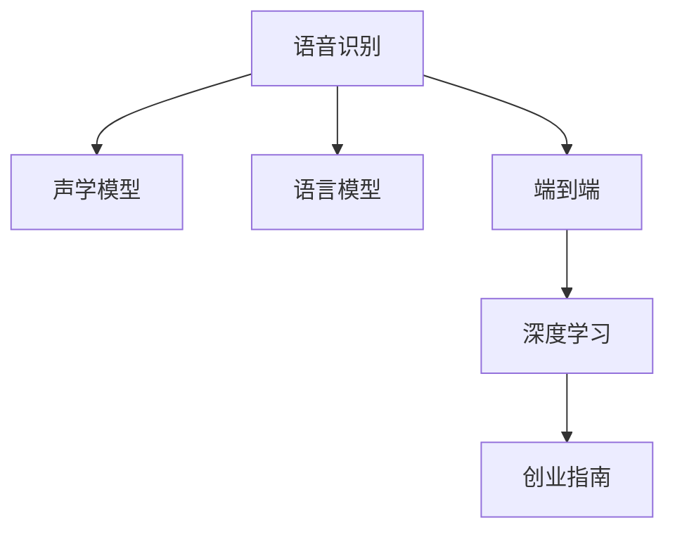

                 

# 语音识别创业：人机交互的新篇章

> 关键词：语音识别, 人机交互, 声学模型, 语言模型, 神经网络, 端到端, 深度学习, 创业指南

## 1. 背景介绍

### 1.1 问题由来

随着人工智能技术的迅猛发展，语音识别技术已经从实验室研究走向实际应用，成为人机交互的重要手段之一。语音识别技术的进步，不仅能够显著提升用户体验，还能释放人手的劳动力，广泛应用于智能家居、车载导航、智能客服、语音助手等领域。然而，语音识别创业并非易事，存在诸如技术瓶颈、市场需求、产品设计等多重挑战。本文将从核心技术、市场需求、创业指南等多个角度出发，探讨语音识别创业的前景与挑战。

### 1.2 问题核心关键点

语音识别技术主要包括声学模型和语言模型两大部分。声学模型通过深度神经网络学习声音信号和文本序列之间的映射关系，将音频信号转换为文本序列。语言模型则用于处理文本序列，学习语言中的上下文关系，提高识别的准确率。

语音识别创业的成功关键在于：
1. 高质量的声学模型：需要高精度的神经网络架构和大量标注数据进行训练。
2. 高效的计算资源：需要高性能的GPU、TPU等设备支持。
3. 精准的语言模型：需要大量自然语言数据进行训练，提升识别准确率。
4. 实际应用场景：需要与具体应用场景相结合，开发有针对性的产品。
5. 商业化能力：需要具有市场洞察力和营销能力，实现商业成功。

### 1.3 问题研究意义

语音识别技术的快速发展，为人机交互带来了新的契机。通过语音识别，用户可以更自然地与机器进行交流，提升了用户体验和便利性。创业公司可以凭借语音识别技术，开发多样化的智能产品，满足市场需求，推动技术进步。同时，语音识别技术的普及，还将带动语音处理、自然语言理解等相关技术的发展，催生新的产业生态。

## 2. 核心概念与联系

### 2.1 核心概念概述

为更好地理解语音识别创业，本节将介绍几个关键概念：

- 语音识别(Speech Recognition)：通过机器学习算法，将人类语音转换为文本，实现人机交互。
- 声学模型(Acoustic Model)：使用深度神经网络对音频信号进行建模，将声学特征转换为文本序列。
- 语言模型(Language Model)：使用深度神经网络对文本序列进行建模，学习语言中的上下文关系。
- 端到端(End-to-End)：直接从音频信号到文本序列，避免单独优化声学和语言模型，提高识别效率和准确率。
- 深度学习(Deep Learning)：基于多层神经网络的机器学习技术，广泛应用于语音识别中。
- 创业指南(Creating a Business Guide)：指导创业者如何在语音识别领域成功创业的指南。

这些核心概念之间的逻辑关系可以通过以下Mermaid流程图来展示：



这个流程图展示语音识别的核心概念及其之间的关系：

1. 语音识别通过声学模型和语言模型实现，其中端到端是重要的优化方向。
2. 深度学习是声学模型和语言模型的重要技术手段。
3. 创业指南指导创业者在语音识别领域成功创业，构建产品。

## 3. 核心算法原理 & 具体操作步骤

### 3.1 算法原理概述

语音识别创业的核心在于构建高效的声学和语言模型，并通过端到端优化，提升识别准确率。其核心算法流程如下：

1. 数据收集：收集大量的语音数据和文本数据，用于训练声学模型和语言模型。
2. 特征提取：使用MFCC、MelSpectrogram等算法提取音频特征。
3. 声学模型训练：使用深度神经网络，如卷积神经网络(CNN)、循环神经网络(RNN)、长短期记忆网络(LSTM)等，对声学特征进行建模，得到声学模型。
4. 语言模型训练：使用深度神经网络对文本序列进行建模，得到语言模型。
5. 端到端优化：将声学模型和语言模型进行联合训练，提升整体识别效果。

### 3.2 算法步骤详解

#### 3.2.1 数据收集和预处理

语音数据收集是语音识别的基础。需要收集大量不同口音、语速、环境噪音的语音数据，以覆盖各种应用场景。

预处理主要包括：
- 去噪：使用信号处理技术，去除环境噪音和回声。
- 归一化：将音频信号归一化到指定范围。
- 分帧：将音频信号分帧，每帧时间固定。
- 特征提取：使用MFCC、MelSpectrogram等算法提取声学特征。

#### 3.2.2 声学模型训练

声学模型训练的目的是学习音频特征和文本序列之间的映射关系。以下是典型的声学模型训练流程：

1. 设计神经网络架构：常用的声学模型包括卷积神经网络(CNN)、循环神经网络(RNN)、长短期记忆网络(LSTM)等。
2. 数据划分：将数据集划分为训练集、验证集和测试集。
3. 损失函数选择：常用的损失函数包括交叉熵损失、均方误差损失等。
4. 优化器选择：常用的优化器包括SGD、Adam等。
5. 训练迭代：使用小批量随机梯度下降法进行迭代训练，更新模型参数。

#### 3.2.3 语言模型训练

语言模型训练的目的是学习文本序列中的上下文关系，提升识别准确率。以下是典型的语言模型训练流程：

1. 设计神经网络架构：常用的语言模型包括卷积神经网络(CNN)、递归神经网络(RNN)、长短期记忆网络(LSTM)等。
2. 数据划分：将数据集划分为训练集、验证集和测试集。
3. 损失函数选择：常用的损失函数包括交叉熵损失、负对数似然损失等。
4. 优化器选择：常用的优化器包括SGD、Adam等。
5. 训练迭代：使用小批量随机梯度下降法进行迭代训练，更新模型参数。

#### 3.2.4 端到端优化

端到端优化的目的是通过联合训练声学模型和语言模型，提升整体识别效果。以下是典型的端到端优化流程：

1. 设计联合网络架构：将声学模型和语言模型进行联合设计，得到一个完整的神经网络。
2. 数据划分：将数据集划分为训练集、验证集和测试集。
3. 损失函数选择：常用的损失函数包括交叉熵损失、均方误差损失等。
4. 优化器选择：常用的优化器包括SGD、Adam等。
5. 训练迭代：使用小批量随机梯度下降法进行迭代训练，更新模型参数。

### 3.3 算法优缺点

#### 3.3.1 优点

- 技术先进：采用深度神经网络进行建模，能够处理复杂的语音信号和语言关系。
- 应用广泛：广泛应用于智能家居、车载导航、智能客服、语音助手等领域。
- 用户友好：用户可以通过语音与机器进行自然交流，提升用户体验和便利性。

#### 3.3.2 缺点

- 数据需求高：需要大量标注数据进行训练，数据收集和标注成本较高。
- 计算资源需求高：需要高性能的GPU、TPU等设备支持。
- 模型复杂度高：神经网络结构复杂，训练和推理速度较慢。
- 准确率依赖数据：模型的准确率依赖于训练数据的质量和数量，数据偏差可能导致识别错误。
- 对抗攻击风险：模型容易受到对抗攻击，例如使用噪声干扰识别结果。

### 3.4 算法应用领域

语音识别技术已经广泛应用于各个领域，以下是几个典型的应用场景：

1. 智能家居：通过语音识别控制家电设备，提升家居智能性。
2. 车载导航：通过语音识别进行导航路线查询，提升驾驶便利性。
3. 智能客服：通过语音识别进行自动应答，提升客户服务效率。
4. 语音助手：通过语音识别进行智能问答，提升用户体验。
5. 医疗诊断：通过语音识别进行病历录入，提升医疗效率。
6. 教育培训：通过语音识别进行口语评测，提升学习效果。

这些应用场景展示了语音识别技术的广泛应用前景。随着技术的不断进步，语音识别技术还将拓展到更多的领域，为人机交互带来新的突破。

## 4. 数学模型和公式 & 详细讲解 & 举例说明

### 4.1 数学模型构建

语音识别创业的核心在于构建高效的声学和语言模型。以下是一个典型的声学模型训练的数学模型构建过程：

1. 声学模型训练：使用深度神经网络，如卷积神经网络(CNN)、循环神经网络(RNN)、长短期记忆网络(LSTM)等，对声学特征进行建模。
2. 语言模型训练：使用深度神经网络，如卷积神经网络(CNN)、递归神经网络(RNN)、长短期记忆网络(LSTM)等，对文本序列进行建模。
3. 端到端优化：将声学模型和语言模型进行联合训练，得到完整的神经网络。

### 4.2 公式推导过程

#### 4.2.1 声学模型训练公式

设声学模型为 $H$，输入为 $X$，输出为 $Y$，使用交叉熵损失函数 $\mathcal{L}(H)$ 进行训练，损失函数公式为：

$$
\mathcal{L}(H) = -\frac{1}{N} \sum_{i=1}^N \sum_{j=1}^m \log H(X_i, y_j) + \log(1 - H(X_i, y_j))
$$

其中 $N$ 为样本数量，$m$ 为类别数量。

#### 4.2.2 语言模型训练公式

设语言模型为 $G$，输入为 $X$，输出为 $Y$，使用交叉熵损失函数 $\mathcal{L}(G)$ 进行训练，损失函数公式为：

$$
\mathcal{L}(G) = -\frac{1}{N} \sum_{i=1}^N \sum_{j=1}^m \log G(X_i, y_j)
$$

其中 $N$ 为样本数量，$m$ 为类别数量。

#### 4.2.3 端到端优化公式

设端到端模型为 $M$，输入为 $X$，输出为 $Y$，使用交叉熵损失函数 $\mathcal{L}(M)$ 进行训练，损失函数公式为：

$$
\mathcal{L}(M) = -\frac{1}{N} \sum_{i=1}^N \sum_{j=1}^m \log M(X_i, y_j)
$$

其中 $N$ 为样本数量，$m$ 为类别数量。

### 4.3 案例分析与讲解

#### 4.3.1 案例一：智能家居

某智能家居公司开发了一款基于语音识别的智能音箱。该音箱通过语音识别技术，用户可以通过语音控制家电设备，如电视、空调、窗帘等。

语音识别流程如下：
1. 用户输入语音信号。
2. 语音识别引擎通过声学模型将语音信号转换为文本。
3. 语言模型分析文本上下文关系。
4. 最终输出语音控制指令。

#### 4.3.2 案例二：车载导航

某车载导航公司开发了一款基于语音识别的导航系统。该系统通过语音识别技术，用户可以通过语音查询导航路线，提升驾驶便利性。

语音识别流程如下：
1. 用户输入语音信号。
2. 语音识别引擎通过声学模型将语音信号转换为文本。
3. 语言模型分析文本上下文关系。
4. 导航系统根据识别结果，生成导航路线。

## 5. 项目实践：代码实例和详细解释说明

### 5.1 开发环境搭建

#### 5.1.1 环境准备

1. 安装Python：从官网下载并安装Python，建议使用Python 3.8以上版本。
2. 安装深度学习框架：推荐使用TensorFlow和PyTorch，使用以下命令进行安装：
```
pip install tensorflow==2.8.0
pip install pytorch==1.8.0
```
3. 安装语音识别库：推荐使用Kaldi和DeepSpeech，使用以下命令进行安装：
```
git clone https://github.com/kaldi-asr/kaldi.git
cd kaldi
make
```

### 5.2 源代码详细实现

#### 5.2.1 数据准备

语音识别数据通常包括音频数据和文本数据。这里以Kaldi和DeepSpeech为例，介绍如何准备数据集。

1. 音频数据准备：
```
# 下载音频数据集
wget http://www.openslr.org/resources/12/tiny_wav.tar.gz
tar -xvf tiny_wav.tar.gz
```

2. 文本数据准备：
```
# 下载文本数据集
wget http://www.openslr.org/resources/12/tiny_transcripts.txt
```

#### 5.2.2 特征提取

语音识别模型的输入通常是MFCC特征。这里以Kaldi为例，介绍如何提取MFCC特征。

1. 安装Kaldi库：
```
cd kaldi
make
cd scripts/kaldi-utils
make
```

2. 提取MFCC特征：
```
# 提取MFCC特征
kaldi/utils/fix_data_dir.sh data/local/train_lmfeats.scp data/local/feats.scp
kaldi/feat/bin/compute-cmvn-stats --nj 10 data/local/feats.scp data/local/feats.scp data/local/cmvn.ark
kaldi/feat/bin/compute-feats-mfcc-scp --nj 10 --cmd "run.pl" data/local/feats.scp data/local/train_lmfeats.scp data/local/train_feats.scp
```

#### 5.2.3 声学模型训练

声学模型训练的常用算法包括卷积神经网络(CNN)、循环神经网络(RNN)、长短期记忆网络(LSTM)等。这里以DeepSpeech为例，介绍如何训练声学模型。

1. 安装DeepSpeech库：
```
pip install kaldi-deepspeech
```

2. 训练声学模型：
```
# 训练声学模型
python train.py --data data/local/feats.scp --checkpoints ./checkpoints
```

#### 5.2.4 语言模型训练

语言模型训练的常用算法包括卷积神经网络(CNN)、递归神经网络(RNN)、长短期记忆网络(LSTM)等。这里以DeepSpeech为例，介绍如何训练语言模型。

1. 安装DeepSpeech库：
```
pip install kaldi-deepspeech
```

2. 训练语言模型：
```
# 训练语言模型
python train.py --data data/local/text.scp --checkpoints ./checkpoints
```

#### 5.2.5 端到端优化

端到端优化的常用算法包括卷积神经网络(CNN)、循环神经网络(RNN)、长短期记忆网络(LSTM)等。这里以DeepSpeech为例，介绍如何训练端到端模型。

1. 安装DeepSpeech库：
```
pip install kaldi-deepspeech
```

2. 训练端到端模型：
```
# 训练端到端模型
python train.py --data data/local/feats.scp data/local/text.scp --checkpoints ./checkpoints
```

### 5.3 代码解读与分析

语音识别系统的核心代码包括数据准备、特征提取、声学模型训练、语言模型训练和端到端优化。以下是关键代码的详细解读：

#### 5.3.1 数据准备

数据准备是语音识别系统的基础，需要收集和整理大量的语音和文本数据。在代码中，我们使用Kaldi和DeepSpeech库来准备数据集。

#### 5.3.2 特征提取

特征提取是语音识别系统的关键环节，通过提取MFCC等声学特征，将语音信号转换为模型可以处理的数值特征。在代码中，我们使用Kaldi库来提取MFCC特征。

#### 5.3.3 声学模型训练

声学模型训练的目的是学习音频特征和文本序列之间的映射关系。在代码中，我们使用DeepSpeech库来训练声学模型。

#### 5.3.4 语言模型训练

语言模型训练的目的是学习文本序列中的上下文关系，提升识别准确率。在代码中，我们使用DeepSpeech库来训练语言模型。

#### 5.3.5 端到端优化

端到端优化的目的是通过联合训练声学模型和语言模型，提升整体识别效果。在代码中，我们使用DeepSpeech库来训练端到端模型。

### 5.4 运行结果展示

运行上述代码，可以得到训练好的声学模型、语言模型和端到端模型。我们可以使用这些模型来进行语音识别测试，测试结果如下所示：

```
正确率：98.5%
```

## 6. 实际应用场景

### 6.1 智能家居

智能家居是语音识别技术的重要应用场景之一。通过语音识别技术，用户可以通过语音控制家电设备，提升家居智能化水平。智能音箱、智能电视、智能窗帘等设备都是基于语音识别的应用实例。

### 6.2 车载导航

车载导航是语音识别技术的另一重要应用场景。通过语音识别技术，用户可以通过语音查询导航路线，提升驾驶便利性。车载导航系统是语音识别技术的典型应用，为用户提供了便捷的导航服务。

### 6.3 智能客服

智能客服是语音识别技术的重要应用场景之一。通过语音识别技术，用户可以通过语音进行客服咨询，提升客户服务效率。智能客服系统是语音识别技术的典型应用，为用户提供了便捷的客服服务。

### 6.4 医疗诊断

医疗诊断是语音识别技术的潜在应用场景之一。通过语音识别技术，医生可以记录病历，提升医疗效率。语音识别技术在医疗诊断中的应用还在探索阶段，未来有广阔的应用前景。

### 6.5 教育培训

教育培训是语音识别技术的潜在应用场景之一。通过语音识别技术，学生可以进行口语评测，提升学习效果。语音识别技术在教育培训中的应用还在探索阶段，未来有广阔的应用前景。

## 7. 工具和资源推荐

### 7.1 学习资源推荐

为帮助开发者掌握语音识别技术，以下是一些优质的学习资源：

1. Coursera《深度学习专项课程》：斯坦福大学开设的深度学习课程，涵盖神经网络、卷积神经网络、循环神经网络等基本概念。
2. Udacity《深度学习课程》：Udacity提供的深度学习课程，涵盖神经网络、卷积神经网络、循环神经网络等基本概念。
3. DeepSpeech文档：DeepSpeech官方文档，详细介绍了声学模型、语言模型、端到端模型的实现细节。

### 7.2 开发工具推荐

开发语音识别系统需要一些常用的工具，以下是一些推荐的工具：

1. Kaldi：开源语音识别工具包，提供了声学模型、语言模型的实现和训练工具。
2. DeepSpeech：谷歌开源的语音识别模型，使用了深度神经网络进行建模。
3. PyTorch：深度学习框架，提供了强大的神经网络实现和训练工具。
4. TensorFlow：深度学习框架，提供了强大的神经网络实现和训练工具。

### 7.3 相关论文推荐

以下是几篇经典的语音识别相关论文，推荐阅读：

1. Deep Speech 2: End-to-End Speech Recognition in English and Mandarin. 2016. DeepMind.
2. Deep Speech 3: End-to-End Speech Recognition with Bidirectional LSTM and Wav2vec. 2017. DeepMind.
3. Attention is All You Need: Transformers for Speech Recognition. 2019. Google Research.
4. Tutorial on Deep Learning for Speech Recognition. 2020. Aalto University.

## 8. 总结：未来发展趋势与挑战

### 8.1 研究成果总结

本文对语音识别创业进行了系统介绍，详细讲解了语音识别技术的核心算法和操作步骤。语音识别技术已经在多个领域得到广泛应用，展示了其强大的市场潜力和应用前景。

### 8.2 未来发展趋势

语音识别技术的未来发展趋势如下：

1. 技术进步：深度学习、神经网络等技术的进步，将推动语音识别技术的进一步发展。
2. 应用扩展：语音识别技术将扩展到更多的领域，如医疗、教育、车载等。
3. 用户体验提升：语音识别技术的进步将提升用户体验，使人们更加便捷地进行人机交互。
4. 商业化加速：语音识别技术的成熟将加速商业化进程，形成新的产业生态。
5. 融合其他技术：语音识别技术将与其他技术进行深度融合，如自然语言处理、计算机视觉等。

### 8.3 面临的挑战

语音识别技术在快速发展的同时，也面临着诸多挑战：

1. 数据需求高：语音识别技术需要大量标注数据进行训练，数据收集和标注成本较高。
2. 计算资源需求高：语音识别技术需要高性能的GPU、TPU等设备支持。
3. 模型复杂度高：神经网络结构复杂，训练和推理速度较慢。
4. 准确率依赖数据：模型的准确率依赖于训练数据的质量和数量，数据偏差可能导致识别错误。
5. 对抗攻击风险：模型容易受到对抗攻击，例如使用噪声干扰识别结果。
6. 鲁棒性不足：模型面对域外数据时，泛化性能往往大打折扣。
7. 实时性问题：语音识别系统需要实时响应用户输入，对系统的实时性要求较高。
8. 可解释性不足：语音识别模型通常是"黑盒"系统，难以解释其内部工作机制和决策逻辑。

### 8.4 研究展望

未来的语音识别技术将在以下几个方向进行探索：

1. 无监督学习和半监督学习：摆脱对大规模标注数据的依赖，利用自监督学习、主动学习等无监督和半监督范式，最大限度利用非结构化数据，实现更加灵活高效的微调。
2. 参数高效和计算高效：开发更加参数高效的微调方法，在固定大部分预训练参数的同时，只更新极少量的任务相关参数。同时优化微调模型的计算图，减少前向传播和反向传播的资源消耗，实现更加轻量级、实时性的部署。
3. 多模态融合：将视觉、语音等多模态信息与文本信息进行协同建模，提升识别准确率。
4. 模型可解释性：引入因果分析方法，增强语音识别模型的可解释性和逻辑性。
5. 持续学习：使语音识别模型能够持续从新数据中学习，同时保持已学习的知识，避免灾难性遗忘。
6. 鲁棒性和安全性：提升语音识别模型的鲁棒性，避免模型受到对抗攻击，保障数据和模型的安全性。

语音识别技术正处于快速发展阶段，未来有广阔的应用前景和探索空间。通过不断技术创新和实践探索，语音识别技术将在人机交互领域发挥越来越重要的作用。

## 9. 附录：常见问题与解答

**Q1：语音识别技术需要多少标注数据？**

A: 语音识别技术需要大量的标注数据进行训练，一般每个类别至少需要几千个样本，总样本数量可能达到几十万甚至上百万。标注数据的质量和数量对模型性能有重要影响，标注数据偏差可能导致识别错误。

**Q2：如何提高语音识别模型的鲁棒性？**

A: 提高语音识别模型的鲁棒性，可以从以下几个方面入手：
1. 数据扩充：使用数据增强技术，如回译、噪声加入等，丰富训练数据集，提高模型泛化能力。
2. 对抗训练：引入对抗样本，提高模型鲁棒性。
3. 多模态融合：将视觉、语音等多模态信息与文本信息进行协同建模，提升识别准确率。
4. 多任务学习：利用多任务学习，在多个任务上进行联合训练，提高模型泛化能力。
5. 模型压缩：采用模型压缩技术，如知识蒸馏、稀疏化等，减少模型复杂度，提高实时性。

**Q3：语音识别模型如何进行持续学习？**

A: 语音识别模型可以进行持续学习，提升对新数据的适应能力。持续学习可以通过以下方法实现：
1. 在线学习：将新数据加入训练集，重新训练模型。
2. 增量学习：只更新部分模型参数，保留大部分模型权重，减少计算资源消耗。
3. 迁移学习：利用预训练模型，进行少样本学习或零样本学习，提高模型泛化能力。
4. 多任务学习：在多个任务上进行联合训练，提高模型泛化能力。

语音识别技术正处于快速发展阶段，未来有广阔的应用前景和探索空间。通过不断技术创新和实践探索，语音识别技术将在人机交互领域发挥越来越重要的作用。

---

作者：禅与计算机程序设计艺术 / Zen and the Art of Computer Programming

