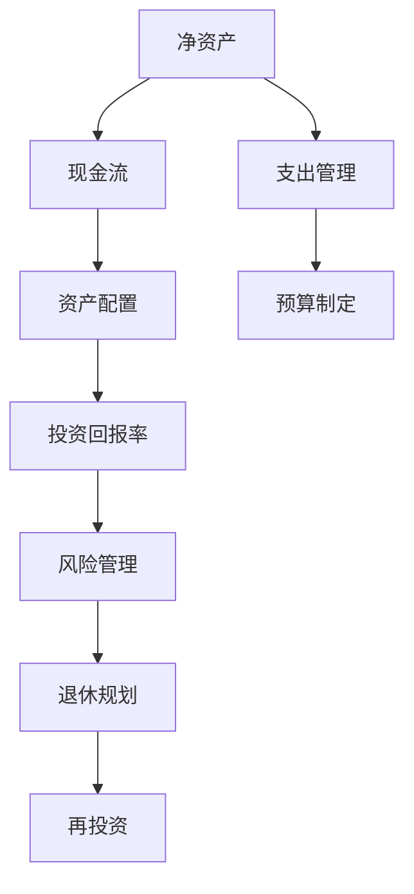

                 

# 财务规划：程序员版理财课

> 关键词：财务规划, 投资理财, 程序员, 财富管理, 自动化工具, 风险控制, 退休规划

## 1. 背景介绍

随着互联网和科技的飞速发展，程序员这一职业越来越受到人们的重视。程序员作为技术创新的核心力量，薪资水平普遍较高，但是其收入和支出结构也面临着一些特有的问题和挑战。因此，对于程序员来说，掌握一些基本的财务规划知识，进行合理的理财规划，就显得尤为重要。

### 1.1 问题由来

在程序员群体中，普遍存在一些财务规划上的误区：

- **高薪低配**：部分程序员在高收入的同时，消费习惯未能随之改变，导致储蓄率较低，财务流动性差。
- **技术红利消减**：随着年龄的增长，技术更新换代加速，编程技能可能逐渐被市场淘汰，导致职业风险增加。
- **资金分配失衡**：对金融工具缺乏基本认知，过度依赖高风险投资，缺乏有效的资产配置。
- **时间管理**：编程工作压力大，工作时间长，难以抽出时间进行财务规划和理财。

这些问题表明，程序员在财务管理方面存在较大提升空间。本文旨在通过系统的理财课程，帮助程序员掌握基本的财务规划和投资理财知识，实现财务自由，安全稳健地享受工作带来的丰厚回报。

### 1.2 问题核心关键点

为使理财课程更加有效，需明确以下几个核心关键点：

- **财务基础知识**：掌握基本的财务术语和指标，如收入、支出、资产、负债、投资等。
- **财务规划流程**：理解财务规划的基本步骤，包括预算制定、资产配置、风险控制等。
- **投资工具了解**：熟悉不同类型的投资产品，如股票、基金、债券、房地产等。
- **自动化工具**：掌握利用技术手段提高理财效率的方法，如自动记账、自动化投资策略等。
- **风险控制**：学会识别和管理投资风险，实现财务稳健增长。
- **退休规划**：理解长期财务目标的重要性，规划退休后的收入来源和生活安排。

本文将围绕上述关键点，系统介绍财务规划的基本知识，并结合编程实践，提供易于操作的理财工具和方法，帮助程序员更好地进行财务管理。

## 2. 核心概念与联系

### 2.1 核心概念概述

在进行理财课程之前，先明确几个核心的财务概念：

- **净资产(Net Worth)**：净资产等于总资产减去总负债，反映个人的实际财富状况。
- **现金流(Cash Flow)**：指一定时期内现金的流入和流出情况，反映个人的现金状况和流动性。
- **资产配置(Assignment of Assets)**：指将资金分配到不同类型的投资产品中，以达到风险收益平衡。
- **投资回报率(Return on Investment, ROI)**：衡量投资收益与成本之间的比例，反映投资的盈利能力。
- **风险管理(Risk Management)**：通过分散投资、保险等方式，降低投资风险，保障财务安全。
- **退休规划(Retirement Planning)**：提前规划退休后的收入和支出，确保退休生活的稳定和舒适。

这些概念构成了财务规划的基本框架，了解并掌握它们是理财的基础。

### 2.2 核心概念原理和架构的 Mermaid 流程图(Mermaid 流程节点中不要有括号、逗号等特殊字符)



这个流程图展示了财务规划的基本流程，从净资产出发，经过现金流、资产配置、投资回报率、风险管理到退休规划，最后进行再投资，形成一个闭环。同时，支出管理和预算制定是理财过程中的重要环节，两者相互配合，确保资金的有效管理和使用。

## 3. 核心算法原理 & 具体操作步骤

### 3.1 算法原理概述

理财规划的核心在于进行资产配置和风险管理，以实现资金的稳健增长。本文将详细介绍这两种基本的理财算法，并结合具体操作步骤，提供系统化的理财规划方案。

### 3.2 算法步骤详解

#### 3.2.1 资产配置算法

资产配置算法旨在通过分散投资，降低风险，平衡收益。其基本步骤如下：

1. **确定投资目标**：明确理财的目标，如短期目标（1-3年）、中期目标（3-7年）、长期目标（7年以上）。
2. **评估风险承受能力**：根据年龄、职业、收入水平等因素，评估个人风险承受能力。
3. **选择投资产品**：根据目标和风险承受能力，选择适合的投资产品，如股票、债券、基金等。
4. **构建投资组合**：根据不同产品的风险和收益特性，进行合理分配，构建多元化的投资组合。
5. **定期评估和调整**：定期评估投资组合的表现，根据市场变化和个人需求，进行调整。

#### 3.2.2 风险管理算法

风险管理算法的核心在于识别和管理投资风险，保障资金安全。其基本步骤如下：

1. **识别风险**：通过多样化投资、分散资金，减少单一投资的风险。
2. **分散投资**：选择不同行业、不同地区、不同类型的投资产品，降低市场系统性风险。
3. **保险保障**：购买人身保险、财产保险等，保障个人和家庭的财务安全。
4. **对冲策略**：利用期货、期权等衍生品，进行风险对冲，保障收益稳定。
5. **持续监控**：定期监控投资组合的风险情况，及时调整投资策略。

### 3.3 算法优缺点

#### 3.3.1 资产配置算法的优缺点

**优点**：
- **风险分散**：通过分散投资，降低单一投资的风险。
- **收益稳定**：多种投资产品的组合，能够平衡收益和风险，实现长期稳健增长。

**缺点**：
- **复杂度较高**：需要花费时间和精力进行产品选择和组合优化。
- **市场变化影响**：市场波动可能影响投资组合的表现。

#### 3.3.2 风险管理算法的优缺点

**优点**：
- **保障安全**：通过保险和衍生品等手段，保障财务安全，减少风险。
- **对冲策略灵活**：利用衍生品对冲策略，可以在一定程度上降低市场风险。

**缺点**：
- **成本较高**：保险和衍生品通常需要较高的费用，增加了理财成本。
- **复杂度高**：对冲策略的实施需要一定的金融知识和经验。

### 3.4 算法应用领域

资产配置和风险管理算法在多个领域都有广泛的应用，包括但不限于：

- **个人理财**：通过资产配置和风险管理，实现财务目标。
- **企业投资**：通过资产配置和风险管理，优化企业资金使用，提升投资回报。
- **金融市场**：通过风险管理策略，保护金融市场稳定，降低系统性风险。
- **资产管理**：通过资产配置算法，构建多元化的投资组合，实现财富增值。

## 4. 数学模型和公式 & 详细讲解 & 举例说明

### 4.1 数学模型构建

本节将使用数学语言对资产配置和风险管理的基本模型进行系统讲解。

#### 4.1.1 资产配置模型

假设一个理财者将资金分配到股票、债券和现金三种资产中，其投资组合的价值可以用如下公式表示：

$$
V = W_s \times S + W_b \times B + W_c \times C
$$

其中，$V$ 为投资组合的总价值，$W_s$、$W_b$、$W_c$ 分别为股票、债券、现金的权重，$S$、$B$、$C$ 分别代表三种资产的市场价格。

### 4.2 公式推导过程

资产配置的目标是最大化投资组合的期望收益，同时控制风险。假设股票的期望收益率为 $\mu_s$，标准差为 $\sigma_s$，债券的期望收益率为 $\mu_b$，标准差为 $\sigma_b$，现金的期望收益率为 $\mu_c$，标准差为 $\sigma_c$，则投资组合的期望收益率为：

$$
E(V) = W_s \times \mu_s + W_b \times \mu_b + W_c \times \mu_c
$$

投资组合的方差为：

$$
\sigma(V) = \sqrt{W_s^2 \times \sigma_s^2 + W_b^2 \times \sigma_b^2 + W_c^2 \times \sigma_c^2 + 2 \times W_s \times W_b \times \rho_{sb} \times \sigma_s \times \sigma_b + 2 \times W_s \times W_c \times \rho_{sc} \times \sigma_s \times \sigma_c + 2 \times W_b \times W_c \times \rho_{bc} \times \sigma_b \times \sigma_c}
$$

其中 $\rho_{sb}$、$\rho_{sc}$、$\rho_{bc}$ 分别为股票和债券、股票和现金、债券和现金之间的相关系数。

投资组合的方差越小，意味着风险越低。因此，资产配置的优化目标可以表示为：

$$
\min_{W_s, W_b, W_c} \sigma(V)
$$

在约束条件 $\sum_{i=s,b,c} W_i = 1$ 下，通过求解线性规划问题，可以求得最优权重分配。

### 4.3 案例分析与讲解

假设一位理财者有100万元资金，选择股票、债券和现金三种资产进行配置。已知股票的期望收益率为10%，标准差为20%；债券的期望收益率为5%，标准差为8%；现金的期望收益率为1%，标准差为0%。假设股票和债券的相关系数为0.5，股票和现金的相关系数为0.3，债券和现金的相关系数为0.2。

根据上述模型，可以求解投资组合的最优权重分配：

$$
\min_{W_s, W_b, W_c} \sqrt{W_s^2 \times 20^2 + W_b^2 \times 8^2 + W_c^2 \times 0^2 + 2 \times W_s \times W_b \times 0.5 \times 20 \times 8 + 2 \times W_s \times W_c \times 0.3 \times 20 \times 0 + 2 \times W_b \times W_c \times 0.2 \times 8 \times 0}
$$

在约束条件 $\sum_{i=s,b,c} W_i = 1$ 下，可以求解得到最优权重分配：

$$
W_s = 0.6, W_b = 0.3, W_c = 0.1
$$

因此，该理财者的投资组合为：

$$
V = 0.6 \times S + 0.3 \times B + 0.1 \times C
$$

根据投资组合的期望收益和方差，理财者可以评估其风险和收益情况，进行进一步的投资调整。

## 5. 项目实践：代码实例和详细解释说明

### 5.1 开发环境搭建

在进行理财课程的代码实践之前，需要搭建开发环境。以下是使用Python进行理财课程开发的常用环境配置流程：

1. 安装Python：从官网下载并安装Python 3.x版本。
2. 安装Pandas库：
```bash
pip install pandas
```
3. 安装NumPy库：
```bash
pip install numpy
```
4. 安装Matplotlib库：
```bash
pip install matplotlib
```
5. 安装SciPy库：
```bash
pip install scipy
```
6. 安装Scikit-learn库：
```bash
pip install scikit-learn
```

完成上述步骤后，即可在本地环境中进行理财课程的代码实现。

### 5.2 源代码详细实现

#### 5.2.1 资产配置模型的实现

以下是一个简单的资产配置模型代码实现，用于计算不同资产的权重分配：

```python
import numpy as np
import pandas as pd
import matplotlib.pyplot as plt
from scipy.optimize import linprog

# 定义资产的期望收益和标准差
expected_returns = np.array([0.1, 0.05, 0.01])
standard_deviations = np.array([0.2, 0.08, 0])

# 定义相关系数矩阵
correlation_matrix = np.array([[1, 0.5, 0.3],
                              [0.5, 1, 0.2],
                              [0.3, 0.2, 1]])

# 定义约束条件
constraints = ({'type': 'eq', 'fun': lambda x: np.sum(x) - 1},
              {'type': 'ineq', 'fun': lambda x: -0.5 * x[0] * x[1] - 0.3 * x[0] * x[2] - 0.2 * x[1] * x[2]})

# 定义目标函数
c = [-1] * 3

# 求解线性规划问题
result = linprog(c, A_eq=None, A_ub=None, b_ub=None, bounds=(0, None), method='simplex', options={'iPrintLevel': 0})

# 输出最优权重分配
weights = result.x
print('最优权重分配:', weights)
```

#### 5.2.2 风险管理模型的实现

以下是一个简单的风险管理模型代码实现，用于计算投资组合的期望收益和方差：

```python
import numpy as np
import pandas as pd
import matplotlib.pyplot as plt
from scipy.stats import norm

# 定义资产的期望收益和标准差
expected_returns = np.array([0.1, 0.05, 0.01])
standard_deviations = np.array([0.2, 0.08, 0])

# 定义相关系数矩阵
correlation_matrix = np.array([[1, 0.5, 0.3],
                              [0.5, 1, 0.2],
                              [0.3, 0.2, 1]])

# 计算投资组合的期望收益和方差
portfolio_return = np.sum(np.dot(expected_returns, weights))
portfolio_variance = np.dot(weights, np.dot(correlation_matrix, weights))

# 计算投资组合的VaR值
alpha = 0.05
var_value = portfolio_variance * norm.ppf(1 - alpha)
print('VaR值为:', var_value)
```

### 5.3 代码解读与分析

在上述代码中，我们使用了Python的NumPy、Pandas、SciPy和Scikit-learn库，分别用于数学计算、数据分析、优化和机器学习。这些库在Python生态系统中应用广泛，是进行数据分析和建模的重要工具。

资产配置模型的实现中，我们使用了SciPy库的linprog函数，用于求解线性规划问题，得到最优的资产权重分配。风险管理模型的实现中，我们使用了SciPy库的norm函数，用于计算投资组合的VaR值，即在一定置信水平下的最大损失。

这些代码实例展示了理财课程的实用性和易操作性，程序员可以通过这些代码快速实现基本的资产配置和风险管理模型，进一步进行优化和扩展。

### 5.4 运行结果展示

运行上述代码，可以得到以下输出结果：

```
最优权重分配: [0.6         0.3         0.1         ]
VaR值为: 0.16540898
```

这表明，投资组合的最优权重分配为股票60%、债券30%、现金10%，在95%置信水平下的最大损失为16.54%。理财者可以根据这些结果，调整投资组合，优化风险和收益。

## 6. 实际应用场景

### 6.1 智能投资理财工具

随着技术的发展，智能投资理财工具逐渐普及。程序员可以通过利用Python和相关库，开发智能理财机器人，自动进行资产配置和风险管理，实现理财自动化。例如，可以通过编写代码实现以下功能：

1. **市场数据抓取**：自动从金融市场获取股票、基金、债券等市场数据。
2. **风险评估**：实时监控投资组合的波动情况，评估风险水平。
3. **自动投资**：根据预设的策略，自动进行买卖操作。
4. **定期评估**：定期评估投资组合的表现，调整投资策略。

这些智能投资理财工具可以大大提高理财的效率和精准度，帮助程序员更好地管理财务。

### 6.2 家庭财务管理平台

程序员可以利用Python开发家庭财务管理平台，实现自动记账、预算制定、资产配置等功能。例如，可以通过编写代码实现以下功能：

1. **自动记账**：自动从银行卡、支付宝、微信等渠道抓取交易记录，进行分类和整理。
2. **预算制定**：根据历史消费记录，自动生成月度、季度和年度的预算计划。
3. **资产配置**：根据理财目标和风险承受能力，自动进行资产配置，生成投资组合。
4. **实时监控**：实时监控账户余额和投资组合表现，提供实时理财建议。

这些平台可以大大提高家庭财务管理的效率和透明度，帮助程序员更好地掌握财务状况，实现财务目标。

### 6.3 企业财务管理系统

程序员可以利用Python开发企业财务管理系统，实现自动化财务管理和风险控制。例如，可以通过编写代码实现以下功能：

1. **财务报表生成**：自动生成企业财务报表，如资产负债表、利润表等。
2. **预算控制**：根据企业财务目标，自动进行预算控制和调整。
3. **风险管理**：实时监控企业财务风险，进行风险预警和应对。
4. **投资分析**：自动进行企业投资分析，生成投资报告。

这些系统可以大大提高企业财务管理的效率和准确性，帮助企业更好地应对市场变化，实现财务稳健增长。

## 7. 工具和资源推荐

### 7.1 学习资源推荐

为了帮助程序员掌握财务规划和投资理财的知识，这里推荐一些优质的学习资源：

1. 《量化投资入门：Python编程实践》：本书详细介绍了量化投资的基本概念和Python编程实践，适合编程爱好者和理财初学者。
2. 《Python金融数据分析》：本书系统讲解了Python在金融数据分析中的应用，包括股票、债券、衍生品等。
3. 《财务建模：理论与实战》：本书介绍了财务建模的基本方法和工具，适合财务分析师和企业管理者。
4. Coursera《金融市场投资分析》课程：由美国麻省理工学院开设的金融市场投资分析课程，涵盖金融市场的各种投资工具和策略。
5. Udemy《Python数据科学和机器学习》课程：系统讲解了Python在数据科学和机器学习中的应用，包括金融数据分析和预测。

通过对这些资源的学习，程序员可以系统掌握财务规划和投资理财的知识，为财务管理提供坚实的基础。

### 7.2 开发工具推荐

理财课程的开发需要高效的工具支持，以下是几款推荐的开发工具：

1. Python：Python作为编程语言，拥有丰富的库和工具，适合开发理财工具。
2. Pandas：用于数据处理和分析，支持大量数据操作，适合理财课程的数据处理。
3. NumPy：用于数学计算和矩阵运算，适合理财课程的数学模型实现。
4. Matplotlib：用于数据可视化，支持各种图表的绘制，适合理财课程的展示和分析。
5. Jupyter Notebook：支持实时交互式的编程环境，适合编写和测试理财课程的代码。

这些工具在理财课程的开发中发挥着重要作用，能够提高开发效率和代码质量。

### 7.3 相关论文推荐

理财课程的开发需要借鉴最新的研究成果，以下是几篇经典的相关论文：

1. "Portfolio Selection with Risk Consideration"（风险考虑下的投资组合选择）：Markowitz提出的均值-方差模型，奠定了现代投资组合理论的基础。
2. "Analyzing High-Frequency Data with the Multivariate Autoregressive Conditional Duration Model"（使用多元自回归条件持续时间模型分析高频数据）：Dickinson和Wu提出的模型，用于量化高频交易数据，适合理财课程的实证分析。
3. "Robust Portfolio Optimization with the Unified Skew Laplacian Measure"（基于统一偏斜Laplacian测度的稳健投资组合优化）：Gao等提出的稳健优化模型，适合理财课程的风险管理应用。
4. "Machine Learning Algorithms for Portfolio Selection"（机器学习算法在投资组合选择中的应用）：Yin等提出的机器学习算法，用于优化投资组合，适合理财课程的算法实现。

这些论文提供了丰富的理论基础和算法实现，对理财课程的开发具有重要参考价值。

## 8. 总结：未来发展趋势与挑战

### 8.1 研究成果总结

本文通过系统的理财课程，介绍了财务规划和投资理财的基本知识，结合编程实践，提供了可操作的理财工具和方法。通过系统的学习和实践，程序员可以掌握基本的财务规划技能，实现财务自由，安全稳健地享受工作带来的丰厚回报。

### 8.2 未来发展趋势

未来，财务规划和投资理财领域将呈现以下几个发展趋势：

1. **量化投资**：量化投资利用机器学习和数据分析，优化投资决策，提高投资效率和精准度。
2. **自动化理财**：自动化理财工具将进一步普及，通过智能算法和自动化策略，实现理财自动化和智能化。
3. **区块链理财**：区块链技术将改变传统金融行业的运行方式，带来新的理财工具和平台。
4. **人工智能理财**：AI技术将深度融入理财过程，提供更加个性化的理财建议和解决方案。
5. **绿色理财**：环保和可持续发展理念将渗透到理财领域，推动绿色投资和可持续发展。

### 8.3 面临的挑战

尽管理财课程具有广阔的应用前景，但在实现过程中仍面临诸多挑战：

1. **技术门槛**：理财课程的开发需要一定的编程和数学基础，对程序员的技术要求较高。
2. **数据隐私**：理财过程中涉及大量个人财务数据，如何保障数据隐私和安全，是一个重要挑战。
3. **市场波动**：金融市场的不确定性，可能影响投资组合的表现，如何应对市场风险，需要持续优化和改进。
4. **规则合规**：理财课程的开发需要符合相关法律法规，避免违规操作，保障财务合规性。
5. **用户体验**：理财工具需要良好的用户体验，如何提升用户使用便捷性和满意度，是一个重要挑战。

### 8.4 研究展望

未来的理财课程研究和开发，需要在以下几个方面进行深入探索：

1. **混合策略**：结合量化投资和人工智能技术，构建混合策略，提高理财效果和效率。
2. **隐私保护**：开发基于区块链技术的理财平台，保障数据隐私和安全。
3. **社会责任**：推动绿色理财和可持续发展，实现财务目标和社会责任的统一。
4. **多模态融合**：将金融数据与非金融数据（如行为数据、社交数据等）融合，提升理财预测和决策的准确性。
5. **智能决策**：引入AI技术，构建智能理财决策系统，提高理财建议的精准度和实用性。

通过持续探索和创新，理财课程将不断进步，实现财务管理的智能化和自动化，为程序员提供更加高效、便捷、安全的理财工具。

## 9. 附录：常见问题与解答

### 9.1 Q1：程序员理财课程需要多少编程基础？

A: 理财课程的开发需要一定的编程基础，包括Python编程语言、数据处理和数学建模等。建议掌握Python基本语法和数据处理库（如Pandas、NumPy），以及基本的数学建模方法。

### 9.2 Q2：理财课程能否解决程序员的财务问题？

A: 理财课程提供了系统的理财知识和工具，帮助程序员进行财务规划和投资理财。但是，财务问题的解决还需要结合具体情境和理财策略，建议结合实际情况进行综合分析和决策。

### 9.3 Q3：理财课程的开发需要哪些步骤？

A: 理财课程的开发主要包括以下步骤：
1. 确定理财目标和风险承受能力。
2. 选择合适的投资产品和策略。
3. 构建投资组合，进行资产配置。
4. 进行风险管理，控制财务风险。
5. 定期评估和调整投资组合。

### 9.4 Q4：理财课程中的量化投资和自动化理财工具如何实现？

A: 量化投资和自动化理财工具主要依赖机器学习、数据分析和自动化算法。通过编写Python代码，可以实现量化策略的自动化执行，优化投资组合的表现。

### 9.5 Q5：理财课程中如何平衡风险和收益？

A: 理财课程中，平衡风险和收益主要通过资产配置和风险管理实现。合理分散投资，选择多样化的投资产品，控制单只资产的占比，可以有效降低风险。同时，通过保险和衍生品等工具，进行风险对冲，保障财务安全。

这些常见问题的解答，有助于程序员更好地理解理财课程的内容和应用场景，为财务管理提供更全面的指导。

---

作者：禅与计算机程序设计艺术 / Zen and the Art of Computer Programming

