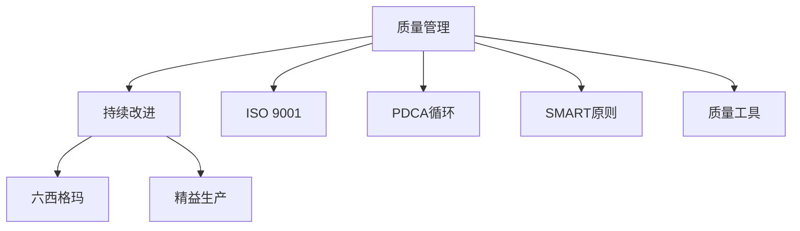

                 

# 质量管理：追求卓越的持续改进之路

> 关键词：质量管理，持续改进，六西格玛，精益生产，ISO 9001，PDCA循环，SMART原则，质量工具，员工参与

## 1. 背景介绍

### 1.1 问题由来
在现代工业生产和社会服务中，质量管理已成为提升企业竞争力和客户满意度的关键因素。传统的质量管理方法，如质量检验、批量生产、事后修复，已难以满足市场需求的多样化和个性化趋势。通过持续改进，不断优化流程、提升产品质量，成为了企业追求卓越的重要途径。

近年来，随着信息技术和大数据分析的发展，质量管理也逐步引入了数据驱动和全员参与的现代管理模式。利用先进的质量工具和方法，企业能够更加精准地识别问题、分析和改进流程，从而实现质量管理的持续提升。

### 1.2 问题核心关键点
质量管理的核心在于通过系统的方法，持续改进产品和服务质量。其关键点包括：
- **数据驱动**：利用大数据分析技术，识别质量问题的根本原因，预测未来风险。
- **全员参与**：鼓励员工提出改善建议，参与质量改进活动。
- **持续改进**：通过PDCA循环等方法，不断优化流程和提升质量。
- **标准化管理**：引入ISO 9001等标准，确保质量管理流程规范化、可追溯。
- **性能提升**：通过精益生产、六西格玛等方法，提升生产效率和产品质量。

这些关键点构成了现代质量管理的框架，帮助企业在复杂多变的环境中保持领先地位。

## 2. 核心概念与联系

### 2.1 核心概念概述

为更好地理解质量管理的核心概念，本节将介绍几个密切相关的核心概念：

- **质量管理(Quality Management)**：通过系统化的管理和技术手段，确保产品和服务达到客户和法律法规要求的过程。
- **持续改进(Continuous Improvement)**：不断优化流程和提升质量，以适应市场需求和环境变化的过程。
- **六西格玛(Six Sigma)**：通过严格的数据分析和流程控制，实现过程质量的无缺陷率达到99.99966%的管理方法。
- **精益生产(Lean Production)**：通过消除浪费、优化流程，提升生产效率和产品质量的方法。
- **ISO 9001**：国际标准化组织制定的质量管理体系标准，用于指导企业建立和改进质量管理体系。
- **PDCA循环**：Plan-Do-Check-Act的循环，通过不断计划、执行、检查和改进，提升质量管理的效果。
- **SMART原则**：目标设置应具有Specific(具体的)、Measurable(可衡量的)、Achievable(可实现的)、Relevant(相关的)、Time-bound(有时限的)的特点。
- **质量工具**：如鱼骨图、5W1H、控制图等，用于辅助识别问题、分析和改进。

这些核心概念之间的逻辑关系可以通过以下Mermaid流程图来展示：



这个流程图展示了几项核心概念及其之间的关系：

1. 质量管理通过PDCA循环、SMART原则等方法，持续改进流程，提升质量。
2. 六西格玛和精益生产是质量管理的两个重要工具，分别通过数据驱动和流程优化，实现质量的无缺陷率和效率提升。
3. ISO 9001标准为质量管理提供规范化的框架，确保质量管理流程的标准化和可追溯性。
4. 质量工具如鱼骨图、5W1H、控制图等，辅助质量问题的识别、分析和改进。

这些概念共同构成了现代质量管理的核心框架，帮助企业在复杂多变的环境中保持领先地位。

## 3. 核心算法原理 & 具体操作步骤

### 3.1 算法原理概述

质量管理的核心算法原理主要包括数据驱动、全员参与和持续改进等几个方面：

- **数据驱动**：通过收集和分析数据，识别质量问题的根本原因，预测未来风险。
- **全员参与**：鼓励员工提出改善建议，参与质量改进活动，形成全员参与的质量管理文化。
- **持续改进**：通过PDCA循环等方法，不断优化流程和提升质量。

### 3.2 算法步骤详解

#### 数据驱动
1. **数据收集**：利用传感器、监控系统等技术，实时收集生产过程中的各项数据。
2. **数据分析**：通过统计分析、机器学习等方法，识别数据中的异常点和趋势。
3. **原因分析**：利用鱼骨图、5W1H等工具，深入分析数据背后的原因。
4. **风险预测**：利用时间序列预测、回归分析等方法，预测未来风险点，制定防范措施。

#### 全员参与
1. **培训和激励**：定期对员工进行质量管理培训，建立质量改进激励机制。
2. **参与决策**：鼓励员工参与质量改进决策过程，提出创新建议。
3. **反馈机制**：建立质量反馈机制，及时处理员工反馈，持续改进质量管理流程。

#### 持续改进
1. **PDCA循环**：按照Plan(计划)、Do(执行)、Check(检查)、Act(改进)的顺序，不断优化质量管理流程。
2. **SMART原则**：设定具体的、可衡量的、可实现的、相关的、有时限的目标，指导质量改进活动。
3. **质量工具应用**：根据实际需要，选择适合的鱼骨图、控制图、流程图等工具，辅助质量改进。

### 3.3 算法优缺点

数据驱动的质量管理方法具有以下优点：
- **客观性**：通过数据分析，避免主观判断，提高决策的准确性。
- **可预测性**：利用预测模型，提前识别问题，降低风险。
- **过程透明**：数据驱动的流程管理，使得质量管理过程透明化，便于监控和改进。

但数据驱动也存在一定的局限性：
- **数据依赖**：依赖高质量的数据，如果数据不完整或不准确，可能导致误判。
- **技术门槛**：需要一定的数据分析和机器学习技术，技术门槛较高。
- **动态适应**：面对环境变化，数据驱动方法需要快速调整和更新数据模型，工作量较大。

全员参与的质量管理方法具有以下优点：
- **提升士气**：员工参与决策，增加归属感和积极性。
- **多元化视角**：员工来自不同岗位，提供多样化的视角和建议。
- **即时反馈**：员工能够及时反馈问题，快速响应和改进。

全员参与也存在一些挑战：
- **管理协调**：如何平衡员工意见和组织目标，需要良好的管理协调。
- **文化建设**：需要建立开放、包容的质量改进文化，逐步推广。
- **资源投入**：培训和激励员工参与，需要一定的资源投入。

持续改进的质量管理方法具有以下优势：
- **不断优化**：通过PDCA循环，不断优化流程和提升质量。
- **适应变化**：PDCA循环的灵活性，使得质量管理适应环境变化。
- **过程透明**：持续改进过程透明化，便于监控和改进。

但持续改进也面临以下挑战：
- **执行难度**：每个PDCA循环需要投入大量时间和资源，难以快速见效。
- **目标设定**：需要设定具体的、可衡量的目标，才能进行有效的持续改进。
- **资源投入**：持续改进需要持续投入人力和物力资源，短期内难以见效。

### 3.4 算法应用领域

质量管理方法广泛应用于各个行业，如制造业、服务业、医疗卫生等。以下是几个典型的应用场景：

- **制造业**：通过六西格玛和精益生产，提升生产效率和产品质量。
- **服务业**：通过客户反馈和持续改进，提升客户满意度和服务质量。
- **医疗卫生**：通过ISO 9001和持续改进，提高医疗服务质量和患者安全。
- **物流行业**：通过数据分析和质量工具，提升物流效率和客户满意度。
- **金融行业**：通过风险预测和持续改进，提升风险管理和客户服务质量。

## 4. 数学模型和公式 & 详细讲解 & 举例说明

### 4.1 数学模型构建

质量管理中的数学模型主要涉及数据驱动和持续改进两个方面。以下分别介绍这两种模型的构建方法：

#### 数据驱动模型
1. **数据收集与预处理**
   - 定义变量：设 $X_1, X_2, ..., X_n$ 为影响产品质量的各个因素，$Y$ 为目标变量（如产品缺陷率）。
   - 数据预处理：通过中心化、归一化等方法，预处理数据，使其符合建模要求。

2. **数据建模**
   - 线性回归模型：设 $y_i = \beta_0 + \beta_1 x_{1,i} + ... + \beta_k x_{k,i} + \epsilon_i$，其中 $\beta_j$ 为回归系数，$\epsilon_i$ 为随机误差项。
   - 时间序列模型：设 $y_t = \alpha + \beta t + \gamma B_t + \epsilon_t$，其中 $B_t$ 为季节性因素，$\epsilon_t$ 为随机误差项。

3. **模型评估**
   - 残差分析：通过残差图、Q-Q图等方法，评估模型拟合效果。
   - 预测检验：利用交叉验证等方法，评估模型预测效果。

#### 持续改进模型
1. **PDCA循环**
   - Plan（计划）：设定目标、识别问题、制定改进措施。
   - Do（执行）：实施改进措施，记录执行情况。
   - Check（检查）：评估改进效果，分析改进后的数据。
   - Act（改进）：根据检查结果，进行下一步改进。

2. **SMART原则**
   - Specific（具体的）：目标明确，不模糊。
   - Measurable（可衡量的）：能够量化和评估。
   - Achievable（可实现的）：符合实际情况，不脱离现实。
   - Relevant（相关的）：与业务目标相关。
   - Time-bound（有时限的）：设定完成期限。

### 4.2 公式推导过程

#### 数据驱动公式推导
1. **线性回归模型推导**
   - 最小二乘法：$[\beta] = \arg\min_{\beta} \sum_{i=1}^n (y_i - \hat{y}_i)^2$，其中 $\hat{y}_i = \beta_0 + \beta_1 x_{1,i} + ... + \beta_k x_{k,i}$。
   - 求解过程：通过求导，得到 $\beta_j = \frac{\sum_{i=1}^n x_{j,i}y_i - \sum_{i=1}^n x_{j,i}\bar{y}}{\sum_{i=1}^n x_{j,i}x_{j,i} - \sum_{i=1}^n x_{j,i}\bar{x}}$。

2. **时间序列模型推导**
   - 自回归移动平均模型：$y_t = \alpha + \beta t + \gamma \sum_{i=1}^p \phi_i B_{t-i} + \epsilon_t$，其中 $B_t$ 为季节性因素，$\epsilon_t$ 为随机误差项。
   - 求解过程：通过最小二乘法或极大似然估计，求解 $\alpha, \beta, \gamma, \phi_i$。

#### 持续改进公式推导
1. **PDCA循环**
   - Plan阶段：设定具体、可衡量的目标，如改进设备精度、降低缺陷率等。
   - Do阶段：实施改进措施，记录执行过程和结果。
   - Check阶段：评估改进效果，通过统计分析、对比实验等方法，评估改进效果。
   - Act阶段：根据Check阶段的结果，进行下一步改进，如调整改进措施、优化流程等。

2. **SMART原则**
   - 目标设定公式：$T = S + M + A + R + T$，其中 $S$ 为Specific，$M$ 为Measurable，$A$ 为Achievable，$R$ 为Relevant，$T$ 为Time-bound。

### 4.3 案例分析与讲解

#### 案例一：制造业的六西格玛改进
某汽车制造企业通过实施六西格玛方法，提高了生产效率和产品质量。具体步骤如下：
1. **数据收集**：收集生产过程中的各项数据，包括设备运行状态、操作员技能、材料质量等。
2. **原因分析**：利用鱼骨图分析数据，识别影响生产效率和产品质量的关键因素。
3. **过程优化**：优化生产流程，如改进设备精度、调整操作参数等。
4. **效果评估**：利用控制图、散点图等工具，评估改进效果。

#### 案例二：服务业的客户满意度提升
某电商平台通过持续改进，提升了客户满意度。具体步骤如下：
1. **客户反馈收集**：定期收集客户反馈，识别常见问题和改进需求。
2. **问题分析**：利用5W1H工具，分析客户问题的根本原因。
3. **流程优化**：优化服务流程，如提升客户支持效率、改进产品质量等。
4. **效果评估**：通过客户满意度调查、客户流失率等指标，评估改进效果。

## 5. 项目实践：代码实例和详细解释说明

### 5.1 开发环境搭建

在进行质量管理项目实践前，我们需要准备好开发环境。以下是使用Python进行数据分析和质量改进的开发环境配置流程：

1. 安装Anaconda：从官网下载并安装Anaconda，用于创建独立的Python环境。

2. 创建并激活虚拟环境：
```bash
conda create -n qm_env python=3.8 
conda activate qm_env
```

3. 安装相关库：
```bash
conda install pandas numpy statsmodels matplotlib seaborn sklearn statsmodels
```

完成上述步骤后，即可在`qm_env`环境中开始质量管理项目的开发和实践。

### 5.2 源代码详细实现

下面以制造业的六西格玛改进为例，给出使用Python进行数据分析和质量改进的代码实现。

首先，定义数据集：

```python
import pandas as pd

# 读取数据集
data = pd.read_csv('production_data.csv')

# 数据预览
print(data.head())
```

然后，进行数据预处理：

```python
from sklearn.preprocessing import StandardScaler

# 数据中心化和归一化
scaler = StandardScaler()
scaled_data = scaler.fit_transform(data)

# 数据分组和统计
grouped_data = scaled_data.groupby('device').mean()

# 数据可视化
import matplotlib.pyplot as plt

plt.plot(grouped_data.index, grouped_data['yield'], marker='o')
plt.xlabel('Device')
plt.ylabel('Yield')
plt.title('Device Yield')
plt.show()
```

接着，构建线性回归模型：

```python
from sklearn.linear_model import LinearRegression

# 划分训练集和测试集
X_train = grouped_data.drop(['yield'], axis=1)
y_train = grouped_data['yield']
X_test = grouped_data.drop(['yield'], axis=1)
y_test = grouped_data['yield']

# 训练模型
model = LinearRegression()
model.fit(X_train, y_train)

# 预测和评估
y_pred = model.predict(X_test)
print('R^2 score:', model.score(X_test, y_test))
```

最后，进行质量改进效果评估：

```python
from statsmodels.tsa.stattools import acf, pacf

# 自相关和偏自相关分析
acf_result = acf(y_test)
pacf_result = pacf(y_test)

# 绘制自相关图和偏自相关图
plt.figure(figsize=(12, 8))
plt.subplot(2, 1, 1)
plt.plot(acf_result)
plt.title('Autocorrelation Plot')
plt.subplot(2, 1, 2)
plt.plot(pacf_result)
plt.title('Partial Autocorrelation Plot')
plt.show()
```

以上代码展示了如何使用Python进行数据分析和质量改进的具体实现。

### 5.3 代码解读与分析

让我们再详细解读一下关键代码的实现细节：

**数据集定义**：
- 使用pandas库读取数据集，并进行初步预览。

**数据预处理**：
- 利用sklearn库的StandardScaler对数据进行中心化和归一化，以符合建模要求。
- 利用groupby方法对数据进行分组统计，绘制设备产量随时间变化的趋势图。

**线性回归模型构建**：
- 将数据分为训练集和测试集，利用LinearRegression库建立线性回归模型，并进行预测和评估。
- 利用R^2 score评估模型预测效果，确保模型具有良好的拟合能力。

**质量改进效果评估**：
- 使用statsmodels库的acf和pacf函数进行自相关和偏自相关分析，绘制自相关图和偏自相关图，评估模型预测效果。

可以看到，Python在质量管理中的应用非常灵活，通过简单的代码实现，可以完成数据分析和质量改进的各个环节。开发者可以根据实际需求，选择适合的库和方法，快速迭代和优化代码。

## 6. 实际应用场景

### 6.1 制造业的精益生产

制造业是质量管理的重要应用领域，通过精益生产方法，可以大幅提升生产效率和产品质量。

具体而言，可以采用以下步骤：
1. **价值流分析**：识别生产流程中的非增值活动，优化生产布局。
2. **流程优化**：通过5S、JIT等方法，消除浪费，提升生产效率。
3. **员工培训**：提升员工技能和意识，优化操作流程。
4. **持续改进**：利用PDCA循环和SMART原则，持续优化生产流程。

通过以上步骤，制造业企业可以逐步实现精益生产，提升生产效率和产品质量，降低成本，提高竞争力。

### 6.2 服务业的客户满意度提升

服务业质量管理的关键在于提升客户满意度，通过持续改进方法，可以不断优化服务流程，提升服务质量。

具体而言，可以采用以下步骤：
1. **客户反馈收集**：定期收集客户反馈，识别常见问题和改进需求。
2. **问题分析**：利用5W1H工具，分析客户问题的根本原因。
3. **流程优化**：优化服务流程，如提升客户支持效率、改进产品质量等。
4. **效果评估**：通过客户满意度调查、客户流失率等指标，评估改进效果。

通过以上步骤，服务业企业可以逐步提升客户满意度，优化服务流程，提高客户忠诚度和口碑。

### 6.3 医疗卫生行业的质量管理

医疗卫生行业对质量管理的要求极高，通过ISO 9001等标准，可以确保医疗服务的质量和患者安全。

具体而言，可以采用以下步骤：
1. **标准体系建设**：建立ISO 9001质量管理体系，确保各项流程和操作标准化、可追溯。
2. **过程监控**：利用质量工具和方法，如控制图、流程图等，监控医疗服务过程。
3. **持续改进**：通过PDCA循环和SMART原则，不断优化医疗服务流程。
4. **员工培训**：提升员工质量意识和技能，确保医疗服务质量。

通过以上步骤，医疗卫生企业可以逐步实现质量管理标准化，提升医疗服务质量，确保患者安全。

### 6.4 未来应用展望

随着质量管理技术的不断进步，未来将会有更多的新方法和工具被引入，以进一步提升质量管理的效能。

未来，以下几方面将成为质量管理的重要发展方向：

1. **数据驱动**：通过大数据分析，实现质量问题的智能预测和决策支持。
2. **全员参与**：通过激励机制和平台，促进员工积极参与质量改进。
3. **持续改进**：利用先进的质量工具和方法，实现质量管理的持续优化。
4. **标准化管理**：推广ISO 9001等标准，实现质量管理的规范化、可追溯。
5. **技术融合**：结合人工智能、物联网等技术，实现质量管理的智能化、自动化。

## 7. 工具和资源推荐
### 7.1 学习资源推荐

为了帮助开发者系统掌握质量管理的理论基础和实践技巧，这里推荐一些优质的学习资源：

1. **《质量管理原理与方法》**：是一本全面介绍质量管理理论和实践的书籍，适合初学者和质量管理从业人员。
2. **Coursera的《质量管理与控制》课程**：由知名专家讲授，涵盖质量管理的各个方面，理论与实践相结合。
3. **IEEE的《质量管理期刊》**：定期发布最新的质量管理研究成果和实践经验，是质量管理领域的权威期刊。
4. **质量管理协会(ASQ)**：提供丰富的质量管理学习资源和认证课程，帮助质量管理人员提升技能。
5. **《质量管理工具与技术》**：介绍常用的质量管理工具和方法，如鱼骨图、控制图、PDCA循环等，适合实践应用。

通过对这些资源的学习实践，相信你一定能够快速掌握质量管理的精髓，并用于解决实际的质量问题。

### 7.2 开发工具推荐

高效的开发离不开优秀的工具支持。以下是几款用于质量管理开发的常用工具：

1. **JIRA**：项目管理工具，用于追踪和协调质量改进项目，分配任务和资源。
2. **Minitab**：统计分析软件，提供丰富的质量分析工具和方法，支持数据可视化。
3. **Excel**：电子表格软件，用于数据收集、分析和可视化，支持复杂的统计分析和图表展示。
4. **Tableau**：数据可视化工具，支持大规模数据的交互式分析和展示，适合复杂的数据探索。
5. **GitHub**：代码托管平台，支持版本控制和团队协作，方便质量管理项目的迭代和优化。

合理利用这些工具，可以显著提升质量管理项目的开发效率，加快创新迭代的步伐。

### 7.3 相关论文推荐

质量管理的研究源于学界的持续研究。以下是几篇奠基性的相关论文，推荐阅读：

1. **《质量管理的原则和方法》**：由朱兰博士提出，提出“质量是设计出来的，不是检验出来的”，强调质量管理的预防性原则。
2. **《质量管理的工具与技术》**：详细介绍了各种质量管理工具和方法，如鱼骨图、控制图、PDCA循环等，是质量管理从业人员的重要参考。
3. **《精益生产：消除浪费，创造价值》**：由詹姆斯·沃麦克和丹尼尔·琼斯提出，详细介绍了精益生产的方法和实践，为制造业的质量管理提供重要借鉴。
4. **《六西格玛管理：提升质量，降低成本》**：由比尔·史密斯和拉朱·普拉萨德·阿特纳迪安提出，详细介绍了六西格玛的方法和实践，成为质量管理领域的经典著作。
5. **《持续改进：精益生产与六西格玛的融合》**：介绍了精益生产和六西格玛的融合方法，为质量管理提供了更全面的指导。

这些论文代表了大质量管理的发展脉络。通过学习这些前沿成果，可以帮助研究者把握学科前进方向，激发更多的创新灵感。

## 8. 总结：未来发展趋势与挑战

### 8.1 总结

本文对质量管理的核心概念和实现方法进行了全面系统的介绍。首先阐述了质量管理在现代工业生产和社会服务中的重要性，明确了质量管理的核心要点。其次，从原理到实践，详细讲解了数据驱动、全员参与和持续改进等质量管理方法，提供了完整的代码实例和详细解释。同时，本文还广泛探讨了质量管理在各个行业的应用前景，展示了质量管理技术的广阔前景。

通过本文的系统梳理，可以看到，质量管理在提升企业竞争力和客户满意度方面具有重要价值。通过数据驱动、全员参与和持续改进等方法，企业能够不断优化流程和提升质量，实现可持续发展。未来，随着技术的发展和应用，质量管理必将迎来更多创新和突破。

### 8.2 未来发展趋势

展望未来，质量管理技术将呈现以下几个发展趋势：

1. **数据驱动**：通过大数据分析，实现质量问题的智能预测和决策支持，提升质量管理的科学性和效率。
2. **全员参与**：通过激励机制和平台，促进员工积极参与质量改进，形成全员参与的质量管理文化。
3. **持续改进**：利用先进的质量工具和方法，实现质量管理的持续优化，提升企业竞争力和客户满意度。
4. **标准化管理**：推广ISO 9001等标准，实现质量管理的规范化、可追溯，提升质量管理的标准化水平。
5. **技术融合**：结合人工智能、物联网等技术，实现质量管理的智能化、自动化，提升质量管理的效能。

这些趋势展示了质量管理技术的发展方向，必将引领质量管理进入新的发展阶段，为企业的可持续发展提供有力保障。

### 8.3 面临的挑战

尽管质量管理技术已经取得了显著进展，但在迈向更加智能化、普适化应用的过程中，仍面临诸多挑战：

1. **数据质量问题**：数据收集和处理过程中的数据质量问题，如缺失值、噪声等，可能影响分析结果的准确性。
2. **技术复杂性**：质量管理方法的技术门槛较高，需要一定的统计和机器学习技术，对技术人员的要求较高。
3. **资源投入**：质量改进需要持续的资源投入，如培训、设备更新等，短期内难以见效。
4. **文化建设**：需要建立开放、包容的质量改进文化，逐步推广质量管理方法。
5. **标准化挑战**：推广ISO 9001等标准，需要与现有的管理流程和组织结构进行整合，存在一定的难度。

正视这些挑战，积极应对并寻求突破，将是大质量管理技术迈向成熟的必由之路。相信随着学界和产业界的共同努力，这些挑战终将一一被克服，质量管理必将在构建安全、可靠、可控的智能系统铺平道路。

### 8.4 研究展望

面对质量管理面临的挑战，未来的研究需要在以下几个方面寻求新的突破：

1. **数据质量提升**：提升数据收集和处理的自动化水平，减少人为干预，提升数据质量。
2. **技术简化**：开发更加易用、易学的质量管理工具和方法，降低技术门槛，提高应用效率。
3. **资源优化**：通过精益生产和六西格玛等方法，优化质量改进流程，减少资源投入，提升效果。
4. **文化融合**：结合企业文化和员工特点，设计灵活、开放的质量管理方法，促进全员参与。
5. **标准化升级**：推广ISO 9001等标准，结合企业实际，实现质量管理的规范化、可追溯。

这些研究方向的探索，必将引领质量管理技术迈向更高的台阶，为构建安全、可靠、可控的智能系统铺平道路。面向未来，质量管理技术还需要与其他人工智能技术进行更深入的融合，如知识表示、因果推理、强化学习等，多路径协同发力，共同推动质量管理的进步。只有勇于创新、敢于突破，才能不断拓展质量管理的边界，让质量管理技术更好地造福人类社会。

## 9. 附录：常见问题与解答

**Q1：质量管理是否适用于所有行业？**

A: 质量管理适用于绝大多数行业，包括制造业、服务业、医疗卫生、金融等行业。但具体实施时需要根据不同行业的特点进行调整和优化。

**Q2：如何选择合适的质量管理工具？**

A: 选择合适的质量管理工具需要考虑以下几个因素：
1. 工具的功能和复杂度，是否满足企业的实际需求。
2. 工具的用户界面和易用性，是否便于操作和学习。
3. 工具的成本和投入，是否符合企业的预算和资源。

常见的质量管理工具包括Minitab、JIRA、Excel等，可以根据具体需求选择合适的工具。

**Q3：如何进行质量改进的持续改进？**

A: 质量改进的持续改进需要遵循PDCA循环：
1. Plan阶段：设定具体、可衡量的目标，识别改进需求。
2. Do阶段：实施改进措施，记录执行过程和结果。
3. Check阶段：评估改进效果，分析改进后的数据。
4. Act阶段：根据Check阶段的结果，进行下一步改进，如调整改进措施、优化流程等。

**Q4：质量管理的核心要素有哪些？**

A: 质量管理的核心要素包括数据驱动、全员参与、持续改进等：
1. 数据驱动：通过数据分析，识别质量问题的根本原因，预测未来风险。
2. 全员参与：鼓励员工提出改善建议，参与质量改进活动，形成全员参与的质量管理文化。
3. 持续改进：通过PDCA循环等方法，不断优化流程和提升质量。

这些要素构成了现代质量管理的核心框架，帮助企业在复杂多变的环境中保持领先地位。

**Q5：质量管理的主要作用是什么？**

A: 质量管理的主要作用包括：
1. 提升产品和服务质量，满足客户和法律法规要求。
2. 降低生产成本，提高企业竞争力。
3. 提高员工士气和工作效率，形成良好的企业文化。
4. 保障安全，避免事故和风险，保护企业和客户利益。

通过质量管理，企业可以实现全面提升，增强市场竞争力，保障企业可持续发展。

---

作者：禅与计算机程序设计艺术 / Zen and the Art of Computer Programming

