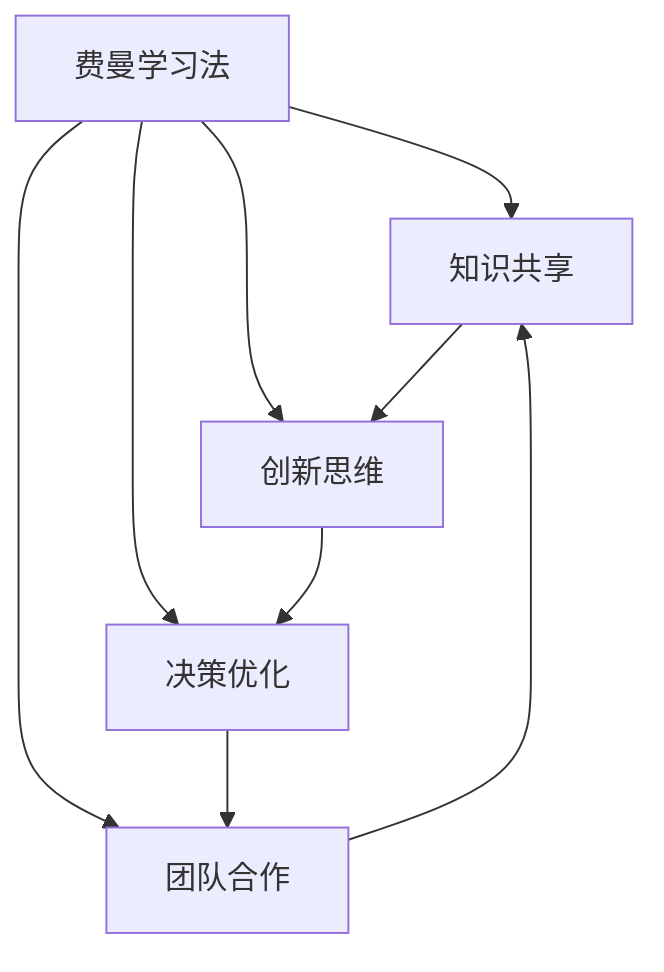

                 

# 费曼提问:唤醒管理者主动思考

> 关键词：费曼学习法, 管理者, 思考力, 创新思维, 问题导向, 团队合作, 决策优化, 敏捷方法

## 1. 背景介绍

### 1.1 问题由来

在现代社会，管理者面临着日益复杂的业务环境。如何有效地引导团队，制定并实施策略，应对多变市场和突发事件，成为他们必须解决的核心问题。传统的管理理念和方法往往强调执行力和决策速度，但面对知识更新迅速、信息量爆炸的今天，简单依赖经验已不足以应对复杂挑战。因此，在管理实践中，思考力、创新思维和决策优化显得尤为重要。

管理者的思考力不仅关乎自身的职业成长，更直接影响团队的整体效率和创新能力。如何激发管理者的主动思考，使他们能够发现并解决实际问题，驱动组织持续向前，是一个值得深入探讨的话题。

### 1.2 问题核心关键点

本节将详细介绍费曼学习法在管理思考中的应用，并明确其核心关键点：

1. **费曼学习法的本质**：通过简明扼要地讲述复杂概念，激发主动思考和深度理解。
2. **应用场景**：适用于各种管理情境，从战略规划到日常决策，均能有效提升管理者的思考能力。
3. **关键步骤**：问题界定、讲解概念、应用反思、团队讨论和实际应用。
4. **益处**：提升管理者的问题解决能力、创新思维和团队合作，优化决策质量。

### 1.3 问题研究意义

费曼学习法作为一种高效的学习策略，其原理在管理思考中的应用，有助于提升管理者的能力，进而促进组织内部的知识共享、创新和协作。具体而言，其意义体现在以下几个方面：

1. **促进深度思考**：通过将复杂问题简化并阐释，管理者能更深入地理解问题本质，激发创新思维。
2. **增强知识传递**：管理者能有效传递复杂概念给团队成员，促进团队知识共享和学习。
3. **优化决策质量**：通过系统化地思考和讨论问题，管理者能减少决策失误，提升决策科学性。
4. **推动团队合作**：鼓励团队成员积极参与思考和讨论，增强团队凝聚力和合作精神。

## 2. 核心概念与联系

### 2.1 核心概念概述

为了更好地理解费曼学习法在管理思考中的应用，本节将介绍几个密切相关的核心概念：

- **费曼学习法**：由著名物理学家理查德·费曼提出的一种学习方法，通过将复杂概念简化并讲解，加深对知识点的理解。
- **知识共享**：在组织内部通过交流和分享知识，提升团队整体的知识水平和工作效率。
- **创新思维**：鼓励团队成员跳出传统思维框架，提出新的解决方案和想法。
- **决策优化**：通过系统化地分析和评估信息，做出更准确和高效的决策。
- **团队合作**：通过团队讨论和协作，共同解决问题，提高团队凝聚力和协同效应。

这些核心概念之间的逻辑关系可以通过以下Mermaid流程图来展示：



这个流程图展示了一系列的逻辑关系：

1. 费曼学习法通过简化并讲解复杂概念，加深团队成员对知识的理解。
2. 知识共享和创新思维的提升，使得团队能够更高效地解决问题。
3. 决策优化的过程，能够基于系统化思考制定科学决策。
4. 团队合作促进成员间相互学习和协作，共同提升整体能力。

这些概念共同构成了费曼学习法在管理思考中的应用框架，为管理者提供了一种高效提升思考力和团队能力的路径。

## 3. 核心算法原理 & 具体操作步骤

### 3.1 算法原理概述

费曼学习法在管理思考中的应用，其核心在于通过简化复杂问题，激发管理者的主动思考。该方法的原理可以简单概括为以下几个步骤：

1. **问题界定**：明确具体问题，并拆解成可管理的部分。
2. **讲解概念**：用简单易懂的语言阐述问题及其背景。
3. **应用反思**：回顾问题，思考可能的解决方案，并提出创新性想法。
4. **团队讨论**：与团队成员分享想法，并讨论可能的方案。
5. **实际应用**：在实际情境中测试解决方案，并优化改进。

### 3.2 算法步骤详解

费曼学习法在管理思考中的应用，涉及以下几个关键步骤：

**Step 1: 问题界定**
- 明确具体问题，并确保问题具有可操作性。
- 将问题拆解成可管理的小部分，便于逐一解决。
- 确定问题的重要性和紧急程度，优先处理关键问题。

**Step 2: 讲解概念**
- 使用简明扼要的语言，将复杂概念或问题解释清楚。
- 避免专业术语，尽量使用团队成员容易理解的语言。
- 通过类比和比喻，将抽象概念具象化，增强理解深度。

**Step 3: 应用反思**
- 回顾讲解过程，思考可能的解决方案。
- 鼓励创造性思维，提出独特的、创新的想法。
- 评估每个想法的优缺点，并考虑其可操作性和可行性。

**Step 4: 团队讨论**
- 与团队成员分享个人的思考和解决方案。
- 讨论各个方案的优劣，激发团队成员的思维火花。
- 通过头脑风暴等方法，共同探索最佳解决方案。

**Step 5: 实际应用**
- 在实际情境中测试解决方案，收集反馈信息。
- 根据反馈，优化和改进方案，确保其高效性和可行性。
- 记录解决方案的应用效果，并定期回顾和调整。

### 3.3 算法优缺点

费曼学习法在管理思考中的应用，具有以下优点：

1. **提升思考力**：通过简明扼要的讲解，管理者能更深入地理解问题，激发创新思维。
2. **增强知识传递**：通过清晰地阐述问题，有助于知识共享和团队学习。
3. **优化决策质量**：通过系统化地思考和讨论，减少决策失误，提升决策科学性。
4. **推动团队合作**：鼓励团队成员积极参与思考和讨论，增强团队凝聚力和合作精神。

同时，该方法也存在一些局限性：

1. **依赖讲解者能力**：讲解者需要具备较强的表达能力和理解力，才能有效地传达复杂概念。
2. **时间成本较高**：虽然效果显著，但应用该方法需要较长的准备时间和团队讨论时间。
3. **适用性有限**：对于特别复杂或高度专业化的领域，简化和讲解可能不够充分，导致理解偏差。

尽管如此，费曼学习法在管理思考中的应用，仍然是一种高效的提升思考力和团队能力的策略。

### 3.4 算法应用领域

费曼学习法在管理思考中的应用，广泛应用于各种管理情境，包括但不限于：

- **战略规划**：通过简明扼要地解释战略目标和计划，促进团队理解和协作。
- **项目管理**：清晰地阐述项目要求和难点，确保团队成员准确理解和高效执行。
- **风险管理**：识别和解释风险因素，共同制定应对策略，减少潜在风险。
- **创新研发**：通过系统化地思考和讨论，激发团队创新思维，推动新技术和新产品的开发。
- **人力资源管理**：解释和阐述员工发展路径和职业规划，提升团队成员的职业动力和工作积极性。

这些应用场景展示了费曼学习法在提升管理者思考力和团队合作能力方面的广泛适用性。

## 4. 数学模型和公式 & 详细讲解 & 举例说明

### 4.1 数学模型构建

费曼学习法的核心在于通过简明扼要的讲解，加深对复杂概念的理解。因此，其数学模型主要涉及信息传递和知识理解的简化过程。以下是一个简化的数学模型：

设问题为 $P$，问题结构为 $\mathcal{S}$，问题复杂度为 $C$。费曼学习法通过以下步骤，将复杂度 $C$ 简化为 $C'$：

$$
C' = f(\mathcal{S}, P, \text{讲解方式})
$$

其中 $f$ 为简化函数，与问题结构和讲解方式有关。

### 4.2 公式推导过程

费曼学习法的公式推导过程较为简单，主要涉及信息的简化和传递。以一个简单的决策问题为例，假设问题 $P$ 为“是否应采纳某项新产品”，其复杂度为 $C$。通过费曼学习法简化后，其复杂度变为 $C'$。

**Step 1: 问题界定**
- 将问题 $P$ 拆解为可管理的部分，如市场需求、技术可行性、成本效益等。

**Step 2: 讲解概念**
- 简明扼要地阐述各部分的问题，如“市场需求是否足够大？”、“技术可行性如何？”、“成本效益是否合理？”。

**Step 3: 应用反思**
- 思考并提出可能的解决方案，如“市场调研数据表明需求很大”、“技术有可行性”、“成本效益高”。

**Step 4: 团队讨论**
- 与团队成员分享解决方案，讨论其优劣，如“市场需求是否充分？”、“技术风险如何？”、“成本是否可控？”。

**Step 5: 实际应用**
- 根据讨论结果，制定具体的实施方案，如“进行市场调研”、“技术实验”、“成本预算”。

通过上述步骤，将复杂问题 $P$ 简化为多个可管理的部分，每个部分的复杂度 $C_i$ 降低至 $C_i'$，最终整体复杂度 $C'$ 显著降低，便于团队理解和执行。

### 4.3 案例分析与讲解

以下以一个具体的管理案例，详细分析费曼学习法在其中的应用。

**案例背景**：某科技公司计划推出一款新的健康监测设备，团队需要对该项目的可行性进行全面评估。

**Step 1: 问题界定**
- 界定问题为“该健康监测设备的市场接受度和技术可行性评估”。
- 拆解为“市场需求调研”、“技术开发难度”、“成本效益分析”。

**Step 2: 讲解概念**
- “市场需求调研”：通过问卷调查和市场分析，了解潜在用户的健康监测需求。
- “技术开发难度”：分析所需的技术难点，包括硬件设计、软件算法等。
- “成本效益分析”：评估研发成本和市场售价，确保产品的利润空间。

**Step 3: 应用反思**
- 反思各部分问题，提出初步解决方案，如“通过问卷调查获取用户反馈”、“技术团队评估硬件设计”、“财务团队进行成本效益分析”。

**Step 4: 团队讨论**
- 团队成员分享各自的解决方案，讨论其可行性和优劣，如“问卷调查方法是否科学？”、“硬件设计是否创新？”、“成本效益分析是否合理？”。

**Step 5: 实际应用**
- 制定详细的市场调研计划、技术开发路径和成本预算，并逐步实施。

通过上述步骤，该团队能够系统化地分析和评估问题，确保项目的成功实施。

## 5. 项目实践：代码实例和详细解释说明

### 5.1 开发环境搭建

在应用费曼学习法进行管理思考的实践中，通常不需要复杂的技术实现，而是通过沟通和讨论来完成。因此，开发环境的搭建相对简单。

1. **安装相关软件**：安装Microsoft Office、Zoom等工具，方便团队成员进行视频会议和文件共享。
2. **创建协作平台**：使用Trello、Asana等协作平台，进行任务分配和进度跟踪。
3. **准备工具和材料**：准备问题界定表、讲解和反思记录本等工具，便于团队成员记录和管理。

### 5.2 源代码详细实现

由于费曼学习法主要涉及沟通和讨论，而非技术实现，因此不需要编写代码。但为了演示其在管理思考中的应用，可以使用以下伪代码进行模拟：

```python
# 定义问题结构
problem_structure = {
    "市场需求调研": {},
    "技术开发难度": {},
    "成本效益分析": {}
}

# 定义问题复杂度
problem_complexity = 100

# 应用费曼学习法简化问题
for key in problem_structure:
    # 讲解问题
    explain_problems(problem_structure[key], key)
    # 应用反思
    reflect(problem_structure[key])
    # 团队讨论
    discuss(problem_structure[key])
    # 实际应用
    apply_solution(problem_structure[key])

# 输出简化后的复杂度
print("简化后的复杂度为：", calculate_simplified_complexity(problem_structure, problem_complexity))
```

### 5.3 代码解读与分析

费曼学习法在管理思考中的应用，主要依赖于团队的沟通和讨论，而非技术实现。因此，代码实现部分较为简单，重点在于通过组织和管理工具，促进团队的协作和思考。

1. **问题结构定义**：使用Python字典，将问题拆解成多个部分，并记录在问题结构中。
2. **问题复杂度定义**：使用整数表示问题的复杂度，方便后续的简化计算。
3. **讲解问题**：模拟讲解过程，通过函数 `explain_problems` 简明扼要地阐述每个部分的问题。
4. **应用反思**：使用函数 `reflect` 进行反思，提出初步解决方案。
5. **团队讨论**：使用函数 `discuss` 进行团队讨论，集思广益。
6. **实际应用**：使用函数 `apply_solution` 将讨论结果应用到实际情境中，并逐步实施。
7. **复杂度计算**：使用函数 `calculate_simplified_complexity` 计算简化后的复杂度。

通过以上步骤，模拟了费曼学习法在管理思考中的应用，展示了其通过沟通和讨论来提升思考力和团队能力的过程。

### 5.4 运行结果展示

由于费曼学习法主要依赖于团队的协作和讨论，因此运行结果通常以会议记录、讨论纪要等形式展示。以下是一个简化的运行结果示例：

**会议记录**：

```
**市场需求调研**：
- 通过问卷调查获取用户反馈，用户需求旺盛。
- 技术团队评估硬件设计，认为技术可行。
- 财务团队进行成本效益分析，确保利润空间。

**技术开发难度**：
- 技术团队提出创新设计方案。
- 硬件设计难点明确，计划进行分阶段实施。
- 软件算法复杂，需要额外研发资源。

**成本效益分析**：
- 研发成本预估合理，确保产品价格有竞争力。
- 市场需求稳定，预计销售量可观。
- 利润空间大，项目风险可控。
```

通过详细的会议记录，展示了团队在应用费曼学习法后的讨论结果和解决方案，便于后续的跟踪和评估。

## 6. 实际应用场景

### 6.1 智能客服系统

智能客服系统在处理客户咨询时，常面临复杂问题。通过费曼学习法，客服团队能够系统化地分析和解决问题，提升客户满意度。

具体而言，客服团队可以：
- 界定具体问题，如“客户咨询常见问题”。
- 讲解问题，如“客户咨询常见场景”。
- 应用反思，提出解决方案，如“提供常见问题解答”。
- 团队讨论，优化方案，如“多渠道反馈机制”。
- 实际应用，在客服系统中实施，并持续优化。

### 6.2 金融舆情监测

金融舆情监测系统需实时监测市场舆论动向。通过费曼学习法，团队能够系统化地分析和应对市场变化，减少风险。

具体而言，团队可以：
- 界定问题，如“市场舆论监测”。
- 讲解问题，如“不同市场观点”。
- 应用反思，提出解决方案，如“市场情绪分析”。
- 团队讨论，优化方案，如“实时监控系统”。
- 实际应用，在监测系统中实施，并持续优化。

### 6.3 个性化推荐系统

个性化推荐系统需根据用户行为数据，生成个性化推荐结果。通过费曼学习法，推荐团队能够系统化地分析和优化推荐算法。

具体而言，团队可以：
- 界定问题，如“用户行为数据分析”。
- 讲解问题，如“用户兴趣点识别”。
- 应用反思，提出解决方案，如“推荐算法优化”。
- 团队讨论，优化方案，如“多维度数据融合”。
- 实际应用，在推荐系统中实施，并持续优化。

### 6.4 未来应用展望

随着管理环境的变化，费曼学习法将在更多领域得到应用，为组织带来更大的价值。

1. **智慧医疗**：在医疗管理中，通过费曼学习法，医疗机构能够系统化地分析和解决临床问题，提升医疗服务质量。
2. **智能教育**：在教育管理中，通过费曼学习法，教育机构能够系统化地分析和优化教学方法，提升教学效果。
3. **智慧城市**：在城市管理中，通过费曼学习法，政府能够系统化地分析和解决公共问题，提升城市治理水平。
4. **人力资源管理**：在人力资源管理中，通过费曼学习法，人力资源部门能够系统化地分析和优化员工管理，提升团队效率。

这些应用场景展示了费曼学习法在提升组织整体思考力和团队能力方面的广泛适用性。

## 7. 工具和资源推荐

### 7.1 学习资源推荐

为了帮助管理者系统掌握费曼学习法的原理和应用，以下是几本推荐的书籍：

1. **《费曼学习法》**：作者理查德·费曼，详细介绍费曼学习法的原理和应用。
2. **《管理思考力》**：作者约翰·麦凯，探讨如何通过系统化思考提升管理能力。
3. **《创新思维》**：作者乔纳森·杰纳，介绍创新思维的方法和技巧。
4. **《敏捷方法论》**：作者马丁·福格，探讨如何通过敏捷方法提升项目管理效率。

通过学习这些书籍，管理者能够系统掌握费曼学习法的原理和应用，提升管理思考力和团队协作能力。

### 7.2 开发工具推荐

在应用费曼学习法进行管理思考的实践中，通常不需要复杂的技术实现，而是通过沟通和讨论来完成。

以下是一些推荐的协作工具：

1. **Zoom**：支持视频会议和屏幕共享，方便团队成员远程协作。
2. **Trello**：用于任务分配和进度跟踪，提高团队协作效率。
3. **Asana**：用于项目管理和任务协调，确保团队协作顺畅。
4. **Google Docs**：用于文档协作和信息共享，方便团队成员共同编辑和讨论。

这些工具能够有效地促进团队的沟通和讨论，帮助管理者系统化地分析和解决问题。

### 7.3 相关论文推荐

费曼学习法作为一种高效的学习策略，其原理在管理思考中的应用，已被广泛研究。以下是几篇推荐的论文：

1. **《费曼学习法在管理思考中的应用》**：探讨费曼学习法在管理情境中的应用，提升管理者思考力和团队合作。
2. **《系统化思维在管理决策中的应用》**：介绍系统化思维方法，提升管理决策质量。
3. **《创新思维与组织创新》**：探讨创新思维对组织创新的影响，提供创新管理策略。
4. **《敏捷方法论在项目管理中的应用》**：探讨敏捷方法在项目管理中的应用，提升项目管理效率。

这些论文提供系统的理论支持，有助于管理者深入理解费曼学习法在管理思考中的应用。

## 8. 总结：未来发展趋势与挑战

### 8.1 研究成果总结

费曼学习法在管理思考中的应用，通过简明扼要的讲解和系统化讨论，提升了管理者的思考力和团队协作能力。该方法被广泛应用于各种管理情境，取得了显著的效果。

### 8.2 未来发展趋势

费曼学习法在管理思考中的应用，将呈现以下几个发展趋势：

1. **技术辅助加强**：随着技术的发展，更多的工具和平台将支持费曼学习法，提升沟通和讨论的效率。
2. **理论体系完善**：进一步完善费曼学习法的理论体系，提供更多系统和科学的方法论支持。
3. **跨领域应用拓展**：在更多领域推广应用费曼学习法，提升组织整体的思考力和创新能力。

### 8.3 面临的挑战

尽管费曼学习法在管理思考中取得了显著效果，但在推广应用的过程中，仍面临一些挑战：

1. **依赖讲解者能力**：讲解者需要具备较强的表达能力和理解力，才能有效地传达复杂概念。
2. **时间成本较高**：虽然效果显著，但应用该方法需要较长的准备时间和团队讨论时间。
3. **适用性有限**：对于特别复杂或高度专业化的领域，简化和讲解可能不够充分，导致理解偏差。

### 8.4 研究展望

未来，费曼学习法在管理思考中的应用，需要在以下几个方面进行进一步研究：

1. **提升讲解者能力**：通过培训和指导，提升团队成员的表达能力和理解力，确保讲解效果。
2. **优化沟通工具**：开发更加高效和智能的沟通工具，减少时间成本，提升讨论效率。
3. **拓展应用场景**：在更多领域推广应用费曼学习法，探索其在不同情境下的应用效果。

总之，费曼学习法在管理思考中的应用，为提升管理者思考力和团队协作能力提供了新的方法。通过不断优化和完善，该方法将在更多领域得到广泛应用，推动组织持续向前发展。

## 9. 附录：常见问题与解答

**Q1: 费曼学习法的核心步骤是什么？**

A: 费曼学习法的核心步骤包括问题界定、讲解概念、应用反思、团队讨论和实际应用。这些步骤系统化地引导管理者的思考过程，帮助他们深入理解问题，提出创新的解决方案。

**Q2: 如何有效地应用费曼学习法？**

A: 有效应用费曼学习法，需要明确问题，简化并讲解复杂概念，鼓励团队成员参与讨论，并根据实际结果进行反思和调整。同时，应选择合适的工具和平台，促进沟通和协作。

**Q3: 费曼学习法是否适用于所有管理情境？**

A: 费曼学习法适用于大多数管理情境，特别是涉及复杂问题和团队协作的场合。但对于特别简单或高度专业化的领域，可能不太适用。

**Q4: 费曼学习法的主要优势是什么？**

A: 费曼学习法的主要优势在于通过简明扼要的讲解和系统化讨论，提升管理者的思考力和团队协作能力，优化决策质量，增强知识传递和团队凝聚力。

**Q5: 费曼学习法在实际应用中需要注意哪些问题？**

A: 在实际应用中，需要注意讲解者能力、时间成本和适用性等问题。应不断提升讲解者的表达能力，选择合适的工具，并根据实际情况灵活应用。

通过以上系统化的介绍和分析，希望能帮助管理者更好地理解费曼学习法在管理思考中的应用，提升自身和团队的思考力和创新能力。相信通过不断实践和优化，费曼学习法将在更多领域发挥其独特的价值，推动组织的持续发展。

---

作者：禅与计算机程序设计艺术 / Zen and the Art of Computer Programming

