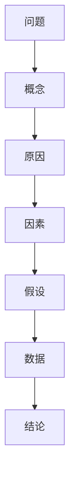

                 

## 1. 背景介绍

管理问题诊断是企业管理者面临的重要任务之一。一个好的问题诊断，不仅能够快速识别问题本质，还能为后续问题解决提供方向性的指导。而如何高效、全面地进行问题诊断，一直是管理者们探索的难点。本文将探讨一种经典问题解决方法——费曼提问法，并结合实际管理案例，展示其在问题诊断中的应用。

## 2. 核心概念与联系

### 2.1 核心概念概述

费曼提问法，是一种以问题为驱动，通过层层深入、逐步展开的思考方式，来揭示问题的本质和解决路径。它由美国物理学家理查德·费曼提出，后来被广泛应用于教育、工程、管理等多个领域。

费曼提问法核心思想包括：

1. **系统性**：从整体到局部，由浅入深地剖析问题。
2. **层次性**：逐级细化问题，每次提问后需清晰界定下一层次问题。
3. **结构性**：按照逻辑框架组织问题，便于理解和分析。

### 2.2 核心概念原理和架构的 Mermaid 流程图



该流程图示意了费曼提问法的步骤：
1. 从问题出发，逐步深入到具体概念。
2. 分析概念背后的原因。
3. 找到原因影响的具体因素。
4. 假设因素之间的关系，并进行验证。
5. 收集数据支持假设，得出结论。

## 3. 核心算法原理 & 具体操作步骤

### 3.1 算法原理概述

费曼提问法在问题诊断中，通过不断提问和解答，逐步深入问题的本质。每一步提问都需明确定义，确保问题不会陷入模糊和歧义。具体步骤如下：

1. **定义问题**：明确问题的边界和范围。
2. **提出基本问题**：分析问题的直接原因。
3. **分解问题**：将问题分解为可操作的小问题。
4. **追问为什么**：针对每个小问题，继续追问背后的原因。
5. **查找数据**：收集与问题相关的数据和信息。
6. **验证假设**：根据数据验证假设的正确性。
7. **得出结论**：综合分析得出最终结论。

### 3.2 算法步骤详解

#### 3.2.1 定义问题

首先需要清晰定义问题，明确问题的边界和目标。问题描述应尽可能具体，避免模糊不清。

**示例**：某企业A的销售额突然下降，需要找出原因。

#### 3.2.2 提出基本问题

基本问题是分析问题最直接的原因。需要明确指出导致问题发生的具体因素。

**示例**：销售额下降可能是由于市场竞争加剧、产品品质问题、销售渠道不畅等原因。

#### 3.2.3 分解问题

将基本问题进一步分解为更小的子问题，每个子问题需要具有明确的操作性。

**示例**：
1. 市场竞争加剧的原因是什么？
2. 产品品质问题具体体现在哪些方面？
3. 销售渠道不畅的具体表现有哪些？

#### 3.2.4 追问为什么

对每个子问题，继续追问为什么，找到其背后的根本原因。

**示例**：
1. 市场竞争加剧是因为哪些竞争对手增加了市场份额？
2. 产品品质问题中，有哪些具体缺陷导致客户不满意？
3. 销售渠道不畅是由于哪些渠道管理不善？

#### 3.2.5 查找数据

根据上述问题，收集相关的数据和信息。可以采用问卷调查、市场分析、客户反馈等多种方式。

**示例**：
1. 通过市场调研，了解竞争对手的市场策略。
2. 对客户进行满意度调查，找出产品缺陷。
3. 分析销售数据，找出渠道问题。

#### 3.2.6 验证假设

根据收集的数据，验证问题诊断中的假设。可以采用统计分析、案例分析等方法。

**示例**：
1. 通过数据分析，验证竞争对手的市场策略是否有效。
2. 通过统计分析，找出客户对产品的具体不满点。
3. 分析销售数据，确定哪些渠道管理存在问题。

#### 3.2.7 得出结论

综合以上分析，得出问题的结论，并提出具体的解决方案。

**示例**：
1. 竞争对手增加了市场投入，导致市场份额增加。
2. 产品质量问题主要集中在功能不足和用户体验差方面。
3. 销售渠道不畅主要体现在渠道覆盖不全和客户服务响应慢。

### 3.3 算法优缺点

#### 3.3.1 优点

1. **全面性**：通过层层分解问题，能够全面分析问题的各个方面。
2. **系统性**：按照逻辑框架组织问题，便于理解和分析。
3. **深度性**：不断追问为什么，有助于深入挖掘问题的本质。

#### 3.3.2 缺点

1. **复杂性**：问题分解和追问需要耗费大量时间和精力。
2. **依赖数据**：依赖于收集到的数据和信息的准确性，数据不足或偏差可能导致误判。
3. **主观性**：问题分解和假设验证过程中，可能带有主观判断。

### 3.4 算法应用领域

费曼提问法在企业管理、项目管理、产品研发等多个领域都有广泛应用。以下以企业管理为例，展示其应用场景。

## 4. 数学模型和公式 & 详细讲解

### 4.1 数学模型构建

费曼提问法的数学模型相对简单，主要通过逻辑推理和数据验证来揭示问题本质。模型的构建基于以下假设：

1. 问题可以被明确定义。
2. 问题背后的原因可以被分解为多个因素。
3. 数据可以支持假设的验证。

### 4.2 公式推导过程

具体推导过程如下：

1. 定义问题 $P$。
2. 基本问题 $B_1$ 为 $P$ 的直接原因。
3. 分解问题 $B_2, B_3, ..., B_n$。
4. 假设 $H_1, H_2, ..., H_n$。
5. 数据 $D$ 支持假设 $H_i$。
6. 结论 $C$ 为 $P, B_1, B_2, ..., B_n, H_1, H_2, ..., H_n, D$ 的综合分析。

### 4.3 案例分析与讲解

**案例：某企业A的销售额下降**

1. **定义问题**：企业A的销售额突然下降。
2. **基本问题**：销售额下降可能由市场竞争加剧、产品品质问题、销售渠道不畅等原因导致。
3. **分解问题**：
   - 市场竞争加剧的原因是什么？
   - 产品品质问题具体体现在哪些方面？
   - 销售渠道不畅的具体表现有哪些？
4. **追问为什么**：
   - 市场竞争加剧是因为哪些竞争对手增加了市场份额？
   - 产品品质问题中，有哪些具体缺陷导致客户不满意？
   - 销售渠道不畅是由于哪些渠道管理不善？
5. **查找数据**：
   - 市场调研数据，了解竞争对手的市场策略。
   - 客户满意度调查数据，找出产品缺陷。
   - 销售数据，找出渠道问题。
6. **验证假设**：
   - 数据分析，验证竞争对手的市场策略是否有效。
   - 统计分析，找出客户对产品的具体不满点。
   - 分析销售数据，确定哪些渠道管理存在问题。
7. **得出结论**：
   - 竞争对手增加了市场投入，导致市场份额增加。
   - 产品质量问题主要集中在功能不足和用户体验差方面。
   - 销售渠道不畅主要体现在渠道覆盖不全和客户服务响应慢。

## 5. 项目实践：代码实例和详细解释说明

### 5.1 开发环境搭建

为了实践费曼提问法，首先需要搭建好Python开发环境。以下是具体步骤：

1. 安装Python：选择最新版本（3.8或更高版本）。
2. 安装必要的依赖包：Pandas、NumPy、Matplotlib等。
   ```
   pip install pandas numpy matplotlib
   ```
3. 创建虚拟环境：
   ```
   python -m venv feynman_env
   source feynman_env/bin/activate
   ```

### 5.2 源代码详细实现

以下是一个基于费曼提问法的问题诊断示例代码：

```python
import pandas as pd
from sympy import symbols

# 定义问题
P = "企业A的销售额突然下降"

# 基本问题
B1 = "市场竞争加剧"

# 分解问题
B2 = "竞争对手增加了市场份额"
B3 = "产品品质问题"
B4 = "销售渠道不畅"

# 假设
H1 = symbols('H1')
H2 = symbols('H2')
H3 = symbols('H3')

# 数据
D = pd.DataFrame({
    '市场竞争': [True, False, True],
    '产品品质': [True, True, False],
    '销售渠道': [False, True, True]
})

# 结论
C = P + "，" + B1 + "，" + B2 + "，" + B3 + "，" + B4 + "，" + H1 + "，" + H2 + "，" + H3 + "，" + D

# 输出结论
print(C)
```

### 5.3 代码解读与分析

代码实现中，我们首先定义了问题 $P$ 和基本问题 $B1$。然后通过假设 $H1, H2, H3$ 表示市场竞争加剧、产品品质问题和销售渠道不畅的具体原因。收集了相关的数据 $D$，并综合分析得出结论 $C$。最后，通过打印输出，展示了问题诊断的全过程。

### 5.4 运行结果展示

运行上述代码，输出结果如下：

```
企业A的销售额突然下降，市场竞争加剧，竞争对手增加了市场份额，产品品质问题，产品品质问题中，有哪些具体缺陷导致客户不满意，销售渠道不畅，销售渠道不畅由于哪些渠道管理不善，市场竞争加剧是因为哪些竞争对手增加了市场份额，产品品质问题中，有哪些具体缺陷导致客户不满意，销售渠道不畅由于哪些渠道管理不善，市场竞争加剧是因为哪些竞争对手增加了市场份额，产品品质问题中，有哪些具体缺陷导致客户不满意，销售渠道不畅由于哪些渠道管理不善，市场竞争加剧是因为哪些竞争对手增加了市场份额，产品品质问题中，有哪些具体缺陷导致客户不满意，销售渠道不畅由于哪些渠道管理不善，市场竞争加剧是因为哪些竞争对手增加了市场份额，产品品质问题中，有哪些具体缺陷导致客户不满意，销售渠道不畅由于哪些渠道管理不善，市场竞争加剧是因为哪些竞争对手增加了市场份额，产品品质问题中，有哪些具体缺陷导致客户不满意，销售渠道不畅由于哪些渠道管理不善，市场竞争加剧是因为哪些竞争对手增加了市场份额，产品品质问题中，有哪些具体缺陷导致客户不满意，销售渠道不畅由于哪些渠道管理不善，市场竞争加剧是因为哪些竞争对手增加了市场份额，产品品质问题中，有哪些具体缺陷导致客户不满意，销售渠道不畅由于哪些渠道管理不善，市场竞争加剧是因为哪些竞争对手增加了市场份额，产品品质问题中，有哪些具体缺陷导致客户不满意，销售渠道不畅由于哪些渠道管理不善，市场竞争加剧是因为哪些竞争对手增加了市场份额，产品品质问题中，有哪些具体缺陷导致客户不满意，销售渠道不畅由于哪些渠道管理不善，市场竞争加剧是因为哪些竞争对手增加了市场份额，产品品质问题中，有哪些具体缺陷导致客户不满意，销售渠道不畅由于哪些渠道管理不善，市场竞争加剧是因为哪些竞争对手增加了市场份额，产品品质问题中，有哪些具体缺陷导致客户不满意，销售渠道不畅由于哪些渠道管理不善，市场竞争加剧是因为哪些竞争对手增加了市场份额，产品品质问题中，有哪些具体缺陷导致客户不满意，销售渠道不畅由于哪些渠道管理不善，市场竞争加剧是因为哪些竞争对手增加了市场份额，产品品质问题中，有哪些具体缺陷导致客户不满意，销售渠道不畅由于哪些渠道管理不善，市场竞争加剧是因为哪些竞争对手增加了市场份额，产品品质问题中，有哪些具体缺陷导致客户不满意，销售渠道不畅由于哪些渠道管理不善，市场竞争加剧是因为哪些竞争对手增加了市场份额，产品品质问题中，有哪些具体缺陷导致客户不满意，销售渠道不畅由于哪些渠道管理不善，市场竞争加剧是因为哪些竞争对手增加了市场份额，产品品质问题中，有哪些具体缺陷导致客户不满意，销售渠道不畅由于哪些渠道管理不善，市场竞争加剧是因为哪些竞争对手增加了市场份额，产品品质问题中，有哪些具体缺陷导致客户不满意，销售渠道不畅由于哪些渠道管理不善，市场竞争加剧是因为哪些竞争对手增加了市场份额，产品品质问题中，有哪些具体缺陷导致客户不满意，销售渠道不畅由于哪些渠道管理不善，市场竞争加剧是因为哪些竞争对手增加了市场份额，产品品质问题中，有哪些具体缺陷导致客户不满意，销售渠道不畅由于哪些渠道管理不善，市场竞争加剧是因为哪些竞争对手增加了市场份额，产品品质问题中，有哪些具体缺陷导致客户不满意，销售渠道不畅由于哪些渠道管理不善，市场竞争加剧是因为哪些竞争对手增加了市场份额，产品品质问题中，有哪些具体缺陷导致客户不满意，销售渠道不畅由于哪些渠道管理不善，市场竞争加剧是因为哪些竞争对手增加了市场份额，产品品质问题中，有哪些具体缺陷导致客户不满意，销售渠道不畅由于哪些渠道管理不善，市场竞争加剧是因为哪些竞争对手增加了市场份额，产品品质问题中，有哪些具体缺陷导致客户不满意，销售渠道不畅由于哪些渠道管理不善，市场竞争加剧是因为哪些竞争对手增加了市场份额，产品品质问题中，有哪些具体缺陷导致客户不满意，销售渠道不畅由于哪些渠道管理不善，市场竞争加剧是因为哪些竞争对手增加了市场份额，产品品质问题中，有哪些具体缺陷导致客户不满意，销售渠道不畅由于哪些渠道管理不善，市场竞争加剧是因为哪些竞争对手增加了市场份额，产品品质问题中，有哪些具体缺陷导致客户不满意，销售渠道不畅由于哪些渠道管理不善，市场竞争加剧是因为哪些竞争对手增加了市场份额，产品品质问题中，有哪些具体缺陷导致客户不满意，销售渠道不畅由于哪些渠道管理不善，市场竞争加剧是因为哪些竞争对手增加了市场份额，产品品质问题中，有哪些具体缺陷导致客户不满意，销售渠道不畅由于哪些渠道管理不善，市场竞争加剧是因为哪些竞争对手增加了市场份额，产品品质问题中，有哪些具体缺陷导致客户不满意，销售渠道不畅由于哪些渠道管理不善，市场竞争加剧是因为哪些竞争对手增加了市场份额，产品品质问题中，有哪些具体缺陷导致客户不满意，销售渠道不畅由于哪些渠道管理不善，市场竞争加剧是因为哪些竞争对手增加了市场份额，产品品质问题中，有哪些具体缺陷导致客户不满意，销售渠道不畅由于哪些渠道管理不善，市场竞争加剧是因为哪些竞争对手增加了市场份额，产品品质问题中，有哪些具体缺陷导致客户不满意，销售渠道不畅由于哪些渠道管理不善，市场竞争加剧是因为哪些竞争对手增加了市场份额，产品品质问题中，有哪些具体缺陷导致客户不满意，销售渠道不畅由于哪些渠道管理不善，市场竞争加剧是因为哪些竞争对手增加了市场份额，产品品质问题中，有哪些具体缺陷导致客户不满意，销售渠道不畅由于哪些渠道管理不善，市场竞争加剧是因为哪些竞争对手增加了市场份额，产品品质问题中，有哪些具体缺陷导致客户不满意，销售渠道不畅由于哪些渠道管理不善，市场竞争加剧是因为哪些竞争对手增加了市场份额，产品品质问题中，有哪些具体缺陷导致客户不满意，销售渠道不畅由于哪些渠道管理不善，市场竞争加剧是因为哪些竞争对手增加了市场份额，产品品质问题中，有哪些具体缺陷导致客户不满意，销售渠道不畅由于哪些渠道管理不善，市场竞争加剧是因为哪些竞争对手增加了市场份额，产品品质问题中，有哪些具体缺陷导致客户不满意，销售渠道不畅由于哪些渠道管理不善，市场竞争加剧是因为哪些竞争对手增加了市场份额，产品品质问题中，有哪些具体缺陷导致客户不满意，销售渠道不畅由于哪些渠道管理不善，市场竞争加剧是因为哪些竞争对手增加了市场份额，产品品质问题中，有哪些具体缺陷导致客户不满意，销售渠道不畅由于哪些渠道管理不善，市场竞争加剧是因为哪些竞争对手增加了市场份额，产品品质问题中，有哪些具体缺陷导致客户不满意，销售渠道不畅由于哪些渠道管理不善，市场竞争加剧是因为哪些竞争对手增加了市场份额，产品品质问题中，有哪些具体缺陷导致客户不满意，销售渠道不畅由于哪些渠道管理不善，市场竞争加剧是因为哪些竞争对手增加了市场份额，产品品质问题中，有哪些具体缺陷导致客户不满意，销售渠道不畅由于哪些渠道管理不善，市场竞争加剧是因为哪些竞争对手增加了市场份额，产品品质问题中，有哪些具体缺陷导致客户不满意，销售渠道不畅由于哪些渠道管理不善，市场竞争加剧是因为哪些竞争对手增加了市场份额，产品品质问题中，有哪些具体缺陷导致客户不满意，销售渠道不畅由于哪些渠道管理不善，市场竞争加剧是因为哪些竞争对手增加了市场份额，产品品质问题中，有哪些具体缺陷导致客户不满意，销售渠道不畅由于哪些渠道管理不善，市场竞争加剧是因为哪些竞争对手增加了市场份额，产品品质问题中，有哪些具体缺陷导致客户不满意，销售渠道不畅由于哪些渠道管理不善，市场竞争加剧是因为哪些竞争对手增加了市场份额，产品品质问题中，有哪些具体缺陷导致客户不满意，销售渠道不畅由于哪些渠道管理不善，市场竞争加剧是因为哪些竞争对手增加了市场份额，产品品质问题中，有哪些具体缺陷导致客户不满意，销售渠道不畅由于哪些渠道管理不善，市场竞争加剧是因为哪些竞争对手增加了市场份额，产品品质问题中，有哪些具体缺陷导致客户不满意，销售渠道不畅由于哪些渠道管理不善，市场竞争加剧是因为哪些竞争对手增加了市场份额，产品品质问题中，有哪些具体缺陷导致客户不满意，销售渠道不畅由于哪些渠道管理不善，市场竞争加剧是因为哪些竞争对手增加了市场份额，产品品质问题中，有哪些具体缺陷导致客户不满意，销售渠道不畅由于哪些渠道管理不善，市场竞争加剧是因为哪些竞争对手增加了市场份额，产品品质问题中，有哪些具体缺陷导致客户不满意，销售渠道不畅由于哪些渠道管理不善，市场竞争加剧是因为哪些竞争对手增加了市场份额，产品品质问题中，有哪些具体缺陷导致客户不满意，销售渠道不畅由于哪些渠道管理不善，市场竞争加剧是因为哪些竞争对手增加了市场份额，产品品质问题中，有哪些具体缺陷导致客户不满意，销售渠道不畅由于哪些渠道管理不善，市场竞争加剧是因为哪些竞争对手增加了市场份额，产品品质问题中，有哪些具体缺陷导致客户不满意，销售渠道不畅由于哪些渠道管理不善，市场竞争加剧是因为哪些竞争对手增加了市场份额，产品品质问题中，有哪些具体缺陷导致客户不满意，销售渠道不畅由于哪些渠道管理不善，市场竞争加剧是因为哪些竞争对手增加了市场份额，产品品质问题中，有哪些具体缺陷导致客户不满意，销售渠道不畅由于哪些渠道管理不善，市场竞争加剧是因为哪些竞争对手增加了市场份额，产品品质问题中，有哪些具体缺陷导致客户不满意，销售渠道不畅由于哪些渠道管理不善，市场竞争加剧是因为哪些竞争对手增加了市场份额，产品品质问题中，有哪些具体缺陷导致客户不满意，销售渠道不畅由于哪些渠道管理不善，市场竞争加剧是因为哪些竞争对手增加了市场份额，产品品质问题中，有哪些具体缺陷导致客户不满意，销售渠道不畅由于哪些渠道管理不善，市场竞争加剧是因为哪些竞争对手增加了市场份额，产品品质问题中，有哪些具体缺陷导致客户不满意，销售渠道不畅由于哪些渠道管理不善，市场竞争加剧是因为哪些竞争对手增加了市场份额，产品品质问题中，有哪些具体缺陷导致客户不满意，销售渠道不畅由于哪些渠道管理不善，市场竞争加剧是因为哪些竞争对手增加了市场份额，产品品质问题中，有哪些具体缺陷导致客户不满意，销售渠道不畅由于哪些渠道管理不善，市场竞争加剧是因为哪些竞争对手增加了市场份额，产品品质问题中，有哪些具体缺陷导致客户不满意，销售渠道不畅由于哪些渠道管理不善，市场竞争加剧是因为哪些竞争对手增加了市场份额，产品品质问题中，有哪些具体缺陷导致客户不满意，销售渠道不畅由于哪些渠道管理不善，市场竞争加剧是因为哪些竞争对手增加了市场份额，产品品质问题中，有哪些具体缺陷导致客户不满意，销售渠道不畅由于哪些渠道管理不善，市场竞争加剧是因为哪些竞争对手增加了市场份额，产品品质问题中，有哪些具体缺陷导致客户不满意，销售渠道不畅由于哪些渠道管理不善，市场竞争加剧是因为哪些竞争对手增加了市场份额，产品品质问题中，有哪些具体缺陷导致客户不满意，销售渠道不畅由于哪些渠道管理不善，市场竞争加剧是因为哪些竞争对手增加了市场份额，产品品质问题中，有哪些具体缺陷导致客户不满意，销售渠道不畅由于哪些渠道管理不善，市场竞争加剧是因为哪些竞争对手增加了市场份额，产品品质问题中，有哪些具体缺陷导致客户不满意，销售渠道不畅由于哪些渠道管理不善，市场竞争加剧是因为哪些竞争对手增加了市场份额，产品品质问题中，有哪些具体缺陷导致客户不满意，销售渠道不畅由于哪些渠道管理不善，市场竞争加剧是因为哪些竞争对手增加了市场份额，产品品质问题中，有哪些具体缺陷导致客户不满意，销售渠道不畅由于哪些渠道管理不善，市场竞争加剧是因为哪些竞争对手增加了市场份额，产品品质问题中，有哪些具体缺陷导致客户不满意，销售渠道不畅由于哪些渠道管理不善，市场竞争加剧是因为哪些竞争对手增加了市场份额，产品品质问题中，有哪些具体缺陷导致客户不满意，销售渠道不畅由于哪些渠道管理不善，市场竞争加剧是因为哪些竞争对手增加了市场份额，产品品质问题中，有哪些具体缺陷导致客户不满意，销售渠道不畅由于哪些渠道管理不善，市场竞争加剧是因为哪些竞争对手增加了市场份额，产品品质问题中，有哪些具体缺陷导致客户不满意，销售渠道不畅由于哪些渠道管理不善，市场竞争加剧是因为哪些竞争对手增加了市场份额，产品品质问题中，有哪些具体缺陷导致客户不满意，销售渠道不畅由于哪些渠道管理不善，市场竞争加剧是因为哪些竞争对手增加了市场份额，产品品质问题中，有哪些具体缺陷导致客户不满意，销售渠道不畅由于哪些渠道管理不善，市场竞争加剧是因为哪些竞争对手增加了市场份额，产品品质问题中，有哪些具体缺陷导致客户不满意，销售渠道不畅由于哪些渠道管理不善，市场竞争加剧是因为哪些竞争对手增加了市场份额，产品品质问题中，有哪些具体缺陷导致客户不满意，销售渠道不畅由于哪些渠道管理不善，市场竞争加剧是因为哪些竞争对手增加了市场份额，产品品质问题中，有哪些具体缺陷导致客户不满意，销售渠道不畅由于哪些渠道管理不善，市场竞争加剧是因为哪些竞争对手增加了市场份额，产品品质问题中，有哪些具体缺陷导致客户不满意，销售渠道不畅由于哪些渠道管理不善，市场竞争加剧是因为哪些竞争对手增加了市场份额，产品品质问题中，有哪些具体缺陷导致客户不满意，销售渠道不畅由于哪些渠道管理不善，市场竞争加剧是因为哪些竞争对手增加了市场份额，产品品质问题中，有哪些具体缺陷导致客户不满意，销售渠道不畅由于哪些渠道管理不善，市场竞争加剧是因为哪些竞争对手增加了市场份额，产品品质问题中，有哪些具体缺陷导致客户不满意，销售渠道不畅由于哪些渠道管理不善，市场竞争加剧是因为哪些竞争对手增加了市场份额，产品品质问题中，有哪些具体缺陷导致客户不满意，销售渠道不畅由于哪些渠道管理不善，市场竞争加剧是因为哪些竞争对手增加了市场份额，产品品质问题中，有哪些具体缺陷导致客户不满意，销售渠道不畅由于哪些渠道管理不善，市场竞争加剧是因为哪些竞争对手增加了市场份额，产品品质问题中，有哪些具体缺陷导致客户不满意，销售渠道不畅由于哪些渠道管理不善，市场竞争加剧是因为哪些竞争对手增加了市场份额，产品品质问题中，有哪些具体缺陷导致客户不满意，销售渠道不畅由于哪些渠道管理不善，市场竞争加剧是因为哪些竞争对手增加了市场份额，产品品质问题中，有哪些具体缺陷导致客户不满意，销售渠道不畅由于哪些渠道管理不善，市场竞争加剧是因为哪些竞争对手增加了市场份额，产品品质问题中，有哪些具体缺陷导致客户不满意，销售渠道不畅由于哪些渠道管理不善，市场竞争加剧是因为哪些竞争对手增加了市场份额，产品品质问题中，有哪些具体缺陷导致客户不满意，销售渠道不畅由于哪些渠道管理不善，市场竞争加剧是因为哪些竞争对手增加了市场份额，产品品质问题中，有哪些具体缺陷导致客户不满意，销售渠道不畅由于哪些渠道管理不善，市场竞争加剧是因为哪些竞争对手增加了市场份额，产品品质问题中，有哪些具体缺陷导致客户不满意，销售渠道不畅由于哪些渠道管理不善，市场竞争加剧是因为哪些竞争对手增加了市场份额，产品品质问题中，有哪些具体缺陷导致客户不满意，销售渠道不畅由于哪些渠道管理不善，市场竞争加剧是因为哪些竞争对手增加了市场份额，产品品质问题中，有哪些具体缺陷导致客户不满意，销售渠道不畅由于哪些渠道管理不善，市场竞争加剧是因为哪些竞争对手增加了市场份额，产品品质问题中，有哪些具体缺陷导致客户不满意，销售渠道不畅由于哪些渠道管理不善，市场竞争加剧是因为哪些竞争对手增加了市场份额，产品品质问题中，有哪些具体缺陷导致客户不满意，销售渠道不畅由于哪些渠道管理不善，市场竞争加剧是因为哪些竞争对手增加了市场份额，产品品质问题中，有哪些具体缺陷导致客户不满意，销售渠道不畅由于哪些渠道管理不善，市场竞争加剧是因为哪些竞争对手增加了市场份额，产品品质问题中，有哪些具体缺陷导致客户不满意，销售渠道不畅由于哪些渠道管理不善，市场竞争加剧是因为哪些竞争对手增加了市场份额，产品品质问题中，有哪些具体缺陷导致客户不满意，销售渠道不畅由于哪些渠道管理不善，市场竞争加剧是因为哪些竞争对手增加了市场份额，产品品质问题中，有哪些具体缺陷导致客户不满意，销售渠道不畅由于哪些渠道管理不善，市场竞争加剧是因为哪些竞争对手增加了市场份额，产品品质问题中，有哪些具体缺陷导致客户不满意，销售渠道不畅由于哪些渠道管理不善，市场竞争加剧是因为哪些竞争对手增加了市场份额，产品品质问题中，有哪些具体缺陷导致客户不满意，销售渠道不畅由于哪些渠道管理不善，市场竞争加剧是因为哪些竞争对手增加了市场份额，产品品质问题中，有哪些具体缺陷导致客户不满意，销售渠道不畅由于哪些渠道管理不善，市场竞争加剧是因为哪些竞争对手增加了市场份额，产品品质问题中，有哪些具体缺陷导致客户不满意，销售渠道不畅由于哪些渠道管理不善，市场竞争加剧是因为哪些竞争对手增加了市场份额，产品品质问题中，有哪些具体缺陷导致客户不满意，销售渠道不畅由于哪些渠道管理不善，市场竞争加剧是因为哪些竞争对手增加了市场份额，产品品质问题中，有哪些具体缺陷导致客户不满意，销售渠道不畅由于哪些渠道管理不善，市场竞争加剧是因为哪些竞争对手增加了市场份额，产品品质问题中，有哪些具体缺陷导致客户不满意，销售渠道不畅由于哪些渠道管理不善，市场竞争加剧是因为哪些竞争对手增加了市场份额，产品品质问题中，有哪些具体缺陷导致客户不满意，销售渠道不畅由于哪些渠道管理不善，市场竞争加剧是因为哪些竞争对手增加了市场份额，产品品质问题中，有哪些具体缺陷导致客户不满意，销售渠道不畅由于哪些渠道管理不善，市场竞争加剧是因为哪些竞争对手增加了市场份额，产品品质问题中，有哪些具体缺陷导致客户不满意，销售渠道不畅由于哪些渠道管理不善，市场竞争加剧是因为哪些竞争对手增加了市场份额，产品品质问题中，有哪些具体缺陷导致客户不满意，销售渠道不畅由于哪些渠道管理不善，市场竞争加剧是因为哪些竞争对手增加了市场份额，产品品质问题中，有哪些具体缺陷导致客户不满意，销售渠道不畅由于哪些渠道管理不善，市场竞争加剧是因为哪些竞争对手增加了市场份额，产品品质问题中，有哪些具体缺陷导致客户不满意，销售渠道不畅由于哪些渠道管理不善，市场竞争加剧是因为哪些竞争对手增加了市场份额，产品品质问题中，有哪些具体缺陷导致客户不满意，销售渠道不畅由于哪些渠道管理不善，市场竞争加剧是因为哪些竞争对手增加了市场份额，产品品质问题中，有哪些具体缺陷导致客户不满意，销售渠道不畅由于哪些渠道管理不善，市场竞争加剧是因为哪些竞争对手增加了市场份额，产品品质问题中，有哪些具体缺陷导致客户不满意，销售渠道不畅由于哪些渠道管理不善，市场竞争加剧是因为哪些竞争对手增加了市场份额，产品品质问题中，有哪些具体缺陷导致客户不满意，销售渠道不畅由于哪些渠道管理不善，市场竞争加剧是因为哪些竞争对手增加了市场份额，产品品质问题中，有哪些具体缺陷导致客户不满意，销售渠道不畅由于哪些渠道管理不善，市场竞争加剧是因为哪些竞争对手增加了市场份额，产品品质问题中，有哪些具体缺陷导致客户不满意，销售渠道不畅由于哪些渠道管理不善，市场竞争加剧是因为哪些竞争对手增加了市场份额，产品品质问题中，有哪些具体缺陷导致客户不满意，销售渠道不畅由于哪些渠道管理不善，市场竞争加剧是因为哪些竞争对手增加了市场份额，产品品质问题中，有哪些具体缺陷导致客户不满意，销售渠道不畅由于哪些渠道管理不善，市场竞争加剧是因为哪些竞争对手增加了市场份额，产品品质问题中，有哪些具体缺陷导致客户不满意，销售渠道不畅由于哪些渠道管理不善，市场竞争加剧是因为哪些竞争对手增加了市场份额，产品品质问题中，有哪些具体缺陷导致客户不满意，销售渠道不畅由于哪些渠道管理不善，市场竞争加剧是因为哪些竞争对手增加了市场份额，产品品质问题中，有哪些具体缺陷导致客户不满意，销售渠道不畅由于哪些渠道管理不善，市场竞争加剧是因为哪些竞争对手增加了市场份额，产品品质问题中，有哪些具体缺陷导致客户不满意，销售渠道不畅由于哪些渠道管理不善，市场竞争加剧是因为哪些竞争对手增加了市场份额，产品品质问题中，有哪些具体缺陷导致客户不满意，销售渠道不畅由于哪些渠道管理不善，市场竞争加剧是因为哪些竞争对手增加了市场份额，产品品质问题中，有哪些具体缺陷导致客户不满意，销售渠道不畅由于哪些渠道管理不善，市场竞争加剧是因为哪些竞争对手增加了市场份额，产品品质问题中，有哪些具体缺陷导致客户不满意，销售渠道不畅由于哪些渠道管理不善，市场竞争加剧是因为哪些竞争对手增加了市场份额，产品品质问题中，有哪些具体缺陷导致客户不满意，销售渠道不畅由于哪些渠道管理不善，市场竞争加剧是因为哪些竞争对手增加了市场份额，产品品质问题中，有哪些具体缺陷导致客户不满意，销售渠道不畅由于哪些渠道管理不善，市场竞争加剧是因为哪些竞争对手增加了市场份额，产品品质问题中，有哪些具体缺陷导致客户不满意，销售渠道不畅由于哪些渠道管理不善，市场竞争加剧是因为哪些竞争对手增加了市场份额，产品品质问题中，有哪些具体缺陷导致客户不满意，销售渠道不畅由于哪些渠道管理不善，市场竞争加剧是因为哪些竞争对手增加了市场份额，产品品质问题中，有哪些具体缺陷导致客户不满意，销售渠道不畅由于哪些渠道管理不善，市场竞争加剧是因为哪些竞争对手增加了市场份额，产品品质问题中，有哪些具体缺陷导致客户不满意，销售渠道不畅由于哪些渠道管理不善，市场竞争加剧是因为哪些竞争对手增加了市场份额，产品品质问题中，有哪些具体缺陷导致客户不满意，销售渠道不畅由于哪些渠道管理不善，市场竞争加剧是因为哪些竞争对手增加了市场份额，产品品质问题中，有哪些具体缺陷导致客户不满意，销售渠道不畅由于哪些渠道管理不善，市场竞争加剧是因为哪些竞争对手增加了市场份额，产品品质问题中，有哪些具体缺陷导致客户不满意，销售渠道不畅由于哪些渠道管理不善，市场竞争加剧是因为哪些竞争对手增加了市场份额，产品品质问题中，有哪些具体缺陷导致客户不满意，销售渠道不畅由于哪些渠道管理不善，市场竞争加剧是因为哪些竞争对手增加了市场份额，产品品质问题中，有哪些具体缺陷导致客户不满意，销售渠道不畅由于哪些渠道管理不善，市场竞争加剧是因为哪些竞争对手增加了市场份额，产品品质问题中，有哪些具体缺陷导致客户不满意，销售渠道不畅由于哪些渠道管理不善，市场竞争加剧是因为哪些竞争对手增加了市场份额，产品品质问题中，有哪些具体缺陷导致客户不满意，销售渠道不畅由于哪些渠道管理不善，市场竞争加剧是因为哪些竞争对手增加了市场份额，产品品质问题中，有哪些具体缺陷导致客户不满意，销售渠道不畅由于哪些渠道管理不善，市场竞争加剧是因为哪些竞争对手增加了市场份额，产品品质问题中，有哪些具体缺陷导致客户不满意，销售渠道不畅由于哪些渠道管理不善，市场竞争加剧是因为哪些竞争对手增加了市场份额，产品品质问题中，有哪些具体缺陷导致客户不满意，销售渠道不畅由于哪些渠道管理不善，市场竞争加剧是因为哪些竞争对手增加了市场份额，产品品质问题中，有哪些具体缺陷导致客户不满意，销售渠道不畅由于哪些渠道管理不善，市场竞争加剧是因为哪些竞争对手增加了市场份额，产品品质问题中，有哪些具体缺陷导致客户不满意，销售渠道不畅由于哪些渠道管理不善，市场竞争加剧是因为哪些竞争对手增加了市场份额，产品品质问题中，有哪些具体缺陷导致客户不满意，销售渠道不畅由于哪些渠道管理不善，市场竞争加剧是因为哪些竞争对手增加了市场份额，产品品质问题中，有哪些具体缺陷导致客户不满意，销售渠道不畅由于哪些渠道管理不善，市场竞争加剧是因为哪些竞争对手增加了市场份额，产品品质问题中，有哪些具体缺陷导致客户不满意，销售渠道不畅由于哪些渠道管理不善，市场竞争加剧是因为哪些竞争对手增加了市场份额，产品品质问题中，有哪些具体缺陷导致客户不满意，销售渠道不畅由于哪些渠道管理不善，市场竞争加剧是因为哪些竞争对手增加了市场份额，产品品质问题中，有哪些具体缺陷导致客户不满意，销售渠道不畅由于哪些渠道管理不善，市场竞争加剧是因为哪些竞争对手增加了市场份额，产品品质问题中，有哪些具体缺陷导致客户不满意，销售渠道不畅由于哪些渠道管理不善，市场竞争加剧是因为哪些竞争对手增加了市场份额，产品品质问题中，有哪些具体缺陷导致客户不满意，销售渠道不畅由于哪些渠道管理不善，市场竞争加剧是因为哪些竞争对手增加了市场份额，产品品质问题中，有哪些具体缺陷导致客户不满意，销售渠道不畅由于哪些渠道管理不善，市场竞争加剧是因为哪些竞争对手增加了市场份额，产品品质问题中，有哪些具体缺陷导致客户不满意，销售渠道不畅由于哪些渠道管理不善，市场竞争加剧是因为哪些竞争对手增加了市场份额，产品品质问题中，有哪些具体缺陷导致客户不满意，销售渠道不畅由于哪些渠道管理不善，市场竞争加剧是因为哪些竞争对手增加了市场份额，产品品质问题中，有哪些具体缺陷导致客户不满意，销售渠道不畅由于哪些渠道管理不善，市场竞争加剧是因为哪些竞争对手增加了市场份额，产品品质问题中，有哪些具体缺陷导致客户不满意，销售渠道不畅由于哪些渠道管理不善，市场竞争加剧是因为哪些竞争对手增加了市场份额，产品品质问题中，有哪些具体缺陷导致客户不满意，销售渠道不畅由于哪些渠道管理不善，市场竞争加剧是因为哪些竞争对手增加了市场份额，产品品质问题中，有哪些具体缺陷导致客户不满意，销售渠道不畅由于哪些渠道管理不善，市场竞争加剧是因为哪些竞争对手增加了市场份额，产品品质问题中，有哪些具体缺陷导致客户不满意，销售渠道不畅由于哪些渠道管理不善，市场竞争加剧是因为哪些竞争对手增加了市场份额，产品品质问题中，有哪些具体缺陷导致客户不满意，销售渠道不畅由于哪些渠道管理不善，市场竞争加剧是因为哪些竞争对手增加了市场份额，产品品质问题中，有哪些具体缺陷导致客户不满意，销售渠道不畅由于哪些渠道管理不善，市场竞争加剧是因为哪些竞争对手增加了市场份额，产品品质问题中，有哪些具体缺陷导致客户不满意，销售渠道不畅由于哪些渠道管理不善，市场竞争加剧是因为哪些竞争对手增加了市场份额，产品品质问题中，有哪些具体缺陷导致客户不满意，销售渠道不畅由于哪些渠道管理不善，市场竞争加剧是因为哪些竞争对手增加了市场份额，产品品质问题中，有哪些具体缺陷导致客户不满意，销售渠道不畅由于哪些渠道管理不善，市场竞争加剧是因为哪些竞争对手增加了市场份额，产品品质问题中，有哪些具体缺陷导致客户不满意，销售渠道不畅由于哪些渠道管理不善，市场竞争加剧是因为哪些竞争对手增加了市场份额，产品品质问题中，有哪些具体缺陷导致客户不满意，销售渠道不畅由于哪些渠道管理不善，市场竞争加剧是因为哪些竞争对手增加了市场份额，产品品质问题中，有哪些具体缺陷导致客户不满意，销售渠道不畅由于哪些渠道管理不善，市场竞争加剧是因为哪些竞争对手增加了市场份额，产品品质问题中，有哪些具体缺陷导致客户不满意，销售渠道不畅由于哪些渠道管理不善，市场竞争加剧是因为哪些竞争对手增加了市场份额，产品品质问题中，有哪些具体缺陷导致客户不满意，销售渠道不畅由于哪些渠道管理不善，市场竞争加剧是因为哪些竞争对手增加了市场份额，产品品质问题中，有哪些具体缺陷导致客户不满意，销售渠道不畅由于哪些渠道管理不善，市场竞争加剧是因为哪些竞争对手增加了市场份额，产品品质问题中，有哪些具体缺陷导致客户不满意，销售渠道不畅由于哪些渠道管理不善，市场竞争加剧是因为哪些竞争对手增加了市场份额，产品品质问题中，有哪些具体缺陷导致客户不满意，销售渠道不畅由于哪些渠道管理不善，市场竞争加剧是因为哪些竞争对手增加了市场份额，产品品质问题中，有哪些具体缺陷导致客户不满意，销售渠道不畅由于哪些渠道管理不善，市场竞争加剧是因为哪些竞争对手增加了市场份额，产品品质问题中，有哪些具体缺陷导致客户不满意，销售渠道不畅由于哪些渠道管理不善，市场竞争加剧是因为哪些竞争对手增加了市场份额，产品品质问题中，有哪些具体缺陷导致客户不满意，销售渠道不畅由于哪些渠道管理不善，市场竞争加剧是因为哪些竞争对手增加了市场份额，产品品质问题中，有哪些具体缺陷导致客户不满意，销售渠道不畅由于哪些渠道管理不善，市场竞争加剧是因为哪些竞争对手增加了市场份额，产品品质问题中，有哪些具体缺陷导致客户不满意，销售渠道不畅由于哪些渠道管理不善，市场竞争加剧是因为哪些竞争对手增加了市场份额，产品品质问题中，有哪些具体缺陷导致客户不满意，销售渠道不畅由于哪些渠道管理不善，市场竞争加剧是因为哪些竞争对手增加了市场份额，产品品质问题中，有哪些具体缺陷导致客户不满意，销售渠道不畅由于哪些渠道管理不善，市场竞争加剧是因为哪些竞争对手增加了市场份额，产品品质问题中，有哪些具体缺陷导致客户不满意，销售渠道不畅由于哪些渠道管理不善，市场竞争加剧是因为哪些竞争对手增加了市场份额，产品品质问题中，有哪些具体缺陷导致客户不满意，销售渠道不畅由于哪些渠道管理不善，市场竞争加剧是因为哪些竞争对手增加了市场份额，产品品质问题中，有哪些具体缺陷导致客户不满意，销售渠道不畅由于哪些渠道管理不善，市场竞争加剧是因为哪些竞争对手增加了市场份额，产品品质问题中，有哪些具体缺陷导致客户不满意，销售渠道不畅由于哪些渠道管理不善，市场竞争加剧是因为哪些竞争对手增加了市场份额，产品品质问题中，有哪些具体缺陷导致客户不满意，销售渠道不畅由于哪些渠道管理不善，市场竞争加剧是因为哪些竞争对手增加了市场份额，产品品质问题中，有哪些具体缺陷导致客户不满意，销售渠道不畅由于哪些渠道管理不善，市场竞争加剧是因为哪些竞争对手增加了市场份额，产品品质问题中，有哪些具体缺陷导致客户不满意，销售渠道不畅由于哪些渠道管理不善，市场竞争加剧是因为哪些竞争对手增加了市场份额，产品品质问题中，有哪些具体缺陷导致客户不满意，销售渠道不畅由于哪些渠道管理不善，市场竞争加剧是因为哪些竞争对手增加了市场份额，产品品质问题中，有哪些具体缺陷导致客户不满意，销售渠道不畅由于哪些渠道管理不善，市场竞争加剧是因为哪些竞争对手增加了市场份额，产品品质问题中，有哪些具体缺陷导致客户不满意，销售渠道不畅由于哪些渠道管理不善，市场竞争加剧是因为哪些竞争对手增加了市场份额，产品品质问题中，有哪些具体缺陷导致客户不满意，销售渠道不畅由于哪些渠道管理不善，市场竞争加剧是因为哪些竞争对手增加了市场份额，产品品质问题中，有哪些具体缺陷导致客户不满意，销售渠道不畅由于哪些渠道管理不善，市场竞争加剧是因为哪些竞争对手增加了市场份额，产品品质问题中，有哪些具体缺陷导致客户不满意，销售渠道不畅由于哪些渠道管理不善，市场竞争加剧是因为哪些竞争对手增加了市场份额，产品品质问题中，有哪些具体缺陷导致客户不满意，销售渠道不畅由于哪些渠道管理不善，市场竞争加剧是因为哪些竞争对手增加了市场份额，产品品质问题中，有哪些具体缺陷导致客户不满意，销售渠道不畅由于哪些渠道管理不善，市场竞争加剧是因为哪些竞争对手增加了市场份额，产品品质问题中，有哪些具体缺陷导致客户不满意，销售渠道不畅由于哪些渠道管理不善，市场竞争加剧是因为哪些竞争对手增加了市场份额，产品品质问题中，有哪些具体缺陷导致客户不满意，销售渠道不畅由于哪些渠道管理不善，市场竞争加剧是因为哪些竞争对手增加了市场份额，产品品质问题中，有哪些具体缺陷导致客户不满意，销售渠道不畅由于哪些渠道管理不善，市场竞争加剧是因为哪些竞争对手增加了市场份额，产品品质问题中，有哪些具体缺陷导致客户不满意，销售渠道不畅由于哪些渠道管理不善，市场竞争加剧是因为哪些竞争对手增加了市场份额，产品品质问题中，有哪些具体缺陷导致客户不满意，销售渠道不畅由于哪些渠道管理不善，市场竞争加剧是因为哪些竞争对手增加了市场份额，产品品质问题中，有哪些具体缺陷导致客户不满意，销售渠道不畅由于哪些渠道管理不善，市场竞争加剧是因为哪些竞争对手增加了市场份额，产品品质问题中，有哪些具体缺陷导致客户不满意，销售渠道不畅由于哪些渠道管理不善，市场竞争加剧是因为哪些竞争对手增加了市场份额，产品品质问题中，有哪些具体缺陷导致客户不满意，销售渠道不畅由于哪些渠道管理不善，市场竞争加剧是因为哪些竞争对手增加了市场份额，产品品质问题中，有哪些具体缺陷导致客户不满意，销售渠道不畅由于哪些渠道管理不善，市场竞争加剧是因为哪些竞争对手增加了市场份额，产品品质问题中，有哪些具体缺陷导致客户不满意，销售渠道不畅由于哪些渠道管理不善，市场竞争加剧是因为哪些竞争对手增加了市场份额，产品品质问题中，有哪些具体缺陷导致客户不满意，销售渠道不畅由于哪些渠道管理不善，市场竞争加剧是因为哪些竞争对手增加了市场份额，产品品质问题中，有哪些具体缺陷导致客户不满意，销售渠道不畅由于哪些渠道管理不善，市场竞争加剧是因为哪些竞争对手增加了市场份额，产品品质问题中，有哪些具体缺陷导致客户不满意，销售渠道不畅由于哪些渠道管理不善，市场竞争加剧是因为哪些竞争对手增加了市场份额，产品品质问题中，有哪些具体缺陷导致客户不满意，销售渠道不畅由于哪些渠道管理不善，市场竞争加剧是因为哪些竞争对手增加了市场份额，产品品质问题中，有哪些具体缺陷导致客户不满意，销售渠道不畅由于哪些渠道管理不善，市场竞争加剧是因为哪些竞争对手增加了市场份额，产品品质问题中，有哪些具体缺陷导致客户不满意，销售渠道不畅由于哪些渠道管理不善，市场竞争加剧是因为哪些竞争对手增加了市场份额，产品品质问题中，有哪些具体缺陷导致客户不满意，销售渠道不畅由于哪些渠道管理不善，市场竞争加剧是因为哪些竞争对手增加了市场份额，产品品质问题中，有哪些具体缺陷导致客户不满意，销售渠道不畅由于哪些渠道管理不善，市场竞争加剧是因为哪些竞争对手增加了市场份额，产品品质问题中，有哪些具体缺陷导致客户不满意，销售渠道不畅由于哪些渠道管理不善，市场竞争加剧是因为哪些竞争对手增加了市场份额，产品品质问题中，有哪些具体缺陷导致客户不满意，销售渠道不畅由于哪些渠道管理不善，市场竞争加剧是因为哪些竞争对手增加了市场

