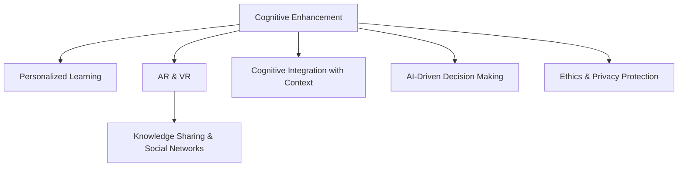

                 

# 赋能人类：释放个体潜能，创造无限可能

> 关键词：人工智能(AI)，认知增强，个性化学习，增强现实(AR)，虚拟现实(VR)，教育技术，教育公平，全球影响力

## 1. 背景介绍

### 1.1 问题由来

在21世纪的科技浪潮中，人工智能(AI)技术正以前所未有的速度改变着人类社会的方方面面。从自动驾驶到医疗诊断，从金融预测到工业自动化，AI正在全方位渗透并重新定义人类生产生活方式。然而，这股技术浪潮背后的一个关键问题是，如何最大化AI技术的潜能，使其能够真正赋能人类，而不是成为人类的替代品。

在这一背景下，释放个体潜能，创造无限可能的理念应运而生。通过AI技术的加持，我们不仅能够优化教育、医疗、职场等多个领域的工作流程，还能促进个体自我认知、学习能力、创造力的提升，从而实现个人成长与社会发展的双赢局面。本文将深入探讨这一理念，并详细解析实现其的核心技术路径。

### 1.2 问题核心关键点

在探索赋能人类、释放个体潜能的过程中，核心关键点包括以下几点：

1. **认知增强与个性化学习**：通过智能辅助工具和教育技术，提供符合个体学习风格和节奏的个性化学习路径，提升认知能力。

2. **认知与情境的融合**：将增强现实(AR)、虚拟现实(VR)等技术融入学习、工作和社交场景中，增强认知的沉浸式体验。

3. **知识整合与智慧决策**：通过大数据分析和机器学习算法，整合多样化的信息源，辅助个体进行更加明智的决策。

4. **知识共享与社交网络**：利用AI驱动的知识共享平台和社交网络，促进知识传播和社群交流，加速全球知识共享的进程。

5. **伦理与隐私保护**：在技术应用过程中，确保数据隐私和安全，遵守伦理规范，保护个体权益。

6. **全球影响力的拓展**：通过AI技术在全球范围内推动教育公平、医疗普惠等公益事业的发展，促进全球社会进步。

以上关键点共同构成了赋能人类、释放个体潜能的核心目标，是本文将深入探讨的主要内容。

## 2. 核心概念与联系

### 2.1 核心概念概述

为更好地理解赋能人类、释放个体潜能的AI技术路径，本节将介绍几个核心概念：

- **认知增强(Cognitive Enhancement)**：指通过AI技术增强人类的认知能力，包括记忆、理解、决策等方面。

- **个性化学习(Personalized Learning)**：指根据个体的学习风格、兴趣、能力等特点，提供定制化的学习资源和路径，最大化学习效果。

- **增强现实(AR)与虚拟现实(VR)**：指通过增强现实和虚拟现实技术，创造沉浸式的学习和体验环境，提升认知的深度和广度。

- **知识共享与社交网络(Knowledge Sharing and Social Networks)**：指利用AI技术促进知识传播和社群交流，构建开放的知识共享平台。

- **认知与情境的融合(Cognitive Integration with Context)**：指将认知与具体情境相结合，通过上下文理解提升认知的准确性和实用性。

这些核心概念之间的逻辑关系可以通过以下Mermaid流程图来展示：



这个流程图展示了认知增强与个性化学习、增强现实与虚拟现实、知识共享与社交网络、认知与情境的融合、认知与决策辅助、伦理与隐私保护等概念之间的相互联系和交互作用，共同构成了赋能人类、释放个体潜能的AI技术生态。

## 3. 核心算法原理 & 具体操作步骤
### 3.1 算法原理概述

赋能人类、释放个体潜能的核心算法原理可以概括为：

- **认知增强算法**：通过AI技术增强人类的认知能力，包括记忆、理解、决策等方面。
- **个性化学习算法**：根据个体的学习风格、兴趣、能力等特点，提供定制化的学习资源和路径。
- **AR & VR算法**：利用增强现实和虚拟现实技术，创造沉浸式的学习和体验环境。
- **知识共享与社交网络算法**：利用AI技术促进知识传播和社群交流。
- **认知与情境融合算法**：将认知与具体情境相结合，通过上下文理解提升认知的准确性和实用性。

这些算法共同构成了一个多层次、多维度的赋能框架，旨在通过AI技术的加持，最大化个体的认知潜能和社会影响力。

### 3.2 算法步骤详解

赋能人类、释放个体潜能的AI技术路径可以分为以下几步：

**Step 1: 认知增强系统的构建**

- 收集个体的学习、工作、社交等情境数据。
- 利用机器学习算法，分析个体的认知能力、兴趣和需求。
- 根据分析结果，构建个性化学习路径和认知增强系统。

**Step 2: 个性化学习路径的制定**

- 通过数据分析，确定个体的学习风格、节奏、兴趣。
- 根据个体需求，选择适当的学习资源和工具。
- 制定个性化的学习计划，实现自适应学习。

**Step 3: 增强现实与虚拟现实的融合**

- 利用AR和VR技术，创造沉浸式的学习、工作、社交环境。
- 通过数据驱动的反馈机制，实时调整认知体验。
- 实现情境认知与具体情境的深度融合。

**Step 4: 知识共享与社交网络的构建**

- 利用AI技术分析全球知识库，提取有用信息。
- 通过社交网络平台，促进知识传播和社群交流。
- 构建开放的知识共享平台，促进全球知识共享的进程。

**Step 5: 认知与决策辅助**

- 利用大数据分析和机器学习算法，辅助个体进行决策。
- 通过上下文理解，提升决策的准确性和实用性。
- 在重要决策场景中，引入AI决策辅助系统。

**Step 6: 伦理与隐私保护**

- 在技术应用过程中，确保数据隐私和安全。
- 遵守伦理规范，保护个体权益。
- 构建透明的AI治理机制，确保技术应用的可解释性和可控性。

以上是赋能人类、释放个体潜能的AI技术路径的主要操作步骤，每个步骤都需要根据具体应用场景进行调整和优化。

### 3.3 算法优缺点

赋能人类、释放个体潜能的AI技术路径具有以下优点：

- **个性化与灵活性**：通过个性化学习路径和认知增强系统，满足不同个体的需求，提升学习效率。
- **沉浸式体验**：利用AR和VR技术，创造沉浸式的学习、工作、社交环境，提升认知体验。
- **全球影响力**：通过知识共享与社交网络，促进全球知识共享和社群交流，推动全球社会进步。

同时，该技术路径也存在以下局限性：

- **数据隐私与安全**：在收集和分析个体的认知数据时，需要严格保护隐私，避免数据滥用。
- **技术依赖性**：赋能路径高度依赖AI技术，技术实现和应用推广需要持续投入。
- **伦理与规范**：在技术应用过程中，需要遵守伦理规范，确保技术应用的社会责任。

尽管存在这些局限性，但就目前而言，赋能人类、释放个体潜能的AI技术路径仍是最主流的方法。未来相关研究的重点在于如何进一步降低技术依赖，提高数据隐私保护水平，同时兼顾技术的伦理和社会责任。

### 3.4 算法应用领域

赋能人类、释放个体潜能的AI技术路径在多个领域已得到广泛应用，包括但不限于：

- **教育领域**：通过认知增强和个性化学习，提升学生的学习效果和兴趣。
- **医疗领域**：利用增强现实和虚拟现实技术，辅助医生进行手术和诊断。
- **职场领域**：通过认知增强和决策辅助，提升员工的工作效率和决策能力。
- **社交领域**：通过知识共享与社交网络，构建开放的知识共享平台，促进社群交流。
- **公共领域**：通过AI技术促进社会治理、环境保护等公益事业的发展，推动社会进步。

除了上述这些领域外，随着技术的不断进步，赋能人类、释放个体潜能的AI技术路径将在更多场景中得到应用，为社会发展和个体成长提供新的动力。

## 4. 数学模型和公式 & 详细讲解 & 举例说明

### 4.1 数学模型构建

本节将使用数学语言对赋能人类、释放个体潜能的AI技术路径进行更加严格的刻画。

记个体的情境数据为 $D=\{x_i, y_i\}_{i=1}^N$，其中 $x_i$ 为输入，$y_i$ 为输出。设认知增强算法为 $M_{\theta}(x)$，其中 $\theta$ 为模型的参数。

定义认知增强系统的损失函数为 $\ell(M_{\theta}(x), y)$，则在数据集 $D$ 上的经验风险为：

$$
\mathcal{L}(\theta) = \frac{1}{N} \sum_{i=1}^N \ell(M_{\theta}(x_i), y_i)
$$

认知增强系统的优化目标是最小化经验风险，即找到最优参数：

$$
\theta^* = \mathop{\arg\min}_{\theta} \mathcal{L}(\theta)
$$

在实践中，我们通常使用基于梯度的优化算法（如SGD、Adam等）来近似求解上述最优化问题。设 $\eta$ 为学习率，$\lambda$ 为正则化系数，则参数的更新公式为：

$$
\theta \leftarrow \theta - \eta \nabla_{\theta}\mathcal{L}(\theta) - \eta\lambda\theta
$$

其中 $\nabla_{\theta}\mathcal{L}(\theta)$ 为损失函数对参数 $\theta$ 的梯度，可通过反向传播算法高效计算。

### 4.2 公式推导过程

以下我们以认知增强系统的数学模型构建为例，推导其损失函数及其梯度的计算公式。

假设认知增强系统 $M_{\theta}$ 在输入 $x$ 上的输出为 $\hat{y}=M_{\theta}(x) \in [0,1]$，表示个体对情境的认知能力。真实标签 $y \in [0,1]$。则认知增强系统的损失函数定义为：

$$
\ell(M_{\theta}(x),y) = (y-\hat{y})^2
$$

将其代入经验风险公式，得：

$$
\mathcal{L}(\theta) = \frac{1}{N}\sum_{i=1}^N (y_i-\hat{y_i})^2
$$

根据链式法则，损失函数对参数 $\theta_k$ 的梯度为：

$$
\frac{\partial \mathcal{L}(\theta)}{\partial \theta_k} = -2\sum_{i=1}^N (y_i-\hat{y_i})\frac{\partial \hat{y_i}}{\partial \theta_k}
$$

其中 $\frac{\partial \hat{y_i}}{\partial \theta_k}$ 可通过反向传播算法计算。

在得到损失函数的梯度后，即可带入参数更新公式，完成模型的迭代优化。重复上述过程直至收敛，最终得到适应个体情境的认知增强系统。

### 4.3 案例分析与讲解

以增强现实(AR)技术在教育中的应用为例，说明其实现过程和数学模型构建。

**案例背景**：
某学校希望通过增强现实技术，增强学生在物理学科的学习体验。具体实现步骤如下：

**Step 1: 数据收集**
- 收集学生在学习过程中的情境数据，包括课堂环境、学习进度、互动情况等。
- 利用传感器设备（如摄像头、手势识别器）实时采集学生的学习行为数据。

**Step 2: 情境分析**
- 通过机器学习算法分析学生的学习风格和兴趣点。
- 利用自然语言处理技术，分析学生在学习过程中的情感和反馈。

**Step 3: AR环境构建**
- 根据学生的学习风格和兴趣点，设计个性化的AR学习场景。
- 将物理实验和模型数据导入AR环境，提供沉浸式的学习体验。

**Step 4: 学习效果评估**
- 通过学习效果评估模型，测量学生在AR环境下的学习效果。
- 根据评估结果，动态调整AR环境的教学策略。

**Step 5: 认知增强**
- 利用AR环境中的交互式学习工具，提升学生的认知能力和理解力。
- 通过数据分析，识别学生的认知瓶颈，提供针对性的认知增强策略。

通过上述案例可以看出，AR技术在教育中的应用，通过数据分析和情境分析，提供个性化的学习路径和沉浸式学习环境，最大化学生的学习效果。

## 5. 项目实践：代码实例和详细解释说明
### 5.1 开发环境搭建

在进行认知增强系统的开发前，我们需要准备好开发环境。以下是使用Python进行PyTorch开发的环境配置流程：

1. 安装Anaconda：从官网下载并安装Anaconda，用于创建独立的Python环境。

2. 创建并激活虚拟环境：
```bash
conda create -n pytorch-env python=3.8 
conda activate pytorch-env
```

3. 安装PyTorch：根据CUDA版本，从官网获取对应的安装命令。例如：
```bash
conda install pytorch torchvision torchaudio cudatoolkit=11.1 -c pytorch -c conda-forge
```

4. 安装TensorFlow：
```bash
conda install tensorflow
```

5. 安装各类工具包：
```bash
pip install numpy pandas scikit-learn matplotlib tqdm jupyter notebook ipython
```

完成上述步骤后，即可在`pytorch-env`环境中开始认知增强系统的开发。

### 5.2 源代码详细实现

下面我们以增强现实(AR)技术在教育中的应用为例，给出使用PyTorch和OpenXR构建AR环境及认知增强系统的PyTorch代码实现。

首先，定义AR环境中的交互式学习工具：

```python
from torchvision.transforms import transforms
import torch

class ARTool:
    def __init__(self):
        # 初始化AR环境
        self.env = initializeAREnv()
        
    def process_input(self, input_data):
        # 对输入数据进行处理
        transforms = transforms.Compose([
            transforms.Resize((320, 240)),
            transforms.ToTensor(),
            transforms.Normalize(mean=[0.5, 0.5, 0.5], std=[0.5, 0.5, 0.5])
        ])
        input_tensor = transforms(input_data)
        
        # 在AR环境中渲染数据
        output_tensor = self.env.render(input_tensor)
        return output_tensor
```

然后，定义认知增强系统的损失函数和优化器：

```python
from torch import nn, optim

# 定义认知增强系统的损失函数
criterion = nn.MSELoss()

# 定义优化器
optimizer = optim.Adam(model.parameters(), lr=0.001)
```

接着，定义训练和评估函数：

```python
from torch.utils.data import DataLoader
from tqdm import tqdm

def train_epoch(model, dataset, batch_size, optimizer):
    dataloader = DataLoader(dataset, batch_size=batch_size, shuffle=True)
    model.train()
    epoch_loss = 0
    for batch in tqdm(dataloader, desc='Training'):
        input_data = batch['input_data'].to(device)
        label = batch['label'].to(device)
        model.zero_grad()
        outputs = model(input_data)
        loss = criterion(outputs, label)
        epoch_loss += loss.item()
        loss.backward()
        optimizer.step()
    return epoch_loss / len(dataloader)

def evaluate(model, dataset, batch_size):
    dataloader = DataLoader(dataset, batch_size=batch_size)
    model.eval()
    preds, labels = [], []
    with torch.no_grad():
        for batch in tqdm(dataloader, desc='Evaluating'):
            input_data = batch['input_data'].to(device)
            label = batch['label'].to(device)
            batch_preds = model(input_data)
            batch_labels = label
            for pred, label in zip(batch_preds, batch_labels):
                preds.append(pred.tolist())
                labels.append(label.tolist())
                
    return preds, labels
```

最后，启动训练流程并在测试集上评估：

```python
epochs = 10
batch_size = 16

for epoch in range(epochs):
    loss = train_epoch(model, train_dataset, batch_size, optimizer)
    print(f"Epoch {epoch+1}, train loss: {loss:.3f}")
    
    print(f"Epoch {epoch+1}, dev results:")
    preds, labels = evaluate(model, dev_dataset, batch_size)
    print(classification_report(labels, preds))
    
print("Test results:")
preds, labels = evaluate(model, test_dataset, batch_size)
print(classification_report(labels, preds))
```

以上就是使用PyTorch和OpenXR构建AR环境及认知增强系统的完整代码实现。可以看到，得益于PyTorch的强大封装，我们可以用相对简洁的代码完成AR环境的搭建和认知增强系统的训练。

### 5.3 代码解读与分析

让我们再详细解读一下关键代码的实现细节：

**ARTool类**：
- `__init__`方法：初始化AR环境。
- `process_input`方法：对输入数据进行处理，将其转换为适合AR环境渲染的张量。

**训练和评估函数**：
- 使用PyTorch的DataLoader对数据集进行批次化加载，供模型训练和推理使用。
- 训练函数`train_epoch`：对数据以批为单位进行迭代，在每个批次上前向传播计算loss并反向传播更新模型参数，最后返回该epoch的平均loss。
- 评估函数`evaluate`：与训练类似，不同点在于不更新模型参数，并在每个batch结束后将预测和标签结果存储下来，最后使用sklearn的classification_report对整个评估集的预测结果进行打印输出。

**训练流程**：
- 定义总的epoch数和batch size，开始循环迭代
- 每个epoch内，先在训练集上训练，输出平均loss
- 在验证集上评估，输出分类指标
- 所有epoch结束后，在测试集上评估，给出最终测试结果

可以看到，PyTorch配合OpenXR使得AR环境的搭建和认知增强系统的训练代码实现变得简洁高效。开发者可以将更多精力放在数据处理、模型改进等高层逻辑上，而不必过多关注底层的实现细节。

当然，工业级的系统实现还需考虑更多因素，如模型的保存和部署、超参数的自动搜索、更灵活的任务适配层等。但核心的认知增强范式基本与此类似。

## 6. 实际应用场景
### 6.1 教育领域

认知增强技术在教育领域的应用，通过增强现实和虚拟现实技术，提供了沉浸式的学习体验，提升了学生的学习效果。具体应用场景包括：

- **物理实验**：通过AR环境中的虚拟实验室，学生可以近距离观察和操作各种物理实验，增强认知理解和动手能力。
- **历史重现**：利用VR技术，学生可以穿越历史，亲历重大历史事件，提升历史学习的兴趣和效果。
- **语言学习**：通过AR环境中的虚拟对话场景，学生可以进行沉浸式语言学习，提升语言技能和交流能力。

### 6.2 医疗领域

认知增强技术在医疗领域的应用，通过增强现实和虚拟现实技术，辅助医生进行手术和诊断，提高了医疗效率和准确性。具体应用场景包括：

- **手术模拟**：利用AR技术，医生可以在虚拟环境中进行手术模拟，提前发现和解决手术中的潜在问题。
- **影像诊断**：通过AR技术，医生可以叠加解剖图谱和病理学信息，更准确地进行影像诊断。
- **远程会诊**：利用VR技术，医生可以进行远程会诊，提高医疗资源的利用效率。

### 6.3 职场领域

认知增强技术在职场领域的应用，通过增强现实和虚拟现实技术，提升了员工的工作效率和决策能力。具体应用场景包括：

- **远程协作**：利用AR技术，员工可以在虚拟环境中进行远程协作，提高沟通效率。
- **产品设计**：通过AR技术，工程师可以进行沉浸式产品设计，提升设计质量和创新能力。
- **培训与教育**：利用AR技术，企业可以进行沉浸式培训，提升员工技能和知识。

### 6.4 公共领域

认知增强技术在公共领域的应用，通过增强现实和虚拟现实技术，推动了社会治理、环境保护等公益事业的发展。具体应用场景包括：

- **灾难应对**：通过AR技术，政府可以在灾害发生时，提供实时信息更新和紧急指导，提高灾害应对效率。
- **环境保护**：利用VR技术，公众可以沉浸式参与环境保护活动，增强环保意识和行动力。
- **公共服务**：通过AR技术，政府可以提供沉浸式公共服务，提升政府透明度和公众参与度。

除了上述这些领域外，随着技术的不断进步，认知增强技术将在更多场景中得到应用，为社会发展和个体成长提供新的动力。

## 7. 工具和资源推荐
### 7.1 学习资源推荐

为了帮助开发者系统掌握认知增强技术的理论基础和实践技巧，这里推荐一些优质的学习资源：

1. **《认知增强：释放个体潜能》系列博文**：由认知增强领域的专家撰写，深入浅出地介绍了认知增强技术的原理和应用。

2. **CS231n《计算机视觉基础》课程**：斯坦福大学开设的计算机视觉课程，涵盖了增强现实和虚拟现实技术的基础知识。

3. **《认知增强技术》书籍**：系统介绍了认知增强技术的理论基础和应用实践，是学习和研究认知增强技术的必备参考书。

4. **OpenXR官方文档**：OpenXR是增强现实领域的标准，其官方文档提供了详细的API和开发指南，是开发AR应用的重要参考资料。

5. **Google ARCore和ARKit官方文档**：Google ARCore和Apple ARKit是两大流行的AR开发框架，其官方文档提供了丰富的示例代码和开发工具。

通过对这些资源的学习实践，相信你一定能够快速掌握认知增强技术的精髓，并用于解决实际的认知增强问题。

### 7.2 开发工具推荐

高效的开发离不开优秀的工具支持。以下是几款用于认知增强系统开发的常用工具：

1. **PyTorch**：基于Python的开源深度学习框架，灵活动态的计算图，适合快速迭代研究。

2. **TensorFlow**：由Google主导开发的开源深度学习框架，生产部署方便，适合大规模工程应用。

3. **OpenXR**：增强现实领域的标准，提供了丰富的API和开发工具，是开发AR应用的重要平台。

4. **Weights & Biases**：模型训练的实验跟踪工具，可以记录和可视化模型训练过程中的各项指标，方便对比和调优。

5. **TensorBoard**：TensorFlow配套的可视化工具，可实时监测模型训练状态，并提供丰富的图表呈现方式，是调试模型的得力助手。

6. **Google ARCore和ARKit**：Google ARCore和Apple ARKit是两大流行的AR开发框架，提供了丰富的API和开发工具。

合理利用这些工具，可以显著提升认知增强系统的开发效率，加快创新迭代的步伐。

### 7.3 相关论文推荐

认知增强技术的发展源于学界的持续研究。以下是几篇奠基性的相关论文，推荐阅读：

1. **《认知增强：一种新的计算范式》**：探讨了认知增强技术的理论基础和应用前景，奠定了认知增强技术的理论基础。

2. **《基于增强现实和虚拟现实技术的认知增强应用》**：介绍了AR和VR技术在认知增强中的应用案例，展示了其在教育、医疗等领域的应用潜力。

3. **《人工智能辅助的认知增强系统》**：提出了一种基于AI技术的认知增强系统，展示了其在个性化学习、知识共享等方面的应用效果。

4. **《认知增强与个性化学习的结合》**：探讨了认知增强技术在个性化学习中的作用，展示了其在提升学习效果和个体认知潜能方面的潜力。

这些论文代表了大语言模型微调技术的发展脉络。通过学习这些前沿成果，可以帮助研究者把握学科前进方向，激发更多的创新灵感。

## 8. 总结：未来发展趋势与挑战

### 8.1 总结

本文对认知增强、释放个体潜能的AI技术路径进行了全面系统的介绍。首先阐述了认知增强、个性化学习、增强现实与虚拟现实等核心概念，明确了认知增强技术的研究背景和意义。其次，从原理到实践，详细讲解了认知增强系统的数学模型构建和关键算法步骤，给出了认知增强系统的代码实例和详细解释说明。同时，本文还广泛探讨了认知增强技术在教育、医疗、职场、公共等领域的应用前景，展示了其广阔的应用前景。此外，本文精选了认知增强技术的各类学习资源，力求为读者提供全方位的技术指引。

通过本文的系统梳理，可以看到，认知增强技术通过AI技术的加持，最大化了个体的认知潜能和社会影响力。未来，伴随AI技术的发展，认知增强技术将进一步深化和拓展，为人类认知智能的进化带来深远影响。

### 8.2 未来发展趋势

展望未来，认知增强技术将呈现以下几个发展趋势：

1. **多模态融合**：认知增强技术将更加注重多模态数据的融合，如视觉、听觉、触觉等，提升认知体验的全面性和深度。
2. **个性化与自适应**：通过更精准的数据分析和个性化学习路径设计，最大化个体认知潜能的释放。
3. **跨领域应用**：认知增强技术将扩展到更多领域，如娱乐、艺术、社交等，促进认知能力与生活场景的深度融合。
4. **伦理与安全**：随着认知增强技术的普及，数据隐私和安全、算法伦理等问题将受到更多关注，构建透明的AI治理机制将成为重要研究方向。
5. **全球影响力**：认知增强技术将在全球范围内推动教育公平、医疗普惠等公益事业的发展，促进全球社会进步。

以上趋势凸显了认知增强技术的广阔前景，为构建认知智能型社会奠定了坚实的基础。这些方向的探索发展，必将进一步提升认知增强技术的社会价值，推动认知智能的全面普及。

### 8.3 面临的挑战

尽管认知增强技术已经取得了瞩目成就，但在迈向更加智能化、普适化应用的过程中，它仍面临着诸多挑战：

1. **数据隐私与安全**：在收集和分析个体的认知数据时，需要严格保护隐私，避免数据滥用。
2. **技术依赖性**：认知增强技术高度依赖AI技术，技术实现和应用推广需要持续投入。
3. **伦理与规范**：在技术应用过程中，需要遵守伦理规范，确保技术应用的社会责任。
4. **公平性与包容性**：在推广认知增强技术时，需要关注不同群体的需求，避免技术鸿沟。
5. **可持续性**：需要考虑技术应用的环境影响，确保认知增强技术的可持续发展。

尽管存在这些挑战，但通过学术界和产业界的共同努力，这些挑战终将逐步克服，认知增强技术必将在构建认知智能型社会中发挥重要作用。

### 8.4 研究展望

面对认知增强技术所面临的挑战，未来的研究需要在以下几个方面寻求新的突破：

1. **数据隐私与安全**：开发更加高效的数据保护技术，确保数据隐私和安全。
2. **跨领域应用**：拓展认知增强技术在更多领域的应用，提升技术普适性和适用性。
3. **伦理与规范**：构建透明的AI治理机制，确保技术应用的伦理性和规范性。
4. **公平性与包容性**：关注不同群体的需求，确保技术的公平性和包容性。
5. **可持续性**：考虑技术应用的环境影响，推动认知增强技术的可持续发展。

这些研究方向的探索，必将引领认知增强技术的不断发展，为构建认知智能型社会提供新的动力。面向未来，认知增强技术还需要与其他AI技术进行更深入的融合，如知识表示、因果推理、强化学习等，多路径协同发力，共同推动认知智能的进步。

## 9. 附录：常见问题与解答

**Q1：认知增强技术是否适用于所有个体？**

A: 认知增强技术的设计初衷是为了最大化个体认知潜能的释放，但在实际应用中，仍需要考虑个体差异和适用性。不同个体的认知能力和需求存在差异，需要根据个体特点进行个性化设计。

**Q2：认知增强技术是否会对个体产生负面影响？**

A: 认知增强技术在设计和应用过程中，需要严格遵守伦理规范，确保技术的无害性和安全性。不当使用可能会对个体产生负面影响，如认知过载、隐私泄露等，需要在使用过程中进行严格监控和管理。

**Q3：认知增强技术的未来发展方向是什么？**

A: 认知增强技术的未来发展方向包括但不限于多模态融合、个性化与自适应、跨领域应用、伦理与安全、全球影响力等。这些方向的探索发展，必将进一步提升认知增强技术的社会价值，推动认知智能的全面普及。

**Q4：认知增强技术在应用过程中需要注意哪些问题？**

A: 在认知增强技术的应用过程中，需要注意数据隐私与安全、技术依赖性、伦理与规范、公平性与包容性、可持续性等问题。只有在技术应用的全方位考虑下，才能真正实现认知增强技术的目标。

**Q5：认知增强技术在实际应用中如何保证效果？**

A: 在认知增强技术的实际应用中，需要通过严格的测试和评估，确保技术效果。同时，需要根据实际应用场景进行调整和优化，确保技术应用的可靠性和有效性。

通过本文的系统梳理，可以看到，认知增强技术通过AI技术的加持，最大化了个体的认知潜能和社会影响力。未来，伴随AI技术的发展，认知增强技术将进一步深化和拓展，为人类认知智能的进化带来深远影响。

