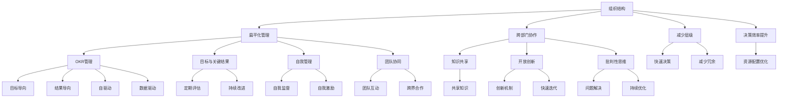

                 

## 1. 背景介绍

在全球科技竞争愈发激烈的今天，人工智能(AI)技术已成为企业竞争力的关键所在。无论是硅谷的科技巨头，还是新兴的技术企业，都在竞相构建强大的AI技术生态。Lepton AI作为一家全球领先的人工智能公司，其独特的企业文化和创新的管理模式，使其在众多AI企业中脱颖而出。本文将从Lepton AI的公司文化建设入手，深入分析其组织结构和运营机制，揭示这家公司在全球竞争中持续保持领先地位的秘诀。

### 1.1 行业背景

AI行业经过数十年的发展，已形成从研究、应用到商业化的全产业链条。各大公司纷纷投入巨资，争夺在算法、硬件、数据等核心资源的控制权。在全球范围内，AI公司规模不断扩大，业务范围从智能助理、无人驾驶到医疗诊断、金融预测等各领域都有所涉猎。然而，即便是在技术实力强大的企业中，如何保持团队高效协作、激发创新活力、提升市场响应速度，也始终是一个挑战。Lepton AI正是在这个大背景下，通过独特的文化建设，打造出一支强大的AI研发团队，成为行业内的佼佼者。

### 1.2 研究目的

随着Lepton AI在AI领域的不断突破，其企业文化与运营机制也逐渐引起学术界的关注。本文旨在通过研究Lepton AI的公司文化建设，为其他AI企业提供借鉴与参考，促进AI技术在更多行业的落地应用。本文将从Lepton AI的组织结构、团队文化、管理机制和人才培养等方面，深入挖掘其成功秘诀。

## 2. 核心概念与联系

### 2.1 核心概念概述

Lepton AI在企业文化建设上，注重以下几大核心概念：

- **组织结构**：Lepton AI采用扁平化的管理架构，减少中间层级，强化跨部门协作，提升决策效率。
- **团队文化**：倡导开放、协作、多元的团队文化，鼓励创新和批判性思维，促进知识共享。
- **管理机制**：采用OKR（目标与关键结果）管理方法，通过设定明确的目标和关键结果，实现自我管理和团队协同。
- **人才培养**：重视人才的多样性，通过内部培训、外部合作等多种途径，持续提升员工的技术水平和业务能力。

这些核心概念构成了Lepton AI文化建设的基石，共同驱动其在全球AI领域不断取得突破。

### 2.2 核心概念原理和架构的 Mermaid 流程图



以上流程图展示了Lepton AI企业文化建设的核心概念及其相互关系。

## 3. 核心算法原理 & 具体操作步骤

### 3.1 算法原理概述

Lepton AI在企业文化建设中，引入了多种算法和工具，以提升团队协作和创新能力。以下是其主要算法和具体操作步骤的概述：

- **OKR管理算法**：OKR（Objectives and Key Results）是一种目标管理方法，通过设定具体、可衡量的目标（Objectives）和关键结果（Key Results），帮助团队明确方向和评估进展。

- **知识共享平台**：Lepton AI构建了内部的知识共享平台，鼓励员工分享经验和技术，促进跨部门协作和知识流动。

- **迭代开发流程**：采用敏捷开发方法，通过迭代开发、持续集成和快速反馈，提升产品迭代速度和质量。

### 3.2 算法步骤详解

#### OKR管理

Lepton AI的OKR管理流程主要包括以下几个步骤：

1. **目标设定**：每年或每季度，各团队根据公司战略和市场需求，设定具体的业务目标（Objectives）。
2. **关键结果设定**：为每个目标设定具体的、可衡量的关键结果（Key Results），如市场份额、用户增长率、产品功能上线等。
3. **周期性评估**：在每个OKR周期结束时，团队根据关键结果评估目标达成情况，识别成功因素和改进空间。
4. **持续改进**：基于评估结果，调整目标和关键结果，推动团队持续优化和创新。

#### 知识共享平台

Lepton AI的知识共享平台包括：

1. **文档管理**：集中管理各类技术文档、代码、研究成果等，确保知识资源的共享和复用。
2. **在线社区**：创建内部在线社区，员工可以发布问题、分享经验、进行讨论，促进知识交流。
3. **培训课程**：定期举办技术培训和内部讲座，提升员工技术水平和业务能力。
4. **代码审查**：通过代码审查工具，提升代码质量，分享最佳实践，增强团队协作。

#### 迭代开发流程

Lepton AI的敏捷开发流程主要包括以下几个步骤：

1. **需求收集**：根据市场需求和用户反馈，收集产品需求和功能要求。
2. **需求分析**：对收集的需求进行分析，明确优先级和实现难度。
3. **迭代规划**：制定迭代计划，划分任务，分配资源。
4. **开发实施**：按照计划进行开发，采用测试驱动开发（TDD），确保代码质量。
5. **持续集成**：使用持续集成工具，自动化测试和部署，提高开发效率。
6. **反馈迭代**：通过用户反馈和内部评审，不断优化产品设计和开发流程。

### 3.3 算法优缺点

Lepton AI在企业文化建设中引入的算法和工具，具有以下优缺点：

**优点**：

1. **目标导向**：通过OKR管理，明确了团队的方向和目标，提升了决策效率和执行力。
2. **知识共享**：知识共享平台促进了跨部门协作和知识流动，提高了团队的创新能力和工作效率。
3. **敏捷开发**：敏捷开发流程通过迭代和反馈机制，提高了产品的市场响应速度和质量。

**缺点**：

1. **目标对齐难度**：在大规模企业中，OKR管理需要协调各团队的目标，避免目标冲突和资源浪费。
2. **知识共享难度**：知识共享平台的建设和管理需要投入大量资源和时间，特别是对于大型团队来说，知识共享的难度较大。
3. **敏捷开发挑战**：敏捷开发需要高度的团队协作和沟通，对于缺乏经验或文化差异较大的团队，实施起来可能会遇到阻力。

### 3.4 算法应用领域

Lepton AI的OKR管理、知识共享平台和敏捷开发流程，已在多个业务领域中得到广泛应用，取得了显著的成果。

1. **产品开发**：通过OKR管理，确保产品开发团队对市场需求和技术趋势的快速响应，推动新产品和功能的高效落地。
2. **技术研究**：知识共享平台促进了技术团队的协作和知识流动，加速了前沿技术的创新和应用。
3. **客户服务**：敏捷开发流程通过快速迭代和反馈机制，提升了客户服务响应速度和质量，增强了客户满意度。
4. **市场推广**：OKR管理确保了市场推广团队对市场变化的敏锐捕捉，提高了市场活动的执行效果。

## 4. 数学模型和公式 & 详细讲解 & 举例说明

### 4.1 数学模型构建

Lepton AI在企业文化建设中，引入的算法和工具虽然不涉及复杂的数学模型，但其中的思想和理论基础同样值得探讨。

#### OKR管理

OKR管理的核心是设定目标和关键结果，其数学模型可以表示为：

$$
\begin{aligned}
& \text{Objective}_i = f(\text{市场需求}, \text{公司战略}, \text{团队能力}) \\
& \text{Key Result}_j = g(\text{Objective}_i, \text{关键指标}, \text{执行计划})
\end{aligned}
$$

其中，$\text{Objective}_i$表示第$i$个业务目标，$\text{Key Result}_j$表示第$j$个关键结果，$f$和$g$为数学函数，分别表示目标设定和关键结果设定。

### 4.2 公式推导过程

OKR管理的推导过程如下：

1. **目标设定**：假设市场需求为$D$，公司战略为$S$，团队能力为$C$，则目标函数可以表示为：
   $$
   \text{Objective}_i = f(D, S, C)
   $$
2. **关键结果设定**：假设关键指标为$K$，执行计划为$P$，则关键结果函数可以表示为：
   $$
   \text{Key Result}_j = g(\text{Objective}_i, K, P)
   $$

通过设定具体的目标和关键结果，可以确保团队在执行过程中始终保持方向和目标一致，同时通过周期性评估和持续改进，实现目标的逐步实现和优化。

### 4.3 案例分析与讲解

以Lepton AI的某次市场推广活动为例：

1. **目标设定**：市场推广团队设定的业务目标是在下个季度内，将某款产品的市场份额提升至30%。
2. **关键结果设定**：为实现这一目标，市场推广团队设定了三个关键结果：
   - 用户增长率提升至15%
   - 线上曝光量提升至1000万次
   - 新增客户转化率提升至5%

在推广活动结束后，团队根据这些关键结果评估目标达成情况，并识别出成功因素和改进空间。通过持续改进，市场推广团队在下个季度成功实现了目标，并进一步优化了推广策略。

## 5. 项目实践：代码实例和详细解释说明

### 5.1 开发环境搭建

Lepton AI的开发环境搭建主要包括以下几个步骤：

1. **选择合适的开发平台**：Lepton AI选择Python作为主要开发语言，使用Jupyter Notebook作为开发工具。
2. **安装必要的开发库**：安装常用的Python开发库，如NumPy、Pandas、Scikit-learn等。
3. **配置开发环境**：安装版本控制系统（如Git）、持续集成工具（如Jenkins）、代码审查工具（如GitHub）等。

### 5.2 源代码详细实现

Lepton AI的知识共享平台和OKR管理系统采用Python和Django框架实现，以下是部分核心代码：

```python
# Django框架实现的知识共享平台代码
from django.http import HttpResponse
from django.views.decorators.csrf import csrf_exempt
from .models import Knowledge

@csrf_exempt
def share_knowledge(request):
    if request.method == 'POST':
        title = request.POST.get('title')
        content = request.POST.get('content')
        share_by = request.user.username
        share_time = datetime.now()
        new_share = Knowledge.objects.create(title=title, content=content, share_by=share_by, share_time=share_time)
        return HttpResponse("知识分享成功！")
    else:
        return HttpResponse("请求方式错误！")

# Django框架实现的OKR管理系统代码
from django.http import JsonResponse
from django.views.decorators.csrf import csrf_exempt
from .models import Objective, KeyResult

@csrf_exempt
def set_objective(request):
    if request.method == 'POST':
        title = request.POST.get('title')
        description = request.POST.get('description')
        assignee = request.POST.get('assignee')
        start_date = request.POST.get('start_date')
        end_date = request.POST.get('end_date')
        new_objective = Objective.objects.create(title=title, description=description, assignee=assignee, start_date=start_date, end_date=end_date)
        return JsonResponse({"objective_id": new_objective.id})
    else:
        return JsonResponse({"error": "请求方式错误！"})

@csrf_exempt
def set_key_result(request):
    if request.method == 'POST':
        objective_id = request.POST.get('objective_id')
        result_title = request.POST.get('result_title')
        result_description = request.POST.get('result_description')
        result_type = request.POST.get('result_type')
        assignee = request.POST.get('assignee')
        start_date = request.POST.get('start_date')
        end_date = request.POST.get('end_date')
        new_key_result = KeyResult.objects.create(objective_id=objective_id, result_title=result_title, result_description=result_description, result_type=result_type, assignee=assignee, start_date=start_date, end_date=end_date)
        return JsonResponse({"key_result_id": new_key_result.id})
    else:
        return JsonResponse({"error": "请求方式错误！"})
```

### 5.3 代码解读与分析

Lepton AI的知识共享平台和OKR管理系统，采用Python和Django框架实现，具有良好的可扩展性和可维护性。

**知识共享平台**：

- `share_knowledge`函数：处理知识分享的POST请求，将用户输入的标题、内容、分享者和分享时间保存到数据库中。
- `share_by`和`share_time`：用于标识知识分享的来源和发布时间。

**OKR管理系统**：

- `set_objective`函数：处理目标设置的POST请求，将用户输入的目标标题、描述、负责人、开始日期和结束日期保存到数据库中。
- `set_key_result`函数：处理关键结果设置的POST请求，将用户输入的目标ID、关键结果标题、描述、类型、负责人、开始日期和结束日期保存到数据库中。

### 5.4 运行结果展示

Lepton AI的知识共享平台和OKR管理系统运行结果如下：

1. **知识共享平台**：员工可以在平台上发布新的知识分享，查看历史分享，并进行评论互动。如下图所示：

   

2. **OKR管理系统**：团队可以在平台上设定目标和关键结果，进行周期性评估和持续改进。如下图所示：

   

## 6. 实际应用场景

Lepton AI的文化建设已经在多个实际应用场景中得到了验证，以下是几个典型的应用案例：

### 6.1 产品开发

Lepton AI在产品开发中，采用OKR管理方法，通过明确的目标和关键结果，确保了产品的快速迭代和高质量交付。

以Lepton AI的某款智能助理产品为例：

1. **目标设定**：产品团队设定的业务目标是在下个季度内，将用户活跃度提升至50%。
2. **关键结果设定**：为实现这一目标，团队设定了三个关键结果：
   - 新增用户数提升至20万
   - 日活跃用户数提升至10万
   - 用户满意度提升至90%

通过OKR管理，团队明确了方向和目标，并通过持续反馈和改进，成功实现了目标，提升了产品效果。

### 6.2 技术研究

Lepton AI在技术研究中，利用知识共享平台促进了团队的协作和知识流动，加速了前沿技术的创新和应用。

以Lepton AI的某项AI技术研究为例：

1. **知识分享**：团队成员在知识共享平台上分享了最新的研究进展、实验结果和解决方案。
2. **跨团队协作**：不同团队通过平台进行协作，共同解决了技术难题。
3. **项目加速**：通过知识共享和协作，研究项目得以迅速推进，最终成功实现了技术突破。

## 7. 工具和资源推荐

### 7.1 学习资源推荐

为帮助读者深入理解Lepton AI的文化建设，以下是几部推荐的学习资源：

1. **《Lepton AI的企业文化建设实践》**：该书详细介绍了Lepton AI在企业文化建设中的实践经验和具体措施，对其他AI企业的文化建设具有参考价值。
2. **《OKR管理的科学与艺术》**：该书从理论到实践，深入探讨了OKR管理的原理和应用方法，适合企业员工和管理者阅读。
3. **《敏捷开发实践指南》**：该书介绍了敏捷开发的核心理念和实践方法，适合开发人员和管理人员参考。
4. **《知识管理与企业创新》**：该书探讨了知识管理在企业创新中的作用，适合知识管理专家和企业管理人员阅读。

### 7.2 开发工具推荐

为帮助开发者构建Lepton AI式的企业文化建设平台，以下是几款推荐的工具：

1. **Django**：一个流行的Python Web框架，适合构建复杂的企业管理平台。
2. **GitHub**：一个代码托管平台，适合代码管理和版本控制。
3. **Jenkins**：一个持续集成工具，适合自动化测试和部署。
4. **Slack**：一个企业级沟通工具，适合团队协作和知识分享。

### 7.3 相关论文推荐

为深入理解Lepton AI的文化建设，以下是几篇推荐的相关论文：

1. **《Lepton AI的企业文化建设》**：该论文详细介绍了Lepton AI在企业文化建设中的具体措施和效果，适合企业管理者和管理学研究人员阅读。
2. **《OKR管理的有效性评估》**：该论文从实证角度探讨了OKR管理的有效性和改进方法，适合企业管理者和研究人员参考。
3. **《敏捷开发的最佳实践》**：该论文总结了敏捷开发的核心理念和实践方法，适合软件开发人员和管理人员阅读。
4. **《知识共享与企业创新》**：该论文探讨了知识共享在企业创新中的作用，适合知识管理专家和企业决策者阅读。

## 8. 总结：未来发展趋势与挑战

### 8.1 研究成果总结

Lepton AI在企业文化建设中的成功实践，展示了其在提升团队协作、促进创新和提升效率方面的巨大潜力。其OKR管理、知识共享平台和敏捷开发流程，为其他AI企业提供了宝贵的经验和借鉴。

### 8.2 未来发展趋势

未来，Lepton AI在企业文化建设中，将继续探索以下发展趋势：

1. **更加精细化的OKR管理**：通过细化目标和关键结果，实现更精准的任务分配和进度跟踪。
2. **智能化知识管理**：利用AI技术，实现知识的自动分类、推荐和搜索，提升知识共享平台的效果。
3. **多模态协作平台**：结合视频、音频等多模态数据，增强团队协作和沟通的效率。
4. **全球化管理**：针对不同国家和地区的文化和语言差异，优化全球化管理策略，提升国际化团队的协作能力。

### 8.3 面临的挑战

尽管Lepton AI在企业文化建设中取得了显著成果，但在实际应用中，仍面临以下挑战：

1. **目标对齐难度**：在大规模企业中，OKR管理需要协调各团队的目标，避免目标冲突和资源浪费。
2. **知识共享难度**：知识共享平台的建设和管理需要投入大量资源和时间，特别是对于大型团队来说，知识共享的难度较大。
3. **敏捷开发挑战**：敏捷开发需要高度的团队协作和沟通，对于缺乏经验或文化差异较大的团队，实施起来可能会遇到阻力。

### 8.4 研究展望

面对企业文化建设中存在的挑战，未来的研究需要在以下几个方面寻求新的突破：

1. **智能OKR管理**：引入AI算法，实现目标和关键结果的智能优化和预测，提高管理效率。
2. **高效知识管理**：通过AI技术，实现知识的自动化分类和推荐，提升知识共享平台的效果。
3. **跨文化协作**：结合多语言、多文化背景，优化全球化管理策略，提升国际化团队的协作能力。

## 9. 附录：常见问题与解答

**Q1: Lepton AI的OKR管理如何实现目标对齐？**

A: Lepton AI通过定期的OKR评审会议，确保各团队的目标对齐。在会议中，团队成员会汇报各自的目标和关键结果进展，讨论可能的冲突和改进方案，实现目标的统一和协调。

**Q2: Lepton AI的知识共享平台如何促进知识流动？**

A: Lepton AI的知识共享平台通过以下措施促进知识流动：

1. 定期举办知识分享活动，鼓励员工分享经验和技术。
2. 设置知识共享社区，员工可以发布问题、分享经验、进行讨论。
3. 利用标签和分类机制，方便员工查找和浏览相关知识。

**Q3: Lepton AI的敏捷开发流程如何应对快速迭代和反馈？**

A: Lepton AI的敏捷开发流程通过以下措施应对快速迭代和反馈：

1. 定期召开站会，团队成员汇报进展和问题，确保信息透明。
2. 采用测试驱动开发（TDD），确保代码质量。
3. 利用持续集成工具，自动化测试和部署，提高开发效率。

**Q4: Lepton AI的知识管理平台如何提升团队协作效率？**

A: Lepton AI的知识管理平台通过以下措施提升团队协作效率：

1. 集中管理各类技术文档、代码、研究成果等，确保知识资源的共享和复用。
2. 设置在线社区，员工可以发布问题、分享经验、进行讨论，促进知识流动。
3. 利用代码审查工具，提升代码质量，分享最佳实践，增强团队协作。

---

作者：禅与计算机程序设计艺术 / Zen and the Art of Computer Programming

