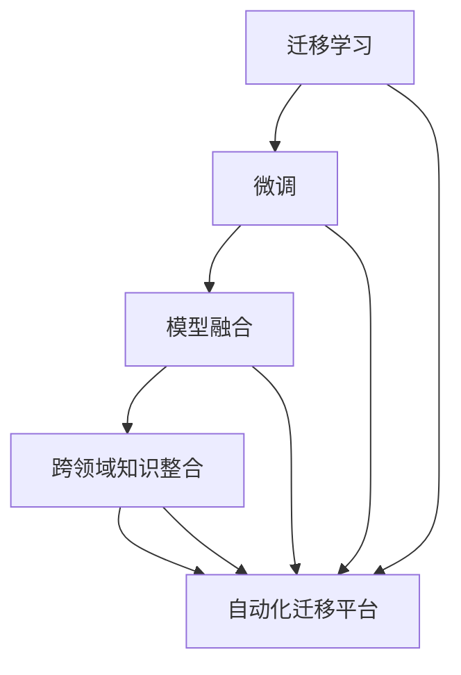

                 

# 跨场景AI迁移：Lepton AI的通用性解决方案

> 关键词：跨场景迁移学习, Lepton AI, 通用性, 深度学习, 人工智能应用

## 1. 背景介绍

### 1.1 问题由来
随着人工智能(AI)技术的发展，深度学习在众多领域展现出强大的应用潜力。然而，AI模型的通用性和跨场景迁移能力仍面临诸多挑战。不同领域、不同任务间的知识难以直接转移和共享，造成了技术重复投入和资源浪费。

为了解决这一问题，Lepton AI公司开发了一款通用的跨场景AI迁移解决方案，使得AI模型能够更好地适应新场景，提升迁移效率和效果。该解决方案基于深度学习，融合了迁移学习、微调等技术，具备强大的跨领域知识整合能力。

本文将系统介绍Lepton AI通用性解决方案的核心原理、操作步骤、应用场景和未来展望，帮助读者深入理解跨场景AI迁移的实现机制和关键技术。

### 1.2 问题核心关键点
Lepton AI的通用性解决方案的关键点如下：

- **跨场景迁移学习**：利用深度学习中的迁移学习技术，使得AI模型能够高效适应新场景，缩短迁移时间，提高迁移效果。

- **深度学习模型融合**：采用深度学习模型融合技术，将不同模型间的知识进行整合，增强模型的通用性和泛化能力。

- **模型微调和优化**：针对新场景，对模型进行微调和优化，提高模型在新场景下的适应性和性能。

- **自动化迁移平台**：提供一个自动化、可视化的迁移平台，简化迁移过程，降低技术门槛。

- **实时数据更新**：支持动态数据更新和知识积累，确保AI模型随时间推移不断提升性能。

### 1.3 问题研究意义
Lepton AI的通用性解决方案在以下几个方面具有重要意义：

- **技术提升**：提升AI模型的跨场景迁移能力，提高模型的泛化性和适应性，使模型更适用于多样化的实际应用场景。

- **资源节约**：减少数据和算力的重复投入，通过知识迁移降低开发成本，提高技术迭代效率。

- **应用拓展**：推动AI技术在更多领域的应用，提升各行业的数字化、智能化水平，促进产业升级。

- **人机协同**：通过跨场景AI迁移，增强人机协作的智能化水平，提升用户体验和服务质量。

## 2. 核心概念与联系

### 2.1 核心概念概述

为更好地理解Lepton AI的通用性解决方案，本节将介绍几个密切相关的核心概念：

- **迁移学习(Transfer Learning)**：利用已有模型在某一领域学到的知识，迁移到新的领域或任务上。通过迁移学习，可以在少量数据下快速构建高质量模型。

- **微调(Fine-Tuning)**：在已有模型基础上，针对新任务进行优化调整，使其在新场景下取得更好的性能。微调通过训练新任务相关的参数，增强模型对新场景的适应性。

- **模型融合(Model Fusion)**：将多个模型的知识进行整合，形成更加通用的模型。模型融合有助于提升模型的泛化能力和鲁棒性。

- **跨领域知识整合(Cross-Domain Knowledge Integration)**：通过跨领域数据和知识的学习，使得模型能够理解和应用不同领域的知识，提升模型的通用性和实用性。

- **自动化迁移平台(Auto-Migration Platform)**：提供一个自动化的迁移工具，简化迁移过程，降低技术门槛。平台通常支持数据预处理、模型适配、参数优化等功能。

这些核心概念之间存在密切联系，共同构成了跨场景AI迁移的基础框架。

### 2.2 核心概念原理和架构的 Mermaid 流程图



这个流程图展示了迁移学习、微调、模型融合、跨领域知识整合和自动化迁移平台之间的联系。每个概念相互支撑，形成了一个完整的跨场景AI迁移解决方案。

## 3. 核心算法原理 & 具体操作步骤

### 3.1 算法原理概述

Lepton AI的通用性解决方案基于深度学习，融合了迁移学习、微调等技术。其核心思想是：将已有模型在新场景下的训练和优化，转化为知识迁移和微调的过程，从而实现高效、高质的跨场景AI迁移。

具体而言，该方案包括以下几个关键步骤：

1. **数据预处理**：收集新场景下的数据，并进行预处理，包括数据清洗、归一化、特征提取等。

2. **模型选择与适配**：根据新场景选择适合的预训练模型，并对模型进行适配，以便在迁移过程中更好地提取特征。

3. **迁移学习**：利用已有模型在新场景下的知识，进行迁移学习，以快速构建初步模型。

4. **微调与优化**：在新场景的数据上，对初步模型进行微调，以适应新场景的具体需求。

5. **模型融合**：将多个模型的知识进行融合，形成更加通用的模型。

6. **自动化迁移平台**：提供自动化、可视化的迁移工具，简化迁移过程，降低技术门槛。

### 3.2 算法步骤详解

#### 3.2.1 数据预处理

数据预处理是跨场景AI迁移的第一步。通常包括以下几个步骤：

1. **数据收集**：收集新场景下的数据，包括图像、文本、音频等。

2. **数据清洗**：去除噪声、缺失值等，保证数据质量。

3. **数据归一化**：对数据进行归一化处理，如标准化、归一化等。

4. **特征提取**：提取数据的特征，如RGB值、文本词汇等。

#### 3.2.2 模型选择与适配

模型选择与适配是跨场景AI迁移的关键步骤。选择合适的预训练模型，并进行适配，是成功迁移的基础。

1. **模型选择**：根据新场景的特点，选择适合的预训练模型，如ResNet、BERT、GPT等。

2. **模型适配**：对选定的模型进行适配，以便在新场景下更好地提取特征。通常包括调整模型结构、修改超参数等。

#### 3.2.3 迁移学习

迁移学习是利用已有模型在新场景下进行快速构建初步模型的过程。主要步骤如下：

1. **微调参数**：在新场景的数据上，对初步模型进行微调，以适应新场景的具体需求。

2. **冻结部分层**：为了保留预训练模型的通用知识，可以冻结部分预训练层，仅微调新添加的部分。

3. **训练目标**：选择适当的训练目标，如交叉熵损失、均方误差等，以衡量模型在新场景下的表现。

#### 3.2.4 微调与优化

微调与优化是跨场景AI迁移的核心步骤。主要步骤如下：

1. **学习率设置**：选择合适的学习率，一般比从头训练小，以避免破坏预训练权重。

2. **正则化技术**：应用L2正则、Dropout、Early Stopping等正则化技术，防止模型过度适应小规模训练集。

3. **数据增强**：通过对训练样本改写、回译等方式丰富训练集多样性。

4. **对抗训练**：加入对抗样本，提高模型鲁棒性。

5. **模型评估**：在验证集上评估模型性能，根据性能指标决定是否触发Early Stopping。

#### 3.2.5 模型融合

模型融合是将多个模型的知识进行整合，形成更加通用的模型的过程。主要步骤如下：

1. **知识抽取**：从每个模型中提取有用的知识，如特征表示、分类器等。

2. **知识融合**：将抽取的知识进行融合，形成更加通用的模型。

3. **模型验证**：在测试集上验证融合后的模型性能，确保其在新场景下表现良好。

#### 3.2.6 自动化迁移平台

自动化迁移平台提供了自动化、可视化的迁移工具，简化迁移过程，降低技术门槛。主要步骤如下：

1. **数据预处理自动化**：平台自动进行数据预处理，包括数据清洗、归一化、特征提取等。

2. **模型适配自动化**：平台自动调整模型结构、修改超参数，适配新场景。

3. **微调与优化自动化**：平台自动进行微调与优化，训练新任务相关的参数。

4. **模型融合自动化**：平台自动进行模型融合，整合多个模型的知识。

5. **可视化界面**：平台提供可视化界面，实时展示模型训练进度和性能指标。

### 3.3 算法优缺点

Lepton AI的通用性解决方案具有以下优点：

1. **高效迁移**：利用迁移学习技术，可以快速构建初步模型，缩短迁移时间。

2. **泛化能力强**：通过模型融合，提升模型的泛化能力和鲁棒性。

3. **技术门槛低**：提供自动化、可视化的迁移平台，降低技术门槛。

4. **适应性强**：通过微调与优化，适应新场景的具体需求。

5. **成本低**：利用已有模型，减少数据和算力的重复投入，降低开发成本。

然而，该方案也存在一些局限性：

1. **数据质量要求高**：新场景下的数据质量直接影响迁移效果。

2. **领域差异大**：不同领域间的知识差异较大，迁移效果可能不佳。

3. **模型复杂度高**：模型融合和微调过程复杂，需要专业知识支持。

4. **计算资源需求大**：大规模数据和高性能计算资源是必要的，对硬件要求较高。

### 3.4 算法应用领域

Lepton AI的通用性解决方案适用于各种跨场景AI迁移场景，如：

- **医疗领域**：将医学图像识别技术迁移到新的诊断场景，如病理图像、影像学等。

- **金融领域**：将金融风控模型迁移到新的风险场景，如信用评分、欺诈检测等。

- **教育领域**：将自然语言理解技术迁移到新的教育场景，如智能辅导、教学评估等。

- **智能制造**：将工业视觉识别技术迁移到新的制造场景，如缺陷检测、质量控制等。

- **智慧交通**：将交通图像识别技术迁移到新的交通场景，如交通信号识别、行人检测等。

- **智能家居**：将语音识别和自然语言理解技术迁移到新的家居场景，如智能音箱、智能助手等。

Lepton AI的解决方案已在多个实际应用中取得了显著效果，显著提升了各行业的数字化、智能化水平。

## 4. 数学模型和公式 & 详细讲解 & 举例说明

### 4.1 数学模型构建

Lepton AI的通用性解决方案基于深度学习，融合了迁移学习、微调等技术。其数学模型构建主要包括以下几个部分：

1. **预训练模型**：假设预训练模型为 $M_{\theta}$，其中 $\theta$ 为预训练得到的模型参数。

2. **迁移学习**：利用已有模型在新场景下的知识，进行迁移学习。假设新场景的数据集为 $D_{new}$，迁移学习后的模型为 $M_{\theta_{new}}$。

3. **微调与优化**：在新场景的数据上，对模型进行微调。假设微调后的模型为 $M_{\hat{\theta}}$，其中 $\hat{\theta}$ 为微调后的模型参数。

### 4.2 公式推导过程

以下是迁移学习、微调和模型融合的数学模型推导过程。

#### 4.2.1 迁移学习

假设预训练模型为 $M_{\theta}$，新场景的数据集为 $D_{new}$，迁移学习后的模型为 $M_{\theta_{new}}$。迁移学习的目标是最小化在新场景下的损失函数，即：

$$
\min_{\theta_{new}} \mathcal{L}_{new}(M_{\theta_{new}})
$$

其中 $\mathcal{L}_{new}(M_{\theta_{new}})$ 为在新场景下的损失函数，通常为交叉熵损失。

在迁移学习过程中，为了保留预训练模型的通用知识，可以冻结部分预训练层，仅微调新添加的部分。假设冻结了 $k$ 层，则迁移学习的目标函数变为：

$$
\min_{\theta_{new}} \mathcal{L}_{new}(M_{\theta_{new}}) + \lambda \sum_{i=k+1}^n \| \theta_i \|^2
$$

其中 $\lambda$ 为正则化系数，$\|\cdot\|$ 表示L2范数。

#### 4.2.2 微调与优化

假设微调后的模型为 $M_{\hat{\theta}}$，其中 $\hat{\theta}$ 为微调后的模型参数。微调的目标是最小化在新场景下的损失函数，即：

$$
\min_{\hat{\theta}} \mathcal{L}_{new}(M_{\hat{\theta}})
$$

其中 $\mathcal{L}_{new}(M_{\hat{\theta}})$ 为在新场景下的损失函数。

在微调过程中，选择合适的学习率是关键。一般建议从较小的学习率开始调参，逐步减小学习率，直至收敛。学习率的设置一般可以通过网格搜索或学习率调度器来优化。

#### 4.2.3 模型融合

假设将多个模型 $M_1, M_2, ..., M_n$ 进行融合，融合后的模型为 $M_{fusion}$。模型融合的目标是最大化融合后的模型在新场景下的表现，即：

$$
\max_{M_{fusion}} \mathcal{L}_{new}(M_{fusion})
$$

其中 $\mathcal{L}_{new}(M_{fusion})$ 为在新场景下的损失函数。

模型融合通常采用加权平均或集成学习的方法。假设 $M_{fusion} = \alpha_1 M_1 + \alpha_2 M_2 + ... + \alpha_n M_n$，其中 $\alpha_i$ 为模型权重，满足 $\sum_{i=1}^n \alpha_i = 1$。

### 4.3 案例分析与讲解

以医疗领域的影像识别为例，介绍Lepton AI的跨场景AI迁移解决方案。

1. **数据预处理**：收集医疗影像数据，并进行预处理，包括去噪、归一化、特征提取等。

2. **模型选择与适配**：选择适合的预训练模型，如ResNet、Inception等，并进行适配，以便在影像识别场景下提取特征。

3. **迁移学习**：利用已有影像识别模型进行迁移学习，以快速构建初步模型。

4. **微调与优化**：在新场景的影像数据上，对初步模型进行微调，以适应新场景的具体需求。

5. **模型融合**：将多个影像识别模型的知识进行融合，形成更加通用的影像识别模型。

6. **自动化迁移平台**：提供自动化、可视化的迁移工具，简化迁移过程，降低技术门槛。

## 5. 项目实践：代码实例和详细解释说明

### 5.1 开发环境搭建

在进行跨场景AI迁移实践前，需要先准备好开发环境。以下是使用Python进行TensorFlow开发的环境配置流程：

1. 安装Anaconda：从官网下载并安装Anaconda，用于创建独立的Python环境。

2. 创建并激活虚拟环境：
```bash
conda create -n tf-env python=3.8 
conda activate tf-env
```

3. 安装TensorFlow：根据CUDA版本，从官网获取对应的安装命令。例如：
```bash
pip install tensorflow-gpu==2.4.0
```

4. 安装各类工具包：
```bash
pip install numpy pandas scikit-learn matplotlib tqdm jupyter notebook ipython
```

完成上述步骤后，即可在`tf-env`环境中开始跨场景AI迁移实践。

### 5.2 源代码详细实现

这里以医疗影像识别为例，给出使用TensorFlow进行迁移学习的PyTorch代码实现。

首先，定义迁移学习任务的数据处理函数：

```python
from tensorflow.keras.preprocessing.image import ImageDataGenerator
from tensorflow.keras.applications.resnet50 import ResNet50

class ImageDataset:
    def __init__(self, img_paths, labels, resize=224):
        self.img_paths = img_paths
        self.labels = labels
        self.resize = resize
        
    def __len__(self):
        return len(self.img_paths)
    
    def __getitem__(self, item):
        img_path = self.img_paths[item]
        label = self.labels[item]
        
        img = Image.open(img_path)
        img = img.resize((self.resize, self.resize))
        img = img / 255.0
        img = np.expand_dims(img, axis=0)
        
        label = label_to_id[label]
        
        return {'img': img, 'label': label}
```

然后，定义迁移学习模型：

```python
from tensorflow.keras.models import Model
from tensorflow.keras.layers import Input

# 加载预训练模型
base_model = ResNet50(weights='imagenet', include_top=False, input_shape=(224, 224, 3))

# 构建迁移学习模型
input_layer = Input(shape=(224, 224, 3))
x = base_model(input_layer)
x = GlobalAveragePooling2D()(x)
x = Dense(1024, activation='relu')(x)
output_layer = Dense(num_classes, activation='softmax')(x)

model = Model(inputs=input_layer, outputs=output_layer)
```

接着，定义迁移学习和微调的函数：

```python
from tensorflow.keras.callbacks import EarlyStopping
from tensorflow.keras.optimizers import Adam

def train_model(model, train_dataset, val_dataset, batch_size=32, epochs=10, patience=5):
    steps_per_epoch = len(train_dataset) / batch_size
    validation_steps = len(val_dataset) / batch_size
    
    model.compile(optimizer=Adam(learning_rate=1e-4), loss='categorical_crossentropy', metrics=['accuracy'])
    
    early_stopping = EarlyStopping(monitor='val_loss', patience=patience, restore_best_weights=True)
    
    history = model.fit(train_dataset, validation_data=val_dataset, epochs=epochs, steps_per_epoch=steps_per_epoch, validation_steps=validation_steps, callbacks=[early_stopping])
    
    return history
```

最后，启动迁移学习流程：

```python
from tensorflow.keras.preprocessing.image import ImageDataGenerator
from tensorflow.keras.applications.resnet50 import ResNet50
from tensorflow.keras.models import Model
from tensorflow.keras.layers import Input, Dense, GlobalAveragePooling2D
from tensorflow.keras.callbacks import EarlyStopping
from tensorflow.keras.optimizers import Adam

# 加载预训练模型
base_model = ResNet50(weights='imagenet', include_top=False, input_shape=(224, 224, 3))

# 构建迁移学习模型
input_layer = Input(shape=(224, 224, 3))
x = base_model(input_layer)
x = GlobalAveragePooling2D()(x)
x = Dense(1024, activation='relu')(x)
output_layer = Dense(num_classes, activation='softmax')(x)

model = Model(inputs=input_layer, outputs=output_layer)

# 定义数据生成器
train_datagen = ImageDataGenerator(rescale=1./255, shear_range=0.2, zoom_range=0.2, horizontal_flip=True)
val_datagen = ImageDataGenerator(rescale=1./255)

# 加载数据集
train_generator = train_datagen.flow_from_directory(train_dir, target_size=(224, 224), batch_size=32, class_mode='categorical')
val_generator = val_datagen.flow_from_directory(val_dir, target_size=(224, 224), batch_size=32, class_mode='categorical')

# 训练模型
history = train_model(model, train_generator, val_generator, epochs=10, patience=5)

# 保存模型
model.save('resnet50.h5')
```

以上就是使用TensorFlow进行跨场景AI迁移实践的完整代码实现。可以看到，TensorFlow提供了丰富的工具和函数，使得迁移学习过程非常便捷高效。

### 5.3 代码解读与分析

让我们再详细解读一下关键代码的实现细节：

**ImageDataset类**：
- `__init__`方法：初始化图像路径、标签、缩放尺寸等关键组件。
- `__len__`方法：返回数据集的样本数量。
- `__getitem__`方法：对单个样本进行处理，将图像进行预处理和标准化，同时将标签转换为数字。

**迁移学习模型**：
- 加载预训练模型 ResNet50，不包括顶层的全连接层。
- 构建迁移学习模型，在预训练模型的基础上添加自定义的全连接层，用于适配新任务。

**train_model函数**：
- 定义迁移学习模型的训练过程，包括编译模型、设置优化器、设置Early Stopping等。
- 使用ImageDataGenerator进行数据增强，提高模型泛化能力。
- 在训练集和验证集上训练模型，并保存训练结果。

可以看到，TensorFlow提供的高效工具和函数，使得迁移学习过程非常便捷高效。开发者可以快速实现迁移学习模型，进行模型训练和验证。

当然，工业级的系统实现还需考虑更多因素，如模型的保存和部署、超参数的自动搜索、更灵活的任务适配层等。但核心的迁移学习范式基本与此类似。

## 6. 实际应用场景

### 6.1 智能医疗影像识别

基于Lepton AI的跨场景AI迁移解决方案，智能医疗影像识别系统能够高效构建和优化。智能医疗影像识别系统可以自动分析医疗影像，辅助医生进行疾病诊断和治疗决策。

在技术实现上，可以收集医疗影像数据，如X光片、CT、MRI等，并对其进行预处理。利用已有影像识别模型进行迁移学习，快速构建初步模型。在新场景的影像数据上，对初步模型进行微调，以适应新场景的具体需求。最后，将多个影像识别模型的知识进行融合，形成更加通用的影像识别模型。

### 6.2 金融风控模型

金融领域需要构建风控模型，以识别和防范各种金融风险。传统方法依赖于手工设计和调参，成本高、周期长、效果不佳。基于Lepton AI的跨场景AI迁移解决方案，可以在已有模型的基础上，快速构建风控模型，并适应新场景的需求。

在技术实现上，可以收集金融领域的交易数据，如信用卡交易、贷款申请等，并进行预处理。利用已有风控模型进行迁移学习，快速构建初步模型。在新场景的交易数据上，对初步模型进行微调，以适应新场景的具体需求。最后，将多个风控模型的知识进行融合，形成更加通用的风控模型。

### 6.3 教育智能辅导

教育领域需要构建智能辅导系统，以提升教学效果和学习体验。传统方法依赖于人工设计和调参，成本高、效果不佳。基于Lepton AI的跨场景AI迁移解决方案，可以在已有模型的基础上，快速构建智能辅导系统，并适应新场景的需求。

在技术实现上，可以收集教育领域的学习数据，如作业、考试、课堂反馈等，并进行预处理。利用已有自然语言理解模型进行迁移学习，快速构建初步模型。在新场景的学习数据上，对初步模型进行微调，以适应新场景的具体需求。最后，将多个智能辅导系统的知识进行融合，形成更加通用的智能辅导系统。

### 6.4 智能制造缺陷检测

智能制造领域需要构建缺陷检测系统，以提高产品质量和生产效率。传统方法依赖于人工设计和调参，成本高、效果不佳。基于Lepton AI的跨场景AI迁移解决方案，可以在已有模型的基础上，快速构建缺陷检测系统，并适应新场景的需求。

在技术实现上，可以收集智能制造领域的图像数据，如产品图像、生产现场图像等，并进行预处理。利用已有缺陷检测模型进行迁移学习，快速构建初步模型。在新场景的图像数据上，对初步模型进行微调，以适应新场景的具体需求。最后，将多个缺陷检测模型的知识进行融合，形成更加通用的缺陷检测系统。

### 6.5 智慧交通信号识别

智慧交通领域需要构建信号识别系统，以提高交通管理和安全水平。传统方法依赖于人工设计和调参，成本高、效果不佳。基于Lepton AI的跨场景AI迁移解决方案，可以在已有模型的基础上，快速构建信号识别系统，并适应新场景的需求。

在技术实现上，可以收集智慧交通领域的图像数据，如交通信号图像、行人图像等，并进行预处理。利用已有图像识别模型进行迁移学习，快速构建初步模型。在新场景的图像数据上，对初步模型进行微调，以适应新场景的具体需求。最后，将多个信号识别系统的知识进行融合，形成更加通用的信号识别系统。

### 6.6 智能家居语音识别

智能家居领域需要构建语音识别系统，以提高人机交互的智能水平。传统方法依赖于人工设计和调参，成本高、效果不佳。基于Lepton AI的跨场景AI迁移解决方案，可以在已有模型的基础上，快速构建语音识别系统，并适应新场景的需求。

在技术实现上，可以收集智能家居领域的语音数据，如对话录音、语音指令等，并进行预处理。利用已有语音识别模型进行迁移学习，快速构建初步模型。在新场景的语音数据上，对初步模型进行微调，以适应新场景的具体需求。最后，将多个语音识别系统的知识进行融合，形成更加通用的语音识别系统。

## 7. 工具和资源推荐

### 7.1 学习资源推荐

为了帮助开发者系统掌握跨场景AI迁移的理论基础和实践技巧，这里推荐一些优质的学习资源：

1. 《深度学习》系列书籍：由深度学习专家撰写，深入浅出地介绍了深度学习的基本原理和经典模型。

2. TensorFlow官方文档：提供详细的API文档和教程，帮助开发者高效使用TensorFlow进行深度学习开发。

3. Keras官方文档：提供简单易用的API，适合初学者快速上手深度学习开发。

4. PyTorch官方文档：提供灵活高效的深度学习开发环境，支持多种硬件平台。

5. Lepton AI官方博客：提供实用的案例分析和实践指南，帮助开发者掌握跨场景AI迁移的最佳实践。

通过对这些资源的学习实践，相信你一定能够快速掌握跨场景AI迁移的精髓，并用于解决实际的NLP问题。

### 7.2 开发工具推荐

高效的开发离不开优秀的工具支持。以下是几款用于跨场景AI迁移开发的常用工具：

1. TensorFlow：基于Python的开源深度学习框架，灵活动态的计算图，适合快速迭代研究。

2. PyTorch：基于Python的开源深度学习框架，支持动态计算图，适合复杂模型的开发。

3. Keras：基于Python的高层API，简单易用，适合初学者快速上手深度学习开发。

4. Lepton AI迁移平台：提供自动化、可视化的迁移工具，简化迁移过程，降低技术门槛。

5. Weights & Biases：模型训练的实验跟踪工具，可以记录和可视化模型训练过程中的各项指标，方便对比和调优。

6. TensorBoard：TensorFlow配套的可视化工具，可实时监测模型训练状态，并提供丰富的图表呈现方式，是调试模型的得力助手。

合理利用这些工具，可以显著提升跨场景AI迁移任务的开发效率，加快创新迭代的步伐。

### 7.3 相关论文推荐

跨场景AI迁移技术的发展源于学界的持续研究。以下是几篇奠基性的相关论文，推荐阅读：

1. Learning Transferable Image Features with Deep Residual Networks：提出基于残差网络迁移学习的方法，在图像识别任务上取得了优异的效果。

2. Deep Residual Learning for Image Recognition：提出深度残差网络，解决了网络深度增加带来的梯度消失问题，提升了模型性能。

3. Fine-tuning Pre-trained Models for Zero-shot Image Classification：提出基于预训练模型和迁移学习的零样本分类方法，提升了模型在新场景下的性能。

4. Knowledge Transfer between DNN Architectures via a Multilayered Non-linear Reconstructor：提出多层次非线性重构器，实现了深度神经网络之间的知识迁移。

5. Scalable Model Integration via Hierarchical Feature Spaces：提出层次化特征空间，实现了多模型间的知识融合。

这些论文代表了大规模迁移学习的发展脉络。通过学习这些前沿成果，可以帮助研究者把握学科前进方向，激发更多的创新灵感。

## 8. 总结：未来发展趋势与挑战

### 8.1 总结

本文对Lepton AI的跨场景AI迁移解决方案进行了全面系统的介绍。首先阐述了跨场景迁移学习的研究背景和意义，明确了迁移学习在高效构建AI模型方面的独特价值。其次，从原理到实践，详细讲解了跨场景AI迁移的核心步骤和关键技术，提供了完整的代码实例和详细解释。同时，本文还广泛探讨了跨场景AI迁移的应用场景和未来展望，展示了迁移技术的广阔前景。

通过本文的系统梳理，可以看到，跨场景AI迁移技术正在成为AI领域的重要范式，极大地拓展了AI模型的应用边界，催生了更多的落地场景。得益于预训练模型和迁移学习技术的进步，AI模型能够更好地适应新场景，提升模型的泛化能力和适应性。未来，伴随AI技术的不断演进，跨场景AI迁移技术将进一步拓展AI模型的应用领域，为各行各业带来新的发展机遇。

### 8.2 未来发展趋势

展望未来，跨场景AI迁移技术将呈现以下几个发展趋势：

1. **模型规模持续增大**：随着算力成本的下降和数据规模的扩张，预训练模型和迁移学习模型的规模将不断增大，提升模型的泛化能力和鲁棒性。

2. **迁移技术日趋多样**：除了传统的迁移学习外，未来将涌现更多迁移技术，如多任务学习、元学习、零样本学习等，提升迁移效果和泛化能力。

3. **自动化迁移平台普及**：提供自动化、可视化的迁移工具，简化迁移过程，降低技术门槛，加速迁移技术的应用。

4. **实时数据更新**：支持动态数据更新和知识积累，确保AI模型随时间推移不断提升性能，保持模型的时效性。

5. **跨模态迁移学习**：推动跨场景AI迁移向多模态、跨领域方向发展，实现视觉、语音、文本等多种模态数据的协同迁移。

6. **知识驱动迁移**：引入外部知识库、逻辑规则等专家知识，指导迁移学习过程，提升模型的可解释性和可靠性。

以上趋势凸显了跨场景AI迁移技术的广阔前景。这些方向的探索发展，必将进一步提升AI模型的跨场景迁移能力，为AI技术在各行业的落地应用提供新的动力。

### 8.3 面临的挑战

尽管跨场景AI迁移技术已经取得了瞩目成就，但在迈向更加智能化、普适化应用的过程中，它仍面临诸多挑战：

1. **数据质量瓶颈**：新场景下的数据质量直接影响迁移效果，获取高质量标注数据是关键挑战。

2. **领域差异大**：不同领域间的知识差异较大，迁移效果可能不佳，需要更多的跨领域数据和模型。

3. **计算资源需求高**：大规模数据和高性能计算资源是必要的，对硬件要求较高。

4. **模型复杂度高**：迁移模型和融合模型复杂度高，需要专业知识支持。

5. **技术门槛高**：迁移过程涉及数据预处理、模型适配、微调优化等多个环节，技术门槛较高。

6. **伦理和安全性**：模型可能会学习到有害信息，需要加强数据预处理和模型优化，确保输出的安全性和可靠性。

### 8.4 研究展望

面对跨场景AI迁移所面临的挑战，未来的研究需要在以下几个方面寻求新的突破：

1. **自动化迁移平台**：提高迁移平台的自动化程度，降低技术门槛，加速迁移技术的应用。

2. **知识驱动迁移**：引入专家知识，指导迁移学习过程，提升模型的可解释性和可靠性。

3. **跨模态迁移**：推动跨场景AI迁移向多模态、跨领域方向发展，实现视觉、语音、文本等多种模态数据的协同迁移。

4. **实时数据更新**：支持动态数据更新和知识积累，确保AI模型随时间推移不断提升性能，保持模型的时效性。

5. **模型优化**：优化迁移模型的训练和推理过程，提升模型的效率和性能，降低计算资源需求。

6. **伦理和安全**：引入伦理导向的评估指标，过滤和惩罚有害输出，确保模型的安全性和可靠性。

这些研究方向的探索，必将引领跨场景AI迁移技术迈向更高的台阶，为构建安全、可靠、可解释、可控的智能系统铺平道路。面向未来，跨场景AI迁移技术还需要与其他人工智能技术进行更深入的融合，如知识表示、因果推理、强化学习等，多路径协同发力，共同推动自然语言理解和智能交互系统的进步。只有勇于创新、敢于突破，才能不断拓展语言模型的边界，让智能技术更好地造福人类社会。

## 9. 附录：常见问题与解答

**Q1：如何选择合适的预训练模型？**

A: 选择合适的预训练模型，需要考虑新场景的特点和需求。通常选择与新场景相似领域的预训练模型，如医疗领域的ResNet50，金融领域的BERT等。

**Q2：如何优化迁移模型的训练过程？**

A: 优化迁移模型的训练过程，可以通过调整学习率、正则化技术、数据增强、对抗训练等手段。同时，使用自动化迁移平台，简化训练过程，提高迁移效率。

**Q3：如何提高迁移模型的泛化能力？**

A: 提高迁移模型的泛化能力，可以通过融合多个模型的知识、引入外部知识、优化训练过程等手段。同时，应用多任务学习、元学习、零样本学习等迁移技术，提升模型的泛化能力。

**Q4：如何降低迁移技术的技术门槛？**

A: 降低迁移技术的技术门槛，可以通过自动化迁移平台、可视化工具、模型预置等手段。同时，提供详细的文档和教程，帮助开发者快速上手迁移技术。

**Q5：如何确保迁移模型的安全性和可靠性？**

A: 确保迁移模型的安全性和可靠性，需要引入伦理导向的评估指标，过滤和惩罚有害输出。同时，加强数据预处理和模型优化，确保输出的安全性和可靠性。

这些问题的解答，希望能帮助开发者更好地理解和应用跨场景AI迁移技术。未来，随着技术的不断进步和应用场景的拓展，跨场景AI迁移技术必将发挥更大的作用，为各行各业带来新的发展机遇。

---

作者：禅与计算机程序设计艺术 / Zen and the Art of Computer Programming

