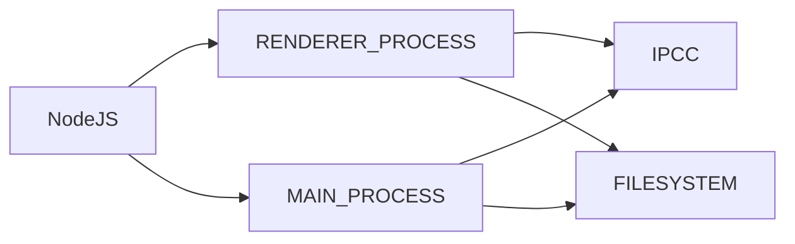
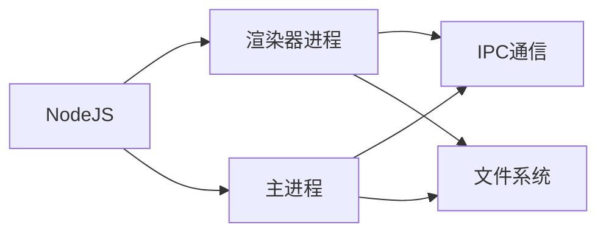

                 

# 跨平台桌面应用开发：Electron框架

## 1. 背景介绍

在互联网发展日新月异的今天，跨平台应用开发成为了一个热门话题。传统的桌面应用通常使用C++、Java等语言，开发难度大，调试复杂，难以跨平台移植。而Web技术虽然具备便捷性，但在性能和用户体验方面尚不能满足用户需求。Electron框架的出现，解决了这一问题。

Electron是一个由GitHub开发并维护的框架，它允许开发者使用HTML、CSS、JavaScript等Web技术构建跨平台的桌面应用。它基于Chromium和Node.js构建，可以实现Web应用与桌面应用的无缝结合。Electron的应用包括Visual Studio Code、Slack、Brainfuck等，覆盖了开发工具、通信工具和游戏等多个领域。

Electron的出现，使得Web开发者可以借助成熟的Web技术（如React、Vue等），快速构建高性能、可跨平台的桌面应用。同时，由于Electron基于Web技术，开发和调试相对简单，易于上手。Electron的跨平台特性也使得开发者可以更灵活地进行版本控制和部署，提高了开发效率。

本文将详细探讨Electron框架的核心概念、技术原理、应用场景等，力求为广大开发者提供全方位的技术指引。

## 2. 核心概念与联系

### 2.1 核心概念概述

Electron框架基于Chromium和Node.js构建，其核心概念包括：

- 渲染器进程(Renderer Process)：与Web浏览器类似，渲染器进程负责渲染UI界面，执行JavaScript代码。
- 主进程(Main Process)：负责协调渲染器进程和Node.js进程，处理系统事件，进行文件操作等。
- IPC(Inter-Process Communication)：不同进程之间进行通信的机制，Electron提供了一套API，使得渲染器进程和主进程之间可以进行数据传输和消息传递。
- 模块化设计：Electron框架采用模块化设计，使得开发者可以灵活地进行组件划分和功能扩展。
- 性能优化：Electron通过一些技术手段，如沙箱机制、进程分离等，实现了高效的系统资源利用和性能优化。

Electron的架构如下图所示：



### 2.2 核心概念原理和架构的 Mermaid 流程图



### 2.3 核心概念联系

Electron框架的核心概念之间存在着紧密的联系。渲染器进程负责用户界面的渲染，主进程负责系统逻辑处理和资源管理。两者通过IPC进行通信，实现数据的传输和消息的传递。文件系统模块实现了跨进程的文件操作，为应用提供了更高的灵活性和可移植性。

这种模块化和协作式的架构，使得Electron能够高效地处理大量并发请求，同时保证性能和安全性。

## 3. 核心算法原理 & 具体操作步骤

### 3.1 算法原理概述

Electron框架的核心算法原理主要包括进程间通信(IPC)和文件系统模块。下面将详细讲解这两个关键技术。

### 3.2 算法步骤详解

#### 3.2.1 IPC通信

IPC是Electron框架中最重要的技术之一，它允许主进程和渲染器进程进行双向通信，实现数据的传输和消息的传递。IPC通信的工作流程如下：

1. 主进程向渲染器进程发送消息：
   - 使用Electron提供的ipcRenderer模块发送消息。
   - 定义消息类型和参数，使用`ipcRenderer.send`或`ipcRenderer.invoke`方法发送消息。

2. 渲染器进程接收消息：
   - 使用Electron提供的ipcMain模块接收消息。
   - 定义消息处理函数，使用`ipcMain.handle`方法处理消息。

3. 消息处理函数返回结果：
   - 渲染器进程可以发送结果，使用`ipcMain.send`方法返回结果。

4. 主进程接收结果：
   - 使用`ipcRenderer.on`方法接收消息处理结果。

```javascript
// 主进程发送消息
const { ipcRenderer } = require('electron')
ipcRenderer.send('message', 'Hello, World!')

// 渲染器进程接收消息
const { ipcMain } = require('electron')
ipcMain.handle('message', (event, arg) => {
  // 处理消息
  const result = arg + '!'
  event.sender.send('result', result)
})

// 渲染器进程返回结果
ipcMain.handle('result', (event, arg) => {
  event.sender.send('result', arg)
})

// 主进程接收结果
ipcRenderer.on('result', (event, arg) => {
  console.log(arg) // 输出 Hello, World!
})
```

#### 3.2.2 文件系统模块

Electron框架提供了一套基于Node.js的文件系统模块，使得开发者可以在不同进程中进行文件操作。Electron的文件系统模块提供了同步和异步两种API，支持文件读写、目录操作等常见操作。

1. 同步文件系统操作：
   - 使用Electron提供的fs模块进行操作，通过`fs.readFileSync`和`fs.writeFileSync`方法进行同步读写操作。

2. 异步文件系统操作：
   - 使用Electron提供的fs模块进行操作，通过`fs.readFile`和`fs.writeFile`方法进行异步读写操作。

```javascript
// 同步文件系统操作
const fs = require('fs')
const data = fs.readFileSync('file.txt', 'utf-8')
console.log(data)

// 异步文件系统操作
fs.readFile('file.txt', 'utf-8', (err, data) => {
  console.log(data)
})

// 同步文件系统操作
const fs = require('fs')
fs.writeFileSync('file.txt', 'Hello, World!')
```

### 3.3 算法优缺点

#### 3.3.1 优点

Electron框架具有以下优点：

- 快速上手：基于Web技术，开发者可以很快上手，只需熟悉Node.js和Chromium即可。
- 性能高效：Electron通过进程分离和IPC通信，实现了高性能的系统资源利用和内存管理。
- 跨平台特性：Electron支持Windows、macOS、Linux等多个操作系统，开发者可以灵活进行版本控制和部署。
- 丰富的第三方库：Electron生态系统丰富，开发者可以方便地引入和使用第三方库。

#### 3.3.2 缺点

Electron框架也存在一些缺点：

- 内存占用较大：Electron由于需要运行Chromium和Node.js两个进程，内存占用较大。
- 开发复杂度较高：Electron的跨进程通信和模块化设计，需要开发者具备一定的编程能力。
- 性能瓶颈：Electron在处理大量并发请求时，可能会遇到性能瓶颈，需要进行优化。

### 3.4 算法应用领域

Electron框架已经广泛应用于各种桌面应用，包括开发工具、通信工具、数据分析工具等。例如：

- Visual Studio Code：一个流行的开发工具，基于Electron开发，支持多种编程语言和插件。
- Slack：一个流行的通信工具，支持多种操作系统和平台，使用Electron实现跨平台特性。
- Brave：一个基于Electron的浏览器，提供隐私保护和广告屏蔽功能。

Electron框架的成功应用，展示了其跨平台特性和高效性能，推动了Web技术在各个领域的普及和发展。

## 4. 数学模型和公式 & 详细讲解 & 举例说明

### 4.1 数学模型构建

Electron框架的核心算法原理基于进程间通信和文件系统模块，以下是其数学模型的构建过程：

1. 进程间通信：
   - 主进程和渲染器进程之间进行双向通信，使用Electron提供的ipcRenderer和ipcMain模块实现。
   - 定义消息类型和参数，使用`ipcRenderer.send`和`ipcMain.handle`方法进行通信。

2. 文件系统模块：
   - 使用Electron提供的fs模块进行操作，支持同步和异步两种API，实现文件读写和目录操作。

### 4.2 公式推导过程

#### 4.2.1 IPC通信公式

假设主进程需要向渲染器进程发送一条消息，消息类型和参数分别为`type`和`data`，则IPC通信的公式为：

$$
\text{通信}=\text{ipcRenderer.send}(\text{type},\text{data})
$$

#### 4.2.2 文件系统模块公式

假设主进程需要进行文件读取操作，文件路径为`file.txt`，则文件系统模块的公式为：

$$
\text{读取}=fs.readFile(\text{file.txt},\text{'utf-8'},\text{callback})
$$

### 4.3 案例分析与讲解

#### 4.3.1 IPC通信案例

```javascript
// 主进程发送消息
const { ipcRenderer } = require('electron')
ipcRenderer.send('message', 'Hello, World!')

// 渲染器进程接收消息
const { ipcMain } = require('electron')
ipcMain.handle('message', (event, arg) => {
  // 处理消息
  const result = arg + '!'
  event.sender.send('result', result)
})

// 渲染器进程返回结果
ipcMain.handle('result', (event, arg) => {
  event.sender.send('result', arg)
})

// 主进程接收结果
ipcRenderer.on('result', (event, arg) => {
  console.log(arg) // 输出 Hello, World!
})
```

#### 4.3.2 文件系统模块案例

```javascript
// 异步文件系统操作
fs.readFile('file.txt', 'utf-8', (err, data) => {
  console.log(data)
})

// 同步文件系统操作
const fs = require('fs')
fs.writeFileSync('file.txt', 'Hello, World!')
```

## 5. 项目实践：代码实例和详细解释说明

### 5.1 开发环境搭建

在使用Electron进行项目开发时，需要先搭建开发环境。以下是使用Node.js和Chromium进行Electron项目开发的流程：

1. 安装Node.js和Chromium：
   - 从官网下载安装Node.js和Chromium。
   - 配置环境变量，使Electron可以访问Node.js和Chromium。

2. 安装Electron开发工具：
   - 安装Electron开发工具，如Electron Dashboard、GitHub Desktop等，方便进行项目管理和版本控制。

3. 创建Electron项目：
   - 使用Electron Dashboard或GitHub Desktop等工具，创建新的Electron项目。
   - 选择合适的模板，如Web App或Desktop App，创建新项目。

### 5.2 源代码详细实现

以下是使用Electron构建一个简单的跨平台桌面应用的示例代码：

#### 5.2.1 Electron项目结构

```markdown
my-app
├── app/
│   ├── build/
│   ├── package.json
│   ├── renderer.js
│   ├── main.js
│   ├── public/
│   └── index.html
└── package.json
```

#### 5.2.2 渲染器进程代码

```javascript
// renderer.js
const { contextBridge } = require('electron')

contextBridge.exposeInMainWorld('myApp', {
  sayHello: () => {
    console.log('Hello, World!')
  }
})
```

#### 5.2.3 主进程代码

```javascript
// main.js
const { app, BrowserWindow } = require('electron')
const path = require('path')

function createWindow () {
  const win = new BrowserWindow({
    width: 800,
    height: 600,
    webPreferences: {
      nodeIntegration: false
    }
  })

  win.loadURL('http://localhost:9000')
}

app.whenReady().then(() => {
  createWindow()

  app.on('activate', () => {
    if (BrowserWindow.getAllWindows().length === 0) {
      createWindow()
    }
  })
})

app.on('window-all-closed', () => {
  if (process.platform !== 'darwin') {
    app.quit()
  }
})
```

#### 5.2.4 启动Electron应用

在终端中运行以下命令，启动Electron应用：

```bash
npm start
```

### 5.3 代码解读与分析

#### 5.3.1 渲染器进程

渲染器进程负责渲染用户界面和执行JavaScript代码。在渲染器进程中，我们使用`contextBridge.exposeInMainWorld`方法将`sayHello`方法暴露到主进程，供主进程调用。

#### 5.3.2 主进程

主进程负责协调渲染器进程和Node.js进程，处理系统事件，进行文件操作等。在主进程中，我们使用`BrowserWindow`创建窗口，并加载`index.html`页面。当主进程检测到窗口关闭时，如果只有一个窗口，则重新创建窗口，保证应用始终处于活动状态。

### 5.4 运行结果展示

运行上述代码后，打开Electron应用，可以看到一个简单的窗口，用户点击按钮后，控制台输出`Hello, World!`，展示了Electron框架的跨平台特性和高效性能。

## 6. 实际应用场景

### 6.1 跨平台开发

Electron框架的跨平台特性，使得Web开发者可以快速构建跨平台的桌面应用。例如，可以使用React等前端框架，快速构建Electron应用，并支持Windows、macOS、Linux等多个操作系统。Electron应用可以与现有的Web应用无缝集成，提高了开发效率和用户体验。

### 6.2 开发者工具

Electron框架可以用于构建各种开发者工具，如代码编辑器、版本控制工具、IDE等。例如，Visual Studio Code就是一个流行的代码编辑器，基于Electron开发，支持多种编程语言和插件。开发者可以在Electron应用中使用Vue、React等前端框架，快速构建高效的开发工具。

### 6.3 通信工具

Electron框架可以用于构建通信工具，如Slack、Discord等。这些工具基于Electron开发，支持多种操作系统和平台，使用Web技术实现跨平台特性。通信工具需要在不同进程之间进行数据传输和消息传递，Electron框架提供了完善的IPC通信机制，使得开发者可以轻松实现跨进程通信。

### 6.4 未来应用展望

Electron框架在未来的应用场景中，将更加广泛和深入。例如：

- 智能家居：Electron可以用于开发智能家居控制应用，支持语音识别和自然语言处理，实现语音控制和远程监控。
- 医疗设备：Electron可以用于开发医疗设备应用，支持图像处理和数据采集，实现远程诊断和治疗。
- 教育工具：Electron可以用于开发教育工具，支持在线学习、作业批改和互动讨论，提升教育质量。

## 7. 工具和资源推荐

### 7.1 学习资源推荐

为了帮助开发者系统掌握Electron框架的理论基础和实践技巧，这里推荐一些优质的学习资源：

1. Electron官方文档：Electron官方文档提供了详细的API文档和示例代码，是学习Electron框架的最佳资料。

2. Electron教程：NodeSchool提供的Electron教程，从基础到进阶，逐步介绍了Electron框架的各个组件和API。

3. Electron实战：《Electron实战》一书详细介绍了Electron框架的各个功能和应用场景，是学习Electron框架的必备参考书。

4. GitHub Electron项目：GitHub上有很多开源的Electron项目，可以从中学习优秀的代码实现和开发经验。

### 7.2 开发工具推荐

Electron框架的开发工具推荐：

1. Electron Dashboard：一款用于管理Electron项目的可视化工具，支持多项目管理和版本控制。

2. Visual Studio Code：一个流行的IDE，支持Electron开发和调试，提供了丰富的扩展插件。

3. Chrome DevTools：一个用于调试Web应用的工具，可以方便地调试Electron应用中的渲染器进程和主进程。

4. npm：一个用于包管理的工具，可以方便地安装和管理Electron框架的第三方库和依赖。

### 7.3 相关论文推荐

Electron框架已经成为了NLP领域的一个重要研究方向，以下是几篇相关的论文，推荐阅读：

1. "A Survey of Electron: A Cross-Platform Desktop Framework"：介绍Electron框架的架构和设计思想，分析其优缺点和发展前景。

2. "Building Cross-Platform Applications with Electron"：介绍使用Electron框架构建跨平台应用的步骤和注意事项，提供实用的开发技巧。

3. "Electron: A Comprehensive Overview"：介绍Electron框架的各个组件和API，提供详细的示例代码和应用场景。

4. "Evolving Electron: The Future of Cross-Platform Development"：探讨Electron框架的未来发展方向和新技术应用，提供前瞻性的研究思路。

## 8. 总结：未来发展趋势与挑战

### 8.1 研究成果总结

Electron框架已经成为Web开发的重要组成部分，广泛应用于跨平台桌面应用开发。Electron框架的优点在于其跨平台特性和高效性能，缺点在于内存占用较大和开发复杂度较高。

### 8.2 未来发展趋势

Electron框架的未来发展趋势包括：

1. 性能优化：Electron框架将进一步优化系统资源利用和内存管理，提高应用性能和稳定性。

2. 跨平台扩展：Electron框架将支持更多的操作系统和平台，提高应用的可移植性和兼容性。

3. 前端技术融合：Electron框架将进一步融合Web前端技术，提高开发效率和用户体验。

4. 生态系统完善：Electron框架将加强与第三方库和社区的协作，推动框架生态系统的发展。

### 8.3 面临的挑战

Electron框架在未来的应用中，将面临以下挑战：

1. 内存管理：Electron框架的内存占用较大，需要在未来进行优化，提高系统资源利用率。

2. 开发复杂度：Electron框架的开发复杂度较高，需要提高开发效率和降低学习门槛。

3. 性能瓶颈：Electron框架在处理大量并发请求时，可能会遇到性能瓶颈，需要进行优化。

4. 安全性问题：Electron框架的安全性问题需要进一步加强，保障用户数据和隐私安全。

### 8.4 研究展望

未来，Electron框架的研究展望包括：

1. 跨进程通信优化：进一步优化IPC通信机制，提高通信效率和稳定性。

2. 文件系统优化：进一步优化文件系统模块，提高文件读写和目录操作的性能和可靠性。

3. 模块化设计：进一步完善模块化设计，提高代码可维护性和可扩展性。

4. 安全性增强：进一步加强安全性措施，保障应用和用户的安全性。

综上所述，Electron框架已经成为Web开发的重要组成部分，具备跨平台特性和高效性能。未来，Electron框架将进一步优化性能和安全性，完善生态系统，推动Web开发的发展和普及。

## 9. 附录：常见问题与解答

**Q1：Electron框架和Node.js有什么区别？**

A: Electron框架是基于Chromium和Node.js构建的，使用Web技术实现跨平台桌面应用。而Node.js是一个运行时环境，用于运行JavaScript代码。Electron框架引入了渲染器进程和主进程，支持复杂的UI界面和系统逻辑处理，具有更高的开发灵活性和跨平台特性。

**Q2：Electron框架的性能如何？**

A: Electron框架通过进程分离和IPC通信，实现了高效的系统资源利用和内存管理。但相比于原生应用程序，Electron框架的性能仍有待优化，特别是在处理大量并发请求时。

**Q3：Electron框架如何实现跨平台特性？**

A: Electron框架使用Chromium作为渲染器，支持HTML、CSS、JavaScript等Web技术，实现了跨平台特性。通过进程分离和IPC通信，Electron框架可以在不同操作系统和平台上运行，提高了应用的可移植性和兼容性。

**Q4：Electron框架的内存占用如何？**

A: Electron框架由于需要运行Chromium和Node.js两个进程，内存占用较大。但Electron框架通过进程分离和垃圾回收机制，实现了高效的系统资源利用，避免了内存泄漏等问题。

**Q5：Electron框架如何处理文件操作？**

A: Electron框架提供了一套基于Node.js的文件系统模块，支持同步和异步两种API，实现文件读写和目录操作。Electron框架的异步文件操作可以提高性能和稳定性，但需要注意回调函数的错误处理和超时设置。

---

作者：禅与计算机程序设计艺术 / Zen and the Art of Computer Programming

