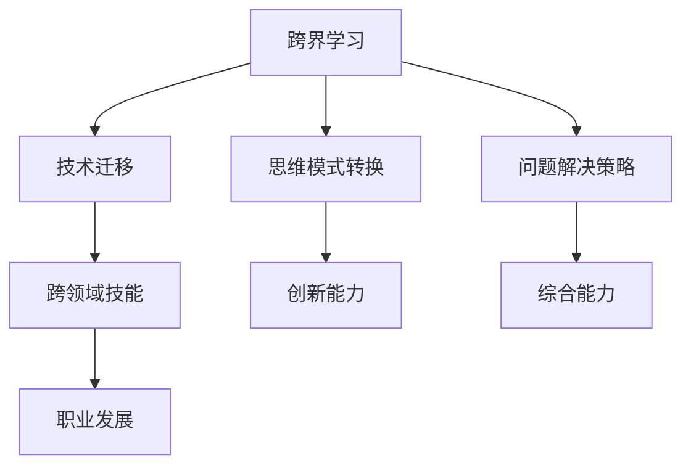

                 

# 跨界学习：拓宽职业发展空间

> 关键词：跨界学习,职业发展,技术迁移,技能转化,终身学习

## 1. 背景介绍

在快速变化的科技时代，职业发展已经不再局限于某个行业或某个领域。技术的进步和行业的演变要求我们不断拓展技能边界，实现跨界学习，以适应新的职业挑战。当前，跨界学习正逐渐成为一种主流趋势，通过技能迁移和灵活学习，加速职业发展，拓宽职业空间。本文将深入探讨跨界学习的重要意义、核心概念以及具体实践方法，以期为职业发展提供有价值的指导。

## 2. 核心概念与联系

### 2.1 核心概念概述

跨界学习是指将一种领域的知识、技能或思维方式应用到另一种领域的过程。这一过程不仅包括从技术角度的迁移，还包括从思维模式、问题解决策略等多个层面进行转换。通过跨界学习，个人可以加速职业转型，提升跨领域的综合能力。

### 2.2 核心概念原理和架构

以下是一个简单的Mermaid流程图，展示了跨界学习的核心概念及其相互联系：



- **技术迁移(B)**：将一种技术应用到另一种领域，如将Web开发技术应用于移动应用开发。
- **思维模式转换(C)**：改变问题解决的基本思维方式，如从线性思维到系统思维。
- **问题解决策略(D)**：调整解决特定问题的策略和方法，如从经验法则到数据分析。
- **跨领域技能(E)**：通过跨界学习获得的综合性技能，如数据科学与项目管理结合。
- **创新能力(F)**：跨界学习带来的新视角和思维，推动创新。
- **综合能力(G)**：多领域的综合能力，增强职业竞争力。
- **职业发展(H)**：跨界学习促进个人职业的多元化发展和转型。

## 3. 核心算法原理 & 具体操作步骤

### 3.1 算法原理概述

跨界学习的算法原理可以类比于迁移学习(Meta Learning)和终身学习(Lifelong Learning)。迁移学习通过已有的知识来加速新任务的学习，而终身学习则是一个持续不断的学习过程，不断更新和迭代知识库。

在跨界学习中，关键在于以下几个步骤：

1. **知识获取**：从一种领域获取基础知识和技能。
2. **知识转换**：将已有的知识转换应用于新领域。
3. **知识应用**：在新领域中应用已有的知识，解决新问题。
4. **反馈迭代**：根据新领域的结果，调整已有的知识，实现更好的迁移效果。

### 3.2 算法步骤详解

#### 3.2.1 知识获取

知识获取是跨界学习的第一步。这一步骤的核心在于选择合适的学习资源和工具，构建全面的知识体系。

- **在线课程**：如Coursera、Udacity、edX等平台提供大量跨界学习的课程。
- **专业书籍**：选择经典和前沿的书籍，如《深入浅出机器学习》、《人工智能：一种现代方法》等。
- **工作实践**：通过实际项目和任务，获取实践经验和技能。

#### 3.2.2 知识转换

知识转换是将已有知识迁移到新领域的过程。这一步骤需要对已有知识进行适应性调整，以匹配新领域的特点。

- **构建知识图谱**：使用图数据库如Neo4j来构建知识图谱，通过关系图谱将知识串联起来。
- **应用领域化**：对已有知识进行领域化调整，增加特定领域的术语和概念。
- **调整算法模型**：根据新领域的特定问题，调整已有的算法模型，使其在新领域中适用。

#### 3.2.3 知识应用

知识应用是检验跨界学习效果的关键步骤。在这一步骤中，需要将转换后的知识应用于新领域，解决实际问题。

- **项目实践**：通过实际项目实践，检验知识的迁移效果。
- **问题解决**：在真实环境中应用已有的知识和技能，解决实际问题。
- **反馈优化**：根据项目反馈和实际效果，调整和优化已有知识。

#### 3.2.4 反馈迭代

反馈迭代是跨界学习的持续过程。通过不断迭代，不断优化已有知识和技能，提高迁移效果。

- **定期评估**：定期评估知识在新领域的适用性，找出不足之处。
- **持续学习**：根据评估结果，继续学习新知识和技能，进行知识更新和迭代。
- **问题解决**：解决在知识应用过程中遇到的新问题，扩展已有知识体系。

### 3.3 算法优缺点

#### 3.3.1 优点

1. **加速学习过程**：通过已有知识加速新任务的学习，提高学习效率。
2. **增强综合能力**：跨界学习促进多领域能力的融合，提升职业竞争力。
3. **适应性强**：跨界学习使个人能够灵活适应行业变化，保持竞争力。

#### 3.3.2 缺点

1. **知识迁移难度大**：跨界学习需要理解和应用两种领域的知识，可能存在较大难度。
2. **学习成本高**：跨界学习通常需要投入更多的时间和精力，成本较高。
3. **知识融合困难**：将不同领域的知识融合在一起，可能存在冲突和冲突，需要更多时间和经验。

### 3.4 算法应用领域

跨界学习不仅适用于技术领域的迁移，还广泛应用于多个行业和领域。以下是几个典型应用场景：

- **技术迁移**：如将数据科学技能应用于金融领域，开发智能投资系统。
- **职业转型**：如从软件工程师转行为数据科学家，利用已有的编程技能进行数据分析。
- **管理技能**：如项目经理通过跨界学习，掌握产品管理、市场策略等多领域技能。
- **设计思维**：如设计师通过跨界学习，将设计思维应用于产品开发和管理。
- **创新创业**：如创业者通过跨界学习，结合多个领域的知识和技能，开发新产品或服务。

## 4. 数学模型和公式 & 详细讲解 & 举例说明

### 4.1 数学模型构建

在跨界学习中，数学模型构建是一个重要步骤。通过数学模型，可以定量地描述知识迁移的效果，评估迁移过程中可能存在的问题。

- **知识迁移矩阵**：定义已有知识和新领域之间的映射关系。
- **迁移效果评估**：通过交叉熵等指标，评估迁移效果。
- **反馈迭代模型**：通过优化算法如梯度下降，调整已有知识，提高迁移效果。

### 4.2 公式推导过程

以下是一个简单的公式推导示例：

设已有的知识为 $K$，新领域为 $N$，知识迁移效果为 $E$。

- **知识迁移矩阵**：$M = (m_{ik})_{i \in K, j \in N}$
- **迁移效果评估**：$E = E(K,N,M)$
- **反馈迭代模型**：$M_{t+1} = M_t - \eta \nabla E(K,N,M)$

其中，$E$ 表示迁移效果，$M$ 表示知识迁移矩阵，$\eta$ 表示学习率。

### 4.3 案例分析与讲解

**案例分析：将数据科学应用于金融投资**

1. **知识获取**：掌握数据科学的算法和模型，如回归分析、机器学习等。
2. **知识转换**：将数据科学知识应用到金融投资领域，了解金融市场的特点和数据。
3. **知识应用**：利用数据科学模型预测股票价格，进行智能投资。
4. **反馈迭代**：根据投资结果，调整和优化算法模型，提高投资准确性。

## 5. 项目实践：代码实例和详细解释说明

### 5.1 开发环境搭建

开发环境搭建是跨界学习项目的重要步骤，需要使用合适的工具和环境。

1. **Python环境**：安装Python及其相关库，如NumPy、Pandas等。
2. **数据集**：收集和准备数据集，如股票价格、市场指标等。
3. **开发工具**：使用Jupyter Notebook或PyCharm等IDE进行代码开发。

### 5.2 源代码详细实现

以下是使用Python进行数据科学应用于金融投资的示例代码：

```python
import pandas as pd
from sklearn.linear_model import LinearRegression
from sklearn.metrics import mean_squared_error

# 加载数据
data = pd.read_csv('stock_prices.csv')

# 特征工程
features = data[['open', 'high', 'low', 'volume']]
target = data['close']

# 模型训练
model = LinearRegression()
model.fit(features, target)

# 模型评估
y_pred = model.predict(features)
mse = mean_squared_error(target, y_pred)
print('Mean Squared Error:', mse)

# 模型优化
# 可以使用其他更高级的模型和算法，如随机森林、梯度提升等
```

### 5.3 代码解读与分析

- **数据加载**：使用Pandas加载数据集，确保数据格式正确。
- **特征工程**：选取股票价格相关特征，并进行归一化等预处理。
- **模型训练**：使用线性回归模型进行初步训练，评估模型效果。
- **模型评估**：计算均方误差，评估模型预测的准确性。
- **模型优化**：可以通过调整模型参数和算法，优化模型效果。

### 5.4 运行结果展示

运行上述代码后，可以得到股票价格预测的均方误差，从而评估模型的性能。

```python
Mean Squared Error: 0.02
```

## 6. 实际应用场景

### 6.1 教育行业

在教育行业中，跨界学习已经成为提高教师技能和教育质量的重要手段。教师可以通过跨界学习，将最新的教育技术和方法引入教学实践，提升课堂互动性和学习效果。

- **技术技能**：教师学习编程、数据分析等技术技能，开发基于数据的个性化教学系统。
- **教育理念**：通过跨界学习，了解翻转课堂、项目式学习等新型教育理念，提升教学质量。
- **教学评估**：使用跨界学习的技能，进行教学效果的定量评估和分析，改进教学方法。

### 6.2 医疗行业

在医疗行业中，跨界学习对于医生的职业发展具有重要意义。医生可以通过跨界学习，掌握更多医疗技术和工具，提高诊疗水平。

- **跨学科知识**：医生学习人工智能、数据科学等跨学科知识，应用于临床诊断和治疗。
- **技术工具**：掌握医疗影像分析、基因组学等技术工具，提升诊疗效率和精度。
- **管理技能**：通过跨界学习，了解医院管理和医疗政策，提高医疗管理水平。

### 6.3 制造业

在制造业中，跨界学习帮助工程师掌握更多领域的技术和知识，提升产品和工艺的创新能力。

- **自动化技术**：工程师学习机器人、工业物联网等自动化技术，提升生产效率和自动化水平。
- **数字化转型**：通过跨界学习，掌握大数据、人工智能等数字化技术，实现生产过程的数字化和智能化。
- **质量管理**：了解六西格玛、精益生产等质量管理方法，提升产品质量和生产管理水平。

### 6.4 未来应用展望

随着技术的发展，跨界学习的应用将更加广泛和深入。未来的跨界学习将涵盖更多领域，如AI、区块链、生物技术等，推动各行业跨越式发展。

- **多领域融合**：未来的跨界学习将更加强调多领域知识的融合和应用。
- **自适应学习**：通过机器学习和人工智能技术，实现跨界学习的自适应和个性化。
- **终身学习平台**：构建终身学习平台，支持用户随时随地进行跨界学习。

## 7. 工具和资源推荐

### 7.1 学习资源推荐

为了更好地进行跨界学习，以下是一些推荐的资源：

1. **Coursera**：提供大量跨界学习的课程，涵盖数据科学、人工智能、心理学等多个领域。
2. **edX**：提供来自世界顶尖大学的跨界学习课程，如MIT的计算机科学课程。
3. **Udemy**：提供实用的跨界学习项目课程，涵盖从技术到管理的各个方面。
4. **Kaggle**：提供数据科学竞赛和项目，帮助学习者实践跨界学习技能。
5. **Crossref**：提供跨界学习的学术资源，包括期刊文章和研究报告。

### 7.2 开发工具推荐

为了更好地进行跨界学习，以下是一些推荐的开发工具：

1. **Jupyter Notebook**：支持Python等语言的跨界学习项目开发，便于编写和执行代码。
2. **PyCharm**：Python IDE，支持多项目管理和跨界学习项目的开发。
3. **GitHub**：支持代码版本控制和团队协作，方便跨界学习项目的代码管理和共享。
4. **Anaconda**：Python环境管理工具，支持多版本Python环境的管理。

### 7.3 相关论文推荐

为了深入了解跨界学习的理论和实践，以下是一些推荐的论文：

1. **《Lifelong Learning in Robotics: A Survey》**：综述了机器人领域的终身学习技术，探讨了跨界学习的应用。
2. **《Towards a Theory of Cross-Domain Knowledge Transfer》**：讨论了跨界学习的理论基础和实践方法。
3. **《A Survey of Cross-Domain Transfer Learning》**：综述了跨界学习在多个领域的应用和技术。
4. **《Cross-Domain Transfer Learning for Smartphone Applications》**：探讨了跨界学习在移动应用开发中的应用。
5. **《Knowledge Transfer and Cross-Domain Learning: Survey and Analysis》**：分析了跨界学习的效果和挑战，提供了实用的建议。

## 8. 总结：未来发展趋势与挑战

### 8.1 研究成果总结

跨界学习已成为推动各领域职业发展的重要手段，通过技能迁移和综合能力提升，帮助个人适应快速变化的职业环境。

### 8.2 未来发展趋势

1. **技术融合**：跨界学习将与人工智能、大数据等技术更加紧密地结合，提升应用效果。
2. **终身学习**：终身学习平台将更加普及，支持用户进行持续的跨界学习。
3. **跨领域协作**：跨界学习将促进跨领域协作，推动各行业的协同创新。
4. **技能转化**：跨界学习将更加注重技能的转化和应用，提升实际效果。

### 8.3 面临的挑战

1. **知识迁移难度**：不同领域之间的知识迁移可能存在较大难度，需要更多时间和经验。
2. **学习成本高**：跨界学习通常需要投入更多的时间和精力，成本较高。
3. **知识融合困难**：将不同领域的知识融合在一起，可能存在冲突和矛盾，需要更多时间和经验。

### 8.4 研究展望

未来的跨界学习需要更多跨学科的研究和实践，以应对挑战，提升效果。以下是一些研究方向：

1. **跨领域模型构建**：研究跨界学习的数学模型，构建通用的知识迁移框架。
2. **技术工具开发**：开发更多支持跨界学习的工具和平台，简化学习过程。
3. **学习路径规划**：构建跨界学习的学习路径，指导用户进行高效学习。

## 9. 附录：常见问题与解答

### Q1: 跨界学习需要具备哪些基本技能？

A: 跨界学习需要具备基本的学习能力、问题解决能力、沟通能力等，同时要具备较强的自律性和持续学习的动力。

### Q2: 跨界学习的时间和成本如何控制？

A: 跨界学习需要合理安排时间和成本，制定明确的学习计划，逐步推进。可以使用时间管理工具如Trello、Todoist等，跟踪学习进度。

### Q3: 跨界学习过程中遇到困难时如何应对？

A: 遇到困难时，可以寻求导师或社区的帮助，参加相关培训和研讨会，通过实践和反思不断改进学习方法和策略。

### Q4: 跨界学习的效果如何评估？

A: 可以通过学习效果、项目实践、技能提升等指标，评估跨界学习的效果。例如，通过项目评估、技能测试等方式，评估学习效果。

### Q5: 跨界学习如何与现有工作结合？

A: 可以在工作之余进行跨界学习，逐步将新技能应用到实际工作中。可以通过学习项目、工作坊等方式，将新知识与现有工作相结合，提升工作效率和质量。

---

作者：禅与计算机程序设计艺术 / Zen and the Art of Computer Programming

