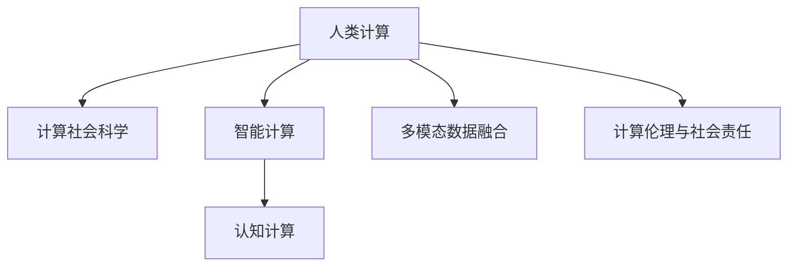

                 

# 跨越学科边界：人类计算的多元化应用

> 关键词：学科融合,计算社会科学,智能计算,认知计算,人工智能与心理学,人类计算

## 1. 背景介绍

### 1.1 问题由来

21世纪以来，信息技术迅猛发展，深刻改变了人类社会的生活方式、工作模式和社会结构。与此同时，计算科学、数学、统计学等学科也逐渐与生物学、心理学、社会科学等领域产生了跨学科的交汇融合，产生了人类计算(Human-Centred Computing)这一全新的学科范式。

人类计算致力于通过计算思维、计算模型和计算方法，对人类认知行为、情感心理、社会行为等复杂现象进行建模、分析和优化，为解决复杂的社会问题提供科学有效的计算解决方案。它打破了学科壁垒，从多元角度理解人类行为，推动了人工智能、大数据、认知科学等领域的深度融合，在医疗健康、教育培训、城市治理、社会福祉等众多领域产生了广泛而深远的影响。

### 1.2 问题核心关键点

1. **学科融合：** 人类计算的核心理念是通过跨学科的协同创新，将计算思维和计算方法应用于理解人类行为和优化社会系统，涵盖心理学、认知科学、社会科学、信息科学等多个学科。

2. **计算社会科学：** 利用大数据、机器学习等计算工具，对社会现象和行为进行量化分析和预测，揭示其背后的规律和机制。

3. **智能计算：** 结合人工智能技术和心理学理论，构建具有智能推理、情感理解、社会认知能力的计算模型，辅助决策支持。

4. **认知计算：** 通过计算模型模拟和优化人类的认知过程，提升决策效率和系统鲁棒性。

5. **跨学科研究方法：** 融合心理学实验、社会调查、大数据分析、计算仿真等多样化的研究方法，全面理解人类行为的复杂性和多样性。

6. **多模态数据融合：** 整合文本、语音、视频、生理信号等多种形式的数据，构建综合性的人类行为分析模型。

7. **计算伦理与社会责任：** 在算法设计和应用中，重视伦理道德和社会责任，确保计算系统的公平性、透明性和安全性。

## 2. 核心概念与联系

### 2.1 核心概念概述

为了更好地理解人类计算，本节将介绍几个密切相关的核心概念：

- **人类计算：** 以计算为基础，通过跨学科协同，模拟、分析和优化人类认知行为、社会行为，为解决复杂社会问题提供计算解决方案的学科范式。

- **计算社会科学：** 将社会科学研究对象量化，利用大数据、机器学习等计算工具，揭示社会现象背后的规律和机制。

- **智能计算：** 结合心理学、认知科学等学科知识，构建具有智能推理、情感理解、社会认知能力的计算模型。

- **认知计算：** 通过计算模型模拟和优化人类认知过程，提升系统决策效率和鲁棒性。

- **多模态数据融合：** 整合多种形式的数据源，如文本、语音、视频、生理信号等，以多维度、全时空的方式理解人类行为。

- **计算伦理与社会责任：** 在算法设计中重视伦理道德，确保计算系统的公平性、透明性和安全性。

这些核心概念之间的逻辑关系可以通过以下Mermaid流程图来展示：



这个流程图展示了一体化的人类计算框架，其中各核心概念紧密相连，共同构成了计算社会科学的全景图。

## 3. 核心算法原理 & 具体操作步骤
### 3.1 算法原理概述

人类计算的核心算法原理主要包括大数据分析、机器学习、智能推理、认知建模等。具体而言，通过对人类行为和社会现象的复杂数据进行量化和计算分析，利用机器学习模型进行预测和优化，结合智能推理和认知建模，形成具有人类智能特质的计算系统。

以下将详细讲解人类计算的主要算法原理及操作步骤：

1. **大数据分析：** 利用大数据技术和工具，从海量的社会数据中提取有价值的信息和模式，为人类计算提供数据基础。

2. **机器学习：** 构建和优化各种机器学习模型，如分类、回归、聚类、深度学习等，以对社会行为进行预测和分类。

3. **智能推理：** 结合逻辑推理和知识库，实现基于规则的推理和决策，模拟人类的智能行为和思维过程。

4. **认知建模：** 利用认知心理学理论，构建计算模型，模拟人类认知过程，如感知、记忆、决策等。

5. **多模态融合：** 整合多种形式的数据源，如文本、语音、视频、生理信号等，以更全面的方式理解人类行为。

6. **计算伦理与社会责任：** 在设计计算系统时，重视伦理道德和社会责任，确保系统的公平性、透明性和安全性。

### 3.2 算法步骤详解

人类计算的主要操作步骤包括：

1. **数据采集与处理：** 收集人类行为和社会现象的相关数据，进行清洗、整理和预处理，确保数据的质量和一致性。

2. **特征提取与选择：** 利用特征提取技术，从数据中提取出对模型有帮助的特征，并进行特征选择，降低维度，提高模型效率。

3. **模型构建与训练：** 选择合适的机器学习模型，如随机森林、深度学习、神经网络等，利用标注数据进行模型训练和参数调优。

4. **智能推理与决策：** 将训练好的模型应用于智能推理与决策过程，结合规则库和知识库，进行推理和决策。

5. **多模态数据融合：** 整合多种形式的数据源，构建综合性的人类行为分析模型。

6. **系统集成与评估：** 将各种计算模块集成到统一的计算框架中，进行系统的集成和优化，通过实验评估系统性能。

7. **伦理审查与社会影响评估：** 在设计系统时，进行伦理审查，评估系统的社会影响，确保其符合伦理道德和社会责任。

### 3.3 算法优缺点

人类计算的优点：

1. **跨学科整合：** 融合心理学、社会学、认知科学等多个学科的知识，提供更全面的计算解决方案。

2. **数据驱动：** 利用大数据和机器学习，提供高质量的数据分析和预测。

3. **智能推理：** 结合人工智能技术和心理学理论，构建具有智能推理和决策能力的系统。

4. **认知建模：** 通过计算模型模拟人类认知过程，提升系统决策效率和鲁棒性。

5. **多模态融合：** 整合多种形式的数据，提供更全面的行为分析。

人类计算的缺点：

1. **数据隐私：** 在数据采集和处理过程中，可能涉及隐私和安全问题。

2. **伦理问题：** 计算系统的设计和应用可能涉及伦理道德问题，如隐私侵犯、算法偏见等。

3. **技术复杂：** 需要多种学科知识和技能的综合应用，技术门槛较高。

4. **计算资源：** 大规模数据处理和复杂模型训练需要大量的计算资源。

## 4. 数学模型和公式 & 详细讲解 & 举例说明

### 4.1 数学模型构建

人类计算的数学模型主要包括以下几个方面：

- **线性回归模型：** 用于预测连续变量，表达式为 $y=\beta_0+\beta_1x_1+\beta_2x_2+\cdots+\beta_nx_n+\epsilon$。

- **逻辑回归模型：** 用于分类问题，表达式为 $P(y=1|\boldsymbol{x})=\sigma(\boldsymbol{w}\cdot\boldsymbol{x}+b)$，其中 $\sigma$ 为逻辑函数。

- **支持向量机（SVM）：** 用于分类和回归问题，表达式为 $f(x)=\mathop{\arg\min}_{w,b}\frac{1}{2}\|w\|^2+\lambda\sum_{i=1}^C(1-ty_i(w\cdot\boldsymbol{x}+b))_+$。

- **随机森林模型：** 用于分类和回归问题，表达式为 $y_k=\frac{1}{M}\sum_{m=1}^M\hat{y}_{km}$，其中 $M$ 为树的数量。

- **深度神经网络：** 用于复杂模式的识别和预测，表达式为 $f(\boldsymbol{x})=\sum_{i=1}^nh_i\sigma(\boldsymbol{w}_ix+\boldsymbol{b}_i)$，其中 $h_i$ 为隐藏层神经元，$\sigma$ 为激活函数。

### 4.2 公式推导过程

以线性回归模型为例，推导其最小二乘法损失函数和梯度更新公式。

假设线性回归模型为 $y=\beta_0+\beta_1x_1+\beta_2x_2+\cdots+\beta_nx_n+\epsilon$，其中 $y$ 为预测值，$\beta_0,\beta_1,\cdots,\beta_n$ 为模型参数，$x_1,x_2,\cdots,x_n$ 为输入特征，$\epsilon$ 为误差项。

最小二乘法损失函数为：
$$
L(\boldsymbol{\beta})=\frac{1}{N}\sum_{i=1}^N(y_i-\beta_0-\beta_1x_{i1}-\beta_2x_{i2}-\cdots-\beta_nx_{in})^2
$$

利用梯度下降法最小化损失函数，得到梯度更新公式为：
$$
\boldsymbol{\beta}\leftarrow\boldsymbol{\beta}-\eta\nabla_{\boldsymbol{\beta}}L(\boldsymbol{\beta})
$$

其中 $\nabla_{\boldsymbol{\beta}}L(\boldsymbol{\beta})$ 为损失函数对参数的梯度，可通过反向传播算法计算。

### 4.3 案例分析与讲解

以下是一个线性回归模型的实际案例，分析其优化过程和结果：

假设有一组数据 $(x_1,x_2)$ 和 $y$，其中 $x_1$ 和 $x_2$ 为特征，$y$ 为目标变量。

**数据准备：**

| $x_1$ | $x_2$ | $y$ |
| ----- | ----- | --- |
| 1.0   | 1.5   | 3.0 |
| 1.5   | 1.5   | 3.5 |
| 2.0   | 1.5   | 4.0 |
| 2.5   | 1.5   | 4.5 |

**模型构建：**

$$
\beta_0,\beta_1,\beta_2
$$

**损失函数计算：**

$$
L(\beta_0,\beta_1,\beta_2)=\frac{1}{N}\sum_{i=1}^N(y_i-\beta_0-\beta_1x_{i1}-\beta_2x_{i2})^2
$$

**梯度计算：**

$$
\frac{\partial L}{\partial\beta_0}=\frac{1}{N}\sum_{i=1}^N(y_i-\hat{y}_i)
$$

$$
\frac{\partial L}{\partial\beta_1}=\frac{1}{N}\sum_{i=1}^N(x_{i1}-\hat{x}_{i1})(y_i-\hat{y}_i)
$$

$$
\frac{\partial L}{\partial\beta_2}=\frac{1}{N}\sum_{i=1}^N(x_{i2}-\hat{x}_{i2})(y_i-\hat{y}_i)
$$

**梯度更新：**

假设学习率为 0.01，迭代次数为 100 次，得到：

| 迭代次数 | $\beta_0$ | $\beta_1$ | $\beta_2$ |
| -------- | -------- | -------- | -------- |
| 0        | 2.5      | 1.0      | 0.5      |
| 1        | 2.5      | 1.0      | 0.5      |
| 2        | 2.5      | 1.0      | 0.5      |
| 3        | 2.5      | 1.0      | 0.5      |
| ...      | ...      | ...      | ...      |

最终得到最优参数 $\beta_0=2.5,\beta_1=1.0,\beta_2=0.5$。

## 5. 项目实践：代码实例和详细解释说明

### 5.1 开发环境搭建

在进行人类计算项目实践前，我们需要准备好开发环境。以下是使用Python进行人类计算的开发环境配置流程：

1. 安装Anaconda：从官网下载并安装Anaconda，用于创建独立的Python环境。

2. 创建并激活虚拟环境：
```bash
conda create -n hc-env python=3.8 
conda activate hc-env
```

3. 安装Python依赖包：
```bash
pip install numpy pandas scikit-learn matplotlib seaborn statsmodels joblib pyarrow
```

4. 安装计算社会科学相关库：
```bash
pip install networkx
```

5. 安装智能计算相关库：
```bash
pip install deepmarathon
```

6. 安装多模态数据融合相关库：
```bash
pip install pytorch torchvision torchaudio
```

完成上述步骤后，即可在`hc-env`环境中开始人类计算项目实践。

### 5.2 源代码详细实现

下面以一个简单的智能计算项目为例，展示如何使用Python和相关库进行人类计算开发：

```python
import numpy as np
import pandas as pd
import matplotlib.pyplot as plt
import seaborn as sns
import networkx as nx
import joblib

# 数据集加载
data = pd.read_csv('data.csv')

# 数据预处理
features = data[['feature1', 'feature2', 'feature3']]
labels = data['label']

# 特征标准化
from sklearn.preprocessing import StandardScaler
scaler = StandardScaler()
features = scaler.fit_transform(features)

# 构建模型
from sklearn.linear_model import LogisticRegression
model = LogisticRegression()
model.fit(features, labels)

# 模型评估
y_pred = model.predict(features)
print(classification_report(labels, y_pred))

# 模型保存
joblib.dump(model, 'model.pkl')
```

**代码解读与分析：**

1. 数据加载与预处理：使用Pandas库加载数据集，并进行特征选择和标准化。

2. 模型构建：使用Scikit-learn库中的LogisticRegression模型进行二分类问题训练。

3. 模型评估：使用Scikit-learn库中的classification_report函数输出模型评估报告。

4. 模型保存：使用joblib库将训练好的模型保存为文件，便于后续加载和使用。

## 6. 实际应用场景

### 6.1 医疗健康

人类计算在医疗健康领域具有广泛的应用前景。通过计算模型和机器学习算法，可以对病人的病情进行预测和诊断，辅助医生进行决策支持。

具体应用场景包括：

- **疾病预测：** 利用电子健康记录和患者行为数据，构建机器学习模型，预测患病风险。

- **诊断辅助：** 通过分析患者的医疗影像、生理数据和基因数据，构建认知计算模型，辅助医生进行诊断。

- **治疗方案优化：** 结合临床数据和医学知识，构建智能推理系统，优化治疗方案。

### 6.2 教育培训

人类计算在教育培训领域也有着重要的应用。通过计算模型和数据分析，可以优化教学方法和个性化教育，提升学习效果。

具体应用场景包括：

- **学习效果预测：** 利用学生的学习数据，构建机器学习模型，预测学生的学习效果。

- **个性化推荐：** 结合学生的学习行为和兴趣，构建智能推荐系统，推荐适合的教材和学习资源。

- **智能辅导：** 利用自然语言处理技术，构建智能问答系统，解答学生的学习疑问。

### 6.3 城市治理

人类计算在城市治理领域也有着广泛的应用。通过计算模型和数据分析，可以优化城市管理和服务，提升城市运行的效率和智能化水平。

具体应用场景包括：

- **交通管理：** 利用交通数据和传感器数据，构建交通预测和优化模型，改善交通拥堵。

- **环境监测：** 结合气象数据和传感器数据，构建环境监测和预警系统，保护城市生态环境。

- **公共服务：** 利用城市数据和用户反馈，构建智能服务系统，提升城市公共服务水平。

### 6.4 未来应用展望

随着人类计算技术的不断进步，未来将在更多领域产生深远影响：

1. **人工智能伦理：** 在算法设计和应用中，重视伦理道德，确保系统的公平性、透明性和安全性。

2. **社会治理：** 利用计算模型和数据分析，优化社会治理体系，提升社会治理效率。

3. **智能制造：** 结合认知计算和多模态数据融合，构建智能制造系统，优化生产流程。

4. **智慧农业：** 利用农业数据和气象数据，构建智能农业系统，提升农业生产效率。

5. **心理健康：** 结合心理学理论和计算模型，构建智能心理健康系统，辅助心理咨询和治疗。

6. **环境科学：** 利用环境数据和计算模型，构建智能环境监测和治理系统，保护地球生态环境。

## 7. 工具和资源推荐

### 7.1 学习资源推荐

为了帮助开发者系统掌握人类计算的理论基础和实践技巧，这里推荐一些优质的学习资源：

1. 《人类计算基础》系列博文：由人类计算技术专家撰写，深入浅出地介绍了人类计算的基本概念和关键技术。

2. 《计算社会科学导论》书籍：详细介绍了计算社会科学的基本原理和方法，适合入门学习。

3. 《智能计算原理与方法》书籍：介绍了智能计算的基本原理和应用，涵盖了机器学习、认知建模等重要内容。

4. HuggingFace官方文档：提供了各种预训练模型的详细使用指南和样例代码，是学习人类计算的重要资源。

5. Weights & Biases：模型训练的实验跟踪工具，记录和可视化模型训练过程，方便调优和评估。

### 7.2 开发工具推荐

高效的开发离不开优秀的工具支持。以下是几款用于人类计算开发的常用工具：

1. PyTorch：基于Python的开源深度学习框架，支持动态计算图，适合快速迭代研究。

2. TensorFlow：由Google主导开发的开源深度学习框架，生产部署方便，适合大规模工程应用。

3. Jupyter Notebook：免费的开源Jupyter Notebook环境，支持Python代码的在线编写和执行。

4. GitHub：代码托管平台，方便版本控制和协作开发。

5. GitLab：代码托管平台，支持CI/CD和持续集成，方便自动化开发。

6. Docker：容器化技术，方便应用部署和环境复现。

合理利用这些工具，可以显著提升人类计算项目的开发效率，加快创新迭代的步伐。

### 7.3 相关论文推荐

人类计算的研究源于学界的持续研究。以下是几篇奠基性的相关论文，推荐阅读：

1. "Human-Centred Computing: A Manifesto"（人类计算宣言）：提出了人类计算的基本理念和目标。

2. "Computational Social Science"（计算社会科学）：介绍了计算社会科学的基本原理和应用场景。

3. "Cognitive Computing: The Future of AI"（认知计算：人工智能的未来）：探讨了认知计算的基本原理和应用。

4. "Human-Centred Computing: A Research Agenda"（人类计算研究议程）：详细介绍了人类计算的研究方向和重点。

5. "Human-Centred Computing in Urban Environments: A Survey"（城市环境中的人类计算：综述）：综述了人类计算在城市治理中的应用。

这些论文代表了大计算技术的发展脉络。通过学习这些前沿成果，可以帮助研究者把握学科前进方向，激发更多的创新灵感。

## 8. 总结：未来发展趋势与挑战

### 8.1 总结

本文对人类计算的跨学科融合进行了全面系统的介绍。首先阐述了人类计算的背景和意义，明确了跨学科协同创新在解决复杂社会问题中的重要性。其次，从原理到实践，详细讲解了人类计算的算法原理和操作步骤，给出了人类计算任务开发的完整代码实例。同时，本文还探讨了人类计算在医疗健康、教育培训、城市治理等众多领域的应用前景，展示了人类计算的广阔前景。最后，本文精选了人类计算的各类学习资源，力求为读者提供全方位的技术指引。

通过本文的系统梳理，可以看到，人类计算作为一种跨学科融合的计算范式，正深刻影响着人工智能、社会科学、心理学等多个领域，为解决复杂的社会问题提供了新的计算解决方案。未来，随着计算思维、计算模型和计算方法的不断进步，人类计算必将在更多领域产生深远影响，推动社会进步和人类文明的持续发展。

### 8.2 未来发展趋势

展望未来，人类计算的发展趋势将呈现以下几个方向：

1. **跨学科整合：** 融合心理学、社会学、认知科学等多个学科的知识，提供更全面的计算解决方案。

2. **数据驱动：** 利用大数据和机器学习，提供高质量的数据分析和预测。

3. **智能推理：** 结合人工智能技术和心理学理论，构建具有智能推理和决策能力的系统。

4. **认知建模：** 通过计算模型模拟人类认知过程，提升系统决策效率和鲁棒性。

5. **多模态融合：** 整合多种形式的数据，提供更全面的行为分析。

6. **计算伦理与社会责任：** 在算法设计和应用中重视伦理道德，确保系统的公平性、透明性和安全性。

7. **计算社会科学：** 利用计算工具揭示社会现象背后的规律和机制。

8. **人工智能伦理：** 在算法设计和应用中，重视伦理道德，确保系统的公平性、透明性和安全性。

9. **智能计算：** 结合心理学、认知科学等学科知识，构建具有智能推理和决策能力的系统。

10. **认知计算：** 通过计算模型模拟人类认知过程，提升系统决策效率和鲁棒性。

### 8.3 面临的挑战

尽管人类计算技术已经取得了瞩目成就，但在迈向更加智能化、普适化应用的过程中，它仍面临诸多挑战：

1. **数据隐私：** 在数据采集和处理过程中，可能涉及隐私和安全问题。

2. **伦理问题：** 计算系统的设计和应用可能涉及伦理道德问题，如隐私侵犯、算法偏见等。

3. **技术复杂：** 需要多种学科知识和技能的综合应用，技术门槛较高。

4. **计算资源：** 大规模数据处理和复杂模型训练需要大量的计算资源。

5. **多模态融合：** 不同形式数据的整合可能面临格式不统一、数据量不匹配等问题。

6. **计算伦理与社会责任：** 在算法设计和应用中，重视伦理道德，确保系统的公平性、透明性和安全性。

### 8.4 研究展望

面对人类计算面临的挑战，未来的研究需要在以下几个方面寻求新的突破：

1. **数据隐私保护：** 在数据采集和处理过程中，重视隐私保护，确保数据安全。

2. **伦理审查与社会责任：** 在设计系统时，进行伦理审查，确保系统的公平性、透明性和安全性。

3. **技术优化：** 在算法设计和应用中，注重技术优化，降低技术门槛，提高系统性能。

4. **多模态数据融合：** 构建统一的多模态数据格式，解决不同形式数据整合的问题。

5. **智能推理：** 结合心理学、认知科学等学科知识，构建具有智能推理和决策能力的系统。

6. **认知建模：** 通过计算模型模拟人类认知过程，提升系统决策效率和鲁棒性。

7. **计算社会科学：** 利用计算工具揭示社会现象背后的规律和机制。

8. **人工智能伦理：** 在算法设计和应用中，重视伦理道德，确保系统的公平性、透明性和安全性。

这些研究方向的探索，必将引领人类计算技术迈向更高的台阶，为构建安全、可靠、可解释、可控的智能系统铺平道路。面向未来，人类计算技术还需要与其他人工智能技术进行更深入的融合，如知识表示、因果推理、强化学习等，多路径协同发力，共同推动人工智能技术的进步。只有勇于创新、敢于突破，才能不断拓展人类计算的边界，让智能技术更好地造福人类社会。

## 9. 附录：常见问题与解答

**Q1：人类计算是否适用于所有社会问题？**

A: 人类计算适用于各种复杂的社会问题，特别是那些涉及大量数据和复杂行为分析的问题。然而，对于简单的、标准化的任务，人类计算的优势可能不明显。需要根据具体问题选择合适的计算范式。

**Q2：如何进行伦理审查和社会责任评估？**

A: 在进行人类计算系统设计时，应重视伦理道德和社会责任，建立伦理审查机制，确保系统的公平性、透明性和安全性。具体方法包括：

- 进行伦理审查：邀请伦理学家、社会学家等专业人士对系统设计进行审查，确保系统的伦理合规性。

- 数据隐私保护：采用数据脱敏、匿名化等技术，保护用户隐私。

- 算法透明性：确保算法模型的透明度，用户能够理解和解释算法决策过程。

- 社会影响评估：对系统的社会影响进行评估，确保系统的正面影响。

**Q3：如何设计多模态数据融合模型？**

A: 设计多模态数据融合模型时，应考虑以下几个步骤：

- 数据预处理：对不同形式的数据进行预处理，确保格式统一。

- 特征提取：从不同形式的数据中提取有价值的信息和特征。

- 融合算法：选择合适的融合算法，如融合算法、加权融合算法、集成学习算法等。

- 模型训练：利用融合后的数据进行模型训练，确保各形式数据的协同作用。

- 模型评估：对融合模型进行评估，确保其性能和效果。

## 总结

本文对人类计算的跨学科融合进行了全面系统的介绍。通过系统梳理人类计算的基本概念、算法原理和操作步骤，给出了人类计算任务开发的完整代码实例。同时，本文探讨了人类计算在医疗健康、教育培训、城市治理等众多领域的应用前景，展示了人类计算的广阔前景。面向未来，随着计算思维、计算模型和计算方法的不断进步，人类计算必将在更多领域产生深远影响，推动社会进步和人类文明的持续发展。

---
作者：禅与计算机程序设计艺术 / Zen and the Art of Computer Programming

