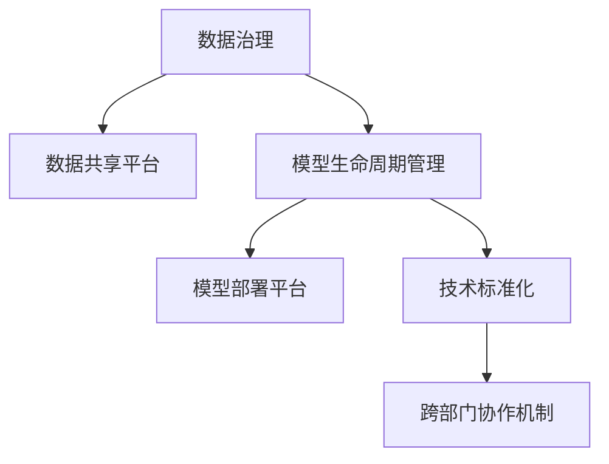

                 

# 跨部门AI协作：Lepton AI的内部生态

> 关键词：跨部门协作, AI生态系统, Lepton AI, 内部生态, 技术协同, 数据共享, 模型部署, 自动化, 标准化

## 1. 背景介绍

### 1.1 问题由来

在当今数字化时代，AI技术的快速发展和广泛应用正在重塑各行各业的面貌。然而，AI技术的成功应用往往依赖于跨部门的高效协作。Lepton AI作为一家领先的AI公司，深知这一点。他们通过构建一个高效的内部AI生态系统，确保各业务部门之间的协同合作，从而加速AI技术在公司内的落地和应用。

Lepton AI的内部生态系统通过以下核心组件实现跨部门协作：

- **数据共享平台**：提供一个集中化的数据管理和共享平台，方便各业务部门快速获取所需数据。
- **模型部署平台**：支持模型在多个业务系统中的应用，实现模型的自动化部署和监控。
- **标准化工具和流程**：制定统一的数据预处理、模型训练、评估和部署标准，确保各业务部门使用一致的工具和方法。
- **跨部门协作机制**：建立跨部门沟通和协作机制，确保AI项目顺利推进，充分利用公司内外的资源和知识。

Lepton AI的成功案例展示了如何通过构建内部AI生态系统，实现高效的跨部门协作，提升公司整体的技术实力和业务竞争力。

### 1.2 问题核心关键点

Lepton AI内部生态系统核心关键点在于其跨部门协作的机制和流程，具体包括以下几个方面：

- **数据治理**：确保数据的质量、安全性和隐私性，同时提供高效的数据共享机制。
- **模型生命周期管理**：从数据预处理到模型训练、评估和部署，提供全流程的管理和监控。
- **技术标准**：制定并推广一致的技术标准和最佳实践，提升整个生态系统的标准化水平。
- **团队协作**：建立跨部门协作机制，推动各业务部门之间的技术交流和知识共享。

通过这些关键点，Lepton AI实现了高效的技术协同和资源共享，使得AI技术在公司内部得以快速落地和应用。

## 2. 核心概念与联系

### 2.1 核心概念概述

为了更好地理解Lepton AI的内部生态系统，本节将介绍几个密切相关的核心概念：

- **AI生态系统**：一个由数据、模型、工具、人才和业务应用等组成的整体系统，旨在实现AI技术的协同创新和应用。
- **跨部门协作**：不同业务部门之间在数据、模型、技术等领域的合作与交流，以实现共同的业务目标。
- **数据治理**：通过建立数据管理标准、数据质量控制机制，确保数据的准确性、完整性和安全性。
- **模型生命周期管理**：从模型需求分析、数据预处理、模型训练、评估、部署到监控和更新的全流程管理。
- **技术标准化**：制定和推广一致的技术标准和流程，以提升整体技术水平和协作效率。

这些核心概念之间的逻辑关系可以通过以下Mermaid流程图来展示：



这个流程图展示了大模型生态系统的核心组件及其之间的关系：

1. 数据治理通过数据共享平台确保数据的准确性和可用性。
2. 模型生命周期管理从数据预处理到模型部署，实现全流程的管理和监控。
3. 技术标准化提升整个生态系统的标准化水平。
4. 跨部门协作机制推动各业务部门之间的合作与交流。

这些组件共同构成了一个高效运转的AI生态系统，支持Lepton AI内部的跨部门协作和AI技术的快速落地。

## 3. 核心算法原理 & 具体操作步骤

### 3.1 算法原理概述

Lepton AI的内部生态系统主要通过以下算法原理实现跨部门协作：

- **数据治理算法**：确保数据的准确性、完整性和安全性，同时提供高效的数据共享机制。
- **模型生命周期管理算法**：从数据预处理到模型训练、评估和部署，实现全流程的管理和监控。
- **技术标准化算法**：制定并推广一致的技术标准和流程，以提升整体技术水平和协作效率。
- **跨部门协作算法**：建立跨部门沟通和协作机制，推动各业务部门之间的技术交流和知识共享。

### 3.2 算法步骤详解

Lepton AI的内部生态系统实现跨部门协作的具体步骤如下：

**Step 1: 建立数据治理体系**
- 制定数据质量标准和数据安全策略。
- 搭建数据治理平台，集中化数据管理和共享。
- 对各业务部门的数据进行统一管理和监控，确保数据的质量和安全。

**Step 2: 实施模型生命周期管理**
- 建立模型版本控制和版本管理机制，确保模型的可追溯性。
- 设计并实现模型训练、评估、部署和监控的自动化流程。
- 定期进行模型性能评估和优化，保证模型的质量和效果。

**Step 3: 推动技术标准化**
- 制定统一的数据预处理、模型训练、评估和部署标准。
- 推广一致的工具和方法，提升整个生态系统的标准化水平。
- 建立跨部门技术交流和知识共享机制，促进技术创新和应用。

**Step 4: 促进跨部门协作**
- 建立跨部门沟通和协作机制，确保各业务部门之间的信息畅通。
- 设立跨部门技术团队，负责解决跨部门协作中遇到的技术问题。
- 定期组织跨部门技术分享和交流活动，提升团队协作能力。

### 3.3 算法优缺点

Lepton AI的内部生态系统通过跨部门协作实现了高效的技术协同和资源共享，其主要优点包括：

1. **提高协作效率**：通过统一的流程和技术标准，提升跨部门协作效率，减少沟通成本。
2. **优化资源利用**：实现数据、模型和人才的集中管理和共享，避免资源浪费。
3. **加速技术创新**：通过跨部门的技术交流和知识共享，推动技术创新和应用。

同时，该系统也存在以下局限性：

1. **标准化难度**：制定和推广一致的技术标准和流程需要时间和努力，存在一定的难度。
2. **数据治理挑战**：数据治理需要持续投入资源，确保数据的准确性和安全性。
3. **技术协同复杂性**：跨部门协作涉及多个业务部门，协调和管理复杂。

尽管存在这些局限性，但Lepton AI通过持续改进和优化，依然取得了显著的成效。

### 3.4 算法应用领域

Lepton AI的内部生态系统已经在多个业务领域得到了广泛应用，例如：

- **金融风控**：通过跨部门协作，实现模型和数据的整合，提升金融风控的准确性和效率。
- **医疗健康**：建立数据治理和模型生命周期管理机制，推动医疗健康领域的技术创新和应用。
- **智慧制造**：实现数据共享和模型部署，提升制造业的自动化和智能化水平。
- **市场营销**：通过跨部门协作，实现数据驱动的精准营销和用户分析。

此外，Lepton AI的内部生态系统还被应用于新产品开发、客户服务等多个业务场景，为公司的数字化转型提供了坚实的基础。

## 4. 数学模型和公式 & 详细讲解 & 举例说明

### 4.1 数学模型构建

Lepton AI内部生态系统的数据治理和模型生命周期管理算法主要基于以下数学模型：

1. **数据质量模型**：
$$
Q(D) = \frac{\sum_{i=1}^N Q_i(D_i)}{N}
$$
其中，$Q_i(D_i)$表示第$i$个数据源的数据质量得分，$N$为数据源数量。

2. **模型性能评估模型**：
$$
P(M) = \frac{\sum_{i=1}^N P_i(M_i)}{N}
$$
其中，$P_i(M_i)$表示第$i$个模型在$i$个数据源上的性能得分，$N$为模型数量。

### 4.2 公式推导过程

数据质量模型的推导基于加权平均的概念，计算所有数据源的质量得分的平均值。模型性能评估模型的推导基于模型在多个数据源上的性能得分的平均值。

### 4.3 案例分析与讲解

以金融风控为例，Lepton AI通过建立数据治理和模型生命周期管理机制，显著提升了风控模型的准确性和效率。具体步骤如下：

**Step 1: 数据治理**
- 对金融数据进行质量检查和标准化，确保数据的一致性和准确性。
- 通过数据治理平台集中化数据管理和共享，提升数据获取效率。

**Step 2: 模型生命周期管理**
- 建立模型版本控制和版本管理机制，确保模型的可追溯性。
- 设计并实现模型训练、评估、部署和监控的自动化流程，提升模型的开发和应用效率。
- 定期进行模型性能评估和优化，确保模型的质量和效果。

通过这些步骤，Lepton AI成功构建了一个高效运转的金融风控系统，有效降低了金融风险，提升了公司的竞争力。

## 5. 项目实践：代码实例和详细解释说明

### 5.1 开发环境搭建

在进行项目实践前，我们需要准备好开发环境。以下是使用Python进行PyTorch开发的环境配置流程：

1. 安装Anaconda：从官网下载并安装Anaconda，用于创建独立的Python环境。

2. 创建并激活虚拟环境：
```bash
conda create -n pytorch-env python=3.8 
conda activate pytorch-env
```

3. 安装PyTorch：根据CUDA版本，从官网获取对应的安装命令。例如：
```bash
conda install pytorch torchvision torchaudio cudatoolkit=11.1 -c pytorch -c conda-forge
```

4. 安装Transformers库：
```bash
pip install transformers
```

5. 安装各类工具包：
```bash
pip install numpy pandas scikit-learn matplotlib tqdm jupyter notebook ipython
```

完成上述步骤后，即可在`pytorch-env`环境中开始项目实践。

### 5.2 源代码详细实现

这里我们以金融风控模型为例，给出使用Transformers库对BERT模型进行微调的PyTorch代码实现。

首先，定义金融风控任务的数据处理函数：

```python
from transformers import BertTokenizer
from torch.utils.data import Dataset
import torch

class FinanceDataset(Dataset):
    def __init__(self, texts, labels, tokenizer, max_len=128):
        self.texts = texts
        self.labels = labels
        self.tokenizer = tokenizer
        self.max_len = max_len
        
    def __len__(self):
        return len(self.texts)
    
    def __getitem__(self, item):
        text = self.texts[item]
        label = self.labels[item]
        
        encoding = self.tokenizer(text, return_tensors='pt', max_length=self.max_len, padding='max_length', truncation=True)
        input_ids = encoding['input_ids'][0]
        attention_mask = encoding['attention_mask'][0]
        
        # 对label进行编码
        encoded_label = label
        encoded_label = torch.tensor(encoded_label, dtype=torch.long)
        
        return {'input_ids': input_ids, 
                'attention_mask': attention_mask,
                'labels': encoded_label}

# 加载BERT模型和分词器
model = BertForSequenceClassification.from_pretrained('bert-base-uncased')
tokenizer = BertTokenizer.from_pretrained('bert-base-uncased')

# 创建dataset
train_dataset = FinanceDataset(train_texts, train_labels, tokenizer)
dev_dataset = FinanceDataset(dev_texts, dev_labels, tokenizer)
test_dataset = FinanceDataset(test_texts, test_labels, tokenizer)
```

然后，定义模型和优化器：

```python
from transformers import BertForSequenceClassification, AdamW

model = BertForSequenceClassification.from_pretrained('bert-base-uncased', num_labels=2)

optimizer = AdamW(model.parameters(), lr=2e-5)
```

接着，定义训练和评估函数：

```python
from torch.utils.data import DataLoader
from tqdm import tqdm
from sklearn.metrics import classification_report

device = torch.device('cuda') if torch.cuda.is_available() else torch.device('cpu')
model.to(device)

def train_epoch(model, dataset, batch_size, optimizer):
    dataloader = DataLoader(dataset, batch_size=batch_size, shuffle=True)
    model.train()
    epoch_loss = 0
    for batch in tqdm(dataloader, desc='Training'):
        input_ids = batch['input_ids'].to(device)
        attention_mask = batch['attention_mask'].to(device)
        labels = batch['labels'].to(device)
        model.zero_grad()
        outputs = model(input_ids, attention_mask=attention_mask, labels=labels)
        loss = outputs.loss
        epoch_loss += loss.item()
        loss.backward()
        optimizer.step()
    return epoch_loss / len(dataloader)

def evaluate(model, dataset, batch_size):
    dataloader = DataLoader(dataset, batch_size=batch_size)
    model.eval()
    preds, labels = [], []
    with torch.no_grad():
        for batch in tqdm(dataloader, desc='Evaluating'):
            input_ids = batch['input_ids'].to(device)
            attention_mask = batch['attention_mask'].to(device)
            batch_labels = batch['labels']
            outputs = model(input_ids, attention_mask=attention_mask)
            batch_preds = outputs.logits.argmax(dim=1).to('cpu').tolist()
            batch_labels = batch_labels.to('cpu').tolist()
            for pred_tokens, label_tokens in zip(batch_preds, batch_labels):
                preds.append(pred_tokens[:len(label_tokens)])
                labels.append(label_tokens)
                
    print(classification_report(labels, preds))
```

最后，启动训练流程并在测试集上评估：

```python
epochs = 5
batch_size = 16

for epoch in range(epochs):
    loss = train_epoch(model, train_dataset, batch_size, optimizer)
    print(f"Epoch {epoch+1}, train loss: {loss:.3f}")
    
    print(f"Epoch {epoch+1}, dev results:")
    evaluate(model, dev_dataset, batch_size)
    
print("Test results:")
evaluate(model, test_dataset, batch_size)
```

以上就是使用PyTorch对BERT进行金融风控模型微调的完整代码实现。可以看到，得益于Transformers库的强大封装，我们可以用相对简洁的代码完成BERT模型的加载和微调。

### 5.3 代码解读与分析

让我们再详细解读一下关键代码的实现细节：

**FinanceDataset类**：
- `__init__`方法：初始化文本、标签、分词器等关键组件。
- `__len__`方法：返回数据集的样本数量。
- `__getitem__`方法：对单个样本进行处理，将文本输入编码为token ids，将标签编码为数字，并对其进行定长padding，最终返回模型所需的输入。

**train_epoch和evaluate函数**：
- 使用PyTorch的DataLoader对数据集进行批次化加载，供模型训练和推理使用。
- 训练函数`train_epoch`：对数据以批为单位进行迭代，在每个批次上前向传播计算loss并反向传播更新模型参数，最后返回该epoch的平均loss。
- 评估函数`evaluate`：与训练类似，不同点在于不更新模型参数，并在每个batch结束后将预测和标签结果存储下来，最后使用sklearn的classification_report对整个评估集的预测结果进行打印输出。

**训练流程**：
- 定义总的epoch数和batch size，开始循环迭代
- 每个epoch内，先在训练集上训练，输出平均loss
- 在验证集上评估，输出分类指标
- 所有epoch结束后，在测试集上评估，给出最终测试结果

可以看到，PyTorch配合Transformers库使得BERT微调的代码实现变得简洁高效。开发者可以将更多精力放在数据处理、模型改进等高层逻辑上，而不必过多关注底层的实现细节。

当然，工业级的系统实现还需考虑更多因素，如模型的保存和部署、超参数的自动搜索、更灵活的任务适配层等。但核心的微调范式基本与此类似。

## 6. 实际应用场景

### 6.1 金融风控

基于大语言模型微调的金融风控系统，可以显著提升金融机构的风险评估和预警能力。传统的风控系统往往依赖人工审核和规则匹配，耗时长、成本高，且容易受到业务规则变化的影响。而使用微调后的风控模型，可以实时分析用户的交易行为和信用记录，预测其信用风险，自动生成风控报告和预警信息，提升金融机构的决策效率和风险管理能力。

### 6.2 医疗健康

在医疗领域，微调技术可以应用于病历分析、诊断辅助、药物推荐等任务，提升医疗服务的智能化水平。通过收集和标注大量病历数据，微调模型能够自动识别疾病类型、预测病情发展、推荐治疗方案等，为医生提供辅助决策支持，提高诊断准确性和治疗效果。

### 6.3 智能制造

在制造业中，微调技术可以用于生产线优化、质量检测、设备维护等环节，提升生产效率和产品质量。通过采集和标注生产数据，微调模型能够实时监控设备运行状态，预测故障隐患，自动调整生产参数，优化生产流程，减少停机时间和维护成本。

### 6.4 未来应用展望

随着微调技术的不断发展，其在各行各业的应用前景将更加广阔。未来，微调技术将进一步提升各行各业的智能化水平，推动技术创新和业务升级。

在智慧医疗领域，微调技术将结合电子病历、影像数据等多模态信息，提升疾病诊断和预测的准确性。在智慧制造领域，微调技术将与物联网、大数据等技术结合，实现生产过程的智能优化和高效管理。在智慧金融领域，微调技术将应用于反欺诈、信用评分、投资分析等场景，提升金融决策的科学性和准确性。

## 7. 工具和资源推荐

### 7.1 学习资源推荐

为了帮助开发者系统掌握微调技术的理论基础和实践技巧，这里推荐一些优质的学习资源：

1. **《Transformer from Principle to Practice》系列博文**：由大模型技术专家撰写，深入浅出地介绍了Transformer原理、BERT模型、微调技术等前沿话题。

2. **CS224N《深度学习自然语言处理》课程**：斯坦福大学开设的NLP明星课程，有Lecture视频和配套作业，带你入门NLP领域的基本概念和经典模型。

3. **《Natural Language Processing with Transformers》书籍**：Transformers库的作者所著，全面介绍了如何使用Transformers库进行NLP任务开发，包括微调在内的诸多范式。

4. **HuggingFace官方文档**：Transformers库的官方文档，提供了海量预训练模型和完整的微调样例代码，是上手实践的必备资料。

5. **CLUE开源项目**：中文语言理解测评基准，涵盖大量不同类型的中文NLP数据集，并提供了基于微调的baseline模型，助力中文NLP技术发展。

通过对这些资源的学习实践，相信你一定能够快速掌握微调技术的精髓，并用于解决实际的NLP问题。

### 7.2 开发工具推荐

高效的开发离不开优秀的工具支持。以下是几款用于微调开发的常用工具：

1. **PyTorch**：基于Python的开源深度学习框架，灵活动态的计算图，适合快速迭代研究。大部分预训练语言模型都有PyTorch版本的实现。

2. **TensorFlow**：由Google主导开发的开源深度学习框架，生产部署方便，适合大规模工程应用。同样有丰富的预训练语言模型资源。

3. **Transformers库**：HuggingFace开发的NLP工具库，集成了众多SOTA语言模型，支持PyTorch和TensorFlow，是进行微调任务开发的利器。

4. **Weights & Biases**：模型训练的实验跟踪工具，可以记录和可视化模型训练过程中的各项指标，方便对比和调优。与主流深度学习框架无缝集成。

5. **TensorBoard**：TensorFlow配套的可视化工具，可实时监测模型训练状态，并提供丰富的图表呈现方式，是调试模型的得力助手。

6. **Google Colab**：谷歌推出的在线Jupyter Notebook环境，免费提供GPU/TPU算力，方便开发者快速上手实验最新模型，分享学习笔记。

合理利用这些工具，可以显著提升微调任务的开发效率，加快创新迭代的步伐。

### 7.3 相关论文推荐

微调技术的不断发展源于学界的持续研究。以下是几篇奠基性的相关论文，推荐阅读：

1. **Attention is All You Need**：提出了Transformer结构，开启了NLP领域的预训练大模型时代。

2. **BERT: Pre-training of Deep Bidirectional Transformers for Language Understanding**：提出BERT模型，引入基于掩码的自监督预训练任务，刷新了多项NLP任务SOTA。

3. **Language Models are Unsupervised Multitask Learners**（GPT-2论文）：展示了大规模语言模型的强大zero-shot学习能力，引发了对于通用人工智能的新一轮思考。

4. **Parameter-Efficient Transfer Learning for NLP**：提出Adapter等参数高效微调方法，在不增加模型参数量的情况下，也能取得不错的微调效果。

5. **Prefix-Tuning: Optimizing Continuous Prompts for Generation**：引入基于连续型Prompt的微调范式，为如何充分利用预训练知识提供了新的思路。

6. **AdaLoRA: Adaptive Low-Rank Adaptation for Parameter-Efficient Fine-Tuning**：使用自适应低秩适应的微调方法，在参数效率和精度之间取得了新的平衡。

这些论文代表了大模型微调技术的发展脉络。通过学习这些前沿成果，可以帮助研究者把握学科前进方向，激发更多的创新灵感。

## 8. 总结：未来发展趋势与挑战

### 8.1 总结

本文对Lepton AI的内部生态系统进行了全面系统的介绍。首先阐述了Lepton AI内部生态系统的背景和意义，明确了其跨部门协作机制的核心关键点。其次，从原理到实践，详细讲解了Lepton AI的跨部门协作算法，给出了微调任务开发的完整代码实例。同时，本文还广泛探讨了微调方法在金融风控、医疗健康、智能制造等多个行业领域的应用前景，展示了其广阔的创新空间。

通过本文的系统梳理，可以看到，Lepton AI通过构建高效的内部AI生态系统，实现了跨部门协作和AI技术的快速落地，提升了公司整体的业务竞争力。未来，随着AI技术的不断发展和跨部门协作的深入，Lepton AI将继续引领行业趋势，推动技术创新和业务升级。

### 8.2 未来发展趋势

展望未来，Lepton AI的内部生态系统将继续沿着以下趋势发展：

1. **AI与业务融合更深入**：未来AI技术将更加深入地融合到业务流程中，成为业务的一部分，提升业务效率和创新能力。
2. **跨部门协作更紧密**：跨部门协作机制将更加灵活，数据、模型和技术的共享更加高效。
3. **模型智能性提升**：AI模型将具备更强的自我学习和适应能力，能够更好地应对复杂多变的业务场景。
4. **自动化程度提高**：从数据治理、模型训练到部署和监控，AI系统的自动化程度将不断提高。
5. **标准化水平提升**：技术标准和流程的制定和推广将更加规范和严格，提升整体技术水平和协作效率。

以上趋势凸显了Lepton AI内部生态系统的发展前景。这些方向的探索发展，必将进一步提升公司整体的业务竞争力，推动技术创新和业务升级。

### 8.3 面临的挑战

尽管Lepton AI内部生态系统取得了显著的成效，但在迈向更加智能化、普适化应用的过程中，它仍面临着诸多挑战：

1. **数据治理难度大**：数据的质量和安全问题难以完全解决，需要持续投入资源进行管理和监控。
2. **模型复杂度高**：大规模模型的训练和部署需要高性能硬件资源，增加了技术实现难度。
3. **技术协同复杂**：跨部门协作涉及多个业务部门，协调和管理复杂。
4. **资源利用效率低**：数据和模型的管理和共享效率有待提升，存在一定的资源浪费。

尽管存在这些挑战，但Lepton AI通过持续改进和优化，依然取得了显著的成效。未来，Lepton AI将继续加强数据治理和技术标准化，推动跨部门协作，进一步提升公司的业务竞争力。

### 8.4 研究展望

面对Lepton AI内部生态系统所面临的挑战，未来的研究需要在以下几个方面寻求新的突破：

1. **强化数据治理**：采用更高效的数据管理技术和手段，确保数据的质量和安全性。
2. **提升模型效率**：通过模型压缩、稀疏化存储等技术，降低模型复杂度，提升模型训练和部署效率。
3. **优化协作机制**：建立更灵活、高效的跨部门协作机制，提升技术协同的效率和效果。
4. **增强自动化能力**：提升AI系统的自动化水平，减少人工干预和操作，降低人力成本。
5. **推动标准化**：制定更严格、统一的技术标准和流程，提升整体技术水平和协作效率。

这些研究方向的探索，必将引领Lepton AI内部生态系统迈向更高的台阶，为公司内部的跨部门协作和AI技术的快速落地提供更坚实的基础。面向未来，Lepton AI将不断拓展技术边界，推动行业数字化转型升级。

## 9. 附录：常见问题与解答

**Q1：Lepton AI内部生态系统的主要优势是什么？**

A: Lepton AI内部生态系统的主要优势包括：

1. **跨部门协作机制**：确保各业务部门之间的信息畅通，提升协作效率。
2. **数据共享平台**：提供一个集中化的数据管理和共享平台，方便各业务部门快速获取所需数据。
3. **模型生命周期管理**：从数据预处理到模型训练、评估和部署，实现全流程的管理和监控。
4. **技术标准化**：制定并推广一致的技术标准和流程，提升整体技术水平和协作效率。

通过这些优势，Lepton AI实现了高效的跨部门协作，提升了公司整体的业务竞争力。

**Q2：数据治理在Lepton AI内部生态系统中扮演什么角色？**

A: 数据治理在Lepton AI内部生态系统中扮演着重要角色，其主要职责包括：

1. **数据质量保障**：确保数据的准确性、完整性和安全性，提升数据质量。
2. **数据共享和访问**：通过数据治理平台集中化数据管理和共享，方便各业务部门快速获取所需数据。
3. **数据安全管理**：制定和实施数据安全策略，确保数据隐私和安全。

数据治理是Lepton AI内部生态系统的基础，保障了数据的质量和安全性，从而提升了整个生态系统的协作效率和业务决策的科学性。

**Q3：Lepton AI是如何实现技术标准化的？**

A: Lepton AI通过以下几个步骤实现技术标准化：

1. **制定统一标准**：与业务部门和专家合作，制定统一的数据预处理、模型训练、评估和部署标准。
2. **推广和培训**：通过内部培训和分享，推广一致的工具和方法，提升团队的标准化水平。
3. **建立监控机制**：设立跨部门技术团队，负责监控和评估技术标准的执行情况，确保各业务部门的一致性和规范性。

通过这些措施，Lepton AI实现了技术标准化的推广和实施，提升了整个生态系统的协作效率和创新能力。

**Q4：Lepton AI内部生态系统在实现跨部门协作中遇到了哪些挑战？**

A: Lepton AI在实现跨部门协作中面临以下挑战：

1. **数据治理难度大**：数据的质量和安全问题难以完全解决，需要持续投入资源进行管理和监控。
2. **模型复杂度高**：大规模模型的训练和部署需要高性能硬件资源，增加了技术实现难度。
3. **技术协同复杂**：跨部门协作涉及多个业务部门，协调和管理复杂。
4. **资源利用效率低**：数据和模型的管理和共享效率有待提升，存在一定的资源浪费。

尽管存在这些挑战，Lepton AI通过持续改进和优化，依然取得了显著的成效。未来，Lepton AI将继续加强数据治理和技术标准化，推动跨部门协作，进一步提升公司的业务竞争力。

**Q5：Lepton AI内部生态系统的核心组件是什么？**

A: Lepton AI内部生态系统的核心组件包括：

1. **数据治理平台**：提供一个集中化的数据管理和共享平台，方便各业务部门快速获取所需数据。
2. **模型部署平台**：支持模型在多个业务系统中的应用，实现模型的自动化部署和监控。
3. **标准化工具和流程**：制定统一的数据预处理、模型训练、评估和部署标准，确保各业务部门使用一致的工具和方法。
4. **跨部门协作机制**：建立跨部门沟通和协作机制，确保各业务部门之间的信息畅通。

这些核心组件共同构成了Lepton AI内部生态系统，实现跨部门协作和AI技术的快速落地。

---

作者：禅与计算机程序设计艺术 / Zen and the Art of Computer Programming

