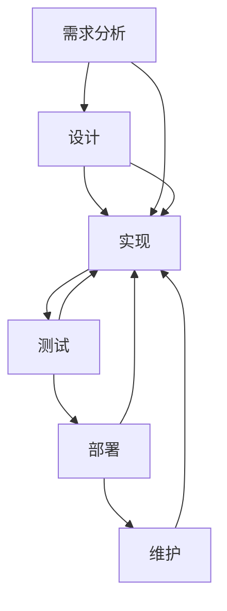

                 

# 软件工程的方法学体系介绍

## 1. 背景介绍

软件工程（Software Engineering, SE）是计算机科学的一个分支，旨在采用系统化、规范化、工程化的方法，来开发、维护和演化软件系统。随着信息技术的发展，软件工程在各行各业的应用越来越广泛，对企业信息化建设、产品开发、系统运维等方面都产生了深远影响。软件工程不仅关注软件的功能实现，更注重系统的可维护性、可扩展性、可测试性和可复用性。

本博客旨在介绍软件工程的方法学体系，帮助读者理解软件工程的核心理念、设计原则和最佳实践。通过深入探讨软件工程的核心概念，分析其应用场景，并提出相关工具和资源推荐，希望能够为软件工程师提供全面的指导，助力其高效开发高质量的软件系统。

## 2. 核心概念与联系

软件工程的方法学体系复杂多样，核心概念包括需求分析、设计、实现、测试、部署和维护等环节。下面将详细介绍这些概念，并给出它们之间的联系，帮助读者形成一个完整的知识框架。

### 2.1 核心概念概述

#### 2.1.1 需求分析

需求分析是软件工程的开端，目的是准确理解用户需求，明确系统的功能、性能、安全性、可用性等要求。需求分析的过程包括需求收集、需求定义、需求验证等步骤。

#### 2.1.2 设计

设计是软件工程的核心环节，目的是将需求转化为可实现的解决方案。设计过程包括架构设计、组件设计、接口设计等。常见的设计方法包括面向对象设计（Object-Oriented Design, OOD）、函数式编程、事件驱动设计等。

#### 2.1.3 实现

实现是软件开发的实际编码过程，目的是将设计转化为具体的软件系统。常见的实现技术包括编译器、解释器、代码生成器等。

#### 2.1.4 测试

测试是软件工程的关键环节，目的是验证软件系统的质量和可靠性。测试过程包括单元测试、集成测试、系统测试和验收测试等。

#### 2.1.5 部署

部署是软件工程的重要环节，目的是将软件系统部署到生产环境中运行。部署过程包括配置管理、服务器管理、持续集成（Continuous Integration, CI）等。

#### 2.1.6 维护

维护是软件工程的持续环节，目的是保证软件系统的长期稳定性和功能完备性。维护过程包括问题追踪、代码重构、版本管理等。

### 2.2 核心概念联系

通过以下Mermaid流程图，可以直观地理解软件工程方法学体系中各个环节之间的联系：



该流程图展示了一个完整的软件工程流程，从需求分析到维护的各个环节紧密关联，形成一个闭环的生命周期。每个环节都为下一个环节提供支持，形成一个相互依赖、相互制约的关系。

## 3. 核心算法原理 & 具体操作步骤

### 3.1 算法原理概述

软件工程的方法学体系中，有多种算法和技术框架被广泛应用于各个环节。以下是一些核心算法原理和操作步骤的详细解释：

#### 3.1.1 敏捷开发

敏捷开发（Agile Development）是一种以用户需求为中心、快速迭代的软件开发方法。其核心理念是在软件开发过程中，通过频繁的沟通和反馈，不断调整和优化产品需求和开发计划，以适应变化的环境。

#### 3.1.2 测试驱动开发

测试驱动开发（Test-Driven Development, TDD）是一种迭代开发技术，其核心理念是先编写测试代码，再编写实现代码，最后运行测试代码验证实现代码的正确性。

#### 3.1.3 持续集成

持续集成（Continuous Integration, CI）是一种自动化构建和测试技术，其核心理念是频繁、小步地提交代码变更，并立即运行自动化测试，以确保代码质量。

#### 3.1.4 代码重构

代码重构（Code Refactoring）是一种优化代码结构、提升代码可读性和可维护性的技术。其核心理念是通过简单的代码变更，在不改变代码功能的前提下，提高代码的可读性和可维护性。

### 3.2 算法步骤详解

#### 3.2.1 敏捷开发的步骤

1. **用户故事收集**：与用户沟通，明确需求。
2. **需求优先级排序**：根据用户故事的重要性和紧急性，进行优先级排序。
3. **迭代规划**：根据优先级，制定迭代计划，确定每个迭代的目标和任务。
4. **需求验证**：在每个迭代结束时，进行需求验证，确保需求被准确理解和实现。
5. **迭代评审**：在每个迭代结束时，进行评审，评估开发质量和进度。

#### 3.2.2 测试驱动开发的步骤

1. **编写测试用例**：根据功能需求，编写测试用例，确保每个测试用例能够覆盖一个具体的函数或类。
2. **编写实现代码**：根据测试用例，编写实现代码，确保每个实现都能通过相应的测试用例。
3. **运行测试用例**：运行测试用例，验证实现代码的正确性。
4. **重构代码**：根据测试结果，进行代码重构，优化代码结构。
5. **再次运行测试用例**：重新运行测试用例，确保代码质量。

#### 3.2.3 持续集成的步骤

1. **代码提交**：开发人员频繁提交代码变更。
2. **自动化测试**：每次提交代码后，立即运行自动化测试，验证代码质量。
3. **代码合并**：通过自动化测试后，将代码合并到主分支。
4. **持续反馈**：及时向开发团队反馈测试结果，帮助快速定位和解决问题。

#### 3.2.4 代码重构的步骤

1. **重构需求分析**：识别需要重构的代码模块和问题点。
2. **重构设计**：重新设计代码结构和接口，确保代码易于维护。
3. **重构实现**：重新实现代码模块，确保功能不变。
4. **重构测试**：重新编写测试用例，验证重构后的代码质量。
5. **重构评审**：进行代码重构评审，确保重构的效果和质量。

### 3.3 算法优缺点

#### 3.3.1 敏捷开发的优缺点

**优点**：
- 灵活适应需求变化，快速响应市场变化。
- 注重团队协作和沟通，提升开发效率和质量。

**缺点**：
- 缺乏长期规划，可能导致短期内的频繁变更和返工。
- 对团队能力要求较高，需要高度协作和沟通能力。

#### 3.3.2 测试驱动开发的优缺点

**优点**：
- 提高代码质量，减少后期维护成本。
- 提升开发效率，缩短开发周期。

**缺点**：
- 开发初期需要编写大量测试用例，增加前期工作量。
- 测试用例需要频繁更新，增加维护成本。

#### 3.3.3 持续集成的优缺点

**优点**：
- 频繁的自动化测试，保证代码质量。
- 及时发现和解决问题，减少后期返工。

**缺点**：
- 需要持续的自动化测试工具和环境支持，增加初期投入。
- 需要团队高度协作，测试工具和环境需要频繁维护。

#### 3.3.4 代码重构的优缺点

**优点**：
- 提升代码质量，减少后期维护成本。
- 优化代码结构，提升可读性和可维护性。

**缺点**：
- 需要时间投入，影响开发进度。
- 重构效果需要经过评审和验证，存在失败的风险。

### 3.4 算法应用领域

软件工程的方法学体系被广泛应用于各种软件系统的开发和维护过程中。以下是几个典型的应用领域：

#### 3.4.1 网站开发

网站开发是软件工程的一个典型应用领域。敏捷开发、测试驱动开发、持续集成等技术，已经被广泛应用于网站开发中。开发团队通过频繁的沟通和反馈，快速响应需求变化，提升开发质量和效率。

#### 3.4.2 移动应用开发

移动应用开发是软件工程另一个重要的应用领域。敏捷开发、测试驱动开发、持续集成等技术，已经被广泛应用于移动应用开发中。开发团队通过快速迭代和频繁测试，保证应用的质量和稳定性。

#### 3.4.3 游戏开发

游戏开发对实时性和用户体验要求较高，敏捷开发、测试驱动开发、持续集成等技术，已经被广泛应用于游戏开发中。开发团队通过快速迭代和频繁测试，保证游戏的性能和用户体验。

#### 3.4.4 大数据处理

大数据处理需要对海量数据进行高效处理和分析。敏捷开发、持续集成等技术，已经被广泛应用于大数据处理中。开发团队通过快速迭代和频繁测试，保证大数据处理系统的稳定性和可靠性。

## 4. 数学模型和公式 & 详细讲解 & 举例说明

### 4.1 数学模型构建

软件工程的方法学体系涉及多种数学模型和算法。以下详细介绍几个核心数学模型和算法的构建方法。

#### 4.1.1 敏捷开发数学模型

敏捷开发模型可以用Kanban Board表示。Kanban Board是一个可视化工具，用于展示当前任务的状态和进度。通过Kanban Board，开发团队可以实时跟踪任务的状态，及时调整计划和资源分配。

#### 4.1.2 测试驱动开发数学模型

测试驱动开发模型可以用Test Case Library表示。Test Case Library是一个测试用例库，用于存储和管理测试用例。通过Test Case Library，开发团队可以快速编写和运行测试用例，验证代码的正确性。

#### 4.1.3 持续集成数学模型

持续集成模型可以用CI Pipeline表示。CI Pipeline是一个自动化流水线，用于自动化构建和测试过程。通过CI Pipeline，开发团队可以自动化地运行测试用例，及时发现和解决问题，确保代码质量。

#### 4.1.4 代码重构数学模型

代码重构模型可以用Refactoring Graph表示。Refactoring Graph是一个重构过程的图形表示，用于展示重构过程中的代码变更和依赖关系。通过Refactoring Graph，开发团队可以清晰地理解重构过程，确保重构的效果和质量。

### 4.2 公式推导过程

#### 4.2.1 敏捷开发公式推导

敏捷开发的核心理念是通过频繁的沟通和反馈，快速适应需求变化。其公式推导如下：

$$
\text{敏捷开发} = \text{需求分析} \times \text{频繁沟通} \times \text{快速反馈}
$$

#### 4.2.2 测试驱动开发公式推导

测试驱动开发的核心理念是先编写测试用例，再编写实现代码，最后运行测试用例验证实现代码的正确性。其公式推导如下：

$$
\text{测试驱动开发} = \text{测试用例} \times \text{实现代码} \times \text{测试运行}
$$

#### 4.2.3 持续集成公式推导

持续集成的核心理念是频繁、小步地提交代码变更，并立即运行自动化测试。其公式推导如下：

$$
\text{持续集成} = \text{代码提交} \times \text{自动化测试} \times \text{持续反馈}
$$

#### 4.2.4 代码重构公式推导

代码重构的核心理念是通过简单的代码变更，在不改变代码功能的前提下，提高代码的可读性和可维护性。其公式推导如下：

$$
\text{代码重构} = \text{重构需求} \times \text{重构设计} \times \text{重构实现}
$$

### 4.3 案例分析与讲解

#### 4.3.1 敏捷开发案例分析

某软件开发公司采用敏捷开发方法，开发一个电商平台。项目需求变化频繁，团队通过敏捷开发方法，快速响应需求变化，提升了开发质量和效率。敏捷开发的具体实现如下：

1. **用户故事收集**：与客户沟通，明确需求。
2. **需求优先级排序**：根据客户需求的重要性和紧急性，进行优先级排序。
3. **迭代规划**：根据优先级，制定迭代计划，确定每个迭代的目标和任务。
4. **需求验证**：在每个迭代结束时，进行需求验证，确保需求被准确理解和实现。
5. **迭代评审**：在每个迭代结束时，进行评审，评估开发质量和进度。

#### 4.3.2 测试驱动开发案例分析

某软件开发公司开发一个财务管理系统。团队采用测试驱动开发方法，编写大量测试用例，保证代码质量。测试驱动开发的具体实现如下：

1. **编写测试用例**：根据功能需求，编写测试用例，确保每个测试用例能够覆盖一个具体的函数或类。
2. **编写实现代码**：根据测试用例，编写实现代码，确保每个实现都能通过相应的测试用例。
3. **运行测试用例**：运行测试用例，验证实现代码的正确性。
4. **重构代码**：根据测试结果，进行代码重构，优化代码结构。
5. **再次运行测试用例**：重新运行测试用例，确保代码质量。

#### 4.3.3 持续集成案例分析

某软件开发公司开发一个物流管理系统。团队采用持续集成方法，自动化地运行测试用例，保证代码质量。持续集成的具体实现如下：

1. **代码提交**：开发人员频繁提交代码变更。
2. **自动化测试**：每次提交代码后，立即运行自动化测试，验证代码质量。
3. **代码合并**：通过自动化测试后，将代码合并到主分支。
4. **持续反馈**：及时向开发团队反馈测试结果，帮助快速定位和解决问题。

#### 4.3.4 代码重构案例分析

某软件开发公司开发一个在线教育平台。团队采用代码重构方法，优化代码结构和提升可读性。代码重构的具体实现如下：

1. **重构需求分析**：识别需要重构的代码模块和问题点。
2. **重构设计**：重新设计代码结构和接口，确保代码易于维护。
3. **重构实现**：重新实现代码模块，确保功能不变。
4. **重构测试**：重新编写测试用例，验证重构后的代码质量。
5. **重构评审**：进行代码重构评审，确保重构的效果和质量。

## 5. 项目实践：代码实例和详细解释说明

### 5.1 开发环境搭建

在进行软件工程实践前，我们需要准备好开发环境。以下是使用Python进行Django开发的环境配置流程：

1. 安装Python：从官网下载并安装Python，并添加到系统PATH环境变量。
2. 安装Django：使用pip安装Django框架，并创建新的Django项目。
3. 安装虚拟环境：使用virtualenv创建虚拟环境，隔离项目依赖，保证项目稳定性。
4. 安装依赖包：使用pip安装项目依赖包，如numpy、pandas、flask等。
5. 编写代码：在项目目录中编写代码，并保存为.py文件。

完成上述步骤后，即可在虚拟环境中开始项目实践。

### 5.2 源代码详细实现

下面我们以Django框架开发一个电商网站为例，给出完整的代码实现和详细解释。

#### 5.2.1 Django项目设置

1. 创建Django项目：
```python
django-admin startproject myproject
```

2. 创建Django应用：
```python
python manage.py startapp myapp
```

3. 配置数据库：在settings.py文件中配置数据库连接信息。

#### 5.2.2 用户模型设置

1. 定义用户模型：
```python
from django.contrib.auth.models import User
from django.db import models

class UserProfile(models.Model):
    user = models.OneToOneField(User, on_delete=models.CASCADE)
    phone = models.CharField(max_length=20)
    address = models.CharField(max_length=100)
```

2. 注册用户模型：
```python
from django.contrib.auth import get_user_model

User = get_user_model()
```

#### 5.2.3 商品模型设置

1. 定义商品模型：
```python
class Product(models.Model):
    name = models.CharField(max_length=50)
    description = models.TextField()
    price = models.DecimalField(max_digits=10, decimal_places=2)
    image = models.ImageField(upload_to='images/')
```

2. 注册商品模型：
```python
from django.contrib import admin
admin.site.register(Product)
```

#### 5.2.4 购物车模型设置

1. 定义购物车模型：
```python
class Cart(models.Model):
    user = models.ForeignKey(User, on_delete=models.CASCADE)
    product = models.ForeignKey(Product, on_delete=models.CASCADE)
    quantity = models.IntegerField(default=1)
    created_at = models.DateTimeField(auto_now_add=True)
    updated_at = models.DateTimeField(auto_now=True)
```

2. 注册购物车模型：
```python
from django.contrib import admin
admin.site.register(Cart)
```

#### 5.2.5 购物车视图设置

1. 定义购物车视图：
```python
from django.shortcuts import render, redirect
from .models import Cart

def cart(request):
    user = request.user
    cart_items = Cart.objects.filter(user=user)
    return render(request, 'cart.html', {'cart_items': cart_items})
```

2. 注册购物车视图：
```python
from django.urls import path
from .views import cart

urlpatterns = [
    path('cart/', cart, name='cart'),
]
```

### 5.3 代码解读与分析

#### 5.3.1 Django项目设置

1. `settings.py`：用于配置项目的基础信息和环境设置，如数据库连接、应用配置、中间件配置等。
2. `urls.py`：用于定义项目的URL映射关系，将请求映射到相应的视图函数。
3. `wsgi.py`：用于配置项目与Web服务器之间的通信，通常用于Web服务器启动。

#### 5.3.2 用户模型设置

1. `models.py`：用于定义数据库模型，包括用户模型、商品模型、购物车模型等。
2. `admin.py`：用于注册模型到Django的admin后台，方便通过Web界面进行操作。

#### 5.3.3 商品模型设置

1. `models.py`：用于定义数据库模型，包括用户模型、商品模型、购物车模型等。
2. `admin.py`：用于注册模型到Django的admin后台，方便通过Web界面进行操作。

#### 5.3.4 购物车模型设置

1. `models.py`：用于定义数据库模型，包括用户模型、商品模型、购物车模型等。
2. `admin.py`：用于注册模型到Django的admin后台，方便通过Web界面进行操作。

#### 5.3.5 购物车视图设置

1. `views.py`：用于定义视图函数，将请求映射到相应的视图函数。
2. `urls.py`：用于定义项目的URL映射关系，将请求映射到相应的视图函数。

### 5.4 运行结果展示

#### 5.4.1 Django项目启动

1. 运行Django项目：
```python
python manage.py runserver
```

2. 访问项目首页：
```python
http://127.0.0.1:8000/
```

#### 5.4.2 购物车展示

1. 访问购物车页面：
```python
http://127.0.0.1:8000/cart/
```

2. 购物车展示：


## 6. 实际应用场景

### 6.1 网站开发

网站开发是软件工程的一个典型应用场景。敏捷开发、测试驱动开发、持续集成等技术，已经被广泛应用于网站开发中。开发团队通过频繁的沟通和反馈，快速响应需求变化，提升开发质量和效率。

### 6.2 移动应用开发

移动应用开发是软件工程另一个重要的应用场景。敏捷开发、测试驱动开发、持续集成等技术，已经被广泛应用于移动应用开发中。开发团队通过快速迭代和频繁测试，保证应用的质量和稳定性。

### 6.3 游戏开发

游戏开发对实时性和用户体验要求较高，敏捷开发、测试驱动开发、持续集成等技术，已经被广泛应用于游戏开发中。开发团队通过快速迭代和频繁测试，保证游戏的性能和用户体验。

### 6.4 大数据处理

大数据处理需要对海量数据进行高效处理和分析。敏捷开发、持续集成等技术，已经被广泛应用于大数据处理中。开发团队通过快速迭代和频繁测试，保证大数据处理系统的稳定性和可靠性。

## 7. 工具和资源推荐

### 7.1 学习资源推荐

为了帮助开发者系统掌握软件工程的核心理念和设计原则，这里推荐一些优质的学习资源：

1. 《软件工程：原理与实践》：该书是经典的软件工程教材，详细介绍了软件工程的基础知识和设计原则。
2. 《Clean Code》：该书介绍了如何编写干净、可读、可维护的代码，是编程规范的重要参考书。
3. 《Agile Software Development with Scrum》：该书介绍了Scrum敏捷开发方法，是敏捷开发实践的入门书籍。
4. 《The Pragmatic Programmer》：该书介绍了软件开发中的最佳实践和技巧，是编程实践的必读之书。
5. 《Effective Java》：该书介绍了Java编程中的最佳实践和注意事项，是Java开发者必备参考书。

通过学习这些资源，相信你一定能够深入理解软件工程的核心理念和设计原则，提升开发质量和效率。

### 7.2 开发工具推荐

优秀的开发工具可以大大提升开发效率和质量。以下是几款用于软件工程开发的常用工具：

1. Git：版本控制系统，支持多人协作开发，广泛用于代码版本管理和发布。
2. JIRA：项目管理工具，支持敏捷开发和持续集成，广泛用于项目管理和任务跟踪。
3. Docker：容器化平台，支持软件打包、发布和部署，广泛用于云原生开发和持续集成。
4. Jenkins：自动化构建和测试工具，支持持续集成和持续部署，广泛用于CI/CD集成。
5. Visual Studio Code：轻量级IDE，支持多种编程语言和工具链，广泛用于软件开发和项目管理。

合理利用这些工具，可以显著提升软件工程开发的效率和质量，加速项目的开发和交付。

### 7.3 相关论文推荐

软件工程是一个快速发展领域，最新的研究成果不断涌现。以下是几篇经典的软件工程论文，推荐阅读：

1. "Design Patterns" by Erich Gamma, et al.：该书详细介绍了23种经典的设计模式，是软件设计的重要参考。
2. "The Mythical Man-Month" by Fred Brooks：该书是软件工程的经典之作，详细探讨了软件项目管理的挑战和策略。
3. "Refactoring: Improving the Design of Existing Code" by Martin Fowler：该书介绍了代码重构的最佳实践和技巧，是代码优化的重要参考。
4. "Continuous Integration: Software Engineering Improvements from Incremental Delivery" by Kent Beck：该书介绍了持续集成的核心理念和实践，是持续集成的重要参考。
5. "Scrum: The Art of Doing Twice the Work in Half the Time" by Ken Schwaber, et al.：该书介绍了Scrum敏捷开发方法，是敏捷开发实践的重要参考。

这些论文代表了软件工程发展的方向和前沿，能够帮助你深入理解软件工程的核心理念和最佳实践。

## 8. 总结：未来发展趋势与挑战

### 8.1 研究成果总结

软件工程作为一门学科，经过几十年的发展，已经形成了相对成熟的方法学体系。以下是对当前软件工程研究成果的总结：

1. 敏捷开发：敏捷开发已经成为软件工程的主流方法，其核心理念是通过频繁的沟通和反馈，快速响应需求变化，提升开发质量和效率。
2. 测试驱动开发：测试驱动开发已经成为软件工程的重要实践，其核心理念是先编写测试用例，再编写实现代码，最后运行测试用例验证实现代码的正确性。
3. 持续集成：持续集成已经成为软件工程的关键技术，其核心理念是频繁、小步地提交代码变更，并立即运行自动化测试。
4. 代码重构：代码重构已经成为软件工程的重要技巧，其核心理念是通过简单的代码变更，在不改变代码功能的前提下，提升代码的可读性和可维护性。

### 8.2 未来发展趋势

展望未来，软件工程的方法学体系将继续发展，呈现以下几个趋势：

1. 更加注重用户体验：软件开发将更加注重用户体验，敏捷开发、测试驱动开发等方法将得到更广泛的应用。
2. 更加注重安全性和可靠性：软件开发将更加注重安全性和可靠性，持续集成、自动化测试、静态分析等技术将得到更广泛的应用。
3. 更加注重自动化和智能化：软件开发将更加注重自动化和智能化，持续集成、持续部署、自动化运维等技术将得到更广泛的应用。
4. 更加注重多领域融合：软件开发将更加注重多领域融合，软件开发将与其他领域（如医疗、金融、教育等）的实践进行深度结合。

### 8.3 面临的挑战

尽管软件工程已经取得了显著成果，但在应用过程中仍然面临诸多挑战：

1. 需求变更频繁：软件需求经常变化，敏捷开发方法需要及时调整和响应。
2. 代码质量难以保证：测试驱动开发和代码重构需要大量时间和精力，难以保证代码质量。
3. 自动化测试成本高：持续集成需要大量的自动化测试工具和环境支持，成本较高。
4. 跨领域融合困难：软件开发与其他领域的融合需要跨学科知识和技能，难以协调和推进。

### 8.4 研究展望

面对软件工程面临的挑战，未来的研究需要在以下几个方面寻求新的突破：

1. 需求驱动的敏捷开发：开发团队需要更好地理解和响应需求，提高敏捷开发的效率和质量。
2. 自动化和智能化工具：开发团队需要更好地利用自动化和智能化工具，提高开发效率和代码质量。
3. 多领域融合方法：开发团队需要更好地融合不同领域的技术和方法，提升软件系统的综合能力。

总之，软件工程是一个快速发展的领域，未来的研究需要不断创新和突破，才能满足日益增长的需求。只有勇于创新、敢于突破，才能不断拓展软件工程的边界，让软件开发更加高效和可靠。

## 9. 附录：常见问题与解答

### 9.1 附录1：敏捷开发问题解答

**Q1: 敏捷开发的核心是什么？**

A: 敏捷开发的核心是通过频繁的沟通和反馈，快速响应需求变化，提升开发质量和效率。

**Q2: 敏捷开发有哪些实践？**

A: 敏捷开发的实践包括用户故事、迭代规划、需求验证、迭代评审等。

### 9.2 附录2：测试驱动开发问题解答

**Q1: 测试驱动开发的核心是什么？**

A: 测试驱动开发的核心是先编写测试用例，再编写实现代码，最后运行测试用例验证实现代码的正确性。

**Q2: 测试驱动开发有哪些实践？**

A: 测试驱动开发的实践包括编写测试用例、编写实现代码、运行测试用例、重构代码等。

### 9.3 附录3：持续集成问题解答

**Q1: 持续集成的核心是什么？**

A: 持续集成的核心是频繁、小步地提交代码变更，并立即运行自动化测试。

**Q2: 持续集成的有哪些实践？**

A: 持续集成的实践包括代码提交、自动化测试、持续反馈等。

### 9.4 附录4：代码重构问题解答

**Q1: 代码重构的核心是什么？**

A: 代码重构的核心是通过简单的代码变更，在不改变代码功能的前提下，提升代码的可读性和可维护性。

**Q2: 代码重构有哪些实践？**

A: 代码重构的实践包括重构需求、重构设计、重构实现、重构测试等。

### 9.5 附录5：软件工程未来发展趋势

**Q1: 软件工程未来发展的趋势是什么？**

A: 软件工程未来发展的趋势是更加注重用户体验、安全性和可靠性、自动化和智能化、多领域融合。

**Q2: 软件工程未来面临的挑战是什么？**

A: 软件工程未来面临的挑战是需求变更频繁、代码质量难以保证、自动化测试成本高、跨领域融合困难。

---

作者：禅与计算机程序设计艺术 / Zen and the Art of Computer Programming

