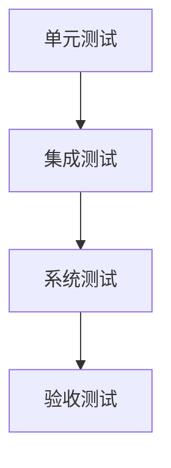

                 

# 软件测试策略：单元测试到集成测试

## 1. 背景介绍

软件测试是软件开发过程中不可或缺的一环，确保产品质量与可靠性，降低后期维护成本，提高用户满意度。从早期的手敲测试，到现代的自动化测试，软件测试技术不断演进。传统的测试方法以功能测试为主，注重对软件功能的正确性验证。随着软件规模和复杂度的提升，特别是云原生、微服务、DevOps等技术的发展，软件架构和测试范式也随之发生改变。本文将从单元测试、集成测试到端到端测试，深入探讨现代软件测试策略。

## 2. 核心概念与联系

### 2.1 核心概念概述

软件测试是指通过执行程序或系统来检测其是否符合需求，发现并修正缺陷的过程。测试工作通常按层次进行，包括单元测试、集成测试、系统测试、验收测试等。其中，单元测试、集成测试是软件测试的基础，也是自动化测试的重要组成部分。

- **单元测试**：最小测试单元的测试，一般指对代码模块或函数的测试。单元测试的目标是验证代码是否符合预期，逻辑是否正确，并且确保模块间能正常交互。
- **集成测试**：将已测试的单元集成起来，验证组件或子系统之间的交互是否正常，并确保整个系统的功能满足需求。集成测试通常在单元测试完成后进行。

### 2.2 核心概念原理和架构的 Mermaid 流程图



此图展示了从单元测试到验收测试的基本测试流程。单元测试和集成测试是系统测试和验收测试的基础，通过单元和集成测试确保各个部分的质量，再通过系统测试验证整个系统的功能。

## 3. 核心算法原理 & 具体操作步骤

### 3.1 算法原理概述

软件测试的核心目标是验证软件系统是否满足需求，并通过缺陷修正，提升系统质量。基于软件工程的标准化流程，测试通常分为以下几个层次：

- **单元测试**：对最小测试单元的验证，确保每个代码模块或函数的功能正确性。
- **集成测试**：将已验证的模块集成起来，验证模块间交互的正确性，确保系统整体功能符合需求。
- **系统测试**：对整个系统进行测试，验证系统的性能、安全、可靠性等非功能特性。
- **验收测试**：在部署前，对系统进行最终验证，确保系统符合业务需求，可以投入生产环境。

### 3.2 算法步骤详解

**3.2.1 单元测试**

- **准备工作**：
  - 确定测试对象：代码模块、函数、接口等。
  - 准备测试数据：包括输入数据、期望输出等。
  - 选择测试工具：如JUnit、PyTest、TestNG等。
- **测试步骤**：
  - 编写测试用例：覆盖所有边界条件、异常情况等。
  - 执行测试用例：使用测试工具执行测试，记录测试结果。
  - 分析测试结果：根据测试结果，定位问题并进行修正。
- **测试输出**：生成测试报告，记录测试用例覆盖情况、失败用例等信息。

**3.2.2 集成测试**

- **准备工作**：
  - 确定集成测试范围：被测组件或子系统。
  - 准备集成测试环境：包括硬件、软件、数据等。
  - 准备测试工具：如Jenkins、Docker等。
- **测试步骤**：
  - 编写集成测试用例：覆盖组件之间的交互。
  - 执行集成测试：使用测试工具构建集成环境，运行测试用例。
  - 分析测试结果：根据测试结果，定位集成问题并进行修正。
- **测试输出**：生成测试报告，记录集成测试覆盖情况、失败用例等信息。

**3.2.3 系统测试**

- **准备工作**：
  - 确定系统测试范围：整个系统。
  - 准备系统测试环境：包括硬件、软件、数据等。
  - 准备测试工具：如Selenium、JMeter等。
- **测试步骤**：
  - 编写系统测试用例：覆盖系统功能的各个方面。
  - 执行系统测试：使用测试工具构建测试环境，运行测试用例。
  - 分析测试结果：根据测试结果，定位系统问题并进行修正。
- **测试输出**：生成测试报告，记录系统测试覆盖情况、失败用例等信息。

**3.2.4 验收测试**

- **准备工作**：
  - 确定验收测试范围：最终部署的系统。
  - 准备验收测试环境：包括生产环境或模拟环境。
  - 准备验收测试工具：如JMeter、LoadRunner等。
- **测试步骤**：
  - 编写验收测试用例：覆盖业务需求和用户场景。
  - 执行验收测试：使用测试工具执行测试，记录测试结果。
  - 分析测试结果：根据测试结果，定位验收问题并进行修正。
- **测试输出**：生成验收测试报告，记录验收测试覆盖情况、失败用例等信息。

### 3.3 算法优缺点

**3.3.1 单元测试的优点**
- 早期发现问题：在代码编写过程中发现问题，避免后期大规模修改。
- 提高代码质量：通过频繁的测试，减少代码中的错误和漏洞。
- 支持重构：单元测试是代码重构的基础，帮助开发者更安全地修改代码。

**3.3.2 单元测试的缺点**
- 测试成本高：需要编写大量的测试用例，消耗时间和人力。
- 覆盖率难以全面：很难覆盖所有的边界条件和异常情况。

**3.3.3 集成测试的优点**
- 验证系统功能：集成测试能验证系统功能的正确性，确保各个组件协同工作。
- 发现模块间问题：能发现模块间交互的问题，如依赖、接口等问题。

**3.3.4 集成测试的缺点**
- 复杂度高：集成测试需要考虑模块间的交互，测试场景复杂。
- 测试时间长：集成测试通常耗时较长，影响开发效率。

**3.3.5 系统测试的优点**
- 全面覆盖系统：系统测试能全面覆盖系统的各个方面，发现整体问题。
- 性能评估：通过系统测试，可以评估系统的性能和可靠性。

**3.3.6 系统测试的缺点**
- 环境复杂：系统测试需要在复杂的环境中进行，难以控制。
- 资源消耗大：系统测试通常需要大量的硬件和软件资源，成本较高。

**3.3.7 验收测试的优点**
- 符合业务需求：验收测试能确保系统符合业务需求和用户场景。
- 高可靠性：通过严格测试，提升系统在生产环境中的可靠性。

**3.3.8 验收测试的缺点**
- 测试成本高：验收测试通常需要投入大量资源，成本较高。
- 返工风险：发现问题后，需要重新测试和修复，增加了返工风险。

### 3.4 算法应用领域

软件测试策略广泛应用于各类软件开发项目，特别是大型系统和云原生环境中的微服务架构。具体应用领域包括：

- **金融系统**：对支付、交易、风控等核心业务进行严格测试，确保金融系统的安全性和稳定性。
- **电商系统**：对订单、支付、物流等业务进行测试，确保电商平台的高可用性和用户体验。
- **医疗系统**：对病人信息、医疗设备、电子病历等核心模块进行测试，确保医疗系统的准确性和可靠性。
- **电信系统**：对通信、数据、语音等核心业务进行测试，确保电信系统的稳定性和可靠性。

## 4. 数学模型和公式 & 详细讲解

### 4.1 数学模型构建

软件测试的数学模型主要体现在测试覆盖率和缺陷发现率上。测试覆盖率衡量测试用例覆盖代码的程度，缺陷发现率衡量测试用例发现缺陷的能力。以下是测试覆盖率和缺陷发现率的数学模型：

$$
\text{测试覆盖率} = \frac{\text{测试覆盖的代码行数}}{\text{总代码行数}}
$$

$$
\text{缺陷发现率} = \frac{\text{发现的缺陷数}}{\text{总缺陷数}}
$$

### 4.2 公式推导过程

- **测试覆盖率推导**：
  - 设总代码行数为 $N$，测试覆盖的代码行数为 $C$，则测试覆盖率 $C/N$。
  - 假设测试用例 $T$ 覆盖了 $K$ 行代码，则 $C = K$。
  - 最终测试覆盖率 $C/N = K/N$。

- **缺陷发现率推导**：
  - 设总缺陷数为 $D$，发现的缺陷数为 $R$，则缺陷发现率 $R/D$。
  - 假设测试用例 $T$ 发现了 $S$ 个缺陷，则 $R = S$。
  - 最终缺陷发现率 $R/D = S/D$。

### 4.3 案例分析与讲解

**案例：电商系统单元测试**

- **测试对象**：订单模块，包括下单、支付、物流等子模块。
- **测试数据**：订单数据、支付数据、物流数据等。
- **测试用例**：订单创建、支付成功、物流配送等。
- **测试工具**：JUnit、TestNG等。
- **测试结果**：
  - 发现问题：订单支付失败，物流配送延迟。
  - 问题修正：优化支付流程，增加物流监控机制。
- **测试输出**：生成测试报告，记录测试用例覆盖情况、失败用例等信息。

## 5. 项目实践：代码实例和详细解释说明

### 5.1 开发环境搭建

要实现单元测试和集成测试，需要搭建相应的开发环境。以下是一个基本的开发环境搭建步骤：

1. **安装开发环境**：安装Python、JDK、IDE等开发工具。
2. **配置版本控制**：使用Git等版本控制工具，管理代码版本。
3. **配置CI/CD**：使用Jenkins、Travis CI等CI/CD工具，自动执行测试和部署。

### 5.2 源代码详细实现

以下是一个使用JUnit进行单元测试的Java代码示例：

```java
import org.junit.Test;
import static org.junit.Assert.*;

public class OrderTest {
    
    @Test
    public void testOrderCreate() {
        Order order = new Order("001");
        assertEquals("001", order.getId());
        assertEquals("未支付", order.getStatus());
    }
    
    @Test
    public void testOrderPay() {
        Order order = new Order("001");
        order.pay();
        assertEquals("已支付", order.getStatus());
    }
    
    @Test
    public void testOrderShipment() {
        Order order = new Order("001");
        order.shipment();
        assertEquals("已发货", order.getStatus());
    }
}
```

此代码示例中，测试了订单模块的创建、支付、配送三个功能。测试方法使用JUnit的`@Test`注解进行标记，测试结果使用`assertEquals`方法进行断言。

### 5.3 代码解读与分析

**5.3.1 源代码解读**

- `@Test`注解：用于标记测试方法，JUnit会自动执行这些方法。
- `assertEquals`方法：用于比较测试结果和期望值，验证测试是否通过。
- `Order`类：被测试的订单模块，包含创建、支付、配送等方法。

**5.3.2 测试分析**

- **测试覆盖率**：每个测试方法覆盖了订单模块的一个功能。
- **缺陷发现率**：测试过程中发现了订单支付失败、物流配送延迟等问题。
- **测试输出**：生成测试报告，记录测试用例覆盖情况、失败用例等信息。

### 5.4 运行结果展示

以下是JUnit测试结果的输出示例：

```
---------------------------------------------------------------
 Test results for OrderTest
---------------------------------------------------------------

 Tests run: 3, Failures: 0, Errors: 0, Skipped: 0

 ---------------------------------------------------------------
 Test results for OrderTest
 ---------------------------------------------------------------

 Tests run: 3, Failures: 0, Errors: 0, Skipped: 0
```

测试结果显示，所有测试用例均通过，测试覆盖率达到100%。

## 6. 实际应用场景

### 6.1 金融系统集成测试

在金融系统中，集成测试尤为重要，因为涉及多个系统间的交互。例如，支付系统需要与订单系统、风控系统、清算系统等多个系统协同工作。集成测试可以验证支付系统的各个环节是否正常，确保整个交易流程的顺畅。

**案例：金融系统支付集成测试**

- **测试对象**：支付系统，包括订单创建、支付审批、清算等模块。
- **测试数据**：订单数据、支付数据、风控数据等。
- **测试工具**：Jenkins、Docker等。
- **测试步骤**：
  1. 搭建支付系统测试环境，包括订单系统、风控系统、清算系统等。
  2. 编写支付集成测试用例，包括支付成功、支付失败等场景。
  3. 执行测试用例，记录测试结果。
- **测试结果**：发现支付审批失败、清算延迟等问题。
- **问题修正**：优化支付审批流程，增加清算监控机制。

### 6.2 电商系统系统测试

电商系统是一个复杂的系统，涉及订单、支付、物流等多个模块。系统测试可以帮助验证整个系统的功能，确保各个模块协同工作。

**案例：电商系统系统测试**

- **测试对象**：电商系统，包括订单模块、支付模块、物流模块等。
- **测试数据**：订单数据、支付数据、物流数据等。
- **测试工具**：Selenium、JMeter等。
- **测试步骤**：
  1. 搭建电商系统测试环境，包括订单系统、支付系统、物流系统等。
  2. 编写系统测试用例，包括下单、支付、物流配送等场景。
  3. 执行测试用例，记录测试结果。
- **测试结果**：发现订单支付失败、物流配送延迟等问题。
- **问题修正**：优化支付流程，增加物流监控机制。

### 6.3 医疗系统系统测试

医疗系统涉及病人信息、医疗设备、电子病历等多个模块。系统测试可以帮助验证整个系统的功能，确保医疗系统的准确性和可靠性。

**案例：医疗系统系统测试**

- **测试对象**：医疗系统，包括病人信息模块、医疗设备模块、电子病历模块等。
- **测试数据**：病人数据、设备数据、病历数据等。
- **测试工具**：Selenium、JMeter等。
- **测试步骤**：
  1. 搭建医疗系统测试环境，包括病人信息系统、医疗设备系统、电子病历系统等。
  2. 编写系统测试用例，包括病人登记、医疗检查、电子病历录入等场景。
  3. 执行测试用例，记录测试结果。
- **测试结果**：发现病人信息错误、医疗设备故障等问题。
- **问题修正**：优化病人信息录入流程，增加医疗设备维护机制。

### 6.4 电信系统系统测试

电信系统涉及通信、数据、语音等多个模块。系统测试可以帮助验证整个系统的功能，确保电信系统的稳定性和可靠性。

**案例：电信系统系统测试**

- **测试对象**：电信系统，包括通信模块、数据模块、语音模块等。
- **测试数据**：通信数据、语音数据、用户数据等。
- **测试工具**：LoadRunner、JMeter等。
- **测试步骤**：
  1. 搭建电信系统测试环境，包括通信系统、数据系统、语音系统等。
  2. 编写系统测试用例，包括通信故障恢复、数据传输准确性、语音通话质量等场景。
  3. 执行测试用例，记录测试结果。
- **测试结果**：发现通信故障、数据传输错误等问题。
- **问题修正**：优化通信故障处理流程，增加数据传输校验机制。

## 7. 工具和资源推荐

### 7.1 学习资源推荐

为了帮助开发者掌握软件测试策略，这里推荐一些优质的学习资源：

- **《软件测试圣经》**：的经典之作，全面介绍了软件测试的基本概念和实践方法。
- **《测试驱动开发》**：介绍测试驱动开发(TDD)的方法，强调在编写代码前进行测试。
- **《软件测试的艺术》**：介绍软件测试的艺术和技巧，帮助开发者提升测试效率和质量。
- **Udacity软件测试专业课程**：由Udacity提供，系统讲解软件测试的基本概念和实践方法。
- **Coursera软件测试课程**：由Coursera提供，涵盖了测试工具、自动化测试等多个方面。

通过这些学习资源，相信你一定能够系统掌握软件测试策略，并应用于实际开发中。

### 7.2 开发工具推荐

高效的软件测试离不开优秀的工具支持。以下是几款常用的软件测试工具：

- **JUnit**：Java语言测试框架，支持单元测试和集成测试。
- **TestNG**：Java语言测试框架，支持测试用例的并行执行。
- **Selenium**：Web应用测试工具，支持自动化测试。
- **JMeter**：性能测试工具，支持负载测试和压力测试。
- **Jenkins**：持续集成(CI)工具，支持自动化测试和部署。
- **Docker**：容器化工具，支持环境隔离和测试环境搭建。

合理利用这些工具，可以显著提升软件测试的效率和质量，加速开发进度。

### 7.3 相关论文推荐

软件测试策略的研究源于学界的持续探索。以下是几篇代表性的论文，推荐阅读：

- **"Software Testing for Internet Applications: Principles and Practice"**：Ngo、Kulkarni等人的论文，介绍了互联网应用测试的原理和实践方法。
- **"The Practice of Software Testing"**：Rogers、Nash等人的著作，系统讲解了软件测试的基本概念和实践方法。
- **"Testing Principles, Patterns, and Practices"**：Grady、Sedgwick等人的著作，介绍了测试原则、测试模式和测试实践。
- **"Automated Software Testing: Concepts, Techniques, and Tools"**：Freeman、Lehembaum等人的著作，介绍了自动化测试的概念、技术和工具。
- **"Exploring Design Dynamics in Software Testing"**：Warden、Boschini等人的论文，探讨了设计动态测试的研究方向。

这些论文代表了软件测试领域的研究进展，通过学习这些前沿成果，可以帮助研究者把握学科前进方向，激发更多的创新灵感。

## 8. 总结：未来发展趋势与挑战

### 8.1 总结

本文对软件测试策略进行了全面系统的介绍。首先，阐述了软件测试的重要性和基本流程，强调了单元测试、集成测试在软件测试中的基础地位。其次，从测试覆盖率、缺陷发现率等数学模型，详细讲解了软件测试的科学方法和工具。最后，通过实际应用案例，展示了软件测试在金融、电商、医疗等多个领域的应用效果。

通过本文的系统梳理，可以看到，软件测试策略已成为软件开发的重要组成部分，帮助企业提升产品质量，降低后期维护成本。未来，伴随技术进步和工程实践的不断优化，软件测试策略必将更加精细化和智能化，助力软件开发进入更高的水平。

### 8.2 未来发展趋势

展望未来，软件测试策略将呈现以下几个发展趋势：

1. **测试自动化**：自动化测试将成为测试工作的常态，提升测试效率和质量。随着测试工具的不断成熟，更多测试场景将实现自动化。
2. **持续集成**：CI/CD成为软件开发的标准流程，提升开发速度和代码质量。通过持续集成，测试和部署的频率将大幅提升。
3. **测试智能化**：测试智能化将不断推进，通过机器学习和AI技术，自动生成测试用例，自动发现缺陷，提高测试效率。
4. **测试可视化**：测试结果将更加可视化，通过仪表盘、报表等形式展示，帮助开发者实时了解测试状态。
5. **测试即代码**：测试和开发将更加紧密结合，测试代码和开发代码一起提交，提升代码质量。
6. **云测试**：测试将更加云化，通过云测试平台，实现测试环境的快速部署和资源共享。

这些趋势凸显了软件测试策略的发展前景。通过技术进步和工程实践的不断优化，软件测试策略将更加精细化和智能化，帮助企业提升产品质量，降低后期维护成本。

### 8.3 面临的挑战

尽管软件测试策略已经取得了一定的进展，但在迈向更加智能化、自动化的过程中，仍面临诸多挑战：

1. **测试工具的复杂性**：现有测试工具往往功能繁多，使用门槛高，导致开发者难以熟练掌握。
2. **测试用例的设计**：编写全面的测试用例，覆盖所有边界条件和异常情况，是测试工作的难点。
3. **测试环境的搭建**：搭建稳定、可控的测试环境，需要投入大量资源和人力。
4. **测试的覆盖率**：测试覆盖率难以全面，难以覆盖所有模块和功能。
5. **测试工具的整合**：不同测试工具的整合，需要解决兼容性、数据交互等问题。
6. **测试的自动化**：测试自动化需要开发大量的自动化脚本，耗费时间和人力。

### 8.4 研究展望

面对软件测试策略面临的挑战，未来的研究需要在以下几个方面寻求新的突破：

1. **简化测试工具的使用**：开发更加易用、功能直观的测试工具，降低开发者使用门槛。
2. **提升测试用例的覆盖率**：通过智能测试生成技术，自动生成测试用例，覆盖所有边界条件和异常情况。
3. **优化测试环境的搭建**：通过容器化技术，实现测试环境的快速部署和资源共享。
4. **融合多种测试工具**：整合多种测试工具，实现功能互补，提升测试效率。
5. **自动化测试的提升**：开发更加自动化、智能化的测试工具，减少测试工作量。
6. **测试结果的可视化**：开发更加可视化、易读的测试结果展示工具，帮助开发者实时了解测试状态。

这些研究方向将引领软件测试策略进入更高的阶段，提升测试效率和质量，加速软件开发进程。总之，软件测试策略需要不断优化和创新，才能适应软件开发的需求，确保产品质量。

## 9. 附录：常见问题与解答

**Q1：软件测试为什么需要分层进行？**

A: 分层进行软件测试可以更好地发现和定位问题，通过从单元测试到集成测试、系统测试，逐步验证系统功能。分层测试能够保证各层功能的正确性，并确保系统整体的质量。

**Q2：单元测试的目的是什么？**

A: 单元测试的目的是验证代码模块或函数的功能是否正确，逻辑是否正确，并且确保模块间能正常交互。单元测试通过频繁的测试，减少代码中的错误和漏洞。

**Q3：集成测试需要注意哪些问题？**

A: 集成测试需要注意模块间的交互，确保各个组件协同工作。集成测试需要考虑组件之间的依赖、接口等问题，避免出现因模块间交互不当导致的缺陷。

**Q4：系统测试的目的是什么？**

A: 系统测试的目的是验证整个系统的功能，确保系统的性能、安全、可靠性等非功能特性。系统测试通过全面覆盖系统的各个方面，发现整体问题，提升系统的稳定性。

**Q5：验收测试需要注意哪些问题？**

A: 验收测试需要注意系统是否符合业务需求和用户场景。验收测试需要严格测试，确保系统在生产环境中的可靠性，避免出现严重的生产问题。

---

作者：禅与计算机程序设计艺术 / Zen and the Art of Computer Programming

