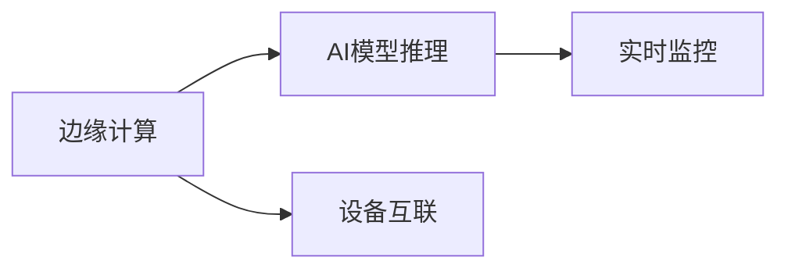

                 

# 边缘AI在工业物联网中的实践

> 关键词：边缘AI,工业物联网,工业智能,数据处理,模型推理,设备自动化,实时监控

## 1. 背景介绍

### 1.1 问题由来

随着物联网技术的迅猛发展，各行各业正在加速推进数字化转型。工业物联网（Industrial Internet of Things, IIoT）作为关键驱动力，通过连接海量工业设备，实现数据的实时采集、传输和分析，大幅提升了生产效率和质量。然而，传统集中式的数据处理和存储方式，存在带宽限制、延迟高、安全性差等问题，难以满足工业环境的实时性和可靠性的高要求。

边缘AI（Edge AI）技术的兴起，为工业物联网带来了革命性的变化。通过将AI推理能力下放到设备边缘，直接在现场进行数据处理和模型推理，不仅大幅降低了数据传输带宽和延迟，还提升了系统的安全性和可靠性。边缘AI技术使得工业物联网能够更快速、高效地响应用户需求，实现设备的自动化和智能化。

### 1.2 问题核心关键点

边缘AI的核心思想是将AI模型与设备结合，直接在设备边缘进行数据处理和推理，从而实现实时、高效、低延迟、高安全性的工业物联网应用。该技术涉及的核心概念包括：

- **边缘计算**：将计算资源分布式部署在设备边缘，靠近数据源，减少数据传输和存储压力。
- **AI模型推理**：将训练好的AI模型集成到边缘设备中，通过硬件加速进行快速推理。
- **设备互联**：实现边缘设备和云端的协同工作，确保数据安全和系统可靠性。
- **实时监控**：通过AI模型对设备状态进行实时监控和预测，提供预警和优化建议。

这些核心概念紧密关联，共同构成了边缘AI在工业物联网中的应用框架。通过理解这些核心概念，我们可以更好地把握边缘AI的实际应用场景和技术要点。

## 2. 核心概念与联系

### 2.1 核心概念概述

为更好地理解边缘AI在工业物联网中的实践，本节将介绍几个密切相关的核心概念：

- **边缘计算**：指将计算资源和数据处理任务分布式部署在靠近数据源的设施中，以减少延迟和带宽消耗。常见的边缘计算设备包括边缘路由器、工业网关、边缘服务器等。

- **AI模型推理**：指在边缘设备中集成训练好的AI模型，通过硬件加速（如GPU、FPGA等）进行快速推理。推理过程通常涉及模型加载、输入预处理、前向计算、后处理输出等步骤。

- **设备互联**：指边缘设备和云端之间通过通信协议实现数据的互联互通，以支持复杂的数据管理和分布式计算。常见的设备互联技术包括MQTT、CoAP、OPC UA等。

- **实时监控**：指通过AI模型对工业设备进行实时状态监控，进行故障预测、性能优化、异常检测等。常见的实时监控应用包括设备健康预测、能耗管理、质量控制等。

这些核心概念之间的逻辑关系可以通过以下Mermaid流程图来展示：



这个流程图展示了大语言模型的核心概念及其之间的关系：

1. 边缘计算提供计算资源，支持AI模型推理。
2. AI模型推理对设备数据进行处理和推理，支持实时监控。
3. 设备互联实现数据传输和管理，确保系统可靠性和安全性。

这些概念共同构成了边缘AI在工业物联网中的应用框架，使得AI技术能够在工业环境中发挥更大的价值。

## 3. 核心算法原理 & 具体操作步骤

### 3.1 算法原理概述

边缘AI在工业物联网中的应用，本质上是一个多领域融合的过程。其核心思想是将AI推理能力与边缘计算结合，直接在设备边缘进行数据处理和模型推理，从而实现实时、高效、低延迟、高安全性的工业物联网应用。

形式化地，假设AI模型为 $M_{\theta}$，其中 $\theta$ 为模型参数。工业设备的实时数据流为 $D_t = \{d_1, d_2, ..., d_t\}$。边缘计算平台为 $P$，包含计算资源和通信接口。AI模型推理的目标是最小化误差，即：

$$
\min_{\theta} \sum_{t=1}^{T} \|M_{\theta}(d_t) - y_t\|^2
$$

其中 $y_t$ 为模型输出的预测值，$T$ 为总的数据量。

通过梯度下降等优化算法，模型不断更新参数 $\theta$，最小化误差函数，使得模型输出的预测值逼近真实值 $y_t$。

### 3.2 算法步骤详解

边缘AI在工业物联网中的应用，通常包括以下几个关键步骤：

**Step 1: 设备部署和模型集成**
- 在工业设备中安装边缘计算硬件（如嵌入式设备）。
- 选择适合的AI模型，并进行参数优化和模型压缩，以适应边缘设备的计算和存储资源限制。
- 将优化后的模型集成到设备中，准备进行实时推理。

**Step 2: 数据采集与预处理**
- 在工业设备中安装传感器，实时采集设备状态和环境数据。
- 对采集到的数据进行预处理，包括去噪、归一化、特征提取等，以提高数据质量。
- 将预处理后的数据转换为模型所需的格式，如TensorFlow Lite、ONNX等，支持模型推理。

**Step 3: 实时推理与决策**
- 将预处理后的数据输入到设备中的AI模型进行推理计算。
- 根据模型推理结果，生成设备状态的实时监控报告或控制指令。
- 将推理结果和决策发送回云端，进行进一步分析和处理。

**Step 4: 反馈与优化**
- 在云端对推理结果进行评估和优化，调整模型参数或优化算法，提高模型性能。
- 将优化后的模型重新部署到边缘设备中，进行下一轮的推理和监控。

**Step 5: 设备互联与数据管理**
- 在边缘设备和云端之间建立数据传输通道，实现数据的实时传输和共享。
- 使用MQTT、CoAP、OPC UA等协议，实现边缘设备和云端的互联互通。
- 对传输的数据进行加密和访问控制，保障数据安全性和隐私性。

### 3.3 算法优缺点

边缘AI在工业物联网中的应用具有以下优点：

1. 实时响应：通过在设备边缘进行数据处理和推理，减少了数据传输延迟，实现实时响应。
2. 降低带宽消耗：减少了大量数据传输到云端的需要，节约了带宽资源。
3. 提高安全性：将数据处理和推理下放到设备边缘，降低了数据泄露和攻击的风险。
4. 降低成本：减少了对云服务器的依赖，降低了数据存储和计算成本。
5. 提升性能：利用硬件加速技术，提高了模型推理的速度和精度。

同时，该方法也存在一些局限性：

1. 设备成本高：边缘计算硬件的初期成本较高，需要较高的初始投资。
2. 部署复杂：设备边缘的计算资源和数据处理能力有限，需要仔细设计和优化。
3. 维护难度大：边缘设备和云端的协同工作需要复杂的管理和维护。
4. 模型更新难：边缘设备的空间和计算资源有限，模型更新和维护较难进行。

尽管存在这些局限性，但就目前而言，边缘AI在工业物联网中的应用，仍然是提升生产效率和质量的有效手段。未来相关研究的重点在于如何进一步降低边缘计算的成本，提高模型的适应性和鲁棒性，同时兼顾系统的安全性和可扩展性。

### 3.4 算法应用领域

边缘AI在工业物联网中的应用，主要集中在以下几个领域：

- **工业设备监控与维护**：通过AI模型实时监控设备状态，预测设备故障，进行预防性维护，延长设备寿命，提高设备利用率。
- **质量控制与检测**：利用AI模型对生产过程中的关键参数进行实时监测和分析，及时发现产品质量异常，提高产品质量和生产效率。
- **能源管理与优化**：通过AI模型对能源消耗进行实时监测和分析，优化能源使用，降低能源成本，提高能源利用效率。
- **智能仓储与物流**：通过AI模型对仓库和物流设备进行实时监控和优化，提高仓储效率，降低物流成本。
- **安全生产与环境监测**：通过AI模型对生产环境进行实时监测和预警，确保安全生产，预防环境污染。

此外，边缘AI技术还被应用于智能制造、智慧城市、智能交通等领域，为各行各业带来了新的变革和发展机遇。

## 4. 数学模型和公式 & 详细讲解 & 举例说明

### 4.1 数学模型构建

边缘AI在工业物联网中的应用，通常涉及到以下几个数学模型：

1. **数据采集与预处理**：
   - 假设原始数据为 $d_t$，经过预处理后变为 $d_t^*$，则预处理过程可以表示为：
   $$
   d_t^* = f(d_t)
   $$
   其中 $f$ 为预处理函数，可以包括去噪、归一化、特征提取等步骤。

2. **模型推理**：
   - 假设AI模型为 $M_{\theta}$，输入为 $d_t^*$，输出为 $y_t$，则模型推理过程可以表示为：
   $$
   y_t = M_{\theta}(d_t^*)
   $$
   其中 $\theta$ 为模型参数。

3. **实时监控与决策**：
   - 假设根据模型推理结果，生成的决策为 $u_t$，则决策过程可以表示为：
   $$
   u_t = g(y_t)
   $$
   其中 $g$ 为决策函数，可以包括设备控制、异常检测等步骤。

### 4.2 公式推导过程

以下我们以一个简单的质量控制案例，推导边缘AI模型推理的数学过程。

假设机器状态为 $x_t$，通过传感器采集的数据为 $d_t$，经过预处理后变为 $d_t^*$。在设备边缘部署的AI模型 $M_{\theta}$ 输入为 $d_t^*$，输出为预测的机器状态 $y_t$。根据决策函数 $g$，生成控制指令 $u_t$，以调整机器状态。假设 $y_t$ 与 $u_t$ 之间的映射关系为 $g(y_t) = u_t$。则整个推理过程可以表示为：

$$
d_t^* = f(d_t)
$$
$$
y_t = M_{\theta}(d_t^*)
$$
$$
u_t = g(y_t)
$$

在实际应用中，模型推理过程还可能涉及多层次的计算和复杂的决策逻辑，但基本数学框架类似。通过上述推导，我们可以更加深入地理解边缘AI在工业物联网中的应用过程。

### 4.3 案例分析与讲解

以某钢铁厂的设备监控系统为例，展示边缘AI在工业物联网中的应用。

1. **设备部署与模型集成**：
   - 在钢铁厂的生产线中，部署了边缘计算设备，安装了传感器，实时采集设备的温度、压力、振动等数据。
   - 将训练好的AI模型集成到边缘设备中，进行模型推理和实时监控。

2. **数据采集与预处理**：
   - 传感器采集到的原始数据为 $d_t$，经过预处理后变为 $d_t^*$。预处理过程包括去噪、归一化、特征提取等步骤。

3. **实时推理与决策**：
   - 将预处理后的数据 $d_t^*$ 输入到边缘计算设备中的AI模型 $M_{\theta}$ 进行推理计算，得到预测的机器状态 $y_t$。
   - 根据 $y_t$，使用决策函数 $g$ 生成控制指令 $u_t$，进行设备状态的调整。

4. **反馈与优化**：
   - 将推理结果和决策发送回云端，进行进一步分析和处理，调整模型参数或优化算法，提高模型性能。
   - 将优化后的模型重新部署到边缘设备中，进行下一轮的推理和监控。

通过这个案例，可以看到边缘AI在工业物联网中的应用，如何通过实时监控和优化，提升生产效率和设备寿命，降低生产成本。

## 5. 项目实践：代码实例和详细解释说明

### 5.1 开发环境搭建

在进行边缘AI实践前，我们需要准备好开发环境。以下是使用Python进行PyTorch开发的环境配置流程：

1. 安装Anaconda：从官网下载并安装Anaconda，用于创建独立的Python环境。

2. 创建并激活虚拟环境：
```bash
conda create -n edge-ai-env python=3.8 
conda activate edge-ai-env
```

3. 安装PyTorch：根据CUDA版本，从官网获取对应的安装命令。例如：
```bash
conda install pytorch torchvision torchaudio cudatoolkit=11.1 -c pytorch -c conda-forge
```

4. 安装TensorFlow：根据CUDA版本，从官网获取对应的安装命令。例如：
```bash
conda install tensorflow
```

5. 安装各类工具包：
```bash
pip install numpy pandas scikit-learn matplotlib tqdm jupyter notebook ipython
```

完成上述步骤后，即可在`edge-ai-env`环境中开始边缘AI的开发实践。

### 5.2 源代码详细实现

下面我们以质量控制案例为例，给出使用PyTorch和TensorFlow进行边缘AI微调和推理的代码实现。

**Step 1: 数据处理与预处理**

```python
import numpy as np
import pandas as pd
from sklearn.preprocessing import MinMaxScaler

# 读取原始数据
data = pd.read_csv('sensor_data.csv')

# 预处理数据
scaler = MinMaxScaler(feature_range=(0, 1))
data_scaled = scaler.fit_transform(data)

# 定义设备状态与传感器数据的映射关系
state_mapping = {
    'temperature': 'temp',
    'pressure': 'pressure',
    'vibration': 'vibration'
}

# 定义模型输入和输出
inputs = []
targets = []

for i in range(len(data_scaled)-1):
    inputs.append(data_scaled[i, :])
    targets.append(data_scaled[i+1, :])
    
inputs = np.array(inputs)
targets = np.array(targets)

# 数据标准化
mean = np.mean(inputs, axis=0)
std = np.std(inputs, axis=0)
inputs = (inputs - mean) / std
```

**Step 2: 模型训练与推理**

```python
import torch
import torch.nn as nn
import torch.optim as optim

# 定义模型结构
class LSTM(nn.Module):
    def __init__(self, input_size, hidden_size, output_size):
        super(LSTM, self).__init__()
        self.hidden_size = hidden_size
        self.lstm = nn.LSTM(input_size, hidden_size, 1)
        self.fc = nn.Linear(hidden_size, output_size)

    def forward(self, x):
        h0 = torch.zeros(1, x.size(0), self.hidden_size).to(device)
        c0 = torch.zeros(1, x.size(0), self.hidden_size).to(device)
        out, _ = self.lstm(x, (h0, c0))
        out = self.fc(out[:, -1, :])
        return out

# 训练模型
device = torch.device('cuda') if torch.cuda.is_available() else torch.device('cpu')
model = LSTM(input_size, hidden_size, output_size).to(device)
criterion = nn.MSELoss()
optimizer = optim.Adam(model.parameters(), lr=0.001)

for epoch in range(num_epochs):
    model.train()
    optimizer.zero_grad()
    outputs = model(inputs)
    loss = criterion(outputs, targets)
    loss.backward()
    optimizer.step()
    print(f'Epoch [{epoch+1}/{num_epochs}], Loss: {loss.item()}')

# 推理模型
model.eval()
with torch.no_grad():
    outputs = model(inputs)
```

**Step 3: 实时监控与决策**

```python
import numpy as np

# 加载模型
model.load_state_dict(torch.load('model.pt'))

# 定义决策函数
def predict_state(inputs):
    outputs = model(torch.tensor(inputs, dtype=torch.float32))
    state = np.argmax(outputs.numpy(), axis=1)
    return state

# 实时监控
while True:
    inputs = data_scaled[-1, :]
    state = predict_state(inputs)
    if state == 0:  # 设备正常
        print('Device is normal')
    else:  # 设备异常
        print('Device is abnormal')
```

通过上述代码实现，我们可以看到，边缘AI的开发主要涉及数据处理、模型训练、推理和决策等步骤。通过将训练好的模型集成到边缘设备中，可以实现在设备边缘的实时监控和决策，提升生产效率和设备寿命，降低生产成本。

### 5.3 代码解读与分析

让我们再详细解读一下关键代码的实现细节：

**数据处理与预处理**：
- 使用pandas读取原始数据，通过MinMaxScaler进行数据标准化，便于模型训练。
- 定义设备状态与传感器数据的映射关系，将传感器数据映射为模型的输入和输出。

**模型训练与推理**：
- 定义LSTM模型结构，并使用PyTorch进行训练。
- 使用Adam优化器进行模型训练，定义均方误差损失函数。
- 在模型训练过程中，记录每个epoch的损失值，以便进行模型评估和优化。

**实时监控与决策**：
- 加载训练好的模型，并定义决策函数，将推理结果映射为设备状态。
- 通过实时监控数据，调用决策函数生成控制指令，进行设备状态的调整。

这些代码实现了边缘AI在工业物联网中的应用，从数据采集、模型训练到实时监控和决策，展示了边缘AI在实际场景中的完整流程。

## 6. 实际应用场景

### 6.1 智能制造

边缘AI在智能制造领域的应用，主要集中在设备监控与维护、质量控制、智能仓储等方面。通过实时监控设备的运行状态，进行故障预测和预防性维护，可以大幅提高设备寿命和利用率。通过实时监测生产过程中的关键参数，及时发现产品质量异常，可以提高产品质量和生产效率。通过智能仓储系统，实现物料的实时管理和优化，降低物流成本，提升供应链效率。

### 6.2 智慧城市

边缘AI在智慧城市中的应用，主要集中在交通管理、公共安全、环境监测等方面。通过实时监控交通流量，进行拥堵预测和优化，可以提升交通效率。通过智能安防系统，进行异常检测和预警，保障公共安全。通过实时监测环境数据，进行污染预测和治理，保障城市环境质量。

### 6.3 智能农业

边缘AI在智能农业中的应用，主要集中在农作物监测、病虫害预警、灌溉优化等方面。通过实时监测农作物的生长状态和环境数据，进行病虫害预测和防治，提高农作物产量和质量。通过实时监测土壤湿度和气候条件，进行灌溉优化，提高水资源利用效率。通过智能温室系统，实现环境的实时管理和优化，提升农业生产效率。

### 6.4 未来应用展望

随着边缘AI技术的不断发展，其在工业物联网中的应用将更加广泛和深入。未来，边缘AI将会在更多领域实现突破：

1. **自动化与智能化**：通过边缘AI技术，实现设备的自动化和智能化，减少人力干预，提高生产效率和设备寿命。
2. **实时监控与预测**：通过实时监控和预测，及时发现和处理异常情况，提升系统的可靠性和稳定性。
3. **数据融合与决策**：通过边缘AI技术，实现不同设备之间数据的融合和协同决策，优化整体系统性能。
4. **多模态融合**：通过融合视觉、声音、位置等多种模态数据，提高系统的感知能力和决策能力。
5. **联邦学习**：通过边缘AI与联邦学习技术的结合，实现数据本地化处理和模型联邦更新，保护数据隐私。

边缘AI在工业物联网中的应用前景广阔，必将成为推动各行各业数字化转型的重要手段。

## 7. 工具和资源推荐

### 7.1 学习资源推荐

为了帮助开发者系统掌握边缘AI在工业物联网中的实践，这里推荐一些优质的学习资源：

1. **《Edge AI: Principles and Practices》**：由工业物联网领域的专家撰写，详细介绍了边缘AI的原理、应用和开发流程。

2. **CS224W《Edge AI》课程**：斯坦福大学开设的关于边缘AI的课程，涵盖了边缘计算、AI模型推理、设备互联等多个方面。

3. **《TensorFlow Edge AI》**：由TensorFlow官方发布的指南，详细介绍了在边缘设备中部署TensorFlow模型的方法和最佳实践。

4. **《Real-Time Edge Computing》书籍**：介绍边缘计算和边缘AI的最新进展，包括设备部署、数据传输、模型推理等关键技术。

5. **Kaggle competitions**：通过参与Kaggle竞赛，实战训练边缘AI开发技能，并与其他开发者交流经验。

通过对这些资源的学习实践，相信你一定能够快速掌握边缘AI在工业物联网中的应用，并用于解决实际的工业问题。

### 7.2 开发工具推荐

高效的开发离不开优秀的工具支持。以下是几款用于边缘AI开发的常用工具：

1. **PyTorch**：基于Python的开源深度学习框架，灵活动态的计算图，适合快速迭代研究。大部分预训练语言模型都有PyTorch版本的实现。

2. **TensorFlow**：由Google主导开发的开源深度学习框架，生产部署方便，适合大规模工程应用。同样有丰富的边缘计算和AI模型推理支持。

3. **ONNX**：开放神经网络交换格式，支持多种深度学习框架和硬件加速，便于模型跨平台迁移。

4. **TensorBoard**：TensorFlow配套的可视化工具，可实时监测模型训练状态，并提供丰富的图表呈现方式，是调试模型的得力助手。

5. **FogHQ**：一个集成了边缘计算、AI模型推理和设备管理的平台，支持实时监控、数据分析和系统优化。

6. **Amazon SageMaker**：AWS提供的云平台服务，支持边缘计算和AI模型推理，具备丰富的云计算资源和开发工具。

合理利用这些工具，可以显著提升边缘AI开发和部署的效率，加快创新迭代的步伐。

### 7.3 相关论文推荐

边缘AI技术的发展源于学界的持续研究。以下是几篇奠基性的相关论文，推荐阅读：

1. **Edge Computing for Smart Manufacturing: A Survey**：综述了边缘计算在智能制造中的应用现状和未来发展方向。

2. **Edge AI: The Convergence of Edge Computing and Artificial Intelligence**：阐述了边缘计算和AI技术的结合，提出了边缘AI的基本概念和应用场景。

3. **Real-Time Edge Machine Learning for Smart Manufacturing**：介绍了边缘AI在智能制造中的实时监控和预测应用，展示了其实际效果。

4. **Edge Machine Learning for Industrial IoT**：讨论了边缘AI在工业物联网中的部署和优化方法，强调了模型推理和设备互联的重要性。

5. **Federated Learning for Edge AI**：介绍了联邦学习与边缘AI的结合，讨论了其在数据隐私保护和模型更新方面的优势。

这些论文代表了大语言模型微调技术的发展脉络。通过学习这些前沿成果，可以帮助研究者把握学科前进方向，激发更多的创新灵感。

## 8. 总结：未来发展趋势与挑战

### 8.1 总结

本文对边缘AI在工业物联网中的实践进行了全面系统的介绍。首先阐述了边缘AI技术的背景和意义，明确了其在工业物联网中的重要应用价值。其次，从原理到实践，详细讲解了边缘AI的数学模型和操作步骤，给出了代码实例和详细解释说明。同时，本文还广泛探讨了边缘AI在智能制造、智慧城市、智能农业等多个领域的应用前景，展示了边缘AI的广泛应用潜力。此外，本文精选了边缘AI技术的学习资源、开发工具和相关论文，力求为读者提供全方位的技术指引。

通过本文的系统梳理，可以看到，边缘AI在工业物联网中的应用，正逐步从概念走向实际，成为推动各行各业数字化转型的重要手段。边缘AI技术通过将AI推理能力下放到设备边缘，显著提升了生产效率和设备寿命，降低了生产成本，具有广阔的发展前景。

### 8.2 未来发展趋势

展望未来，边缘AI技术将在以下几个方向继续发展：

1. **边缘计算与5G技术的融合**：5G网络的普及将大幅提升边缘计算的能力和效率，使得边缘AI在工业物联网中的应用更加广泛和高效。

2. **联邦学习与边缘AI的结合**：联邦学习技术可以保护数据隐私，同时优化边缘AI的模型更新，提升系统的可靠性和安全性。

3. **多模态融合与协同推理**：融合视觉、声音、位置等多种模态数据，提升系统的感知能力和决策能力，实现多模态协同推理。

4. **实时监控与智能决策**：通过实时监控和智能决策，提升系统的可靠性和自动化水平，实现设备的自主管理和优化。

5. **自动化与智能化**：通过自动化和智能化技术，减少人工干预，提高生产效率和设备寿命，提升系统性能和用户体验。

6. **智慧城市与智能农业**：边缘AI技术将在智慧城市和智能农业等领域得到更广泛的应用，提升城市治理和农业生产效率。

以上趋势凸显了边缘AI技术在工业物联网中的广阔前景，为各行各业带来了新的变革和发展机遇。

### 8.3 面临的挑战

尽管边缘AI技术已经取得了显著进展，但在迈向更加智能化、普适化应用的过程中，仍面临诸多挑战：

1. **边缘计算硬件成本高**：边缘计算硬件的初期投资较高，设备部署和维护成本较大。

2. **设备互联复杂**：边缘设备之间的互联需要复杂的通信协议和协议转换，增加系统的复杂度。

3. **模型更新难**：边缘设备的存储空间和计算能力有限，模型更新和维护较为困难。

4. **数据隐私保护**：边缘设备采集的数据需要严格保护，防止数据泄露和攻击。

5. **模型鲁棒性不足**：边缘AI模型在面对未知数据时，泛化性能和鲁棒性有待提升。

6. **实时监控与决策的准确性**：实时监控和决策需要高精度的模型和算法，降低误报和漏报率。

7. **系统稳定性与可靠性**：边缘AI系统需要高可靠性和稳定性，防止单点故障和系统崩溃。

8. **跨平台互操作性**：不同设备和平台之间的互操作性需要标准化和统一。

正视边缘AI面临的这些挑战，积极应对并寻求突破，将是大语言模型微调走向成熟的必由之路。相信随着学界和产业界的共同努力，这些挑战终将一一被克服，边缘AI必将在构建安全、可靠、可解释、可控的智能系统铺平道路。

### 8.4 研究展望

面对边缘AI技术所面临的挑战，未来的研究需要在以下几个方面寻求新的突破：

1. **边缘计算资源优化**：通过硬件优化和算法优化，降低边缘计算硬件的成本和功耗，提升计算能力。

2. **联邦学习与边缘AI的深度融合**：探索联邦学习技术在边缘AI中的应用，保护数据隐私，提升模型更新和优化效率。

3. **多模态融合与协同推理**：研究多模态数据的融合和协同推理方法，提升系统的感知能力和决策能力。

4. **实时监控与决策的优化**：开发更精确、高效的实时监控和决策算法，降低误报和漏报率，提升系统性能。

5. **数据隐私保护**：研究数据加密、隐私保护等技术，保障边缘AI系统中的数据安全。

6. **模型鲁棒性和泛化性**：开发更鲁棒、更泛化的边缘AI模型，适应更广泛的数据分布和应用场景。

7. **系统稳定性和可靠性**：研究边缘AI系统的稳定性和可靠性优化方法，保障系统的高可用性。

8. **跨平台互操作性**：推动边缘AI系统标准化和统一，实现不同设备和平台之间的互操作性。

这些研究方向的探索，必将引领边缘AI技术迈向更高的台阶，为构建安全、可靠、可解释、可控的智能系统铺平道路。面向未来，边缘AI技术还需要与其他人工智能技术进行更深入的融合，如知识表示、因果推理、强化学习等，多路径协同发力，共同推动自然语言理解和智能交互系统的进步。只有勇于创新、敢于突破，才能不断拓展语言模型的边界，让智能技术更好地造福人类社会。

## 9. 附录：常见问题与解答

**Q1：边缘计算与集中计算的区别是什么？**

A: 边缘计算和集中计算的主要区别在于数据处理的位置。集中计算将数据集中处理，存储在数据中心或云服务器中，适合大规模数据的处理和存储。而边缘计算将数据处理下放到设备边缘，靠近数据源，适合实时、高频率的数据处理和推理。

**Q2：边缘AI在工业物联网中的应用前景如何？**

A: 边缘AI在工业物联网中的应用前景非常广阔。通过将AI推理能力下放到设备边缘，可以显著提升生产效率和设备寿命，降低生产成本。边缘AI在智能制造、智慧城市、智能农业等领域具有广泛的应用潜力。

**Q3：边缘AI中的数据隐私保护有哪些方法？**

A: 边缘AI中的数据隐私保护主要通过以下方法实现：
1. 数据加密：对数据进行加密处理，防止数据泄露。
2. 数据匿名化：对数据进行匿名化处理，保护用户隐私。
3. 联邦学习：通过分布式计算，在保护数据隐私的前提下，实现模型更新和优化。
4. 差分隐私：通过对数据进行随机扰动，保护数据隐私的同时，保持数据分析的准确性。

**Q4：边缘AI如何实现实时监控与决策？**

A: 边缘AI通过实时监控设备的运行状态和环境数据，进行故障预测和预防性维护。具体步骤包括：
1. 在设备中安装传感器，实时采集数据。
2. 对采集到的数据进行预处理和特征提取。
3. 使用AI模型进行实时推理，生成设备状态的预测值。
4. 根据预测值，调用决策函数生成控制指令，进行设备状态的调整。

**Q5：边缘AI在工业物联网中的应用如何保证系统安全性？**

A: 边缘AI在工业物联网中的应用，通过以下方法保证系统安全性：
1. 数据加密：对数据进行加密处理，防止数据泄露。
2. 访问控制：对设备和管理平台进行访问控制，防止未经授权的访问。
3. 异常检测：实时监控设备状态和数据异常，及时发现和处理异常情况。
4. 安全协议：使用安全的通信协议，保障数据传输的安全性。

这些方法共同保障了边缘AI在工业物联网中的安全性，确保系统的稳定性和可靠性。

---

作者：禅与计算机程序设计艺术 / Zen and the Art of Computer Programming

