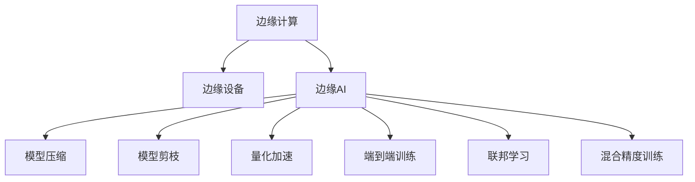

                 

## 1. 背景介绍

### 1.1 问题由来
随着物联网设备的普及和智能化程度的提升，边缘计算成为新一代计算范式。在传统的云中心化计算中，数据存储和处理依赖于互联网和数据中心，计算任务复杂度大、延迟高、隐私风险大。而在边缘设备上，数据存储和处理更加高效、安全，可以在本地完成数据分析和决策，从而满足对实时性、隐私性和可靠性的高要求。

边缘AI技术是在边缘设备上部署和运行机器学习模型的重要手段。通过在设备端直接处理数据，边缘AI能显著降低数据传输带宽和延迟，保护用户隐私，增强系统安全性。同时，由于边缘设备的算力资源有限，边缘AI还需考虑模型的轻量化、高效性和实时性，确保模型在低功耗、低延迟条件下正常工作。

### 1.2 问题核心关键点
边缘AI的核心在于将机器学习模型部署到计算资源有限的边缘设备上，实现本地数据分析和决策。然而，由于模型参数量较大、计算复杂度高，边缘设备的资源限制成为其推广的瓶颈。目前主流的做法包括模型压缩、模型剪枝、量化加速等方法，以降低模型尺寸和计算复杂度。

边缘AI的应用场景包括智能家居、工业物联网、自动驾驶、可穿戴设备等。在这些场景下，设备端计算不仅需要具备高效的模型推理能力，还需要满足低功耗、低延迟等性能要求。

### 1.3 问题研究意义
边缘AI技术具有以下重要意义：

1. **提升计算效率**：通过将数据存储和计算任务转移到边缘设备，减少数据传输时间和带宽消耗，提高整体系统的响应速度。
2. **保护用户隐私**：在本地完成数据分析和决策，避免了数据在传输过程中的泄露风险。
3. **增强系统鲁棒性**：本地数据处理可以减少网络故障对系统的影响，提升系统可用性和可靠性。
4. **优化成本投入**：减少数据中心运营成本，降低数据存储和传输费用，提高经济效益。
5. **推动技术创新**：边缘AI技术的不断发展将推动计算架构的演进，加速物联网技术在各领域的渗透。

## 2. 核心概念与联系

### 2.1 核心概念概述

为更好地理解边缘AI的原理和应用，本节将介绍几个核心概念：

- **边缘计算**：指在数据源附近或靠近数据源的地方进行数据的存储和计算，以减少数据传输的延迟和带宽消耗。
- **边缘设备**：指计算资源有限的设备，如智能手机、物联网传感器、边缘服务器等。
- **边缘AI**：指在边缘设备上运行机器学习模型的技术，通过本地数据分析和决策，实现快速响应和高隐私保护。
- **模型压缩**：指减少模型参数量，降低模型复杂度，以适应边缘设备的资源限制。
- **模型剪枝**：指去除模型中冗余或不重要的参数和层，优化模型结构，减小模型体积。
- **量化加速**：指将模型参数从浮点表示转换为定点表示，减少计算精度损失的同时降低计算复杂度。
- **端到端训练**：指在边缘设备上直接进行模型训练，避免数据传输，优化训练速度。
- **联邦学习**：指多个设备共同参与模型训练，只共享模型参数而非数据，保护用户隐私。
- **混合精度训练**：指在训练过程中，使用不同的精度数据类型，如混合使用32位和16位浮点数，以提高计算效率。

这些核心概念之间的逻辑关系可以通过以下Mermaid流程图来展示：



这个流程图展示了边缘AI的核心概念及其之间的关系：

1. 边缘计算通过在数据源附近进行存储和计算，为边缘AI提供了基础。
2. 边缘设备是边缘AI的运行平台，具备有限的计算资源。
3. 边缘AI技术通过模型压缩、剪枝、量化加速等方法，适应边缘设备的资源限制。
4. 端到端训练和联邦学习技术进一步优化模型训练效率和隐私保护。
5. 混合精度训练通过使用不同精度数据类型，提高计算效率。

## 3. 核心算法原理 & 具体操作步骤

### 3.1 算法原理概述

边缘AI的原理是基于在边缘设备上直接运行机器学习模型，实现本地数据处理和决策。其核心在于选择合适的算法和模型，适应边缘设备的计算和存储资源限制，同时满足应用场景的实时性和隐私保护需求。

以图像识别为例，假设有一张图片需要识别，系统将其传输到边缘设备上。边缘设备首先将图片输入到预训练模型中，得到特征表示。然后，根据任务需求，在边缘设备上运行推理模型，得到最终的识别结果。

### 3.2 算法步骤详解

边缘AI的一般步骤包括以下几个关键环节：

**Step 1: 选择合适的模型**
- 根据应用场景，选择适合边缘设备计算资源的模型。例如，对于实时性要求较高的场景，可以选择轻量级的模型，如MobileNet等。

**Step 2: 模型压缩和剪枝**
- 使用模型压缩和剪枝技术，减小模型参数量和计算复杂度，以适应边缘设备的资源限制。
- 常见的方法包括权重剪枝、通道剪枝、张量核化等，可以从模型结构上优化模型。

**Step 3: 量化加速**
- 将模型参数从浮点表示转换为定点表示，减少计算精度损失的同时降低计算复杂度。例如，可以使用整型或固定点类型代替浮点型参数，或者使用低精度浮点数代替高精度浮点数。

**Step 4: 端到端训练**
- 在边缘设备上直接进行模型训练，避免数据传输，优化训练速度。可以使用分布式训练框架，将多个边缘设备上的数据汇总，进行联合训练。

**Step 5: 联邦学习**
- 多个边缘设备共同参与模型训练，只共享模型参数而非数据，保护用户隐私。可以使用联邦学习框架，在多个设备上同步训练，并汇总模型参数。

**Step 6: 模型推理**
- 在边缘设备上运行模型推理，得到实时输出。可以使用TensorFlow Lite、PyTorch Mobile等工具，将训练好的模型部署到边缘设备上，进行高效的推理计算。

**Step 7: 模型优化**
- 根据实际应用场景，进行模型优化和调整。例如，增加数据增强技术，提高模型鲁棒性；引入对抗训练，增强模型鲁棒性。

### 3.3 算法优缺点

边缘AI技术的优点包括：

1. **提升计算效率**：边缘设备上的本地计算和存储，减少了数据传输的延迟和带宽消耗，提高了计算速度。
2. **保护用户隐私**：在本地完成数据分析和决策，避免了数据在传输过程中的泄露风险。
3. **增强系统鲁棒性**：本地数据处理可以减少网络故障对系统的影响，提升系统可用性和可靠性。
4. **优化成本投入**：减少数据中心运营成本，降低数据存储和传输费用，提高经济效益。

然而，边缘AI技术也存在一些局限性：

1. **计算资源有限**：边缘设备的计算资源有限，模型压缩和剪枝可能无法完全适应复杂的计算需求。
2. **存储容量不足**：边缘设备的存储容量有限，模型参数量较大的情况下，难以存储完整的模型。
3. **模型精度损失**：量化加速和模型压缩可能导致模型精度损失，影响推理结果的准确性。
4. **数据分布不均**：不同边缘设备的数据分布可能存在差异，导致模型泛化能力不足。
5. **网络通信延迟**：边缘设备之间的通信延迟较大，影响联合训练和联邦学习的效率。

### 3.4 算法应用领域

边缘AI技术已经在多个领域得到应用，例如：

- **智能家居**：在智能音箱、智能门锁等设备上部署图像识别、语音识别模型，实现智能家居控制。
- **工业物联网**：在工业设备上部署传感器数据处理模型，实时监测设备运行状态，提高生产效率。
- **自动驾驶**：在车载设备上部署环境感知和决策模型，实现自动驾驶功能。
- **可穿戴设备**：在智能手表、健身设备上部署健康监测模型，实时分析用户健康数据。
- **智慧城市**：在城市监控设备上部署视频分析模型，实时监测城市安全。

## 4. 数学模型和公式 & 详细讲解 & 举例说明

### 4.1 数学模型构建

边缘AI中的数学模型构建主要涉及以下几个方面：

- **模型选择**：根据应用场景和设备资源，选择合适的预训练模型，如MobileNet、SqueezeNet等。
- **量化和压缩**：将模型参数从浮点型转换为定点型，减少计算复杂度，可以使用量化公式和压缩算法。
- **端到端训练**：在边缘设备上直接进行模型训练，可以使用分布式训练框架，如TensorFlow联邦学习框架。
- **联邦学习**：多个边缘设备共同参与模型训练，只共享模型参数而非数据，可以使用联邦学习公式和算法。
- **模型推理**：在边缘设备上运行模型推理，可以使用推理公式和工具，如TensorFlow Lite。

### 4.2 公式推导过程

以图像识别为例，下面给出常见的数学模型和公式的推导过程：

1. **卷积神经网络模型**：假设有一张大小为$h \times w$的图片，使用卷积神经网络进行特征提取，可以得到一组大小为$m \times n$的特征图。卷积操作公式如下：

$$
C(x) = \sum_{i=1}^{n} W_i * X_i + b
$$

其中$C(x)$表示特征图，$W_i$表示卷积核，$X_i$表示输入，$b$表示偏置项。

2. **量化加速**：假设将浮点数参数$x$量化为$k$位定点数$x'$，则量化公式为：

$$
x' = \text{round}(k \times \frac{x}{2^k})
$$

其中$\text{round}$表示四舍五入取整，$k$表示量化位数。

3. **模型压缩**：假设对卷积层的参数进行剪枝，保留$k$个最重要的参数，则压缩公式为：

$$
C'(x) = \sum_{i=1}^{k} W'_i * X_i + b'
$$

其中$C'(x)$表示压缩后的特征图，$W'_i$表示保留的卷积核，$X_i$表示输入，$b'$表示新的偏置项。

4. **端到端训练**：假设在边缘设备上使用分布式训练框架，对$M$个边缘设备上的数据$D_1, D_2, \ldots, D_M$进行联合训练，则训练公式为：

$$
\min_{\theta} \sum_{i=1}^{M} \frac{1}{|D_i|} \sum_{x \in D_i} \ell(M(x), y)
$$

其中$\theta$表示模型参数，$\ell$表示损失函数，$y$表示真实标签。

5. **联邦学习**：假设在$N$个边缘设备上共同参与训练，使用联邦学习算法，则训练公式为：

$$
\theta \leftarrow \theta - \frac{\eta}{N} \sum_{i=1}^{N} \nabla_{\theta} \ell(M(x), y)
$$

其中$\eta$表示学习率，$\nabla_{\theta} \ell(M(x), y)$表示模型在边缘设备$i$上的梯度。

6. **模型推理**：假设在边缘设备上运行推理模型，对输入$x$进行推理，则推理公式为：

$$
y' = M(x')
$$

其中$y'$表示推理结果，$M$表示推理模型，$x'$表示量化后的输入。

### 4.3 案例分析与讲解

以边缘设备上的图像识别为例，下面给出具体案例的分析和讲解：

**案例1: 基于MobileNet的图像识别**

假设在智能音箱上部署图像识别模型，使用MobileNet作为预训练模型，并进行模型压缩和量化加速。具体步骤如下：

1. **选择合适的预训练模型**：使用MobileNet作为预训练模型，其参数量较小，计算复杂度较低，适合边缘设备运行。

2. **模型压缩和剪枝**：使用通道剪枝技术，去除部分卷积层和全连接层，减小模型参数量。同时使用权重剪枝技术，去除冗余参数，优化模型结构。

3. **量化加速**：将MobileNet的参数从浮点型转换为整型，减少计算复杂度。使用量化加速算法，提高推理效率。

4. **端到端训练**：在智能音箱上直接进行模型训练，使用分布式训练框架，将多个边缘设备上的数据汇总，进行联合训练。

5. **联邦学习**：多个智能音箱共同参与模型训练，只共享模型参数而非数据，保护用户隐私。

6. **模型推理**：在智能音箱上运行推理模型，对输入图片进行推理，得到实时输出。使用TensorFlow Lite工具，将训练好的模型部署到智能音箱上，进行高效的推理计算。

**案例2: 基于SqueezeNet的实时视频分析**

假设在城市监控设备上部署实时视频分析模型，使用SqueezeNet作为预训练模型，并进行模型压缩和联邦学习。具体步骤如下：

1. **选择合适的预训练模型**：使用SqueezeNet作为预训练模型，其参数量较小，计算复杂度较低，适合边缘设备运行。

2. **模型压缩和剪枝**：使用权重剪枝技术，去除冗余参数，优化模型结构。同时使用张量核化技术，减少计算复杂度。

3. **端到端训练**：在城市监控设备上直接进行模型训练，使用分布式训练框架，将多个边缘设备上的数据汇总，进行联合训练。

4. **联邦学习**：多个城市监控设备共同参与模型训练，只共享模型参数而非数据，保护用户隐私。

5. **模型推理**：在城市监控设备上运行推理模型，对输入视频进行实时分析，得到实时输出。使用TensorFlow Lite工具，将训练好的模型部署到城市监控设备上，进行高效的推理计算。

## 5. 项目实践：代码实例和详细解释说明

### 5.1 开发环境搭建

在进行边缘AI项目实践前，我们需要准备好开发环境。以下是使用Python进行TensorFlow进行边缘AI开发的环境配置流程：

1. 安装Anaconda：从官网下载并安装Anaconda，用于创建独立的Python环境。

2. 创建并激活虚拟环境：
```bash
conda create -n tf-env python=3.8 
conda activate tf-env
```

3. 安装TensorFlow：根据CUDA版本，从官网获取对应的安装命令。例如：
```bash
conda install tensorflow -c pytorch -c conda-forge
```

4. 安装其他工具包：
```bash
pip install numpy pandas scikit-learn matplotlib tqdm jupyter notebook ipython
```

完成上述步骤后，即可在`tf-env`环境中开始边缘AI实践。

### 5.2 源代码详细实现

下面我们以图像识别任务为例，给出使用TensorFlow Lite进行边缘AI微调的PyTorch代码实现。

首先，定义图像识别任务的数据处理函数：

```python
import tensorflow as tf
import numpy as np
import cv2

def preprocess_image(image):
    image = cv2.cvtColor(image, cv2.COLOR_BGR2RGB)
    image = cv2.resize(image, (224, 224))
    image = image / 255.0
    image = np.expand_dims(image, axis=0)
    return image

# 加载模型
model = tf.keras.applications.MobileNetV2(weights='imagenet', include_top=False, input_shape=(224, 224, 3))
model.summary()

# 加载标签
labels = tf.keras.applications.imagenet_utils.decode_predictions(tf.keras.applications.imagenet_utils.get_top_predictions(model.predict(preprocess_image(cv2.imread('image.jpg')))))[0]

# 输出标签
print(labels)
```

然后，定义边缘设备上的推理函数：

```python
import tensorflow.lite as tflite
import tensorflow as tf

def load_model(model_path):
    interpreter = tflite.Interpreter(model_path)
    interpreter.allocate_tensors()
    return interpreter

def predict(interpreter, image):
    interpreter.set_tensor(interpreter.get_input_details()[0]['index'], image)
    interpreter.invoke()
    predictions = interpreter.get_tensor(interpreter.get_output_details()[0]['index'])
    return predictions

# 加载模型
model_path = 'mobilenet_v2.tflite'
interpreter = load_model(model_path)

# 加载图像
image = cv2.imread('image.jpg')

# 进行推理
predictions = predict(interpreter, preprocess_image(image))

# 输出结果
for i, (label, prob) in enumerate(predictions):
    print('%s: %.2f' % (labels[i][1], prob))
```

### 5.3 代码解读与分析

让我们再详细解读一下关键代码的实现细节：

**preprocess_image函数**：
- 将图像转换为RGB格式，并进行缩放、归一化等预处理操作。

**load_model函数**：
- 加载预训练的MobileNet模型，并返回TFLite解释器。

**predict函数**：
- 将预处理后的图像输入到TFLite解释器，进行推理计算，并返回预测结果。

**main函数**：
- 加载预训练模型，并进行图像预处理。
- 使用TFLite解释器进行推理，输出预测结果。

可以看到，使用TensorFlow Lite进行边缘AI推理，代码实现相对简洁高效。开发者可以根据实际需求，使用不同的模型和工具进行优化和适配。

当然，工业级的系统实现还需考虑更多因素，如模型裁剪、推理加速、边缘设备通信等。但核心的边缘AI范式基本与此类似。

## 6. 实际应用场景

### 6.1 智能家居

在智能家居领域，边缘AI技术可以实现多种功能，如智能音箱、智能门锁、智能灯泡等。以智能音箱为例，边缘AI技术可以用于语音识别、自然语言理解和智能控制等方面。例如，用户可以通过语音指令控制家中的各种设备，实现语音助手功能。

**应用场景**：
- 语音识别：边缘AI技术可以在智能音箱上部署语音识别模型，实时识别用户的语音指令，进行智能控制。
- 自然语言理解：边缘AI技术可以将用户的语音指令转换为文本，并进行意图分析和实体抽取，实现更精确的智能控制。
- 智能控制：边缘AI技术可以根据用户指令，控制家中的各种设备，如开关灯光、调节温度等。

**技术实现**：
- 在智能音箱上部署语音识别模型，进行实时语音识别。
- 使用自然语言处理技术，对语音指令进行理解和解析。
- 根据解析结果，控制家中的各种设备，实现智能控制。

### 6.2 工业物联网

在工业物联网领域，边缘AI技术可以实现多种功能，如设备监测、故障诊断、质量控制等。以设备监测为例，边缘AI技术可以实时监测设备运行状态，及时发现和处理异常情况，提高设备可靠性和生产效率。

**应用场景**：
- 设备监测：边缘AI技术可以实时监测设备的运行状态，如温度、压力、振动等参数，进行实时分析和预警。
- 故障诊断：边缘AI技术可以分析设备异常数据，进行故障诊断和预测，及时进行维护。
- 质量控制：边缘AI技术可以实时监测生产过程中的数据，进行质量控制和反馈，提升产品质量。

**技术实现**：
- 在工业设备上部署传感器数据处理模型，实时监测设备运行状态。
- 使用机器学习算法，分析设备异常数据，进行故障诊断和预测。
- 根据诊断结果，进行设备维护和生产调整，提升设备可靠性和产品质量。

### 6.3 自动驾驶

在自动驾驶领域，边缘AI技术可以实现多种功能，如环境感知、路径规划、决策控制等。以环境感知为例，边缘AI技术可以实时感知周围环境，进行物体检测和障碍物避让，确保自动驾驶的安全性和稳定性。

**应用场景**：
- 环境感知：边缘AI技术可以实时感知车辆周围环境，进行物体检测和障碍物避让，确保驾驶安全。
- 路径规划：边缘AI技术可以实时分析道路信息，进行路径规划和导航，确保驾驶效率。
- 决策控制：边缘AI技术可以根据环境信息和驾驶目标，进行决策控制，确保驾驶稳定。

**技术实现**：
- 在车载设备上部署环境感知模型，实时感知车辆周围环境。
- 使用机器学习算法，进行物体检测和障碍物避让，进行路径规划和导航。
- 根据环境信息和驾驶目标，进行决策控制，确保驾驶稳定和高效。

### 6.4 未来应用展望

随着边缘AI技术的不断发展，其在各个领域的应用前景广阔。未来，边缘AI技术将进一步推动以下趋势：

1. **智能化升级**：边缘AI技术将在更多领域实现智能化升级，如智慧医疗、智能交通、智慧教育等，提升系统效率和用户体验。
2. **实时性增强**：边缘AI技术将进一步提升实时性，支持更多实时数据处理和决策任务，满足高实时性应用的需求。
3. **隐私保护加强**：边缘AI技术将更加注重隐私保护，支持多设备协同训练和推理，避免数据泄露风险。
4. **边缘计算演进**：边缘计算将进一步演进，支持更多的计算资源和网络资源，提高边缘AI技术的可用性和可靠性。
5. **跨领域融合**：边缘AI技术将与其他人工智能技术进行更深度的融合，如知识图谱、因果推理、强化学习等，提升系统综合能力。
6. **边缘设备普及**：边缘设备将进一步普及，支持更多的边缘AI应用，推动AI技术在各个领域的应用。

总之，边缘AI技术将持续推动AI技术的演进，为各行各业带来更智能、更高效、更安全的服务体验。相信随着技术的不断突破和应用场景的拓展，边缘AI技术将发挥更大的价值，推动智能社会的进步。

## 7. 工具和资源推荐
### 7.1 学习资源推荐

为了帮助开发者系统掌握边缘AI的理论基础和实践技巧，这里推荐一些优质的学习资源：

1. 《深度学习入门》系列博文：由知名机器学习专家撰写，深入浅出地介绍了深度学习的基本概念和核心算法，是边缘AI学习的入门必读。

2. 《TensorFlow实战》书籍：Google官方书籍，详细介绍了TensorFlow的各项功能，包括模型部署和推理等方面，是边缘AI开发的实用指南。

3. 《边缘计算》课程：由知名教授讲授的Coursera课程，介绍了边缘计算的原理和应用，有助于理解边缘AI技术的背景和前景。

4. 《TensorFlow Lite教程》：官方文档和教程，详细介绍了TensorFlow Lite的使用方法和实例，是边缘AI开发的重要参考。

5. 《边缘计算白皮书》：由知名机构发布的白皮书，系统总结了边缘计算的技术现状和未来趋势，是边缘AI技术发展的权威文献。

通过对这些资源的学习实践，相信你一定能够快速掌握边缘AI的精髓，并用于解决实际的AI问题。
###  7.2 开发工具推荐

高效的开发离不开优秀的工具支持。以下是几款用于边缘AI开发常用的工具：

1. TensorFlow：基于Python的开源深度学习框架，灵活动态的计算图，适合快速迭代研究。TensorFlow支持多种设备部署，包括CPU、GPU和边缘设备。

2. PyTorch：基于Python的开源深度学习框架，动态计算图，适合高效研究和实验。PyTorch也支持多种设备部署，包括CPU、GPU和边缘设备。

3. TensorFlow Lite：Google开发的轻量级移动设备推理引擎，支持多种设备部署，包括智能手机、物联网设备等。TensorFlow Lite支持模型压缩和量化加速，适用于边缘设备推理。

4. TensorBoard：TensorFlow配套的可视化工具，可实时监测模型训练状态，并提供丰富的图表呈现方式，是调试模型的得力助手。

5. Weights & Biases：模型训练的实验跟踪工具，可以记录和可视化模型训练过程中的各项指标，方便对比和调优。与主流深度学习框架无缝集成。

6. TensorFlow Federated：谷歌推出的联邦学习框架，支持多设备协同训练和推理，支持保护用户隐私。

合理利用这些工具，可以显著提升边缘AI开发的速度和效率，加速技术创新和应用部署。

### 7.3 相关论文推荐

边缘AI技术的发展源于学界的持续研究。以下是几篇奠基性的相关论文，推荐阅读：

1. MobileNets: Efficient Convolutional Neural Networks for Mobile Vision Applications（ MobileNet论文）：提出了MobileNet模型，专为移动设备设计，具备轻量化和高效推理的特点。

2. Compression of Deep Neural Networks for Computational Efficiency and Scalability（网络压缩论文）：研究了深度神经网络的压缩方法，提出了剪枝、量化等技术，提高了模型压缩效率。

3. TensorFlow Lite: A Compilation Toolchain for Machine Learning Models（ TensorFlow Lite论文）：介绍了TensorFlow Lite的开发和部署过程，支持模型压缩和量化加速，适用于边缘设备推理。

4. TensorFlow Federated: A TensorFlow-Based System for Scalable and Secure Federated Machine Learning（ TensorFlow Federated论文）：介绍了TensorFlow Federated的架构和应用，支持多设备协同训练和推理，保护用户隐私。

5. Learning Transferable Architectures for Scalable Image Recognition（模型转移论文）：研究了模型的转移学习技术，提出了迁移学习、微调等方法，提高了模型泛化能力和适应性。

这些论文代表了大规模边缘AI技术的发展脉络。通过学习这些前沿成果，可以帮助研究者把握学科前进方向，激发更多的创新灵感。

## 8. 总结：未来发展趋势与挑战

### 8.1 总结

本文对边缘AI的原理和实践进行了全面系统的介绍。首先阐述了边缘AI的背景和研究意义，明确了边缘AI在降低计算延迟、保护用户隐私、增强系统鲁棒性等方面的重要价值。其次，从原理到实践，详细讲解了边缘AI的数学模型和关键步骤，给出了边缘AI项目开发的完整代码实例。同时，本文还探讨了边缘AI在智能家居、工业物联网、自动驾驶等领域的实际应用场景，展示了边缘AI技术的广阔前景。此外，本文精选了边缘AI技术的各类学习资源，力求为读者提供全方位的技术指引。

通过本文的系统梳理，可以看到，边缘AI技术正在成为新一代计算范式的重要手段，为物联网设备带来了全新的计算能力。受益于边缘设备的计算资源和本地存储，边缘AI能够实时处理数据，提升系统的响应速度和可用性。同时，边缘AI技术还具备保护用户隐私、增强系统鲁棒性等优点，具有广泛的应用前景。未来，随着边缘AI技术的不断发展，相信边缘AI将进一步推动智能社会的进步，带来更多智能化的应用和服务。

### 8.2 未来发展趋势

展望未来，边缘AI技术将呈现以下几个发展趋势：

1. **计算资源多样化**：边缘AI技术将借助更多计算资源，如5G网络、边缘服务器、FPGA等，提高计算能力和推理效率。

2. **模型优化创新**：边缘AI技术将涌现更多模型优化方法，如神经架构搜索、自适应压缩等，提高模型效率和精度。

3. **联邦学习演进**：联邦学习技术将进一步演进，支持更广泛的多设备协同训练，保护用户隐私。

4. **跨领域融合**：边缘AI技术将与其他人工智能技术进行更深度的融合，如知识图谱、因果推理、强化学习等，提升系统综合能力。

5. **边缘设备普及**：边缘设备将进一步普及，支持更多的边缘AI应用，推动AI技术在各个领域的应用。

6. **实时性增强**：边缘AI技术将进一步提升实时性，支持更多实时数据处理和决策任务，满足高实时性应用的需求。

7. **隐私保护加强**：边缘AI技术将更加注重隐私保护，支持多设备协同训练和推理，避免数据泄露风险。

8. **边缘计算演进**：边缘计算将进一步演进，支持更多的计算资源和网络资源，提高边缘AI技术的可用性和可靠性。

以上趋势凸显了边缘AI技术的广阔前景。这些方向的探索发展，必将进一步提升边缘AI系统的性能和应用范围，为物联网技术带来更智能、更高效、更安全的服务体验。

### 8.3 面临的挑战

尽管边缘AI技术已经取得了瞩目成就，但在迈向更加智能化、普适化应用的过程中，它仍面临着诸多挑战：

1. **计算资源有限**：边缘设备的计算资源有限，模型压缩和剪枝可能无法完全适应复杂的计算需求。

2. **存储容量不足**：边缘设备的存储容量有限，模型参数量较大的情况下，难以存储完整的模型。

3. **模型精度损失**：量化加速和模型压缩可能导致模型精度损失，影响推理结果的准确性。

4. **数据分布不均**：不同边缘设备的数据分布可能存在差异，导致模型泛化能力不足。

5. **网络通信延迟**：边缘设备之间的通信延迟较大，影响联合训练和联邦学习的效率。

6. **隐私和安全**：边缘AI技术需要保护用户隐私和安全，避免数据泄露和恶意攻击。

7. **模型泛化能力**：边缘AI技术需要在不同设备上保持一致的性能和泛化能力，避免设备间的差异性。

8. **技术复杂度**：边缘AI技术的部署和优化需要较高的技术门槛，需要更多研究和实践的积累。

### 8.4 研究展望

面对边缘AI面临的这些挑战，未来的研究需要在以下几个方面寻求新的突破：

1. **优化模型结构**：研究更加高效、轻量化的模型结构，提高边缘设备的计算和存储能力。

2. **提升模型精度**：研究模型压缩和量化技术，减小计算精度损失，提高推理结果的准确性。

3. **增强模型泛化能力**：研究跨设备数据迁移和融合技术，提高模型的泛化能力和适应性。

4. **降低通信延迟**：研究边缘设备之间的通信优化技术，提高联合训练和联邦学习的效率。

5. **保护隐私和安全**：研究隐私保护和安全技术，确保边缘AI技术在应用中的安全性和可靠性。

6. **优化技术实现**：研究边缘AI技术的优化和部署方法，提高系统的可用性和可靠性。

这些研究方向的探索，必将引领边缘AI技术迈向更高的台阶，为构建智能化的边缘计算系统铺平道路。面向未来，边缘AI技术还需要与其他人工智能技术进行更深入的融合，如知识图谱、因果推理、强化学习等，多路径协同发力，共同推动人工智能技术在垂直行业的规模化落地。

总之，边缘AI技术正在引领新一代计算范式，为物联网设备带来全新的计算能力。相信随着技术的不断突破和应用场景的拓展，边缘AI技术将发挥更大的价值，推动智能社会的进步。

## 9. 附录：常见问题与解答

**Q1：边缘AI和云AI有什么区别？**

A: 边缘AI和云AI是两种不同的计算范式。云AI将计算任务集中在云端服务器上，数据传输依赖网络，适合数据规模大、计算复杂度高的场景。而边缘AI将计算任务分布在边缘设备上，数据传输依赖本地网络，适合数据规模较小、计算复杂度较低但实时性要求高的场景。

**Q2：如何选择边缘AI的预训练模型？**

A: 选择边缘AI的预训练模型需要考虑设备资源、计算需求和任务要求。例如，对于实时性要求较高的场景，可以选择轻量级的预训练模型，如MobileNet、SqueezeNet等。对于数据规模较大的场景，可以选择计算能力更强的预训练模型，如ResNet、Inception等。

**Q3：边缘AI如何进行模型优化？**

A: 边缘AI的模型优化包括模型压缩、剪枝、量化加速等方法。可以通过通道剪枝、权重剪枝、张量核化等技术减小模型参数量。同时，可以使用混合精度训练、量化加速等方法，提高模型推理效率。

**Q4：边缘AI如何进行多设备协同训练？**

A: 边缘AI可以使用联邦学习技术，进行多设备协同训练。在多个边缘设备上汇总数据，联合训练模型，只共享模型参数而非数据，保护用户隐私。使用TensorFlow Federated等联邦学习框架，可以方便地实现多设备协同训练。

**Q5：边缘AI如何进行模型推理？**

A: 边缘AI可以使用TensorFlow Lite等工具，进行模型推理。在边缘设备上部署训练好的模型，进行实时数据处理和决策。使用TensorFlow Lite进行模型推理，可以实现轻量级、高效的边缘AI应用。

总之，边缘AI技术正在引领新一代计算范式，为物联网设备带来全新的计算能力。相信随着技术的不断突破和应用场景的拓展，边缘AI技术将发挥更大的价值，推动智能社会的进步。

