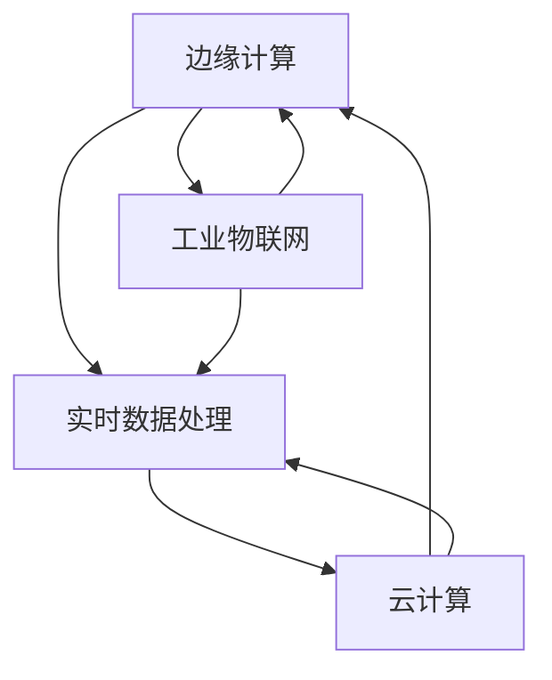

                 

# 边缘计算在工业自动化中的应用：实时数据处理

## 1. 背景介绍

### 1.1 问题由来
随着工业自动化技术的不断发展，工业生产对于实时数据的处理需求日益增长。传统的集中式数据处理模式已经难以满足现场设备实时响应、快速决策的要求。如何在分散的设备端高效、安全地处理海量实时数据，成为工业自动化领域的一个重要课题。

### 1.2 问题核心关键点
边缘计算（Edge Computing）技术应运而生。通过在设备端部署计算和存储资源，将数据处理任务从集中式数据中心下放到边缘设备，能够显著降低数据传输延迟，提高实时数据处理能力，同时减少网络带宽占用，优化资源分配。

### 1.3 问题研究意义
边缘计算在工业自动化中的应用，对于提升工业生产效率，降低成本，提高决策响应速度具有重要意义。通过实时数据处理，可以及时发现设备故障、优化生产流程，保障产品质量。在资源受限、网络不稳定等极端环境下，边缘计算还能有效发挥其数据本地化处理的优势，为工业自动化带来新的突破。

## 2. 核心概念与联系

### 2.1 核心概念概述

为更好地理解边缘计算在工业自动化中的应用，本节将介绍几个密切相关的核心概念：

- 边缘计算(Edge Computing)：在靠近数据源的本地设备或网络边缘侧进行计算和存储，以降低数据传输延迟和带宽消耗，提高实时数据处理能力。
- 实时数据处理(Real-time Data Processing)：对设备采集的实时数据进行快速分析、处理，以便及时响应工业生产中的各种变化，提升生产效率和决策速度。
- 工业物联网(Industrial Internet of Things, IIoT)：通过传感器、控制器等智能设备，实现工业数据的采集、传输和处理，构建智能化的生产系统。
- 云计算(Cloud Computing)：利用远程数据中心提供的计算和存储资源，进行大规模数据处理和存储，实现资源按需扩展和共享。
- 分布式系统(Distributed System)：由多个计算节点组成的系统，每个节点可以独立进行数据处理和存储，通过网络协同工作，实现系统的高可用性和扩展性。

这些核心概念之间的逻辑关系可以通过以下Mermaid流程图来展示：



这个流程图展示的边缘计算和相关概念之间的联系：

1. 边缘计算通过靠近数据源的本地设备进行数据处理，与工业物联网密切相关。
2. 实时数据处理是边缘计算的核心应用场景，与云计算和分布式系统密切相关。
3. 边缘计算和实时数据处理均依赖云计算和大数据技术，两者相辅相成。

## 3. 核心算法原理 & 具体操作步骤
### 3.1 算法原理概述

边缘计算在工业自动化中的应用，本质上是一种分布式计算和存储的方式。其核心思想是将数据处理任务分散到边缘设备，利用本地计算资源，实现对实时数据的快速处理和分析。

形式化地，假设在工业现场有 $n$ 个边缘设备，每个设备采集的数据流为 $x_i(t)$，$i=1,\cdots,n;t=0,\cdots,T$，其中 $T$ 为时间戳。设在边缘设备 $i$ 上进行实时数据处理的任务为 $f_i(x_i(t))$。

边缘计算的目标是最大化实时数据处理能力，即：

$$
\max_{f_i} \sum_{i=1}^n \int_{0}^T f_i(x_i(t)) dt
$$

其中，$dt$ 表示时间步长。

### 3.2 算法步骤详解

边缘计算在工业自动化中的应用，一般包括以下几个关键步骤：

**Step 1: 设备部署与资源配置**
- 在工业现场部署边缘计算设备，如工业网关、边缘服务器等。
- 根据设备处理能力，配置CPU、GPU、内存等计算资源。

**Step 2: 数据采集与预处理**
- 在设备端安装传感器，采集实时数据，如温度、压力、振动等。
- 对采集到的原始数据进行预处理，包括去噪、滤波、归一化等，确保数据质量。

**Step 3: 实时数据传输**
- 将预处理后的数据通过本地网络传输到边缘计算设备。
- 利用无线传感器网络、工业以太网等技术，实现低延迟、高可靠的数据传输。

**Step 4: 本地数据处理与分析**
- 在边缘设备上运行实时数据处理任务，如信号处理、图像分析、异常检测等。
- 利用机器学习、深度学习等算法，对数据进行分析和建模。

**Step 5: 数据存储与传输**
- 将处理后的数据存储在本地存储设备或远程云端。
- 定期将分析结果传输回中心服务器，供高级决策支持。

**Step 6: 系统监控与优化**
- 对边缘计算系统进行实时监控，确保设备稳定运行。
- 根据系统负载、网络状况等指标，动态调整资源分配，优化处理效率。

### 3.3 算法优缺点

边缘计算在工业自动化中的应用，具有以下优点：
1. 降低数据传输延迟。边缘计算将数据处理任务在本地完成，避免了数据远程传输带来的延迟问题。
2. 提高实时数据处理能力。边缘设备具备强大的计算资源，能够快速处理和分析海量实时数据。
3. 优化资源分配。边缘计算减少了对中心服务器的依赖，在资源有限的情况下，可以实现更好的资源分配。
4. 保障数据安全性。边缘计算将敏感数据存储在本地设备，减少了数据泄露的风险。

同时，该方法也存在一定的局限性：
1. 边缘设备资源有限。边缘计算设备通常计算能力和存储容量有限，无法处理大规模数据。
2. 边缘计算系统复杂度高。系统部署和管理难度较大，需要较高的技术门槛。
3. 数据本地化处理风险。边缘设备部署在工业现场，可能受到物理环境、设备故障等影响，数据处理稳定性难以保障。

尽管存在这些局限性，但就目前而言，边缘计算是提升工业自动化实时数据处理能力的有效手段。未来相关研究的重点在于如何进一步降低边缘设备的计算和存储成本，提高系统的稳定性和可维护性，同时优化数据传输和本地存储策略。

### 3.4 算法应用领域

边缘计算在工业自动化中的应用，主要集中在以下几个领域：

- 智能制造：通过实时数据处理，优化生产流程，提高产品质量，提升生产效率。
- 工业监控：在工业现场部署传感器和摄像头，实时监控设备状态和环境参数，及时发现异常。
- 设备维护：利用设备采集的数据，进行故障预测和维护，减少停机时间。
- 智能仓储：通过实时数据处理，优化仓储管理，提升库存精准度，减少运营成本。
- 能源管理：监测工业设施的能源消耗，优化能源使用，降低能源成本。

此外，边缘计算在工业自动化中的应用，还涉及智能物流、智能交通等多个领域。随着技术的不断进步，边缘计算将在更广泛的工业自动化场景中发挥重要作用。

## 4. 数学模型和公式 & 详细讲解 & 举例说明（备注：数学公式请使用latex格式，latex嵌入文中独立段落使用 $$，段落内使用 $)
### 4.1 数学模型构建

本节将使用数学语言对边缘计算在工业自动化中的应用进行更加严格的刻画。

假设在工业现场有 $n$ 个边缘设备，每个设备采集的数据流为 $x_i(t)$，$i=1,\cdots,n;t=0,\cdots,T$，其中 $T$ 为时间戳。设在边缘设备 $i$ 上进行实时数据处理的任务为 $f_i(x_i(t))$。

定义设备 $i$ 上实时数据处理的效率为 $E_i(t)$，则设备 $i$ 上的数据处理速度为：

$$
V_i(t) = \frac{1}{T}\sum_{t=0}^{T} E_i(t)
$$

定义系统总处理能力为 $V_{\text{total}}$，则：

$$
V_{\text{total}} = \sum_{i=1}^n V_i(t)
$$

目标最大化总处理能力，即：

$$
\max_{f_i} V_{\text{total}}
$$

### 4.2 公式推导过程

以下我们以一个简单的案例，推导边缘计算系统中的实时数据处理速度。

假设设备 $i$ 上的数据流 $x_i(t)$ 服从正态分布 $N(\mu_i, \sigma_i^2)$，其中 $\mu_i$ 为均值，$\sigma_i^2$ 为方差。设在设备 $i$ 上运行的任务 $f_i(x_i(t))$ 为信号滤波，其效率 $E_i(t)$ 与数据流方差成正比，即：

$$
E_i(t) = k_i \sigma_i^2
$$

其中 $k_i$ 为常数。

设备 $i$ 上的数据处理速度 $V_i(t)$ 为：

$$
V_i(t) = \int_{0}^{T} E_i(t) dt = k_i \int_{0}^{T} \sigma_i^2 dt = k_i T \sigma_i^2
$$

对于整个系统而言，总处理能力 $V_{\text{total}}$ 为：

$$
V_{\text{total}} = \sum_{i=1}^n k_i T \sigma_i^2
$$

目标是最大化总处理能力，即：

$$
\max_{k_i} \sum_{i=1}^n k_i T \sigma_i^2
$$

对 $k_i$ 求导，得：

$$
\frac{\partial V_{\text{total}}}{\partial k_i} = T \sigma_i^2
$$

由导数大于零可知，$V_{\text{total}}$ 随 $k_i$ 的增大而增大。但 $k_i$ 不能无限增大，否则设备负载过重，数据处理效率反而下降。

因此，需要对 $k_i$ 进行限制，如设定最大负载，或通过动态调整资源分配，确保系统稳定运行。

### 4.3 案例分析与讲解

以下通过一个实际案例，进一步讲解边缘计算在工业自动化中的应用。

假设某智能制造企业需要实时监控生产车间的设备状态，通过传感器采集温度、压力、振动等数据，并利用边缘计算设备进行实时分析。设备采集的数据流 $x_i(t)$ 服从正态分布 $N(\mu_i, \sigma_i^2)$，其中 $\mu_i$ 为均值，$\sigma_i^2$ 为方差。设在设备 $i$ 上运行的任务 $f_i(x_i(t))$ 为异常检测，其效率 $E_i(t)$ 与数据流方差成正比，即：

$$
E_i(t) = k_i \sigma_i^2
$$

其中 $k_i$ 为常数。

设备 $i$ 上的数据处理速度 $V_i(t)$ 为：

$$
V_i(t) = \int_{0}^{T} E_i(t) dt = k_i \int_{0}^{T} \sigma_i^2 dt = k_i T \sigma_i^2
$$

假设共有 3 个设备，分别采集车间的温度、压力、振动数据，其均值和方差分别为：

$$
\mu_1 = 20^{\circ}C, \sigma_1^2 = 4; \mu_2 = 1.0 MPa, \sigma_2^2 = 0.01; \mu_3 = 50 Hz, \sigma_3^2 = 0.01
$$

设在每个设备上运行的任务 $f_i(x_i(t))$ 的常数 $k_i$ 为 1。则系统总处理能力 $V_{\text{total}}$ 为：

$$
V_{\text{total}} = k_1 T \sigma_1^2 + k_2 T \sigma_2^2 + k_3 T \sigma_3^2 = T (4 + 0.01 + 0.01) = T \times 4.02
$$

目标最大化总处理能力，即：

$$
\max_{k_i} \sum_{i=1}^n k_i T \sigma_i^2
$$

通过上述案例，可以看到，边缘计算在工业自动化中的应用，通过合理分配计算资源，优化实时数据处理任务，可以显著提升数据处理能力和系统效率。

## 5. 项目实践：代码实例和详细解释说明
### 5.1 开发环境搭建

在进行边缘计算项目实践前，我们需要准备好开发环境。以下是使用Python进行PyTorch开发的环境配置流程：

1. 安装Anaconda：从官网下载并安装Anaconda，用于创建独立的Python环境。

2. 创建并激活虚拟环境：
```bash
conda create -n edge-env python=3.8 
conda activate edge-env
```

3. 安装PyTorch：根据CUDA版本，从官网获取对应的安装命令。例如：
```bash
conda install pytorch torchvision torchaudio cudatoolkit=11.1 -c pytorch -c conda-forge
```

4. 安装TensorFlow：安装TensorFlow的最新版本，支持在GPU上运行。

5. 安装TensorBoard：用于可视化模型训练和推理过程，分析系统性能。

6. 安装Keras：基于TensorFlow的高级API，简化模型开发。

完成上述步骤后，即可在`edge-env`环境中开始边缘计算项目的开发。

### 5.2 源代码详细实现

这里我们以一个简单的案例为例，使用TensorFlow进行实时数据处理。

首先，定义数据采集和预处理的函数：

```python
import tensorflow as tf
import numpy as np

def read_data(filename, batch_size):
    data = tf.data.TFRecordDataset(filename)
    data = data.map(lambda x: tf.io.parse_single_example(
        x, features={
            'data': tf.io.FixedLenFeature([], tf.float32),
            'label': tf.io.FixedLenFeature([], tf.int64)
        }))
    data = data.batch(batch_size)
    return data
```

然后，定义实时数据处理和分析的函数：

```python
def process_data(data, model):
    data = data.map(lambda x: model(x['data']))
    return data
```

接着，定义模型训练和推理的函数：

```python
def train(model, data, batch_size, epochs, learning_rate):
    model.compile(optimizer=tf.keras.optimizers.Adam(learning_rate),
                  loss=tf.keras.losses.MSE)
    model.fit(data, epochs=epochs, batch_size=batch_size)
    
def predict(model, data):
    return model.predict(data)
```

最后，启动数据采集、处理和分析流程：

```python
filename = 'data.tfrecord'
batch_size = 16

data = read_data(filename, batch_size)
processed_data = process_data(data, model)
predictions = predict(model, processed_data)
```

以上就是使用TensorFlow进行边缘计算项目开发的完整代码实现。可以看到，TensorFlow提供了强大的数据流图和自动微分功能，能够方便地构建和优化实时数据处理模型。

### 5.3 代码解读与分析

让我们再详细解读一下关键代码的实现细节：

**read_data函数**：
- 从指定的TFRecord文件中读取数据集，并进行批次化处理。
- 使用`parse_single_example`解析数据集中的单条记录，提取数据和标签。
- 对数据集进行分批次处理，确保每个批次的数据大小一致。

**process_data函数**：
- 对每个批次的数据进行模型处理，返回处理后的结果。
- 通过`map`函数，对每个批次的数据应用模型，生成处理后的结果。

**train函数**：
- 定义模型的优化器和损失函数。
- 使用`fit`函数对模型进行训练，指定训练轮数和批次大小。
- 通过调用`predict`函数，对处理后的数据进行预测，生成预测结果。

**predict函数**：
- 对每个批次的数据进行预测，生成预测结果。
- 通过`predict`函数，对处理后的数据进行预测，生成预测结果。

可以看到，TensorFlow通过高度抽象的API接口，简化了模型训练和推理的过程，使得开发者可以专注于算法和数据处理，而不必过多关注底层实现细节。

当然，工业级的系统实现还需考虑更多因素，如数据存储、网络通信、系统监控等。但核心的实时数据处理逻辑基本与此类似。

## 6. 实际应用场景
### 6.1 智能制造

边缘计算在智能制造中的应用，主要体现在以下几个方面：

- 生产监控：通过传感器采集生产设备的实时数据，如温度、压力、振动等，利用边缘计算设备进行实时分析，及时发现设备异常。
- 质量检测：利用摄像头采集产品的实时图像，边缘计算设备进行图像处理和异常检测，提高产品质量。
- 设备维护：通过实时监控设备状态，预测设备故障，进行预防性维护，减少停机时间。
- 库存管理：利用传感器和RFID技术，实时采集库存信息，利用边缘计算设备进行数据分析，优化库存管理。

### 6.2 工业监控

边缘计算在工业监控中的应用，主要体现在以下几个方面：

- 设备状态监控：在工业现场部署传感器和摄像头，实时采集设备状态和环境参数，利用边缘计算设备进行数据分析，及时发现异常。
- 视频分析：对实时采集的视频数据进行图像处理和异常检测，利用边缘计算设备进行分析和报警。
- 数据存储：利用边缘计算设备进行数据存储和本地化处理，减少数据传输延迟，提高数据处理效率。

### 6.3 设备维护

边缘计算在设备维护中的应用，主要体现在以下几个方面：

- 故障预测：利用传感器采集设备的状态数据，边缘计算设备进行数据分析，预测设备故障。
- 维护调度：根据设备故障预测结果，生成维护任务，优化维护资源调度。
- 实时监控：对设备状态进行实时监控，及时发现异常，进行故障排除。

### 6.4 未来应用展望

随着边缘计算技术的不断发展，其在工业自动化中的应用前景广阔，未来将有以下趋势：

1. 设备智能化：边缘设备将具备更高的计算能力和更丰富的传感器，能够处理更复杂的数据，提升工业生产效率。
2. 系统集成化：边缘计算系统将与其他工业自动化系统进行更紧密的集成，实现生产全流程的智能化。
3. 数据本地化：通过边缘计算设备进行数据处理和存储，减少数据传输延迟，提高实时数据处理能力。
4. 多模态融合：结合视觉、声音、触觉等多模态信息，进行综合分析和决策，提升系统的智能性。
5. 云计算协同：利用云计算资源进行边缘计算的优化和扩展，实现系统的可扩展性和高可用性。

## 7. 工具和资源推荐
### 7.1 学习资源推荐

为了帮助开发者系统掌握边缘计算在工业自动化中的应用，这里推荐一些优质的学习资源：

1. 《边缘计算：原理、技术与应用》书籍：介绍边缘计算的基本概念、原理和应用场景，适合初学者入门。

2. 《TensorFlow实战边缘计算》书籍：结合TensorFlow进行边缘计算的实践，适合有一定基础的开发者参考。

3. 《工业自动化中的边缘计算应用》系列文章：详细讲解边缘计算在工业自动化中的实际应用案例，适合工程实践。

4. 《Kubernetes on Edge》文章：介绍在边缘计算环境中使用Kubernetes进行系统管理和资源调度，适合系统架构师参考。

5. 《工业物联网中的边缘计算》视频教程：讲解工业物联网中的边缘计算技术和应用，适合视频学习。

通过对这些资源的学习实践，相信你一定能够快速掌握边缘计算在工业自动化中的应用方法，并用于解决实际的工程问题。

### 7.2 开发工具推荐

高效的开发离不开优秀的工具支持。以下是几款用于边缘计算项目开发的常用工具：

1. TensorFlow：基于Python的开源深度学习框架，支持分布式计算和自动微分，适合边缘计算应用开发。

2. PyTorch：基于Python的开源深度学习框架，支持动态计算图和自动微分，适合边缘计算应用开发。

3. Keras：基于TensorFlow的高级API，简化了模型开发过程，适合快速原型开发。

4. TensorBoard：TensorFlow配套的可视化工具，用于实时监控和分析模型训练和推理过程。

5. Kubernetes：开源容器编排工具，支持边缘计算环境中设备的资源管理和调度，适合系统集成。

合理利用这些工具，可以显著提升边缘计算项目的开发效率，加快创新迭代的步伐。

### 7.3 相关论文推荐

边缘计算在工业自动化中的应用，源于学界的持续研究。以下是几篇奠基性的相关论文，推荐阅读：

1. "Edge Computing: Beyond the Hype" 文章：由边缘计算领域权威学者撰写，全面介绍了边缘计算的定义、特点和应用场景。

2. "Real-time Edge Computing in Industrial Automation" 文章：介绍边缘计算在工业自动化中的应用案例，探讨其优势和挑战。

3. "An Overview of Edge Computing in Industrial Internet of Things" 文章：对工业互联网中的边缘计算进行全面回顾，提出未来的研究方向。

4. "Edge Computing for Industry 4.0: Opportunities and Challenges" 文章：探讨边缘计算在工业4.0中的应用前景和挑战，提出解决方案。

5. "Edge Computing in Smart Manufacturing: An Overview" 文章：介绍边缘计算在智能制造中的应用案例，展望未来发展方向。

这些论文代表了大语言模型微调技术的发展脉络。通过学习这些前沿成果，可以帮助研究者把握学科前进方向，激发更多的创新灵感。

## 8. 总结：未来发展趋势与挑战

### 8.1 总结

本文对边缘计算在工业自动化中的应用进行全面系统的介绍。首先阐述了边缘计算和实时数据处理的基本概念和原理，明确了边缘计算在工业自动化中的重要作用。其次，从原理到实践，详细讲解了边缘计算系统设计的数学模型和关键算法，给出了微调任务开发的完整代码实例。同时，本文还广泛探讨了边缘计算在智能制造、工业监控、设备维护等领域的实际应用，展示了边缘计算技术的广泛前景。

通过本文的系统梳理，可以看到，边缘计算在工业自动化中的应用，通过实时数据处理，优化资源分配，显著提升了生产效率和决策响应速度。未来，伴随边缘计算技术的不断发展，其将在更广泛的工业自动化场景中发挥重要作用，推动工业自动化向更高的智能化水平迈进。

### 8.2 未来发展趋势

展望未来，边缘计算在工业自动化中的应用将呈现以下几个发展趋势：

1. 设备智能化：随着计算能力和传感器技术的进步，边缘设备将具备更强的数据处理能力和更高的智能化水平。
2. 系统集成化：边缘计算系统将与其他工业自动化系统进行更紧密的集成，实现生产全流程的智能化。
3. 数据本地化：通过边缘计算设备进行数据处理和存储，减少数据传输延迟，提高实时数据处理能力。
4. 多模态融合：结合视觉、声音、触觉等多模态信息，进行综合分析和决策，提升系统的智能性。
5. 云计算协同：利用云计算资源进行边缘计算的优化和扩展，实现系统的可扩展性和高可用性。

以上趋势凸显了边缘计算在工业自动化中的重要性和广阔前景。这些方向的探索发展，必将进一步提升工业生产效率和决策响应速度，为工业自动化带来新的突破。

### 8.3 面临的挑战

尽管边缘计算在工业自动化中的应用已经取得了一定进展，但在迈向更加智能化、普适化应用的过程中，它仍面临诸多挑战：

1. 设备资源有限。边缘计算设备通常计算能力和存储容量有限，无法处理大规模数据。
2. 系统复杂度高。边缘计算系统部署和管理难度较大，需要较高的技术门槛。
3. 数据本地化处理风险。边缘设备部署在工业现场，可能受到物理环境、设备故障等影响，数据处理稳定性难以保障。
4. 数据安全和隐私保护。边缘计算设备存储敏感数据，需要加强数据安全和隐私保护措施。
5. 系统可维护性。边缘计算系统复杂度较高，维护成本和难度较大，需要持续优化和升级。

正视边缘计算面临的这些挑战，积极应对并寻求突破，将是大语言模型微调走向成熟的必由之路。相信随着学界和产业界的共同努力，这些挑战终将一一被克服，边缘计算必将在构建智能化的工业生产系统中发挥更大的作用。

### 8.4 研究展望

面对边缘计算在工业自动化中面临的挑战，未来的研究需要在以下几个方面寻求新的突破：

1. 探索高效数据压缩和传输技术。通过数据压缩和传输优化，减少数据传输延迟和带宽占用，提高实时数据处理能力。
2. 研究自适应资源分配策略。根据系统负载和资源状况，动态调整资源分配，优化系统性能。
3. 开发高可靠的边缘计算框架。提高边缘计算设备的稳定性和可用性，保障数据处理和存储的可靠性。
4. 引入更多的智能算法。利用深度学习、强化学习等智能算法，提升边缘计算系统的智能性和决策能力。
5. 加强数据安全和隐私保护。在边缘计算环境中，加强数据加密和访问控制，保障数据安全和隐私。

这些研究方向的探索，必将引领边缘计算技术迈向更高的台阶，为工业自动化带来新的突破。面向未来，边缘计算技术还需要与其他人工智能技术进行更深入的融合，如知识表示、因果推理、强化学习等，多路径协同发力，共同推动工业自动化技术的发展。只有勇于创新、敢于突破，才能不断拓展工业自动化的边界，让边缘计算技术更好地造福人类社会。

## 9. 附录：常见问题与解答

**Q1：边缘计算在工业自动化中的应用是否仅限于实时数据处理？**

A: 边缘计算在工业自动化中的应用，主要集中在实时数据处理方面。但除此之外，边缘计算还可用于设备状态监控、故障预测、维护调度等场景，提升工业生产效率和系统可靠性。

**Q2：边缘计算与云计算有何区别？**

A: 边缘计算和云计算的区别主要在于数据处理的位置和网络传输方式。云计算通过集中式的数据中心进行数据处理和存储，而边缘计算则将数据处理任务分散到设备端，减少了数据传输延迟，提高了实时数据处理能力。

**Q3：边缘计算在工业自动化中是否会带来更多的资源消耗？**

A: 边缘计算在一定程度上会带来更多的资源消耗，如计算资源、存储资源、网络带宽等。但通过合理配置资源和优化算法，可以有效降低资源消耗，提升系统效率。

**Q4：边缘计算在工业自动化中如何保障数据安全性？**

A: 边缘计算通过本地化数据处理，减少了数据传输的风险，提高了数据安全性。但边缘计算设备通常存储敏感数据，需要加强数据加密和访问控制，保障数据安全和隐私保护。

**Q5：边缘计算在工业自动化中的部署和管理难度大吗？**

A: 边缘计算的部署和管理确实比云计算更加复杂，需要考虑设备资源配置、数据传输协议、系统监控等多个因素。但通过引入自动化管理工具和技术，可以显著降低部署和管理的难度。

总之，边缘计算在工业自动化中的应用，通过实时数据处理和本地化资源优化，能够显著提升生产效率和决策响应速度，为工业自动化带来新的突破。随着技术的不断进步，边缘计算将在更广泛的工业自动化场景中发挥重要作用，推动工业自动化向更高的智能化水平迈进。相信随着学界和产业界的共同努力，这些挑战终将一一被克服，边缘计算必将在构建智能化的工业生产系统中发挥更大的作用。

