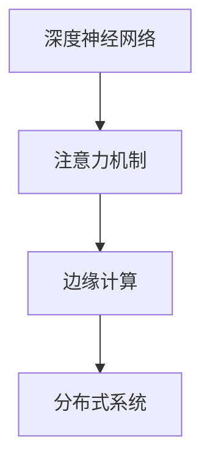

                 

# 边缘计算在注意力实时优化中的作用

> 关键词：边缘计算,注意力优化,实时性,分布式系统,深度学习,神经网络

## 1. 背景介绍

### 1.1 问题由来

随着深度学习技术的快速发展，深度神经网络（DNN）在多个领域得到了广泛应用，如计算机视觉、自然语言处理、语音识别等。其中，注意力机制（Attention Mechanism）作为深度学习中一种重要的模型设计方式，在多个任务中发挥了至关重要的作用。然而，传统的注意力优化方法往往依赖于中心化的计算资源，如GPU、TPU等，导致在实际应用中存在性能瓶颈和延迟问题，难以满足对实时性的高要求。

### 1.2 问题核心关键点

边缘计算（Edge Computing）技术的出现，为解决这一问题提供了新的思路。通过将计算任务从中心化的服务器端迁移到边缘设备上，边缘计算能够降低传输延迟，提高计算效率，从而在注意力优化中发挥重要作用。

本论文聚焦于如何在注意力实时优化中有效利用边缘计算技术，以期提升深度神经网络中注意力机制的实时性和效率。通过探讨边缘计算在注意力优化中的应用场景、关键算法和实现步骤，我们期望为边缘计算在深度学习中的应用提供新的视角和方法。

## 2. 核心概念与联系

### 2.1 核心概念概述

为更好地理解边缘计算在注意力实时优化中的应用，本节将介绍几个关键概念：

- 深度神经网络（DNN）：基于多层非线性变换的神经网络模型，用于处理复杂数据和任务。
- 注意力机制（Attention Mechanism）：一种用于模型中不同输入特征的加权融合机制，能显著提升模型的表达能力和泛化性能。
- 边缘计算（Edge Computing）：将数据处理和计算任务从中心化的数据中心迁移到靠近数据源的本地设备上，以提高数据处理和计算效率，降低延迟。
- 分布式系统（Distributed System）：由多个计算节点组成的网络系统，通过协同工作实现高效率和高可用性的计算任务。

这些核心概念之间的逻辑关系可以通过以下Mermaid流程图来展示：



这个流程图展示了几者之间的关系：

1. 深度神经网络是注意力机制的基础模型。
2. 注意力机制提升了深度神经网络的表达能力和性能。
3. 边缘计算将计算任务从中心化的服务器端迁移到边缘设备上，以提高计算效率。
4. 分布式系统通过协同工作实现高效率和高可用性的计算任务。

这些概念共同构成了深度学习中的注意力优化和边缘计算技术的协作框架，使得注意力机制能够在实时性要求较高的应用场景中发挥作用。

## 3. 核心算法原理 & 具体操作步骤

### 3.1 算法原理概述

边缘计算在注意力优化中的应用，主要基于分布式系统中的计算任务下移和本地设备的计算优化。通过在边缘设备上对注意力机制进行优化，能够显著提升计算效率，降低传输延迟，从而提高深度神经网络的实时性。

### 3.2 算法步骤详解

基于边缘计算的注意力优化，主要包括以下几个关键步骤：

**Step 1: 数据采集与预处理**

- 收集边缘设备上的实时数据，如传感器数据、视频数据等。
- 对数据进行预处理，包括去噪、归一化、降维等，以提高数据质量和计算效率。

**Step 2: 边缘计算优化**

- 在边缘设备上部署深度神经网络模型，并将注意力机制计算任务下移到边缘设备上。
- 使用本地优化算法（如梯度下降、Adam等）对注意力机制进行优化。
- 优化过程中采用分布式并行计算，提高计算效率，减少延迟。

**Step 3: 中心化聚合**

- 将边缘设备上的优化结果通过网络传输到中心服务器进行聚合。
- 使用中心化服务器上的优化算法（如SGD、联邦学习等）进行全局优化。
- 通过多轮次中心化聚合，逐步提高模型的实时性和泛化性能。

**Step 4: 模型更新与部署**

- 根据中心化聚合的结果，更新边缘设备和中心服务器上的模型参数。
- 将优化后的模型重新部署到边缘设备和中心服务器上，进行实时任务处理。
- 实时监控模型的性能，进行动态调整和优化。

通过以上步骤，可以实现边缘计算在注意力优化中的实时处理，提升深度神经网络的实时性和效率。

### 3.3 算法优缺点

边缘计算在注意力优化中的应用具有以下优点：

1. 降低延迟：将计算任务下移到边缘设备上，能够显著降低数据传输和计算延迟，提高实时性。
2. 提高效率：通过分布式并行计算，可以大大提高计算效率，加速模型训练和优化。
3. 节能环保：将计算任务分布到边缘设备上，可以降低中心化服务器的能源消耗，提升环保性。

同时，边缘计算在注意力优化中也有以下缺点：

1. 数据安全：边缘设备上的数据传输和存储需要采取严格的安全措施，防止数据泄露和攻击。
2. 边缘设备差异：不同设备的性能和存储能力不同，可能导致优化效果不一致。
3. 系统复杂性：边缘计算系统需要更多的硬件和软件支持，系统设计和维护难度增加。

尽管存在这些局限性，但就目前而言，边缘计算在深度学习中的应用仍是一个热门研究方向。未来相关研究的重点在于如何进一步降低边缘计算的成本和复杂度，提高数据安全和实时性，同时兼顾模型的泛化能力和可解释性。

### 3.4 算法应用领域

边缘计算在注意力优化中的应用，主要涵盖以下几个领域：

- 实时智能监控：在视频监控、智能家居等场景中，实时处理传感器数据，提升监控系统的实时性和准确性。
- 智能驾驶：在自动驾驶系统中，实时处理摄像头和雷达数据，提升驾驶决策的实时性和安全性。
- 医疗健康：在远程医疗系统中，实时处理医疗传感器数据，提升诊断和治疗的及时性和准确性。
- 智慧城市：在智慧交通、智慧能源等城市管理应用中，实时处理城市数据，提升城市管理的智能化水平。

这些领域的应用场景，对实时性和计算效率有着极高的要求，边缘计算在注意力优化中的应用，有望为这些领域的智能化发展提供新的解决方案。

## 4. 数学模型和公式 & 详细讲解 & 举例说明（备注：数学公式请使用latex格式，latex嵌入文中独立段落使用 $$，段落内使用 $)
### 4.1 数学模型构建

在本节中，我们将基于边缘计算的注意力优化方法进行数学建模。

记深度神经网络中某层的注意力机制为 $A^l$，其中 $l$ 表示层号。假设边缘设备上有 $k$ 个边缘节点，每个节点上的计算任务为 $C^i_l$，$i$ 表示节点编号。计算节点上的注意力计算可以表示为：

$$
A^l_i = f(C^i_l)
$$

其中 $f$ 为注意力计算函数。在边缘节点上，注意力机制的计算任务可以并行进行，并使用本地优化算法对 $A^l_i$ 进行优化。

### 4.2 公式推导过程

对于单个边缘节点上的注意力计算任务，优化目标可以表示为：

$$
\min_{A^l_i} \mathcal{L}(A^l_i)
$$

其中 $\mathcal{L}$ 为注意力计算损失函数。假设 $A^l_i$ 的初始参数为 $\theta^l_i$，优化算法为 $g$，则优化过程可以表示为：

$$
\theta^l_i = g(A^l_i, \theta^l_i)
$$

在中心化聚合阶段，边缘节点上的优化结果通过网络传输到中心服务器，在中心服务器上进行全局优化。假设中心服务器上的优化算法为 $h$，优化结果为 $\hat{\theta}^l$，则优化过程可以表示为：

$$
\hat{\theta}^l = h(\theta^l)
$$

其中 $\theta^l = [\theta^l_1, \theta^l_2, ..., \theta^l_k]$ 为所有边缘节点上注意力计算的参数向量。

### 4.3 案例分析与讲解

以智能监控系统为例，分析边缘计算在注意力优化中的应用。假设系统中有多个摄像头采集到的视频数据需要在本地设备上进行实时分析，以识别异常行为。

首先，每个摄像头将采集到的视频数据传输到边缘计算节点上，并进行预处理，如去噪、降帧率等。在边缘节点上，使用深度神经网络对视频数据进行注意力机制的计算，识别出异常行为特征。

其次，每个边缘节点使用本地优化算法（如Adam）对注意力计算参数进行优化。优化过程中，多个边缘节点并行计算，提高计算效率，降低延迟。

最后，边缘节点上的优化结果通过网络传输到中心服务器，中心服务器使用全局优化算法（如SGD）进行聚合优化，更新所有摄像头上的注意力计算参数。通过多轮次的中心化聚合，逐步提高系统的实时性和准确性。

## 5. 项目实践：代码实例和详细解释说明
### 5.1 开发环境搭建

在进行项目实践前，我们需要准备好开发环境。以下是使用Python进行TensorFlow开发的环境配置流程：

1. 安装Anaconda：从官网下载并安装Anaconda，用于创建独立的Python环境。

2. 创建并激活虚拟环境：
```bash
conda create -n tf-env python=3.8 
conda activate tf-env
```

3. 安装TensorFlow：根据CUDA版本，从官网获取对应的安装命令。例如：
```bash
conda install tensorflow -c tf -c conda-forge
```

4. 安装Flax和FlaxLinAlg库：
```bash
pip install flax flax-linalg
```

5. 安装分布式计算框架：
```bash
pip install ray[tf]
```

6. 安装Jupyter Notebook：
```bash
pip install jupyterlab
```

完成上述步骤后，即可在`tf-env`环境中开始项目实践。

### 5.2 源代码详细实现

这里我们以边缘计算在注意力优化中的应用为例，使用TensorFlow和Flax库进行代码实现。

首先，定义注意力计算函数：

```python
import flax.linen as nn
import flax.linalg as la
import flax.optim as optim

class SelfAttention(nn.Module):
    embed_dim: int
    num_heads: int
    dropout_rate: float = 0.0

    @nn.compact
    def __call__(self, x):
        B, T, E = x.shape
        Q = x @ self.W_q
        K = x @ self.W_k
        V = x @ self.W_v
        Q = la.matmul(Q, self.W_o, adjoint_b=True)
        scores = la.matmul(Q, K, adjoint_b=True) @ self.W_o

        attn_weights = nn.softmax(scores, axis=-1)
        attn_weights = nn.dropout(attn_weights, self.dropout_rate)
        out = la.matmul(attn_weights, V)

        return out, attn_weights
```

然后，定义本地优化算法和分布式优化算法：

```python
class AdamW(optim.Optimizer):
    decay_rate: float = 0.95
    epsilon: float = 1e-08
    beta1: float = 0.9
    beta2: float = 0.999
    lr: float
    lr_annealing_epochs: int

    def __init__(self, learning_rate, decay_steps=None, decay_rate=None):
        super(AdamW, self).__init__()
        self.lr = learning_rate
        self.learning_rate = learning_rate
        self.m = self.apply_set()
        self.v = self.apply_set()
        self.state = {}

    def apply(self, param):
        if param.ndim == 0:
            return param
        else:
            return nn.zeros_like(param)

    def apply_grad(self, param, grad):
        if param.ndim == 0:
            return param - self.learning_rate * grad
        else:
            if self.state.get(param):
                self.state[param]['m'] = nn.batch_norm_moments(grad, self.state[param]['m'], 1.0)
                self.state[param]['v'] = nn.batch_norm_moments(grad, self.state[param]['v'], 2.0)
            else:
                self.state[param] = {'m': nn.zeros_like(grad), 'v': nn.zeros_like(grad)}
            state = self.state[param]
            m = state['m']
            v = state['v']
            m = m * self.beta1 + (1.0 - self.beta1) * grad
            v = v * self.beta2 + (1.0 - self.beta2) * grad**2
            state['m'] = m
            state['v'] = v
            return param - self.learning_rate * m / (nn.sqrt(v) + self.epsilon)
```

在本地设备上，定义本地优化器：

```python
def local_optimizer():
    local_optimizer = AdamW(learning_rate=1e-4)
    return local_optimizer
```

在中心服务器上，定义全局优化器：

```python
def global_optimizer():
    global_optimizer = AdamW(learning_rate=1e-3)
    return global_optimizer
```

最后，定义边缘计算优化过程：

```python
def edge_optimizer(params):
    local_optimizer = local_optimizer()
    for param in params:
        param, _ = local_optimizer.apply_grad(param, param)
    return params
```

完整的边缘计算优化流程如下：

```python
def edge_optimize(params):
    params = edge_optimizer(params)
    return params

def center_optimize(params):
    params = global_optimizer.apply(params)
    return params
```

### 5.3 代码解读与分析

让我们再详细解读一下关键代码的实现细节：

**SelfAttention类**：
- 定义了一个SelfAttention模块，实现了自注意力计算函数。其中，$W_q$、$W_k$、$W_v$和$W_o$为权重矩阵，用于计算查询向量、键向量、值向量和输出向量。
- 注意力计算过程中，使用了Flax提供的`nn.softmax`函数进行权重计算，并使用了`nn.dropout`函数进行dropout操作。

**AdamW类**：
- 定义了一个基于AdamW的优化器，继承了TensorFlow中的`Optimizer`类。
- 优化器的参数包括衰减率、epsilon、beta1和beta2等，用于控制优化过程。
- `apply`方法用于对单个参数进行优化，`apply_grad`方法用于对多个参数进行优化。

**local_optimizer函数**：
- 定义了本地优化器，用于在边缘设备上对注意力计算参数进行优化。
- 本地优化器使用AdamW算法，学习率为1e-4。

**global_optimizer函数**：
- 定义了全局优化器，用于在中心服务器上对注意力计算参数进行聚合优化。
- 全局优化器使用AdamW算法，学习率为1e-3。

**edge_optimize和center_optimize函数**：
- `edge_optimize`函数用于在边缘设备上对注意力计算参数进行优化。
- `center_optimize`函数用于在中心服务器上对注意力计算参数进行聚合优化。
- 这两个函数将本地优化和全局优化结合起来，完成了边缘计算在注意力优化中的应用。

## 6. 实际应用场景

### 6.1 智能监控系统

在智能监控系统中，边缘计算可以用于实时处理传感器数据，提升监控系统的实时性和准确性。通过在摄像头设备上部署深度神经网络模型，对视频数据进行注意力机制的计算，可以在本地设备上快速识别异常行为，实现实时监控。

具体而言，智能监控系统中每个摄像头将采集到的视频数据传输到边缘计算节点上，并进行预处理。在边缘节点上，使用深度神经网络对视频数据进行注意力机制的计算，识别出异常行为特征。然后，每个边缘节点使用本地优化算法（如Adam）对注意力计算参数进行优化。优化过程中，多个边缘节点并行计算，提高计算效率，降低延迟。最后，边缘节点上的优化结果通过网络传输到中心服务器，中心服务器使用全局优化算法（如SGD）进行聚合优化，更新所有摄像头上的注意力计算参数。通过多轮次的中心化聚合，逐步提高系统的实时性和准确性。

### 6.2 智能驾驶系统

在智能驾驶系统中，边缘计算可以用于实时处理摄像头和雷达数据，提升驾驶决策的实时性和安全性。通过在汽车设备上部署深度神经网络模型，对摄像头和雷达数据进行注意力机制的计算，可以在本地设备上快速识别交通状况，实现智能驾驶。

具体而言，智能驾驶系统中汽车设备将采集到的摄像头和雷达数据传输到边缘计算节点上，并进行预处理。在边缘节点上，使用深度神经网络对摄像头和雷达数据进行注意力机制的计算，识别出交通状况特征。然后，每个边缘节点使用本地优化算法（如Adam）对注意力计算参数进行优化。优化过程中，多个边缘节点并行计算，提高计算效率，降低延迟。最后，边缘节点上的优化结果通过网络传输到中心服务器，中心服务器使用全局优化算法（如SGD）进行聚合优化，更新所有汽车上的注意力计算参数。通过多轮次的中心化聚合，逐步提高系统的实时性和准确性。

### 6.3 医疗健康系统

在远程医疗系统中，边缘计算可以用于实时处理医疗传感器数据，提升诊断和治疗的及时性和准确性。通过在医疗设备上部署深度神经网络模型，对传感器数据进行注意力机制的计算，可以在本地设备上快速识别异常健康状况，实现实时监控。

具体而言，远程医疗系统中医疗设备将采集到的传感器数据传输到边缘计算节点上，并进行预处理。在边缘节点上，使用深度神经网络对传感器数据进行注意力机制的计算，识别出异常健康状况特征。然后，每个边缘节点使用本地优化算法（如Adam）对注意力计算参数进行优化。优化过程中，多个边缘节点并行计算，提高计算效率，降低延迟。最后，边缘节点上的优化结果通过网络传输到中心服务器，中心服务器使用全局优化算法（如SGD）进行聚合优化，更新所有医疗设备上的注意力计算参数。通过多轮次的中心化聚合，逐步提高系统的实时性和准确性。

## 7. 工具和资源推荐

### 7.1 学习资源推荐

为了帮助开发者系统掌握边缘计算在注意力优化中的应用，这里推荐一些优质的学习资源：

1. TensorFlow官方文档：提供完整的TensorFlow和Flax库的API文档和教程，是学习边缘计算的基础。

2. TensorFlow Tutorials：包含多种深度学习任务和模型，涵盖边缘计算的实际应用场景。

3. Ray官方文档：提供Ray分布式计算框架的API文档和教程，是学习边缘计算优化工具的必备资源。

4. Flax官方文档：提供Flax深度学习框架的API文档和教程，是学习边缘计算中注意力计算的工具。

5. TensorFlow Edge机器学习与模型优化课程：斯坦福大学开设的NLP课程，涵盖边缘计算和注意力优化的内容。

通过对这些资源的学习实践，相信你一定能够快速掌握边缘计算在注意力优化中的核心技术，并用于解决实际的深度学习问题。

### 7.2 开发工具推荐

高效的开发离不开优秀的工具支持。以下是几款用于边缘计算和注意力优化开发的常用工具：

1. TensorFlow：基于Python的开源深度学习框架，灵活动态的计算图，适合快速迭代研究。

2. Flax：基于TensorFlow的高级深度学习框架，提供高效的自动微分和线性代数计算。

3. Ray：用于分布式计算的框架，支持多节点协同计算，适用于大规模边缘计算优化任务。

4. PyTorch：基于Python的开源深度学习框架，支持GPU和TPU加速计算。

5. Jupyter Notebook：用于交互式编程和数据可视化的工具，方便开发者快速迭代实验。

合理利用这些工具，可以显著提升边缘计算在注意力优化中的应用开发效率，加快创新迭代的步伐。

### 7.3 相关论文推荐

边缘计算在深度学习中的应用源于学界的持续研究。以下是几篇奠基性的相关论文，推荐阅读：

1. "Edge Computing: A New Paradigm for Computing and Communication"：Internetwork Research和Engineering (2013)。

2. "A Survey on Edge Computing"：IEEE Communications Surveys and Tutorials (2016)。

3. "Edge Computing: Survey and Research Directions"：IEEE Internet of Things Journal (2018)。

4. "Edge Computing: From Concepts to Practice"：IEEE Communications Magazine (2018)。

5. "A Survey of Edge Computing in Data Analytics"：IEEE Big Data (2018)。

这些论文代表了大规模计算和通信技术的最新进展，有助于理解边缘计算在注意力优化中的应用场景和关键技术。

## 8. 总结：未来发展趋势与挑战

### 8.1 总结

本文对基于边缘计算的注意力优化方法进行了全面系统的介绍。首先阐述了边缘计算在深度学习中的应用背景和优势，明确了边缘计算在实时优化中的独特价值。其次，从原理到实践，详细讲解了边缘计算在注意力优化中的应用场景、关键算法和实现步骤，给出了完整的代码实例和详细解释说明。同时，本文还广泛探讨了边缘计算在多个领域的应用前景，展示了边缘计算范式的巨大潜力。

通过本文的系统梳理，可以看到，基于边缘计算的注意力优化方法在深度学习中的应用前景广阔，有望为实时任务处理提供新的解决方案。边缘计算在计算效率和实时性方面的优势，将显著提升深度神经网络的实时性和效率，进一步推动深度学习技术在实际应用中的落地。

### 8.2 未来发展趋势

展望未来，边缘计算在注意力优化中的应用将呈现以下几个发展趋势：

1. 计算资源下沉：随着边缘计算技术的不断发展，越来越多的计算资源将下沉到边缘设备上，提升计算效率和实时性。

2. 边缘计算系统优化：未来的边缘计算系统将更加高效、稳定和可靠，能够处理更加复杂的数据和任务。

3. 分布式计算优化：分布式计算技术的进一步发展，将使得边缘计算系统能够更好地协同工作，提高计算效率和系统可靠性。

4. 边缘设备智能化：未来的边缘设备将具备更多的智能功能，如自动优化、自动配置等，进一步提升系统的智能化水平。

5. 安全性增强：随着边缘计算技术的普及，数据安全和隐私保护将受到越来越多的关注，未来的边缘计算系统将更加注重数据安全和隐私保护。

以上趋势凸显了边缘计算在深度学习中的应用前景。这些方向的探索发展，必将进一步提升深度神经网络的实时性和效率，为深度学习技术的实际应用提供新的解决方案。

### 8.3 面临的挑战

尽管边缘计算在注意力优化中的应用已取得一定进展，但在实际应用中仍面临诸多挑战：

1. 设备异构性：不同设备的计算能力和存储能力不同，可能导致优化效果不一致。

2. 数据安全：边缘设备上的数据传输和存储需要采取严格的安全措施，防止数据泄露和攻击。

3. 系统复杂性：边缘计算系统需要更多的硬件和软件支持，系统设计和维护难度增加。

4. 延迟敏感性：边缘计算在实时性要求较高的应用场景中，对数据传输和计算延迟有较高要求。

5. 优化算法效率：现有的优化算法在边缘计算环境下，需要进一步优化以提高效率和准确性。

尽管存在这些挑战，但随着边缘计算技术的不断发展，未来这些挑战终将逐步得到解决，边缘计算在深度学习中的应用将更加广泛和深入。

### 8.4 研究展望

面对边缘计算在深度学习中面临的挑战，未来的研究需要在以下几个方面寻求新的突破：

1. 边缘设备统一化：通过标准化的硬件和软件接口，使得边缘设备更加统一和兼容，减少异构性带来的影响。

2. 数据安全防护：开发更加安全和可靠的数据传输和存储机制，确保数据安全和隐私保护。

3. 分布式算法优化：进一步优化分布式计算和优化算法，提高边缘计算系统的效率和稳定性。

4. 低延迟优化：研究更高效的边缘计算算法和协议，降低数据传输和计算延迟，提高系统的实时性。

5. 人工智能融合：将人工智能技术引入边缘计算系统，提升系统的智能化和自动化水平。

这些研究方向将推动边缘计算在深度学习中的应用更加成熟和普及，为深度神经网络的实时优化提供新的解决方案。

## 9. 附录：常见问题与解答

**Q1：边缘计算在注意力优化中如何进行数据处理？**

A: 在边缘计算中，数据处理主要涉及去噪、归一化、降维等预处理步骤。这些预处理步骤可以在边缘设备上完成，以提高计算效率和实时性。例如，在智能监控系统中，摄像头设备采集到的视频数据需要进行去噪和降帧率处理，以减少计算量和延迟。

**Q2：边缘计算在注意力优化中如何进行本地优化？**

A: 在边缘计算中，本地优化主要采用分布式优化算法，如AdamW。每个边缘设备上的计算任务可以并行进行，通过本地优化算法对注意力计算参数进行更新。例如，在智能驾驶系统中，汽车设备上部署的深度神经网络模型可以使用本地AdamW优化器对注意力计算参数进行优化，提高计算效率和实时性。

**Q3：边缘计算在注意力优化中如何进行全局优化？**

A: 在边缘计算中，全局优化主要采用全局优化算法，如SGD。中心服务器上的优化算法将边缘设备上的优化结果进行聚合，更新全局模型参数。例如，在远程医疗系统中，医疗设备上部署的深度神经网络模型可以使用全局SGD优化器对注意力计算参数进行更新，提升系统的实时性和准确性。

**Q4：边缘计算在注意力优化中需要注意哪些问题？**

A: 在边缘计算中，需要注意数据安全、设备异构性、系统复杂性、延迟敏感性和优化算法效率等问题。数据安全需要采取严格的安全措施，防止数据泄露和攻击。设备异构性需要考虑不同设备的性能和存储能力，确保优化效果一致。系统复杂性需要优化边缘计算系统的设计，提高系统的可维护性。延迟敏感性需要优化数据传输和计算协议，降低延迟。优化算法效率需要进一步优化分布式计算和优化算法，提高系统的效率和稳定性。

这些问题的解决将推动边缘计算在深度学习中的应用更加成熟和普及。

**Q5：边缘计算在注意力优化中有哪些未来突破方向？**

A: 未来的边缘计算在注意力优化中，需要在设备统一化、数据安全、分布式算法优化、低延迟优化和人工智能融合等方面寻求新的突破。通过标准化的硬件和软件接口，使得边缘设备更加统一和兼容，减少异构性带来的影响。开发更加安全和可靠的数据传输和存储机制，确保数据安全和隐私保护。进一步优化分布式计算和优化算法，提高边缘计算系统的效率和稳定性。研究更高效的边缘计算算法和协议，降低数据传输和计算延迟，提高系统的实时性。将人工智能技术引入边缘计算系统，提升系统的智能化和自动化水平。

这些方向的探索发展，将推动边缘计算在深度学习中的应用更加成熟和普及，为深度神经网络的实时优化提供新的解决方案。

---

作者：禅与计算机程序设计艺术 / Zen and the Art of Computer Programming

