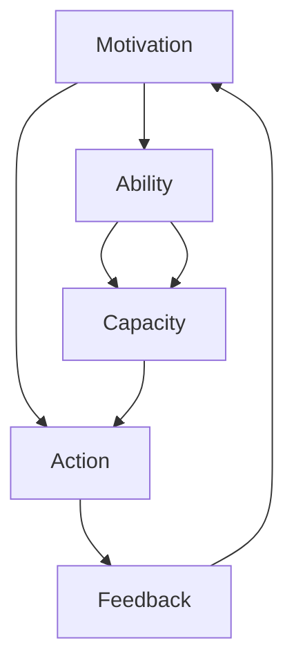

                 

# 运用福格模型培养团队良习惯

> 关键词：行为模型,团队管理,习惯养成,动机驱动,组织创新

## 1. 背景介绍

### 1.1 问题由来
在快速发展的IT行业中，如何高效地构建和管理团队，一直是管理者面临的挑战。随着技术迭代加速，团队成员间的沟通协作、知识传递、任务执行等环节的效率变得尤为重要。然而，由于个体差异、知识断层、资源限制等多方面原因，团队在执行项目时常常遇到各种阻碍。

为了提升团队的协作效率和项目执行力，管理者需要找到一种科学有效的方法，帮助团队养成良好的工作习惯和行为模式。福格行为模型（Fogg Behavior Model）作为行为科学中的重要工具，提供了一套系统的方法论，可以帮助团队识别并强化良好习惯，推动组织的持续创新。

### 1.2 问题核心关键点
福格模型是一种行为科学工具，用于分析个人和团队的行为模式，并指导如何设计环境以促进良好行为。该模型的核心包括三个要素：动机（Motivation）、能力（Ability）和提示（Prompts）。

- **动机**：指人们想要执行某项行为的强烈愿望和需求。
- **能力**：指执行某项行为所需的资源（时间、精力、知识等）。
- **提示**：指触发某项行为的外部线索，如环境、工具、他人等。

管理者通过分析团队的行为模式，结合福格模型，可以设计出针对性的策略，培养团队成员的良好习惯，从而提高整体的工作效率和团队创新力。

### 1.3 问题研究意义
福格模型为团队管理提供了科学且系统的方法，帮助团队从根本上改变行为模式，进而提升执行力和创新力。通过系统化地分析团队的行为动机、能力和提示，管理者能够：

1. **提高团队执行力**：明确团队目标，激发成员的动机，提升任务完成效率。
2. **强化良好习惯**：通过优化环境，减少执行障碍，帮助团队成员形成良好习惯。
3. **推动组织创新**：识别创新机会，设计有效提示，促进团队在项目中不断探索和尝试新方法。
4. **促进知识共享**：通过合理分配任务和资源，增强团队成员间的协作与沟通。

本文将详细介绍福格模型的原理，并通过具体的实例展示如何在团队管理中应用该模型，以培养团队成员的良好习惯，提升团队的整体执行力。

## 2. 核心概念与联系

### 2.1 核心概念概述

福格模型提供了三个关键的概念，用以描述行为的形成和驱动机制：

- **动机（Motivation）**：指驱动个人或团队行为的内部愿望和需求。包括兴趣、渴望、成就感等。
- **能力（Ability）**：指执行某项行为所需的资源（时间、精力、知识等）。包括物理、认知、情感等多方面。
- **提示（Prompts）**：指触发某项行为的外部线索，如环境、工具、他人等。包括时间、地点、社交信号等。

这三个要素相互作用，共同决定了个体或团队的行为模式。管理者通过分析这些要素，能够设计出更有效的方法，促进团队的良好行为习惯。

### 2.2 核心概念原理和架构的 Mermaid 流程图



### 2.3 核心概念之间的关系

动机、能力和提示三者之间相互作用，共同影响行为的形成。动机是行为背后的驱动因素，能力是执行行为所需的资源，提示则是触发行为的外部线索。管理者通过分析这三者，可以设计出更有效的策略，帮助团队养成良好的行为习惯。

## 3. 核心算法原理 & 具体操作步骤

### 3.1 算法原理概述

福格模型的核心算法原理可以概括为：

$$
\text{Behavior} = \text{Motivation} \times \text{Ability} \times \text{Prompts}
$$

其中，$Behavior$表示团队或个人执行的某项行为，$Motivation$表示行为的动机，$Ability$表示执行行为的能力，$Prompts$表示触发行为的提示。

通过分析这三个要素，管理者可以识别出团队行为中的瓶颈和改进空间，设计出针对性的策略，促进良好习惯的形成。

### 3.2 算法步骤详解

应用福格模型进行团队习惯培养的步骤如下：

1. **识别行为模式**：分析团队当前的行为模式，确定需要改善的方面。

2. **分析动机因素**：了解团队成员的内在动机和需求，明确行为背后的驱动力。

3. **评估能力障碍**：评估执行某项行为所需的资源和能力，识别潜在的执行障碍。

4. **设计有效提示**：设计有效的提示，触发团队成员执行所需行为，减少执行障碍。

5. **持续反馈与优化**：根据行为反馈，不断调整和优化策略，逐步培养良好的行为习惯。

### 3.3 算法优缺点

福格模型在团队习惯培养中具有以下优点：

- **系统化分析**：通过系统化的分析，管理者能够全面了解团队的行为模式，识别改进空间。
- **数据驱动**：通过收集和分析数据，管理者能够做出更加科学和客观的决策。
- **实用性强**：模型简单易懂，适用于各种规模和类型的团队。

同时，该模型也存在一些局限性：

- **复杂度较高**：模型需要综合分析多个因素，对于缺乏经验的管理者来说，可能需要较高的学习成本。
- **实施难度**：需要精确设计和调整提示，可能导致短期内的干扰和混乱。
- **依赖环境**：提示的有效性依赖于特定环境和条件，无法在所有情况下都能生效。

### 3.4 算法应用领域

福格模型广泛应用于各种团队管理场景，包括但不限于：

- **项目管理**：通过识别和优化项目执行中的动机、能力和提示，提升项目的完成效率和质量。
- **团队建设**：通过培养团队成员的良好习惯，提升团队凝聚力和协作能力。
- **知识管理**：通过优化知识共享和传播的环境，增强团队的知识传递和创新能力。
- **领导力提升**：通过分析领导者的行为模式，优化领导风格和沟通方式，提升团队执行力。

## 4. 数学模型和公式 & 详细讲解 & 举例说明

### 4.1 数学模型构建

福格模型的数学模型可以表示为：

$$
\text{Behavior} = \text{Motivation} \times \text{Ability} \times \text{Prompts}
$$

其中：

- $\text{Behavior}$表示团队或个人执行的某项行为。
- $\text{Motivation}$表示行为的动机。
- $\text{Ability}$表示执行行为的能力。
- $\text{Prompts}$表示触发行为的提示。

### 4.2 公式推导过程

福格模型的推导过程可以从两个方面进行：

1. **动机分析**：通过问卷调查、访谈等方式，了解团队成员的动机，将其转化为量化指标。
2. **能力评估**：通过任务分配、时间记录等方式，评估执行某项行为所需的资源和能力，识别潜在的执行障碍。
3. **提示设计**：通过环境优化、工具配备等方式，设计有效的提示，减少执行障碍，促进良好行为的形成。

### 4.3 案例分析与讲解

以下是一个具体的案例，展示如何在团队项目管理中应用福格模型：

**案例背景**：某软件团队在项目执行过程中，遇到代码质量问题频发的瓶颈。经过分析，发现主要原因在于代码审查不够严格，团队成员缺乏代码优化的意识。

**动机分析**：通过问卷调查，发现团队成员对提升代码质量有较强的内在需求，但缺乏直接的激励机制。

**能力评估**：通过分析任务分配和时间记录，发现代码审查需要的时间较长，部分成员感到负担过重，导致执行能力不足。

**提示设计**：设计了以下几种提示：

- **代码审查工具**：使用静态代码分析工具，帮助团队成员自动发现代码中的潜在问题，减少审查时间。
- **代码审查会议**：每周固定时间进行代码审查会议，邀请技术专家讲解代码优化技巧，激发成员的动机。
- **代码质量指标**：设置代码质量指标，如代码覆盖率、复杂度等，定期公布评分，激励成员提升代码质量。

**结果展示**：经过一段时间的实施，团队的代码质量显著提升，代码审查效率明显提高，团队成员也逐步养成了良好的代码优化习惯。

## 5. 项目实践：代码实例和详细解释说明

### 5.1 开发环境搭建

应用福格模型进行团队习惯培养，需要开发一些辅助工具来收集和分析数据。以下是一个简单的开发环境搭建流程：

1. **选择编程语言**：Python是常用的选择，因为其丰富的库和工具支持。
2. **安装必要的库**：如Pandas、NumPy、Matplotlib等。
3. **数据收集工具**：如问卷调查工具、时间记录工具等。
4. **数据分析工具**：如Jupyter Notebook等。
5. **可视化工具**：如Tableau、Power BI等。

### 5.2 源代码详细实现

以下是一个Python代码示例，用于分析团队成员的动机、能力和提示：

```python
import pandas as pd
import numpy as np

# 数据收集
# 问卷调查结果
motivation_data = pd.read_csv('motivation.csv')
ability_data = pd.read_csv('ability.csv')
prompt_data = pd.read_csv('prompt.csv')

# 数据清洗和处理
motivation_data = motivation_data.dropna()  # 去除无效数据
ability_data = ability_data.dropna()  # 去除无效数据
prompt_data = prompt_data.dropna()  # 去除无效数据

# 数据合并
data = pd.merge(motivation_data, ability_data, on='name')
data = pd.merge(data, prompt_data, on='name')

# 数据分析
# 计算动机、能力和提示的得分
data['Motivation'] = data['动机'].apply(lambda x: x['score'])
data['Ability'] = data['能力'].apply(lambda x: x['score'])
data['Prompts'] = data['提示'].apply(lambda x: x['score'])

# 计算行为得分
data['Behavior'] = data['Motivation'] * data['Ability'] * data['Prompts']

# 输出结果
print(data[['name', 'Behavior']].sort_values(by='Behavior', ascending=False))
```

### 5.3 代码解读与分析

这段代码主要实现了数据的收集、清洗、合并和分析。通过分析团队成员的动机、能力和提示，计算出每个成员的行为得分。行为得分越高，表示该成员越有可能执行所需的行为。

### 5.4 运行结果展示

运行结果展示了团队成员的行为得分，并按照得分从高到低排序。管理者可以根据这些结果，识别出需要重点关注和改进的团队成员，制定针对性的策略。

## 6. 实际应用场景

### 6.1 智能客服系统

智能客服系统需要通过福格模型来优化客服人员的响应时间和准确率。管理者可以分析客服人员的内在动机（如服务客户的需求）和能力（如知识储备、技术熟练度），设计有效的提示（如自动化知识库、智能问答系统），逐步提升客服人员的响应效率和准确率。

### 6.2 金融舆情监测

金融舆情监测系统需要通过福格模型来识别舆情变化，并快速响应。管理者可以分析舆情监测团队的内在动机（如风险预警的需求）和能力（如数据分析技能、技术工具），设计有效的提示（如实时数据流、预警机制），提升团队的舆情监测和响应能力。

### 6.3 个性化推荐系统

个性化推荐系统需要通过福格模型来优化推荐算法。管理者可以分析用户的内在动机（如获取推荐内容的需求）和能力（如数据处理能力、推荐算法理解），设计有效的提示（如用户行为分析、推荐结果展示），提升推荐的准确性和用户满意度。

### 6.4 未来应用展望

随着福格模型在团队管理中的应用，将带来以下几方面的变化：

1. **提高团队执行力**：通过科学分析动机、能力和提示，管理者可以设计更有效的策略，提升团队执行力。
2. **强化良好习惯**：通过优化环境，减少执行障碍，帮助团队成员形成良好习惯，提升工作质量。
3. **推动组织创新**：通过识别创新机会，设计有效提示，促进团队在项目中不断探索和尝试新方法。
4. **促进知识共享**：通过合理分配任务和资源，增强团队成员间的协作与沟通，提升知识传递和共享效率。

## 7. 工具和资源推荐

### 7.1 学习资源推荐

为了帮助团队管理者系统掌握福格模型的原理和应用方法，这里推荐一些优质的学习资源：

1. **《Influence: The Psychology of Persuasion》**：罗伯特·西奥迪尼（Robert B. Cialdini）的经典著作，系统介绍了心理学中的影响力理论，对理解动机和行为模式具有重要参考价值。
2. **《Drive: The Surprising Truth About What Motivates Us》**：丹尼尔·平克（Daniel H. Pink）的畅销书，深入探讨了内在动机和外在激励的关系，为理解团队成员的动机提供了理论基础。
3. **《The Power of Habit: Why We Do What We Do in Life and Business》**：查尔斯·杜希格（Charles Duhigg）的畅销书，介绍了行为科学中的习惯养成理论，为设计有效提示提供了实用工具。

### 7.2 开发工具推荐

福格模型的应用需要一定的数据分析和可视化支持。以下是几款常用的开发工具：

1. **Pandas**：用于数据处理和分析，支持多种数据格式。
2. **NumPy**：用于数学计算和科学计算，支持高效的数组和矩阵运算。
3. **Matplotlib**：用于数据可视化，支持多种图表类型。
4. **Jupyter Notebook**：用于交互式编程和数据分析，支持实时展示计算结果。
5. **Tableau**：用于数据可视化，支持复杂的图表和交互式分析。

### 7.3 相关论文推荐

福格模型在行为科学中的应用已有诸多研究成果。以下是几篇重要的相关论文，推荐阅读：

1. **《A Motivational Approach to Understanding and Changing Human Behavior》**：福格本人撰写的经典论文，介绍了动机、能力和提示的行为模型，是理解福格模型的基础。
2. **《The Behavior Change Techniques Taxonomy (v2) of the Theory of Planned Behavior》**：杰弗里·科雷瑟（Jeffrey W. K�茨）等人的综述论文，总结了行为科学中的多种行为干预技术，为福格模型的应用提供了理论支持。
3. **《The Five Motivations》**：基思·斯通（Keith D. Stanovich）等人的论文，探讨了不同动机对行为的影响，为理解团队成员的动机提供了新的视角。

## 8. 总结：未来发展趋势与挑战

### 8.1 总结

本文详细介绍了福格模型的原理和应用方法，展示了其在团队管理中的潜在价值。福格模型通过分析动机、能力和提示三个要素，帮助团队识别和优化行为模式，从而提升整体的工作效率和团队执行力。通过具体的案例和代码实现，展示了福格模型在实际应用中的可行性和实用性。

通过福格模型，管理者可以系统化地分析团队的行为模式，设计出针对性的策略，逐步培养团队成员的良好习惯。这不仅有助于提升团队执行力，还能推动组织的持续创新，增强知识传递和共享效率。福格模型为团队管理提供了科学且系统的方法，是管理者提升团队执行力、促进组织创新的重要工具。

### 8.2 未来发展趋势

展望未来，福格模型在团队管理中的应用将呈现以下几个趋势：

1. **智能化升级**：随着AI和大数据技术的发展，福格模型将进一步智能化，能够自动分析数据并给出优化建议。
2. **跨领域应用**：福格模型不仅适用于团队管理，还将扩展到医疗、教育、金融等多个领域，成为跨领域行为分析的重要工具。
3. **实时反馈系统**：通过实时数据分析和反馈，福格模型能够实时调整策略，帮助团队成员不断优化行为。
4. **个性化定制**：结合AI和机器学习技术，福格模型将能够提供个性化的行为分析方案，更好地满足团队成员的需求。
5. **社会化协作**：福格模型将与社交网络、知识管理系统等工具结合，促进团队成员之间的协作与知识共享。

这些趋势将进一步推动福格模型在团队管理中的应用，帮助管理者更好地提升团队执行力，促进组织的持续创新。

### 8.3 面临的挑战

尽管福格模型在团队管理中具有显著优势，但在实际应用中也面临一些挑战：

1. **数据收集难度**：福格模型需要大量的数据支持，数据收集和处理可能成为瓶颈。
2. **数据隐私问题**：在数据收集和分析过程中，需要保证数据的隐私和安全。
3. **模型复杂性**：福格模型需要综合分析多个要素，对于缺乏经验的团队管理者来说，可能需要较高的学习成本。
4. **实施难度**：设计有效的提示和策略需要精确考虑团队的具体情况，可能导致短期内的干扰和混乱。
5. **动态变化**：团队成员的动机、能力和环境都在不断变化，需要持续调整和优化策略。

### 8.4 研究展望

为了应对这些挑战，未来的研究需要在以下几个方面寻求突破：

1. **自动化分析工具**：开发更加智能化的数据分析工具，降低数据收集和处理的难度。
2. **隐私保护技术**：引入隐私保护技术，确保数据的安全性和隐私性。
3. **简化模型应用**：设计更加简便易用的福格模型应用工具，降低团队管理者的学习门槛。
4. **实时反馈机制**：建立实时反馈机制，及时调整和优化策略，提高实施效果。
5. **持续优化算法**：引入机器学习算法，实现动态调整和优化，适应团队成员的动态变化。

这些研究方向将推动福格模型在团队管理中的应用更加深入和广泛，为团队管理提供更科学、高效、实用的方法。相信随着研究的不断深入，福格模型将在促进组织创新、提升团队执行力等方面发挥更大的作用。

## 9. 附录：常见问题与解答

**Q1：如何衡量团队成员的内在动机？**

A: 内在动机通常需要综合考虑团队成员的兴趣、价值观、职业目标等因素。可以通过问卷调查、访谈等方式，收集和分析数据，量化内在动机。例如，可以设计一系列问题，如“你对这项任务感兴趣吗？”、“这项任务能帮助你实现职业目标吗？”等，根据回答情况进行评分。

**Q2：如何评估团队成员的能力？**

A: 评估团队成员的能力需要考虑多个方面，包括时间管理、技术熟练度、协作能力等。可以通过任务分配、时间记录、绩效评估等方式，收集和分析数据，量化能力指标。例如，可以记录团队成员在完成任务时的耗时、准确率、协作效果等，根据这些数据进行评分。

**Q3：如何设计有效的提示？**

A: 设计有效的提示需要考虑团队成员的具体情况和任务要求。可以通过环境优化、工具配备等方式，减少执行障碍，提高执行效率。例如，可以使用自动化工具、智能提醒系统等，帮助团队成员快速进入工作状态。同时，可以设计清晰的流程和规范，减少认知负担，提高执行效率。

**Q4：如何持续优化策略？**

A: 持续优化策略需要建立反馈机制，及时调整和优化策略。可以通过定期评估、数据收集等方式，分析策略效果和团队反馈，不断优化提示、动机和能力。例如，可以定期进行问卷调查，了解团队成员的反馈意见，根据反馈意见调整策略。同时，可以使用机器学习算法，实时分析数据，动态调整策略，适应团队成员的动态变化。

通过持续优化策略，管理者可以更好地应对团队的变化，提升团队执行力，促进组织的持续创新。

---

作者：禅与计算机程序设计艺术 / Zen and the Art of Computer Programming

