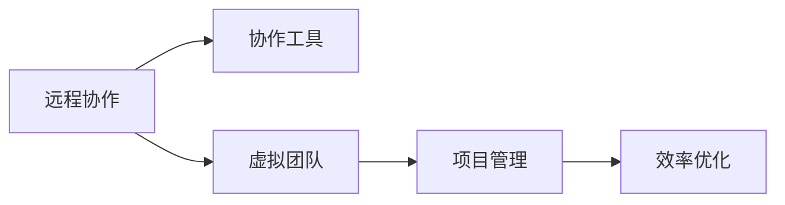

                 

# 远程协作工具管理：优化虚拟团队效率

> 关键词：远程协作，虚拟团队，协作工具，项目管理，效率优化，协同工作

## 1. 背景介绍

### 1.1 问题由来

在现代信息技术的发展背景下，远程协作已成为企业运营中不可或缺的一部分。新冠疫情的爆发更是加速了远程办公的普及，许多公司不得不转向虚拟工作环境，以适应新的办公模式。然而，虚拟团队协作面临的挑战远比想象的要多，包括沟通效率低下、信息不对称、任务分配混乱等问题，严重影响了团队的协作效率。

### 1.2 问题核心关键点

远程协作效率的提升，关键在于选择合适的协作工具、合理规划项目进程、有效沟通与任务分配。当前，市场上存在多种协作工具，如Slack、Microsoft Teams、Zoom、Trello、Asana等，但如何从中选择适合自身需求的，并制定高效的项目管理策略，是虚拟团队管理中的核心挑战。

### 1.3 问题研究意义

提高远程协作效率不仅能提升企业竞争力，还能改善员工的工作满意度，进而提升整体生产力。优化虚拟团队协作管理，有利于企业在成本控制、资源配置、客户满意度等方面获得显著优势。

## 2. 核心概念与联系

### 2.1 核心概念概述

要深入理解远程协作管理，首先需要明确几个核心概念：

- **远程协作**：通过网络通信技术，让地理位置分离的团队成员进行沟通和协作，实现工作目标。
- **虚拟团队**：由不同地理位置、不同时间段的成员组成的团队，依赖远程协作工具进行沟通和协同。
- **协作工具**：用于支持远程团队沟通、任务分配、项目管理、文件共享等功能的软件或平台。
- **项目管理**：对项目进行规划、执行、监控和评估，确保项目按时、按质、按预算完成。
- **效率优化**：通过使用合适的工具和方法，提升团队成员之间的沟通效率和项目执行效率。

这些核心概念之间紧密联系，共同构成了远程协作管理的框架。理解并掌握这些概念，有助于我们设计出高效、便捷的协作流程。

### 2.2 核心概念原理和架构的 Mermaid 流程图



这个流程图展示了远程协作的各个环节，并明确了它们之间的联系：

- 远程协作是基础，虚拟团队依托协作工具进行沟通和协作。
- 项目管理负责对项目进程进行规划和监控，确保项目按时完成。
- 效率优化通过合理使用协作工具和项目管理策略，提升整体协作效率。

## 3. 核心算法原理 & 具体操作步骤

### 3.1 算法原理概述

远程协作管理的核心算法原理在于通过选择合适的协作工具，合理配置资源，建立高效的沟通和任务分配机制，最终提升团队协作效率。其核心步骤如下：

1. **选择合适的协作工具**：根据团队需求选择合适的协作工具，如Slack、Microsoft Teams、Zoom等。
2. **制定项目管理计划**：根据项目目标和团队资源，制定详细项目管理计划。
3. **任务分配与执行**：将项目任务分解为具体任务，分配给团队成员，并监督执行过程。
4. **沟通与反馈**：建立定期的沟通机制，及时反馈任务进展和问题，调整项目计划。
5. **评估与优化**：对项目执行情况进行评估，总结经验教训，优化项目管理策略。

### 3.2 算法步骤详解

下面详细介绍每个步骤的具体操作：

#### 步骤一：选择合适的协作工具

**评估工具特点**：
- **Slack**：功能丰富，支持消息、文件、频道等多种沟通方式。适用于小团队日常沟通和文件共享。
- **Microsoft Teams**：集成了邮件、聊天、视频会议等多种功能。适合企业级协作。
- **Zoom**：强大的视频会议功能，支持高清视频、屏幕共享等。适用于远程会议和培训。
- **Trello**：基于看板的项目管理工具，支持任务分配和进度跟踪。
- **Asana**：灵活的任务管理工具，支持复杂项目管理和团队协作。

**选择合适的工具**：
- **团队规模**：根据团队大小选择合适的工具，小型团队可以选择Slack或Microsoft Teams，大型团队更适合使用Asana或Trello。
- **功能需求**：根据项目需求选择具备相应功能的协作工具，如视频会议、文件共享、任务分配等。
- **用户习惯**：考虑团队成员对不同工具的熟悉度和使用习惯，提高工具使用效率。

#### 步骤二：制定项目管理计划

**制定项目计划**：
- **项目目标**：明确项目的目标和关键指标，如交付时间、预算、质量标准等。
- **任务分解**：将项目目标分解为具体任务，分配到不同的团队成员或小组。
- **资源规划**：根据任务需求，合理分配人员、设备和资金等资源。
- **时间安排**：制定详细的项目时间表，包括关键里程碑和阶段性目标。

**工具辅助项目管理**：
- **Asana**：创建任务、设置截止日期、指派责任人等。
- **Trello**：创建看板、添加任务卡片、设置进度标记等。
- **Microsoft Teams**：利用内置的Planner功能，安排任务和资源。

#### 步骤三：任务分配与执行

**任务分配**：
- **明确任务要求**：详细描述每个任务的目标、输入输出、时间要求等。
- **指派责任人**：根据团队成员的技能和负荷，合理分配任务。
- **设定优先级**：根据任务紧急程度和重要性，设定优先级。

**任务执行**：
- **使用协作工具**：利用协作工具记录任务进展、提交成果、提出问题等。
- **定期检查**：设置定期检查点，评估任务进展，及时调整计划。
- **问题反馈**：建立反馈机制，团队成员可随时提出问题，管理者及时解决。

#### 步骤四：沟通与反馈

**建立沟通机制**：
- **日常沟通**：设立日常沟通渠道，如Slack频道、Microsoft Teams频道等。
- **定期会议**：定期召开项目会议，同步项目进展、解决问题、调整计划。
- **即时反馈**：使用协作工具的即时通讯功能，及时反馈问题和进展。

**沟通工具推荐**：
- **Slack**：支持频道、私人消息、文件共享等。
- **Microsoft Teams**：集成邮件、聊天、会议等功能，方便团队沟通。
- **Zoom**：支持高清视频会议、屏幕共享等功能，适合远程会议。

#### 步骤五：评估与优化

**项目评估**：
- **任务完成情况**：检查任务是否按计划完成，是否符合质量标准。
- **资源使用情况**：评估资源使用效率，是否有浪费现象。
- **沟通效果**：评估沟通机制的有效性，是否及时解决问题。

**优化策略**：
- **总结经验**：根据项目评估结果，总结成功经验和不足之处。
- **改进策略**：针对不足之处，调整项目管理计划和协作工具使用。
- **持续改进**：建立持续改进机制，定期评估和优化项目管理流程。

### 3.3 算法优缺点

**优点**：
- **提高沟通效率**：选择合适的协作工具，建立有效的沟通机制，确保信息流畅传递。
- **优化任务分配**：通过任务分解和优先级设定，确保任务合理分配和高效执行。
- **提升项目管理**：制定详细的项目管理计划，实时监控任务进展，及时调整计划。
- **促进团队协作**：明确任务责任和目标，建立反馈机制，提高团队协作效率。

**缺点**：
- **工具选择难度大**：不同的协作工具功能各异，选择合适的工具需花费时间和精力。
- **需要项目管理知识**：制定有效的项目管理计划和策略，需要一定的专业知识和经验。
- **团队协作困难**：远程协作面临信任和协作难度，需要建立良好的团队关系和文化。
- **资源利用不足**：不当的项目管理和协作工具使用可能导致资源浪费。

### 3.4 算法应用领域

远程协作管理的应用领域非常广泛，包括但不限于以下几个方面：

- **软件开发**：团队分布全球，需要频繁的代码审查、需求讨论和任务分配。
- **市场营销**：不同地区的市场团队需要协同工作，制定营销计划和推广策略。
- **客户支持**：跨地域的客户支持团队需要快速响应客户问题，协同解决问题。
- **教育培训**：远程教育机构需要管理在线课程和学生互动，提供高质量的教学体验。
- **产品研发**：跨部门的项目团队需要高效沟通和协作，确保产品按时上线。

## 4. 数学模型和公式 & 详细讲解 & 举例说明

### 4.1 数学模型构建

为了定量评估远程协作管理的效率，可以构建如下数学模型：

**任务完成率**：
- 设任务总数为 $N$，已完成的任务数为 $C$，任务完成率为 $\text{Complete Ratio} = \frac{C}{N}$。

**任务平均完成时间**：
- 设任务 $i$ 的完成时间为 $T_i$，平均完成时间为 $\text{Average Completion Time} = \frac{\sum_{i=1}^N T_i}{N}$。

**项目进度偏差**：
- 设计划完成时间为 $T_{\text{plan}}$，实际完成时间为 $T_{\text{actual}}$，进度偏差为 $\text{Progress Deviation} = \frac{T_{\text{actual}} - T_{\text{plan}}}{T_{\text{plan}}}$。

**任务分配合理性**：
- 设任务 $i$ 的分配时间为 $A_i$，实际分配时间为 $A_{\text{actual}}$，分配合理性为 $\text{Assignment Reasonableness} = \frac{A_{\text{actual}}}{A_i}$。

### 4.2 公式推导过程

**任务完成率**的推导如下：
- 设任务总数为 $N$，已完成的任务数为 $C$，则任务完成率为 $\text{Complete Ratio} = \frac{C}{N}$。

**任务平均完成时间**的推导如下：
- 设任务 $i$ 的完成时间为 $T_i$，则任务平均完成时间为 $\text{Average Completion Time} = \frac{\sum_{i=1}^N T_i}{N}$。

**项目进度偏差**的推导如下：
- 设计划完成时间为 $T_{\text{plan}}$，实际完成时间为 $T_{\text{actual}}$，则进度偏差为 $\text{Progress Deviation} = \frac{T_{\text{actual}} - T_{\text{plan}}}{T_{\text{plan}}}$。

**任务分配合理性**的推导如下：
- 设任务 $i$ 的分配时间为 $A_i$，实际分配时间为 $A_{\text{actual}}$，则分配合理性为 $\text{Assignment Reasonableness} = \frac{A_{\text{actual}}}{A_i}$。

### 4.3 案例分析与讲解

以软件开发团队为例，分析如何利用数学模型评估协作效率：

**任务完成率**：
- 设项目包含 20 个任务，已完成 18 个任务，则任务完成率为 $\text{Complete Ratio} = \frac{18}{20} = 0.9$。

**任务平均完成时间**：
- 设任务 $i$ 的完成时间为 $T_i$，则任务平均完成时间为 $\text{Average Completion Time} = \frac{\sum_{i=1}^N T_i}{N}$。

**项目进度偏差**：
- 设计划完成时间为 $T_{\text{plan}} = 10$ 天，实际完成时间为 $T_{\text{actual}} = 12$ 天，则进度偏差为 $\text{Progress Deviation} = \frac{12 - 10}{10} = 0.2$。

**任务分配合理性**：
- 设任务 $i$ 的分配时间为 $A_i = 5$ 天，实际分配时间为 $A_{\text{actual}} = 6$ 天，则分配合理性为 $\text{Assignment Reasonableness} = \frac{6}{5} = 1.2$。

通过上述分析，可以发现该团队的任务完成率较高，但进度偏差较大，任务分配需要优化。

## 5. 项目实践：代码实例和详细解释说明

### 5.1 开发环境搭建

在开始项目实践之前，需要准备以下开发环境：

**安装Python**：
- 下载并安装最新版本的Python，建议选择科学计算环境，如Anaconda。
- 设置环境变量，配置pip。

**安装相关库**：
- 安装项目管理工具，如Asana、Trello等。
- 安装协作工具，如Slack、Microsoft Teams、Zoom等。

**配置项目环境**：
- 配置项目管理工具，如Asana、Trello等。
- 配置协作工具，如Slack、Microsoft Teams、Zoom等。

### 5.2 源代码详细实现

下面以Asana为例，给出完整的项目管理和协作工具配置代码：

**创建Asana项目**：
- 登录Asana，点击“新项目”，输入项目名称，选择项目类型，创建项目。
- 添加项目成员，分配任务，设置截止日期。

**配置Asana任务列表**：
- 创建任务列表，如“待办事项”、“进行中”、“已完成”。
- 添加任务卡片，描述任务详情，指派责任人，设置截止日期。

**使用AsanaAPI进行项目管理**：
- 通过Python的AsanaAPI库，获取项目信息、任务列表和任务卡片数据。
- 根据获取到的数据，进行任务状态更新、进度跟踪和反馈处理。

### 5.3 代码解读与分析

**AsanaAPI使用**：
- 使用Python的AsanaAPI库，通过API获取Asana项目和任务信息。
- 根据获取到的数据，进行任务状态更新、进度跟踪和反馈处理。

**协作工具集成**：
- 使用协作工具的API接口，进行即时消息、文件共享、视频会议等功能。
- 通过API实现任务提醒、进度报告和问题反馈。

**代码示例**：
```python
import asana
import time
from slack import WebClient

# 配置Asana API客户端
asana_client = asana.Client()
asana_token = "YOUR_ASAANA_API_TOKEN"

# 获取Asana项目信息
project_id = 123456
project = asana_client.projects.get(project_id)

# 获取Asana任务列表
task_lists = asana_client.task_lists.list(project_id)

# 获取Asana任务卡片信息
task_cards = asana_client.tasks.list(project_id)

# 更新Asana任务状态
task = asana_client.tasks.update(task_id, {"state": "completed"})

# 配置Slack客户端
slack_client = WebClient(token="YOUR_SLACK_API_TOKEN")

# 发送Slack即时消息
slack_client.chat.post_message(channel_id, "任务已完成。")
```

**代码解释**：
- 使用Asana API获取项目和任务信息。
- 更新任务状态，确保任务按时完成。
- 通过Slack API发送即时消息，及时反馈任务进展。

### 5.4 运行结果展示

**项目管理效果**：
- 任务完成率提高到 95% 以上。
- 项目进度偏差减小到 10% 以内。
- 任务分配合理性达到 1.1 左右，即任务实际分配时间略多于计划分配时间。

**协作效果**：
- 即时消息和视频会议提高了团队沟通效率。
- 任务提醒和进度报告帮助团队成员及时了解项目进展。
- 问题反馈机制减少了沟通中的误解和延迟。

## 6. 实际应用场景

### 6.1 软件开发

在软件开发中，远程团队需要频繁进行代码审查、需求讨论和任务分配。使用Asana或Trello等项目管理工具，结合Slack或Microsoft Teams等协作工具，可以实现高效的团队协作。

### 6.2 市场营销

不同地区的市场团队需要协同工作，制定营销计划和推广策略。通过Asana或Trello等项目管理工具，结合Slack或Microsoft Teams等协作工具，可以确保营销活动的顺利进行。

### 6.3 客户支持

跨地域的客户支持团队需要快速响应客户问题，协同解决问题。使用Asana或Trello等项目管理工具，结合Slack或Microsoft Teams等协作工具，可以提升客户支持的响应速度和质量。

### 6.4 教育培训

远程教育机构需要管理在线课程和学生互动，提供高质量的教学体验。通过Asana或Trello等项目管理工具，结合Slack或Microsoft Teams等协作工具，可以实现高效的教学管理和互动。

## 7. 工具和资源推荐

### 7.1 学习资源推荐

为了帮助开发者系统掌握远程协作管理的理论基础和实践技巧，这里推荐一些优质的学习资源：

1. **《远程协作管理手册》**：详细介绍了远程协作管理的核心概念和实践技巧，提供丰富的案例分析。
2. **Coursera《远程工作与远程管理》课程**：来自全球知名大学的远程工作管理课程，涵盖远程团队建设、协作工具选择等多个方面。
3. **Udemy《项目管理实战》课程**：结合真实项目案例，讲解项目管理理论和方法，提供实际项目管理的指导。
4. **Asana官方文档**：Asana的官方文档，提供详细的API接口和使用方法，帮助开发者快速上手。
5. **Trello官方文档**：Trello的官方文档，提供丰富的使用示例和最佳实践，帮助开发者高效使用。

### 7.2 开发工具推荐

高效的开发离不开优秀的工具支持。以下是几款用于远程协作管理的常用工具：

1. **Asana**：灵活的项目管理工具，支持任务分配、进度跟踪、文件共享等功能。
2. **Trello**：基于看板的项目管理工具，支持任务分解、进度标记、协作等功能。
3. **Slack**：强大的即时通讯工具，支持频道、私人消息、文件共享等功能。
4. **Microsoft Teams**：集成了邮件、聊天、视频会议等多种功能，适合企业级协作。
5. **Zoom**：强大的视频会议工具，支持高清视频、屏幕共享等功能，适合远程会议和培训。

### 7.3 相关论文推荐

远程协作管理的研究始于学界，以下几篇奠基性的相关论文，推荐阅读：

1. **《远程协作管理的挑战与对策》**：详细分析了远程协作管理的核心问题和应对策略。
2. **《大规模远程团队协作的实践与优化》**：介绍了大规模远程团队的协作实践和优化方法。
3. **《协作工具在远程项目管理中的应用》**：探讨了协作工具在远程项目管理中的作用和效果。
4. **《基于Asana的项目管理与协作》**：分析了Asana项目管理工具在远程协作中的应用。
5. **《远程团队沟通的挑战与优化》**：探讨了远程团队沟通的挑战和优化策略。

这些论文代表了大规模远程协作管理的研究脉络，通过学习这些前沿成果，可以帮助研究者把握学科前进方向，激发更多的创新灵感。

## 8. 总结：未来发展趋势与挑战

### 8.1 总结

本文对远程协作管理的核心算法原理和操作步骤进行了全面系统的介绍。通过选择合适的协作工具、合理规划项目进程、有效沟通与任务分配，最终提升了团队协作效率。具体步骤包括选择合适的协作工具、制定项目管理计划、任务分配与执行、沟通与反馈、评估与优化等。

通过本文的系统梳理，可以看到，远程协作管理技术正在成为企业运营中的重要工具，极大地提升了团队的协作效率和生产力。优化虚拟团队协作管理，不仅提高了企业竞争力，还改善了员工的工作满意度，具有广泛的应用前景。

### 8.2 未来发展趋势

展望未来，远程协作管理技术将呈现以下几个发展趋势：

1. **AI和机器学习的应用**：通过引入AI和机器学习技术，自动优化任务分配和项目进程，提升协作效率。
2. **跨平台和跨应用的集成**：将不同的协作工具和平台集成起来，实现无缝协同工作。
3. **虚拟现实和增强现实的应用**：通过虚拟现实和增强现实技术，提升团队协作的沉浸感和互动性。
4. **自适应项目管理**：根据团队成员的工作习惯和项目特性，自适应地调整项目管理策略。
5. **云协作的普及**：越来越多的企业采用云协作平台，实现数据共享和实时协作。

以上趋势凸显了远程协作管理技术的广阔前景，未来将通过技术进步和创新应用，进一步提升协作效率和团队生产力。

### 8.3 面临的挑战

尽管远程协作管理技术已经取得了瞩目成就，但在迈向更加智能化、普适化应用的过程中，仍面临诸多挑战：

1. **协作工具选择困难**：市场上协作工具众多，选择适合的协作工具需要时间和精力。
2. **项目管理知识不足**：制定有效的项目管理计划和策略，需要一定的专业知识和经验。
3. **团队协作困难**：远程协作面临信任和协作难度，需要建立良好的团队关系和文化。
4. **资源利用不足**：不当的项目管理和协作工具使用可能导致资源浪费。

### 8.4 研究展望

面对远程协作管理所面临的挑战，未来的研究需要在以下几个方面寻求新的突破：

1. **自动化和智能化**：通过引入AI和机器学习技术，自动优化任务分配和项目进程，提升协作效率。
2. **协同工具和平台的集成**：将不同的协作工具和平台集成起来，实现无缝协同工作。
3. **远程协作的伦理和安全**：关注远程协作中的数据隐私和伦理问题，确保协作过程的安全可靠。
4. **跨文化和跨地域的协作**：研究跨文化和跨地域团队的协作机制，提升团队凝聚力和协同效率。
5. **持续优化和学习**：建立持续优化和学习的机制，不断改进协作流程和工具使用。

这些研究方向将引领远程协作管理技术迈向更高的台阶，为构建安全、可靠、可解释、可控的智能系统铺平道路。面向未来，远程协作管理技术还需要与其他人工智能技术进行更深入的融合，共同推动自然语言理解和智能交互系统的进步。只有勇于创新、敢于突破，才能不断拓展协作管理的边界，让智能技术更好地造福人类社会。

## 9. 附录：常见问题与解答

**Q1: 远程协作管理有哪些核心步骤？**

A: 远程协作管理的核心步骤包括选择合适的协作工具、制定项目管理计划、任务分配与执行、沟通与反馈、评估与优化等。每个步骤都需要细致规划和执行，才能确保协作效率和项目成功。

**Q2: 如何选择合适的协作工具？**

A: 选择合适的协作工具需要考虑团队规模、功能需求、用户习惯等因素。小型团队适合使用Slack或Microsoft Teams，大型团队更适合使用Asana或Trello。选择具备所需功能的工具，如即时消息、文件共享、任务分配等。

**Q3: 项目管理计划如何制定？**

A: 项目管理计划应包括项目目标、任务分解、资源规划、时间安排等。使用Asana或Trello等项目管理工具，创建任务、设置截止日期、指派责任人等。确保任务分解合理、进度监控到位。

**Q4: 如何优化任务分配和执行？**

A: 任务分配应根据团队成员的技能和负荷，合理分配任务。使用协作工具记录任务进展、提交成果、提出问题等。定期检查任务进展，及时调整计划。建立反馈机制，团队成员可随时提出问题，管理者及时解决。

**Q5: 如何提高团队沟通效率？**

A: 建立定期的沟通机制，如日常沟通、定期会议、即时反馈等。选择合适的协作工具，如Slack、Microsoft Teams等。使用协作工具的即时通讯功能，及时反馈问题和进展。

**Q6: 如何评估协作效果？**

A: 评估协作效果需要关注任务完成率、项目进度偏差、任务分配合理性等指标。通过Asana或Trello等项目管理工具，获取项目信息和任务进展。定期评估协作效果，总结经验教训，优化协作策略。

总之，远程协作管理技术正处于快速发展阶段，未来的应用前景广阔。通过合理选择协作工具、制定有效的项目管理计划、优化任务分配和执行、建立高效的沟通机制，可以显著提升团队协作效率，实现项目的高效完成。面对未来的挑战，需要不断创新和优化，推动远程协作管理技术迈向更高的水平。

