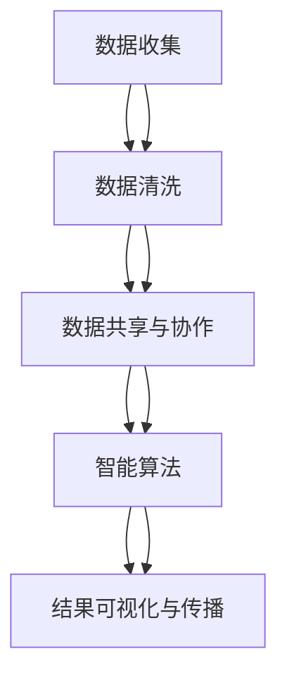

                 

# 连接全球智慧：人类计算的全球影响力

## 1. 背景介绍

### 1.1 问题由来
进入21世纪以来，随着信息技术的飞速发展和互联网的广泛普及，人类社会已进入一个以数字化、网络化、智能化为特征的新时代。在这个信息爆炸的时代，人类计算（Human Computation）通过大规模的协作和数据共享，正在以前所未有的方式改变我们的生活方式和社会结构。

全球智慧的汇聚为科学研究和公共决策提供了前所未有的机遇，但同时也带来了新的挑战，如信息过载、隐私保护、数据治理等。如何最大化利用人类计算的潜力，同时应对这些挑战，成为当今技术和社会发展中的重要议题。

### 1.2 问题核心关键点
全球智慧的实现离不开高效、安全、可信的人类计算框架。为此，我们需要理解人类计算的概念与架构，探索其在不同领域的应用，并解决随之而来的技术问题。

人类计算的核心关键点包括：
1. **数据共享与协作**：如何高效地组织、共享和协作数据，实现信息互联互通。
2. **隐私保护与合规**：如何在数据共享过程中保障用户隐私和数据安全，遵守相关法律法规。
3. **分布式计算与优化**：如何设计分布式计算系统，提升计算效率和资源利用率。
4. **智能算法与优化**：如何利用先进算法优化数据处理和分析过程，提高决策的科学性和准确性。
5. **治理机制与标准**：如何制定数据治理和应用标准，确保数据的质量和可信度。

### 1.3 问题研究意义
深入研究人类计算的全球影响力，有助于我们理解信息时代社会的运作方式，探索新的科技应用和社会治理路径。具体而言，具有以下意义：

1. **提升科学研究和公共决策的效率**：通过大规模数据共享和协作，加速科学研究进程，提高公共决策的科学性和公正性。
2. **推动技术创新和社会进步**：利用人类计算的强大能力，催生新的技术应用和服务模式，推动社会经济的全面发展。
3. **构建全球信息生态**：通过标准化的数据治理和应用体系，促进全球信息共享和互操作，打造开放、包容、合作的信息生态。
4. **应对全球性挑战**：利用人类计算技术，解决环境污染、公共卫生、贫困等全球性问题，促进可持续发展。

## 2. 核心概念与联系

### 2.1 核心概念概述

人类计算（Human Computation）是指通过大规模的人类协作和数据共享，实现复杂问题的高效解决。其核心在于将人类智慧与计算能力结合，发挥数据科学和人工智能的优势，推动社会和科技的发展。

### 2.2 核心概念原理和架构的 Mermaid 流程图(Mermaid 流程节点中不要有括号、逗号等特殊字符)



在这个流程图中，数据收集是基础，数据清洗保证数据质量，数据共享与协作实现信息互联互通，智能算法提升计算效率和决策科学性，结果可视化与传播使决策结果普惠社会。

### 2.3 核心概念联系

人类计算框架由以下几个关键组件组成：

- **数据平台**：如Google BigQuery、AWS EMR等，提供数据存储、处理和分析的平台服务。
- **智能算法**：如TensorFlow、PyTorch等深度学习框架，提供强大的数据处理和分析能力。
- **分布式计算**：如Hadoop、Spark等分布式计算框架，实现大规模数据处理和计算。
- **隐私保护**：如差分隐私、联邦学习等技术，保护用户隐私和数据安全。
- **数据治理**：如GDPR、ISO27001等法规标准，确保数据治理的合法合规。

这些组件相互协作，共同构建了人类计算的生态系统，支撑全球智慧的汇聚和应用。

## 3. 核心算法原理 & 具体操作步骤

### 3.1 算法原理概述

人类计算的核心算法包括：

- **分布式算法**：如MapReduce、Spark等，实现大规模数据并行处理。
- **智能算法**：如机器学习、深度学习等，提升数据处理和分析的效率和准确性。
- **隐私保护算法**：如差分隐私、联邦学习等，保障用户隐私和数据安全。

这些算法共同构成了人类计算的计算基础，支撑全球智慧的汇聚和应用。

### 3.2 算法步骤详解

人类计算的核心步骤包括：

1. **数据收集与清洗**：从各类数据源收集数据，并进行数据清洗和预处理。
2. **数据存储与共享**：将处理后的数据存储在云端数据平台，实现数据共享和互操作。
3. **分布式计算与优化**：使用分布式算法处理大规模数据，优化计算效率和资源利用率。
4. **智能算法与优化**：利用智能算法对数据进行分析和建模，提升决策的科学性和准确性。
5. **结果可视化与传播**：将分析结果进行可视化，通过多渠道传播，促进社会共享和应用。

### 3.3 算法优缺点

人类计算的优势在于：

- **数据规模庞大**：可以处理海量数据，获取全局视角的洞察力。
- **协作效率高**：通过大规模协作和数据共享，实现快速高效的信息流动。
- **决策科学化**：利用智能算法进行数据分析和建模，提高决策的科学性和准确性。

但同时也面临以下挑战：

- **数据质量参差不齐**：不同来源的数据质量不一，需要进行清洗和预处理。
- **隐私和安全风险**：数据共享过程中存在隐私泄露和数据安全风险。
- **计算资源消耗大**：大规模数据处理和分析需要高配置的计算资源。
- **技术门槛高**：需要具备高水平的技术能力，才能设计和实施高效的人类计算系统。

### 3.4 算法应用领域

人类计算在多个领域都有广泛的应用，例如：

- **科学研究**：如基因组学、气候变化等，通过大规模数据共享和协作，加速科学研究和发现。
- **公共决策**：如公共卫生、城市规划等，利用大数据分析和智能算法，提高决策的科学性和效率。
- **商业智能**：如市场分析、客户行为预测等，通过数据挖掘和智能分析，提升商业决策的精准性和效果。
- **社会治理**：如犯罪预测、社会舆情分析等，通过数据分析和智能建模，提升社会治理的效率和效果。
- **环境监测**：如污染监测、生态保护等，利用卫星遥感数据和智能算法，实现环境问题的早期预警和科学治理。

## 4. 数学模型和公式 & 详细讲解 & 举例说明

### 4.1 数学模型构建

假设人类计算的数据平台为 $D$，智能算法为 $A$，分布式计算框架为 $C$，隐私保护技术为 $P$，数据治理标准为 $G$。其数学模型可以表示为：

$$
Y = f(D, A, C, P, G)
$$

其中 $Y$ 为人类计算的结果，$D$ 为数据平台，$A$ 为智能算法，$C$ 为分布式计算框架，$P$ 为隐私保护技术，$G$ 为数据治理标准。

### 4.2 公式推导过程

以公共决策为例，假设原始数据集为 $D$，智能算法为 $A$，分布式计算框架为 $C$，隐私保护技术为 $P$，数据治理标准为 $G$。数据清洗和预处理的过程可以表示为：

$$
D_{clean} = D \rightarrow \text{clean}(D)
$$

分布式计算的过程可以表示为：

$$
D_{dist} = D_{clean} \rightarrow \text{dist}(D_{clean})
$$

智能算法的数据分析过程可以表示为：

$$
Y_{model} = A(D_{dist})
$$

隐私保护技术的应用过程可以表示为：

$$
Y_{secure} = P(Y_{model})
$$

最终结果的生成过程可以表示为：

$$
Y = \text{postprocess}(Y_{secure})
$$

其中 $\text{postprocess}$ 为结果后处理操作，如数据可视化和传播。

### 4.3 案例分析与讲解

以气候变化研究为例，假设收集了全球各地的气象数据，数据量庞大且来源复杂。数据清洗和预处理过程如下：

1. **数据清洗**：清洗数据中的缺失值和异常值，去除噪音和冗余信息。
2. **数据整合**：将来自不同来源的数据进行整合，建立统一的数据格式。
3. **数据分布式计算**：使用Hadoop或Spark框架，将数据分散存储和处理，提升计算效率。
4. **智能算法分析**：利用深度学习模型，对数据进行分析和建模，预测未来的气候变化趋势。
5. **隐私保护和治理**：应用差分隐私技术，保护用户隐私；遵守GDPR等数据治理标准，确保数据合法合规。
6. **结果可视化与传播**：将分析结果进行可视化，通过报告和数据平台进行传播，促进全球共享和应用。

## 5. 项目实践：代码实例和详细解释说明

### 5.1 开发环境搭建

在开始项目实践前，需要搭建好开发环境。以下是使用Python进行PyTorch开发的快速搭建流程：

1. 安装Anaconda：从官网下载并安装Anaconda，用于创建独立的Python环境。
2. 创建并激活虚拟环境：
```bash
conda create -n pytorch-env python=3.8 
conda activate pytorch-env
```
3. 安装PyTorch：根据CUDA版本，从官网获取对应的安装命令。例如：
```bash
conda install pytorch torchvision torchaudio cudatoolkit=11.1 -c pytorch -c conda-forge
```
4. 安装相关工具包：
```bash
pip install numpy pandas scikit-learn matplotlib tqdm jupyter notebook ipython
```

完成上述步骤后，即可在`pytorch-env`环境中开始项目实践。

### 5.2 源代码详细实现

以下是一个简单的数据清洗和预处理的Python代码示例：

```python
import pandas as pd
from sklearn.preprocessing import StandardScaler
from sklearn.impute import SimpleImputer

# 读取数据
data = pd.read_csv('data.csv')

# 数据清洗
data.dropna(inplace=True)
data = data.drop(columns=['id', 'timestamp'])

# 数据预处理
scaler = StandardScaler()
imputer = SimpleImputer(strategy='median')
data = imputer.fit_transform(data)
data = scaler.fit_transform(data)

# 数据保存
data.to_csv('processed_data.csv', index=False)
```

### 5.3 代码解读与分析

**代码解释**：
- 首先使用pandas库读取数据，并去除不必要的列。
- 使用sklearn库进行数据清洗，去除缺失值和异常值，并进行标准化处理。
- 使用SimpleImputer进行缺失值填充，使用中位数作为填补策略。
- 最终将处理后的数据保存到本地文件中。

**代码分析**：
- 数据清洗和预处理是数据科学中的重要步骤，直接影响后续的分析和建模效果。
- 使用pandas和sklearn等库，可以方便地进行数据清洗和预处理。
- 标准化和缺失值填补是常用的数据预处理方法，可以提升数据质量，增强模型效果。

### 5.4 运行结果展示

运行上述代码后，输出文件`processed_data.csv`中包含了清洗和预处理后的数据，可用于后续的数据分析和建模。

## 6. 实际应用场景

### 6.1 智慧城市治理

智慧城市治理是全球智慧的重要应用场景之一。通过利用人类计算技术，可以实现城市管理的智能化和精细化。

具体而言，智慧城市治理可以包括：

- **交通管理**：利用交通数据分析，实现智能交通信号灯控制、实时交通流量预测等。
- **公共安全**：通过视频监控和数据分析，实现犯罪预测、应急响应等。
- **能源管理**：利用能源数据和智能算法，优化能源分配和消耗，提升能源利用效率。
- **环境保护**：通过环境监测数据和智能建模，实现环境问题的早期预警和科学治理。

### 6.2 科学研究

科学研究是全球智慧的重要推动力之一。通过利用人类计算技术，可以加速科学研究进程，提升研究效率和质量。

具体而言，科学研究可以包括：

- **基因组学研究**：利用大规模基因组数据，进行基因组分析、疾病预测等研究。
- **气候变化研究**：利用全球气象数据，进行气候变化预测、灾害预警等研究。
- **天文学研究**：利用天文数据和智能算法，进行天体探测、宇宙演化等研究。
- **社会科学研究**：利用社会调查数据和智能分析，进行人口预测、社会行为分析等研究。

### 6.3 商业智能

商业智能是全球智慧在商业领域的重要应用之一。通过利用人类计算技术，可以提升商业决策的精准性和效果。

具体而言，商业智能可以包括：

- **市场分析**：利用消费者行为数据和智能算法，进行市场趋势预测、客户细分等。
- **供应链优化**：利用供应链数据和智能分析，进行库存管理、物流优化等。
- **风险管理**：利用金融数据和智能建模，进行信用评估、风险预测等。
- **客户关系管理**：利用客户数据和智能分析，进行客户行为分析、客户细分等。

### 6.4 社会治理

社会治理是全球智慧在社会管理领域的重要应用之一。通过利用人类计算技术，可以提升社会治理的效率和效果。

具体而言，社会治理可以包括：

- **犯罪预测**：利用犯罪数据和智能建模，进行犯罪预测、治安管理等。
- **公共健康**：利用医疗数据和智能分析，进行疾病预测、健康管理等。
- **教育管理**：利用学生数据和智能分析，进行教育评估、课程推荐等。
- **社会舆情分析**：利用社交媒体数据和智能分析，进行舆情监测、舆论引导等。

## 7. 工具和资源推荐

### 7.1 学习资源推荐

为了帮助开发者系统掌握人类计算的理论基础和实践技巧，这里推荐一些优质的学习资源：

1. 《Human Computation: A Survey》系列博文：由人类计算专家撰写，深入浅出地介绍了人类计算的原理、架构和应用。

2. CS258《Human-Computer Interaction》课程：斯坦福大学开设的HCI明星课程，涵盖人类计算的交互设计、人机协作等主题。

3. 《Human Computation and Information Systems》书籍：系统介绍了人类计算在信息系统中应用的技术和实践，提供了丰富的案例和代码实现。

4. HCI-SSS conference：人类计算领域的顶级会议，汇聚了大量前沿研究成果和实践经验。

5. IEEE Xplore：IEEE数据库，提供了大量关于人类计算的论文和文献，是学习研究的宝贵资源。

通过对这些资源的学习实践，相信你一定能够全面掌握人类计算的精髓，并用于解决实际的计算问题。

### 7.2 开发工具推荐

高效的开发离不开优秀的工具支持。以下是几款用于人类计算开发的常用工具：

1. PyTorch：基于Python的开源深度学习框架，灵活动态的计算图，适合快速迭代研究。

2. TensorFlow：由Google主导开发的开源深度学习框架，生产部署方便，适合大规模工程应用。

3. Scikit-learn：机器学习库，提供各种机器学习算法和工具，适合数据科学应用。

4. Apache Spark：分布式计算框架，支持大规模数据处理和分析，适合大数据应用。

5. TensorBoard：TensorFlow配套的可视化工具，可实时监测模型训练状态，提供丰富的图表呈现方式。

6. Weights & Biases：模型训练的实验跟踪工具，可以记录和可视化模型训练过程中的各项指标，方便对比和调优。

合理利用这些工具，可以显著提升人类计算的开发效率，加快创新迭代的步伐。

### 7.3 相关论文推荐

人类计算的研究始于学界的持续探索，以下是几篇奠基性的相关论文，推荐阅读：

1. Human Computation for Future Internet: An Overview of Latest Results（IEEE Xplore）：综述了人类计算在互联网应用中的最新进展和研究成果。

2. Human-Computer Interaction: A Survey and Tutorial（IEEE Xplore）：综述了人类计算在交互设计、协作系统中的研究进展和技术挑战。

3. The Future of Human Computation: An Inception Paper（ACM）：探讨了人类计算的未来发展方向和技术挑战，为研究者提供了广阔的想象空间。

4. Human Computational Systems: A Survey of Recent Advances（IEEE Xplore）：综述了人类计算系统在多个领域的应用和研究成果，展示了其广泛的应用前景。

这些论文代表了大规模计算和协作研究的前沿进展，是进一步探索和应用人类计算的重要参考。

## 8. 总结：未来发展趋势与挑战

### 8.1 总结

本文对人类计算的概念、原理和应用进行了全面系统的介绍。通过梳理数据共享、智能算法、分布式计算、隐私保护和数据治理等关键技术，明确了人类计算的计算基础和应用生态。

### 8.2 未来发展趋势

展望未来，人类计算将呈现以下几个发展趋势：

1. **数据规模不断扩大**：随着互联网的普及和物联网的扩展，数据规模将持续增长，推动人类计算能力的不断提升。

2. **协作效率显著提高**：利用先进技术和大规模平台，实现数据共享和协作，提高信息流动效率和决策科学性。

3. **智能算法日益丰富**：结合机器学习、深度学习、强化学习等技术，提升数据分析和建模的能力，推动科学研究和社会治理的深入发展。

4. **隐私保护技术进步**：通过差分隐私、联邦学习等技术，保护用户隐私和数据安全，提升数据治理的标准和合规性。

5. **治理机制不断完善**：制定和应用数据治理标准，确保数据的质量和可信度，保障数据共享和应用的安全性和合法性。

6. **跨领域融合创新**：结合人工智能、区块链、物联网等技术，推动人类计算与其他领域的深度融合，催生新的应用场景和创新模式。

### 8.3 面临的挑战

尽管人类计算技术已经取得了显著进展，但在迈向更加智能化、普适化应用的过程中，仍面临诸多挑战：

1. **数据质量参差不齐**：不同来源的数据质量不一，需要进行清洗和预处理。

2. **隐私和安全风险**：数据共享过程中存在隐私泄露和数据安全风险。

3. **计算资源消耗大**：大规模数据处理和分析需要高配置的计算资源。

4. **技术门槛高**：需要具备高水平的技术能力，才能设计和实施高效的人类计算系统。

5. **治理机制不完善**：数据治理标准不统一，存在数据质量和安全问题。

6. **跨领域协作困难**：不同领域的知识和技术难以充分整合，阻碍人类计算的深入发展。

### 8.4 研究展望

面对人类计算面临的挑战，未来的研究需要在以下几个方面寻求新的突破：

1. **数据质量控制**：开发高效的数据清洗和预处理算法，提升数据质量和可用性。

2. **隐私和安全技术**：开发更加高效、安全的隐私保护和数据治理技术，确保数据的安全和合法合规。

3. **分布式计算优化**：优化分布式计算框架和算法，提升大规模数据处理和分析的效率和资源利用率。

4. **智能算法融合**：结合机器学习、深度学习、强化学习等技术，提升数据分析和建模的能力，推动科学研究和社会治理的深入发展。

5. **跨领域协作机制**：建立跨领域的知识和技术整合机制，推动人类计算与其他领域的深度融合，催生新的应用场景和创新模式。

6. **技术普及和推广**：通过教育和培训，提升技术普及度和应用能力，推动人类计算在各行各业的应用和落地。

通过不断探索和创新，人类计算技术必将在未来迈向更高的台阶，为社会和经济的发展注入新的动力。

## 9. 附录：常见问题与解答

**Q1：如何确保数据的质量和可信度？**

A: 数据的质量和可信度是数据科学的核心问题之一。确保数据质量和可信度的方法包括：

1. **数据清洗**：清洗数据中的缺失值、异常值和噪音，提升数据质量。
2. **数据预处理**：使用标准化、归一化等方法，提升数据的一致性和可用性。
3. **数据验证**：使用数据验证方法，如交叉验证、K折验证等，确保数据的质量和可靠性。
4. **数据治理**：制定和应用数据治理标准，确保数据的质量和可信度，保障数据共享和应用的安全性和合法性。

**Q2：如何在数据共享过程中保障用户隐私和数据安全？**

A: 保障用户隐私和数据安全是数据共享中的重要问题。保障数据隐私和安全的方法包括：

1. **差分隐私**：通过加入噪音，保护用户隐私，确保数据不会暴露用户个人信息。
2. **联邦学习**：在不共享数据的情况下，通过模型聚合技术，提升模型性能，保护数据隐私。
3. **加密技术**：使用数据加密技术，保护数据传输和存储的安全性，防止数据泄露和篡改。
4. **数据匿名化**：对数据进行匿名化处理，保护用户隐私，防止数据被识别。
5. **访问控制**：通过访问控制技术，限制数据的访问权限，防止未经授权的访问和使用。

**Q3：如何设计高效的人类计算系统？**

A: 设计高效的人类计算系统需要考虑以下几个方面：

1. **数据平台选择**：选择合适的大数据平台，如Hadoop、Spark等，提供高效的数据存储和处理能力。
2. **智能算法优化**：优化算法模型，提升计算效率和精度，确保数据处理的科学性和准确性。
3. **分布式计算优化**：优化分布式计算框架，提升大规模数据处理和分析的效率和资源利用率。
4. **隐私保护技术**：应用差分隐私、联邦学习等技术，保护用户隐私和数据安全。
5. **数据治理标准**：制定和应用数据治理标准，确保数据的质量和可信度，保障数据共享和应用的安全性和合法性。

**Q4：如何提高人类计算的协作效率？**

A: 提高人类计算的协作效率需要考虑以下几个方面：

1. **数据共享平台**：建立高效的数据共享平台，实现数据互联互通，促进信息流动。
2. **协作工具**：使用协作工具，如Jupyter Notebook、Git等，提升协作效率和效果。
3. **团队管理**：建立有效的团队管理机制，明确任务分工和责任，确保协作顺利进行。
4. **通信技术**：使用通信技术，如视频会议、即时通讯等，提升信息交流的效率和效果。
5. **数据标准化**：使用统一的数据标准和格式，确保数据的一致性和可用性。

**Q5：人类计算技术如何应用于全球智慧？**

A: 人类计算技术可以通过以下几个方面应用于全球智慧：

1. **数据共享和协作**：通过大规模数据共享和协作，实现信息互联互通，提升科学研究和社会治理的效率和效果。
2. **智能算法和分析**：利用先进算法和技术，提升数据分析和建模的能力，推动科学研究和社会治理的深入发展。
3. **分布式计算和优化**：优化分布式计算框架和算法，提升大规模数据处理和分析的效率和资源利用率，推动全球智慧的实现。
4. **隐私保护和数据治理**：通过差分隐私、联邦学习等技术，保护用户隐私和数据安全，确保数据共享和应用的安全性和合法性。
5. **跨领域协作和融合**：结合人工智能、区块链、物联网等技术，推动人类计算与其他领域的深度融合，催生新的应用场景和创新模式。

---

作者：禅与计算机程序设计艺术 / Zen and the Art of Computer Programming

