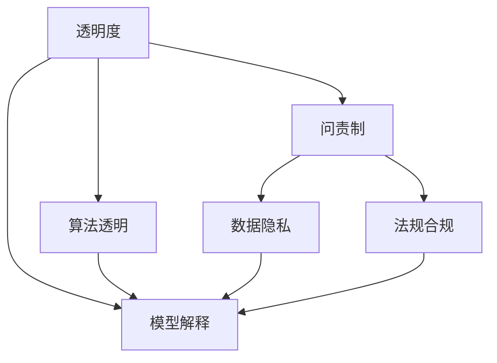

                 

# 透明度和问责制：负责任地使用人类计算

> 关键词：透明度,问责制,人类计算,算法透明,人工智能伦理,数据隐私,模型解释,可解释性,法规合规

## 1. 背景介绍

在当今数据驱动的时代，计算技术的快速发展为人类社会带来了前所未有的便利与效率提升。然而，随着算法的日益复杂和算力的不断增强，人类计算在许多领域的应用，如自动化决策、智能推荐、风险评估等，也逐渐引起了广泛关注。特别是那些依赖深度学习等人工智能技术的系统，由于其模型的复杂性和黑盒特性，可能引发一系列问题，如透明度不足、公平性争议、隐私泄露等。如何在追求智能化的同时，保持对人类计算过程的掌控，确保决策的公正性、透明性和安全性，成为我们必须面对的重要议题。

### 1.1 问题由来

随着人工智能技术在商业、医疗、法律等领域的深度应用，人类计算逐渐成为决策的核心。例如，金融风控、信用评分、医疗诊断等领域，机器学习模型被广泛应用于数据的处理和分析，辅助决策。然而，由于算法复杂性和模型黑盒化，我们往往难以理解模型的内部机制和决策过程，这不仅增加了对算法的依赖性，也可能导致错误的决策和伦理问题。

近年来，社会各界对人工智能技术应用的不透明性和不可解释性提出了诸多质疑，要求算法设计者和使用者在确保算法的公平性、公正性和可解释性的同时，应具备高度的透明度和问责制。许多国家和地区也开始制定和实施相关的法规，对人工智能技术的应用提出了严格的要求。

## 2. 核心概念与联系

### 2.1 核心概念概述

为了更好地理解如何负责任地使用人类计算，本节将介绍几个核心概念，并探讨它们之间的联系：

- **透明度（Transparency）**：指算法和决策过程的可理解性和可解释性，即算法的设计逻辑、数据处理方式和最终输出结果应是可被解释和验证的。

- **问责制（Accountability）**：指算法和决策的责任归属，即算法设计者和使用者应明确对算法输出和结果的责任，确保算法的公正性和无害性。

- **人类计算（Human Computation）**：指在人工智能辅助下，人类处理数据、设计算法和解释结果的过程。人类计算的透明度和问责制，对于避免算法滥用、保障决策公正性至关重要。

- **算法透明（Algorithmic Transparency）**：指算法工作原理和内部决策逻辑的可理解性和可解释性。这要求算法应具备可解释性，允许用户了解算法如何处理输入数据并生成输出。

- **数据隐私（Data Privacy）**：指保护个人数据不被非法获取、滥用或泄露。透明度和问责制要求在数据处理和算法训练过程中，应遵守数据隐私法规，保护用户隐私。

- **模型解释（Model Interpretation）**：指通过特定方法对机器学习模型进行解释，以揭示其内部工作机制和决策逻辑。这有助于增强算法的可解释性和透明度，提高用户信任。

- **法规合规（Regulatory Compliance）**：指算法设计和使用过程中，应遵守相关法律法规的规定，确保算法的公平性、公正性和无害性。

这些核心概念共同构成了负责任地使用人类计算的基本框架，指导着算法的设计、开发和应用。

### 2.2 核心概念联系

这些概念之间的关系可以通过以下Mermaid流程图来展示：



这个流程图展示了各个概念之间的逻辑联系：

1. **透明度**通过**算法透明**和**模型解释**，确保算法的内部逻辑和决策过程可以被理解。
2. **问责制**依赖于透明度和数据隐私，确保算法的公平性和无害性。
3. **数据隐私**和**法规合规**直接关联，保护用户隐私并遵守法律规定。
4. **模型解释**进一步增强了算法的透明度，有助于用户理解和信任算法。

这些概念相互交织，共同构成了一个负责任地使用人类计算的全面体系。

## 3. 核心算法原理 & 具体操作步骤
### 3.1 算法原理概述

透明度和问责制的实现，依赖于算法设计、数据处理和结果解释的各个环节。本文将通过具体的算法原理和操作步骤，详细阐述如何通过技术手段实现透明度和问责制。

### 3.2 算法步骤详解

实现透明度和问责制，通常包括以下几个关键步骤：

**Step 1: 算法设计**
- 设计算法时，应考虑其可解释性和透明性，避免过于复杂的黑盒模型。优先选择可解释性强的算法，如线性模型、决策树等。

**Step 2: 数据处理**
- 在数据处理过程中，应公开数据来源、处理方法和样本分布，确保数据处理的透明性和公正性。对数据进行适当的清洗和标注，减少偏差和噪声。

**Step 3: 模型训练**
- 在模型训练过程中，应使用透明度和问责制导向的超参数选择和正则化技术，避免过拟合和模型复杂性。同时，应使用透明的训练过程，记录训练日志和结果，便于后续审计。

**Step 4: 模型评估**
- 使用透明度和问责制导向的评估指标，如公平性、准确性、鲁棒性等，对模型进行全面评估。评估结果应公开，供用户和监管机构审查。

**Step 5: 结果解释**
- 提供模型解释工具和文档，帮助用户理解模型的工作原理和决策依据。例如，使用LIME、SHAP等工具生成局部解释，或设计可解释性高的模型架构，如决策树、LINFA等。

**Step 6: 用户反馈和持续改进**
- 在应用过程中，应建立用户反馈机制，收集用户意见和建议，及时调整和优化算法。同时，应公开反馈结果和改进措施，确保算法的公正性和透明性。

### 3.3 算法优缺点

实现透明度和问责制的算法设计，具有以下优点：

1. **增强用户信任**：透明的算法设计和使用过程，有助于增强用户对算法的信任，降低社会对人工智能技术的抵触情绪。
2. **提高决策公正性**：通过透明度和问责制的约束，避免算法滥用和偏见，确保决策的公正性和公平性。
3. **减少法律风险**：遵守法规合规要求，降低法律风险和潜在的法律诉讼风险。

同时，也存在一些缺点：

1. **设计复杂性**：实现透明度和问责制的设计复杂性较高，需要更多的技术和资源投入。
2. **解释局限性**：当前的模型解释技术仍存在局限性，难以全面解释复杂的深度学习模型。
3. **资源消耗**：透明度和问责制导向的设计和评估，可能需要消耗更多的计算资源和时间，影响模型的实际应用效率。

### 3.4 算法应用领域

透明度和问责制的实现，适用于各种应用领域，特别是那些对社会影响较大的领域，如金融、医疗、司法等。以下是几个典型应用场景：

**金融风控**：在信用评分、贷款审批等场景中，使用透明度和问责制导向的模型设计和评估，确保算法的公平性和公正性，保护用户隐私，避免滥用风险。

**医疗诊断**：在疾病诊断、治疗推荐等场景中，使用透明度和问责制的模型设计和解释，确保诊断和治疗方案的公正性和安全性，减少误诊风险。

**司法判决**：在判决辅助、案件预测等场景中，使用透明度和问责制的模型设计和评估，确保判决的公正性和公平性，避免算法偏见。

**智能推荐**：在个性化推荐、广告投放等场景中，使用透明度和问责制的模型设计和解释，确保推荐结果的公正性和无害性，避免推荐偏见。

这些应用场景展示了透明度和问责制在实际应用中的重要性，以及在提升系统透明度和用户信任方面的价值。

## 4. 数学模型和公式 & 详细讲解 & 举例说明
### 4.1 数学模型构建

实现透明度和问责制的算法设计，通常涉及多个数学模型和公式。以下是一些关键模型和公式的详细构建和解释：

**线性回归模型**：

$$
y = \beta_0 + \beta_1 x_1 + \beta_2 x_2 + ... + \beta_n x_n + \epsilon
$$

其中，$y$ 为预测值，$\beta_0$ 为截距，$\beta_i$ 为回归系数，$x_i$ 为自变量，$\epsilon$ 为误差项。线性回归模型具备可解释性强的特点，适用于透明度要求较高的场景。

**决策树模型**：


决策树模型通过树形结构展示决策逻辑，每个节点表示一个特征或条件，叶子节点表示最终的决策结果。决策树模型的可解释性强，易于理解和审计。

**LIME局部解释模型**：

$$
\text{Explainer}(x) = \sum_i \alpha_i \text{Model}(x + \delta_i)
$$

其中，$\text{Model}$ 为被解释的模型，$\delta_i$ 为扰动向量，$\alpha_i$ 为权重。LIME通过扰动数据点生成局部解释，揭示模型在特定输入下的决策过程。

### 4.2 公式推导过程

以下是对线性回归模型和决策树模型的公式推导过程：

**线性回归模型推导**：

假设有一组训练数据 $\{(x_1, y_1), (x_2, y_2), ..., (x_n, y_n)\}$，其中 $y_i$ 为标签，$x_i = [x_{i1}, x_{i2}, ..., x_{in}]$ 为特征向量。线性回归模型的目标是找到一组系数 $\beta$，使得预测值 $y$ 尽可能接近真实标签 $y_i$。通过最小化均方误差损失函数：

$$
\min_\beta \frac{1}{2N} \sum_{i=1}^N (y_i - (\beta_0 + \beta_1 x_{i1} + \beta_2 x_{i2} + ... + \beta_n x_{in}))^2
$$

可以求得回归系数 $\beta = (X^TX)^{-1}X^Ty$，其中 $X$ 为特征矩阵，$y$ 为标签向量。

**决策树模型推导**：

决策树模型的构建分为训练和预测两个步骤。在训练过程中，通过递归地选择最优特征和阈值，构建决策树。假设当前节点 $t$ 的特征 $x_j$ 和阈值 $th_j$，则左子树节点 $t_l$ 和右子树节点 $t_r$ 的构建如下：

$$
t_l = \{x_i| x_j \leq th_j\}
$$
$$
t_r = \{x_i| x_j > th_j\}
$$

预测过程中，根据输入数据 $x$ 的特征值，按照决策树的分裂路径，最终得到预测结果 $y$。

### 4.3 案例分析与讲解

以下是一个基于决策树的金融风控案例分析：

假设有一家银行需要对申请贷款的客户进行信用评分。收集历史贷款数据，包括客户年龄、收入、婚姻状况、还款记录等特征，以及是否违约的标签。使用决策树模型进行建模，选择年龄、收入、婚姻状况作为特征，构建决策树。

1. **数据处理**：对数据进行清洗和标注，确保数据质量和完整性。
2. **模型训练**：选择年龄、收入、婚姻状况作为决策树的特征，构建决策树模型。
3. **模型评估**：使用准确率、召回率等指标评估模型的性能，确保模型的公平性和公正性。
4. **结果解释**：通过决策树的结构图，解释模型决策逻辑。例如，如果一个客户被拒绝贷款，决策树会显示其背后的决策路径和特征权重。
5. **用户反馈**：收集客户反馈，分析模型的公正性和透明性，及时调整和优化模型。

这个案例展示了如何通过决策树模型实现透明度和问责制，确保贷款评分的公正性和透明性。

## 5. 项目实践：代码实例和详细解释说明
### 5.1 开发环境搭建

在进行透明度和问责制的项目实践前，我们需要准备好开发环境。以下是使用Python进行Scikit-Learn开发的简单配置流程：

1. 安装Anaconda：从官网下载并安装Anaconda，用于创建独立的Python环境。

2. 创建并激活虚拟环境：
```bash
conda create -n transparency-env python=3.8 
conda activate transparency-env
```

3. 安装Scikit-Learn：
```bash
conda install scikit-learn
```

4. 安装其他工具包：
```bash
pip install numpy pandas matplotlib seaborn
```

完成上述步骤后，即可在`transparency-env`环境中开始项目实践。

### 5.2 源代码详细实现

下面我们以一个简单的金融风控任务为例，给出使用Scikit-Learn对线性回归模型进行透明度和问责制实践的PyTorch代码实现。

首先，定义数据处理函数：

```python
from sklearn.datasets import fetch_california_housing
from sklearn.model_selection import train_test_split
from sklearn.linear_model import LinearRegression
import pandas as pd
import numpy as np

def load_data():
    housing = fetch_california_housing()
    X = pd.DataFrame(data=housing.data, columns=housing.feature_names)
    y = pd.Series(data=housing.target)
    return X, y
```

然后，定义模型和优化器：

```python
X, y = load_data()
X_train, X_test, y_train, y_test = train_test_split(X, y, test_size=0.2, random_state=42)

model = LinearRegression()
```

接着，定义训练和评估函数：

```python
def train_model(model, X_train, y_train, X_test, y_test):
    model.fit(X_train, y_train)
    y_pred_train = model.predict(X_train)
    y_pred_test = model.predict(X_test)
    
    print("R-squared Train:", model.score(X_train, y_train))
    print("R-squared Test:", model.score(X_test, y_test))
    print("Model Intercept:", model.intercept_)
    print("Model Coefficients:", model.coef_)
    return y_pred_train, y_pred_test
```

最后，启动训练流程并在测试集上评估：

```python
y_pred_train, y_pred_test = train_model(model, X_train, y_train, X_test, y_test)
```

以上就是使用Scikit-Learn对线性回归模型进行金融风控任务透明度和问责制实践的完整代码实现。可以看到，通过Scikit-Learn，我们能够快速实现一个简单的线性回归模型，并进行透明度和问责制的评估。

### 5.3 代码解读与分析

让我们再详细解读一下关键代码的实现细节：

**load_data函数**：
- 使用Scikit-Learn的fetch_california_housing函数加载加州房价数据集，分为训练集和测试集。
- 使用pandas的DataFrame和Series，将数据转换为方便处理的格式。

**train_model函数**：
- 使用LinearRegression模型进行训练，并返回训练集和测试集的预测结果。
- 计算R-squared（决定系数）评估模型性能，输出模型截距和系数，方便解释模型决策过程。

**启动训练流程**：
- 调用train_model函数，将数据集和模型传递进去，获得训练集和测试集的预测结果。

可以看到，Scikit-Learn提供了方便的模型实现和评估工具，能够帮助开发者快速构建和评估透明度和问责制导向的模型。

## 6. 实际应用场景
### 6.1 金融风控

在金融风控领域，透明度和问责制的应用至关重要。传统的信用评分模型通常依赖复杂的统计和机器学习技术，用户难以理解其决策逻辑和依据。通过透明度和问责制的约束，使用线性回归、决策树等可解释性强的模型，可以显著提升用户信任和模型公平性。

**案例**：
- 某银行使用线性回归模型进行信用评分，选择年龄、收入、婚姻状况等特征。模型训练和评估过程中，公开数据处理方法和模型解释文档，确保模型的公正性和透明性。
- 在用户申请贷款时，提供详细的决策解释，解释模型如何根据用户的特征生成信用评分，帮助用户理解并信任模型的输出。

### 6.2 医疗诊断

在医疗诊断领域，透明度和问责制对于提高诊断准确性和保障患者权益至关重要。传统的医疗诊断模型往往使用复杂的深度学习技术，难以解释其决策过程。通过透明度和问责制的约束，使用可解释性强的模型，可以提升诊断的透明性和用户信任。

**案例**：
- 某医院使用决策树模型进行疾病诊断，选择症状、病史、实验室检查结果等特征。模型训练和评估过程中，公开数据来源和处理方式，确保模型的公正性和透明性。
- 在诊断结果生成后，提供详细的决策解释，解释模型如何根据患者的特征生成诊断结果，帮助患者理解并信任医生的诊断。

### 6.3 智能推荐

在智能推荐领域，透明度和问责制可以帮助提升推荐结果的公正性和用户满意度。传统的推荐系统通常使用复杂的协同过滤和深度学习技术，难以解释其推荐依据。通过透明度和问责制的约束，使用可解释性强的模型，可以提升推荐系统的透明性和用户信任。

**案例**：
- 某电商平台使用线性回归模型进行商品推荐，选择用户历史行为数据、商品属性等特征。模型训练和评估过程中，公开数据处理方法和模型解释文档，确保模型的公正性和透明性。
- 在推荐结果生成后，提供详细的推荐解释，解释模型如何根据用户和商品特征生成推荐结果，帮助用户理解并信任推荐系统的输出。

### 6.4 未来应用展望

随着透明度和问责制技术的不断发展，其在更多领域的应用前景值得期待。以下是几个未来应用展望：

1. **智能制造**：在智能制造领域，透明度和问责制可以帮助提高生产过程的自动化和智能化水平，确保生产决策的公正性和透明性。

2. **智慧城市**：在智慧城市治理中，透明度和问责制可以帮助提升城市管理的自动化和智能化水平，确保城市决策的公正性和透明性。

3. **教育评估**：在教育评估领域，透明度和问责制可以帮助提升评估过程的公正性和透明性，确保评估结果的客观性和可信度。

4. **司法判决**：在司法判决领域，透明度和问责制可以帮助提升判决过程的公正性和透明性，确保判决结果的客观性和公正性。

5. **环境保护**：在环境保护领域，透明度和问责制可以帮助提升环境监测和治理过程的公正性和透明性，确保环境保护措施的有效性和可持续性。

未来，随着透明度和问责制技术的不断发展和应用，其在更多领域的应用将得到广泛推广，为社会治理和经济发展带来新的机遇。

## 7. 工具和资源推荐
### 7.1 学习资源推荐

为了帮助开发者系统掌握透明度和问责制技术，这里推荐一些优质的学习资源：

1. **《人工智能伦理与法律》课程**：由斯坦福大学开设的关于人工智能伦理和法律的在线课程，涵盖透明度、问责制等核心议题。
2. **《算法透明性与解释》书籍**：详细介绍了算法透明性和可解释性的概念、方法和实践，是理解透明度和问责制的经典之作。
3. **《数据隐私保护与法律》书籍**：全面介绍了数据隐私保护的法律框架和技术手段，对透明性和问责制的实现具有重要参考价值。
4. **机器学习与人工智能伦理在线论坛**：汇集了众多人工智能伦理和法律专家，提供丰富的学习资源和讨论平台。

通过对这些资源的学习实践，相信你一定能够深入理解透明度和问责制的核心概念和实现方法，并将其应用于实际的AI项目中。

### 7.2 开发工具推荐

高效的开发离不开优秀的工具支持。以下是几款用于透明度和问责制开发的常用工具：

1. **Scikit-Learn**：基于Python的开源机器学习库，提供了丰富、易用的机器学习模型和评估工具，适用于构建透明度和问责制的机器学习模型。
2. **TensorBoard**：由TensorFlow配套的可视化工具，可以实时监测模型训练状态，并提供详细的指标图表，方便调试和评估模型。
3. **LIME**：用于生成局部解释的模型解释工具，可以帮助用户理解复杂模型的决策过程，提高模型的透明度和可解释性。
4. **SHAP**：模型解释工具，提供全面的解释方法，帮助用户理解模型在各个特征上的影响。

合理利用这些工具，可以显著提升透明度和问责制模型的开发效率，加快创新迭代的步伐。

### 7.3 相关论文推荐

透明度和问责制的研究源于学界的持续研究。以下是几篇奠基性的相关论文，推荐阅读：

1. **《公平性、透明性与可解释性：机器学习中的伦理与法律挑战》**：系统介绍了机器学习中的公平性、透明性和可解释性问题，提出了多种解决思路。
2. **《机器学习中的可解释性与透明性》**：详细探讨了机器学习模型的可解释性方法，如LIME、SHAP等。
3. **《算法透明性与问责制的法律框架》**：研究了算法透明性与问责制的法律框架，提出了多种法律法规建议。
4. **《人工智能的透明性与问责制》**：讨论了人工智能技术的透明性与问责制问题，提出了一系列指导原则和实践建议。

这些论文代表了大语言模型微调技术的发展脉络。通过学习这些前沿成果，可以帮助研究者把握学科前进方向，激发更多的创新灵感。

## 8. 总结：未来发展趋势与挑战
### 8.1 总结

本文对透明度和问责制的实现进行了全面系统的介绍。首先阐述了透明度和问责制的研究背景和意义，明确了其对人类计算过程的重要性。其次，从原理到实践，详细讲解了透明度和问责制的数学模型和操作步骤，给出了模型实现的完整代码实例。同时，本文还广泛探讨了透明度和问责制在金融风控、医疗诊断、智能推荐等多个领域的应用前景，展示了其广阔的潜力。此外，本文精选了透明度和问责制的学习资源和开发工具，力求为读者提供全方位的技术指引。

通过本文的系统梳理，可以看到，透明度和问责制技术在追求智能化的同时，致力于保持对人类计算过程的掌控，确保决策的公正性和透明性。这一技术在金融、医疗、司法等领域的应用，不仅有助于提升系统的公正性和可信度，也为社会治理和经济发展带来了新的机遇。未来，随着技术的不断进步和应用的深入，透明度和问责制必将成为人工智能技术应用中的重要保障，推动人类社会朝着更加公正、透明和可持续的方向发展。

### 8.2 未来发展趋势

展望未来，透明度和问责制的技术发展将呈现以下几个趋势：

1. **模型解释技术不断进步**：随着模型解释技术的发展，复杂模型的决策过程将变得更加透明和可解释，帮助用户理解并信任算法的输出。

2. **法规合规要求日益严格**：随着人工智能技术的广泛应用，法规合规要求将日益严格，透明度和问责制将进一步融入法律法规的制定和执行中。

3. **跨领域应用不断拓展**：透明度和问责制技术将在更多领域得到应用，如智能制造、智慧城市、环境保护等，提升各领域管理的透明性和公正性。

4. **自动化和智能化水平提升**：随着AI技术的不断进步，透明度和问责制技术将更加自动化和智能化，提高处理复杂问题的效率和效果。

5. **人机协同发展**：未来，透明度和问责制将与AI技术结合，形成人机协同的发展模式，共同推动社会进步。

这些趋势展示了透明度和问责制技术的广阔前景，也反映了其在实际应用中的重要性和紧迫性。

### 8.3 面临的挑战

尽管透明度和问责制技术在许多领域已经得到了广泛应用，但在其实现过程中，仍面临一些挑战：

1. **技术复杂性**：实现透明度和问责制需要复杂的技术支持和资源投入，尤其是模型解释和法规合规等环节。

2. **数据隐私保护**：在数据处理和模型训练过程中，需要严格保护用户隐私，遵守数据隐私法规，这对数据治理和模型设计提出了更高要求。

3. **模型鲁棒性不足**：透明度和问责制技术在应对异常输入和攻击时，模型鲁棒性仍需进一步提升。

4. **法律法规不完善**：透明度和问责制的法律法规仍在不断完善中，如何在实际操作中遵守法规要求，仍是一个挑战。

5. **用户理解和信任**：尽管技术不断进步，用户对算法的理解和信任仍需进一步增强，提升透明度和问责制的效果。

这些挑战需要我们共同努力，进一步完善技术手段和法律法规，确保透明度和问责制技术的有效实施。

### 8.4 研究展望

面对透明度和问责制技术面临的挑战，未来的研究需要在以下几个方面寻求新的突破：

1. **多模态数据融合**：将符号化的先验知识，如知识图谱、逻辑规则等，与神经网络模型进行巧妙融合，提升模型的透明度和可解释性。

2. **模型鲁棒性增强**：引入因果推断和对抗学习思想，增强模型的鲁棒性，避免算法滥用和攻击。

3. **法规合规优化**：结合法规合规要求，优化算法设计，确保算法的公平性和透明性，避免法律风险。

4. **用户参与设计**：引入用户反馈和参与设计机制，增强用户对算法的信任和理解，提升系统的透明度和公正性。

5. **透明性与问责制工具集成**：开发集成化的透明度和问责制工具，提供一站式的解决方案，方便用户使用。

这些研究方向将进一步推动透明度和问责制技术的进步，为构建透明、公正、可信的AI系统提供重要保障。面向未来，透明度和问责制技术需要与AI技术深度结合，形成人机协同的发展模式，共同推动社会进步。

## 9. 附录：常见问题与解答

**Q1：如何实现算法的透明性和可解释性？**

A: 实现算法的透明性和可解释性，主要通过以下方法：

1. **选择可解释性强的模型**：如线性回归、决策树、规则引擎等，确保模型的内部机制和决策过程可以被理解。
2. **提供模型解释工具**：如LIME、SHAP等，生成局部解释或全局解释，揭示模型的决策过程。
3. **设计可解释性高的模型架构**：如决策树、LINFA等，确保模型具有高度的可解释性。

这些方法可以显著提升算法的透明性和可解释性，增强用户信任和系统公正性。

**Q2：数据隐私保护有哪些重要措施？**

A: 数据隐私保护是透明度和问责制的重要组成部分，主要通过以下措施实现：

1. **数据匿名化**：通过对数据进行去标识化处理，确保用户无法通过数据识别个人身份。
2. **数据加密**：对数据进行加密处理，防止数据泄露和滥用。
3. **访问控制**：通过严格的访问控制机制，确保数据仅被授权用户访问和处理。
4. **数据最小化**：仅收集和使用必要的数据，避免过度收集和使用。

这些措施可以有效地保护用户隐私，确保数据处理过程的透明性和问责制。

**Q3：如何确保算法的公平性和公正性？**

A: 确保算法的公平性和公正性，主要通过以下方法：

1. **公平性指标设计**：使用公平性指标（如敏感性、平衡性等）评估模型的公平性，及时调整和优化算法。
2. **数据平衡处理**：对数据进行平衡处理，避免数据偏见对算法的影响。
3. **算法偏见检测**：使用偏见检测技术，识别和消除算法中的偏见。

这些措施可以显著提升算法的公平性和公正性，避免算法的滥用和歧视性输出。

**Q4：如何设计透明和问责制的法规合规框架？**

A: 设计透明和问责制的法规合规框架，主要通过以下方法：

1. **法规遵从性评估**：评估算法的法律法规遵从性，确保算法设计和使用符合相关法律法规。
2. **法规透明化**：公开算法的法律法规遵从性评估结果，提高法规透明性和问责制。
3. **法规建议优化**：根据法规遵从性评估结果，优化算法设计，确保算法的公正性和透明性。

这些措施可以确保算法的合法合规性，避免法律风险和潜在的法律诉讼风险。

**Q5：透明度和问责制如何应用于智慧城市治理？**

A: 透明度和问责制在智慧城市治理中的应用，主要通过以下方法：

1. **公共数据开放**：公开智慧城市的数据采集和处理过程，确保数据的透明性和问责制。
2. **决策透明化**：通过公开决策过程和决策依据，确保城市治理过程的透明性和问责制。
3. **用户参与设计**：引入用户反馈和参与设计机制，增强用户对智慧城市治理的理解和信任。

这些措施可以提升智慧城市治理的透明度和公正性，促进智慧城市管理的智能化和高效化。

---

作者：禅与计算机程序设计艺术 / Zen and the Art of Computer Programming

