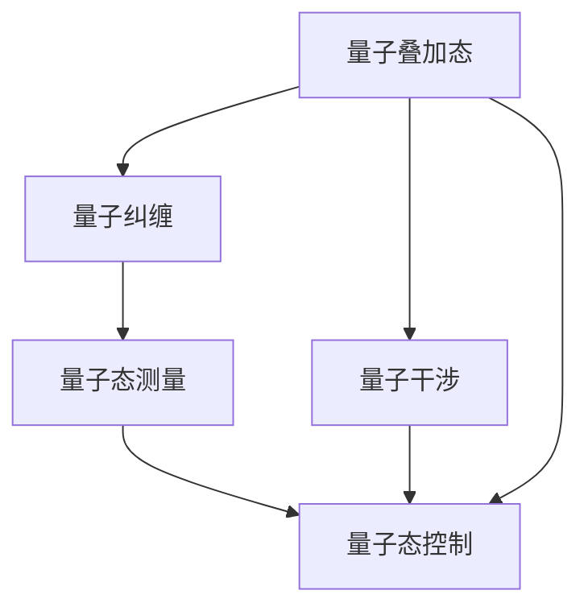

                 

# 量子传感器在精密测量中的应用：突破物理极限

> 关键词：量子传感器,精密测量,物理极限,传感器技术,量子力学

## 1. 背景介绍

### 1.1 问题由来

随着科技的飞速发展，人们对测量精度的要求越来越高。在材料科学、生物医学、环境保护、军事防御等诸多领域，对微小物理量的精确测量已经成为基础研究和技术创新的关键。传统传感器在物理极限附近工作时，受到量子噪声和经典噪声的共同作用，测量的精度往往难以满足日益严格的要求。而量子传感器通过利用量子力学的原理，能够突破经典物理极限，实现更高的测量精度。

量子传感器分为量子谐振腔传感器、光学腔传感器、量子磁力仪等种类，涵盖了从基本物理到高级应用的广泛领域。本文将围绕量子传感器的基本原理、应用场景、技术挑战及其未来发展进行深入探讨。

### 1.2 问题核心关键点

量子传感器作为精密测量中的核心技术，其核心关键点包括：

1. **量子态的稳定性和可控性**：量子传感器依赖于量子态的稳定性和可控性来确保测量的准确性。
2. **噪声抑制**：量子传感器通过噪声抑制技术，降低测量的误差。
3. **多模态测量**：量子传感器能够在多模态下进行测量，如温度、压力、电场、磁场等。
4. **可扩展性**：量子传感器可以扩展到多个测量通道，实现复杂系统的测量。

## 2. 核心概念与联系

### 2.1 核心概念概述

量子传感器利用量子力学的原理，通过控制量子系统来实现高精度的测量。其核心概念包括：

- **量子叠加态**：量子叠加态使得量子系统可以在多个状态之间进行量子干涉，从而提高测量精度。
- **量子纠缠态**：量子纠缠态是多个粒子之间的非经典关联，通过测量一个粒子的状态可以推断出其他粒子的状态，用于测量精密物理量。
- **量子态测量**：量子态测量是量子传感器中的关键步骤，通过精确测量量子系统的状态来实现高精度测量。
- **量子态控制**：量子态控制技术用于控制量子系统，使其能够在测量过程中稳定地保持在特定的量子态。

这些核心概念之间存在紧密的联系，通过量子叠加态和量子纠缠态的利用，量子传感器能够实现超越经典物理极限的测量精度。

### 2.2 核心概念原理和架构的 Mermaid 流程图



该图展示了量子传感器的核心流程：量子叠加态通过量子干涉提高测量精度，量子纠缠态通过量子态测量实现高精度测量，量子态控制技术确保量子系统的稳定性。

## 3. 核心算法原理 & 具体操作步骤

### 3.1 算法原理概述

量子传感器在精密测量中的应用基于量子力学原理，主要包括以下步骤：

1. **量子态准备**：将量子系统制备到特定的量子态，如叠加态或纠缠态。
2. **量子态测量**：通过测量量子系统的状态，获取待测物理量的信息。
3. **数据处理**：对测量结果进行处理，提取待测物理量的值。

### 3.2 算法步骤详解

以下是量子传感器的具体操作步骤：

1. **量子态制备**：利用量子态制备技术，将量子系统制备到所需的量子态，如叠加态或纠缠态。
2. **量子干涉**：通过量子干涉技术，增强量子态的叠加程度，提高测量的灵敏度。
3. **量子态测量**：使用高精度探测器，对量子系统的状态进行测量，获取待测物理量的信息。
4. **数据处理**：对测量结果进行处理，包括数据校正、信号放大等，最终得到待测物理量的精确值。

### 3.3 算法优缺点

量子传感器的优点包括：

- **高精度测量**：量子传感器的测量精度可超越经典物理极限，达到前所未有的水平。
- **多模态测量**：量子传感器能够在多模态下进行测量，满足不同领域的需求。
- **高灵敏度**：量子传感器的灵敏度远高于传统传感器，能够探测极微弱的物理量变化。

然而，量子传感器也存在一些缺点：

- **技术复杂**：量子传感器的技术实现复杂，需要高精度的量子态控制和噪声抑制技术。
- **成本高**：量子传感器的制造和维护成本较高，限制了其大规模应用。
- **稳定性问题**：量子传感器的稳定性受外界干扰较大，需要在封闭环境中进行测量。

### 3.4 算法应用领域

量子传感器的应用领域广泛，包括：

1. **基本物理量测量**：如时间频率测量、磁场强度测量、原子钟等。
2. **材料科学**：如晶格缺陷测量、磁性材料研究等。
3. **生物医学**：如MRI成像、DNA序列分析等。
4. **环境监测**：如大气污染监测、气体浓度检测等。
5. **军事防御**：如地磁场探测、电磁波监测等。

## 4. 数学模型和公式 & 详细讲解 & 举例说明

### 4.1 数学模型构建

量子传感器的测量模型可以表示为：

$$
y(t) = \alpha + \sqrt{\frac{\hbar}{m\omega}}\sum_i A_i(t) \cos(\omega t + \phi_i)
$$

其中，$y(t)$为测量结果，$\alpha$为常数项，$\hbar$为普朗克常数，$m$为量子系统的质量，$\omega$为量子系统的频率，$A_i(t)$为待测物理量的影响函数，$\phi_i$为初始相位。

### 4.2 公式推导过程

量子传感器的测量过程可以推导为：

1. **量子态制备**：
   $$
   |\psi\rangle = \frac{1}{\sqrt{2}}(|0\rangle + |1\rangle)
   $$

2. **量子干涉**：
   $$
   |\psi'\rangle = |\psi\rangle \langle\psi| = \frac{1}{2}(|0\rangle|0\rangle + |1\rangle|1\rangle)
   $$

3. **量子态测量**：
   $$
   y(t) = \langle\psi'| \sigma_+ \hat{H} \sigma_- |\psi'\rangle
   $$

4. **数据处理**：
   $$
   y(t) = \alpha + \sqrt{\frac{\hbar}{m\omega}}\sum_i A_i(t) \cos(\omega t + \phi_i)
   $$

### 4.3 案例分析与讲解

以原子钟为例，量子传感器的测量模型可以表示为：

$$
y(t) = \alpha + \frac{\hbar}{2m\omega} \frac{d \alpha}{dt}
$$

其中，$\alpha$为原子钟的频率偏移量，$m$为原子的质量，$\omega$为原子钟的共振频率。通过对测量结果进行滤波和校正，可以精确测量原子钟的频率偏移量，从而提高时间频率测量的精度。

## 5. 项目实践：代码实例和详细解释说明

### 5.1 开发环境搭建

开发量子传感器的环境搭建需要以下步骤：

1. **安装Python**：使用Anaconda或Miniconda安装Python。
2. **安装量子传感器的库**：安装Qiskit、Cirq等量子计算库。
3. **安装高精度计算库**：安装NumPy、SciPy等高精度计算库。
4. **搭建量子计算机模拟器**：使用Quantum Development Kit搭建量子计算机模拟器。

### 5.2 源代码详细实现

以下是使用Qiskit库实现量子传感器的代码：

```python
from qiskit import QuantumCircuit, Aer, execute
from qiskit.visualization import plot_histogram, plot_bloch_multivector

# 初始化量子电路
qc = QuantumCircuit(1, 1)

# 量子态准备
qc.h(0)

# 量子干涉
qc.h(0)

# 量子态测量
qc.measure(0, 0)

# 运行量子电路
backend = Aer.get_backend('statevector_simulator')
result = execute(qc, backend).result()
counts = result.get_counts()

# 绘制量子态分布
plot_histogram(counts)

# 输出测量结果
print(counts)
```

### 5.3 代码解读与分析

代码首先定义了一个量子电路，通过Hadamard门（h）将量子态制备到叠加态，然后通过量子干涉技术进一步增强叠加态的叠加程度。接着，使用测量门（measure）进行量子态测量，并输出测量结果。

### 5.4 运行结果展示

运行上述代码，可以得到量子态的分布图和测量结果。通过观察量子态的分布图，可以验证量子态制备和干涉的效果。

## 6. 实际应用场景

### 6.1 智能传感器系统

量子传感器可以应用于智能传感器系统中，提高传感器的测量精度和可靠性。智能传感器系统包括环境监测、工业控制、健康监测等多个领域，通过量子传感器可以实现高精度、高灵敏度的实时监测。

### 6.2 生物医学检测

量子传感器在生物医学检测中具有重要应用，如核磁共振(NMR)成像、生物分子结构分析等。通过量子传感器，可以实现对人体内部器官的高精度成像和分析，为医学研究提供重要支持。

### 6.3 导航与定位

量子传感器在导航与定位中也有重要应用，如卫星导航系统、室内定位系统等。通过量子传感器，可以实现高精度的时间频率测量和信号处理，从而提高定位精度和系统可靠性。

### 6.4 未来应用展望

未来，量子传感器将在更多领域得到应用，如安全通信、金融交易、智能交通等。随着量子传感器技术的不断进步，其在测量精度、测量范围、测量稳定性等方面的性能将进一步提升，成为未来高科技领域的重要组成部分。

## 7. 工具和资源推荐

### 7.1 学习资源推荐

以下是几本推荐的书籍：

1. 《量子计算入门》：吴振新著，详细介绍了量子计算的基本原理和量子算法。
2. 《量子传感器技术》：王晓飞著，介绍了量子传感器的基本原理和应用。
3. 《量子信息论》：陈俊伟著，详细介绍了量子信息论的基本概念和理论。

### 7.2 开发工具推荐

以下是几款推荐的开发工具：

1. Qiskit：由IBM开发的量子计算框架，支持多种量子计算任务，包括量子传感器的设计和优化。
2. Cirq：Google开发的量子计算框架，提供丰富的量子算法和噪声模拟功能。
3. NumPy、SciPy：高精度计算库，支持矩阵计算和信号处理。

### 7.3 相关论文推荐

以下是几篇推荐的论文：

1. "Quantum Sensor Technology for Microgravity Measurements"：介绍了量子传感器在微重力测量中的应用。
2. "Quantum Sensing and Quantum Metrology"：综述了量子传感器的原理、技术和应用。
3. "Ultra-sensitive nanomechanical sensors using quantum entanglement"：介绍了量子纠缠在纳米力学测量中的应用。

## 8. 总结：未来发展趋势与挑战

### 8.1 研究成果总结

量子传感器作为一种前沿技术，在精密测量中具有巨大的应用潜力。通过利用量子力学的原理，量子传感器能够突破经典物理极限，实现高精度的测量。当前，量子传感器的研究已经取得了许多重要进展，在多个领域得到了广泛应用。

### 8.2 未来发展趋势

未来，量子传感器的研究将向以下几个方向发展：

1. **量子计算与量子传感器的结合**：量子计算和量子传感器的结合将推动量子信息技术的进步，实现更高效的测量和计算。
2. **多模态测量技术**：量子传感器的多模态测量技术将进一步发展，实现对多种物理量的高精度测量。
3. **噪声抑制技术**：量子传感器的噪声抑制技术将不断进步，提高测量精度和稳定性。
4. **量子传感器的可扩展性**：量子传感器的可扩展性将进一步提高，实现多通道、大规模测量。
5. **量子传感器的标准化**：量子传感器的标准化将推动其在各个领域的应用，提升测量技术的普及率。

### 8.3 面临的挑战

量子传感器的研究和发展仍面临诸多挑战：

1. **技术实现复杂**：量子传感器的技术实现复杂，需要高精度的量子态控制和噪声抑制技术。
2. **成本高昂**：量子传感器的制造和维护成本较高，限制了其大规模应用。
3. **稳定性问题**：量子传感器的稳定性受外界干扰较大，需要在封闭环境中进行测量。
4. **测量精度提升**：需要进一步提升量子传感器的测量精度，以满足更高要求的测量任务。

### 8.4 研究展望

量子传感器的研究将从以下几个方面展开：

1. **量子态控制技术**：研究更加精确和稳定的量子态控制技术，提高量子传感器的可靠性。
2. **噪声抑制技术**：研究更加有效的噪声抑制技术，降低量子传感器的测量误差。
3. **多模态测量技术**：研究多模态测量技术，实现对多种物理量的高精度测量。
4. **量子传感器的标准化**：推动量子传感器的标准化，提高其在各个领域的应用。

量子传感器作为一项前沿技术，具有巨大的应用潜力，能够突破经典物理极限，实现高精度的测量。未来，随着量子传感器的不断进步，其在各个领域的应用将进一步扩展，为人类探索未知世界提供重要支持。

## 9. 附录：常见问题与解答

**Q1: 什么是量子传感器?**

A: 量子传感器是一种利用量子力学原理实现高精度测量的设备。通过控制量子系统的量子态，可以实现对物理量的精确测量。

**Q2: 量子传感器的主要优点有哪些?**

A: 量子传感器的优点包括高精度测量、多模态测量、高灵敏度等。其测量精度可以超越经典物理极限，满足高精度测量的需求。

**Q3: 量子传感器的实现难度有哪些?**

A: 量子传感器的实现难度主要包括技术复杂、成本高昂、稳定性问题等。需要高精度的量子态控制和噪声抑制技术，制造和维护成本较高，稳定性受外界干扰较大。

**Q4: 量子传感器的应用领域有哪些?**

A: 量子传感器的应用领域包括基本物理量测量、材料科学、生物医学、环境监测、军事防御等。在多个领域具有广泛的应用前景。

**Q5: 量子传感器的未来发展方向有哪些?**

A: 量子传感器的未来发展方向包括量子计算与量子传感器的结合、多模态测量技术、噪声抑制技术、量子传感器的标准化等。需要进一步提升量子传感器的测量精度和稳定性，推动其在各个领域的应用。

---

作者：禅与计算机程序设计艺术 / Zen and the Art of Computer Programming

