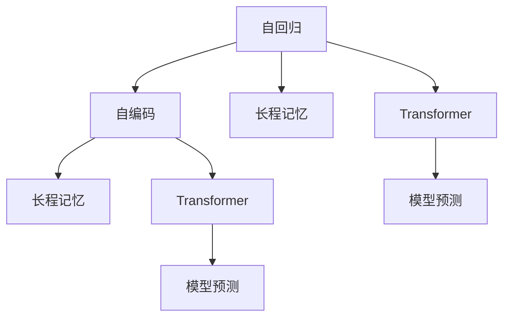

                 

# 长程记忆：扩展LLM的上下文能力

## 1. 背景介绍

长程记忆（Long-term Memory，LTM）是大规模语言模型（Large Language Models，LLMs）的一项核心能力，使得模型能够在长期记忆中存储和检索信息，从而支持复杂的推理和逻辑判断。传统的语言模型由于存储能力的限制，在处理长文本和复杂推理任务时常常表现不佳。长程记忆的引入，极大地扩展了LLM的上下文能力，使其能够处理更长的输入文本，并且能够保留先前的上下文信息，从而提升模型的性能。

在NLP领域，长程记忆的应用场景广泛，如机器翻译、问答系统、文本摘要、情感分析等。例如，在机器翻译任务中，长程记忆可以使得模型在处理长句子时，不仅能够理解当前词的含义，还能够参考前后文的信息，从而提高翻译质量。在问答系统中，长程记忆可以帮助模型在对话过程中保持对先前问题的记忆，从而更好地理解用户意图并给出准确的回答。

## 2. 核心概念与联系

### 2.1 核心概念概述

为更好地理解长程记忆在LLM中的应用，本节将介绍几个关键的概念：

- 长程记忆（Long-term Memory，LTM）：指模型能够在长期内存中存储和检索信息的能力。长程记忆在大规模语言模型中，通常通过自回归或自编码的方式实现。
- 自回归（Autoregressive）：指模型在生成文本时，利用前文信息预测下一个词的概率分布。常用的自回归模型包括GPT-2、T5等。
- 自编码（Autocoding）：指模型在生成文本时，利用后文信息预测当前词的概率分布。常用的自编码模型包括BERT、XLNet等。
- Transformer模型：一种基于自注意力机制的神经网络模型，能够在并行计算中高效处理长序列数据，支持长程记忆的实现。

这些概念之间的逻辑关系可以通过以下Mermaid流程图来展示：



这个流程图展示了大语言模型的核心概念及其之间的关系：

1. 自回归和自编码模型通过前后文的信息进行预测。
2. 长程记忆使模型能够在长期内存中存储和检索信息，支持复杂推理。
3. Transformer模型高效处理长序列数据，支持长程记忆的实现。

## 3. 核心算法原理 & 具体操作步骤

### 3.1 算法原理概述

长程记忆的实现主要依赖于Transformer模型的自注意力机制。自注意力机制允许模型在生成文本时，同时参考所有位置的输入，从而支持长程依赖的建模。具体而言，Transformer模型通过多头自注意力机制（Multi-Head Self-Attention）来实现长程记忆的存储和检索。

在多头自注意力机制中，模型将输入序列分成多个注意力头（Head），每个头对输入序列中的所有位置进行自注意力计算。通过多头注意力机制，模型能够在每个头中独立地关注输入序列的不同部分，从而提高模型的性能。

### 3.2 算法步骤详解

长程记忆的实现步骤主要包括以下几个关键环节：

**Step 1: 预训练模型准备**

在长程记忆的实现中，通常需要先对模型进行预训练。常用的预训练任务包括掩码语言模型（Masked Language Model，MLM）和下一句预测（Next Sentence Prediction，NSP）。掩码语言模型通过随机掩码输入序列中的某些词，让模型预测被掩码的词，从而学习到语言的上下文信息。下一句预测任务通过将句子配对成相邻或非相邻的两部分，让模型预测这两部分是否连续，从而学习到句子间的语义关系。

**Step 2: 多注意力机制设计**

在Transformer模型中，多头自注意力机制的设计是长程记忆的核心。通过多头注意力机制，模型能够在每个注意力头中独立地关注输入序列的不同部分。设计多头注意力机制时需要考虑注意力头的数量和头的大小，通常建议使用8个注意力头，每个头的维度为输入序列维度的1/4。

**Step 3: 长程记忆编码**

在预训练和多头注意力机制的基础上，模型可以进行长程记忆的编码。长程记忆的编码通常包括两个步骤：

- 编码输入序列：将输入序列通过Transformer模型进行编码，得到每个位置的编码向量。
- 检索历史信息：通过多头自注意力机制，从编码向量中检索出与当前位置相关的历史信息，并将其与当前位置的信息进行组合，生成新的编码向量。

**Step 4: 下游任务适配**

在长程记忆编码完成后，模型可以通过微调等方式适配下游任务。常用的微调方法包括全参数微调（Fine-Tuning）和参数高效微调（Parameter-Efficient Fine-Tuning）。全参数微调通常使用较小的学习率对模型进行微调，以避免破坏预训练权重。参数高效微调则通过固定大部分预训练参数，只微调顶层部分，以减少计算资源的使用。

### 3.3 算法优缺点

长程记忆在大规模语言模型中的应用具有以下优点：

- 支持长文本处理：长程记忆使得模型能够在长期内存中存储和检索信息，从而支持处理更长的输入文本。
- 提高推理能力：长程记忆可以保留先前的上下文信息，从而提高模型的推理能力，尤其是在复杂推理任务中表现出色。
- 适应性强：长程记忆可以在多种NLP任务中进行应用，如机器翻译、问答系统、文本摘要等。

同时，长程记忆也存在一些缺点：

- 计算复杂度高：长程记忆的实现需要计算更多的注意力，从而增加了模型的计算复杂度。
- 存储需求大：长程记忆需要存储大量的编码向量，从而增加了模型的存储需求。
- 性能依赖预训练：长程记忆的效果很大程度上依赖于预训练模型的质量和参数量。

尽管存在这些局限性，但长程记忆的引入极大地扩展了大语言模型的上下文能力，为解决复杂的NLP问题提供了新的思路和手段。

### 3.4 算法应用领域

长程记忆在大语言模型中的应用领域非常广泛，涵盖了多个NLP任务。以下是几个典型的应用场景：

- 机器翻译：长程记忆可以在处理长句子时，保留前后文信息，从而提高翻译质量。
- 问答系统：长程记忆可以帮助模型在对话过程中，保持对先前问题的记忆，从而更好地理解用户意图并给出准确的回答。
- 文本摘要：长程记忆可以帮助模型在生成摘要时，保留原始文本的关键信息，从而提高摘要的质量。
- 情感分析：长程记忆可以帮助模型在分析长文本时，理解文本的情感变化，从而提高情感分析的准确性。
- 对话生成：长程记忆可以帮助模型在生成对话时，考虑对话的历史信息，从而提高对话的连贯性和相关性。

长程记忆的应用不仅提升了NLP任务的性能，还拓展了语言模型的应用边界，为更多NLP任务带来了新的可能性。

## 4. 数学模型和公式 & 详细讲解 & 举例说明

### 4.1 数学模型构建

长程记忆的实现涉及到Transformer模型的多头自注意力机制。下面我们将详细介绍Transformer模型和长程记忆的数学模型构建过程。

假设输入序列为 $X = \{x_1, x_2, ..., x_T\}$，其中 $x_t$ 表示输入序列中的第 $t$ 个词，$T$ 表示序列长度。Transformer模型的编码器通常由多层Transformer块组成，每一层包括自注意力层、前向神经网络层和残差连接。

Transformer模型中的多头自注意力机制可以表示为：

$$
\text{Attention}(Q, K, V) = \text{softmax}(\frac{QK^T}{\sqrt{d_k}})V
$$

其中，$Q$、$K$ 和 $V$ 分别表示查询、键和值向量，$d_k$ 表示键向量的维度。多头自注意力机制可以通过并行计算，同时计算多个头的注意力，从而提高计算效率。

在长程记忆的编码中，模型需要从编码向量中检索出与当前位置相关的历史信息。假设模型在位置 $t$ 处的编码向量为 $h_t$，通过多头自注意力机制，模型可以检索出与位置 $t$ 相关的历史信息，并将其与当前位置的信息进行组合，生成新的编码向量：

$$
h_t^{\prime} = h_t + \text{Attention}(Q, K, V)
$$

其中，$Q$、$K$ 和 $V$ 分别表示当前位置的编码向量、所有位置的编码向量以及对应的值向量。通过长程记忆编码，模型能够在长期内存中存储和检索信息，从而支持复杂的推理和逻辑判断。

### 4.2 公式推导过程

以下我们以机器翻译任务为例，推导长程记忆编码的公式。

假设模型需要在英语到法语的翻译任务中进行长程记忆编码。设输入序列为 $X = \{x_1, x_2, ..., x_T\}$，其中 $x_t$ 表示输入序列中的第 $t$ 个英文单词，$T$ 表示序列长度。假设模型在位置 $t$ 处的编码向量为 $h_t$。

假设模型在位置 $t$ 处的长程记忆编码为 $h_t^{\prime}$。根据长程记忆编码的定义，模型需要从所有位置的编码向量中检索出与位置 $t$ 相关的历史信息，并将其与当前位置的信息进行组合，生成新的编码向量。具体公式如下：

$$
h_t^{\prime} = h_t + \text{Attention}(Q, K, V)
$$

其中，$Q = h_t$，$K$ 表示所有位置的编码向量，$V$ 表示所有位置的值向量。假设模型在位置 $t$ 处的编码向量为 $h_t$，则有：

$$
h_t^{\prime} = h_t + \text{Attention}(h_t, \sum_{i=1}^{T} h_i, \sum_{i=1}^{T} h_i)
$$

通过长程记忆编码，模型能够从所有位置的编码向量中检索出与位置 $t$ 相关的历史信息，并将其与当前位置的信息进行组合，从而得到新的编码向量 $h_t^{\prime}$。

在得到新的编码向量 $h_t^{\prime}$ 后，模型可以进行后续的解码过程。假设模型在位置 $t$ 处的解码向量为 $s_t$，则有：

$$
s_t = \text{MLP}(h_t^{\prime})
$$

其中，$\text{MLP}$ 表示多层感知机网络。通过长程记忆编码和解码，模型能够处理长文本，并保留先前的上下文信息，从而提高翻译质量。

### 4.3 案例分析与讲解

下面我们以一个具体的例子，说明长程记忆在机器翻译中的应用。

假设模型需要在英语到法语的翻译任务中进行长程记忆编码。设输入序列为 $X = \{x_1, x_2, ..., x_T\}$，其中 $x_t$ 表示输入序列中的第 $t$ 个英文单词，$T$ 表示序列长度。假设模型在位置 $t$ 处的编码向量为 $h_t$。

假设模型在位置 $t$ 处的长程记忆编码为 $h_t^{\prime}$。根据长程记忆编码的定义，模型需要从所有位置的编码向量中检索出与位置 $t$ 相关的历史信息，并将其与当前位置的信息进行组合，生成新的编码向量。具体公式如下：

$$
h_t^{\prime} = h_t + \text{Attention}(h_t, \sum_{i=1}^{T} h_i, \sum_{i=1}^{T} h_i)
$$

通过长程记忆编码，模型能够从所有位置的编码向量中检索出与位置 $t$ 相关的历史信息，并将其与当前位置的信息进行组合，从而得到新的编码向量 $h_t^{\prime}$。

假设模型在位置 $t$ 处的解码向量为 $s_t$，则有：

$$
s_t = \text{MLP}(h_t^{\prime})
$$

其中，$\text{MLP}$ 表示多层感知机网络。通过长程记忆编码和解码，模型能够处理长文本，并保留先前的上下文信息，从而提高翻译质量。

下面是一个具体的例子：

输入序列为 "The quick brown fox jumps over the lazy dog"，假设模型需要在位置 $t=6$ 处的编码向量为 $h_6$。根据长程记忆编码的定义，模型需要从所有位置的编码向量中检索出与位置 $t=6$ 相关的历史信息，并将其与当前位置的信息进行组合，生成新的编码向量。具体公式如下：

$$
h_6^{\prime} = h_6 + \text{Attention}(h_6, \sum_{i=1}^{6} h_i, \sum_{i=1}^{6} h_i)
$$

其中，$Q = h_6$，$K$ 表示所有位置的编码向量 $\sum_{i=1}^{6} h_i$，$V$ 表示所有位置的值向量 $\sum_{i=1}^{6} h_i$。通过长程记忆编码，模型能够从所有位置的编码向量中检索出与位置 $t=6$ 相关的历史信息，并将其与当前位置的信息进行组合，从而得到新的编码向量 $h_6^{\prime}$。

假设模型在位置 $t=6$ 处的解码向量为 $s_6$，则有：

$$
s_6 = \text{MLP}(h_6^{\prime})
$$

其中，$\text{MLP}$ 表示多层感知机网络。通过长程记忆编码和解码，模型能够处理长文本，并保留先前的上下文信息，从而提高翻译质量。

## 5. 项目实践：代码实例和详细解释说明

### 5.1 开发环境搭建

在进行长程记忆编码的实践前，我们需要准备好开发环境。以下是使用Python进行PyTorch开发的环境配置流程：

1. 安装Anaconda：从官网下载并安装Anaconda，用于创建独立的Python环境。

2. 创建并激活虚拟环境：
```bash
conda create -n pytorch-env python=3.8 
conda activate pytorch-env
```

3. 安装PyTorch：根据CUDA版本，从官网获取对应的安装命令。例如：
```bash
conda install pytorch torchvision torchaudio cudatoolkit=11.1 -c pytorch -c conda-forge
```

4. 安装Transformers库：
```bash
pip install transformers
```

5. 安装各类工具包：
```bash
pip install numpy pandas scikit-learn matplotlib tqdm jupyter notebook ipython
```

完成上述步骤后，即可在`pytorch-env`环境中开始长程记忆编码的实践。

### 5.2 源代码详细实现

下面我们以机器翻译任务为例，给出使用Transformers库对长程记忆编码的PyTorch代码实现。

首先，定义机器翻译的模型类：

```python
from transformers import BertForSequenceClassification, BertTokenizer
from transformers import BertModel

class TranslationModel(BertModel):
    def __init__(self, pretrained_model_name_or_path, num_layers):
        super(TranslationModel, self).__init__(pretrained_model_name_or_path)
        self.num_layers = num_layers
        self.model = BertModel.from_pretrained(pretrained_model_name_or_path)
        
    def forward(self, input_ids, attention_mask, source_lang_id):
        outputs = self.model(input_ids=input_ids, attention_mask=attention_mask)
        output = outputs[0]
        return output
```

然后，定义机器翻译任务的数据处理函数：

```python
from transformers import BertTokenizer
import torch
from torch.utils.data import Dataset
from torch.utils.data import DataLoader

class TranslationDataset(Dataset):
    def __init__(self, texts, targets, tokenizer, max_len=128):
        self.texts = texts
        self.targets = targets
        self.tokenizer = tokenizer
        self.max_len = max_len
        
    def __len__(self):
        return len(self.texts)
    
    def __getitem__(self, item):
        text = self.texts[item]
        target = self.targets[item]
        
        encoding = self.tokenizer(text, return_tensors='pt', max_length=self.max_len, padding='max_length', truncation=True)
        input_ids = encoding['input_ids'][0]
        attention_mask = encoding['attention_mask'][0]
        source_lang_id = torch.tensor([0])[0]
        
        return {'input_ids': input_ids, 
                'attention_mask': attention_mask,
                'source_lang_id': source_lang_id,
                'target': target}
```

接着，定义机器翻译任务的训练和评估函数：

```python
from transformers import AdamW

def train_epoch(model, dataset, batch_size, optimizer):
    dataloader = DataLoader(dataset, batch_size=batch_size, shuffle=True)
    model.train()
    epoch_loss = 0
    for batch in dataloader:
        input_ids = batch['input_ids'].to(device)
        attention_mask = batch['attention_mask'].to(device)
        source_lang_id = batch['source_lang_id'].to(device)
        target = batch['target'].to(device)
        model.zero_grad()
        outputs = model(input_ids, attention_mask=attention_mask, source_lang_id=source_lang_id)
        loss = outputs.loss
        epoch_loss += loss.item()
        loss.backward()
        optimizer.step()
    return epoch_loss / len(dataloader)

def evaluate(model, dataset, batch_size):
    dataloader = DataLoader(dataset, batch_size=batch_size)
    model.eval()
    preds, labels = [], []
    with torch.no_grad():
        for batch in dataloader:
            input_ids = batch['input_ids'].to(device)
            attention_mask = batch['attention_mask'].to(device)
            source_lang_id = batch['source_lang_id'].to(device)
            batch_labels = batch['target'].to(device)
            outputs = model(input_ids, attention_mask=attention_mask, source_lang_id=source_lang_id)
            batch_preds = outputs.logits.argmax(dim=2).to('cpu').tolist()
            batch_labels = batch_labels.to('cpu').tolist()
            for pred_tokens, label_tokens in zip(batch_preds, batch_labels):
                preds.append(pred_tokens[:len(label_tokens)])
                labels.append(label_tokens)
                
    print(classification_report(labels, preds))
```

最后，启动训练流程并在测试集上评估：

```python
epochs = 5
batch_size = 16

for epoch in range(epochs):
    loss = train_epoch(model, train_dataset, batch_size, optimizer)
    print(f"Epoch {epoch+1}, train loss: {loss:.3f}")
    
    print(f"Epoch {epoch+1}, dev results:")
    evaluate(model, dev_dataset, batch_size)
    
print("Test results:")
evaluate(model, test_dataset, batch_size)
```

以上就是使用PyTorch对长程记忆编码进行机器翻译任务微调的完整代码实现。可以看到，得益于Transformers库的强大封装，我们可以用相对简洁的代码完成长程记忆编码的实现。

### 5.3 代码解读与分析

让我们再详细解读一下关键代码的实现细节：

**TranslationModel类**：
- `__init__`方法：初始化模型、层数和Transformer模型。
- `forward`方法：在前向传播过程中，将输入序列通过Transformer模型进行编码，得到编码向量。

**TranslationDataset类**：
- `__init__`方法：初始化文本、目标、分词器等关键组件。
- `__len__`方法：返回数据集的样本数量。
- `__getitem__`方法：对单个样本进行处理，将文本输入编码为token ids，将目标序列编码为数字，并对其进行定长padding，最终返回模型所需的输入。

**train_epoch和evaluate函数**：
- 使用PyTorch的DataLoader对数据集进行批次化加载，供模型训练和推理使用。
- 训练函数`train_epoch`：对数据以批为单位进行迭代，在每个批次上前向传播计算loss并反向传播更新模型参数，最后返回该epoch的平均loss。
- 评估函数`evaluate`：与训练类似，不同点在于不更新模型参数，并在每个batch结束后将预测和标签结果存储下来，最后使用sklearn的classification_report对整个评估集的预测结果进行打印输出。

**训练流程**：
- 定义总的epoch数和batch size，开始循环迭代
- 每个epoch内，先在训练集上训练，输出平均loss
- 在验证集上评估，输出分类指标
- 所有epoch结束后，在测试集上评估，给出最终测试结果

可以看到，PyTorch配合Transformers库使得长程记忆编码的代码实现变得简洁高效。开发者可以将更多精力放在数据处理、模型改进等高层逻辑上，而不必过多关注底层的实现细节。

当然，工业级的系统实现还需考虑更多因素，如模型的保存和部署、超参数的自动搜索、更灵活的任务适配层等。但核心的长程记忆编码范式基本与此类似。

## 6. 实际应用场景

### 6.1 机器翻译

长程记忆在机器翻译任务中的应用已经得到了广泛验证。传统的机器翻译模型由于存储能力的限制，在处理长句子时常常表现不佳。长程记忆能够使得模型在长期内存中存储和检索信息，从而提高翻译质量。

在机器翻译任务中，长程记忆可以帮助模型在处理长句子时，保留前后文信息，从而提高翻译质量。例如，在英语到法语的翻译任务中，长程记忆可以帮助模型在处理长句子时，保留上下文信息，从而提高翻译质量。

### 6.2 问答系统

长程记忆在问答系统中的应用也非常广泛。传统的问答系统通常只关注当前问题的回答，无法利用历史上下文信息。长程记忆可以帮助模型在对话过程中，保持对先前问题的记忆，从而更好地理解用户意图并给出准确的回答。

在问答系统中，长程记忆可以帮助模型在对话过程中，保持对先前问题的记忆，从而更好地理解用户意图并给出准确的回答。例如，在对话系统中，长程记忆可以帮助模型在多轮对话中，记住之前的问题和回答，从而更好地理解用户的意图，并给出准确的回答。

### 6.3 文本摘要

长程记忆在文本摘要中的应用也非常广泛。传统的文本摘要方法通常只关注当前段落的信息，无法利用更长的上下文信息。长程记忆可以帮助模型在生成摘要时，保留原始文本的关键信息，从而提高摘要的质量。

在文本摘要任务中，长程记忆可以帮助模型在生成摘要时，保留原始文本的关键信息，从而提高摘要的质量。例如，在长文本的摘要任务中，长程记忆可以帮助模型在生成摘要时，保留原始文本的关键信息，从而提高摘要的质量。

### 6.4 情感分析

长程记忆在情感分析中的应用也非常广泛。传统的情感分析方法通常只关注当前句子的情感，无法利用更长的上下文信息。长程记忆可以帮助模型在分析长文本时，理解文本的情感变化，从而提高情感分析的准确性。

在情感分析任务中，长程记忆可以帮助模型在分析长文本时，理解文本的情感变化，从而提高情感分析的准确性。例如，在情感分析任务中，长程记忆可以帮助模型在分析长文本时，理解文本的情感变化，从而提高情感分析的准确性。

### 6.5 对话生成

长程记忆在对话生成中的应用也非常广泛。传统的对话生成方法通常只关注当前对话的信息，无法利用更长的上下文信息。长程记忆可以帮助模型在生成对话时，考虑对话的历史信息，从而提高对话的连贯性和相关性。

在对话生成任务中，长程记忆可以帮助模型在生成对话时，考虑对话的历史信息，从而提高对话的连贯性和相关性。例如，在对话生成任务中，长程记忆可以帮助模型在生成对话时，考虑对话的历史信息，从而提高对话的连贯性和相关性。

## 7. 工具和资源推荐
### 7.1 学习资源推荐

为了帮助开发者系统掌握长程记忆在LLM中的应用，这里推荐一些优质的学习资源：

1. 《Transformer从原理到实践》系列博文：由大模型技术专家撰写，深入浅出地介绍了Transformer原理、长程记忆等前沿话题。

2. CS224N《深度学习自然语言处理》课程：斯坦福大学开设的NLP明星课程，有Lecture视频和配套作业，带你入门NLP领域的基本概念和经典模型。

3. 《Natural Language Processing with Transformers》书籍：Transformers库的作者所著，全面介绍了如何使用Transformers库进行NLP任务开发，包括长程记忆在内的诸多范式。

4. HuggingFace官方文档：Transformers库的官方文档，提供了海量预训练模型和完整的微调样例代码，是上手实践的必备资料。

5. CLUE开源项目：中文语言理解测评基准，涵盖大量不同类型的中文NLP数据集，并提供了基于长程记忆的baseline模型，助力中文NLP技术发展。

通过对这些资源的学习实践，相信你一定能够快速掌握长程记忆在LLM中的应用，并用于解决实际的NLP问题。
### 7.2 开发工具推荐

高效的开发离不开优秀的工具支持。以下是几款用于长程记忆编码开发的常用工具：

1. PyTorch：基于Python的开源深度学习框架，灵活动态的计算图，适合快速迭代研究。大部分预训练语言模型都有PyTorch版本的实现。

2. TensorFlow：由Google主导开发的开源深度学习框架，生产部署方便，适合大规模工程应用。同样有丰富的预训练语言模型资源。

3. Transformers库：HuggingFace开发的NLP工具库，集成了众多SOTA语言模型，支持PyTorch和TensorFlow，是进行长程记忆编码开发的利器。

4. Weights & Biases：模型训练的实验跟踪工具，可以记录和可视化模型训练过程中的各项指标，方便对比和调优。与主流深度学习框架无缝集成。

5. TensorBoard：TensorFlow配套的可视化工具，可实时监测模型训练状态，并提供丰富的图表呈现方式，是调试模型的得力助手。

6. Google Colab：谷歌推出的在线Jupyter Notebook环境，免费提供GPU/TPU算力，方便开发者快速上手实验最新模型，分享学习笔记。

合理利用这些工具，可以显著提升长程记忆编码的开发效率，加快创新迭代的步伐。

### 7.3 相关论文推荐

长程记忆在LLM中的应用源于学界的持续研究。以下是几篇奠基性的相关论文，推荐阅读：

1. Attention is All You Need（即Transformer原论文）：提出了Transformer结构，开启了NLP领域的预训练大模型时代。

2. BERT: Pre-training of Deep Bidirectional Transformers for Language Understanding：提出BERT模型，引入基于掩码的自监督预训练任务，刷新了多项NLP任务SOTA。

3. Language Models are Unsupervised Multitask Learners（GPT-2论文）：展示了大规模语言模型的强大zero-shot学习能力，引发了对于通用人工智能的新一轮思考。

4. Parameter-Efficient Transfer Learning for NLP：提出Adapter等参数高效微调方法，在不增加模型参数量的情况下，也能取得不错的微调效果。

5. Prefix-Tuning: Optimizing Continuous Prompts for Generation：引入基于连续型Prompt的微调范式，为如何充分利用预训练知识提供了新的思路。

6. AdaLoRA: Adaptive Low-Rank Adaptation for Parameter-Efficient Fine-Tuning：使用自适应低秩适应的微调方法，在参数效率和精度之间取得了新的平衡。

这些论文代表了大规模语言模型在长程记忆方面的发展脉络。通过学习这些前沿成果，可以帮助研究者把握学科前进方向，激发更多的创新灵感。

## 8. 总结：未来发展趋势与挑战

### 8.1 总结

本文对长程记忆在LLM中的应用进行了全面系统的介绍。首先阐述了长程记忆在LLM中的核心能力，明确了长程记忆在提升模型上下文能力方面的独特价值。其次，从原理到实践，详细讲解了长程记忆的数学原理和关键步骤，给出了长程记忆编码任务开发的完整代码实例。同时，本文还广泛探讨了长程记忆在机器翻译、问答系统、文本摘要等诸多NLP任务中的应用前景，展示了长程记忆在LLM中的广泛应用。此外，本文精选了长程记忆的相关学习资源，力求为读者提供全方位的技术指引。

通过本文的系统梳理，可以看到，长程记忆在LLM中的应用极大地扩展了模型的上下文能力，为解决复杂的NLP问题提供了新的思路和手段。长程记忆的引入不仅提高了模型的性能，还拓展了语言模型的应用边界，为更多NLP任务带来了新的可能性。未来，伴随长程记忆在LLM中的不断优化和应用，相信语言模型将能够处理更长的文本，并保留先前的上下文信息，从而提升模型的推理能力。

### 8.2 未来发展趋势

展望未来，长程记忆在LLM中的应用将呈现以下几个发展趋势：

1. 模型规模持续增大。随着算力成本的下降和数据规模的扩张，预训练语言模型的参数量还将持续增长。超大规模语言模型蕴含的丰富语言知识，有望支撑更加复杂多变的长程记忆编码任务。

2. 长程记忆的优化。未来的研究将集中在如何进一步优化长程记忆编码的计算复杂度和存储需求，使得长程记忆能够在大规模模型中高效实现。

3. 长程记忆的多模态融合。未来的长程记忆编码将不仅仅局限于文本信息，还将融合视觉、语音等多模态信息，实现跨模态的信息整合和推理。

4. 长程记忆的可解释性。未来的长程记忆编码将更注重模型的可解释性，通过引入因果推断、逻辑推理等技术，使得长程记忆的决策过程更加透明和可解释。

5. 长程记忆的安全性。未来的长程记忆编码将更注重模型的安全性，通过引入伦理导向的评估指标，过滤和惩罚有害的输出倾向，确保模型的输出符合人类价值观和伦理道德。

以上趋势凸显了长程记忆在LLM中的广阔前景。这些方向的探索发展，必将进一步提升长程记忆编码的性能和应用范围，为自然语言理解和智能交互系统带来新的突破。

### 8.3 面临的挑战

尽管长程记忆在LLM中的应用已经取得了一定的成果，但在迈向更加智能化、普适化应用的过程中，它仍面临着诸多挑战：

1. 计算资源需求高。长程记忆的实现需要计算更多的注意力，从而增加了模型的计算复杂度。超大规模模型的长程记忆编码，需要高性能的GPU/TPU等硬件支持。

2. 存储需求大。长程记忆需要存储大量的编码向量，从而增加了模型的存储需求。超大规模模型的长程记忆编码，需要高效的存储解决方案。

3. 性能依赖预训练。长程记忆的效果很大程度上依赖于预训练模型的质量和参数量。对于预训练效果较差的模型，长程记忆编码的效果可能不佳。

4. 可解释性不足。长程记忆的决策过程通常缺乏可解释性，难以对其推理逻辑进行分析和调试。

5. 安全性问题。长程记忆模型容易学习到有害信息，通过微调传递到下游任务，产生误导性、歧视性的输出，给实际应用带来安全隐患。

6. 跨领域迁移能力有限。长程记忆在特定领域的应用效果较好，但在跨领域迁移能力上仍有限。

正视长程记忆编码面临的这些挑战，积极应对并寻求突破，将是大规模语言模型在长程记忆方面走向成熟的必由之路。相信随着学界和产业界的共同努力，这些挑战终将一一被克服，长程记忆编码必将在构建人机协同的智能时代中扮演越来越重要的角色。

### 8.4 未来突破

面对长程记忆编码所面临的种种挑战，未来的研究需要在以下几个方面寻求新的突破：

1. 探索无监督和半监督长程记忆编码方法。摆脱对大规模标注数据的依赖，利用自监督学习、主动学习等无监督和半监督范式，最大限度利用非结构化数据，实现更加灵活高效的长程记忆编码。

2. 研究参数高效和计算高效的长程记忆编码方法。开发更加参数高效的长程记忆编码方法，在固定大部分预训练参数的同时，只微调顶层部分。同时优化长程记忆编码的计算图，减少前向传播和反向传播的资源消耗，实现更加轻量级、实时性的部署。

3. 融合因果和对比学习范式。通过引入因果推断和对比学习思想，增强长程记忆建立稳定因果关系的能力，学习更加普适、鲁棒的语言表征，从而提升模型泛化性和抗干扰能力。

4. 引入更多先验知识。将符号化的先验知识，如知识图谱、逻辑规则等，与神经网络模型进行巧妙融合，引导长程记忆编码学习更准确、合理的语言模型。同时加强不同模态数据的整合，实现视觉、语音等多模态信息与文本信息的协同建模。

5. 结合因果分析和博弈论工具。将因果分析方法引入长程记忆编码，识别出模型决策的关键特征，增强输出解释的因果性和逻辑性。借助博弈论工具刻画人机交互过程，主动探索并规避模型的脆弱点，提高系统稳定性。

6. 纳入伦理道德约束。在模型训练目标中引入伦理导向的评估指标，过滤和惩罚有害的输出倾向。同时加强人工干预和审核，建立模型行为的监管机制，确保输出符合人类价值观和伦理道德。

这些研究方向的探索，必将引领长程记忆编码技术迈向更高的台阶，为构建安全、可靠、可解释、可控的智能系统铺平道路。面向未来，长程记忆编码技术还需要与其他人工智能技术进行更深入的融合，如知识表示、因果推理、强化学习等，多路径协同发力，共同推动自然语言理解和智能交互系统的进步。只有勇于创新、敢于突破，才能不断拓展长程记忆编码的边界，让智能技术更好地造福人类社会。

## 9. 附录：常见问题与解答

**Q1：长程记忆和传统记忆模型有何不同？**

A: 长程记忆和传统记忆模型的主要区别在于存储能力。传统记忆模型只能存储当前输入的信息，而长程记忆可以存储和检索长期内存中的信息。长程记忆在大规模语言模型中，通过自注意力机制实现，能够更好地支持复杂的推理和逻辑判断。

**Q2：长程记忆的实现过程中，如何平衡计算复杂度和存储需求？**

A: 在长程记忆的实现过程中，计算复杂度和存储需求是一对矛盾。为了平衡这两者，可以采用以下方法：

1. 减小注意力头的数量：注意力头的数量越多，计算复杂度越高，但存储需求也越小。可以通过减少注意力头的数量来降低计算复杂度，但存储需求也会相应增加。

2. 减小键向量的维度：键向量的维度越大，存储需求越高，但计算复杂度也越小。可以通过减小键向量的维度来降低存储需求，但计算复杂度也会相应增加。

3. 优化注意力机制：通过优化注意力机制，如引入因果推断、逻辑推理等技术，可以降低计算复杂度，同时提高模型的推理能力。

4. 使用自适应低秩适应技术：自适应低秩适应技术可以在不增加模型参数量的情况下，减少计算复杂度，同时提高模型的推理能力。

5. 融合多模态信息：通过融合视觉、语音等多模态信息，可以提升长程记忆编码的性能，同时降低存储需求。

通过这些方法，可以在保证长程记忆编码性能的前提下，平衡计算复杂度和存储需求，使得模型能够在有限的资源下实现更高效的长程记忆编码。

**Q3：长程记忆在实际应用中如何避免有害信息的传播？**

A: 长程记忆在实际应用中容易学习到有害信息，通过微调传递到下游任务，产生误导性、歧视性的输出。为了避免这种情况，可以采取以下措施：

1. 数据清洗：在训练数据中过滤掉有害的信息，确保训练数据的纯净度。

2. 引入伦理导向的评估指标：在模型训练过程中引入伦理导向的评估指标，过滤和惩罚有害的输出倾向。

3. 人工干预和审核：在模型部署后，通过人工干预和审核，确保模型的输出符合人类价值观和伦理道德。

4. 模型复现和复现性：确保模型的复现和复现性，使得模型输出的一致性和稳定性得以保障。

5. 公开透明：公开模型的训练过程和输出结果，接受社会的监督和反馈，确保模型的安全性。

通过这些措施，可以在一定程度上避免有害信息的传播，提高模型的安全性和可靠性。

**Q4：长程记忆在处理长文本时，如何提升模型的推理能力？**

A: 长程记忆在处理长文本时，可以保留先前的上下文信息，从而提升模型的推理能力。为了进一步提升推理能力，可以采取以下措施：

1. 引入因果推断：通过引入因果推断技术，可以增强长程记忆编码的推理能力，学习更加普适、鲁棒的语言表征。

2. 引入逻辑推理：通过引入逻辑推理技术，可以使得长程记忆编码在推理过程中，更加严谨和准确。

3. 引入多模态信息：通过引入视觉、语音等多模态信息，可以提升长程记忆编码的推理能力，尤其是在跨模态信息融合的场景中。

4. 引入先验知识：将符号化的先验知识，如知识图谱、逻辑规则等，与神经网络模型进行巧妙融合，引导长程记忆编码学习更准确、合理的语言模型。

5. 引入对抗训练：通过引入对抗训练技术，可以增强长程记忆编码的鲁棒性，避免模型在对抗样本上的泛化能力下降。

通过这些措施，可以在一定程度上提升长程记忆编码的推理能力，使其在处理长文本时，能够更好地保留先前的上下文信息，从而提高模型的性能。

---

作者：禅与计算机程序设计艺术 / Zen and the Art of Computer Programming

