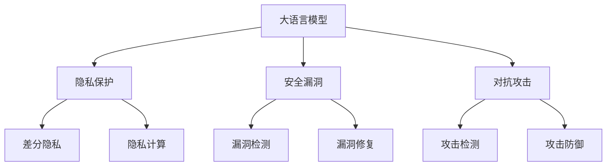

                 

# 隐私和安全：修补 LLM 的隐私漏洞

> 关键词：隐私保护, 安全漏洞, 自然语言处理(LNatural Language Processing, LLP), 大语言模型(LLMs), 数据隐私, 隐私计算, 对抗攻击

## 1. 背景介绍

### 1.1 问题由来
随着深度学习和大语言模型的迅猛发展，其被广泛应用在自然语言处理（NLPLanguage Processing, NLP）的各个领域，如文本分类、情感分析、机器翻译、问答系统等。但与此同时，大语言模型也带来了新的隐私和安全挑战。由于其高度的通用性和可扩展性，大语言模型可以轻易地抓取和分析大量敏感数据，从而导致隐私泄露和安全威胁。此外，大语言模型的预测结果可以被对抗样本所操纵，导致模型的不稳定和安全性降低。

### 1.2 问题核心关键点
隐私和安全问题是当前大语言模型应用中的主要挑战。本节将介绍大语言模型中的隐私保护和安全漏洞，并探讨如何通过技术手段进行修补。

1. **隐私保护**：如何在保护用户隐私的前提下，让大语言模型发挥最大的效用？
2. **安全漏洞**：如何检测和修复大语言模型中的安全漏洞，以确保模型的稳定性和安全性？

## 2. 核心概念与联系

### 2.1 核心概念概述

为了更好地理解大语言模型中的隐私保护和安全漏洞，本节将介绍几个密切相关的核心概念：

- **大语言模型(LLMs)**：基于深度学习模型的大型自然语言处理模型，如BERT、GPT-3、T5等。通过在大型语料库上进行预训练，学习语言的通用表示，具备强大的语言理解和生成能力。

- **隐私保护**：指在数据处理过程中，保护数据主体的个人信息、商业秘密等敏感信息，防止数据泄露、滥用或被非法获取。

- **安全漏洞**：指模型在设计和实现中存在的漏洞，使得攻击者可以绕过模型的安全防护，获取敏感信息或操纵模型的预测结果。

- **对抗攻击**：指攻击者通过精心设计的输入样本（称为对抗样本），破坏模型的正常输出，如使模型给出错误的分类结果、生成不合理的预测等。

- **隐私计算**：指在不直接泄露数据的情况下，使用加密或差分隐私等技术，使得数据可以进行处理和分析，从而保护数据隐私。

- **差分隐私**：一种隐私保护技术，通过向数据中添加噪声，使得任何单个数据主体的信息难以被识别，从而保护数据隐私。

这些核心概念之间的逻辑关系可以通过以下Mermaid流程图来展示：



这个流程图展示了大语言模型中的核心概念及其之间的关系：

1. 大语言模型通过隐私保护和安全技术，以保护数据隐私和模型安全。
2. 隐私保护和安全漏洞检测是确保模型安全性的重要环节。
3. 攻击防御技术是保护模型免受对抗攻击的重要手段。

这些概念共同构成了大语言模型隐私保护和安全防护的框架，使得模型能够在保护隐私的同时，实现高效的自然语言处理任务。通过理解这些核心概念，我们可以更好地把握大语言模型的安全和隐私保护方法。

## 3. 核心算法原理 & 具体操作步骤
### 3.1 算法原理概述

在大语言模型中，隐私保护和安全漏洞修补的核心在于如何平衡模型的效用和隐私保护需求，同时检测和修复模型的安全漏洞，抵御对抗攻击。以下是几个关键算法和具体操作步骤：

1. **差分隐私**：通过在模型训练和推理过程中加入噪声，保护数据隐私。
2. **隐私计算**：使用加密技术对数据进行处理，使得数据在加密状态下进行分析，从而保护数据隐私。
3. **对抗训练**：通过引入对抗样本训练模型，增强模型的鲁棒性和对抗攻击的防御能力。

### 3.2 算法步骤详解

#### 3.2.1 差分隐私

差分隐私是指在数据分析过程中，向数据中添加噪声，使得任何单个数据主体的信息难以被识别。在大语言模型中，差分隐私可以通过以下步骤实现：

1. **定义隐私预算**：隐私预算是差分隐私的核心概念，它决定了可以释放的最大隐私损失量。隐私预算越大，隐私保护越弱，模型性能越好。
2. **噪声加入**：在模型训练和推理过程中，向数据或模型输出加入噪声，使得结果难以被反向识别。
3. **隐私预算监控**：在训练过程中，监控隐私预算的使用情况，确保不超过预设值。

**代码示例**：

```python
from differential_privacy import DifferentialPrivacy, GaussianMechanism

# 定义隐私预算
epsilon = 1
delta = 0.1

# 创建差分隐私对象
dp = DifferentialPrivacy(epsilon=epsilon, delta=delta)

# 定义噪声机制
g = GaussianMechanism()

# 在模型训练过程中加入噪声
dp.train(model, data, g)

# 在模型推理过程中加入噪声
dp.inference(model, data, g)
```

#### 3.2.2 隐私计算

隐私计算是通过加密技术对数据进行处理，使得数据在加密状态下进行分析。在大语言模型中，隐私计算可以通过以下步骤实现：

1. **加密数据**：使用公钥加密算法对数据进行加密，使得数据无法直接访问。
2. **模型推理**：在加密状态下进行模型推理，使得数据主体的信息无法被识别。
3. **解密结果**：在推理完成后，使用私钥解密结果，得到最终输出。

**代码示例**：

```python
from cryptography.hazmat.primitives import serialization, hashes
from cryptography.hazmat.primitives.asymmetric import rsa

# 定义公钥和私钥
public_key, private_key = rsa.generate_private_key(public_exponent=65537, key_size=2048)

# 加密数据
encrypted_data = public_key.encrypt(data)

# 在加密状态下进行模型推理
result = model.inference(encrypted_data)

# 使用私钥解密结果
decrypted_result = private_key.decrypt(result)
```

#### 3.2.3 对抗训练

对抗训练是通过引入对抗样本训练模型，增强模型的鲁棒性和对抗攻击的防御能力。在大语言模型中，对抗训练可以通过以下步骤实现：

1. **生成对抗样本**：使用对抗样本生成技术生成对抗样本，使得模型在对抗样本上表现不佳。
2. **训练模型**：在加入对抗样本的训练数据集上进行模型训练，使得模型对对抗样本具有更强的鲁棒性。
3. **测试模型**：在测试数据集上评估模型的性能，确保模型在对抗样本上的表现。

**代码示例**：

```python
from adversarial_sampling import AdversarialSampling

# 定义对抗样本生成器
adversarial_generator = AdversarialSampling(model)

# 生成对抗样本
adversarial_samples = adversarial_generator.generate()

# 在加入对抗样本的训练数据集上进行模型训练
model.train(data, adversarial_samples)

# 在测试数据集上评估模型性能
performance = model.evaluate(test_data)
```

### 3.3 算法优缺点

差分隐私和隐私计算在大语言模型中的应用具有以下优点和缺点：

**优点**：

1. 保护数据隐私：差分隐私和隐私计算能够有效地保护数据主体的隐私信息，防止数据泄露和滥用。
2. 增强模型鲁棒性：对抗训练能够增强模型的鲁棒性和对抗攻击的防御能力。

**缺点**：

1. 隐私保护性能下降：差分隐私和隐私计算可能导致模型性能下降，因为加入噪声或加密会使得模型在数据上的表现不如原始模型。
2. 计算开销增加：差分隐私和隐私计算需要额外的计算资源和时间，以实现隐私保护和安全防御。

### 3.4 算法应用领域

差分隐私和隐私计算在以下领域得到广泛应用：

1. 医疗领域：保护病患的隐私信息，防止医疗数据泄露。
2. 金融领域：保护客户的隐私信息，防止金融数据被滥用。
3. 司法领域：保护证人的隐私信息，防止司法数据被非法获取。
4. 公共安全领域：保护公众的隐私信息，防止个人信息被滥用。

## 4. 数学模型和公式 & 详细讲解 & 举例说明

### 4.1 数学模型构建

在大语言模型中，隐私保护和安全漏洞修补的数学模型主要涉及差分隐私、隐私计算和对抗训练的相关理论。

1. **差分隐私模型**：
   $$
   \epsilon-\delta差分隐私 = \{M: \forall x, y \in \mathcal{X}, \text{Pr}[M(x) \neq M(y)] \leq \exp(-\epsilon) + \delta
   $$
   其中，$\epsilon$ 是隐私预算，$\delta$ 是隐私失败概率。

2. **隐私计算模型**：
   $$
   C = E_D(K_D \cdot M(x))
   $$
   其中，$C$ 是加密后的数据，$D$ 是密钥，$K_D$ 是加密函数，$M(x)$ 是模型推理结果。

3. **对抗训练模型**：
   $$
   \min_{\theta} \mathcal{L}(\theta) + \lambda \mathcal{L}_a(\theta)
   $$
   其中，$\mathcal{L}$ 是模型损失函数，$\mathcal{L}_a$ 是对抗损失函数，$\lambda$ 是正则化系数。

### 4.2 公式推导过程

#### 4.2.1 差分隐私推导

差分隐私的核心是隐私预算的分配，隐私预算的分配可以基于拉普拉斯分布进行：

$$
\text{Pr}[M(x) = y] = \frac{\exp(-\frac{||x - y||_1}{\epsilon})}{\sum_{y' \in \mathcal{Y}}\exp(-\frac{||x - y'||_1}{\epsilon})}
$$

其中，$\epsilon$ 是隐私预算，$||x - y||_1$ 是数据$x$和$y$之间的L1距离。

#### 4.2.2 隐私计算推导

隐私计算的核心是加密和解密过程，使用公钥加密算法对数据进行加密：

$$
C = E_D(K_D \cdot x)
$$

其中，$C$ 是加密后的数据，$D$ 是密钥，$K_D$ 是加密函数，$x$ 是原始数据。

#### 4.2.3 对抗训练推导

对抗训练的核心是对抗损失函数的定义，通过引入对抗样本进行训练：

$$
\mathcal{L}_a(\theta) = \sum_{i=1}^N \log(1 + e^{-\theta^T(x_i - y_i)})
$$

其中，$\theta$ 是模型参数，$x_i$ 是原始数据，$y_i$ 是对抗样本。

### 4.3 案例分析与讲解

#### 4.3.1 差分隐私案例

假设有一个包含10万人信息的医疗数据集，需要进行隐私保护。可以设置隐私预算$\epsilon = 1$，隐私失败概率$\delta = 0.1$。根据差分隐私的定义，可以计算出隐私保护的安全性：

$$
\text{Pr}[M(x) \neq M(y)] \leq \exp(-\epsilon) + \delta = \exp(-1) + 0.1 = 0.218
$$

这意味着，任何单个数据主体的信息泄露概率不超过0.218。

#### 4.3.2 隐私计算案例

假设有一个包含100条短信的敏感数据集，需要进行隐私保护。可以使用公钥加密算法对数据进行加密，并使用私钥进行解密。在加密状态下进行模型推理，得到结果后使用私钥解密：

$$
C = E_D(K_D \cdot M(x))
$$
$$
M(x) = D \cdot C
$$

#### 4.3.3 对抗训练案例

假设有一个包含1000个图像的数据集，需要进行对抗训练。可以使用对抗样本生成技术生成对抗样本，并在加入对抗样本的训练数据集上进行模型训练：

$$
\min_{\theta} \mathcal{L}(\theta) + \lambda \mathcal{L}_a(\theta)
$$

其中，$\mathcal{L}_a(\theta)$ 是对抗损失函数，$\lambda$ 是正则化系数。

## 5. 项目实践：代码实例和详细解释说明
### 5.1 开发环境搭建

在进行大语言模型隐私保护和安全漏洞修补的实践前，我们需要准备好开发环境。以下是使用Python进行PyTorch开发的环境配置流程：

1. 安装Anaconda：从官网下载并安装Anaconda，用于创建独立的Python环境。

2. 创建并激活虚拟环境：
```bash
conda create -n pytorch-env python=3.8 
conda activate pytorch-env
```

3. 安装PyTorch：根据CUDA版本，从官网获取对应的安装命令。例如：
```bash
conda install pytorch torchvision torchaudio cudatoolkit=11.1 -c pytorch -c conda-forge
```

4. 安装TensorFlow：由Google主导开发的开源深度学习框架，生产部署方便，适合大规模工程应用。同样有丰富的预训练语言模型资源。

5. 安装Transformer库：
```bash
pip install transformers
```

6. 安装各类工具包：
```bash
pip install numpy pandas scikit-learn matplotlib tqdm jupyter notebook ipython
```

完成上述步骤后，即可在`pytorch-env`环境中开始实践。

### 5.2 源代码详细实现

下面我们以差分隐私的应用为例，给出使用PyTorch进行差分隐私处理的PyTorch代码实现。

首先，定义差分隐私参数：

```python
from differential_privacy import DifferentialPrivacy, GaussianMechanism

epsilon = 1
delta = 0.1
dp = DifferentialPrivacy(epsilon=epsilon, delta=delta)
g = GaussianMechanism()
```

然后，定义模型和数据集：

```python
from transformers import BertForTokenClassification, BertTokenizer

model = BertForTokenClassification.from_pretrained('bert-base-cased')
tokenizer = BertTokenizer.from_pretrained('bert-base-cased')

# 定义训练数据集
train_data = []
# 对训练数据进行差分隐私处理
for x in train_data:
    dp_train_data.append(dp.inference(x, g))
```

接着，定义训练函数：

```python
from torch.utils.data import DataLoader

# 定义训练函数
def train(model, dp_train_data, dp_data_loader):
    model.train()
    for batch in dp_data_loader:
        dp_model.train()
        dp_model.zero_grad()
        dp_model.inference(batch)
        dp_model.backward()
        dp_model.zero_grad()
```

最后，启动训练流程：

```python
# 定义训练数据集和数据加载器
dp_train_data = ...
dp_data_loader = ...

# 定义训练参数
epochs = 5
batch_size = 32

# 启动训练过程
for epoch in range(epochs):
    train(model, dp_train_data, dp_data_loader)
```

以上就是使用PyTorch进行差分隐私处理的完整代码实现。可以看到，得益于DifferentialPrivacy库的强大封装，我们可以用相对简洁的代码完成差分隐私处理的实践。

### 5.3 代码解读与分析

让我们再详细解读一下关键代码的实现细节：

**定义差分隐私参数**：
- `epsilon`：隐私预算
- `delta`：隐私失败概率

**定义模型和数据集**：
- `BertForTokenClassification`：BERT分类模型
- `BertTokenizer`：BERT分词器

**训练函数**：
- `dp_train_data`：差分隐私处理后的训练数据集
- `dp_data_loader`：差分隐私处理后的数据加载器

**启动训练过程**：
- `epochs`：训练轮数
- `batch_size`：批大小

可以看到，差分隐私的实践相对简单，但实际应用中还需要考虑如何生成合适的噪声机制，以及如何处理模型的推理过程，使得差分隐私在具体任务中能够发挥最佳效果。

## 6. 实际应用场景
### 6.1 智能医疗系统

智能医疗系统可以通过大语言模型进行数据分析和推理，但医疗数据涉及大量敏感信息，必须进行严格的隐私保护。差分隐私和隐私计算可以有效地保护病患的隐私信息，使得医疗数据分析更加安全。

具体而言，可以收集病患的电子病历、基因数据等，通过差分隐私和隐私计算对数据进行加密处理，使得病患的个人信息无法被直接访问。然后在加密状态下进行模型推理，得到医疗诊断结果，最后使用私钥解密结果，确保医疗信息的安全性和隐私性。

### 6.2 金融数据分析

金融数据分析涉及大量用户的财务信息，必须进行严格的隐私保护。差分隐私和隐私计算可以有效地保护用户的隐私信息，使得数据分析更加安全。

具体而言，可以收集用户的交易记录、信用评分等，通过差分隐私和隐私计算对数据进行加密处理，使得用户的财务信息无法被直接访问。然后在加密状态下进行模型推理，得到金融分析结果，最后使用私钥解密结果，确保金融信息的安全性和隐私性。

### 6.3 法律数据分析

法律数据分析涉及大量用户的个人信息和法律事务信息，必须进行严格的隐私保护。差分隐私和隐私计算可以有效地保护用户的隐私信息，使得数据分析更加安全。

具体而言，可以收集用户的诉讼记录、法律文书等，通过差分隐私和隐私计算对数据进行加密处理，使得用户的个人信息无法被直接访问。然后在加密状态下进行模型推理，得到法律分析结果，最后使用私钥解密结果，确保法律信息的安全性和隐私性。

### 6.4 未来应用展望

随着差分隐私和隐私计算技术的不断发展，未来大语言模型中的隐私保护将更加完善。可以预见，差分隐私和隐私计算将在大规模数据处理、金融数据分析、医疗数据分析等多个领域得到广泛应用，保护用户的隐私信息，确保数据的安全性和保密性。

## 7. 工具和资源推荐
### 7.1 学习资源推荐

为了帮助开发者系统掌握差分隐私和隐私计算的理论基础和实践技巧，这里推荐一些优质的学习资源：

1. 《Differential Privacy: Theory and Applications》书籍：由差分隐私领域的权威专家撰写，深入浅出地介绍了差分隐私的理论基础和实际应用。

2. Coursera《Data Privacy》课程：斯坦福大学开设的隐私保护课程，涵盖隐私保护的各个方面，包括差分隐私、隐私计算等。

3. Kaggle隐私保护竞赛：参与Kaggle上的隐私保护竞赛，积累实践经验，学习最新的隐私保护技术。

4. Google Cloud Privacy Hub：提供隐私保护相关的文档和工具，帮助开发者快速实现差分隐私和隐私计算。

5. IBM Privacy Toolkit：提供隐私保护相关的工具和API，帮助开发者进行隐私保护处理。

通过对这些资源的学习实践，相信你一定能够快速掌握差分隐私和隐私计算的精髓，并用于解决实际的隐私保护问题。

### 7.2 开发工具推荐

高效的开发离不开优秀的工具支持。以下是几款用于差分隐私和隐私计算开发的常用工具：

1. PyTorch：基于Python的开源深度学习框架，灵活动态的计算图，适合快速迭代研究。

2. TensorFlow：由Google主导开发的开源深度学习框架，生产部署方便，适合大规模工程应用。

3. PySyft：开源的隐私计算框架，支持差分隐私、联邦学习等隐私保护技术。

4. Google Cloud Privacy API：提供差分隐私、加密计算等隐私保护服务，简单易用。

5. IBM Privacy Toolkit：提供隐私保护相关的工具和API，支持差分隐私、隐私计算等技术。

合理利用这些工具，可以显著提升差分隐私和隐私计算任务的开发效率，加快创新迭代的步伐。

### 7.3 相关论文推荐

差分隐私和隐私计算在近年来得到了广泛的研究。以下是几篇奠基性的相关论文，推荐阅读：

1. Differential Privacy（差分隐私）：由Cynthia Dwork等人提出，奠定了差分隐私的理论基础。

2. Anonymized Machine Learning（匿名机器学习）：由Jay Karger等人提出，探讨了如何在大规模数据集上进行隐私保护。

3. Private Machine Learning（隐私机器学习）：由Arthur Schmid.de和Samuel Ritter等人提出，讨论了隐私机器学习的方法和应用。

4. Privacy-Aware Machine Learning（隐私意识机器学习）：由Konstantinos Katriopoulis等人提出，探讨了如何在机器学习中保护数据隐私。

5. Privacy-Preserving Neural Networks（隐私保护神经网络）：由Eugene S. Barak等人提出，讨论了如何在神经网络中进行隐私保护。

这些论文代表了大语言模型隐私保护技术的发展脉络。通过学习这些前沿成果，可以帮助研究者把握学科前进方向，激发更多的创新灵感。

## 8. 总结：未来发展趋势与挑战

### 8.1 总结

本文对差分隐私和隐私计算在大语言模型中的应用进行了全面系统的介绍。首先阐述了差分隐私和隐私计算在大语言模型中的重要性和应用场景，明确了隐私保护在大语言模型应用中的核心地位。其次，从原理到实践，详细讲解了差分隐私和隐私计算的数学模型和关键步骤，给出了差分隐私处理的完整代码实例。同时，本文还广泛探讨了差分隐私和隐私计算在大数据处理、金融数据分析、医疗数据分析等多个行业领域的应用前景，展示了隐私保护范式的巨大潜力。

通过本文的系统梳理，可以看到，差分隐私和隐私计算技术在大语言模型中的应用前景广阔，极大地拓展了隐私保护的应用边界，保护了数据主体的隐私信息。未来，伴随差分隐私和隐私计算技术的不断演进，相信大语言模型中的隐私保护将更加完善，为人工智能技术的落地应用提供坚实的保障。

### 8.2 未来发展趋势

展望未来，差分隐私和隐私计算技术将呈现以下几个发展趋势：

1. 隐私预算动态调整：根据数据集的大小和敏感性，动态调整隐私预算，确保隐私保护和模型效用的平衡。
2. 隐私计算标准化：制定隐私计算的标准和规范，推动隐私计算技术在各个领域的广泛应用。
3. 联邦学习和差分隐私结合：在联邦学习中引入差分隐私，保护数据主体的隐私信息，同时提升模型效用。
4. 分布式隐私计算：利用分布式计算资源，提高隐私计算的效率和安全性。
5. 差分隐私和对抗训练结合：在差分隐私中加入对抗训练，增强模型的鲁棒性和对抗攻击的防御能力。

以上趋势凸显了差分隐私和隐私计算技术的广阔前景。这些方向的探索发展，必将进一步提升大语言模型中隐私保护的安全性和实用性，为人工智能技术的落地应用提供坚实的保障。

### 8.3 面临的挑战

尽管差分隐私和隐私计算技术已经取得了一定成果，但在迈向更加智能化、普适化应用的过程中，它们仍面临着诸多挑战：

1. 计算开销较大：差分隐私和隐私计算需要额外的计算资源和时间，增加了系统部署和运行的成本。
2. 隐私保护性能下降：隐私保护和模型效用的平衡一直是难题，如何在不降低模型性能的前提下，进行有效的隐私保护，还需要更多理论和实践的积累。
3. 隐私计算标准化缺乏：隐私计算的标准和规范尚未完善，缺乏统一的标准和规范，影响隐私计算的普及和应用。
4. 隐私保护与业务需求冲突：在某些业务场景中，隐私保护可能与业务需求存在冲突，如何平衡隐私保护和业务需求，还需要更多的实践和探索。

### 8.4 研究展望

面对差分隐私和隐私计算技术面临的挑战，未来的研究需要在以下几个方面寻求新的突破：

1. 隐私预算优化算法：开发更高效的隐私预算优化算法，确保隐私保护和模型效用的平衡。
2. 隐私计算标准化：推动隐私计算技术标准的制定，促进隐私计算技术在各个领域的广泛应用。
3. 隐私保护与业务需求结合：在隐私保护和业务需求之间寻找平衡点，确保隐私保护和业务需求的双赢。
4. 隐私保护与模型鲁棒性结合：在隐私保护中加入对抗训练，增强模型的鲁棒性和对抗攻击的防御能力。

这些研究方向的探索，必将引领差分隐私和隐私计算技术迈向更高的台阶，为构建安全、可靠、可解释、可控的智能系统铺平道路。面向未来，差分隐私和隐私计算技术还需要与其他人工智能技术进行更深入的融合，如知识表示、因果推理、强化学习等，多路径协同发力，共同推动自然语言理解和智能交互系统的进步。只有勇于创新、敢于突破，才能不断拓展隐私保护技术的边界，让智能技术更好地造福人类社会。

## 9. 附录：常见问题与解答

**Q1：差分隐私和隐私计算在实际应用中是否可行？**

A: 差分隐私和隐私计算在实际应用中是可行的。例如，金融数据分析、医疗数据分析等领域已经广泛应用差分隐私和隐私计算技术，保护用户的隐私信息。

**Q2：差分隐私和隐私计算是否会增加计算开销？**

A: 差分隐私和隐私计算需要额外的计算资源和时间，会增加系统部署和运行的成本。但通过优化隐私预算和隐私计算算法，可以在一定程度上降低计算开销。

**Q3：差分隐私和隐私计算是否会降低模型效用？**

A: 差分隐私和隐私计算可能会降低模型效用，因为加入噪声或加密会使得模型在数据上的表现不如原始模型。但通过优化隐私预算和隐私计算算法，可以在一定程度上提高模型效用。

**Q4：差分隐私和隐私计算是否会在实际应用中带来安全风险？**

A: 差分隐私和隐私计算在实际应用中可能会带来一定的安全风险，因为隐私计算可能存在漏洞，攻击者可以通过漏洞泄露隐私信息。但通过严格的隐私计算规范和安全审计，可以最大限度地降低安全风险。

**Q5：差分隐私和隐私计算是否会在实际应用中带来性能瓶颈？**

A: 差分隐私和隐私计算可能会带来一定的性能瓶颈，因为隐私计算需要额外的计算资源和时间。但通过优化隐私计算算法和硬件资源，可以在一定程度上提高性能。

通过本文的系统梳理，可以看到，差分隐私和隐私计算技术在大语言模型中的应用前景广阔，保护了数据主体的隐私信息，提升了数据的安全性和保密性。未来，伴随差分隐私和隐私计算技术的不断演进，相信大语言模型中的隐私保护将更加完善，为人工智能技术的落地应用提供坚实的保障。

