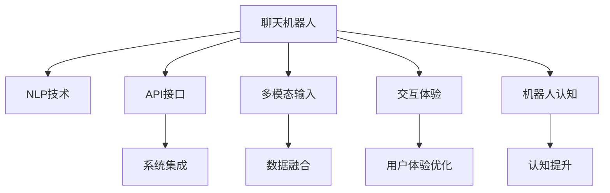

                 

# 集成聊天机器人：与现有的系统互动

> 关键词：聊天机器人,自然语言处理(NLP),集成系统,API接口,实时交互,交互体验,多模态,机器人认知

## 1. 背景介绍

### 1.1 问题由来
近年来，随着人工智能技术的发展，聊天机器人已经在多个领域得到了广泛应用，如客户服务、在线教育、智能客服等。这些机器人通过自然语言处理（Natural Language Processing, NLP）技术，能够与人类用户进行自然对话，提供智能化服务。然而，尽管聊天机器人功能强大，但在实际应用中，常常面临与其他系统的集成问题。如何在保证聊天机器人功能完整的同时，无缝接入现有的系统，提升整体用户体验，是一个值得深入探讨的话题。

### 1.2 问题核心关键点
聊天机器人与现有系统的集成问题主要集中在以下几个方面：

- 如何设计API接口，保证数据传输的效率和安全性。
- 如何处理多模态输入，实现聊天机器人与多种应用场景的无缝衔接。
- 如何优化交互体验，使用户与聊天机器人的对话流畅自然。
- 如何实现机器人的认知能力，增强其理解用户意图的能力。

### 1.3 问题研究意义
研究聊天机器人与现有系统的集成方法，对于提升聊天机器人的应用范围，增强其智能化水平，具有重要意义：

1. 增强系统功能性。通过集成聊天机器人，可以显著提升系统的智能化程度，提供更加丰富的服务。
2. 优化用户体验。聊天机器人的引入，使得用户在多应用场景下都能获得良好的交互体验，提升用户满意度。
3. 促进技术融合。聊天机器人可以与其他AI技术如推荐系统、决策支持系统等进行深度融合，构建更强大的智能化应用。
4. 加速应用落地。聊天机器人与现有系统的无缝集成，使得AI技术更容易被各行各业采用，推动AI技术在各行业的落地应用。

## 2. 核心概念与联系

### 2.1 核心概念概述

为更好地理解聊天机器人与现有系统集成的原理和架构，本节将介绍几个关键概念：

- 聊天机器人(Chatbot)：以NLP技术为基础，能够模拟人类对话的AI系统。通过自然语言理解与生成技术，与用户进行实时互动。
- 自然语言处理(Natural Language Processing, NLP)：涉及计算机如何理解、生成和处理人类语言的技术领域。
- API接口：应用程序编程接口，用于不同系统间的数据交换和调用。
- 多模态(Multimodal)：指利用多种感官信息进行信息获取和处理，如文本、语音、图像、视频等。
- 交互体验(Interactive Experience)：用户与系统的互动过程中，界面设计、响应速度、交互流畅性等方面的综合体验。
- 机器人认知(Cognitive Capability)：指聊天机器人对语言、语义、上下文等复杂概念的理解和推理能力。

这些核心概念之间的逻辑关系可以通过以下Mermaid流程图来展示：



这个流程图展示了几大关键概念之间的相互联系：

1. 聊天机器人通过NLP技术进行语言理解和生成。
2. 聊天机器人通过API接口与其他系统进行数据交换和调用。
3. 聊天机器人利用多模态输入获取更丰富的信息，实现全场景覆盖。
4. 聊天机器人通过优化交互体验，提升用户满意度。
5. 聊天机器人通过增强机器人认知能力，更好地理解用户意图。

这些概念共同构成了聊天机器人与现有系统集成的基础框架，使其能够高效运行。

## 3. 核心算法原理 & 具体操作步骤

### 3.1 算法原理概述

聊天机器人与现有系统的集成，本质上是通过API接口实现数据交互和任务协同的过程。其核心思想是：将聊天机器人作为一个“智能代理”，通过API接口与其他系统进行实时互动，完成复杂任务的执行和数据整合。

形式化地，假设聊天机器人与外部系统进行数据交换，内部逻辑结构如下：

1. **数据接收**：聊天机器人通过API接口接收外部系统传递的数据。
2. **自然语言处理**：将接收到的数据进行自然语言处理，提取关键信息。
3. **任务调度**：根据用户意图，调度系统内部的任务执行器，完成特定功能。
4. **数据生成**：将处理结果转化为自然语言，通过API接口传递给外部系统。

### 3.2 算法步骤详解

基于API接口的聊天机器人集成，一般包括以下几个关键步骤：

**Step 1: 设计API接口**

1. **确定API协议**：选择合适的API协议（如RESTful、gRPC等），设计接口规范。
2. **定义数据格式**：明确数据交换的格式（如JSON、XML等），保证数据的一致性和可读性。
3. **指定参数规范**：定义API接口的参数规范，包括请求参数、响应参数等。
4. **定义返回值**：明确API接口的返回值格式，包括成功状态码、错误信息、数据格式等。

**Step 2: 实现API接口**

1. **编写接口实现**：使用编程语言和框架实现API接口的客户端和服务端。
2. **实现数据交互**：在聊天机器人与外部系统的交互中，通过API接口进行数据的传递和处理。
3. **封装数据处理**：在API接口中，封装数据处理逻辑，实现数据格式转换、错误处理等。

**Step 3: 集成系统交互**

1. **实现任务调度**：根据用户意图，调度聊天机器人内部任务执行器，调用外部系统完成任务。
2. **处理多模态输入**：整合多种输入形式（如文本、语音、图像等），实现全场景下的无缝隙集成。
3. **优化交互体验**：使用户与聊天机器人的对话更加自然流畅，提升用户体验。
4. **提升机器人认知**：增强聊天机器人的语言理解和生成能力，提升认知水平。

**Step 4: 部署和测试**

1. **部署系统**：将聊天机器人和外部系统部署到服务器或云平台。
2. **测试系统**：在实际环境中测试系统的稳定性、性能和兼容性，确保各系统正常工作。
3. **优化系统**：根据测试结果，优化系统架构和算法，提升整体效率和用户体验。

以上是基于API接口的聊天机器人集成的主要步骤。在实际应用中，还需要针对具体任务的特点，对各个环节进行优化设计，如改进任务调度算法、引入更灵活的API协议、增强数据处理能力等，以进一步提升集成效果。

### 3.3 算法优缺点

基于API接口的聊天机器人集成方法具有以下优点：

1. **灵活性高**：通过设计灵活的API接口，可以实现多种应用场景的无缝衔接。
2. **扩展性强**：API接口可快速接入新系统，实现系统的快速迭代和升级。
3. **性能稳定**：API接口采用标准协议，能够保证数据传输的稳定性和安全性。
4. **用户友好**：多模态输入和优化交互体验，使得用户与系统的交互更加自然流畅。

同时，该方法也存在一定的局限性：

1. **接口设计复杂**：API接口的设计需要考虑多种因素，如数据格式、请求参数、响应参数等，设计复杂度较高。
2. **交互延迟高**：多系统间的API调用可能存在延迟，影响实时性。
3. **数据安全性问题**：API接口传递敏感数据时，需要注意数据的安全性，防止信息泄露。
4. **系统耦合度高**：多个系统通过API接口进行集成，系统间耦合度较高，修改一个系统可能影响其他系统的运行。

尽管存在这些局限性，但基于API接口的集成方法仍是目前较为成熟和可靠的系统集成范式。未来相关研究的重点在于如何进一步优化API接口设计，提升系统的灵活性和安全性，同时降低系统的耦合度。

### 3.4 算法应用领域

基于API接口的聊天机器人集成方法，已经在多个领域得到了广泛应用，包括但不限于：

- 在线客服：集成聊天机器人，提供7x24小时不间断的客户服务，提升客户满意度。
- 金融理财：集成聊天机器人，提供个性化的金融咨询、理财建议等，增强用户体验。
- 在线教育：集成聊天机器人，提供智能化的课程推荐、答疑解惑等服务。
- 医疗健康：集成聊天机器人，提供健康咨询、病情诊断等医疗服务。
- 智能家居：集成聊天机器人，提供智能化的家居控制、语音助手等服务。
- 旅游出行：集成聊天机器人，提供旅游建议、行程规划等服务。

除了这些应用场景外，聊天机器人与现有系统的集成方法也在不断扩展，如智慧城市、智能制造等领域，展示了其在智能化服务中的巨大潜力。

## 4. 数学模型和公式 & 详细讲解 & 举例说明

### 4.1 数学模型构建

假设聊天机器人与外部系统进行数据交换，数据模型可以表示为：

$$
(x, y, z) \rightarrow (\text{chatbot}, \text{API}, \text{user})
$$

其中 $x$ 表示用户输入的自然语言文本，$y$ 表示API接口传递的数据，$z$ 表示聊天机器人输出给用户的信息。

### 4.2 公式推导过程

1. **自然语言处理模型**：假设用户输入的自然语言文本为 $x=\{x_i\}_{i=1}^n$，其中 $x_i$ 为单个词汇。
2. **数据交换模型**：假设API接口传递的数据为 $y=\{y_i\}_{i=1}^m$，其中 $y_i$ 为单个数据项。
3. **信息生成模型**：假设聊天机器人输出的信息为 $z=\{z_i\}_{i=1}^p$，其中 $z_i$ 为单个信息单元。

通过自然语言处理模型，将用户输入的文本 $x$ 转化为内部模型表示 $\hat{x}$，并根据API接口传递的数据 $y$ 生成内部表示 $\hat{y}$。然后，通过任务调度，将 $\hat{x}$ 和 $\hat{y}$ 进行融合，生成最终的输出信息 $z$。

### 4.3 案例分析与讲解

以金融理财应用为例，展示聊天机器人与现有系统的集成。假设用户输入的自然语言文本为“我最近股票亏损较多，该怎么办？”，API接口传递的数据为用户的股票账户信息、历史交易记录等。

1. **自然语言处理**：通过NLP模型将用户输入的文本转化为模型表示 $\hat{x}$。
2. **数据交换**：通过API接口获取用户的股票账户信息和历史交易记录，转化为模型表示 $\hat{y}$。
3. **任务调度**：根据用户意图，调度金融理财系统的任务执行器，进行数据分析和建议生成。
4. **信息生成**：将分析结果和建议转化为自然语言文本，生成聊天机器人的回复 $z$，如“您最近亏损较多，建议您分散投资，减少风险”。

通过这种方式，聊天机器人能够实时地与金融理财系统进行数据交换和任务协同，为用户提供个性化的理财建议，提升用户体验。

## 5. 项目实践：代码实例和详细解释说明

### 5.1 开发环境搭建

在进行聊天机器人与现有系统集成的实践前，我们需要准备好开发环境。以下是使用Python进行Flask框架开发的环境配置流程：

1. 安装Anaconda：从官网下载并安装Anaconda，用于创建独立的Python环境。

2. 创建并激活虚拟环境：
```bash
conda create -n chatbot-env python=3.8 
conda activate chatbot-env
```

3. 安装Flask：从官网获取Flask的最新版本并安装。

4. 安装相关依赖库：
```bash
pip install flask requests
```

5. 安装NLP库：
```bash
pip install nltk textblob
```

完成上述步骤后，即可在`chatbot-env`环境中开始集成实践。

### 5.2 源代码详细实现

这里我们以一个简单的聊天机器人为例，展示其与现有系统的集成过程。

首先，定义聊天机器人的API接口：

```python
from flask import Flask, request, jsonify

app = Flask(__name__)

@app.route('/chat', methods=['POST'])
def chat():
    user_input = request.json.get('input', None)
    if user_input is None:
        return jsonify({"message": "Invalid input!"}), 400
    
    # 调用外部系统API获取数据
    api_data = fetch_data(user_input)
    
    # 对用户输入进行自然语言处理
    processed_input = process_input(user_input)
    
    # 进行任务调度，生成聊天机器人的回复
    reply = generate_reply(processed_input, api_data)
    
    return jsonify({"message": reply}), 200

def fetch_data(user_input):
    # 调用外部系统API获取数据
    # ...
    pass

def process_input(user_input):
    # 对用户输入进行自然语言处理
    # ...
    pass

def generate_reply(input, data):
    # 根据用户输入和数据生成聊天机器人的回复
    # ...
    pass
```

然后，实现数据交换和任务调度的具体逻辑：

```python
import requests
import json

def fetch_data(user_input):
    # 调用外部系统API获取数据
    url = 'https://api.example.com/data'
    params = {'input': user_input}
    response = requests.get(url, params=params)
    if response.status_code == 200:
        return json.loads(response.text)
    else:
        return None

def process_input(user_input):
    # 对用户输入进行自然语言处理
    # ...
    pass

def generate_reply(input, data):
    # 根据用户输入和数据生成聊天机器人的回复
    # ...
    pass
```

最后，启动聊天机器人服务，并在测试环境中测试集成效果：

```python
if __name__ == '__main__':
    app.run(host='0.0.0.0', port=5000)
```

在测试环境中，可以使用以下Python代码进行集成测试：

```python
import requests
import json

# 发送POST请求
url = 'http://localhost:5000/chat'
payload = {"input": "我最近股票亏损较多，该怎么办？"}
response = requests.post(url, json=payload)
if response.status_code == 200:
    result = json.loads(response.text)
    print(result['message'])
else:
    print("Failed to get response!")
```

### 5.3 代码解读与分析

这里我们详细解读一下关键代码的实现细节：

**chatbot.py代码**：
- `app`：创建Flask应用程序实例。
- `@app.route('/chat', methods=['POST'])`：定义API接口路由和请求方法。
- `chat()`函数：处理用户输入，调用外部系统API，进行数据处理和任务调度，生成聊天机器人的回复。
- `fetch_data`函数：调用外部系统API获取数据。
- `process_input`函数：对用户输入进行自然语言处理。
- `generate_reply`函数：根据用户输入和数据生成聊天机器人的回复。

**fetch_data函数**：
- `requests.get`：发送HTTP GET请求，获取外部系统API的响应。
- `json.loads`：将响应文本转换为JSON格式。
- 返回JSON格式的数据。

**process_input函数**：
- 对用户输入进行自然语言处理，如分词、词性标注等。
- 处理结果作为聊天机器人的输入。

**generate_reply函数**：
- 根据用户输入和数据生成聊天机器人的回复。
- 回复结果以JSON格式返回。

通过这段代码，可以看到Flask框架可以快速搭建聊天机器人的API接口，实现与外部系统的数据交换和任务调度。

## 6. 实际应用场景

### 6.1 智能客服系统

基于API接口的聊天机器人集成方法，在智能客服系统的构建中具有广泛应用。传统客服系统需要配备大量人力，高峰期响应缓慢，且服务质量难以保证。而聊天机器人可以24小时不间断服务，快速响应客户咨询，提升客户满意度。

在技术实现上，可以集成聊天机器人，提供7x24小时不间断的客户服务，同时通过API接口与其他系统如工单系统、知识库系统等进行数据交换，实现问题的快速解决和知识的传递。聊天机器人通过实时分析用户输入，理解用户意图，调用对应的系统模块进行问题解答，提升服务效率和质量。

### 6.2 金融理财应用

金融理财应用中的聊天机器人，可以通过API接口与用户信息管理系统、交易系统等进行数据交换，实现个性化理财建议、账户管理等功能的集成。用户输入的金融需求通过聊天机器人进行自然语言处理，转化为系统可读的数据，调用对应的API接口进行数据分析和处理，生成个性化的理财建议和账户管理信息。聊天机器人根据用户的反馈，不断优化建议，提升用户满意度。

### 6.3 在线教育平台

在线教育平台中的聊天机器人，可以通过API接口与其他系统如学习管理系统、题库系统等进行数据交换，实现智能化的课程推荐、答疑解惑等服务。用户输入的学习需求通过聊天机器人进行自然语言处理，转化为系统可读的数据，调用对应的API接口进行数据分析和处理，生成个性化的课程推荐和答疑信息。聊天机器人根据用户的反馈，不断优化推荐和答疑内容，提升用户体验。

### 6.4 智慧健康应用

智慧健康应用中的聊天机器人，可以通过API接口与医院信息系统、电子病历系统等进行数据交换，实现智能化的健康咨询、病情诊断等服务。用户输入的健康咨询需求通过聊天机器人进行自然语言处理，转化为系统可读的数据，调用对应的API接口进行数据分析和处理，生成个性化的健康建议和诊断结果。聊天机器人根据用户的反馈，不断优化建议和诊断结果，提升用户满意度。

## 7. 工具和资源推荐

### 7.1 学习资源推荐

为了帮助开发者系统掌握聊天机器人与现有系统的集成理论基础和实践技巧，这里推荐一些优质的学习资源：

1. 《Flask Web开发实战》书籍：详细介绍Flask框架的使用方法和最佳实践，是Flask开发的好帮手。
2. 《自然语言处理综论》书籍：全面介绍NLP的基本概念和算法，是NLP学习的好资源。
3. 《API设计规范》书籍：详细讲解API设计的最佳实践和规范，是API开发的好参考。
4. HuggingFace官方文档：Transformer库的官方文档，提供了海量预训练模型和完整的微调样例代码，是NLP学习的好工具。
5. OpenAI的HuggingFace社区：提供了丰富的开源资源和社区支持，是AI开发的好社区。

通过对这些资源的学习实践，相信你一定能够快速掌握聊天机器人与现有系统的集成技巧，并用于解决实际的AI问题。

### 7.2 开发工具推荐

高效的开发离不开优秀的工具支持。以下是几款用于聊天机器人与现有系统集成的常用工具：

1. Flask：轻量级的Web开发框架，简单易用，适合快速搭建API接口。
2. RESTful：提供简单易用的RESTful API设计工具，帮助开发者设计友好的API接口。
3. Swagger：API接口设计和文档生成工具，帮助开发者快速构建API接口和文档。
4. Postman：API接口测试工具，帮助开发者测试API接口的正确性和性能。
5. PyCharm：Python开发环境，提供丰富的开发工具和调试功能，是Python开发的好帮手。

合理利用这些工具，可以显著提升聊天机器人与现有系统集成的开发效率，加快创新迭代的步伐。

### 7.3 相关论文推荐

聊天机器人与现有系统的集成方法已经得到广泛研究，以下是几篇奠基性的相关论文，推荐阅读：

1. "Chatbots That Can Learn From Conversations"：提出基于深度学习的聊天机器人模型，通过自然语言处理和API接口实现用户意图理解。
2. "Contextual Conversational Recommendations"：提出基于聊天机器人的个性化推荐系统，通过自然语言处理和任务调度实现推荐功能的集成。
3. "Multimodal Information Fusion for Conversational Recommendation"：提出基于多模态数据的聊天机器人推荐系统，通过融合文本、语音、图像等模态信息提升推荐效果。
4. "Dialogue System Architectures"：介绍多种聊天机器人架构，包括基于规则、基于生成、基于神经网络的架构，提供丰富的设计思路。
5. "Multimodal Conversational Agents"：介绍多种多模态聊天机器人系统，包括文本、语音、图像等模态的集成方法。

这些论文代表了大语言模型微调技术的发展脉络。通过学习这些前沿成果，可以帮助研究者把握学科前进方向，激发更多的创新灵感。

## 8. 总结：未来发展趋势与挑战

### 8.1 总结

本文对基于API接口的聊天机器人与现有系统的集成方法进行了全面系统的介绍。首先阐述了聊天机器人在实际应用中的集成问题，明确了集成方法在提升系统智能水平、优化用户体验方面的独特价值。其次，从原理到实践，详细讲解了API接口设计、自然语言处理、任务调度等核心步骤，给出了集成的完整代码实例。同时，本文还广泛探讨了集成方法在智能客服、金融理财、在线教育等多个行业领域的应用前景，展示了集成方法的巨大潜力。

通过本文的系统梳理，可以看到，基于API接口的聊天机器人集成方法已经成为NLP领域的重要范式，极大地拓展了聊天机器人的应用边界，催生了更多的落地场景。受益于API接口的标准化和灵活性，聊天机器人可以无缝接入现有的系统，提升整体用户体验。未来，伴随API接口设计技术的不断进步，聊天机器人与现有系统的集成将更加高效、灵活，进一步推动NLP技术在各行业的应用发展。

### 8.2 未来发展趋势

展望未来，聊天机器人与现有系统的集成技术将呈现以下几个发展趋势：

1. **API接口的标准化和统一化**：未来API接口设计将更加标准化和统一化，减少系统间的耦合度，提高系统的兼容性和扩展性。
2. **自然语言处理能力的增强**：随着NLP技术的不断发展，聊天机器人的自然语言处理能力将不断提升，实现更加智能化的对话。
3. **多模态输入和处理的集成**：未来的聊天机器人将利用多模态输入，实现文本、语音、图像等多种信息的融合处理，提供更全面的用户体验。
4. **任务调度的智能化**：未来的聊天机器人将通过更加智能化的任务调度算法，实现任务的自动化和高效协同。
5. **用户个性化服务的提升**：未来的聊天机器人将通过更精准的用户建模，提供更加个性化的服务和推荐。
6. **系统集成环境的优化**：未来的集成环境将更加灵活和高效，支持微服务架构、容器化部署等新兴技术。

以上趋势凸显了聊天机器人与现有系统集成技术的广阔前景。这些方向的探索发展，必将进一步提升聊天机器人的应用范围和智能化水平，为NLP技术的发展提供新的驱动力。

### 8.3 面临的挑战

尽管聊天机器人与现有系统的集成技术已经取得了显著成果，但在迈向更加智能化、普适化应用的过程中，仍面临诸多挑战：

1. **系统间数据格式和协议的差异**：不同系统之间的数据格式和API协议可能存在差异，需要进行格式转换和协议适配，增加系统集成的复杂度。
2. **多模态输入的复杂性**：多模态输入的融合处理需要考虑多种数据源的一致性和实时性，增加了集成的复杂度。
3. **用户隐私和安全问题**：聊天机器人需要处理大量的用户数据，需要确保数据的安全性和隐私性，防止信息泄露。
4. **跨系统调度的性能问题**：多系统间的API调用可能存在延迟，影响系统的实时性。
5. **集成环境的扩展性问题**：未来的系统集成环境可能涉及更多系统和服务，需要保证系统的灵活性和扩展性。

这些挑战需要开发者在实际应用中不断探索和解决，以确保聊天机器人与现有系统的无缝集成。

### 8.4 研究展望

面对聊天机器人与现有系统集成所面临的种种挑战，未来的研究需要在以下几个方面寻求新的突破：

1. **API接口的自动生成**：通过自动生成API接口，减少人工设计和适配的工作量，提高集成的效率和准确性。
2. **自然语言处理的通用性**：开发更加通用的自然语言处理模型，实现不同应用场景下的无缝隙集成。
3. **多模态融合技术的提升**：提升多模态输入的融合处理能力，实现更加全面和精准的用户建模。
4. **分布式调度的优化**：优化分布式调度的算法，提升系统的实时性和扩展性。
5. **隐私保护和安全机制的增强**：引入隐私保护和安全机制，确保用户数据的安全性和隐私性。
6. **智能推荐系统的结合**：结合智能推荐系统，提供更加个性化的服务。

这些研究方向将进一步推动聊天机器人与现有系统的集成技术的发展，使其能够更好地适应不同应用场景，提升整体用户体验。

## 9. 附录：常见问题与解答

**Q1：如何设计高效的API接口？**

A: 设计高效的API接口需要考虑以下几点：
1. **简洁明了**：接口应简洁明了，避免复杂的设计。
2. **通用性**：接口应尽可能通用，能够适应不同的应用场景。
3. **可扩展性**：接口应具有可扩展性，方便未来功能的扩展和升级。
4. **安全性**：接口应具备良好的安全性，防止恶意攻击和数据泄露。
5. **性能优化**：接口应具备高性能，保证数据传输的效率和稳定性。

**Q2：如何优化API接口的数据传输效率？**

A: 优化API接口的数据传输效率可以从以下几个方面入手：
1. **数据压缩**：使用压缩算法对传输数据进行压缩，减小传输量。
2. **数据分片**：将大文件分成多个小片段进行传输，减小单次传输量。
3. **数据缓存**：在客户端和服务器端进行数据缓存，减少频繁的数据传输。
4. **异步传输**：使用异步传输方式，减少数据传输的阻塞和等待时间。
5. **数据缓存**：在客户端和服务器端进行数据缓存，减少频繁的数据传输。

**Q3：如何确保API接口的安全性？**

A: 确保API接口的安全性需要从以下几个方面入手：
1. **身份认证**：使用身份认证机制，防止未授权用户访问接口。
2. **数据加密**：对传输数据进行加密，防止数据泄露。
3. **权限控制**：对接口进行权限控制，限制用户访问接口的权限。
4. **日志记录**：记录API接口的访问日志，便于异常监控和问题排查。
5. **异常检测**：使用异常检测技术，及时发现和处理异常请求。

这些措施可以大大提升API接口的安全性，保障系统的稳定运行。

**Q4：如何处理多模态输入？**

A: 处理多模态输入可以从以下几个方面入手：
1. **数据格式转换**：将不同模态的数据格式进行转换，保证数据的一致性。
2. **数据融合**：对不同模态的数据进行融合处理，实现多模态信息的协同分析。
3. **语义对齐**：对不同模态的信息进行语义对齐，实现信息的统一理解。
4. **融合算法**：使用融合算法，将多模态信息进行综合处理，生成统一的输出。

这些措施可以提升多模态输入的处理能力，实现更全面的用户建模和系统集成。

**Q5：如何优化聊天机器人的交互体验？**

A: 优化聊天机器人的交互体验可以从以下几个方面入手：
1. **自然语言处理**：提升自然语言处理的准确性和流畅性，使用户与聊天机器人的对话更加自然。
2. **上下文理解**：增强聊天机器人的上下文理解能力，实现更智能化的对话。
3. **个性化推荐**：根据用户的历史行为和偏好，提供个性化的服务和推荐。
4. **多渠道支持**：支持多种交互渠道，如文本、语音、图像等，提升用户的便捷性。
5. **实时反馈**：提供实时反馈机制，提升用户的互动体验。

这些措施可以提升聊天机器人的交互体验，使用户与系统的互动更加顺畅和高效。

---

作者：禅与计算机程序设计艺术 / Zen and the Art of Computer Programming

