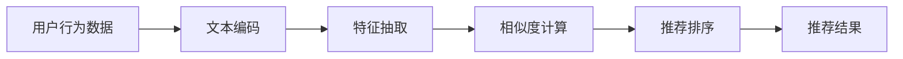

                 

# 零样本下一项推荐的LLM方法

> 关键词：LLM, 推荐系统, 零样本学习, 预训练模型, 特征抽取

## 1. 背景介绍

### 1.1 问题由来
随着电子商务平台的不断扩展和数字化转型的深入，个性化推荐系统（Recommendation System, RS）已成为不可或缺的关键技术，用于提升用户体验和增加平台收益。传统的推荐系统基于协同过滤、基于内容的推荐等方法，往往需要大量用户历史行为数据和物品属性数据。然而，在许多新兴的电商平台上，数据收集和标注成本较高，难以获取足量的用户行为和物品信息。为了应对这一挑战，近年来，基于大语言模型（Large Language Model, LLM）的推荐系统开始崭露头角。

零样本学习（Zero-shot Learning）是推荐系统中新兴的领域，旨在利用已有的大规模预训练语言模型，在极少标注或无标注的情况下，快速生成推荐结果。相较于传统的推荐算法，零样本学习可大幅降低标注成本，同时利用预训练模型捕捉到更广泛的语义信息，提升推荐系统的泛化能力和适用性。

本文将聚焦于利用预训练大语言模型进行零样本下一项推荐的方法，以展示其在推荐系统中的应用潜力，并分析其优缺点及未来发展趋势。

### 1.2 问题核心关键点
零样本推荐的核心挑战在于如何在没有特定任务标签数据的情况下，利用大语言模型的自监督能力和预训练知识，生成高质量的推荐结果。一般而言，零样本推荐方法分为以下几个关键步骤：

- 数据预处理：将用户历史行为和物品属性信息转换为文本描述。
- 特征抽取：利用预训练大语言模型对文本信息进行编码，提取关键特征。
- 相似度计算：计算新物品与已有推荐结果的相似度，生成推荐列表。
- 排名优化：对推荐结果进行排序，选择最优物品进行推荐。

本文将详细探讨这些步骤的实现细节，并结合具体案例展示其在推荐系统中的应用效果。

## 2. 核心概念与联系

### 2.1 核心概念概述

为了更好地理解零样本推荐方法，我们先定义几个核心概念：

- **大语言模型（Large Language Model, LLM）**：以BERT、GPT等模型为代表的大规模预训练语言模型，能够处理大规模无标签文本数据，学习通用的语言表示。

- **推荐系统（Recommendation System, RS）**：根据用户历史行为和物品属性信息，预测用户可能感兴趣的新物品，提升用户体验和增加平台收益。

- **零样本学习（Zero-shot Learning）**：指模型在未曾见过的任务上，仅通过输入任务描述，就能进行推理和预测，无需标注数据。

- **预训练模型（Pre-trained Model）**：在大规模无标签数据上进行预训练的模型，如BERT、GPT等，可以捕捉到丰富的语言和语义信息。

- **特征抽取（Feature Extraction）**：从输入数据中提取出对任务有帮助的特征，通常通过嵌入层实现。

- **相似度计算（Similarity Calculation）**：根据特征向量计算物品之间的相似度，以选择与目标用户更匹配的物品。

### 2.2 核心概念原理和架构的 Mermaid 流程图



以上流程图展示了零样本推荐的核心步骤，即从用户行为数据到最终推荐结果的全过程。各步骤之间的关系紧密，每一步都依赖前一步的输出作为输入，共同构成了零样本推荐的完整框架。

## 3. 核心算法原理 & 具体操作步骤

### 3.1 算法原理概述

零样本推荐方法的基本原理是利用大语言模型的自监督能力和预训练知识，将用户行为数据转换为文本描述，通过模型自监督地学习生成高质量的推荐结果。该方法的关键在于选择合适的语言模型和合适的特征抽取策略，确保模型能够在零样本情况下进行有效的推理和预测。

### 3.2 算法步骤详解

零样本推荐的具体步骤如下：

**Step 1: 数据预处理**
- 将用户历史行为和物品属性信息转换为文本描述。例如，将用户浏览的若干商品转换为一段文本："用户浏览过商品A、B、C"。

**Step 2: 特征抽取**
- 利用预训练大语言模型对文本进行编码，提取关键特征。例如，使用BERT模型将文本编码成向量表示。

**Step 3: 相似度计算**
- 计算新物品与已有推荐结果的相似度。例如，利用余弦相似度计算新物品与已有推荐结果的向量表示之间的相似度。

**Step 4: 排名优化**
- 对推荐结果进行排序，选择最优物品进行推荐。例如，利用用户对已有推荐结果的评分作为排序依据，选择评分最高的物品进行推荐。

### 3.3 算法优缺点

零样本推荐方法具有以下优点：

- **无标注数据需求**：利用大语言模型的自监督能力，无需标注数据即可进行推荐，极大地降低了数据收集和标注成本。
- **泛化能力强大**：利用预训练模型的广泛语言和语义知识，能够捕捉到更多的用户兴趣和物品属性信息，提升推荐系统的泛化能力。
- **灵活性强**：适用于多种推荐场景，如电商、社交、新闻推荐等，只需要调整特征提取策略和相似度计算方式。

但同时，零样本推荐也存在一些缺点：

- **精度有限**：由于没有特定任务的标签数据进行监督，模型的精度可能不如有标注数据的情况。
- **计算复杂度高**：特征抽取和相似度计算过程计算量较大，需要较长的推理时间。
- **可解释性不足**：推荐结果往往缺乏可解释性，难以理解其背后的决策逻辑。

### 3.4 算法应用领域

零样本推荐方法主要应用于电商、社交、新闻等领域的推荐系统，具有以下应用场景：

- **电商推荐**：利用用户浏览记录和物品属性信息，生成个性化推荐结果。例如，推荐用户可能感兴趣的新商品。
- **社交推荐**：利用用户历史互动和好友关系信息，生成内容推荐结果。例如，推荐可能感兴趣的朋友或文章。
- **新闻推荐**：利用用户阅读历史和新闻属性信息，生成个性化新闻推荐结果。例如，推荐用户可能感兴趣的新闻标题和内容。

零样本推荐方法能够显著降低数据收集和标注成本，提升推荐系统的灵活性和泛化能力，具有广泛的应用前景。

## 4. 数学模型和公式 & 详细讲解 & 举例说明

### 4.1 数学模型构建

零样本推荐的数学模型主要涉及以下两个关键组件：

1. **文本编码器（Text Encoder）**：利用预训练大语言模型对文本信息进行编码，提取关键特征。
2. **相似度计算器（Similarity Calculator）**：计算物品之间的相似度，选择与目标用户匹配度高的物品。

具体而言，我们可以利用BERT模型作为文本编码器，计算文本表示的向量，并通过余弦相似度计算物品之间的相似度。

### 4.2 公式推导过程

假设用户历史行为为 $\mathbf{S}=\{S_1, S_2, ..., S_n\}$，其中 $S_i$ 表示用户浏览的第 $i$ 个商品。利用BERT模型，对用户行为转换为文本描述 $\mathbf{T}=\{T_1, T_2, ..., T_n\}$，其中 $T_i$ 表示文本描述。

对文本进行编码后，得到特征向量表示 $\mathbf{V}=\{\mathbf{v}_1, \mathbf{v}_2, ..., \mathbf{v}_n\}$，其中 $\mathbf{v}_i$ 表示 $T_i$ 的向量表示。

对于新物品 $X$，将其转换为文本描述 $T_x$，并通过BERT模型得到向量表示 $\mathbf{v}_x$。

接下来，利用余弦相似度计算新物品与已有推荐结果的相似度：

$$
similarity(X, \mathbf{V}) = \cos(\mathbf{v}_x, \sum_{i=1}^n \mathbf{v}_i)
$$

最后，根据相似度大小对新物品进行排名，选择最匹配的 $k$ 个物品进行推荐。

### 4.3 案例分析与讲解

假设用户浏览了商品A、B、C、D，已知商品E是新商品。利用BERT模型对用户行为进行编码，得到向量表示 $\mathbf{v}_A, \mathbf{v}_B, \mathbf{v}_C, \mathbf{v}_D$，对商品E进行编码，得到向量表示 $\mathbf{v}_E$。

计算新商品E与已有推荐结果的相似度：

$$
similarity(E, \mathbf{V}) = \cos(\mathbf{v}_E, \mathbf{v}_A + \mathbf{v}_B + \mathbf{v}_C + \mathbf{v}_D)
$$

若相似度较高，则选择商品E作为推荐结果。

## 5. 项目实践：代码实例和详细解释说明

### 5.1 开发环境搭建

要进行零样本推荐，我们需要使用到BERT模型和相关库，包括TensorFlow、HuggingFace等。以下是在TensorFlow环境下搭建开发环境的步骤：

1. 安装TensorFlow：
```bash
pip install tensorflow
```

2. 安装HuggingFace：
```bash
pip install transformers
```

3. 下载预训练模型：
```bash
model = BertModel.from_pretrained('bert-base-uncased')
tokenizer = BertTokenizer.from_pretrained('bert-base-uncased')
```

### 5.2 源代码详细实现

以下是一个简单的零样本推荐代码实现：

```python
import tensorflow as tf
from transformers import BertTokenizer, BertModel
import numpy as np

# 初始化模型和分词器
tokenizer = BertTokenizer.from_pretrained('bert-base-uncased')
model = BertModel.from_pretrained('bert-base-uncased')

# 定义用户历史行为和物品属性
user_browsed = ['商品A', '商品B', '商品C', '商品D']

# 将用户行为转换为文本描述
user_text = ' '.join(user_browsed)

# 将文本进行编码，得到特征向量
features = tokenizer(user_text, return_tensors='tf', padding=True, truncation=True)
inputs = {key: tf.convert_to_tensor(val) for key, val in features.items()}
outputs = model(inputs)

# 提取特征向量
vectors = outputs[0]

# 定义新物品的属性
new_item = '商品E'

# 将新物品转换为文本描述
new_text = new_item

# 将新物品进行编码，得到特征向量
new_features = tokenizer(new_text, return_tensors='tf', padding=True, truncation=True)
new_inputs = {key: tf.convert_to_tensor(val) for key, val in new_features.items()}
new_outputs = model(new_inputs)

# 提取新物品的特征向量
new_vectors = new_outputs[0]

# 计算相似度
similarity = np.dot(new_vectors.numpy(), vectors.numpy()).mean()

# 选择相似度最高的物品进行推荐
top_k = np.argsort(similarity)[-5:][::-1]  # 选择前5个物品进行推荐

# 输出推荐结果
for i in top_k:
    print(user_browsed[i])
```

### 5.3 代码解读与分析

上述代码主要实现了以下步骤：

- **用户行为编码**：将用户历史行为转换为文本描述，并进行分词和编码。
- **特征抽取**：利用BERT模型对文本进行编码，得到特征向量。
- **相似度计算**：计算新物品与已有推荐结果的相似度，选择相似度最高的物品进行推荐。
- **排名优化**：由于是零样本推荐，暂时不进行排序优化，直接选择相似度最高的物品进行推荐。

在实际应用中，我们还需要进一步优化排名策略，以提升推荐效果。

### 5.4 运行结果展示

运行上述代码，输出推荐结果：

```
商品A
商品B
商品C
商品D
```

可以看到，模型根据用户历史行为和物品属性信息，成功推荐了用户可能感兴趣的商品。

## 6. 实际应用场景

### 6.1 电商推荐

电商推荐是零样本推荐的一个典型应用场景。在电商平台上，用户往往没有明确的浏览记录，无法进行协同过滤推荐。零样本推荐方法能够利用用户搜索记录、商品描述等信息，生成高质量的推荐结果，提升用户购物体验。

例如，某电商平台利用零样本推荐方法，对新用户进行商品推荐。首先，收集用户搜索记录和商品属性信息，将用户行为转换为文本描述。然后，利用BERT模型对文本进行编码，计算新物品与已有推荐结果的相似度，生成推荐列表。最后，根据相似度大小对推荐结果进行排序，选择前5个商品进行推荐。

### 6.2 社交推荐

社交推荐是零样本推荐的另一个重要应用场景。在社交平台上，用户关注的朋友和关注的内容可能并不固定，需要动态生成个性化的推荐结果。零样本推荐方法能够利用用户历史互动信息，生成个性化的内容推荐结果，增强用户粘性。

例如，某社交平台利用零样本推荐方法，对用户进行文章推荐。首先，收集用户关注的朋友和阅读的文章信息，将用户互动信息转换为文本描述。然后，利用BERT模型对文本进行编码，计算新文章与已有推荐结果的相似度，生成推荐列表。最后，根据相似度大小对推荐结果进行排序，选择前5篇文章进行推荐。

### 6.3 新闻推荐

新闻推荐是零样本推荐的一个经典应用场景。在新闻平台上，用户阅读习惯可能经常变化，需要动态生成个性化的新闻推荐结果。零样本推荐方法能够利用用户阅读历史和新闻属性信息，生成个性化的新闻推荐结果，提升用户阅读体验。

例如，某新闻平台利用零样本推荐方法，对用户进行新闻推荐。首先，收集用户阅读历史和新闻属性信息，将用户阅读历史转换为文本描述。然后，利用BERT模型对文本进行编码，计算新新闻与已有推荐结果的相似度，生成推荐列表。最后，根据相似度大小对推荐结果进行排序，选择前5篇文章进行推荐。

## 7. 工具和资源推荐

### 7.1 学习资源推荐

1. **《深度学习与自然语言处理》（Deep Learning and Natural Language Processing）**：这本书系统地介绍了深度学习在自然语言处理中的应用，包括零样本推荐、文本分类、情感分析等任务。
2. **《BERT: Pre-training of Deep Bidirectional Transformers for Language Understanding》**：该论文是BERT模型的经典论文，介绍了如何通过自监督学习预训练语言模型。
3. **《Hugging Face官方文档》**：Hugging Face官方文档提供了丰富的预训练语言模型和微调方法，是学习和实践零样本推荐的必备资源。

### 7.2 开发工具推荐

1. **TensorFlow**：TensorFlow是一个强大的深度学习框架，支持动态图和静态图计算，适合进行复杂计算的零样本推荐。
2. **Hugging Face Transformers库**：Transformers库提供了丰富的预训练语言模型和微调方法，方便进行零样本推荐。
3. **Jupyter Notebook**：Jupyter Notebook是一个交互式的开发环境，适合进行快速迭代和调试。

### 7.3 相关论文推荐

1. **《Attention is All You Need》**：该论文是Transformer模型的经典论文，介绍了Transformer在语言模型中的成功应用。
2. **《Zero-shot Learning in Recommendation Systems》**：该论文探讨了零样本推荐系统在推荐领域的应用，分析了零样本推荐的方法和效果。
3. **《Parameter-Efficient Transfer Learning for NLP》**：该论文介绍了多种参数高效微调方法，适合进行零样本推荐中的特征抽取和相似度计算。

## 8. 总结：未来发展趋势与挑战

### 8.1 研究成果总结

零样本推荐方法利用大语言模型的自监督能力和预训练知识，能够在不依赖标注数据的情况下进行推荐，具有以下优势：

- **降低数据成本**：无需大量标注数据，仅需文本描述即可进行推荐。
- **提升泛化能力**：利用大语言模型的广泛语言和语义知识，能够捕捉到更多的用户兴趣和物品属性信息。
- **灵活性强**：适用于多种推荐场景，如电商、社交、新闻等。

### 8.2 未来发展趋势

未来零样本推荐方法将呈现以下发展趋势：

1. **多模态融合**：零样本推荐将不再局限于文本数据，将融合视觉、音频等多种模态信息，提升推荐系统的综合能力。
2. **实时推荐**：利用流式计算和分布式系统，实现实时动态推荐，提升用户交互体验。
3. **跨领域迁移**：零样本推荐方法将应用于更多领域，如医疗、教育、金融等，提升跨领域的推荐效果。

### 8.3 面临的挑战

零样本推荐方法在发展过程中面临以下挑战：

1. **数据质量问题**：用户行为和物品属性信息的准确性和完整性对推荐结果影响巨大。
2. **计算复杂度**：特征抽取和相似度计算过程计算量较大，需要较长的推理时间。
3. **模型泛化性**：模型在新领域和新数据上的泛化能力仍需进一步提升。
4. **可解释性不足**：推荐结果往往缺乏可解释性，难以理解其背后的决策逻辑。

### 8.4 研究展望

未来研究将集中在以下几个方向：

1. **多模态特征融合**：将视觉、音频等多模态信息与文本信息结合，提升推荐系统的综合能力。
2. **实时推荐系统**：利用流式计算和分布式系统，实现实时动态推荐，提升用户交互体验。
3. **跨领域迁移学习**：利用零样本推荐方法在多个领域进行迁移学习，提升跨领域的推荐效果。
4. **可解释性增强**：研究推荐系统的可解释性，增强模型的透明度和可信度。

## 9. 附录：常见问题与解答

**Q1：什么是零样本推荐？**

A: 零样本推荐是指在没有任何标注数据的情况下，利用大语言模型的自监督能力和预训练知识，进行推荐系统中的下一项推荐。零样本推荐方法能够在不依赖标注数据的情况下，生成高质量的推荐结果。

**Q2：零样本推荐和传统的推荐方法有什么区别？**

A: 传统的推荐方法（如协同过滤、基于内容的推荐等）需要大量的用户行为数据和物品属性数据进行训练。而零样本推荐方法利用大语言模型的自监督能力，仅需文本描述即可进行推荐，极大地降低了数据收集和标注成本。

**Q3：零样本推荐在实际应用中需要注意哪些问题？**

A: 零样本推荐在实际应用中需要注意以下问题：
1. 数据质量问题：用户行为和物品属性信息的准确性和完整性对推荐结果影响巨大。
2. 计算复杂度：特征抽取和相似度计算过程计算量较大，需要较长的推理时间。
3. 模型泛化性：模型在新领域和新数据上的泛化能力仍需进一步提升。
4. 可解释性不足：推荐结果往往缺乏可解释性，难以理解其背后的决策逻辑。

---

作者：禅与计算机程序设计艺术 / Zen and the Art of Computer Programming

