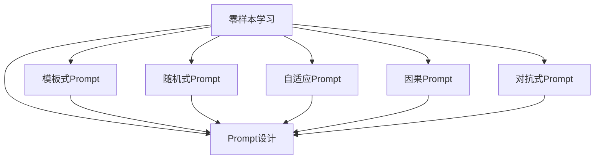

                 

# 零样本学习的进步：Prompt的设计与优化

> 关键词：零样本学习,Prompt设计,优化,自然语言处理(NLP),深度学习,大语言模型,自然语言理解,语言生成,对话系统

## 1. 背景介绍

### 1.1 问题由来

零样本学习（Zero-Shot Learning, ZSL）是指在没有任何带有标签的训练样本的情况下，模型能够根据输入的自然语言描述和指导（如任务名称、类别或属性等），对未知类别的样本进行分类或预测。这种技术在NLP领域，特别是在任务多样性高且标注数据稀缺的情况下，具有重要应用价值。

传统的零样本学习主要依赖于预训练模型和特征提取器，通过一些相似性度量或决策边界，实现对新类别样本的分类。然而，这种方法往往缺乏解释性，且在复杂任务和多样性数据上的效果有限。近年来，零样本学习领域出现了许多新的研究方向，其中最引人注目的是Prompt的学习与优化。

Prompt是一种结构化的自然语言输入，通过精心设计的格式和语义引导，可以使大语言模型在无需训练的情况下，完成特定任务。Prompt设计的好坏直接影响了模型在零样本学习中的表现。因此，如何设计高效的Prompt成为当前零样本学习研究的焦点。

### 1.2 问题核心关键点

Prompt的优化设计需要考虑以下几个核心关键点：

- **任务引导语（Task prompt）**：描述具体任务，如分类、生成、匹配等，引导模型进行任务相关推理。
- **实例提示（Instance prompt）**：提供具体的样例，帮助模型理解样本的上下文和属性。
- **选择式提示（Choice prompt）**：列出行可能的答案或选项，模型根据输入的自然语言描述选择最合适的答案。
- **否定提示（Negation prompt）**：否定某些选项，排除可能的误判。
- **因果关系（Causal relationships）**：在提示中引入因果逻辑，提高模型的推理能力。
- **语境增强（Contextual enhancement）**：通过上下文信息的丰富和环境嵌入，增强模型的泛化能力。

Prompt设计的目标是在最小化预训练模型参数更新的前提下，最大化模型的零样本推理效果。

### 1.3 问题研究意义

零样本学习的研究对于提升NLP系统的泛化能力、降低数据标注成本、加速新应用场景的落地具有重要意义：

1. **数据稀缺情况下的任务适应**：在许多应用场景中，数据标注成本高且难以获取，零样本学习可以使得模型在没有标签数据的情况下，依然能够进行推理和预测。
2. **快速原型设计**：开发新NLP应用时，可以通过Zero-ShotPrompt技术快速生成原型，验证应用概念的可行性。
3. **知识迁移**：模型可以利用其在某些领域的知识，迁移到新的领域，提升在零样本情况下的表现。
4. **增强模型的解释性**：Prompt设计可以让模型的推理过程更具解释性，方便用户理解模型决策逻辑。
5. **应对新出现或未知类别**：模型可以处理未知类别或新兴领域的任务，无需重新训练或标记数据。

## 2. 核心概念与联系

### 2.1 核心概念概述

为更好地理解Prompt优化设计的原理和架构，本节将介绍几个关键概念及其联系：

- **零样本学习（Zero-Shot Learning）**：在无标注样本的情况下，利用预训练模型的语言表示能力和零样本推理技巧，进行任务分类或预测。
- **Prompt（提示）**：通过自然语言输入，引导模型进行特定任务推理，通常包含任务描述、样本信息和推理指令。
- **模板式Prompt（Template-based Prompt）**：预定义的Prompt模板，根据不同任务进行修改或插入。
- **随机式Prompt（Random-based Prompt）**：基于随机生成的自然语言句式，赋予模型灵活的推理空间。
- **自适应Prompt（Adaptive Prompt）**：根据输入数据动态生成Prompt，提高模型的适应性。
- **因果Prompt（Causal Prompt）**：引入因果关系，增强模型的推理逻辑和准确性。
- **对抗式Prompt（Adversarial Prompt）**：在提示中引入对抗样本，提升模型的鲁棒性和泛化能力。

这些核心概念之间的逻辑关系可以通过以下Mermaid流程图来展示：



这个流程图展示零样本学习与Prompt设计的关系，以及各种Prompt类型的应用场景。

## 3. 核心算法原理 & 具体操作步骤
### 3.1 算法原理概述

Prompt优化设计的算法原理主要基于预训练语言模型在大规模文本数据上的自监督学习结果，通过精心设计的Prompt，将预训练模型的语言理解和生成能力最大化地应用于零样本学习任务。

具体而言，Prompt优化设计遵循以下步骤：

1. **理解任务描述**：解析输入的Natural Language Description（NLD），理解任务的具体要求。
2. **生成模板Prompt**：根据任务类型，生成一个或多个基于任务描述的模板Prompt。
3. **插入实例信息**：根据具体样本的上下文，在模板Prompt中插入实例信息，引导模型进行推理。
4. **推理与预测**：将生成器或判别器输出的结果进行推理和预测，得出最终结果。

### 3.2 算法步骤详解

Prompt优化设计的具体操作步骤如下：

**Step 1: 理解任务描述**
- 解析输入的自然语言描述，提取任务类型和目标。
- 使用分词器将任务描述分解为Token。
- 将Token通过Embedding向量映射到模型能够理解的低维空间。

**Step 2: 生成模板Prompt**
- 根据任务类型和目标，生成一个或多个 Prompt Template。
- 模板中应包含任务类型、目标类别、推理逻辑等关键信息。

**Step 3: 插入实例信息**
- 根据具体样本的上下文，将样本信息嵌入到模板Prompt中。
- 使用分词器将实例信息分解为Token。
- 将Token通过Embedding向量映射到模型能够理解的低维空间。
- 在模板Prompt中的合适位置插入实例信息，生成最终的Prompt。

**Step 4: 推理与预测**
- 将生成的Prompt输入到预训练语言模型中。
- 模型根据Prompt进行推理，得出预测结果。
- 返回预测结果，供后续应用场景使用。

### 3.3 算法优缺点

Prompt优化设计的算法具有以下优点：

- **灵活性高**：通过灵活的Prompt设计，模型可以在各种任务和数据分布上进行推理。
- **适应性强**：根据不同任务和数据，可以动态生成Prompt，提升模型适应性。
- **泛化能力强**：通过多任务的提示设计，模型可以迁移到新任务，提升泛化能力。
- **推理过程透明**：通过精心设计的Prompt，模型推理过程透明，方便解释和调试。

同时，该算法也存在一些局限性：

- **设计复杂**：需要根据不同任务设计合适的Prompt，设计复杂且耗时。
- **模型依赖强**：Prompt效果依赖于预训练模型的能力，预训练模型的性能直接影响Prompt效果。
- **泛化性有待提高**：在复杂和多样化的数据上，Prompt的泛化效果可能不佳。

### 3.4 算法应用领域

Prompt优化设计的算法已经在各种NLP任务上得到了广泛应用，以下是几个主要应用领域：

- **自然语言理解（NLU）**：通过Prompt，模型可以理解自然语言描述中的任务要求，并进行相应的分类或推理。
- **语言生成（NLG）**：使用Prompt生成符合任务要求的自然语言文本，应用于文本摘要、对话系统等任务。
- **信息检索（IR）**：通过Prompt，模型可以从海量的文本中检索出符合任务要求的信息，应用于问答系统等任务。
- **情感分析（Sentiment Analysis）**：通过Prompt，模型可以理解自然语言描述中的情感倾向，应用于情感判断等任务。
- **实体识别（Named Entity Recognition, NER）**：通过Prompt，模型可以识别文本中特定的实体，应用于信息抽取等任务。
- **翻译（Translation）**：通过Prompt，模型可以进行不同语言之间的翻译，应用于机器翻译等任务。

这些应用领域展示了Prompt优化设计的强大应用潜力，推动了NLP技术在更多场景中的落地应用。

## 4. 数学模型和公式 & 详细讲解 & 举例说明

### 4.1 数学模型构建

Prompt优化设计的数学模型主要基于预训练语言模型的语言表示能力，通过理解任务描述、生成Prompt并推理预测的流程，构建完整的Prompt推理框架。

记预训练语言模型为 $M_{\theta}$，其中 $\theta$ 为模型参数。输入的自然语言描述为 $X$，模型的输出为 $Y$。

**任务描述理解模型**：
- 定义任务描述为 $X$，将其通过分词器分解为Token。
- 将Token通过Embedding映射到低维空间，得到向量 $x \in \mathbb{R}^d$。

**Prompt生成模型**：
- 定义任务模板为 $T$，将任务描述 $x$ 嵌入到模板 $T$ 中，生成最终的Prompt $P$。
- $P = T(x) + \alpha \cdot \text{Embed}(X)$，其中 $\text{Embed}(X)$ 为实例信息的Embedding。

**推理与预测模型**：
- 将Prompt $P$ 输入到模型 $M_{\theta}$ 中，得到输出 $Y$。
- $Y = M_{\theta}(P)$。

### 4.2 公式推导过程

以一个简单的分类任务为例，推导Prompt推理的数学公式。

**输入**：自然语言描述 $X$ 和样本 $X_s$。

**任务描述**：$X$ 描述了一个需要分类的任务。

**Prompt生成**：定义一个分类任务的模板为 $T = [\text{Given a task, classify it into one of the following categories:}]$。

**推理与预测**：
- 将任务描述 $X$ 嵌入到模板 $T$ 中，生成Prompt $P$。
- $P = T(x) + \alpha \cdot \text{Embed}(X_s)$。
- 将Prompt $P$ 输入到预训练分类模型 $M_{\theta}$ 中，得到预测结果 $Y$。
- $Y = M_{\theta}(P)$。

使用softmax函数计算预测结果 $Y$ 中不同类别的概率：
$$
\text{softmax}(Y) = \frac{\exp(Y)}{\sum_{i=1}^{C}\exp(Y_i)}
$$
其中 $C$ 为类别数。

### 4.3 案例分析与讲解

考虑一个文本分类任务，模型需要根据输入的文本判断其属于哪个类别。假设任务描述为 "Given a document, classify it into one of the following categories: [Category 1], [Category 2], [Category 3]"，样本文本为 "The economy is improving in China"。

**任务描述理解**：
- 将任务描述 "Given a document, classify it into one of the following categories: [Category 1], [Category 2], [Category 3]" 分解为Token，通过Embedding映射到低维空间。

**Prompt生成**：
- 定义模板 $T = [Given a document, classify it into one of the following categories: ]$。
- 将任务描述 $x$ 嵌入到模板 $T$ 中，生成Prompt $P = [Given a document, classify it into one of the following categories: The economy is improving in China]$。

**推理与预测**：
- 将Prompt $P$ 输入到分类模型 $M_{\theta}$ 中，得到预测结果 $Y = [0.2, 0.5, 0.3]$。
- 使用softmax函数计算概率：$\text{softmax}(Y) = [0.2, 0.5, 0.3]$。
- 预测结果为 [Category 2]，即 "The economy is improving in China" 属于 "Category 2"。

这个案例展示了Prompt优化设计的基本流程，通过将任务描述嵌入到模板中，模型可以理解任务要求，并进行推理预测。

## 5. 项目实践：代码实例和详细解释说明
### 5.1 开发环境搭建

在进行Prompt优化设计的实践前，我们需要准备好开发环境。以下是使用Python进行PyTorch开发的环境配置流程：

1. 安装Anaconda：从官网下载并安装Anaconda，用于创建独立的Python环境。

2. 创建并激活虚拟环境：
```bash
conda create -n prompt-env python=3.8 
conda activate prompt-env
```

3. 安装PyTorch：根据CUDA版本，从官网获取对应的安装命令。例如：
```bash
conda install pytorch torchvision torchaudio cudatoolkit=11.1 -c pytorch -c conda-forge
```

4. 安装Transformers库：
```bash
pip install transformers
```

5. 安装各类工具包：
```bash
pip install numpy pandas scikit-learn matplotlib tqdm jupyter notebook ipython
```

完成上述步骤后，即可在`prompt-env`环境中开始Prompt优化设计的实践。

### 5.2 源代码详细实现

下面我们以文本分类任务为例，给出使用Transformers库对BERT模型进行Prompt优化设计的PyTorch代码实现。

首先，定义文本分类任务的数据处理函数：

```python
from transformers import BertTokenizer, BertForSequenceClassification, BertConfig
from torch.utils.data import Dataset, DataLoader
import torch

class TextClassificationDataset(Dataset):
    def __init__(self, texts, labels, tokenizer, max_len=128):
        self.texts = texts
        self.labels = labels
        self.tokenizer = tokenizer
        self.max_len = max_len
        
    def __len__(self):
        return len(self.texts)
    
    def __getitem__(self, item):
        text = self.texts[item]
        label = self.labels[item]
        
        encoding = self.tokenizer(text, return_tensors='pt', max_length=self.max_len, padding='max_length', truncation=True)
        input_ids = encoding['input_ids'][0]
        attention_mask = encoding['attention_mask'][0]
        
        # 将标签转换为ID
        label = label2id[label]
        
        return {'input_ids': input_ids, 
                'attention_mask': attention_mask,
                'labels': torch.tensor([label], dtype=torch.long)}
```

然后，定义模型和优化器：

```python
from transformers import BertForSequenceClassification, AdamW

model = BertForSequenceClassification.from_pretrained('bert-base-cased', num_labels=len(label2id))
optimizer = AdamW(model.parameters(), lr=2e-5)
```

接着，定义训练和评估函数：

```python
from tqdm import tqdm
from sklearn.metrics import classification_report

device = torch.device('cuda') if torch.cuda.is_available() else torch.device('cpu')
model.to(device)

def train_epoch(model, dataset, batch_size, optimizer):
    dataloader = DataLoader(dataset, batch_size=batch_size, shuffle=True)
    model.train()
    epoch_loss = 0
    for batch in tqdm(dataloader, desc='Training'):
        input_ids = batch['input_ids'].to(device)
        attention_mask = batch['attention_mask'].to(device)
        labels = batch['labels'].to(device)
        model.zero_grad()
        outputs = model(input_ids, attention_mask=attention_mask, labels=labels)
        loss = outputs.loss
        epoch_loss += loss.item()
        loss.backward()
        optimizer.step()
    return epoch_loss / len(dataloader)

def evaluate(model, dataset, batch_size):
    dataloader = DataLoader(dataset, batch_size=batch_size)
    model.eval()
    preds, labels = [], []
    with torch.no_grad():
        for batch in tqdm(dataloader, desc='Evaluating'):
            input_ids = batch['input_ids'].to(device)
            attention_mask = batch['attention_mask'].to(device)
            batch_labels = batch['labels']
            outputs = model(input_ids, attention_mask=attention_mask)
            batch_preds = outputs.logits.argmax(dim=2).to('cpu').tolist()
            batch_labels = batch_labels.to('cpu').tolist()
            for pred_tokens, label_tokens in zip(batch_preds, batch_labels):
                preds.append(pred_tokens[:len(label_tokens)])
                labels.append(label_tokens)
                
    print(classification_report(labels, preds))
```

最后，启动训练流程并在测试集上评估：

```python
epochs = 5
batch_size = 16

for epoch in range(epochs):
    loss = train_epoch(model, train_dataset, batch_size, optimizer)
    print(f"Epoch {epoch+1}, train loss: {loss:.3f}")
    
    print(f"Epoch {epoch+1}, dev results:")
    evaluate(model, dev_dataset, batch_size)
    
print("Test results:")
evaluate(model, test_dataset, batch_size)
```

以上就是使用PyTorch对BERT进行文本分类任务Prompt优化设计的完整代码实现。可以看到，得益于Transformers库的强大封装，我们可以用相对简洁的代码完成BERT模型的加载和Prompt优化设计。

### 5.3 代码解读与分析

让我们再详细解读一下关键代码的实现细节：

**TextClassificationDataset类**：
- `__init__`方法：初始化文本、标签、分词器等关键组件。
- `__len__`方法：返回数据集的样本数量。
- `__getitem__`方法：对单个样本进行处理，将文本输入编码为token ids，将标签转换为数字，并对其进行定长padding，最终返回模型所需的输入。

**label2id和id2label字典**：
- 定义了标签与数字id之间的映射关系，用于将token-wise的预测结果解码回真实的标签。

**训练和评估函数**：
- 使用PyTorch的DataLoader对数据集进行批次化加载，供模型训练和推理使用。
- 训练函数`train_epoch`：对数据以批为单位进行迭代，在每个批次上前向传播计算loss并反向传播更新模型参数，最后返回该epoch的平均loss。
- 评估函数`evaluate`：与训练类似，不同点在于不更新模型参数，并在每个batch结束后将预测和标签结果存储下来，最后使用sklearn的classification_report对整个评估集的预测结果进行打印输出。

**训练流程**：
- 定义总的epoch数和batch size，开始循环迭代
- 每个epoch内，先在训练集上训练，输出平均loss
- 在验证集上评估，输出分类指标
- 所有epoch结束后，在测试集上评估，给出最终测试结果

可以看到，PyTorch配合Transformers库使得BERT的Prompt优化设计代码实现变得简洁高效。开发者可以将更多精力放在Prompt优化设计、模型改进等高层逻辑上，而不必过多关注底层的实现细节。

当然，工业级的系统实现还需考虑更多因素，如模型的保存和部署、超参数的自动搜索、更灵活的任务适配层等。但核心的Prompt优化设计范式基本与此类似。

## 6. 实际应用场景
### 6.1 智能客服系统

Prompt优化设计的对话技术，可以广泛应用于智能客服系统的构建。传统客服往往需要配备大量人力，高峰期响应缓慢，且一致性和专业性难以保证。而使用Prompt优化设计的对话模型，可以7x24小时不间断服务，快速响应客户咨询，用自然流畅的语言解答各类常见问题。

在技术实现上，可以收集企业内部的历史客服对话记录，将问题和最佳答复构建成监督数据，在此基础上对预训练对话模型进行Prompt优化设计。优化后的对话模型能够自动理解用户意图，匹配最合适的答案模板进行回复。对于客户提出的新问题，还可以接入检索系统实时搜索相关内容，动态组织生成回答。如此构建的智能客服系统，能大幅提升客户咨询体验和问题解决效率。

### 6.2 金融舆情监测

金融机构需要实时监测市场舆论动向，以便及时应对负面信息传播，规避金融风险。传统的人工监测方式成本高、效率低，难以应对网络时代海量信息爆发的挑战。Prompt优化设计的文本分类和情感分析技术，为金融舆情监测提供了新的解决方案。

具体而言，可以收集金融领域相关的新闻、报道、评论等文本数据，并对其进行主题标注和情感标注。在此基础上对预训练语言模型进行Prompt优化设计，使其能够自动判断文本属于何种主题，情感倾向是正面、中性还是负面。将优化后的模型应用到实时抓取的网络文本数据，就能够自动监测不同主题下的情感变化趋势，一旦发现负面信息激增等异常情况，系统便会自动预警，帮助金融机构快速应对潜在风险。

### 6.3 个性化推荐系统

当前的推荐系统往往只依赖用户的历史行为数据进行物品推荐，无法深入理解用户的真实兴趣偏好。Prompt优化设计的个性化推荐系统可以更好地挖掘用户行为背后的语义信息，从而提供更精准、多样的推荐内容。

在实践中，可以收集用户浏览、点击、评论、分享等行为数据，提取和用户交互的物品标题、描述、标签等文本内容。将文本内容作为模型输入，用户的后续行为（如是否点击、购买等）作为监督信号，在此基础上优化预训练语言模型。优化后的模型能够从文本内容中准确把握用户的兴趣点。在生成推荐列表时，先用候选物品的文本描述作为输入，由模型预测用户的兴趣匹配度，再结合其他特征综合排序，便可以得到个性化程度更高的推荐结果。

### 6.4 未来应用展望

随着Prompt优化设计的技术不断演进，其在NLP领域的应用前景将更加广阔。

在智慧医疗领域，Prompt优化设计的问答、病历分析、药物研发等应用将提升医疗服务的智能化水平，辅助医生诊疗，加速新药开发进程。

在智能教育领域，Prompt优化设计的作业批改、学情分析、知识推荐等应用，将因材施教，促进教育公平，提高教学质量。

在智慧城市治理中，Prompt优化设计的城市事件监测、舆情分析、应急指挥等应用，将提高城市管理的自动化和智能化水平，构建更安全、高效的未来城市。

此外，在企业生产、社会治理、文娱传媒等众多领域，Prompt优化设计的AI应用也将不断涌现，为经济社会发展注入新的动力。相信随着技术的日益成熟，Prompt优化设计必将成为NLP领域的重要范式，推动人工智能技术更好地落地应用。

## 7. 工具和资源推荐
### 7.1 学习资源推荐

为了帮助开发者系统掌握Prompt优化设计的理论基础和实践技巧，这里推荐一些优质的学习资源：

1. 《Prompt-based Zero-Shot Learning: A Survey》论文：由Prompt优化设计领域的知名学者撰写，系统回顾了当前研究进展，并展望了未来方向。

2. 《Transformers: State-of-the-Art Natural Language Processing》书籍：Transformer库的作者所著，全面介绍了使用Transformer进行NLP任务的开发，包括Prompt优化设计在内的诸多范式。

3. HuggingFace官方文档：Transformers库的官方文档，提供了海量预训练模型和完整的Prompt优化设计样例代码，是上手实践的必备资料。

4. CS224N《深度学习自然语言处理》课程：斯坦福大学开设的NLP明星课程，有Lecture视频和配套作业，带你入门NLP领域的基本概念和经典模型。

5. 《Natural Language Processing with Transformers》书籍：Transformer库的作者所著，全面介绍了如何使用Transformers库进行NLP任务开发，包括Prompt优化设计在内的诸多范式。

通过对这些资源的学习实践，相信你一定能够快速掌握Prompt优化设计的精髓，并用于解决实际的NLP问题。
###  7.2 开发工具推荐

高效的开发离不开优秀的工具支持。以下是几款用于Prompt优化设计开发的常用工具：

1. PyTorch：基于Python的开源深度学习框架，灵活动态的计算图，适合快速迭代研究。大部分预训练语言模型都有PyTorch版本的实现。

2. TensorFlow：由Google主导开发的开源深度学习框架，生产部署方便，适合大规模工程应用。同样有丰富的预训练语言模型资源。

3. Transformers库：HuggingFace开发的NLP工具库，集成了众多SOTA语言模型，支持PyTorch和TensorFlow，是进行Prompt优化设计开发的利器。

4. Weights & Biases：模型训练的实验跟踪工具，可以记录和可视化模型训练过程中的各项指标，方便对比和调优。与主流深度学习框架无缝集成。

5. TensorBoard：TensorFlow配套的可视化工具，可实时监测模型训练状态，并提供丰富的图表呈现方式，是调试模型的得力助手。

6. Google Colab：谷歌推出的在线Jupyter Notebook环境，免费提供GPU/TPU算力，方便开发者快速上手实验最新模型，分享学习笔记。

合理利用这些工具，可以显著提升Prompt优化设计的开发效率，加快创新迭代的步伐。

### 7.3 相关论文推荐

Prompt优化设计的技术发展源于学界的持续研究。以下是几篇奠基性的相关论文，推荐阅读：

1. Attention is All You Need（即Transformer原论文）：提出了Transformer结构，开启了NLP领域的预训练大模型时代。

2. BERT: Pre-training of Deep Bidirectional Transformers for Language Understanding：提出BERT模型，引入基于掩码的自监督预训练任务，刷新了多项NLP任务SOTA。

3. Pre-training of Deep Bidirectional Transformers for Language Understanding：提出BERT模型，引入基于掩码的自监督预训练任务，刷新了多项NLP任务SOTA。

4. Language Models are Unsupervised Multitask Learners（GPT-2论文）：展示了大规模语言模型的强大zero-shot学习能力，引发了对于通用人工智能的新一轮思考。

5. Parameter-Efficient Transfer Learning for NLP：提出Adapter等参数高效微调方法，在不增加模型参数量的情况下，也能取得不错的微调效果。

6. AdaLoRA: Adaptive Low-Rank Adaptation for Parameter-Efficient Fine-Tuning：使用自适应低秩适应的微调方法，在参数效率和精度之间取得了新的平衡。

这些论文代表了大语言模型微调技术的发展脉络。通过学习这些前沿成果，可以帮助研究者把握学科前进方向，激发更多的创新灵感。

## 8. 总结：未来发展趋势与挑战

### 8.1 总结

本文对Prompt优化设计的算法原理和具体操作步骤进行了全面系统的介绍。首先阐述了Prompt优化设计的研究背景和意义，明确了Prompt在提升NLP模型的零样本推理能力中的独特价值。其次，从原理到实践，详细讲解了Prompt优化设计的数学模型和关键步骤，给出了Prompt优化设计任务开发的完整代码实例。同时，本文还广泛探讨了Prompt优化设计在智能客服、金融舆情、个性化推荐等多个行业领域的应用前景，展示了Prompt优化设计的强大应用潜力。

通过本文的系统梳理，可以看到，Prompt优化设计在NLP领域的应用前景广阔，通过灵活的Prompt设计，可以极大地提升NLP模型的泛化能力和推理效果。Prompt优化设计不仅仅是一个技术问题，更是一种艺术，需要不断地实验和优化，才能得到理想的效果。

### 8.2 未来发展趋势

展望未来，Prompt优化设计将呈现以下几个发展趋势：

1. **多模态Prompt设计**：将文本、图像、语音等多模态信息结合起来，提升 Prompt 的表达能力和模型推理效果。
2. **动态Prompt优化**：根据不同输入数据动态生成Prompt，提升模型的适应性和泛化能力。
3. **大尺度Prompt设计**：设计更加复杂、丰富的Prompt，以应对多样性和复杂性更强的应用场景。
4. **自适应Prompt优化**：通过自适应机制，根据用户反馈和应用场景动态调整Prompt，提升用户满意度。
5. **Prompt与知识图谱结合**：将知识图谱与Prompt优化设计结合，提升模型推理的准确性和解释性。
6. **零样本学习的进化**：引入更多先验知识，如逻辑规则、因果关系等，提升模型的零样本学习效果。

这些趋势将进一步推动Prompt优化设计的发展，使Prompt在更多应用场景中发挥更大的作用。

### 8.3 面临的挑战

尽管Prompt优化设计技术已经取得了显著进展，但在迈向更加智能化、普适化应用的过程中，仍面临诸多挑战：

1. **设计复杂度**：设计高质量的Prompt需要丰富的领域知识和创意，设计复杂且耗时。
2. **模型鲁棒性不足**：Prompt设计依赖于模型能力，模型在复杂数据上的鲁棒性仍需提高。
3. **数据分布漂移**：模型在新数据上的泛化能力有待提高，需动态调整Prompt以应对数据分布的变化。
4. **解释性不足**：Prompt优化设计缺乏足够的解释性，用户难以理解模型决策过程。
5. **对抗攻击**：对抗攻击可能会影响模型的正常推理，需进一步研究对抗性Prompt设计。
6. **计算资源消耗**：Prompt优化设计涉及大量的计算和推理资源，需优化算法和硬件配置。

这些挑战凸显了Prompt优化设计技术的研究热点和发展方向，需在设计、模型、算法等多个维度协同努力，才能进一步推动Prompt优化设计技术的成熟和应用。

### 8.4 研究展望

未来Prompt优化设计的研究方向包括：

1. **多任务Prompt设计**：在单个Prompt中融合多种任务，提升模型的多任务适应能力。
2. **因果 Prompt 设计**：引入因果逻辑，提升模型的推理能力和泛化能力。
3. **对抗 Prompt 设计**：研究对抗性Prompt，提升模型的鲁棒性和安全性。
4. **动态 Prompt 生成**：根据输入数据动态生成Prompt，提升模型的灵活性和泛化能力。
5. **多模态 Prompt 设计**：结合文本、图像、语音等多模态信息，提升模型的推理效果。
6. **自适应 Prompt 优化**：通过自适应机制，根据用户反馈和应用场景动态调整Prompt，提升用户满意度。

这些研究方向的探索，必将进一步提升Prompt优化设计的技术水平，推动NLP技术在更多场景中的落地应用。

## 9. 附录：常见问题与解答

**Q1：Prompt设计如何影响模型的推理效果？**

A: Prompt设计是Prompt优化设计的核心，其影响主要体现在以下几个方面：

- **任务描述的准确性**：准确的任务描述可以帮助模型更快地理解任务要求。
- **实例信息的丰富性**：丰富的实例信息可以帮助模型更好地理解样本的上下文和属性。
- **推理逻辑的合理性**：合理的推理逻辑可以帮助模型避免误判，提升推理效果。
- **语法结构的正确性**：语法结构正确的Prompt更易于模型理解和推理。

通过精心设计的Prompt，可以最大限度地发挥模型的语言理解和生成能力，提升零样本推理效果。

**Q2：如何设计高质量的Prompt？**

A: 设计高质量的Prompt需要考虑以下几个关键因素：

- **任务描述的明确性**：清晰、具体的任务描述可以帮助模型快速理解任务要求。
- **实例信息的代表性**：选择代表性的样例可以帮助模型更好地理解样本的上下文和属性。
- **推理逻辑的连贯性**：连贯、合乎逻辑的推理过程可以帮助模型避免误判，提升推理效果。
- **语法结构的规范性**：语法结构规范的Prompt更易于模型理解和推理。

设计Prompt需要不断实验和优化，通过多次迭代和反馈，才能得到理想的效果。

**Q3：Prompt设计是否依赖于特定领域知识？**

A: Prompt设计确实需要一定的领域知识，但可以通过不断学习和积累来提升。

对于特定领域的Prompt设计，可以参考领域专家的知识库、规则集等资源。同时，通过与领域专家合作，不断优化Prompt设计，可以提高Prompt的效果。

对于通用领域的Prompt设计，可以通过语言模型本身的能力，逐步学习和优化Prompt。

**Q4：Prompt设计对模型的计算资源消耗有哪些影响？**

A: Prompt设计对模型的计算资源消耗主要体现在以下几个方面：

- **模型推理的计算量**：复杂的Prompt设计会增加模型的推理计算量。
- **动态Prompt生成**：动态生成Prompt需要额外的计算资源。
- **多模态Prompt设计**：结合多模态信息需要额外的计算资源。

通过优化Prompt设计、改进推理算法、使用更高效的硬件配置，可以在一定程度上降低计算资源消耗。

**Q5：Prompt优化设计在实际应用中需要注意哪些问题？**

A: Prompt优化设计在实际应用中需要注意以下几个问题：

- **数据质量**：确保输入数据的质量，避免噪声和错误信息对模型的影响。
- **Prompt一致性**：确保不同的Prompt设计的一致性，避免模型在推理过程中出现混淆。
- **Prompt多样性**：设计多样化的Prompt，提升模型的泛化能力和适应性。
- **用户反馈**：根据用户反馈动态调整Prompt，提升用户满意度。
- **对抗攻击**：研究对抗性Prompt，提升模型的鲁棒性和安全性。

合理地使用Prompt优化设计技术，可以显著提升NLP系统的性能和用户体验。

---

作者：禅与计算机程序设计艺术 / Zen and the Art of Computer Programming

