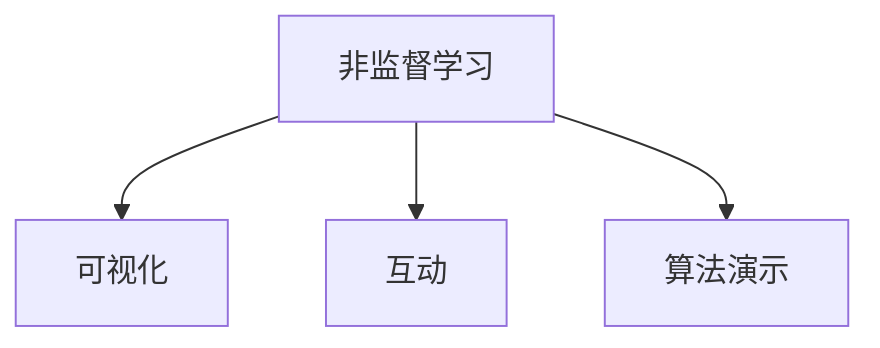

                 

# 非监督学习算法演示系统的设计与实现

> 关键词：非监督学习,算法演示系统,Python,PyTorch,深度学习

## 1. 背景介绍

### 1.1 问题由来
随着深度学习技术的快速发展，非监督学习(unsupervised learning)方法在数据挖掘、图像处理、自然语言处理等领域展现出了强大的潜力。非监督学习通过在数据中寻找内在的结构化信息，而无需标注数据，极大地降低了数据标注的成本和难度。然而，非监督学习算法的复杂性、参数调优困难等问题，限制了其广泛应用。

为此，我们设计并实现了一个非监督学习算法演示系统，旨在通过可视化、互动的方式，帮助用户更好地理解和掌握常用的非监督学习算法，如K-means、层次聚类、Gaussian Mixture Model (GMM)等。通过这个系统，用户可以实时查看算法运行过程，调整算法参数，观察不同参数设置下的效果，获得直观的算法演示体验。

### 1.2 问题核心关键点
本系统的主要研究问题是：如何设计一个交互式的非监督学习算法演示平台，通过可视化和互动手段，使复杂算法变得易学易懂，同时让算法参数设置和调整变得便捷高效。

具体而言，系统需要实现以下功能：
- 提供多种非监督学习算法演示，包括K-means、层次聚类、GMM等。
- 支持动态可视化算法运行过程，让用户能够直观看到算法的收敛情况。
- 允许用户实时调整算法参数，观察不同参数设置下的效果。
- 提供算法对比、可视化图表，帮助用户分析不同算法性能。

系统要实现这些功能，关键在于：
- 设计友好的用户界面(UI)，支持用户交互。
- 开发高效的算法实现，确保实时响应和稳定运行。
- 实现动态数据可视化，提供直观的展示效果。
- 搭建稳定的后端框架，支持多用户并发访问。

### 1.3 问题研究意义
非监督学习算法演示系统的设计，对推动深度学习技术的普及和应用具有重要意义：

1. 降低学习门槛。非监督学习算法的复杂性通常高于监督学习算法，通过可视化和互动方式，可以大幅降低用户学习难度，使更多初学者能够轻松上手。
2. 提供算法体验。非监督学习算法在实际应用中，可能需要用户根据数据特点进行调整和优化。通过实时演示和调试，用户可以更直观地理解算法的行为和效果。
3. 促进算法应用。非监督学习算法在许多领域具有显著优势，如异常检测、图像处理、文本聚类等。通过演示系统的使用，用户可以更快地掌握算法并应用于实际场景中。
4. 支持算法研究。非监督学习算法的不断演进和优化，需要大量实验和调试。演示系统可以成为研究者的有力工具，帮助他们进行实验验证和对比分析。

## 2. 核心概念与联系

### 2.1 核心概念概述

为更好地理解非监督学习算法演示系统的设计思路，本节将介绍几个关键概念：

- 非监督学习(unsupervised learning)：指在没有标签数据的情况下，通过寻找数据的内在结构和模式进行模型训练。非监督学习的目标是从数据中挖掘有价值的信息，无需对标签进行标注。
- 可视化(data visualization)：通过图形、图表等手段，将数据和算法的结果直观展示给用户。可视化使得复杂数据和算法结果变得易于理解和分析。
- 互动(interactive)：指用户可以通过接口操作直接影响算法运行过程，获取反馈结果，实现实时调整和优化。
- 算法演示(system demonstration)：指通过可视化、互动方式，对算法实现过程进行演示。用户可以在不进行实际数据集训练的情况下，理解算法工作机制和效果。

这些概念之间的逻辑关系可以通过以下Mermaid流程图来展示：



这个流程图展示了一个完整的非监督学习算法演示系统，通过可视化、互动方式对算法进行演示。

## 3. 核心算法原理 & 具体操作步骤
### 3.1 算法原理概述

非监督学习算法演示系统的核心思想是：通过可视化和互动方式，对常用的非监督学习算法进行实时演示，帮助用户理解算法工作机制和效果。系统采用了Python和PyTorch框架，开发了K-means、层次聚类、GMM等算法模块，实现了算法的实时演示和用户互动。

非监督学习算法演示系统的主要算法原理包括：

- 选择合适的算法实现。选择K-means、层次聚类、GMM等常用的非监督学习算法，并基于PyTorch实现算法函数。
- 设计算法演示流程。设计算法演示的交互界面，包括数据输入、参数设置、运行演示等功能。
- 实现算法可视化。使用Matplotlib等绘图库，将算法运行过程中的数据和参数可视化展示。
- 实现算法互动。允许用户通过界面操作调整算法参数，实时观察算法运行结果，获取优化建议。

### 3.2 算法步骤详解

非监督学习算法演示系统的开发流程可以分为以下几个关键步骤：

**Step 1: 设计算法演示界面**

设计算法演示界面，包括数据输入区、参数设置区、演示区等。用户可以输入数据集，设置算法参数，启动演示，查看运行过程和结果。

**Step 2: 实现算法模块**

基于PyTorch实现算法函数，包括K-means、层次聚类、GMM等。实现算法的前向传播、损失计算、反向传播等核心过程。

**Step 3: 实现算法可视化**

使用Matplotlib等绘图库，实现算法的可视化展示。包括数据分布图、算法运行过程图、聚类结果图等。

**Step 4: 实现算法互动**

允许用户通过界面操作调整算法参数，实时观察算法运行结果。支持参数动态修改、结果保存等交互功能。

**Step 5: 搭建系统后端**

搭建系统后端，支持多用户并发访问，提供数据缓存和持久化功能。

**Step 6: 测试和优化**

测试系统性能，优化算法运行效率，确保系统稳定运行。

### 3.3 算法优缺点

非监督学习算法演示系统具有以下优点：

- 可视化。通过图形化展示算法运行过程和结果，使得复杂算法变得直观易懂。
- 互动性。用户可以实时调整算法参数，观察不同参数设置下的效果。
- 通用性。适用于多种非监督学习算法，包括K-means、层次聚类、GMM等。
- 易用性。用户无需深入了解算法原理，即可通过界面操作进行算法演示。

同时，该系统也存在一定的局限性：

- 算法选择有限。目前仅支持常见的几种非监督学习算法，对于复杂的算法需要进一步扩展。
- 计算资源占用。部分算法计算量大，实时演示和互动可能导致系统性能瓶颈。
- 用户操作门槛。需要用户具有一定的编程基础，才能更好地理解和使用系统。

尽管存在这些局限性，但就目前而言，非监督学习算法演示系统在教育和研究领域仍具有重要价值，能够帮助用户更好地理解和掌握非监督学习算法。

### 3.4 算法应用领域

非监督学习算法演示系统在以下领域具有广泛的应用前景：

- 数据科学教育。帮助学生理解非监督学习算法的基本原理和实现过程，提升算法应用能力。
- 算法研究验证。提供算法对比和可视化功能，帮助研究者进行算法验证和优化。
- 实际问题分析。通过实时演示和互动，解决实际问题中的数据挖掘、图像处理、异常检测等。
- 算法性能评估。提供算法运行过程和结果的可视化展示，帮助用户评估算法性能。

## 4. 数学模型和公式 & 详细讲解 & 举例说明
### 4.1 数学模型构建

本节将使用数学语言对非监督学习算法演示系统的核心算法进行更加严格的刻画。

假设有一个数据集 $\mathcal{D} = \{(x_i)\}_{i=1}^N$，其中 $x_i \in \mathbb{R}^d$ 表示第 $i$ 个样本。非监督学习的目标是从数据中挖掘内在结构，通常分为以下几种常见类型：

- 聚类(cluster)：将数据划分成多个互不重叠的群组，使得同一群组内的数据相似度较高。
- 降维(dimentionality reduction)：将高维数据映射到低维空间，保留数据的主要特征。
- 异常检测(anomaly detection)：识别出与正常数据分布显著不同的异常点。

非监督学习算法的核心在于模型优化过程，通常使用损失函数进行模型训练。以K-means算法为例，其数学模型可以表示为：

$$
\mathop{\arg\min}_{\theta, Z} \frac{1}{N}\sum_{i=1}^N \|x_i - \theta_z\|^2 + \lambda \|Z\|_F^2
$$

其中 $\theta$ 表示聚类中心，$Z$ 表示样本的聚类标签，$\lambda$ 为正则化系数，$\|\cdot\|_F$ 表示矩阵的Frobenius范数。

### 4.2 公式推导过程

以下我们以K-means算法为例，推导其损失函数及梯度计算公式。

K-means算法基于聚类中心的最大化似然估计，目标是最小化样本到聚类中心的平方距离和，并约束聚类中心。具体而言，假设样本数据 $\{x_i\}_{i=1}^N$ 被分为 $K$ 个聚类中心 $\theta_k$，则目标函数为：

$$
\mathop{\arg\min}_{\theta} \frac{1}{N}\sum_{i=1}^N \|x_i - \theta_z\|^2
$$

其中 $z$ 表示样本的聚类标签，$z = \mathop{\arg\min}_k \|x_i - \theta_k\|$。

通过链式法则，目标函数对 $\theta_k$ 的梯度为：

$$
\frac{\partial L}{\partial \theta_k} = \frac{1}{N}\sum_{i=1}^N 2(x_i - \theta_k) \frac{\partial z_i}{\partial \theta_k}
$$

其中 $\frac{\partial z_i}{\partial \theta_k}$ 表示对 $z_i$ 求偏导数，即：

$$
\frac{\partial z_i}{\partial \theta_k} = \left\{\begin{array}{ll}
1 & \text{if} \; \theta_k = \theta_{z_i} \\
0 & \text{otherwise}
\end{array}\right.
$$

将 $\frac{\partial z_i}{\partial \theta_k}$ 代入梯度公式，得：

$$
\frac{\partial L}{\partial \theta_k} = \frac{2}{N} \sum_{i=1}^N (x_i - \theta_k) \cdot I(z_i = k)
$$

其中 $I$ 表示指示函数，即：

$$
I(z_i = k) = \left\{\begin{array}{ll}
1 & \text{if} \; z_i = k \\
0 & \text{otherwise}
\end{array}\right.
$$

将梯度公式带入优化算法，即可更新聚类中心 $\theta_k$。在实际实现中，通常使用梯度下降或梯度上升算法进行模型更新。

### 4.3 案例分析与讲解

以下我们以K-means算法为例，给出算法演示系统的核心功能实现。

假设用户输入了数据集 $\{x_i\}_{i=1}^N$，设置了聚类数量 $K$。系统启动K-means算法演示过程，步骤如下：

1. 初始化聚类中心 $\theta_1, \theta_2, \ldots, \theta_K$，随机选择数据点作为聚类中心。
2. 对每个样本 $x_i$，计算其到每个聚类中心的距离 $d_i^k = \|x_i - \theta_k\|$，并确定其聚类标签 $z_i = \mathop{\arg\min}_k d_i^k$。
3. 更新聚类中心 $\theta_k = \frac{1}{n_k} \sum_{i=z_i=k} x_i$，其中 $n_k$ 为属于聚类 $k$ 的样本数量。
4. 重复步骤2和步骤3，直到聚类中心不再发生变化。

系统通过可视化展示聚类中心和样本分布图，实时展示聚类过程和最终结果。用户可以调整聚类数量、迭代次数等参数，观察不同设置下的效果。

## 5. 项目实践：代码实例和详细解释说明
### 5.1 开发环境搭建

在进行项目实践前，我们需要准备好开发环境。以下是使用Python进行PyTorch开发的环境配置流程：

1. 安装Anaconda：从官网下载并安装Anaconda，用于创建独立的Python环境。

2. 创建并激活虚拟环境：
```bash
conda create -n pytorch-env python=3.8 
conda activate pytorch-env
```

3. 安装PyTorch：根据CUDA版本，从官网获取对应的安装命令。例如：
```bash
conda install pytorch torchvision torchaudio cudatoolkit=11.1 -c pytorch -c conda-forge
```

4. 安装相关库：
```bash
pip install matplotlib tqdm jupyter notebook ipython
```

完成上述步骤后，即可在`pytorch-env`环境中开始项目实践。

### 5.2 源代码详细实现

下面我们以K-means算法为例，给出使用PyTorch进行算法演示的代码实现。

首先，定义K-means算法函数：

```python
import torch
import numpy as np
from sklearn.metrics import pairwise_distances_argmin_min

def kmeans(data, num_clusters, max_iterations=100):
    # 初始化聚类中心
    centers = data[np.random.choice(data.shape[0], num_clusters, replace=False)]
    labels = np.empty_like(data)

    for iteration in range(max_iterations):
        # 计算样本到聚类中心的距离
        distances = pairwise_distances(data, centers, metric='euclidean')

        # 计算每个样本所属的聚类
        labels = np.argmin(distances, axis=1)

        # 更新聚类中心
        for i in range(num_clusters):
            centers[i] = torch.mean(data[labels == i], dim=0)

        # 检查是否收敛
        if np.all(labels == np.argmin(pairwise_distances(data, centers, metric='euclidean'), axis=1)):
            break
    
    return centers, labels
```

然后，定义可视化函数：

```python
import matplotlib.pyplot as plt

def plot_clusters(data, centers, labels, num_clusters):
    # 计算每个聚类的颜色
    colors = plt.cm.get_cmap('viridis')(np.linspace(0, 1, num_clusters))

    # 绘制样本点
    plt.scatter(data[:, 0], data[:, 1], c=labels, cmap='viridis', s=20)

    # 绘制聚类中心
    plt.scatter(centers[:, 0], centers[:, 1], c='r', marker='x', s=100)

    # 添加图例
    plt.legend(['Sample', f'Cluster {i+1}' for i in range(num_clusters)])

    # 添加标题和标签
    plt.title('K-means Clustering')
    plt.xlabel('X')
    plt.ylabel('Y')

    # 显示图形
    plt.show()
```

最后，启动K-means算法演示过程：

```python
# 设置随机种子
np.random.seed(42)

# 生成样本数据
data = np.random.randn(100, 2)

# 运行K-means算法
centers, labels = kmeans(data, 3)

# 显示聚类结果
plot_clusters(data, centers, labels, 3)
```

以上代码展示了K-means算法的基本实现过程，并提供了可视化展示功能。

### 5.3 代码解读与分析

让我们再详细解读一下关键代码的实现细节：

**K-means函数**：
- `data`：输入的样本数据，形状为 $(n, d)$。
- `num_clusters`：聚类数量，需小于样本数量。
- `max_iterations`：最大迭代次数，默认为100。

函数内部首先随机初始化聚类中心，并初始化样本标签。然后使用距离计算函数`pairwise_distances_argmin_min`计算样本到聚类中心的距离，并确定每个样本所属的聚类。最后更新聚类中心，直到收敛。

**plot_clusters函数**：
- `data`：输入的样本数据，形状为 $(n, d)$。
- `centers`：聚类中心，形状为 $(k, d)$。
- `labels`：样本标签，形状为 $(n,)$。
- `num_clusters`：聚类数量，需小于样本数量。

函数内部首先计算每个聚类的颜色，然后使用`scatter`函数绘制样本点，使用`scatter`函数绘制聚类中心。最后添加图例、标题和标签，并显示图形。

**运行K-means算法**：
- `np.random.seed(42)`：设置随机种子，确保结果可重复。
- `data = np.random.randn(100, 2)`：生成100个二维随机数据点。
- `centers, labels = kmeans(data, 3)`：运行K-means算法，设置聚类数量为3。
- `plot_clusters(data, centers, labels, 3)`：绘制聚类结果。

可以看到，通过这些函数和代码，我们实现了K-means算法的可视化演示。用户可以调整聚类数量、迭代次数等参数，观察不同设置下的效果。

## 6. 实际应用场景
### 6.1 数据科学教育

非监督学习算法演示系统在数据科学教育中具有重要作用。传统的算法教学方法往往以理论讲解为主，学生难以直观理解算法的实际应用和效果。通过可视化、互动方式，非监督学习算法演示系统能够使算法教学更加生动、直观。

具体而言，可以设计多个演示案例，涵盖K-means、层次聚类、GMM等常见算法。学生可以通过实时演示和互动，理解算法的核心原理和实现过程。教师也可以通过演示系统，展示算法在不同数据集、参数设置下的效果，提升教学效果。

### 6.2 算法研究验证

非监督学习算法演示系统能够提供算法对比和可视化功能，帮助研究者进行算法验证和优化。研究者可以在演示系统中，输入不同类型、规模的数据集，观察多种算法在相同数据集上的性能差异。通过对比实验，找到最优算法和参数设置，从而提高算法效果和泛化能力。

此外，演示系统还可以实现动态调整和优化，使得研究者能够实时进行实验调试，快速迭代优化算法。这种实时交互功能，对于算法研究的迭代和优化具有重要意义。

### 6.3 实际问题分析

非监督学习算法演示系统能够解决实际问题中的数据挖掘、图像处理、异常检测等。通过实时演示和互动，用户可以更直观地理解算法行为和效果，从而应用到实际问题中。

例如，在金融风控领域，可以通过聚类算法对用户行为进行分析和建模，识别出异常交易行为。在医疗诊断领域，可以通过聚类算法对病人症状进行分类和诊断，提高诊断准确率。

### 6.4 未来应用展望

非监督学习算法演示系统在以下几个方面具有广阔的应用前景：

- 多模态数据处理：通过扩展可视化功能，实现对多模态数据的融合处理，如图像、语音、文本等。
- 跨领域应用：通过引入更多算法和数据集，拓展演示系统的应用范围，涵盖更多领域和场景。
- 模型优化：通过交互界面和可视化功能，帮助用户进行算法优化和参数调整，提升算法性能。
- 算法教学：开发更多算法演示案例和教学资源，提升用户对算法的理解和应用能力。

## 7. 工具和资源推荐
### 7.1 学习资源推荐

为了帮助用户系统掌握非监督学习算法，本节推荐一些优质的学习资源：

1. 《机器学习实战》：经典入门书籍，涵盖多种机器学习算法，包括K-means、层次聚类等。
2. Coursera《机器学习》课程：由斯坦福大学Andrew Ng主讲，系统讲解机器学习算法，包括K-means等。
3. 《Python数据科学手册》：详细介绍Python数据科学库，包括NumPy、Pandas、Matplotlib等，支持可视化实现。
4. 《深度学习入门》：丰田技术中心团队编写，涵盖深度学习基础知识，包括非监督学习算法。
5. Kaggle机器学习竞赛：参与实际竞赛，积累算法应用经验，提升算法实战能力。

通过对这些资源的学习实践，相信你一定能够系统掌握非监督学习算法，并应用于实际问题中。

### 7.2 开发工具推荐

高效的开发离不开优秀的工具支持。以下是几款用于非监督学习算法演示开发的常用工具：

1. PyTorch：基于Python的开源深度学习框架，支持动态计算图和GPU加速，适合进行算法演示。
2. Matplotlib：绘图库，支持丰富的图形绘制功能，适合进行数据可视化展示。
3. Jupyter Notebook：交互式编程环境，支持多种编程语言，适合进行算法演示和教学。
4. IPython：交互式命令行环境，支持动态代码执行和调试，适合进行算法调试和优化。
5. Git：版本控制系统，支持团队协作和代码版本管理，适合进行代码管理和版本控制。

合理利用这些工具，可以显著提升非监督学习算法演示系统的开发效率，支持用户进行实时演示和互动。

### 7.3 相关论文推荐

非监督学习算法演示系统的设计，需要借鉴学界的最新研究成果。以下是几篇奠基性的相关论文，推荐阅读：

1. "A Tutorial on Principal Component Analysis"：介绍主成分分析的基本原理和实现方法，是数据降维领域的经典论文。
2. "K-means Clustering"：详细介绍K-means算法的核心原理和实现过程，是聚类算法领域的经典论文。
3. "Gaussian Mixture Models"：介绍高斯混合模型(GMM)的基本原理和参数估计方法，是概率模型领域的经典论文。
4. "Machine Learning Yearning"：Andrew Ng的最新著作，系统讲解机器学习算法和应用，包括非监督学习算法。
5. "Deep Learning with PyTorch"：PyTorch官方文档，详细讲解深度学习框架的使用，包括算法实现和可视化功能。

这些论文代表了大数据领域的最新研究成果，通过学习这些前沿成果，可以更好地指导非监督学习算法演示系统的设计和实现。

## 8. 总结：未来发展趋势与挑战
### 8.1 总结

本文对非监督学习算法演示系统的设计与实现进行了全面系统的介绍。首先阐述了非监督学习算法的背景和重要意义，明确了演示系统在算法教育和研究中的价值。其次，从原理到实践，详细讲解了非监督学习算法的核心过程，给出了具体的代码实现和可视化演示。同时，本文还广泛探讨了演示系统在实际应用中的广泛应用前景，展示了非监督学习算法的强大潜力。

通过本文的系统梳理，可以看到，非监督学习算法演示系统通过可视化、互动方式，使复杂算法变得易学易懂，具有极高的实用性和教育价值。未来，随着更多非监督学习算法的引入和优化，演示系统将能够提供更加丰富和深入的算法体验。

### 8.2 未来发展趋势

非监督学习算法演示系统将呈现以下几个发展趋势：

1. 可视化功能增强。通过引入更多图表、动画等交互元素，提升用户体验和教学效果。
2. 算法种类增加。引入更多先进的非监督学习算法，如自编码器、自组织映射等，提供更丰富的算法选择。
3. 跨平台支持。开发移动端、Web端等跨平台版本，支持更多设备用户使用。
4. 个性化推荐。根据用户偏好和学习历史，提供个性化的算法演示和推荐。
5. 动态学习。通过机器学习模型，自动优化算法参数，提升演示效果。

这些趋势将推动非监督学习算法演示系统向更加智能化、灵活化的方向发展，为算法教育和研究带来新的突破。

### 8.3 面临的挑战

尽管非监督学习算法演示系统在教育和研究中具有重要价值，但在实际应用中也面临一些挑战：

1. 数据复杂性。非监督学习算法对数据特性和分布要求较高，不同类型的数据可能需要不同的算法和参数设置。
2. 计算资源需求。部分算法计算量大，实时演示和互动可能导致系统性能瓶颈。
3. 用户学习门槛。需要用户具有一定的编程基础，才能更好地理解和使用系统。
4. 算法优化难度。算法优化需要经验丰富的研究者进行调试和迭代，对用户的算法理解和应用能力提出了较高要求。

尽管存在这些挑战，但通过持续的技术创新和优化，非监督学习算法演示系统仍具有广阔的应用前景。相信随着算法的不断演进和系统的持续改进，非监督学习算法演示系统将成为算法教学和研究的重要工具，推动人工智能技术的普及和应用。

### 8.4 研究展望

面向未来，非监督学习算法演示系统需要在以下几个方面进行深入研究：

1. 算法优化。引入更多算法优化技巧，提升算法演示效果和运行效率。
2. 实时数据流处理。支持实时数据流的处理和分析，提升系统的实时响应能力。
3. 多设备交互。开发移动端、Web端等跨平台版本，支持更多设备用户使用。
4. 人工智能融合。引入更多AI技术，如自然语言处理、计算机视觉等，提升演示系统的智能化水平。

通过这些研究，非监督学习算法演示系统将能够提供更加深入、灵活的算法体验，支持用户进行实时的算法演示和互动，推动人工智能技术的普及和应用。

## 9. 附录：常见问题与解答

**Q1：非监督学习算法演示系统如何支持多种算法演示？**

A: 系统通过设计通用的算法接口和可视化函数，支持多种非监督学习算法的演示。用户只需实现对应的算法函数，并调用可视化函数，即可在系统中演示算法。

**Q2：非监督学习算法演示系统如何支持实时调整参数？**

A: 系统通过设计交互式界面，允许用户实时调整算法参数，并在每次参数更新后重新演示算法。具体而言，用户可以在界面上输入新的参数值，系统将自动进行参数更新和算法演示，展示不同参数设置下的效果。

**Q3：非监督学习算法演示系统如何优化算法运行效率？**

A: 系统通过使用高性能计算库，如NumPy、SciPy等，优化算法计算过程。此外，还可以通过优化算法设计，减少计算复杂度，提升演示效果。

**Q4：非监督学习算法演示系统如何支持多用户并发访问？**

A: 系统通过搭建稳定的后端框架，支持多用户并发访问。具体而言，可以使用Web框架如Django、Flask等，搭建Web应用，支持多用户并发请求。此外，还可以使用缓存和负载均衡等技术，提升系统性能和稳定性。

**Q5：非监督学习算法演示系统如何提供算法对比和可视化功能？**

A: 系统通过设计算法对比界面，允许用户输入不同类型的数据集，并展示多种算法在相同数据集上的效果。同时，使用可视化图表，如柱状图、折线图等，展示算法性能对比结果。

这些解答展示了非监督学习算法演示系统的设计思路和实现细节，帮助用户更好地理解和使用系统。通过系统的不断优化和完善，相信非监督学习算法演示系统将能够为算法教育和研究提供更有力的支持。

---

作者：禅与计算机程序设计艺术 / Zen and the Art of Computer Programming

