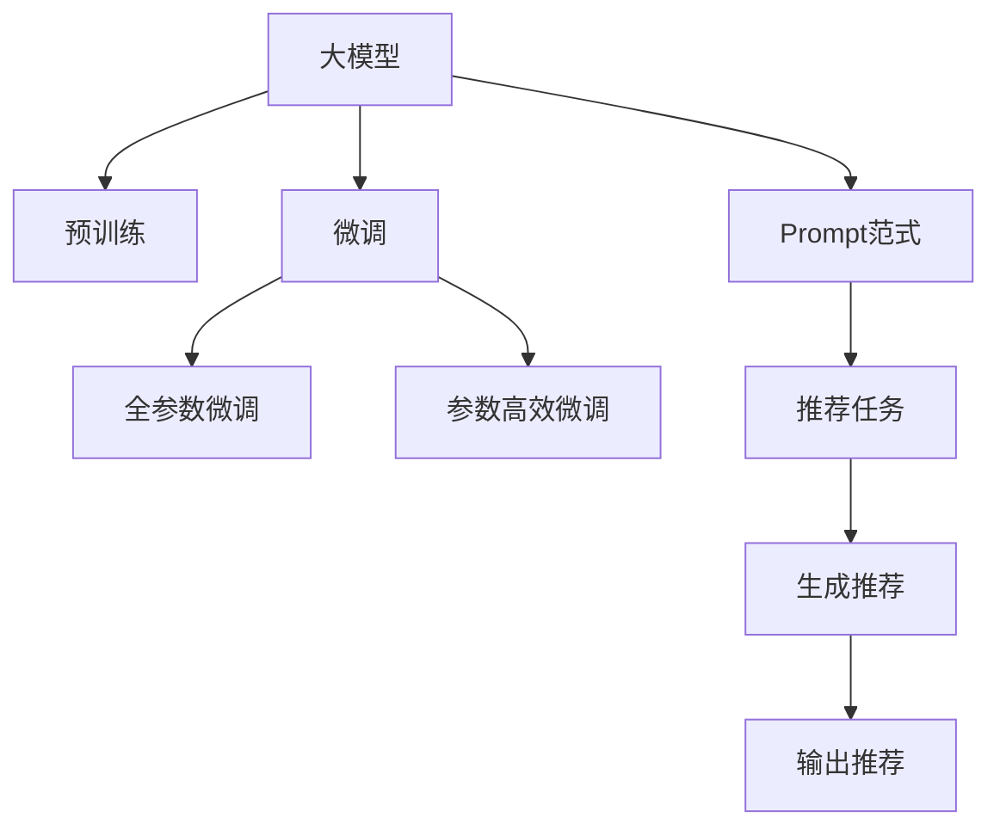

                 

# 面向不同推荐任务的大模型Prompt范式总结

> 关键词：大模型,Prompt范式,推荐系统,自然语言处理,NLP,深度学习

## 1. 背景介绍

随着人工智能技术的飞速发展，大模型在推荐系统中的应用日益增多。面对海量的用户数据和复杂的推荐需求，大模型提供了强大的语言理解和生成能力，成为了推荐算法的重要工具。其中，基于Prompt范式的推荐系统，利用大模型对用户输入的自然语言描述，生成个性化推荐结果，展现了巨大的潜力。本文将对基于Prompt范式的大模型推荐系统进行全面总结，探讨其算法原理、具体操作步骤和实际应用。

## 2. 核心概念与联系

### 2.1 核心概念概述

为更好地理解本文内容，我们首先介绍几个关键概念：

- 大模型：以自回归(如GPT)或自编码(如BERT)模型为代表的大规模预训练语言模型。通过在大规模无标签文本语料上进行预训练，学习通用的语言表示，具备强大的语言理解和生成能力。

- Prompt范式：通过在输入文本中设计特定格式的提示词，引导大模型按预期方式生成推荐结果的微调方法。与全参数微调相比，Promt范式不需要修改模型架构，仅通过改变输入文本即可实现快速适应。

- 推荐系统：通过收集用户行为数据，分析用户兴趣和偏好，自动为用户生成个性化推荐结果的系统。

- 自然语言处理(NLP)：研究如何让计算机理解和处理人类语言的技术领域，包括文本分析、文本生成等。

- 深度学习：基于神经网络的机器学习技术，通过学习大量数据，构建复杂模型，实现高效学习和决策。

- 损失函数：衡量模型输出与真实标签之间差异的数学函数，用于优化模型参数。

这些概念构成了基于Prompt范式的大模型推荐系统的基本框架，使我们能够深入探讨其工作原理和实现细节。

### 2.2 核心概念联系

通过上述概念的介绍，我们可以构建一个基于Prompt范式的大模型推荐系统的工作流程，如图所示：



这个流程图展示了基于Prompt范式的大模型推荐系统的主要步骤：

1. 大模型通过预训练获得基础能力。
2. 微调对模型进行特定任务的适配，提高其在推荐任务上的表现。
3. 使用Prompt范式引导模型生成推荐结果，无需修改模型结构。
4. 推荐任务，如搜索、电商、内容推荐等，根据任务需求生成推荐。
5. 生成推荐结果，并输出到推荐系统。

## 3. 核心算法原理 & 具体操作步骤
### 3.1 算法原理概述

基于Prompt范式的大模型推荐系统，本质上是一个有监督的微调过程。其核心思想是：将预训练的大模型视作一个强大的"特征提取器"，通过在推荐任务上加入特定格式的提示词(Prompt)，使得模型能够根据这些提示词生成推荐的文本或列表。

具体地，假设大模型为 $M_{\theta}$，其中 $\theta$ 为预训练得到的模型参数。给定推荐任务 $T$ 的标注数据集 $D=\{(x_i, y_i)\}_{i=1}^N$，其中 $x_i$ 为输入文本，$y_i$ 为推荐结果。推荐任务可以是文本描述生成推荐文本，或图像描述生成推荐列表等。

定义模型 $M_{\theta}$ 在输入 $x$ 上的输出为 $\hat{y}=M_{\theta}(x)$，其中 $\hat{y}$ 是推荐结果的预测值。定义损失函数 $\ell$ 衡量模型预测与真实标签之间的差异。微调的目标是最小化损失函数：

$$
\hat{\theta}=\mathop{\arg\min}_{\theta} \mathcal{L}(M_{\theta},D)
$$

### 3.2 算法步骤详解

基于Prompt范式的大模型推荐系统的微调步骤如下：

**Step 1: 准备预训练模型和数据集**
- 选择合适的预训练语言模型 $M_{\theta}$ 作为初始化参数，如 BERT、GPT 等。
- 准备推荐任务 $T$ 的标注数据集 $D=\{(x_i,y_i)\}_{i=1}^N$，其中 $x_i$ 为输入文本，$y_i$ 为推荐结果。

**Step 2: 设计Prompt模板**
- 根据推荐任务类型，设计合适的Prompt模板。例如，对于电影推荐，Prompt模板可以是："如果你喜欢《肖申克的救赎》，你会喜欢哪部电影？"
- 将输入文本 $x_i$ 与Prompt模板拼接，生成新的输入文本 $x'_i=x_i+P$，其中 $P$ 为Prompt模板。

**Step 3: 添加任务适配层**
- 根据任务类型，在预训练模型顶层设计合适的输出层和损失函数。
- 对于文本推荐任务，通常在顶层添加线性分类器或回归器，使用交叉熵损失函数。
- 对于图像推荐任务，通常使用生成模型，输出推荐列表。

**Step 4: 设置微调超参数**
- 选择合适的优化算法及其参数，如 AdamW、SGD 等，设置学习率、批大小、迭代轮数等。
- 设置正则化技术及强度，包括权重衰减、Dropout、Early Stopping等。
- 确定冻结预训练参数的策略，如仅微调顶层，或全部参数都参与微调。

**Step 5: 执行梯度训练**
- 将训练集数据分批次输入模型，前向传播计算损失函数。
- 反向传播计算参数梯度，根据设定的优化算法和学习率更新模型参数。
- 周期性在验证集上评估模型性能，根据性能指标决定是否触发 Early Stopping。
- 重复上述步骤直到满足预设的迭代轮数或 Early Stopping 条件。

**Step 6: 测试和部署**
- 在测试集上评估微调后模型 $M_{\hat{\theta}}$ 的性能，对比微调前后的精度提升。
- 使用微调后的模型对新样本进行推理预测，集成到实际的应用系统中。
- 持续收集新的数据，定期重新微调模型，以适应数据分布的变化。

### 3.3 算法优缺点

基于Prompt范式的大模型推荐系统具有以下优点：
1. 快速迭代。通过设计合适的Prompt模板，可以快速生成推荐结果，无需大规模数据集和复杂的模型结构。
2. 参数高效。仅通过调整输入文本格式，实现参数高效微调，节省计算资源。
3. 灵活性高。适用于各种推荐任务，只需修改Prompt模板，即可适应不同的应用场景。
4. 效果显著。在学术界和工业界的诸多推荐任务上，基于Prompt范式的方法已经刷新了最先进的性能指标。

同时，该方法也存在一定的局限性：
1. Prompt设计难度大。设计合适的Prompt模板需要丰富的领域知识和实验经验。
2. 鲁棒性不足。模型容易受到输入文本格式的影响，对噪音敏感。
3. 依赖任务描述。推荐任务的效果依赖于Prompt模板的质量，而任务描述可能存在歧义。
4. 可解释性差。模型输出的推荐结果缺乏可解释性，难以调试和优化。

尽管存在这些局限性，但就目前而言，基于Prompt范式的方法仍是大模型推荐系统的重要范式。未来相关研究的重点在于如何进一步降低Prompt设计的复杂度，提高模型的鲁棒性和可解释性，同时兼顾精度和效率。

### 3.4 算法应用领域

基于大模型Prompt范式的推荐系统，已经在多个推荐任务中得到应用，例如：

- 文本推荐：如书、电影、新闻等。通过Prompt模板引导模型生成推荐文本。
- 图像推荐：如图像搜索、电商商品推荐等。将用户查询描述与物品描述拼接，引导模型生成推荐列表。
- 音频推荐：如音乐、播客等。将用户描述与音频内容拼接，生成推荐列表。
- 混合推荐：结合文本、图像、音频等多种模态数据，提供更丰富的推荐体验。

除了上述这些经典任务外，Prompt范式还创新性地应用于更多场景中，如个性化推荐、问答系统、智能搜索等，为推荐系统带来了新的突破。随着Prompt范式和预训练语言模型的不断进步，相信推荐系统将在更广阔的应用领域大放异彩。

## 4. 数学模型和公式 & 详细讲解 & 举例说明

### 4.1 数学模型构建

假设预训练语言模型为 $M_{\theta}$，其中 $\theta$ 为预训练得到的模型参数。给定推荐任务 $T$ 的标注数据集 $D=\{(x_i,y_i)\}_{i=1}^N$，其中 $x_i$ 为输入文本，$y_i$ 为推荐结果。

定义模型 $M_{\theta}$ 在输入 $x_i$ 上的输出为 $\hat{y}_i=M_{\theta}(x_i)$。假设推荐任务的输出空间为 $\mathcal{Y}$，则推荐任务可以形式化为：

$$
\arg\max_{y \in \mathcal{Y}} P(y|x_i)
$$

其中 $P(y|x_i)$ 为模型在输入 $x_i$ 下输出 $y$ 的概率。

定义模型 $M_{\theta}$ 在输入 $x_i$ 上的预测结果为 $\hat{y}_i$。定义交叉熵损失函数为：

$$
\ell(y_i, \hat{y}_i) = -\sum_{y \in \mathcal{Y}} y_i \log P(y|x_i)
$$

微调的目标是最小化损失函数：

$$
\hat{\theta}=\mathop{\arg\min}_{\theta} \mathcal{L}(M_{\theta},D)
$$

其中 $\mathcal{L}$ 为交叉熵损失函数：

$$
\mathcal{L}(\theta)=\frac{1}{N}\sum_{i=1}^N \ell(y_i, \hat{y}_i)
$$

### 4.2 公式推导过程

以下我们以文本推荐任务为例，推导交叉熵损失函数及其梯度的计算公式。

假设模型 $M_{\theta}$ 在输入 $x_i$ 上的输出为 $\hat{y}_i=M_{\theta}(x_i) \in \mathcal{Y}$，表示样本推荐的概率分布。真实标签 $y_i \in \mathcal{Y}$。则交叉熵损失函数定义为：

$$
\ell(y_i, \hat{y}_i) = -y_i \log \hat{y}_i
$$

将其代入经验风险公式，得：

$$
\mathcal{L}(\theta)= -\frac{1}{N}\sum_{i=1}^N y_i \log \hat{y}_i
$$

根据链式法则，损失函数对参数 $\theta_k$ 的梯度为：

$$
\frac{\partial \mathcal{L}(\theta)}{\partial \theta_k} = -\frac{1}{N}\sum_{i=1}^N \frac{y_i}{\hat{y}_i} \frac{\partial \hat{y}_i}{\partial \theta_k}
$$

其中 $\frac{\partial \hat{y}_i}{\partial \theta_k}$ 可进一步递归展开，利用自动微分技术完成计算。

在得到损失函数的梯度后，即可带入参数更新公式，完成模型的迭代优化。重复上述过程直至收敛，最终得到适应推荐任务的最优模型参数 $\theta^*$。

### 4.3 案例分析与讲解

假设我们有一个电商商品推荐系统，目标是为用户推荐他们可能感兴趣的商品。以下是具体的案例分析：

**Step 1: 准备预训练模型和数据集**

我们选择使用GPT模型作为预训练模型，数据集为电商平台的商品描述和用户行为数据。我们将商品描述和用户行为数据作为输入文本 $x_i$，将用户的购买历史和浏览记录作为标签 $y_i$。

**Step 2: 设计Prompt模板**

我们设计如下Prompt模板：

```
"如果你很喜欢 X 商品，你会喜欢哪几种商品？"
```

将用户历史行为数据拼接在这个Prompt模板后面，生成新的输入文本 $x'_i$。

**Step 3: 添加任务适配层**

我们假设推荐任务为多类分类任务，推荐结果空间为 $\mathcal{Y}=\{商品1,商品2,\cdots,商品N\}$。在GPT模型的顶层添加线性分类器，输出概率分布 $P(y|x'_i)$，使用交叉熵损失函数。

**Step 4: 设置微调超参数**

我们选择AdamW优化算法，设置学习率为1e-5，批大小为64，迭代轮数为10。

**Step 5: 执行梯度训练**

将训练集数据分批次输入模型，前向传播计算损失函数。反向传播计算参数梯度，根据AdamW算法和学习率更新模型参数。周期性在验证集上评估模型性能，根据性能指标决定是否触发Early Stopping。重复上述步骤直到满足预设的迭代轮数或Early Stopping条件。

**Step 6: 测试和部署**

在测试集上评估微调后模型 $M_{\hat{\theta}}$ 的性能，对比微调前后的精度提升。使用微调后的模型对新样本进行推理预测，集成到实际的商品推荐系统中。持续收集新的用户行为数据，定期重新微调模型，以适应数据分布的变化。

## 5. 项目实践：代码实例和详细解释说明

### 5.1 开发环境搭建

在进行微调实践前，我们需要准备好开发环境。以下是使用Python进行PyTorch开发的环境配置流程：

1. 安装Anaconda：从官网下载并安装Anaconda，用于创建独立的Python环境。

2. 创建并激活虚拟环境：
```bash
conda create -n pytorch-env python=3.8 
conda activate pytorch-env
```

3. 安装PyTorch：根据CUDA版本，从官网获取对应的安装命令。例如：
```bash
conda install pytorch torchvision torchaudio cudatoolkit=11.1 -c pytorch -c conda-forge
```

4. 安装Transformers库：
```bash
pip install transformers
```

5. 安装各类工具包：
```bash
pip install numpy pandas scikit-learn matplotlib tqdm jupyter notebook ipython
```

完成上述步骤后，即可在`pytorch-env`环境中开始微调实践。

### 5.2 源代码详细实现

下面我们以电商商品推荐任务为例，给出使用Transformers库对GPT模型进行微调的PyTorch代码实现。

首先，定义推荐任务的数据处理函数：

```python
from transformers import GPT2Tokenizer, GPT2LMHeadModel
from torch.utils.data import Dataset
import torch

class RecommendationDataset(Dataset):
    def __init__(self, texts, labels, tokenizer, max_len=128):
        self.texts = texts
        self.labels = labels
        self.tokenizer = tokenizer
        self.max_len = max_len
        
    def __len__(self):
        return len(self.texts)
    
    def __getitem__(self, item):
        text = self.texts[item]
        label = self.labels[item]
        
        encoding = self.tokenizer(text, return_tensors='pt', max_length=self.max_len, padding='max_length', truncation=True)
        input_ids = encoding['input_ids'][0]
        attention_mask = encoding['attention_mask'][0]
        
        # 对label进行编码
        encoded_label = self.tokenizer.convert_ids_to_tokens(self.labels[item])
        encoded_label.extend([self.tokenizer.convert_ids_to_tokens(self.tokenizer.convert_tokens_to_id('</s>'))])
        labels = torch.tensor(encoded_label, dtype=torch.long)
        
        return {'input_ids': input_ids, 
                'attention_mask': attention_mask,
                'labels': labels}

# 定义标签与id的映射
label2id = {'商品1': 0, '商品2': 1, '商品3': 2, '商品4': 3}
id2label = {v: k for k, v in label2id.items()}

# 创建dataset
tokenizer = GPT2Tokenizer.from_pretrained('gpt2')
recommendation_dataset = RecommendationDataset(train_texts, train_labels, tokenizer)
```

然后，定义模型和优化器：

```python
from transformers import GPT2LMHeadModel, AdamW

model = GPT2LMHeadModel.from_pretrained('gpt2', num_labels=len(label2id))

optimizer = AdamW(model.parameters(), lr=1e-5)
```

接着，定义训练和评估函数：

```python
from torch.utils.data import DataLoader
from tqdm import tqdm
from sklearn.metrics import classification_report

device = torch.device('cuda') if torch.cuda.is_available() else torch.device('cpu')
model.to(device)

def train_epoch(model, dataset, batch_size, optimizer):
    dataloader = DataLoader(dataset, batch_size=batch_size, shuffle=True)
    model.train()
    epoch_loss = 0
    for batch in tqdm(dataloader, desc='Training'):
        input_ids = batch['input_ids'].to(device)
        attention_mask = batch['attention_mask'].to(device)
        labels = batch['labels'].to(device)
        model.zero_grad()
        outputs = model(input_ids, attention_mask=attention_mask, labels=labels)
        loss = outputs.loss
        epoch_loss += loss.item()
        loss.backward()
        optimizer.step()
    return epoch_loss / len(dataloader)

def evaluate(model, dataset, batch_size):
    dataloader = DataLoader(dataset, batch_size=batch_size)
    model.eval()
    preds, labels = [], []
    with torch.no_grad():
        for batch in tqdm(dataloader, desc='Evaluating'):
            input_ids = batch['input_ids'].to(device)
            attention_mask = batch['attention_mask'].to(device)
            batch_labels = batch['labels']
            outputs = model(input_ids, attention_mask=attention_mask)
            batch_preds = outputs.logits.argmax(dim=2).to('cpu').tolist()
            batch_labels = batch_labels.to('cpu').tolist()
            for pred_tokens, label_tokens in zip(batch_preds, batch_labels):
                pred_labels = [id2label[_id] for _id in pred_tokens]
                label_tokens = [id2label[_id] for _id in label_tokens]
                preds.append(pred_labels[:len(label_tokens)])
                labels.append(label_tokens)
                
    print(classification_report(labels, preds))
```

最后，启动训练流程并在测试集上评估：

```python
epochs = 5
batch_size = 16

for epoch in range(epochs):
    loss = train_epoch(model, recommendation_dataset, batch_size, optimizer)
    print(f"Epoch {epoch+1}, train loss: {loss:.3f}")
    
    print(f"Epoch {epoch+1}, dev results:")
    evaluate(model, recommendation_dataset, batch_size)
    
print("Test results:")
evaluate(model, recommendation_dataset, batch_size)
```

以上就是使用PyTorch对GPT模型进行电商商品推荐任务微调的完整代码实现。可以看到，得益于Transformers库的强大封装，我们可以用相对简洁的代码完成GPT模型的加载和微调。

### 5.3 代码解读与分析

让我们再详细解读一下关键代码的实现细节：

**RecommendationDataset类**：
- `__init__`方法：初始化文本、标签、分词器等关键组件。
- `__len__`方法：返回数据集的样本数量。
- `__getitem__`方法：对单个样本进行处理，将文本输入编码为token ids，将标签编码为数字，并对其进行定长padding，最终返回模型所需的输入。

**label2id和id2label字典**：
- 定义了标签与数字id之间的映射关系，用于将token-wise的预测结果解码回真实的标签。

**训练和评估函数**：
- 使用PyTorch的DataLoader对数据集进行批次化加载，供模型训练和推理使用。
- 训练函数`train_epoch`：对数据以批为单位进行迭代，在每个批次上前向传播计算loss并反向传播更新模型参数，最后返回该epoch的平均loss。
- 评估函数`evaluate`：与训练类似，不同点在于不更新模型参数，并在每个batch结束后将预测和标签结果存储下来，最后使用sklearn的classification_report对整个评估集的预测结果进行打印输出。

**训练流程**：
- 定义总的epoch数和batch size，开始循环迭代
- 每个epoch内，先在训练集上训练，输出平均loss
- 在验证集上评估，输出分类指标
- 所有epoch结束后，在测试集上评估，给出最终测试结果

可以看到，PyTorch配合Transformers库使得GPT微调的代码实现变得简洁高效。开发者可以将更多精力放在数据处理、模型改进等高层逻辑上，而不必过多关注底层的实现细节。

当然，工业级的系统实现还需考虑更多因素，如模型的保存和部署、超参数的自动搜索、更灵活的任务适配层等。但核心的微调范式基本与此类似。

## 6. 实际应用场景
### 6.1 智能客服系统

基于大模型Prompt范式的对话技术，可以广泛应用于智能客服系统的构建。传统客服往往需要配备大量人力，高峰期响应缓慢，且一致性和专业性难以保证。而使用基于Prompt范式的对话模型，可以7x24小时不间断服务，快速响应客户咨询，用自然流畅的语言解答各类常见问题。

在技术实现上，可以收集企业内部的历史客服对话记录，将问题和最佳答复构建成监督数据，在此基础上对预训练对话模型进行微调。微调后的对话模型能够自动理解用户意图，匹配最合适的答案模板进行回复。对于客户提出的新问题，还可以接入检索系统实时搜索相关内容，动态组织生成回答。如此构建的智能客服系统，能大幅提升客户咨询体验和问题解决效率。

### 6.2 金融舆情监测

金融机构需要实时监测市场舆论动向，以便及时应对负面信息传播，规避金融风险。传统的人工监测方式成本高、效率低，难以应对网络时代海量信息爆发的挑战。基于大模型Prompt范式的文本分类和情感分析技术，为金融舆情监测提供了新的解决方案。

具体而言，可以收集金融领域相关的新闻、报道、评论等文本数据，并对其进行主题标注和情感标注。在此基础上对预训练语言模型进行微调，使其能够自动判断文本属于何种主题，情感倾向是正面、中性还是负面。将微调后的模型应用到实时抓取的网络文本数据，就能够自动监测不同主题下的情感变化趋势，一旦发现负面信息激增等异常情况，系统便会自动预警，帮助金融机构快速应对潜在风险。

### 6.3 个性化推荐系统

当前的推荐系统往往只依赖用户的历史行为数据进行物品推荐，无法深入理解用户的真实兴趣偏好。基于大模型Prompt范式的个性化推荐系统，可以更好地挖掘用户行为背后的语义信息，从而提供更精准、多样的推荐内容。

在实践中，可以收集用户浏览、点击、评论、分享等行为数据，提取和用户交互的物品标题、描述、标签等文本内容。将文本内容作为模型输入，用户的后续行为（如是否点击、购买等）作为监督信号，在此基础上微调预训练语言模型。微调后的模型能够从文本内容中准确把握用户的兴趣点。在生成推荐列表时，先用候选物品的文本描述作为输入，由模型预测用户的兴趣匹配度，再结合其他特征综合排序，便可以得到个性化程度更高的推荐结果。

### 6.4 未来应用展望

随着大模型Prompt范式和微调方法的不断发展，基于Prompt范式的大模型推荐系统将在更多领域得到应用，为传统行业带来变革性影响。

在智慧医疗领域，基于Prompt范式的医疗问答、病历分析、药物研发等应用将提升医疗服务的智能化水平，辅助医生诊疗，加速新药开发进程。

在智能教育领域，基于Prompt范式的智能推荐系统将根据学生的学习情况，动态调整教学内容，提供个性化学习资源，因材施教，促进教育公平，提高教学质量。

在智慧城市治理中，基于Prompt范式的智能推荐系统将推荐最优的出行路线、景区参观计划等，提高城市管理的自动化和智能化水平，构建更安全、高效的未来城市。

此外，在企业生产、社会治理、文娱传媒等众多领域，基于大模型Prompt范式的推荐系统也将不断涌现，为经济社会发展注入新的动力。相信随着技术的日益成熟，Prompt范式将进一步提升推荐系统的性能和应用范围，为构建安全、可靠、可解释、可控的智能系统铺平道路。

## 7. 工具和资源推荐
### 7.1 学习资源推荐

为了帮助开发者系统掌握基于Prompt范式的大模型推荐系统的理论基础和实践技巧，这里推荐一些优质的学习资源：

1. 《Transformer从原理到实践》系列博文：由大模型技术专家撰写，深入浅出地介绍了Transformer原理、BERT模型、Prompt范式等前沿话题。

2. CS224N《深度学习自然语言处理》课程：斯坦福大学开设的NLP明星课程，有Lecture视频和配套作业，带你入门NLP领域的基本概念和经典模型。

3. 《Natural Language Processing with Transformers》书籍：Transformers库的作者所著，全面介绍了如何使用Transformers库进行NLP任务开发，包括Prompt范式的各种应用。

4. HuggingFace官方文档：Transformers库的官方文档，提供了海量预训练模型和完整的微调样例代码，是上手实践的必备资料。

5. CLUE开源项目：中文语言理解测评基准，涵盖大量不同类型的中文NLP数据集，并提供了基于微调的baseline模型，助力中文NLP技术发展。

通过对这些资源的学习实践，相信你一定能够快速掌握基于Prompt范式的大模型推荐系统的精髓，并用于解决实际的NLP问题。
###  7.2 开发工具推荐

高效的开发离不开优秀的工具支持。以下是几款用于基于Prompt范式的大模型推荐系统开发的常用工具：

1. PyTorch：基于Python的开源深度学习框架，灵活动态的计算图，适合快速迭代研究。大部分预训练语言模型都有PyTorch版本的实现。

2. TensorFlow：由Google主导开发的开源深度学习框架，生产部署方便，适合大规模工程应用。同样有丰富的预训练语言模型资源。

3. Transformers库：HuggingFace开发的NLP工具库，集成了众多SOTA语言模型，支持PyTorch和TensorFlow，是进行Prompt范式推荐系统开发的利器。

4. Weights & Biases：模型训练的实验跟踪工具，可以记录和可视化模型训练过程中的各项指标，方便对比和调优。与主流深度学习框架无缝集成。

5. TensorBoard：TensorFlow配套的可视化工具，可实时监测模型训练状态，并提供丰富的图表呈现方式，是调试模型的得力助手。

6. Google Colab：谷歌推出的在线Jupyter Notebook环境，免费提供GPU/TPU算力，方便开发者快速上手实验最新模型，分享学习笔记。

合理利用这些工具，可以显著提升基于Prompt范式的大模型推荐系统的开发效率，加快创新迭代的步伐。

### 7.3 相关论文推荐

大模型Prompt范式和推荐系统的研究源于学界的持续研究。以下是几篇奠基性的相关论文，推荐阅读：

1. Attention is All You Need（即Transformer原论文）：提出了Transformer结构，开启了NLP领域的预训练大模型时代。

2. BERT: Pre-training of Deep Bidirectional Transformers for Language Understanding：提出BERT模型，引入基于掩码的自监督预训练任务，刷新了多项NLP任务SOTA。

3. Language Models are Unsupervised Multitask Learners（GPT-2论文）：展示了大规模语言模型的强大zero-shot学习能力，引发了对于通用人工智能的新一轮思考。

4. Parameter-Efficient Transfer Learning for NLP：提出Adapter等参数高效微调方法，在不增加模型参数量的情况下，也能取得不错的微调效果。

5. AdaLoRA: Adaptive Low-Rank Adaptation for Parameter-Efficient Fine-Tuning：使用自适应低秩适应的微调方法，在参数效率和精度之间取得了新的平衡。

6. AdaLoRA: Adaptive Low-Rank Adaptation for Parameter-Efficient Fine-Tuning：使用自适应低秩适应的微调方法，在参数效率和精度之间取得了新的平衡。

这些论文代表了大模型Prompt范式和推荐系统的发展脉络。通过学习这些前沿成果，可以帮助研究者把握学科前进方向，激发更多的创新灵感。

## 8. 总结：未来发展趋势与挑战

### 8.1 总结

本文对基于Prompt范式的大模型推荐系统进行了全面系统的介绍。首先阐述了基于Prompt范式的大模型推荐系统的研究背景和意义，明确了其在推荐系统中的应用价值。其次，从原理到实践，详细讲解了基于Prompt范式的推荐系统的算法原理和关键步骤，给出了微调任务开发的完整代码实例。同时，本文还广泛探讨了Prompt范式在智能客服、金融舆情、个性化推荐等多个行业领域的应用前景，展示了Prompt范式的巨大潜力。

通过本文的系统梳理，可以看到，基于大模型Prompt范式的推荐系统正在成为推荐系统的重要范式，极大地拓展了预训练语言模型的应用边界，催生了更多的落地场景。得益于大模型和微调方法的不断进步，推荐系统将在更广阔的应用领域大放异彩。

### 8.2 未来发展趋势

展望未来，基于Prompt范式的大模型推荐系统将呈现以下几个发展趋势：

1. 模型规模持续增大。随着算力成本的下降和数据规模的扩张，预训练语言模型的参数量还将持续增长。超大规模语言模型蕴含的丰富语言知识，有望支撑更加复杂多变的推荐任务。

2. Prompt设计自动化。设计合适的Prompt模板需要丰富的领域知识和实验经验，未来可能需要引入更多的自动化设计工具，降低设计成本。

3. 多模态推荐系统。当前推荐系统大多只考虑文本数据，未来会进一步拓展到图像、视频、语音等多模态数据微调。多模态信息的融合，将显著提升语言模型对现实世界的理解和建模能力。

4. 推荐系统智能化。基于Prompt范式的推荐系统将结合更多人工智能技术，如知识表示、因果推理、强化学习等，实现更加全面、高效的推荐系统。

5. 可解释性和可控性提升。推荐系统的输出需要具备更高的可解释性和可控性，避免用户对推荐结果的误解，增强用户对系统的信任。

6. 高效性提升。推荐系统需要在保证推荐效果的同时，提高系统的响应速度和资源利用效率。

以上趋势凸显了基于Prompt范式的大模型推荐系统的广阔前景。这些方向的探索发展，必将进一步提升推荐系统的性能和应用范围，为构建安全、可靠、可解释、可控的智能系统铺平道路。

### 8.3 面临的挑战

尽管基于Prompt范式的大模型推荐系统已经取得了瞩目成就，但在迈向更加智能化、普适化应用的过程中，它仍面临着诸多挑战：

1. Prompt设计难度大。设计合适的Prompt模板需要丰富的领域知识和实验经验，未来可能需要引入更多的自动化设计工具，降低设计成本。

2. 模型鲁棒性不足。模型容易受到输入文本格式的影响，对噪音敏感。如何在不改变Prompt模板的情况下，提高模型的鲁棒性，是一个重要研究方向。

3. 可解释性差。推荐系统输出的推荐结果缺乏可解释性，难以调试和优化。需要结合更多AI技术，提升推荐系统的可解释性。

4. 推荐系统效果依赖数据。推荐系统的效果依赖于输入文本的覆盖范围和质量，需要更高效的数据采集和处理手段。

5. 资源消耗大。大模型需要大量的计算资源和存储资源，如何在保证性能的同时，提高资源利用效率，是一个亟待解决的问题。

6. 隐私保护。推荐系统需要处理大量的用户数据，如何保护用户隐私，避免数据泄露，是一个重要研究方向。

尽管存在这些挑战，但随着技术的不断进步，基于Prompt范式的大模型推荐系统必将在推荐系统领域继续发挥重要作用，成为构建智能化推荐系统的关键技术。未来研究需要在模型设计、数据处理、资源优化、隐私保护等多个方面不断探索和创新，推动推荐系统向更智能、更普适的方向发展。

### 8.4 研究展望

面向未来，基于Prompt范式的大模型推荐系统需要在以下几个方面进行深入研究：

1. 探索无监督和半监督微调方法。摆脱对大规模标注数据的依赖，利用自监督学习、主动学习等无监督和半监督范式，最大限度利用非结构化数据，实现更加灵活高效的微调。

2. 研究参数高效和计算高效的微调范式。开发更加参数高效的微调方法，在固定大部分预训练参数的同时，只更新极少量的任务相关参数。同时优化微调模型的计算图，减少前向传播和反向传播的资源消耗，实现更加轻量级、实时性的部署。

3. 融合因果和对比学习范式。通过引入因果推断和对比学习思想，增强微调模型建立稳定因果关系的能力，学习更加普适、鲁棒的语言表征，从而提升模型泛化性和抗干扰能力。

4. 引入更多先验知识。将符号化的先验知识，如知识图谱、逻辑规则等，与神经网络模型进行巧妙融合，引导微调过程学习更准确、合理的语言模型。同时加强不同模态数据的整合，实现视觉、语音等多模态信息与文本信息的协同建模。

5. 结合因果分析和博弈论工具。将因果分析方法引入微调模型，识别出模型决策的关键特征，增强输出解释的因果性和逻辑性。借助博弈论工具刻画人机交互过程，主动探索并规避模型的脆弱点，提高系统稳定性。

6. 纳入伦理道德约束。在模型训练目标中引入伦理导向的评估指标，过滤和惩罚有偏见、有害的输出倾向。同时加强人工干预和审核，建立模型行为的监管机制，确保输出符合人类价值观和伦理道德。

这些研究方向的探索，必将引领基于Prompt范式的大模型推荐系统迈向更高的台阶，为构建安全、可靠、可解释、可控的智能系统铺平道路。面向未来，大模型Prompt范式推荐系统还需要与其他人工智能技术进行更深入的融合，如知识表示、因果推理、强化学习等，多路径协同发力，共同推动自然语言理解和智能交互系统的进步。只有勇于创新、敢于突破，才能不断拓展语言模型的边界，让智能技术更好地造福人类社会。

## 9. 附录：常见问题与解答

**Q1：大模型Prompt范式是否适用于所有推荐任务？**

A: 大模型Prompt范式在大多数推荐任务上都能取得不错的效果，特别是对于数据量较小的任务。但对于一些特定领域的任务，如医学、法律等，仅仅依靠通用语料预训练的模型可能难以很好地适应。此时需要在特定领域语料上进一步预训练，再进行微调，才能获得理想效果。此外，对于一些需要时效性、个性化很强的任务，如对话、推荐等，Prompt范式也需要针对性的改进优化。

**Q2：Prompt设计难度大，如何降低设计成本？**

A: 设计合适的Prompt模板需要丰富的领域知识和实验经验，未来可能需要引入更多的自动化设计工具，降低设计成本。例如，可以引入Prompt自动化生成工具，利用NLP技术，根据任务需求自动生成合适的Prompt模板。同时，可以参考已有的Prompt模板，并进行微调，以提高设计效率。

**Q3：Prompt范式鲁棒性不足，如何提高模型的鲁棒性？**

A: 可以在模型训练中加入更多正则化技术，如L2正则、Dropout、Early Stopping等，以防止模型过拟合。同时，引入对抗训练，在训练过程中加入对抗样本，增强模型的鲁棒性。此外，可以尝试引入更多的先验知识，如知识图谱、逻辑规则等，与神经网络模型进行融合，提升模型的泛化能力。

**Q4：推荐系统效果依赖数据，如何提高数据覆盖范围和质量？**

A: 可以采用数据增强技术，如回译、近义替换等方式扩充训练集。同时，可以引入主动学习技术，利用模型预测的置信度，有针对性地选择样本进行标注，提高数据质量。此外，可以通过数据预处理，如去重、清洗等，提升数据质量。

**Q5：推荐系统资源消耗大，如何提高资源利用效率？**

A: 可以采用模型压缩和稀疏化存储等技术，减少模型的大小和计算量。同时，可以采用模型并行、混合精度训练等技术，提高计算效率。此外，可以在模型部署时，优化模型的推理流程，减少计算资源消耗。

**Q6：推荐系统隐私保护，如何保护用户隐私？**

A: 可以采用差分隐私技术，对用户数据进行匿名化处理，保护用户隐私。同时，可以设计更加精细的权限控制机制，限制对用户数据的访问权限，避免数据泄露。此外，可以采用数据脱敏技术，对敏感信息进行处理，保护用户隐私。

---

作者：禅与计算机程序设计艺术 / Zen and the Art of Computer Programming

