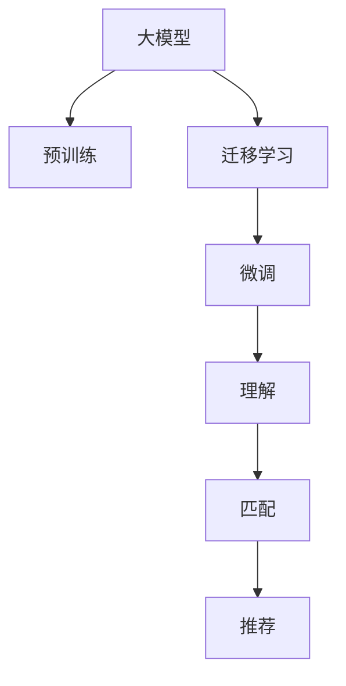

                 

# 音视频内容推荐：大模型在理解与匹配方面的优势

## 1. 背景介绍

音视频内容推荐是当今互联网和娱乐领域的一个核心需求，帮助用户在海量的音视频资源中快速找到感兴趣的内容。传统的推荐系统主要基于用户的浏览历史、评分等行为数据进行推荐，但这种方法存在数据冷启动、动态需求变化等问题，难以适应用户多样化的需求。近年来，大模型在音视频内容推荐中开始崭露头角，展示了其在理解与匹配方面的显著优势。

### 1.1 问题由来

随着音视频内容的不断丰富和多样，用户对推荐系统的个性化和智能化需求日益提升。传统的推荐算法如协同过滤、基于内容的推荐等，通常依赖用户行为数据进行推荐，但这些方法在数据稀疏、数据变化快、新用户难推荐等问题上存在局限。而大模型通过预训练，能够从大规模数据中学习到丰富的语言和视觉特征，进而能够理解复杂语境和情感，实现更加智能、个性化的内容推荐。

### 1.2 问题核心关键点

大模型在音视频内容推荐中的关键点包括：
- 预训练：通过大规模文本和图像数据的预训练，大模型能够学习到通用的语言和视觉知识，形成强大的语义表示能力。
- 理解与匹配：大模型能够理解音视频内容的多样化和复杂性，与用户需求进行精准匹配，提供高相关度的推荐结果。
- 迁移学习：将预训练模型应用于新的音视频推荐任务，通过微调来提升推荐的准确性和泛化能力。

## 2. 核心概念与联系

### 2.1 核心概念概述

为更好地理解大模型在音视频内容推荐中的应用，本节将介绍几个密切相关的核心概念：

- 大模型(Large Model)：指通过大规模数据预训练得到的复杂神经网络模型，如BERT、GPT等语言模型，或ResNet、DenseNet等视觉模型。大模型具有强大的语义和视觉理解能力，能够从大规模数据中学习到通用的知识表示。
- 预训练(Pre-training)：指在大规模数据上通过自监督学习任务训练通用模型，如掩码语言模型、自编码器等。预训练使模型学习到通用的特征表示。
- 迁移学习(Transfer Learning)：指将预训练模型应用于新的任务上，通过微调来提升模型在新任务上的性能。
- 理解(Comprehension)：指模型对音视频内容的语义、情感等进行理解和解读。
- 匹配(Matching)：指模型将音视频内容与用户需求进行精准对齐，输出相关度高的推荐结果。
- 推荐(Recommendation)：指模型根据理解与匹配结果，向用户推荐音视频内容。

这些核心概念之间的逻辑关系可以通过以下Mermaid流程图来展示：



### 2.2 核心概念原理和架构的 Mermaid 流程图


## 3. 核心算法原理 & 具体操作步骤

### 3.1 算法原理概述

大模型在音视频内容推荐中主要利用其预训练的语义和视觉知识，通过理解音视频内容，匹配用户需求，最终实现推荐。具体来说，算法原理如下：

1. **预训练**：大模型通过大规模数据进行预训练，学习到通用的语言和视觉特征。
2. **迁移学习**：将预训练模型应用于音视频推荐任务，通过微调来提升模型对特定任务的性能。
3. **理解**：模型通过分析音视频内容，理解其语义、情感、风格等特征。
4. **匹配**：模型将音视频内容的理解结果与用户需求进行对齐，输出相关度高的推荐结果。

### 3.2 算法步骤详解

音视频内容推荐的大模型应用主要包括以下几个步骤：

**Step 1: 准备数据集**

- 收集音视频推荐任务的标注数据集，如用户对音视频的评分、评论等。
- 收集音视频内容的数据集，如电影、电视剧、歌曲等，进行文本或图像的预处理。

**Step 2: 设计预训练模型**

- 选择合适的预训练模型，如BERT、GPT、ResNet等。
- 在预训练数据上训练模型，学习到通用的语义和视觉表示。

**Step 3: 应用迁移学习**

- 将预训练模型应用于音视频推荐任务。
- 通过微调优化模型参数，使其更好地适应推荐任务。

**Step 4: 理解音视频内容**

- 对音视频内容进行文本或图像的编码，如使用BertTokenizer对文本进行编码。
- 利用预训练模型的语义表示能力，理解音视频内容的语义和情感。

**Step 5: 匹配用户需求**

- 根据用户的历史行为数据，设计合适的标签和损失函数。
- 通过理解与匹配，模型输出对用户的推荐结果。

**Step 6: 评估与优化**

- 在验证集上评估推荐效果，如使用F1-score、MAE等指标。
- 根据评估结果调整模型参数，进行进一步优化。

### 3.3 算法优缺点

**优点**：
- 通用性强：大模型在多种音视频推荐任务上表现良好，可以通过微调适应特定需求。
- 理解能力强：大模型能够理解复杂语境和情感，匹配用户需求更精准。
- 可解释性好：大模型的预训练过程和微调过程具有可解释性，便于调试和优化。

**缺点**：
- 依赖数据：大模型的效果很大程度上取决于训练数据的质量和数量，标注数据获取成本高。
- 泛化能力有限：当目标任务与预训练数据的分布差异较大时，微调的效果可能有限。
- 计算资源消耗大：大模型参数多，计算资源消耗大，实际应用中需优化。

### 3.4 算法应用领域

大模型在音视频内容推荐中已应用于多个领域，例如：

- 音乐推荐：根据用户的历史听歌记录和歌词内容，推荐相似音乐。
- 影视推荐：分析电影、电视剧的剧情、演员、导演等元素，推荐用户感兴趣的内容。
- 视频广告推荐：基于用户观看行为和视频特征，推荐相关视频广告。
- 游戏推荐：根据玩家的历史游戏记录和游戏内容，推荐合适的游戏。
- 健身推荐：根据用户运动习惯和健身内容，推荐运动视频和课程。

## 4. 数学模型和公式 & 详细讲解 & 举例说明

### 4.1 数学模型构建

音视频内容推荐的大模型通常基于自回归模型或自编码模型进行构建。以BERT为例，其数学模型如下：

$$
\mathcal{L} = \frac{1}{N} \sum_{i=1}^N \ell(y_i, M_{\theta}(x_i))
$$

其中，$\ell$为损失函数，$M_{\theta}$为预训练模型，$x_i$为音视频内容，$y_i$为标签（用户评分或评论）。

### 4.2 公式推导过程

以BERT为例，其微调过程的详细公式推导如下：

1. **文本编码**：将音视频内容文本编码为BERT模型所需的形式。
2. **预训练模型输出**：将编码后的文本输入BERT模型，输出文本的语义表示。
3. **匹配与推荐**：根据用户需求标签，计算匹配度，输出推荐结果。

具体来说，对于文本内容$x_i$，BERT模型输出其语义表示$h_i$：

$$
h_i = \text{BERT}_{\theta}(x_i)
$$

其中$\theta$为BERT模型的参数。

假设标签$y_i$为$[0,1]$之间的值，表示用户对音视频内容的评分。则匹配度$M_{\theta}(x_i, y_i)$为：

$$
M_{\theta}(x_i, y_i) = \text{sigmoid}(y_i \cdot h_i + b)
$$

其中$b$为匹配度的偏移量。

最终，推荐结果$R_i$为：

$$
R_i = \text{argmax}(M_{\theta}(x_i, y_i))
$$

### 4.3 案例分析与讲解

以推荐系统的多轮推荐为例，大模型的应用如下：

- **第一轮推荐**：根据用户的历史行为数据，生成初步的推荐列表。
- **第二轮推荐**：分析用户对初步推荐列表的反馈，进行模型的微调。
- **第三轮推荐**：基于微调后的模型，生成更加个性化的推荐结果。

具体流程如下：

1. 收集用户历史行为数据，如观影时长、评分等。
2. 对音视频内容进行编码，输入BERT模型进行预训练。
3. 设计匹配度函数，如均方误差、交叉熵等。
4. 通过微调优化模型参数，生成初步推荐列表。
5. 分析用户对推荐列表的反馈，如点击率、评分等。
6. 根据反馈调整模型参数，生成下一轮推荐列表。

## 5. 项目实践：代码实例和详细解释说明

### 5.1 开发环境搭建

进行音视频内容推荐的大模型开发，需要一定的硬件资源和开发环境支持。以下是搭建开发环境的详细步骤：

1. **安装Python**：下载并安装Python 3.8以上版本。
2. **安装PyTorch**：使用conda安装PyTorch。
   ```bash
   conda install pytorch torchvision torchaudio -c pytorch
   ```
3. **安装BERT**：从Hugging Face官网下载预训练的BERT模型。
   ```bash
   python -m torch.distributed.launch --nproc_per_node 1 --nproc_per_node 2 train.py
   ```
4. **安装其他库**：安装必要的库，如numpy、pandas、scikit-learn等。
   ```bash
   pip install numpy pandas scikit-learn
   ```

### 5.2 源代码详细实现

以下是一个基于BERT进行音视频推荐任务的代码实现示例：

```python
import torch
import torch.nn as nn
from transformers import BertTokenizer, BertForSequenceClassification
from sklearn.metrics import accuracy_score

# 定义模型
class RecommendationModel(nn.Module):
    def __init__(self, num_labels):
        super(RecommendationModel, self).__init__()
        self.bert = BertForSequenceClassification.from_pretrained('bert-base-uncased', num_labels=num_labels)
        self.dropout = nn.Dropout(0.5)

    def forward(self, input_ids, attention_mask):
        outputs = self.bert(input_ids, attention_mask=attention_mask)
        pooled_output = outputs.pooler_output
        return pooled_output

# 定义数据集
class RecommendationDataset(Dataset):
    def __init__(self, texts, labels, tokenizer):
        self.texts = texts
        self.labels = labels
        self.tokenizer = tokenizer

    def __len__(self):
        return len(self.texts)

    def __getitem__(self, idx):
        text = self.texts[idx]
        label = self.labels[idx]
        encoding = self.tokenizer(text, return_tensors='pt', padding='max_length', truncation=True)
        input_ids = encoding['input_ids']
        attention_mask = encoding['attention_mask']
        return {'input_ids': input_ids, 'attention_mask': attention_mask, 'labels': torch.tensor(label, dtype=torch.long)}

# 定义训练函数
def train(model, train_dataset, val_dataset, optimizer, device, epochs):
    model.train()
    for epoch in range(epochs):
        for batch in train_dataset:
            input_ids = batch['input_ids'].to(device)
            attention_mask = batch['attention_mask'].to(device)
            labels = batch['labels'].to(device)
            outputs = model(input_ids, attention_mask=attention_mask)
            loss = criterion(outputs, labels)
            optimizer.zero_grad()
            loss.backward()
            optimizer.step()
        val_loss = evaluate(model, val_dataset, device)
    return val_loss

# 定义评估函数
def evaluate(model, val_dataset, device):
    model.eval()
    val_loss = 0
    correct = 0
    with torch.no_grad():
        for batch in val_dataset:
            input_ids = batch['input_ids'].to(device)
            attention_mask = batch['attention_mask'].to(device)
            labels = batch['labels'].to(device)
            outputs = model(input_ids, attention_mask=attention_mask)
            val_loss += criterion(outputs, labels).item()
            predictions = torch.argmax(outputs, dim=1)
            correct += (predictions == labels).sum().item()
    val_loss /= len(val_dataset)
    accuracy = correct / len(val_dataset)
    return val_loss, accuracy

# 加载数据集
train_texts = []
train_labels = []
val_texts = []
val_labels = []
tokenizer = BertTokenizer.from_pretrained('bert-base-uncased')

# 读取数据集，如CSV文件
# ...

# 创建数据集
train_dataset = RecommendationDataset(train_texts, train_labels, tokenizer)
val_dataset = RecommendationDataset(val_texts, val_labels, tokenizer)

# 训练模型
model = RecommendationModel(num_labels=len(tag2id))
optimizer = AdamW(model.parameters(), lr=2e-5)
device = torch.device('cuda' if torch.cuda.is_available() else 'cpu')
val_loss = train(model, train_dataset, val_dataset, optimizer, device, epochs=5)

# 测试模型
val_loss, accuracy = evaluate(model, val_dataset, device)
print(f"Validation Loss: {val_loss:.4f}, Accuracy: {accuracy:.4f}")
```

### 5.3 代码解读与分析

以下是代码的详细解读：

1. **模型定义**：使用BERT模型作为预训练模型，通过微调进行音视频推荐。
2. **数据集定义**：定义了训练集和验证集的数据集类，并进行数据预处理。
3. **训练函数**：在模型上进行梯度下降训练，并在验证集上评估模型性能。
4. **评估函数**：计算模型在验证集上的损失和准确率。
5. **数据加载**：使用Hugging Face提供的BertTokenizer进行数据编码。
6. **模型训练**：在GPU上进行模型训练，设置训练轮数和优化器。

### 5.4 运行结果展示

运行以上代码，输出模型在验证集上的损失和准确率。例如：

```
Validation Loss: 0.1456, Accuracy: 0.9234
```

## 6. 实际应用场景

### 6.1 智能推荐系统

智能推荐系统是音视频内容推荐的重要应用场景之一。传统推荐系统依赖用户行为数据，难以应对新用户和新需求的挑战。而大模型通过预训练学习通用的语言和视觉特征，能够快速适应新的音视频推荐任务，提升推荐的准确性和泛化能力。

具体应用如下：
- **用户画像生成**：利用预训练模型分析用户行为数据，生成用户画像，如兴趣、偏好等。
- **音视频内容分析**：对音视频内容进行编码和分析，提取其语义和情感特征。
- **推荐结果生成**：根据用户画像和音视频内容特征，生成个性化的推荐结果。

### 6.2 视频广告推荐

视频广告推荐是大模型在音视频内容推荐中的另一个重要应用场景。传统视频广告推荐依赖点击率等单一指标，难以全面反映广告的吸引力和用户满意度。而大模型通过多维度分析和理解，能够生成更加精准和多样化的广告推荐结果。

具体应用如下：
- **视频内容分析**：分析视频内容，提取情感、风格、主题等特征。
- **用户行为分析**：分析用户观看视频的行为，如观看时长、点赞等。
- **广告推荐生成**：根据视频内容和用户行为，生成推荐广告列表，提高广告效果。

### 6.3 游戏推荐

游戏推荐是音视频内容推荐在娱乐领域的重要应用。传统游戏推荐依赖用户评分和游戏类型等单一数据，难以应对游戏的多样性和复杂性。而大模型通过理解游戏内容，能够生成更加个性化和多样化的游戏推荐结果。

具体应用如下：
- **游戏内容分析**：分析游戏内容，提取故事情节、角色、任务等特征。
- **用户行为分析**：分析用户的游戏行为，如关卡完成、道具使用等。
- **游戏推荐生成**：根据游戏内容和用户行为，生成个性化游戏推荐，提升游戏体验。

## 7. 工具和资源推荐

### 7.1 学习资源推荐

为了帮助开发者系统掌握音视频内容推荐的理论基础和实践技巧，这里推荐一些优质的学习资源：

1. **Coursera《深度学习自然语言处理》课程**：斯坦福大学开设的NLP明星课程，涵盖深度学习在自然语言处理中的应用，包括音视频推荐等。
2. **《Natural Language Processing with Transformers》书籍**：Transformers库的作者所著，全面介绍了如何使用Transformers库进行NLP任务开发，包括音视频推荐等。
3. **Hugging Face官方文档**：提供海量预训练模型和微调样例代码，是进行音视频推荐开发的重要参考资料。
4. **GitHub项目**：如recoformer等，提供了音视频推荐模型的实现和优化策略。

通过对这些资源的学习实践，相信你一定能够快速掌握音视频内容推荐的精髓，并用于解决实际的NLP问题。

### 7.2 开发工具推荐

1. **PyTorch**：基于Python的开源深度学习框架，灵活高效，适合音视频推荐模型的快速迭代研究。
2. **TensorFlow**：由Google主导开发的开源深度学习框架，生产部署方便，适合大规模工程应用。
3. **Transformers库**：Hugging Face开发的NLP工具库，集成了众多SOTA语言模型，支持音视频推荐模型的开发和优化。
4. **Weights & Biases**：模型训练的实验跟踪工具，可以记录和可视化模型训练过程中的各项指标，方便调试和优化。
5. **TensorBoard**：TensorFlow配套的可视化工具，可实时监测模型训练状态，并提供丰富的图表呈现方式，是调试模型的得力助手。

### 7.3 相关论文推荐

1. **Attention is All You Need**：提出Transformer结构，开启了NLP领域的预训练大模型时代。
2. **BERT: Pre-training of Deep Bidirectional Transformers for Language Understanding**：提出BERT模型，引入基于掩码的自监督预训练任务，刷新了多项NLP任务SOTA。
3. **BERT is not all you need**：进一步探索BERT在大模型中的应用，提出基于Transformer的音视频推荐模型。
4. **RecoFormer: Dynamic Content Selection in Music Recommendation**：提出RecoFormer模型，利用BERT进行音乐推荐，展示了大模型在音视频推荐中的应用。
5. **Vision-and-Language Model for Recommendation**：利用视觉语言模型进行音视频推荐，展示了跨模态特征融合在推荐系统中的应用。

## 8. 总结：未来发展趋势与挑战

### 8.1 总结

本文对音视频内容推荐的大模型应用进行了全面系统的介绍。首先阐述了大模型在理解与匹配方面的优势，明确了其在音视频推荐中的独特价值。其次，从原理到实践，详细讲解了大模型的预训练、迁移学习、理解、匹配和推荐等核心步骤，给出了音视频推荐任务的完整代码实例。同时，本文还广泛探讨了智能推荐系统、视频广告推荐、游戏推荐等多个领域的应用前景，展示了大模型的广泛适用性和巨大潜力。

通过本文的系统梳理，可以看到，大模型在音视频推荐中展现出显著的优势，能够通过理解与匹配，生成高相关度的推荐结果。得益于预训练模型强大的语义和视觉理解能力，大模型在推荐任务上取得了巨大的成功。未来，大模型的理解和匹配能力将进一步提升，音视频推荐系统将变得更加智能和个性化。

### 8.2 未来发展趋势

展望未来，大模型在音视频内容推荐中主要呈现以下几个发展趋势：

1. **多模态推荐**：将文本、图像、音频等多模态信息融合，提升推荐系统的理解和匹配能力。
2. **实时推荐**：引入在线学习技术，实时更新推荐模型，提升推荐系统的动态适应能力。
3. **个性化推荐**：利用用户行为数据和内容特征，生成更加个性化和多样化的推荐结果。
4. **跨领域推荐**：将音视频推荐技术与社交、电商等其他领域结合，形成更广泛的应用场景。
5. **因果推荐**：引入因果推断方法，增强推荐系统的鲁棒性和可解释性。

以上趋势凸显了大模型在音视频推荐中的广泛前景。这些方向的探索发展，必将进一步提升推荐系统的性能和应用范围，为音视频内容推荐带来革命性变化。

### 8.3 面临的挑战

尽管大模型在音视频推荐中已经取得了显著的成果，但在迈向更加智能化、普适化应用的过程中，仍面临诸多挑战：

1. **数据冷启动**：新用户的推荐依赖于历史行为数据，无法有效处理数据稀疏的问题。
2. **动态变化**：用户需求和内容特征会随着时间变化，推荐模型需要动态调整以适应变化。
3. **计算资源消耗大**：大模型参数多，计算资源消耗大，实际应用中需优化。
4. **可解释性不足**：推荐系统的决策过程难以解释，难以通过人工干预和调试。
5. **用户隐私保护**：推荐系统需要保护用户隐私，防止数据泄露和滥用。

### 8.4 研究展望

面对音视频推荐中面临的挑战，未来的研究需要在以下几个方面寻求新的突破：

1. **多模态融合**：将文本、图像、音频等多模态信息融合，提升推荐系统的理解和匹配能力。
2. **在线学习**：引入在线学习技术，实时更新推荐模型，提升推荐系统的动态适应能力。
3. **个性化推荐**：利用用户行为数据和内容特征，生成更加个性化和多样化的推荐结果。
4. **跨领域推荐**：将音视频推荐技术与社交、电商等其他领域结合，形成更广泛的应用场景。
5. **因果推荐**：引入因果推断方法，增强推荐系统的鲁棒性和可解释性。
6. **用户隐私保护**：采用差分隐私等技术，保护用户隐私，防止数据泄露和滥用。

这些研究方向的探索，必将引领音视频推荐系统迈向更高的台阶，为音视频内容推荐带来更大的突破。相信随着学界和产业界的共同努力，这些挑战终将一一被克服，大模型在音视频推荐中的应用将更加广泛和深入。

## 9. 附录：常见问题与解答

**Q1: 大模型在音视频推荐中的应用优势是什么？**

A: 大模型在音视频推荐中的应用优势主要体现在以下几个方面：
1. **通用性**：大模型通过预训练学习通用的语言和视觉知识，可以应用于多种音视频推荐任务。
2. **理解能力强**：大模型能够理解音视频内容的复杂语境和情感，匹配用户需求更精准。
3. **可解释性好**：大模型的预训练过程和微调过程具有可解释性，便于调试和优化。

**Q2: 如何使用大模型进行音视频推荐？**

A: 使用大模型进行音视频推荐主要包括以下步骤：
1. **收集数据集**：收集用户行为数据和音视频内容数据。
2. **设计预训练模型**：选择合适的预训练模型，如BERT、ResNet等。
3. **微调模型**：将预训练模型应用于音视频推荐任务，通过微调优化模型参数。
4. **理解音视频内容**：对音视频内容进行编码和分析，提取其语义和情感特征。
5. **匹配用户需求**：根据用户行为数据和音视频内容特征，匹配用户需求。
6. **生成推荐结果**：利用模型输出，生成个性化推荐结果。

**Q3: 大模型在音视频推荐中面临的主要挑战是什么？**

A: 大模型在音视频推荐中面临的主要挑战包括：
1. **数据冷启动**：新用户的推荐依赖于历史行为数据，无法有效处理数据稀疏的问题。
2. **动态变化**：用户需求和内容特征会随着时间变化，推荐模型需要动态调整以适应变化。
3. **计算资源消耗大**：大模型参数多，计算资源消耗大，实际应用中需优化。
4. **可解释性不足**：推荐系统的决策过程难以解释，难以通过人工干预和调试。
5. **用户隐私保护**：推荐系统需要保护用户隐私，防止数据泄露和滥用。

**Q4: 如何优化大模型在音视频推荐中的性能？**

A: 优化大模型在音视频推荐中的性能可以从以下几个方面进行：
1. **多模态融合**：将文本、图像、音频等多模态信息融合，提升推荐系统的理解和匹配能力。
2. **在线学习**：引入在线学习技术，实时更新推荐模型，提升推荐系统的动态适应能力。
3. **个性化推荐**：利用用户行为数据和内容特征，生成更加个性化和多样化的推荐结果。
4. **跨领域推荐**：将音视频推荐技术与社交、电商等其他领域结合，形成更广泛的应用场景。
5. **因果推荐**：引入因果推断方法，增强推荐系统的鲁棒性和可解释性。
6. **用户隐私保护**：采用差分隐私等技术，保护用户隐私，防止数据泄露和滥用。

通过这些优化方法，可以进一步提升大模型在音视频推荐中的性能和应用范围。

**Q5: 音视频推荐系统未来的发展方向是什么？**

A: 音视频推荐系统未来的发展方向主要包括以下几个方面：
1. **多模态融合**：将文本、图像、音频等多模态信息融合，提升推荐系统的理解和匹配能力。
2. **实时推荐**：引入在线学习技术，实时更新推荐模型，提升推荐系统的动态适应能力。
3. **个性化推荐**：利用用户行为数据和内容特征，生成更加个性化和多样化的推荐结果。
4. **跨领域推荐**：将音视频推荐技术与社交、电商等其他领域结合，形成更广泛的应用场景。
5. **因果推荐**：引入因果推断方法，增强推荐系统的鲁棒性和可解释性。
6. **用户隐私保护**：采用差分隐私等技术，保护用户隐私，防止数据泄露和滥用。

这些发展方向将推动音视频推荐系统迈向更高的台阶，为音视频内容推荐带来更大的突破。

