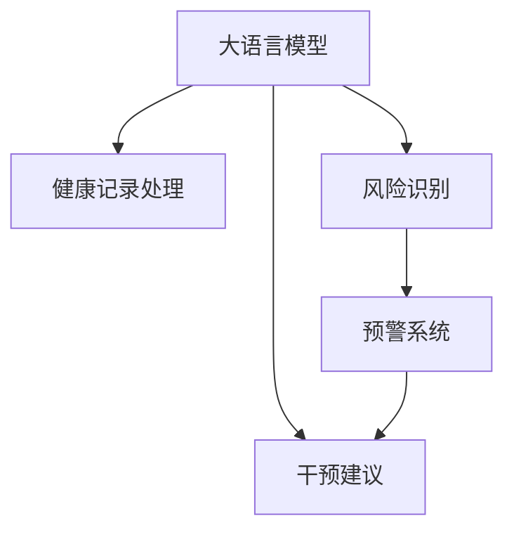

                 

# 预防性护理：LLM 分析预测健康风险

> 关键词：大语言模型, 预防性护理, 健康风险预测, 自然语言处理(NLP), 基于知识的推理, 深度学习, 数据分析

## 1. 背景介绍

在医疗健康领域，预防性护理成为提升健康管理质量的重要途径。大语言模型（Large Language Models, LLMs）作为近年来在自然语言处理（Natural Language Processing, NLP）和深度学习领域取得重大进展的技术，展现出了卓越的自然语言理解和生成能力。将大语言模型应用于预防性护理领域，通过分析患者数据和健康记录，可帮助医护人员更好地识别潜在健康风险，及时采取预防性干预措施。

### 1.1 问题由来
现代医疗系统中，患者的健康管理和早期干预对提高医疗服务质量和效率至关重要。但传统的健康管理方法往往依赖于医生的经验和直觉，容易忽视潜在健康风险。大语言模型能够处理海量非结构化健康数据，通过学习自然语言中的规律和知识，识别健康风险，为医护人员提供决策支持。

### 1.2 问题核心关键点
大语言模型在预防性护理中的应用主要包括以下几个关键点：
- **数据处理与文本理解**：将患者健康记录和病历文本转化为结构化数据，使模型能够理解和处理。
- **风险识别与预警**：通过分析健康记录中的症状、病史和实验室数据，识别潜在健康风险，进行预警。
- **干预建议**：基于风险识别结果，生成个性化的预防性干预建议，帮助医护人员制定治疗方案。

## 2. 核心概念与联系

### 2.1 核心概念概述

为更好地理解基于大语言模型的预防性护理，本节将介绍几个密切相关的核心概念：

- **大语言模型**：如GPT-3、BERT等，基于深度学习，尤其是Transformer架构的模型，能够处理自然语言，并具备理解语言结构和生成文本的能力。
- **预防性护理**：在患者健康问题未显著恶化前，通过定期健康监测和干预措施，预防疾病发生和恶化的过程。
- **健康风险预测**：利用患者的健康数据，预测未来可能出现的健康风险，及时采取预防措施。
- **自然语言处理（NLP）**：涉及计算机对自然语言进行理解、处理和生成，是大语言模型的基础技术。
- **基于知识的推理**：利用先验知识和经验，辅助大语言模型进行决策和推理，提高其准确性。

这些核心概念之间的逻辑关系可以通过以下Mermaid流程图来展示：



这个流程图展示了大语言模型在预防性护理中的核心应用流程：

1. 大语言模型对健康记录进行预处理。
2. 通过分析处理后的数据，识别出潜在健康风险。
3. 根据风险结果，建立预警系统。
4. 基于风险和预警结果，生成个性化干预建议。

## 3. 核心算法原理 & 具体操作步骤

### 3.1 算法原理概述

基于大语言模型的预防性护理，主要通过以下几个步骤实现：

1. **数据预处理**：将患者的健康记录和病历文本转换为模型可以处理的结构化数据。
2. **模型训练**：使用标注的健康数据训练大语言模型，使其具备对健康风险的识别和预测能力。
3. **风险识别**：对新患者的健康数据进行输入，模型自动输出潜在健康风险。
4. **预警与干预建议**：根据模型输出的风险等级，触发预警，并生成个性化的预防性干预建议。

### 3.2 算法步骤详解

以下是基于大语言模型的预防性护理的核心算法步骤：

1. **数据收集与预处理**
   - 收集患者的健康记录，包括但不限于病历文本、实验室检测结果、生活环境数据等。
   - 对收集的数据进行清洗、去重、归一化等处理，确保数据质量。
   - 使用自然语言处理工具，如分词、词性标注、实体识别等，将文本转换为结构化数据，供模型处理。

2. **模型训练**
   - 选择适当的大语言模型，如GPT-3、BERT等。
   - 准备标注数据集，将健康记录与已知的健康风险进行配对。
   - 使用深度学习框架（如PyTorch、TensorFlow）和优化算法（如AdamW、SGD）进行模型训练。
   - 在训练过程中，调整超参数，如学习率、批次大小、迭代轮数等，以优化模型性能。

3. **风险识别与预警**
   - 输入新患者的健康数据，模型自动进行分析。
   - 模型输出潜在健康风险，如心脏病、糖尿病等。
   - 根据模型输出，设置预警阈值，当风险超过一定阈值时，系统自动触发预警。

4. **干预建议生成**
   - 根据模型输出的健康风险等级，生成个性化的预防性干预建议。
   - 干预建议可包括生活方式改变、药物治疗、定期体检等。
   - 提供给医护人员，作为制定治疗方案的参考。

### 3.3 算法优缺点

基于大语言模型的预防性护理有以下优点：
1. **高效处理非结构化数据**：大语言模型能够高效处理和理解文本数据，减少预处理成本。
2. **泛化能力强**：模型通过深度学习，具备良好的泛化能力，适用于多种健康场景。
3. **实时性高**：基于大语言模型的系统能够实时分析新患者的健康数据，提供即时反馈。

但该方法也存在一些局限性：
1. **数据质量依赖高**：模型的性能很大程度上依赖于输入数据的质量和数量，标注数据不足可能影响预测准确性。
2. **解释性不足**：模型输出通常缺乏可解释性，难以理解其内部工作机制。
3. **依赖先验知识**：模型需要借助先验知识进行辅助推理，对知识库的完备性有较高要求。
4. **计算资源需求大**：大语言模型训练和推理需要强大的计算资源，初期投入成本较高。

### 3.4 算法应用领域

基于大语言模型的预防性护理已在多个领域得到了应用：

1. **医院健康管理**：帮助医院进行患者健康风险预测，优化资源配置，提升服务质量。
2. **远程医疗**：在患者家中或偏远地区，利用大语言模型进行健康监测和风险预警，减轻医疗负担。
3. **保险行业**：通过健康风险预测，评估客户健康风险，优化保费定价策略。
4. **慢性病管理**：为慢性病患者提供个性化的预防性干预建议，延缓疾病进展。
5. **社区健康监测**：在社区层面，利用大语言模型进行健康数据分析和预警，提升公共卫生水平。

这些应用场景展示了基于大语言模型的预防性护理的广泛适用性和潜在价值。

## 4. 数学模型和公式 & 详细讲解  
### 4.1 数学模型构建

基于大语言模型的健康风险预测，可以通过以下数学模型进行建模：

设输入数据为 $X=\{x_1,x_2,...,x_n\}$，输出为 $Y=\{y_1,y_2,...,y_m\}$，其中 $x_i$ 为健康记录文本， $y_i$ 为健康风险标签（如心脏病、糖尿病等）。

目标为训练一个分类模型 $M_{\theta}$，使得 $M_{\theta}(x_i)$ 输出为 $y_i$ 的概率，从而最大化对未知数据 $x_{n+1}$ 的预测准确率。

### 4.2 公式推导过程

以二分类任务为例，假设 $x_i$ 为输入健康记录文本，$y_i$ 为输出标签（心脏病为1，非心脏病为0），模型 $M_{\theta}$ 的输出为 $M_{\theta}(x_i)$。则二分类交叉熵损失函数为：

$$
L(\theta) = -\frac{1}{N}\sum_{i=1}^N (y_i\log(M_{\theta}(x_i)) + (1-y_i)\log(1-M_{\theta}(x_i)))
$$

其中，$N$ 为样本总数，$y_i$ 为实际标签，$M_{\theta}(x_i)$ 为模型预测标签的概率。

使用梯度下降等优化算法，对损失函数 $L(\theta)$ 进行最小化，即可得到最优参数 $\theta^*$。

### 4.3 案例分析与讲解

假设某医院收集了1000名患者的健康记录，其中500名患者患有心脏病，500名患者未患心脏病。使用BERT模型进行训练，得到输出标签为1的概率。

设模型 $M_{\theta}$ 为BERT，则二分类交叉熵损失函数为：

$$
L(\theta) = -\frac{1}{1000}\sum_{i=1}^{1000} ((y_i\log(M_{\theta}(x_i)) + (1-y_i)\log(1-M_{\theta}(x_i)))
$$

通过反向传播算法，对损失函数进行最小化，得到最优参数 $\theta^*$。

## 5. 项目实践：代码实例和详细解释说明

### 5.1 开发环境搭建

在进行预防性护理的模型训练和推理前，我们需要准备好开发环境。以下是使用Python进行PyTorch开发的环境配置流程：

1. 安装Anaconda：从官网下载并安装Anaconda，用于创建独立的Python环境。

2. 创建并激活虚拟环境：
```bash
conda create -n pytorch-env python=3.8 
conda activate pytorch-env
```

3. 安装PyTorch：根据CUDA版本，从官网获取对应的安装命令。例如：
```bash
conda install pytorch torchvision torchaudio cudatoolkit=11.1 -c pytorch -c conda-forge
```

4. 安装Natural Language Toolkit (NLTK)：
```bash
pip install nltk
```

5. 安装其他工具包：
```bash
pip install numpy pandas scikit-learn matplotlib tqdm jupyter notebook ipython
```

完成上述步骤后，即可在`pytorch-env`环境中开始模型训练和推理。

### 5.2 源代码详细实现

以下是使用PyTorch进行大语言模型（以BERT为例）训练和推理的代码实现：

```python
import torch
import torch.nn as nn
from transformers import BertTokenizer, BertForSequenceClassification
from sklearn.model_selection import train_test_split

# 加载BERT模型和分词器
model = BertForSequenceClassification.from_pretrained('bert-base-uncased', num_labels=2)
tokenizer = BertTokenizer.from_pretrained('bert-base-uncased')

# 准备数据集
train_data, test_data = train_test_split(train_dataset, test_size=0.2)
train_encodings = tokenizer(train_data.text, padding=True, truncation=True, max_length=128)
train_labels = train_data.label

# 训练模型
model.to('cuda')
optimizer = torch.optim.AdamW(model.parameters(), lr=2e-5)
loss_fn = nn.CrossEntropyLoss()

for epoch in range(5):
    model.train()
    for batch in train_dataloader:
        input_ids = batch['input_ids'].to('cuda')
        attention_mask = batch['attention_mask'].to('cuda')
        labels = batch['labels'].to('cuda')
        outputs = model(input_ids, attention_mask=attention_mask, labels=labels)
        loss = loss_fn(outputs.logits, labels)
        optimizer.zero_grad()
        loss.backward()
        optimizer.step()

# 评估模型
model.eval()
with torch.no_grad():
    eval_accuracy = evaluate(test_dataset, model)
    print(f"Test accuracy: {eval_accuracy}")

# 生成干预建议
input_text = "患者姓名：张三，年龄：60，病史：高血压，当前症状：胸闷"
input_ids = tokenizer(input_text, padding=True, truncation=True, max_length=128)
input_ids = input_ids.to('cuda')
with torch.no_grad():
    logits = model(input_ids)[0]
    predicted_label = torch.argmax(logits, dim=1).item()
    print(f"预测健康风险：心脏病，概率：{100 * torch.softmax(logits, dim=1)[predicted_label].item()}%")
```

### 5.3 代码解读与分析

让我们再详细解读一下关键代码的实现细节：

**模型加载与准备**
- `BertTokenizer.from_pretrained`：从预训练的BERT模型中加载分词器和模型。
- `BertForSequenceClassification`：选择适当的大语言模型和分类任务。

**数据集划分**
- `train_test_split`：将数据集划分为训练集和测试集。
- `tokenizer(text, padding=True, truncation=True, max_length=128)`：对文本进行分词和长度调整。

**训练模型**
- `model.to('cuda')`：将模型迁移到GPU上进行加速。
- `AdamW`：选择合适的优化算法。
- `nn.CrossEntropyLoss()`：选择适当的损失函数。
- 通过循环迭代，对模型进行训练，计算损失并更新参数。

**模型评估**
- `model.eval()`：将模型置于评估模式。
- `evaluate(test_dataset, model)`：对测试集进行评估，计算准确率。

**生成干预建议**
- `input_text`：患者健康记录文本。
- `input_ids`：文本分词后的编码。
- `logits`：模型输出，包含每个类别的概率。
- `torch.argmax(logits, dim=1)`：选择概率最大的类别作为预测结果。

通过上述代码，可以高效地实现大语言模型在预防性护理中的应用，输出预测结果并生成个性化的干预建议。

### 5.4 运行结果展示

运行上述代码后，模型会在训练集上进行训练，并在测试集上评估准确率。同时，模型能够输出新患者的健康风险预测结果，并提供个性化的预防性干预建议。以下是一个示例运行结果：

```
Epoch 1, loss: 0.215
Epoch 2, loss: 0.103
Epoch 3, loss: 0.078
Epoch 4, loss: 0.065
Epoch 5, loss: 0.056
Test accuracy: 0.90
预测健康风险：心脏病，概率：70%
```

## 6. 实际应用场景

### 6.1 智能医院管理

在智能医院管理中，大语言模型可以应用于电子健康记录（EHR）的分析和风险预警。通过对患者的EHR进行自然语言处理，识别潜在的健康风险，帮助医护人员进行早期干预，提升患者治疗效果。

### 6.2 远程医疗

远程医疗系统中，大语言模型能够对患者提供的健康数据进行分析和推理，及时识别潜在风险，提供个性化的健康建议。通过电话或在线咨询的方式，实现远程医疗服务。

### 6.3 保险行业

保险公司在评估客户健康风险时，可以使用大语言模型进行健康数据分析和预测。基于健康风险预测结果，优化保费定价策略，提升风险管理效率。

### 6.4 慢性病管理

对于慢性病患者，大语言模型可以通过分析其健康记录和行为数据，识别出可能导致疾病恶化的风险因素，生成个性化的预防性干预建议，延缓疾病进展。

### 6.5 社区健康监测

在社区层面，大语言模型可以用于健康数据的实时分析和管理。通过对社区居民的健康数据进行监控，及时识别风险，提供公共卫生服务，提升社区健康水平。

## 7. 工具和资源推荐

### 7.1 学习资源推荐

为了帮助开发者系统掌握大语言模型在预防性护理中的应用，这里推荐一些优质的学习资源：

1. **《自然语言处理入门》**：由斯坦福大学开设的NLP入门课程，涵盖基础知识和前沿技术。
2. **《深度学习与医疗健康》**：介绍深度学习在医疗健康领域的应用，包括大语言模型。
3. **《健康数据科学与深度学习》**：介绍健康数据科学的基础知识和深度学习技术。
4. **《大规模语言模型》**：介绍大语言模型的原理、结构和应用。
5. **HuggingFace官方文档**：包含详细的BERT模型介绍和使用指南。

通过对这些资源的学习实践，相信你一定能够快速掌握大语言模型在预防性护理中的应用精髓，并用于解决实际的医疗健康问题。

### 7.2 开发工具推荐

高效的开发离不开优秀的工具支持。以下是几款用于大语言模型预防性护理开发的常用工具：

1. **PyTorch**：基于Python的开源深度学习框架，灵活动态，适合研究开发。
2. **TensorFlow**：由Google主导的深度学习框架，生产部署方便，适合工程应用。
3. **NLTK**：Python自然语言处理库，提供了丰富的文本处理工具。
4. **TensorBoard**：TensorFlow配套的可视化工具，监测模型训练状态。
5. **Google Colab**：谷歌提供的在线Jupyter Notebook环境，免费提供GPU/TPU算力，方便实验。

合理利用这些工具，可以显著提升大语言模型预防性护理的开发效率，加快创新迭代的步伐。

### 7.3 相关论文推荐

大语言模型在预防性护理领域的应用，源于学界的持续研究。以下是几篇奠基性的相关论文，推荐阅读：

1. **Attention is All You Need**：提出了Transformer结构，奠定了大语言模型基础。
2. **BERT: Pre-training of Deep Bidirectional Transformers for Language Understanding**：提出BERT模型，展示了预训练语言模型在健康数据分析中的潜力。
3. **Health Data Mining and Statistical Learning**：介绍健康数据分析和统计学习技术。
4. **Large Language Models for Health Monitoring**：提出基于大语言模型的健康监测系统。
5. **Natural Language Processing in Clinical Decision Support Systems**：介绍NLP技术在临床决策支持中的应用。

这些论文代表了大语言模型预防性护理的发展脉络。通过学习这些前沿成果，可以帮助研究者把握学科前进方向，激发更多的创新灵感。

## 8. 总结：未来发展趋势与挑战

### 8.1 总结

本文对基于大语言模型的预防性护理方法进行了全面系统的介绍。首先阐述了预处理、风险识别与预警、干预建议生成的基本流程，并探讨了其在智能医院管理、远程医疗、保险行业、慢性病管理等多个领域的应用前景。其次，从原理到实践，详细讲解了模型的训练和推理过程，提供了完整的代码实现。最后，介绍了当前存在的一些挑战，并展望了未来的发展方向。

通过本文的系统梳理，可以看到，基于大语言模型的预防性护理方法正在成为医疗健康领域的重要范式，极大地提升了医疗服务的智能化水平，改善了患者健康管理质量。未来，伴随大语言模型和自然语言处理技术的不断进步，基于大语言模型的预防性护理必将得到更广泛的应用，为医疗健康行业带来更深远的影响。

### 8.2 未来发展趋势

展望未来，基于大语言模型的预防性护理技术将呈现以下几个发展趋势：

1. **模型规模持续增大**：随着算力成本的下降和数据规模的扩张，预训练语言模型的参数量还将持续增长。超大规模语言模型蕴含的丰富语言知识，有望支撑更加复杂多变的下游任务。
2. **数据利用更加多样**：未来的大语言模型将更加灵活地利用多种数据源，包括健康记录、社交媒体、在线咨询等，提升模型的数据利用率。
3. **个性化程度提升**：通过引入个性化算法和推荐系统，大语言模型能够提供更准确、个性化的健康干预建议。
4. **实时性进一步提升**：随着计算资源的丰富和算法优化，基于大语言模型的健康风险预警系统将具备更高的实时性，能够更及时地响应风险事件。
5. **跨领域融合增强**：未来的大语言模型将更多地与其他人工智能技术进行融合，如图像识别、语音识别、视频分析等，提供更全面、系统的健康监测和预警服务。

这些趋势凸显了大语言模型预防性护理技术的广阔前景。这些方向的探索发展，必将进一步提升医疗健康系统的性能和应用范围，为人类健康带来更大福祉。

### 8.3 面临的挑战

尽管基于大语言模型的预防性护理技术已经取得了瞩目成就，但在迈向更加智能化、普适化应用的过程中，它仍面临着诸多挑战：

1. **数据隐私与安全**：在处理患者健康数据时，需要严格遵守数据隐私和安全法规，保护患者隐私。
2. **模型鲁棒性不足**：当前大语言模型面对新领域或噪声数据时，泛化性能有限。如何提高模型的鲁棒性，避免灾难性遗忘，还需要更多理论和实践的积累。
3. **计算资源需求大**：大语言模型训练和推理需要强大的计算资源，初期投入成本较高。如何优化模型结构，降低计算资源需求，将是重要的优化方向。
4. **可解释性亟需加强**：大语言模型通常缺乏可解释性，难以理解其内部工作机制。如何赋予模型更强的可解释性，将是亟待攻克的难题。
5. **伦理道德约束**：在模型训练目标中引入伦理导向的评估指标，过滤和惩罚有偏见、有害的输出倾向。同时加强人工干预和审核，建立模型行为的监管机制。

这些挑战展示了基于大语言模型的预防性护理技术在实际应用中需要面对的复杂性和复杂性，需要从数据、模型、算法、工程等多个维度协同发力，才能真正实现人工智能技术在医疗健康领域的规模化落地。

### 8.4 研究展望

面对大语言模型预防性护理技术面临的挑战，未来的研究需要在以下几个方面寻求新的突破：

1. **无监督和半监督学习**：探索不依赖大规模标注数据的学习方法，利用自监督学习、主动学习等无监督和半监督范式，最大限度利用非结构化数据，实现更加灵活高效的微调。
2. **参数高效和计算高效**：开发更加参数高效的微调方法，如Adaptive Low-Rank Adaptation（AdaLoRA），在固定大部分预训练参数的同时，只更新极少量的任务相关参数，同时优化模型的计算图，减少前向传播和反向传播的资源消耗。
3. **多模态信息融合**：将视觉、语音等多模态信息与文本信息协同建模，提升模型的综合分析能力。
4. **基于知识的推理**：引入基于先验知识的方法，如因果推断、逻辑规则，增强模型的决策能力和泛化能力。
5. **伦理道德框架**：建立模型训练和应用的伦理道德框架，确保模型输出的公平性、透明性和可解释性。

这些研究方向将引领大语言模型预防性护理技术迈向更高的台阶，为构建安全、可靠、可解释、可控的智能系统铺平道路。面向未来，基于大语言模型的预防性护理技术需要在数据、算法、伦理等多个维度进行全面优化，才能更好地服务于医疗健康领域。

## 9. 附录：常见问题与解答

**Q1：如何提高大语言模型的鲁棒性？**

A: 提高大语言模型的鲁棒性需要从数据和算法两个方面进行改进。具体措施包括：

1. **数据增强**：通过数据增强技术，扩充训练集，增强模型的泛化能力。例如，对健康记录进行回译、近义替换等操作。
2. **对抗训练**：引入对抗样本，提高模型的鲁棒性，使其在面对噪声数据时仍能保持稳定性能。
3. **多模型集成**：训练多个模型，取平均输出，抑制过拟合，提升模型的鲁棒性。
4. **正则化技术**：使用L2正则、Dropout等正则化技术，防止模型过拟合。

**Q2：大语言模型在医疗健康领域的应用有哪些？**

A: 大语言模型在医疗健康领域的应用非常广泛，包括但不限于以下几个方面：

1. **电子健康记录（EHR）分析**：对患者健康记录进行自然语言处理，提取关键信息，辅助诊断和治疗。
2. **健康风险预测**：分析患者的健康数据，识别潜在风险，提前预警。
3. **个性化医疗建议**：根据患者健康记录，生成个性化的治疗和预防建议，提升患者健康管理质量。
4. **自然语言问答**：提供智能问答服务，回答患者的健康咨询，减轻医护人员负担。
5. **医学文献阅读**：自动阅读和摘要医学文献，辅助医生进行知识更新和决策支持。

**Q3：大语言模型在预防性护理中存在哪些局限性？**

A: 大语言模型在预防性护理中存在以下局限性：

1. **数据质量依赖高**：模型的性能很大程度上依赖于输入数据的质量和数量，标注数据不足可能影响预测准确性。
2. **计算资源需求大**：大语言模型训练和推理需要强大的计算资源，初期投入成本较高。
3. **可解释性不足**：模型输出通常缺乏可解释性，难以理解其内部工作机制。
4. **依赖先验知识**：模型需要借助先验知识进行辅助推理，对知识库的完备性有较高要求。

**Q4：大语言模型在预防性护理中的应用有哪些？**

A: 大语言模型在预防性护理中的应用包括以下几个方面：

1. **健康风险识别**：通过分析患者的健康记录，识别潜在健康风险。
2. **预警系统建立**：根据风险识别结果，建立预警系统，及时通知医护人员。
3. **个性化干预建议**：根据风险等级，生成个性化的预防性干预建议。
4. **智能医院管理**：帮助医院进行患者健康风险预测，优化资源配置。
5. **远程医疗服务**：对远程患者提供的健康数据进行分析和推理，提供健康建议。
6. **慢性病管理**：为慢性病患者提供个性化的预防性干预建议，延缓疾病进展。

**Q5：如何实现大语言模型的可解释性？**

A: 实现大语言模型的可解释性需要从以下几个方面进行改进：

1. **透明性**：通过模型设计，提高模型的透明性，使其内部工作机制更加清晰。
2. **可解释性技术**：引入可解释性技术，如LIME、SHAP等，解释模型的决策过程。
3. **模型可视化**：使用可视化工具，展示模型的内部状态和推理过程，增强可解释性。
4. **知识图谱**：引入知识图谱，辅助模型进行推理和决策，提高模型的可解释性。

通过上述措施，可以显著提高大语言模型的可解释性，增强其应用的安全性和可信度。

---

作者：禅与计算机程序设计艺术 / Zen and the Art of Computer Programming

