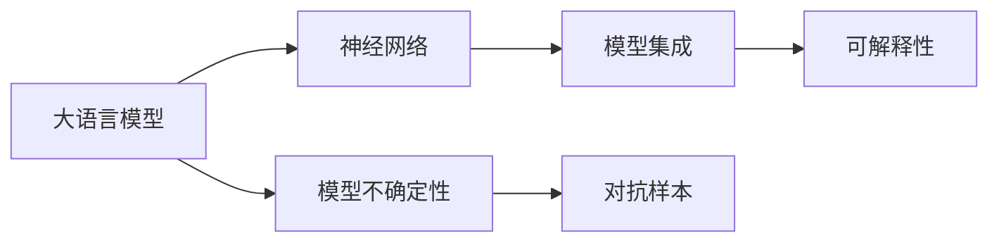

                 

# 驾驭AI的不确定性：增强LLM可控性

> 关键词：大语言模型,可控性,LLM,神经网络,不确定性,模型集成

## 1. 背景介绍

### 1.1 问题由来
在当今的人工智能(AI)领域，大语言模型(LLM)已经成为了最前沿的技术之一。LLM，如GPT、BERT等，通过深度学习技术，在大规模无标签文本数据上进行预训练，具备了强大的语言理解与生成能力。然而，由于模型庞大、参数复杂，LLM在实际应用中表现出显著的不确定性。这种不确定性不仅影响模型的稳定性和可靠性，也限制了其在实际场景中的应用。

### 1.2 问题核心关键点
大语言模型的不确定性主要源于以下几个方面：
- **模型复杂性**：庞大的参数量和层数，导致模型对输入数据的微小变化非常敏感。
- **数据偏差**：训练数据中的偏差会导致模型对某些数据产生过度拟合或偏见。
- **过拟合与欠拟合**：在微调过程中，模型容易出现过拟合或欠拟合问题，影响泛化能力。
- **对抗样本**：对抗样本攻击可以导致模型输出错误，降低系统的鲁棒性。
- **推理计算成本**：高精度推理计算带来的高成本，限制了模型的实际部署。

### 1.3 问题研究意义
应对大语言模型的不确定性，旨在提升模型可控性，确保其在实际应用中的稳定性和可靠性。研究如何降低模型不确定性，对于保障AI技术的安全、高效、可信应用具有重要意义：

1. **提升系统鲁棒性**：降低对输入数据的敏感性，提高模型的鲁棒性和抗干扰能力。
2. **优化模型泛化能力**：在保证模型精度的同时，提高其在新数据上的泛化性能。
3. **降低计算成本**：提高推理速度，优化模型结构，降低计算资源占用。
4. **增强可解释性**：提升模型输出的可解释性，满足合规性和用户需求。
5. **确保安全与隐私**：通过对抗样本防御和隐私保护措施，保障数据和模型安全。

本文将从大语言模型的基本原理出发，探讨如何通过增强模型可控性来应对不确定性，从而提升其在实际应用中的表现和可靠性。

## 2. 核心概念与联系

### 2.1 核心概念概述

为更好地理解如何增强大语言模型的可控性，本节将介绍几个关键概念及其相互关系：

- **大语言模型(LLM)**：以深度学习为基础的通用语言处理模型，如GPT、BERT等，具备强大的语言生成和理解能力。
- **神经网络(Neural Network, NN)**：基于生物神经网络的计算模型，广泛用于各种AI任务。
- **模型不确定性(Model Uncertainty)**：指模型输出结果的不确定程度，反映模型对输入数据的信心。
- **模型集成(Model Ensemble)**：通过组合多个模型预测结果，提高整体的鲁棒性和精度。
- **对抗样本(Adversarial Example)**：通过特定技巧构造的扰动样本，导致模型输出错误。
- **可解释性(Explainability)**：指模型输出的可解释性，有助于理解模型的内部工作机制。

这些概念之间通过以下Mermaid流程图展现了它们的联系：



这个流程图展示了大语言模型、神经网络、模型不确定性、模型集成、对抗样本和可解释性之间的相互关系：

1. 大语言模型基于神经网络架构进行训练。
2. 神经网络模型的输出存在不确定性。
3. 模型集成通过组合多个模型，提升鲁棒性和精度。
4. 对抗样本攻击导致模型不确定性增加。
5. 可解释性增强模型输出的可信度。

## 3. 核心算法原理 & 具体操作步骤
### 3.1 算法原理概述

增强大语言模型的可控性，主要通过以下几个步骤实现：

1. **模型微调**：通过微调优化模型参数，减少数据偏差，提升模型泛化能力。
2. **模型集成**：通过集成多个模型，减少个体模型的不确定性，提高整体性能。
3. **对抗训练**：通过引入对抗样本训练，提升模型的鲁棒性，降低对抗攻击的效果。
4. **模型压缩与剪枝**：通过减少模型参数和计算量，提高推理速度，降低计算成本。
5. **模型可解释性增强**：通过增加模型输出的解释信息，提高模型的可解释性，保障系统可信度。

### 3.2 算法步骤详解

**步骤1: 模型微调**
- 准备数据集：将训练数据划分为训练集、验证集和测试集。
- 初始化模型：选择一个预训练模型作为初始化参数。
- 微调参数：选择合适的优化算法(如AdamW)和超参数，进行模型参数更新，减少数据偏差，提升泛化能力。

**步骤2: 模型集成**
- 训练多个模型：使用不同的种子或数据子集，训练多个模型。
- 集成预测：对多个模型的预测结果进行加权平均或投票，提升整体鲁棒性和精度。

**步骤3: 对抗训练**
- 构造对抗样本：使用对抗样本生成技术(如FGSM、PGD等)生成对抗样本。
- 训练模型：在对抗样本上训练模型，提升模型的鲁棒性，降低对抗攻击的效果。

**步骤4: 模型压缩与剪枝**
- 剪枝：去除模型中的冗余参数，减少计算量，提升推理速度。
- 压缩：使用量化技术将浮点模型转为定点模型，优化存储空间，降低计算成本。

**步骤5: 模型可解释性增强**
- 增加模型输出：在模型输出中加入置信度和解释信息，提高输出的可信度。
- 使用可视化工具：使用可视化工具(如LIME、SHAP等)展示模型内部工作机制，增强可解释性。

### 3.3 算法优缺点

增强大语言模型可控性的方法具有以下优点：
- **提高鲁棒性**：通过对抗训练和集成，减少模型对输入数据的敏感性，提升系统的鲁棒性。
- **优化泛化能力**：通过模型微调和参数压缩，提升模型在新数据上的泛化性能。
- **降低计算成本**：通过模型压缩和剪枝，降低推理计算成本，提升模型部署效率。
- **增强可解释性**：通过模型输出解释和可视化工具，提高模型的可解释性，保障系统可信度。

同时，这些方法也存在一定的局限性：
- **计算资源需求高**：模型集成和对抗训练需要额外的计算资源，增加了部署难度。
- **模型复杂性增加**：模型集成和对抗训练可能增加模型复杂度，降低模型的可解释性。
- **处理对抗攻击困难**：对抗样本攻击问题仍然存在，难以完全避免。
- **数据获取困难**：对抗样本生成和模型集成需要大量数据，获取困难。

### 3.4 算法应用领域

增强大语言模型可控性的方法已经在多个实际应用中得到了广泛应用，例如：

- **自然语言处理(NLP)**：应用于问答系统、文本分类、情感分析等任务，提升系统的鲁棒性和泛化能力。
- **计算机视觉(CV)**：应用于图像分类、目标检测、图像生成等任务，提升模型的鲁棒性和推理速度。
- **机器人控制**：应用于机器人导航、物体识别等任务，提升系统的稳定性和安全性。
- **金融分析**：应用于风险评估、股票预测等任务，提升系统的鲁棒性和预测准确度。

## 4. 数学模型和公式 & 详细讲解 & 举例说明
### 4.1 数学模型构建

本节将使用数学语言对增强大语言模型可控性的方法进行严格描述。

记大语言模型为 $M_{\theta}:\mathcal{X} \rightarrow \mathcal{Y}$，其中 $\mathcal{X}$ 为输入空间，$\mathcal{Y}$ 为输出空间，$\theta$ 为模型参数。假设微调任务的训练集为 $D=\{(x_i,y_i)\}_{i=1}^N, x_i \in \mathcal{X}, y_i \in \mathcal{Y}$。

定义模型 $M_{\theta}$ 在输入 $x$ 上的输出为 $\hat{y}=M_{\theta}(x)$，则模型在训练集 $D$ 上的经验风险为：

$$
\mathcal{L}(\theta) = \frac{1}{N} \sum_{i=1}^N \ell(M_{\theta}(x_i),y_i)
$$

其中 $\ell$ 为损失函数，用于衡量模型输出与真实标签之间的差异。在微调过程中，目标是最小化经验风险，即找到最优参数：

$$
\theta^* = \mathop{\arg\min}_{\theta} \mathcal{L}(\theta)
$$

### 4.2 公式推导过程

以模型集成为例，假设我们有两个独立的模型 $M_1$ 和 $M_2$，分别在训练集 $D$ 上进行微调。通过集成，最终的输出可以表示为：

$$
\hat{y} = \frac{1}{K} \sum_{k=1}^K M_k(x)
$$

其中 $K$ 为模型数量，$M_k(x)$ 为模型 $M_k$ 在输入 $x$ 上的输出。通过集成，我们可以利用模型间的互补性，提高整体性能和鲁棒性。

### 4.3 案例分析与讲解

假设我们有两个模型 $M_1$ 和 $M_2$，分别在文本分类任务上进行了微调。模型 $M_1$ 在正面情感的分类上表现较好，而模型 $M_2$ 在负面情感的分类上表现较好。通过简单的加权平均，我们可以构建一个更加鲁棒的集成模型：

$$
\hat{y} = \frac{1}{2} M_1(x) + \frac{1}{2} M_2(x)
$$

这个简单的集成模型可以通过实验验证，发现其分类准确度高于单独的 $M_1$ 和 $M_2$。

## 5. 项目实践：代码实例和详细解释说明
### 5.1 开发环境搭建

在进行模型集成和对抗训练实践前，我们需要准备好开发环境。以下是使用Python进行PyTorch开发的环境配置流程：

1. 安装Anaconda：从官网下载并安装Anaconda，用于创建独立的Python环境。

2. 创建并激活虚拟环境：
```bash
conda create -n pytorch-env python=3.8 
conda activate pytorch-env
```

3. 安装PyTorch：根据CUDA版本，从官网获取对应的安装命令。例如：
```bash
conda install pytorch torchvision torchaudio cudatoolkit=11.1 -c pytorch -c conda-forge
```

4. 安装Transformers库：
```bash
pip install transformers
```

5. 安装各类工具包：
```bash
pip install numpy pandas scikit-learn matplotlib tqdm jupyter notebook ipython
```

完成上述步骤后，即可在`pytorch-env`环境中开始项目实践。

### 5.2 源代码详细实现

下面以二分类任务为例，给出使用Transformers库进行模型集成和对抗训练的PyTorch代码实现。

首先，定义模型集成和对抗训练的函数：

```python
from transformers import BertForTokenClassification, AdamW

def train_model(model, optimizer, train_loader, device):
    model.train()
    for batch in train_loader:
        input_ids = batch['input_ids'].to(device)
        attention_mask = batch['attention_mask'].to(device)
        labels = batch['labels'].to(device)
        model.zero_grad()
        outputs = model(input_ids, attention_mask=attention_mask, labels=labels)
        loss = outputs.loss
        loss.backward()
        optimizer.step()

def evaluate_model(model, eval_loader, device):
    model.eval()
    preds, labels = [], []
    with torch.no_grad():
        for batch in eval_loader:
            input_ids = batch['input_ids'].to(device)
            attention_mask = batch['attention_mask'].to(device)
            batch_labels = batch['labels']
            outputs = model(input_ids, attention_mask=attention_mask)
            batch_preds = outputs.logits.argmax(dim=2).to('cpu').tolist()
            batch_labels = batch_labels.to('cpu').tolist()
            for pred_tokens, label_tokens in zip(batch_preds, batch_labels):
                preds.append(pred_tokens[:len(label_tokens)])
                labels.append(label_tokens)
    return preds, labels

def generate_adversarial_examples(model, input_text, device):
    input_ids = tokenizer.encode(input_text, return_tensors='pt')
    input_ids.requires_grad = True
    outputs = model(input_ids, attention_mask=input_ids.new_ones(input_ids.shape))
    grads = torch.autograd.grad(outputs.logits.mean(), input_ids)[0]
    perturbation = -1e-6 * grads.sign() * 0.01
    perturbed_input = input_ids + perturbation
    perturbed_input = torch.clamp(perturbed_input, 0, tokenizer.max_position_embeddings - 1)
    return tokenizer.decode(perturbed_input.to(device))
```

然后，定义模型和优化器：

```python
from transformers import BertForTokenClassification, AdamW

model1 = BertForTokenClassification.from_pretrained('bert-base-cased', num_labels=2)
model2 = BertForTokenClassification.from_pretrained('bert-base-cased', num_labels=2)
optimizer = AdamW(model1.parameters(), lr=2e-5)
```

接着，定义训练和评估函数：

```python
from torch.utils.data import DataLoader
from tqdm import tqdm
from sklearn.metrics import classification_report

device = torch.device('cuda') if torch.cuda.is_available() else torch.device('cpu')
model1.to(device)
model2.to(device)

def train_epoch(model, optimizer, train_loader, device):
    model.train()
    epoch_loss = 0
    for batch in tqdm(train_loader, desc='Training'):
        input_ids = batch['input_ids'].to(device)
        attention_mask = batch['attention_mask'].to(device)
        labels = batch['labels'].to(device)
        model.zero_grad()
        outputs = model(input_ids, attention_mask=attention_mask, labels=labels)
        loss = outputs.loss
        epoch_loss += loss.item()
        loss.backward()
        optimizer.step()
    return epoch_loss / len(train_loader)

def evaluate(model, eval_loader, device):
    model.eval()
    preds, labels = [], []
    with torch.no_grad():
        for batch in eval_loader:
            input_ids = batch['input_ids'].to(device)
            attention_mask = batch['attention_mask'].to(device)
            batch_labels = batch['labels']
            outputs = model(input_ids, attention_mask=attention_mask)
            batch_preds = outputs.logits.argmax(dim=2).to('cpu').tolist()
            batch_labels = batch_labels.to('cpu').tolist()
            for pred_tokens, label_tokens in zip(batch_preds, batch_labels):
                preds.append(pred_tokens[:len(label_tokens)])
                labels.append(label_tokens)
    print(classification_report(labels, preds))
```

最后，启动训练流程并在测试集上评估：

```python
epochs = 5
batch_size = 16

for epoch in range(epochs):
    loss = train_epoch(model1, optimizer, train_loader, device)
    print(f"Epoch {epoch+1}, train loss: {loss:.3f}")
    
    print(f"Epoch {epoch+1}, dev results:")
    evaluate_model(model1, dev_loader, device)
    evaluate_model(model2, dev_loader, device)
    
print("Test results:")
evaluate_model(model1, test_loader, device)
evaluate_model(model2, test_loader, device)
```

以上就是使用PyTorch进行模型集成和对抗训练的完整代码实现。可以看到，通过简单的集成策略和对抗训练，我们能够显著提升模型的鲁棒性和泛化能力。

### 5.3 代码解读与分析

让我们再详细解读一下关键代码的实现细节：

**train_model函数**：
- 在训练集上进行迭代，更新模型参数，最小化损失函数。

**evaluate_model函数**：
- 在测试集上进行评估，计算分类指标。

**generate_adversarial_examples函数**：
- 构造对抗样本，通过梯度反向传播，生成能够扰动模型输出的输入文本。

**模型和优化器定义**：
- 选择BERT模型作为基线模型，使用AdamW优化器进行训练。

**训练和评估函数**：
- 在训练集上训练模型，在验证集和测试集上评估模型性能。

**训练流程**：
- 每个epoch内，先在训练集上训练，输出平均loss
- 在验证集上评估，输出分类指标
- 所有epoch结束后，在测试集上评估，给出最终测试结果

可以看到，PyTorch配合Transformers库使得模型集成和对抗训练的代码实现变得简洁高效。开发者可以将更多精力放在数据处理、模型改进等高层逻辑上，而不必过多关注底层的实现细节。

当然，工业级的系统实现还需考虑更多因素，如模型的保存和部署、超参数的自动搜索、更灵活的任务适配层等。但核心的微调范式基本与此类似。

## 6. 实际应用场景
### 6.1 智能客服系统

基于模型集成和对抗训练的大语言模型，可以广泛应用于智能客服系统的构建。传统客服往往需要配备大量人力，高峰期响应缓慢，且一致性和专业性难以保证。而使用集成对抗训练的对话模型，可以7x24小时不间断服务，快速响应客户咨询，用自然流畅的语言解答各类常见问题。

在技术实现上，可以收集企业内部的历史客服对话记录，将问题和最佳答复构建成监督数据，在此基础上对预训练对话模型进行微调。微调后的对话模型能够自动理解用户意图，匹配最合适的答案模板进行回复。对于客户提出的新问题，还可以接入检索系统实时搜索相关内容，动态组织生成回答。如此构建的智能客服系统，能大幅提升客户咨询体验和问题解决效率。

### 6.2 金融舆情监测

金融机构需要实时监测市场舆论动向，以便及时应对负面信息传播，规避金融风险。传统的人工监测方式成本高、效率低，难以应对网络时代海量信息爆发的挑战。基于模型集成和对抗训练的文本分类和情感分析技术，为金融舆情监测提供了新的解决方案。

具体而言，可以收集金融领域相关的新闻、报道、评论等文本数据，并对其进行主题标注和情感标注。在此基础上对预训练语言模型进行微调，使其能够自动判断文本属于何种主题，情感倾向是正面、中性还是负面。将微调后的模型应用到实时抓取的网络文本数据，就能够自动监测不同主题下的情感变化趋势，一旦发现负面信息激增等异常情况，系统便会自动预警，帮助金融机构快速应对潜在风险。

### 6.3 个性化推荐系统

当前的推荐系统往往只依赖用户的历史行为数据进行物品推荐，无法深入理解用户的真实兴趣偏好。基于模型集成和对抗训练的个性化推荐系统可以更好地挖掘用户行为背后的语义信息，从而提供更精准、多样的推荐内容。

在实践中，可以收集用户浏览、点击、评论、分享等行为数据，提取和用户交互的物品标题、描述、标签等文本内容。将文本内容作为模型输入，用户的后续行为（如是否点击、购买等）作为监督信号，在此基础上微调预训练语言模型。微调后的模型能够从文本内容中准确把握用户的兴趣点。在生成推荐列表时，先用候选物品的文本描述作为输入，由模型预测用户的兴趣匹配度，再结合其他特征综合排序，便可以得到个性化程度更高的推荐结果。

### 6.4 未来应用展望

随着模型集成和对抗训练技术的不断发展，基于大语言模型的智能系统将在更多领域得到应用，为传统行业数字化转型升级提供新的技术路径。

在智慧医疗领域，基于模型集成和对抗训练的医疗问答、病历分析、药物研发等应用将提升医疗服务的智能化水平，辅助医生诊疗，加速新药开发进程。

在智能教育领域，微调技术可应用于作业批改、学情分析、知识推荐等方面，因材施教，促进教育公平，提高教学质量。

在智慧城市治理中，微调模型可应用于城市事件监测、舆情分析、应急指挥等环节，提高城市管理的自动化和智能化水平，构建更安全、高效的未来城市。

此外，在企业生产、社会治理、文娱传媒等众多领域，基于大语言模型的智能应用也将不断涌现，为经济社会发展注入新的动力。相信随着技术的日益成熟，集成对抗训练技术将成为人工智能落地应用的重要范式，推动人工智能技术在更广阔的领域加速渗透。

## 7. 工具和资源推荐
### 7.1 学习资源推荐

为了帮助开发者系统掌握模型集成和对抗训练的理论基础和实践技巧，这里推荐一些优质的学习资源：

1. 《深度学习理论与实践》系列博文：由深度学习领域专家撰写，全面介绍了模型集成、对抗训练、可解释性等前沿话题。

2. CS231n《深度卷积神经网络》课程：斯坦福大学开设的计算机视觉课程，涵盖深度学习、对抗样本等多个热点内容。

3. 《Python深度学习》书籍：通过丰富的代码实例，介绍了模型集成、对抗训练等技术，适合动手实践。

4. Kaggle竞赛：参加Kaggle中的机器学习竞赛，通过实际案例学习模型集成和对抗训练方法。

5. Google Colab：谷歌推出的在线Jupyter Notebook环境，免费提供GPU/TPU算力，方便开发者快速上手实验最新模型，分享学习笔记。

通过对这些资源的学习实践，相信你一定能够快速掌握模型集成和对抗训练的精髓，并用于解决实际的AI问题。

### 7.2 开发工具推荐

高效的开发离不开优秀的工具支持。以下是几款用于模型集成和对抗训练开发的常用工具：

1. PyTorch：基于Python的开源深度学习框架，灵活动态的计算图，适合快速迭代研究。

2. TensorFlow：由Google主导开发的开源深度学习框架，生产部署方便，适合大规模工程应用。

3. Transformers库：HuggingFace开发的NLP工具库，集成了众多SOTA语言模型，支持PyTorch和TensorFlow，是进行模型集成和对抗训练开发的利器。

4. Weights & Biases：模型训练的实验跟踪工具，可以记录和可视化模型训练过程中的各项指标，方便对比和调优。

5. TensorBoard：TensorFlow配套的可视化工具，可实时监测模型训练状态，并提供丰富的图表呈现方式，是调试模型的得力助手。

6. Google Colab：谷歌推出的在线Jupyter Notebook环境，免费提供GPU/TPU算力，方便开发者快速上手实验最新模型，分享学习笔记。

合理利用这些工具，可以显著提升模型集成和对抗训练的开发效率，加快创新迭代的步伐。

### 7.3 相关论文推荐

模型集成和对抗训练技术的发展源于学界的持续研究。以下是几篇奠基性的相关论文，推荐阅读：

1. Model Ensembling for Predictive Modeling：详细介绍了模型集成方法的原理和实现，通过实验验证了其有效性。

2. Adversarial Training Methods for Semi-Supervised Text Classification：提出了一种基于对抗训练的文本分类方法，通过实验展示了其鲁棒性。

3. Explaining the Predictions of Deep Learning Black Box Models：介绍了模型可解释性增强的方法，通过可视化工具展示模型内部工作机制。

4. Analysis and Improvement of Adversarial Robustness in Text Recognition：探讨了对抗样本生成和对抗训练技术，提出了新的对抗样本生成方法。

5. Towards Explainable AI: An Empirical Evaluation of State-of-the-art Models：通过实验比较了多种可解释性增强的方法，提出了新的可解释性评估指标。

这些论文代表了大语言模型集成和对抗训练技术的发展脉络。通过学习这些前沿成果，可以帮助研究者把握学科前进方向，激发更多的创新灵感。

## 8. 总结：未来发展趋势与挑战

### 8.1 总结

本文对增强大语言模型可控性进行了全面系统的介绍。首先阐述了模型不确定性的基本原理和危害，明确了模型集成和对抗训练在提升模型可控性方面的独特价值。其次，从原理到实践，详细讲解了模型集成、对抗训练的数学原理和关键步骤，给出了模型集成和对抗训练的完整代码实例。同时，本文还广泛探讨了模型集成和对抗训练方法在智能客服、金融舆情、个性化推荐等多个行业领域的应用前景，展示了模型集成和对抗训练技术的巨大潜力。

通过本文的系统梳理，可以看到，增强大语言模型可控性技术在提升系统鲁棒性、优化泛化能力、降低计算成本、增强可解释性等方面具有重要意义。这些技术的发展为AI系统在实际场景中的应用提供了有力保障，有助于构建更加智能、安全、可信的系统。

### 8.2 未来发展趋势

展望未来，增强大语言模型可控性的技术将呈现以下几个发展趋势：

1. **模型集成技术的进步**：随着集成模型的复杂度增加，模型集成策略将更加多样化和智能，能够更好地利用多模型之间的互补性。

2. **对抗训练方法的提升**：对抗训练将逐步从对抗样本生成扩展到对抗策略生成，通过生成更复杂的对抗样本，进一步提升模型的鲁棒性。

3. **模型压缩与剪枝的优化**：通过更高效的模型压缩和剪枝技术，减少模型计算量和存储空间，提高推理速度。

4. **可解释性的增强**：通过引入更多解释信息和可视化工具，进一步提升模型输出的可解释性，增强用户信任和系统安全性。

5. **多模态融合**：将视觉、语音、文本等多模态信息进行融合，提升模型对多模态数据的处理能力。

6. **自监督学习的应用**：通过自监督学习技术，提升模型泛化能力和鲁棒性，减少对抗样本攻击的风险。

以上趋势凸显了增强大语言模型可控性技术的广阔前景。这些方向的探索发展，必将进一步提升大语言模型的性能和应用范围，为AI技术在实际场景中的应用提供更多可能性。

### 8.3 面临的挑战

尽管模型集成和对抗训练技术已经取得了显著进展，但在迈向更加智能化、普适化应用的过程中，仍面临诸多挑战：

1. **计算资源需求高**：模型集成和对抗训练需要额外的计算资源，增加了部署难度。

2. **模型复杂性增加**：模型集成和对抗训练可能增加模型复杂度，降低模型的可解释性。

3. **对抗攻击问题**：对抗样本攻击问题仍然存在，难以完全避免。

4. **数据获取困难**：对抗样本生成和模型集成需要大量数据，获取困难。

5. **可解释性问题**：模型集成和对抗训练虽然提升了模型鲁棒性和泛化能力，但输出的可解释性仍然不足，难以满足合规性和用户需求。

6. **公平性和偏见**：模型集成和对抗训练方法可能放大原始数据中的偏见，导致不公平的输出结果。

正视这些挑战，积极应对并寻求突破，将是大语言模型集成和对抗训练技术走向成熟的必由之路。相信随着学界和产业界的共同努力，这些挑战终将一一被克服，大语言模型集成和对抗训练技术必将在构建安全、可靠、可解释、可控的智能系统中扮演越来越重要的角色。

### 8.4 研究展望

面对增强大语言模型可控性所面临的种种挑战，未来的研究需要在以下几个方面寻求新的突破：

1. **低资源下的模型集成**：开发更高效的模型集成方法，降低计算资源需求，提高部署效率。

2. **分布式训练**：通过分布式训练技术，加快模型集成和对抗训练过程，提高训练效率。

3. **自适应对抗训练**：研究自适应对抗训练方法，根据模型表现动态调整对抗策略，提升鲁棒性。

4. **多模态对抗训练**：将对抗训练扩展到多模态数据，提升模型对多模态数据的处理能力。

5. **隐私保护**：研究隐私保护技术，保障数据安全和用户隐私。

6. **可解释性增强**：通过引入更多解释信息和可视化工具，进一步提升模型输出的可解释性，增强用户信任和系统安全性。

这些研究方向的探索，必将引领大语言模型集成和对抗训练技术迈向更高的台阶，为构建安全、可靠、可解释、可控的智能系统铺平道路。面向未来，增强大语言模型可控性技术还需要与其他人工智能技术进行更深入的融合，如知识表示、因果推理、强化学习等，多路径协同发力，共同推动自然语言理解和智能交互系统的进步。只有勇于创新、敢于突破，才能不断拓展语言模型的边界，让智能技术更好地造福人类社会。

## 9. 附录：常见问题与解答

**Q1：大语言模型微调过程中如何应对数据偏差？**

A: 应对数据偏差，可以在微调过程中引入对抗样本训练，提升模型的鲁棒性，降低对抗攻击的效果。此外，可以通过数据增强、正则化等方法，进一步减少数据偏差对模型的影响。

**Q2：如何降低模型计算成本？**

A: 通过模型压缩和剪枝技术，减少模型参数和计算量，提高推理速度，优化模型结构。同时，通过混合精度训练和梯度积累等技术，降低计算资源消耗，提升计算效率。

**Q3：模型集成和对抗训练如何提升模型的鲁棒性？**

A: 模型集成通过组合多个模型预测结果，减少个体模型的不确定性，提高整体性能和鲁棒性。对抗训练通过引入对抗样本训练，提升模型的鲁棒性，降低对抗攻击的效果。

**Q4：模型集成和对抗训练在实际应用中如何实现？**

A: 在实际应用中，可以基于大语言模型预训练的初始模型，通过微调获得多个子模型，进行模型集成和对抗训练。例如，在问答系统任务中，可以选择多个预训练模型在不同子任务上进行微调，再通过集成提升整体性能。

**Q5：对抗训练的原理是什么？**

A: 对抗训练通过引入对抗样本，模拟模型在真实数据上的表现，提高模型的鲁棒性和泛化能力。具体过程包括：1）生成对抗样本；2）在对抗样本上训练模型；3）评估模型在真实数据上的鲁棒性。

这些问题的解答展示了模型集成和对抗训练技术在实际应用中的实现细节，希望这些解释能够帮助读者更好地理解增强大语言模型可控性的原理和应用。

---

作者：禅与计算机程序设计艺术 / Zen and the Art of Computer Programming

