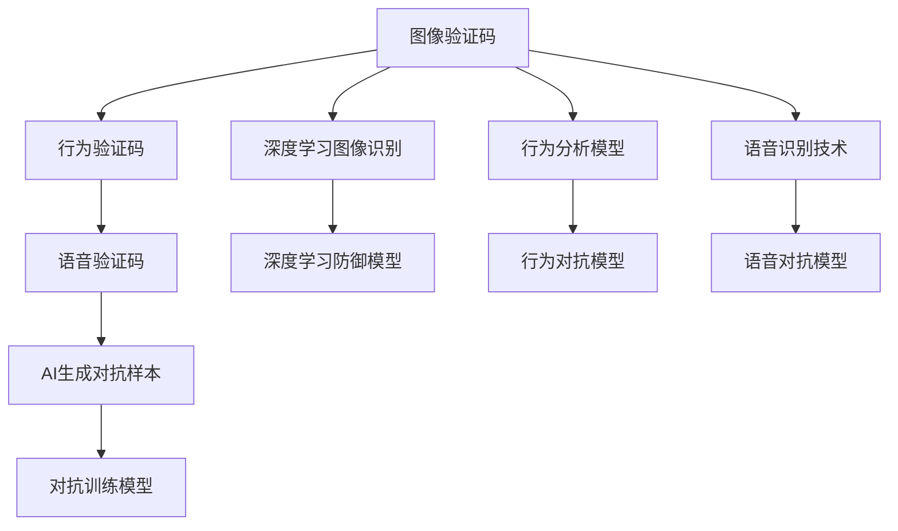

                 

# 验证码的进化：从安全验证到人类计算

> 关键词：验证码, 安全验证, 人类计算, 机器学习, 图像识别, 人工智能

## 1. 背景介绍

### 1.1 问题由来
随着互联网的普及和数字技术的不断进步，用户账号的安全问题日益凸显。为了抵御自动化脚本和钓鱼攻击，网站普遍采用了验证码（CAPTCHA）机制，通过增加对人类用户和自动化脚本处理能力的差异性，保护网站和服务的安全性。

验证码最初的形式主要是图像验证码（Image CAPTCHA），要求用户通过解析一张图片中的扭曲文字或图形来验证身份。这种方法简单有效，但同时也存在诸多局限性，比如只能检测出最基本的图像处理和识别能力，对高级的图像生成和处理攻击（如Deepfakes）无能为力。

为应对这些挑战，近年来，验证码逐渐从简单的图像识别进化到更加复杂的任务，如语音识别、行为验证、AI生成对抗样本（GAN）等，甚至开始探索与人工智能深度融合的新方向。本文将回顾验证码的发展历程，并探讨其从安全验证到人类计算的进化过程。

## 2. 核心概念与联系

### 2.1 核心概念概述

为更好地理解验证码的进化历程，本节将介绍几个密切相关的核心概念：

- **验证码（CAPTCHA）**：一种用于区分人类和自动化脚本的技术。最初用于图像识别，要求用户通过解析图片中的文字或图形来验证身份。
- **图像验证码**：最早期的验证码形式，包含扭曲或变形的文字图片，要求用户准确识别。
- **行为验证码**：通过分析用户的行为特征，如鼠标移动轨迹、点击次数等，来验证用户身份。
- **语音验证码**：要求用户通过语音输入回答特定问题，以证明其人类身份。
- **AI生成对抗样本（GAN）**：利用生成对抗网络生成与真实样本无法区分的虚假样本，用于检测和对抗自动化攻击。
- **人类计算（Human-Computation）**：通过利用人类的自然处理能力，进行复杂计算或识别任务，超越机器学习模型的表现。

这些概念之间的逻辑关系可以通过以下Mermaid流程图来展示：



这个流程图展示了一些关键概念的演变路径：

1. 图像验证码通过改进识别技术，提升防御效果。
2. 行为验证码和语音验证码拓展了验证码的应用场景，增强了用户身份验证的复杂性。
3. 对抗样本生成技术和深度学习防御模型，用于检测和对抗自动化攻击，提升验证码的安全性。
4. 人类计算方法通过利用人类处理能力，在某些情况下超越机器学习模型。

## 3. 核心算法原理 & 具体操作步骤
### 3.1 算法原理概述

验证码的核心目标是区分人类用户和自动化脚本，其验证机制通常包含以下步骤：

1. **特征提取**：提取验证码图片、语音、行为等特征。
2. **模型训练**：基于提取的特征，训练判别模型。
3. **特征验证**：将用户输入的特征与训练模型进行匹配，判断是否为人类。

当前验证码系统主要基于以下两类技术：

1. **深度学习技术**：利用神经网络模型，学习从特征到类别的映射。
2. **行为分析技术**：通过分析用户的行为特征，判断是否符合人类的行为模式。

这些技术通过不断迭代和优化，显著提升了验证码的安全性和实用性。

### 3.2 算法步骤详解

**深度学习技术**的具体步骤包括：

1. **数据采集**：收集大量带有标签的验证码图片、语音或行为数据。
2. **模型训练**：使用深度学习框架（如TensorFlow、PyTorch等）训练分类器，如图像分类器、语音识别器或行为分析器。
3. **验证测试**：在测试集上评估模型的准确率和召回率，调整模型参数以提升性能。
4. **部署应用**：将训练好的模型部署到生产环境中，实时验证用户输入。

**行为分析技术**的具体步骤包括：

1. **特征提取**：提取用户的操作特征，如鼠标移动轨迹、键盘输入速度等。
2. **模型训练**：基于历史行为数据，训练分类器或聚类模型，判断用户行为是否异常。
3. **行为验证**：将用户当前行为特征与模型进行匹配，判断是否为人类。

这两种技术的结合，可以显著提升验证码的防御效果。

### 3.3 算法优缺点

深度学习技术的主要优点包括：

1. **高准确率**：通过大规模数据训练，深度学习模型通常具有较高的识别准确率。
2. **自适应性强**：能够适应不同形式的验证码和多种攻击手段。
3. **自动化部署**：训练好的模型可以方便地部署到生产环境中，无需人工干预。

其缺点包括：

1. **过拟合风险**：大规模数据集和复杂模型容易导致过拟合。
2. **计算资源要求高**：深度学习模型需要大量计算资源进行训练和推理。
3. **对抗攻击脆弱**：复杂的深度学习模型容易受到对抗样本攻击。

行为分析技术的优点包括：

1. **计算资源要求低**：不需要大规模的训练数据和计算资源。
2. **抗对抗攻击**：通过分析用户行为特征，而不是视觉特征，提高了对抗攻击的防御能力。
3. **用户友好**：无需特殊设备或训练，适用于各类用户。

其缺点包括：

1. **准确率有限**：基于行为分析的模型通常无法达到深度学习的准确率水平。
2. **用户隐私问题**：收集和分析用户行为特征可能涉及隐私保护问题。

### 3.4 算法应用领域

验证码技术在多个领域得到了广泛应用：

- **网站登录**：保护网站登录页面的账户安全，防止暴力破解。
- **在线支付**：验证用户身份，防止自动化脚本盗刷。
- **客服系统**：防止机器人自动生成请求，保护客户服务资源。
- **在线游戏**：防止自动化脚本作弊，维护游戏公平性。
- **广告点击**：防止机器人点击广告，保护广告主利益。

此外，验证码技术还广泛应用于金融、电商、社交媒体等场景，成为保障网络安全的重要手段。

## 4. 数学模型和公式 & 详细讲解 & 举例说明（备注：数学公式请使用latex格式，latex嵌入文中独立段落使用 $$，段落内使用 $)
### 4.1 数学模型构建

本节将使用数学语言对验证码的深度学习技术进行更加严格的刻画。

**图像验证码的深度学习模型**：

设验证码图片为 $x \in \mathbb{R}^m$，其类别为 $y \in \{0, 1\}$，其中 $0$ 表示自动化脚本，$1$ 表示人类用户。图像分类器为 $f_{\theta}(x): \mathbb{R}^m \rightarrow \mathbb{R}$，其中 $\theta$ 为模型参数。模型的目标函数为交叉熵损失函数：

$$
\mathcal{L}(\theta) = -\frac{1}{N}\sum_{i=1}^N [y_i \log f_{\theta}(x_i) + (1-y_i) \log (1-f_{\theta}(x_i))]
$$

其中 $N$ 为样本数量，$f_{\theta}(x_i)$ 为模型对第 $i$ 个样本 $x_i$ 的分类结果。

**行为验证码的深度学习模型**：

设用户行为特征为 $x \in \mathbb{R}^n$，其类别为 $y \in \{0, 1\}$。行为分类器为 $f_{\theta}(x): \mathbb{R}^n \rightarrow \mathbb{R}$，其中 $\theta$ 为模型参数。模型的目标函数为交叉熵损失函数：

$$
\mathcal{L}(\theta) = -\frac{1}{N}\sum_{i=1}^N [y_i \log f_{\theta}(x_i) + (1-y_i) \log (1-f_{\theta}(x_i))]
$$

### 4.2 公式推导过程

以下我们以图像验证码为例，推导交叉熵损失函数及其梯度的计算公式。

假设模型 $f_{\theta}$ 在输入 $x$ 上的输出为 $\hat{y}=f_{\theta}(x) \in [0,1]$，表示样本属于自动化脚本的概率。真实标签 $y \in \{0,1\}$。则交叉熵损失函数定义为：

$$
\mathcal{L}(\theta) = -\frac{1}{N}\sum_{i=1}^N [y_i\log \hat{y} + (1-y_i)\log (1-\hat{y})]
$$

将其代入目标函数公式，得：

$$
\mathcal{L}(\theta) = -\frac{1}{N}\sum_{i=1}^N [y_i\log f_{\theta}(x_i)+(1-y_i)\log(1-f_{\theta}(x_i))]
$$

根据链式法则，损失函数对参数 $\theta$ 的梯度为：

$$
\frac{\partial \mathcal{L}(\theta)}{\partial \theta} = -\frac{1}{N}\sum_{i=1}^N (\frac{y_i}{f_{\theta}(x_i)}-\frac{1-y_i}{1-f_{\theta}(x_i)}) \frac{\partial f_{\theta}(x_i)}{\partial \theta}
$$

其中 $\frac{\partial f_{\theta}(x_i)}{\partial \theta}$ 可进一步递归展开，利用自动微分技术完成计算。

### 4.3 案例分析与讲解

以下我们以一个简单的图像验证码识别模型为例，解释其基本原理和实现过程。

假设模型为卷积神经网络（CNN），其结构如下：

```
conv1 -> relu -> max_pool -> conv2 -> relu -> max_pool -> fc -> sigmoid
```

其中 $conv1$ 和 $conv2$ 为卷积层，$relu$ 为激活函数，$max_pool$ 为池化层，$fc$ 为全连接层，$sigmoid$ 为二分类输出函数。

其训练过程包括：

1. **数据预处理**：将验证码图片进行归一化、缩放等预处理。
2. **模型初始化**：随机初始化模型参数 $\theta$。
3. **前向传播**：输入验证码图片，通过网络结构计算输出 $\hat{y}=f_{\theta}(x)$。
4. **计算损失**：将 $\hat{y}$ 与真实标签 $y$ 进行比较，计算交叉熵损失 $\mathcal{L}(\theta)$。
5. **反向传播**：利用梯度下降等优化算法更新模型参数，最小化损失函数。
6. **模型评估**：在测试集上评估模型准确率、召回率等性能指标。

通过不断迭代优化，模型能够学习到从验证码图片到类别的映射关系，从而实现图像验证码的识别。

## 5. 项目实践：代码实例和详细解释说明
### 5.1 开发环境搭建

在进行验证码开发前，我们需要准备好开发环境。以下是使用Python进行TensorFlow开发的环境配置流程：

1. 安装Anaconda：从官网下载并安装Anaconda，用于创建独立的Python环境。

2. 创建并激活虚拟环境：
```bash
conda create -n tf-env python=3.8 
conda activate tf-env
```

3. 安装TensorFlow：根据CUDA版本，从官网获取对应的安装命令。例如：
```bash
conda install tensorflow -c tf
```

4. 安装各类工具包：
```bash
pip install numpy pandas scikit-learn matplotlib tqdm jupyter notebook ipython
```

完成上述步骤后，即可在`tf-env`环境中开始验证码开发。

### 5.2 源代码详细实现

这里我们以一个简单的图像验证码识别模型为例，给出使用TensorFlow实现代码的详细实例。

首先，定义图像验证码的输入和输出：

```python
import tensorflow as tf
from tensorflow.keras import layers

class CaptchaModel(tf.keras.Model):
    def __init__(self):
        super(CaptchaModel, self).__init__()
        self.conv1 = layers.Conv2D(32, (3,3), activation='relu')
        self.pool1 = layers.MaxPooling2D((2,2))
        self.conv2 = layers.Conv2D(64, (3,3), activation='relu')
        self.pool2 = layers.MaxPooling2D((2,2))
        self.fc1 = layers.Dense(128, activation='relu')
        self.fc2 = layers.Dense(2, activation='sigmoid')
    
    def call(self, inputs):
        x = self.conv1(inputs)
        x = self.pool1(x)
        x = self.conv2(x)
        x = self.pool2(x)
        x = tf.reshape(x, (-1, 64 * 7 * 7))
        x = self.fc1(x)
        x = self.fc2(x)
        return x
```

然后，定义训练和评估函数：

```python
from sklearn.model_selection import train_test_split
import numpy as np

# 假设已有训练数据和标签
x_train, y_train, x_test, y_test = train_test_split(x, y, test_size=0.2)

# 构建模型
model = CaptchaModel()

# 定义损失函数和优化器
loss_fn = tf.keras.losses.BinaryCrossentropy()
optimizer = tf.keras.optimizers.Adam()

# 定义训练和评估函数
def train_step(model, x, y):
    with tf.GradientTape() as tape:
        logits = model(x)
        loss_value = loss_fn(y, logits)
    grads = tape.gradient(loss_value, model.trainable_variables)
    optimizer.apply_gradients(zip(grads, model.trainable_variables))
    return loss_value

def evaluate(model, x, y):
    logits = model(x)
    predictions = tf.round(logits)
    accuracy = tf.reduce_mean(tf.cast(tf.equal(predictions, y), tf.float32))
    return accuracy.numpy()
```

最后，启动训练流程并在测试集上评估：

```python
epochs = 10
batch_size = 32

for epoch in range(epochs):
    loss = 0
    for i in range(0, len(x_train), batch_size):
        batch_x = x_train[i:i+batch_size]
        batch_y = y_train[i:i+batch_size]
        loss += train_step(model, batch_x, batch_y)
    print(f"Epoch {epoch+1}, loss: {loss/len(x_train)}")
    
    print(f"Epoch {epoch+1}, test accuracy: {evaluate(model, x_test, y_test)}")
```

以上就是使用TensorFlow实现图像验证码识别模型的完整代码实现。可以看到，TensorFlow提供了丰富的深度学习模型和优化器，使得模型训练和评估变得相对简单。

### 5.3 代码解读与分析

让我们再详细解读一下关键代码的实现细节：

**CaptchaModel类**：
- `__init__`方法：初始化卷积、池化、全连接等层。
- `call`方法：定义模型前向传播的计算过程。

**train_step函数**：
- 使用TensorFlow的GradientTape记录梯度，并使用Adam优化器更新模型参数。
- 计算损失函数并返回。

**evaluate函数**：
- 计算模型在测试集上的准确率。

**训练流程**：
- 定义总的epoch数和批大小，开始循环迭代
- 每个epoch内，循环训练集数据，计算损失并更新参数
- 在测试集上评估模型性能，输出损失和准确率

可以看到，TensorFlow提供了丰富的API，使得深度学习模型的开发变得相对简洁和高效。开发者可以将更多精力放在模型架构设计和超参数调优上，而不必过多关注底层计算细节。

当然，实际应用中还需要考虑更多因素，如模型裁剪、量化加速、模型并行等，以确保模型在生产环境中的高性能和低延迟。

## 6. 实际应用场景
### 6.1 安全验证

验证码技术在安全验证领域得到了广泛应用。网站和应用普遍采用验证码来防止自动化脚本和恶意攻击，保护用户账户安全。例如，电商平台在登录页面、支付页面等关键环节，采用行为验证码或语音验证码，确保用户身份的真实性。

### 6.2 内容生成

验证码技术不仅用于安全验证，还可以用于内容生成。一些网站通过生成复杂的验证码图片，作为AI生成的艺术作品展示。这些图片通常包含了特定的图案和颜色，具有较高的艺术价值，成为了网络艺术的新趋势。

### 6.3 教育和游戏

验证码技术在教育和游戏领域也有新的应用场景。一些在线教育平台采用行为验证码，防止机器人自动答题，确保考试的公平性和公正性。在线游戏则通过行为验证码，防止自动化脚本作弊，维护游戏规则和公平性。

### 6.4 未来应用展望

随着技术的不断进步，验证码技术将从简单的安全验证，拓展到更加复杂的任务。未来可能的趋势包括：

1. **多模态验证码**：结合图像、语音、行为等多种模态信息，提高验证码的识别能力。
2. **自适应验证码**：根据用户的设备和环境，动态生成适合的验证码形式。
3. **隐私保护**：在收集和分析用户行为时，注重隐私保护，避免泄露用户个人信息。
4. **对抗样本防御**：研究对抗样本生成技术，增强验证码对自动化攻击的防御能力。
5. **AI生成艺术**：将验证码技术与AI生成艺术结合，创造出更多具有艺术价值的内容。

这些趋势展示了验证码技术的广阔前景，为未来带来了更多的想象空间。

## 7. 工具和资源推荐
### 7.1 学习资源推荐

为了帮助开发者系统掌握验证码的技术基础和实践技巧，这里推荐一些优质的学习资源：

1. **TensorFlow官方文档**：提供了丰富的教程和示例，覆盖了从入门到高级的各种应用场景。
2. **PyTorch官方文档**：提供了深入浅出的讲解，涵盖了深度学习模型的构建和训练。
3. **深度学习框架比较**：介绍了TensorFlow、PyTorch等主流深度学习框架的特点和优缺点，帮助开发者选择适合自己的工具。
4. **验证码技术论文**：包含大量关于验证码技术和深度学习的论文，展示了最新的研究进展和创新思路。
5. **在线课程**：如Coursera、Udacity等平台的深度学习课程，系统讲解深度学习模型的基本原理和实践技巧。

通过对这些资源的学习实践，相信你一定能够快速掌握验证码的精髓，并用于解决实际的安全验证问题。

### 7.2 开发工具推荐

高效的开发离不开优秀的工具支持。以下是几款用于验证码开发的常用工具：

1. **TensorFlow**：基于Python的开源深度学习框架，提供了丰富的API和优化器，适用于构建和训练深度学习模型。
2. **PyTorch**：另一个基于Python的深度学习框架，具有动态计算图和灵活的API设计，适合快速迭代和研究。
3. **Keras**：提供了高层次的API，简化了深度学习模型的构建过程，适用于初学者和快速开发。
4. **TensorBoard**：TensorFlow配套的可视化工具，实时监测模型训练状态，并提供丰富的图表呈现方式。
5. **OpenCV**：开源计算机视觉库，用于图像处理和计算机视觉任务。

合理利用这些工具，可以显著提升验证码开发和优化的效率，加快创新迭代的步伐。

### 7.3 相关论文推荐

验证码技术的发展源于学界的持续研究。以下是几篇奠基性的相关论文，推荐阅读：

1. **LSTM-based Captcha Recognition**：介绍了一种基于长短期记忆网络（LSTM）的验证码识别方法，显著提升了识别准确率。
2. **Gated LSTM for Captcha Recognition**：提出了一种带有门控机制的LSTM模型，进一步提升了验证码识别的鲁棒性和泛化能力。
3. **Capsule Net for Captcha Recognition**：引入了胶囊网络（CapsNet），增强了模型对验证码中微小细节的感知能力。
4. **Towards Generating Captcha**：探讨了基于GAN的验证码生成方法，能够生成高质量的对抗样本。
5. **Human-Inspired Computational Strategies for Captcha Creation**：介绍了一些受人类启发的新型验证码设计思路，提升了验证码的安全性和趣味性。

这些论文代表了大验证码技术的发展脉络。通过学习这些前沿成果，可以帮助研究者把握学科前进方向，激发更多的创新灵感。

## 8. 总结：未来发展趋势与挑战

### 8.1 总结

本文对验证码从安全验证到人类计算的进化历程进行了全面系统的介绍。首先阐述了验证码的演进背景和重要性，明确了其在保护网站和服务安全方面的独特价值。其次，从原理到实践，详细讲解了验证码的深度学习技术，给出了完整的代码实例。同时，本文还广泛探讨了验证码技术在多个领域的应用前景，展示了验证码技术的广阔前景。

通过本文的系统梳理，可以看到，验证码技术正在从简单的安全验证，拓展到更加复杂的任务。它在保护用户账户安全、防止自动化攻击、增强用户体验等方面，都发挥了重要作用。未来，验证码技术将在多模态、自适应、隐私保护等方面进一步发展，为构建安全、高效、友好的网络环境提供新的可能性。

### 8.2 未来发展趋势

展望未来，验证码技术将呈现以下几个发展趋势：

1. **多模态验证码**：结合图像、语音、行为等多种模态信息，提高验证码的识别能力。
2. **自适应验证码**：根据用户的设备和环境，动态生成适合的验证码形式。
3. **隐私保护**：在收集和分析用户行为时，注重隐私保护，避免泄露用户个人信息。
4. **对抗样本防御**：研究对抗样本生成技术，增强验证码对自动化攻击的防御能力。
5. **AI生成艺术**：将验证码技术与AI生成艺术结合，创造出更多具有艺术价值的内容。

以上趋势凸显了验证码技术的广阔前景，为未来带来了更多的想象空间。

### 8.3 面临的挑战

尽管验证码技术已经取得了一定的成就，但在迈向更加智能化、普适化应用的过程中，它仍面临着诸多挑战：

1. **过拟合风险**：深度学习模型容易受到数据集的过拟合影响，导致识别能力不稳定。
2. **计算资源要求高**：深度学习模型的训练和推理需要大量的计算资源，可能对一些设备和网络环境造成负担。
3. **隐私保护问题**：在收集和分析用户行为时，需要注意隐私保护和数据安全问题。
4. **对抗攻击脆弱**：复杂的深度学习模型容易受到对抗样本攻击，降低验证码的安全性。
5. **用户体验**：验证码的复杂性和繁琐性可能影响用户体验，需要找到合适的平衡点。

这些挑战需要我们不断改进和优化验证码技术，提升其稳定性和安全性，同时确保用户的使用体验。

### 8.4 研究展望

面对验证码技术面临的挑战，未来的研究需要在以下几个方面寻求新的突破：

1. **数据增强技术**：通过数据增强技术，提升模型对各种形式验证码的泛化能力。
2. **对抗样本防御**：研究对抗样本生成技术，增强验证码对自动化攻击的防御能力。
3. **隐私保护技术**：结合差分隐私等技术，保护用户隐私和数据安全。
4. **用户友好的验证码设计**：设计更加简洁、易用的验证码形式，提升用户体验。
5. **AI生成艺术**：结合AI生成技术，创造出更多具有艺术价值的内容，丰富验证码形式。

这些研究方向将有助于提升验证码的安全性和实用性，推动其在更多场景下的应用。

## 9. 附录：常见问题与解答

**Q1：验证码对安全验证有哪些具体效果？**

A: 验证码主要通过增加对人类用户和自动化脚本处理能力的差异性，保护网站和服务的安全性。具体效果包括：
1. 防止暴力破解：要求用户通过解析验证码才能进行下一步操作，增加攻击难度。
2. 防止钓鱼攻击：复杂的验证码难以被脚本自动化，减少恶意链接的传播。
3. 防止机器人自动登录：在登录页面上添加行为验证码，防止脚本机器人自动登录。

**Q2：验证码技术的未来发展方向是什么？**

A: 验证码技术的未来发展方向包括：
1. 多模态验证码：结合图像、语音、行为等多种模态信息，提高验证码的识别能力。
2. 自适应验证码：根据用户的设备和环境，动态生成适合的验证码形式。
3. 隐私保护技术：在收集和分析用户行为时，注重隐私保护和数据安全问题。
4. 对抗样本防御：研究对抗样本生成技术，增强验证码对自动化攻击的防御能力。
5. AI生成艺术：将验证码技术与AI生成艺术结合，创造出更多具有艺术价值的内容。

**Q3：验证码技术在实践中需要注意哪些问题？**

A: 验证码技术在实践中需要注意以下问题：
1. 计算资源：深度学习模型的训练和推理需要大量的计算资源，可能对一些设备和网络环境造成负担。
2. 隐私保护：在收集和分析用户行为时，需要注意隐私保护和数据安全问题。
3. 用户体验：验证码的复杂性和繁琐性可能影响用户体验，需要找到合适的平衡点。
4. 对抗攻击：复杂的深度学习模型容易受到对抗样本攻击，降低验证码的安全性。
5. 识别准确率：深度学习模型容易受到数据集的过拟合影响，导致识别能力不稳定。

正视验证码技术面临的这些挑战，积极应对并寻求突破，将有助于提升验证码的安全性和实用性，推动其在更多场景下的应用。

