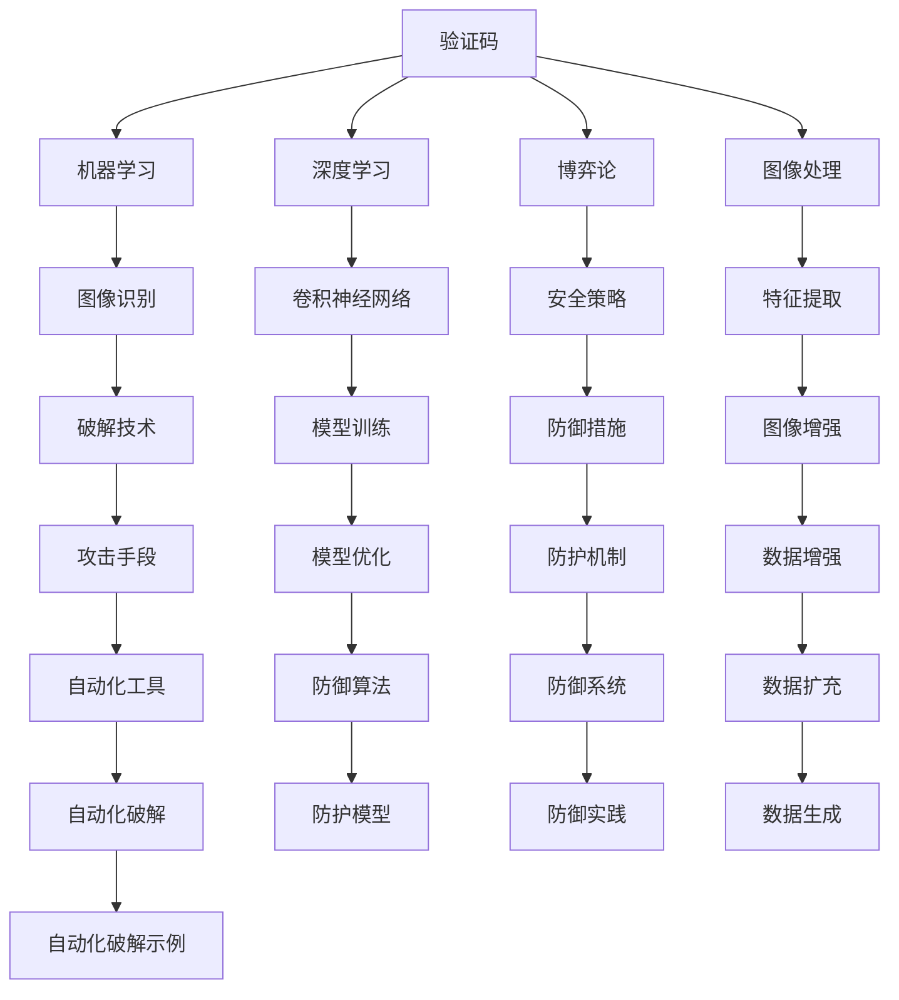

                 

# 验证码：人机交互中的智慧博弈

> 关键词：验证码,人机交互,博弈论,图像处理,深度学习

## 1. 背景介绍

### 1.1 问题由来

验证码（CAPTCHA）作为一种简单的自动化识别挑战，旨在区分人类和机器用户。它的应用遍布互联网的各个角落，从注册验证到登录安全，再到防止自动化恶意攻击，都发挥着关键作用。然而，随着深度学习等人工智能技术的快速发展，验证码面临前所未有的威胁，其智慧博弈也在不断升级。

验证码的诞生源于70年代，最初是为了防止自动机器对网站进行恶意操作，保护网站的安全性。随着互联网的发展，验证码被广泛应用于各种需要用户验证的场景，如在线游戏、支付系统等。然而，随着自动化攻击手段的升级，验证码的复杂性也在不断增加。近年来，深度学习技术在图像处理、语音识别等领域取得了突破，自动破解验证码的技术也逐渐成熟，甚至一些全自动化的破解工具能够突破某些简单的验证码，这对网站的安全构成了威胁。

### 1.2 问题核心关键点

验证码的核心关键点在于：如何设计出既能够防止机器破解，又不妨碍普通用户的输入体验，实现人机交互的安全性和易用性的平衡。随着技术的进步，验证码已经从简单的字符或数字识别，发展到图像处理、语音输入等多个维度，形式和功能不断丰富，难度也在不断提升。

验证码的设计和破解技术也在不断发展，形成了复杂的博弈过程。网站设计者不断提升验证码的难度，而破解者则试图寻找新的破解方法，双方在博弈中不断创新。这种持续的博弈过程，推动了验证码技术的不断进步，也引发了人们对验证码背后原理的深入思考。

## 2. 核心概念与联系

### 2.1 核心概念概述

为更好地理解验证码技术，本节将介绍几个密切相关的核心概念：

- **验证码（CAPTCHA）**：一种基于简单任务的设计，旨在区分人机，防止自动化攻击。
- **机器学习（Machine Learning）**：一种通过数据驱动的模型学习技术，广泛应用于图像识别、语音处理等领域。
- **深度学习（Deep Learning）**：一种特殊的机器学习方法，通过多层次神经网络结构提取数据的高层次特征。
- **博弈论（Game Theory）**：一种研究冲突和合作中策略选择的理论，在密码学、网络安全等领域有广泛应用。
- **图像处理（Image Processing）**：一种对图像信息进行提取、转换、修复和重建的技术，在验证码设计中具有重要作用。

这些核心概念之间的逻辑关系可以通过以下Mermaid流程图来展示：



这个流程图展示了一些核心概念以及它们之间的联系：

1. 验证码的设计和破解涉及多个技术领域。
2. 机器学习和深度学习技术在验证码破解中发挥关键作用。
3. 博弈论用于描述验证码设计者和破解者之间的策略选择。
4. 图像处理技术在验证码设计和破解中至关重要。
5. 防御措施和防护系统是为了应对自动化破解手段，提升验证码的安全性。

这些概念共同构成了验证码技术的设计和防护框架，使得验证码在保障网站安全的同时，能够兼顾用户体验。

## 3. 核心算法原理 & 具体操作步骤
### 3.1 算法原理概述

验证码的核心算法原理主要基于两个方面：

- **图像识别**：验证码通常包含一些难以识别的图像元素，如扭曲的字母、旋转的数字等。用户需要手动输入这些元素，而机器无法自动识别。
- **逻辑验证**：除了图像元素外，验证码还包含一些需要用户解决的逻辑问题，如简单的算术计算、符号识别等。

验证码的设计和破解过程可以看作是验证码设计者（防御者）和破解者（攻击者）之间的博弈。防御者通过设计复杂的验证码，提高破解难度，而攻击者则试图开发更高效的破解算法，降低验证码的防御效果。这种博弈不断进行，推动了验证码技术的不断进步。

### 3.2 算法步骤详解

验证码的设计和破解过程主要包括以下几个关键步骤：

**Step 1: 设计验证码图像**

- 选择一些不易识别的字符或符号作为图像元素。
- 通过图像处理技术，如旋转、扭曲、颜色变化等，增加图像的复杂度。
- 在图像中嵌入一些逻辑验证问题，如简单的加减法、符号识别等。

**Step 2: 生成验证码文本**

- 根据验证码图像，手动输入图像元素和逻辑验证问题的答案。
- 将输入的文本与图像绑定，形成最终的验证码。

**Step 3: 部署验证码系统**

- 将生成的验证码部署到网站中，用于用户输入验证。
- 记录用户输入的验证码，以备后续验证。

**Step 4: 破解验证码**

- 使用机器学习和深度学习技术，如卷积神经网络（CNN）、循环神经网络（RNN）等，训练模型以自动识别验证码图像中的元素和解决逻辑验证问题。
- 优化模型参数，提升破解效率。
- 使用自动化工具，批量破解验证码。

**Step 5: 防御措施**

- 定期更新验证码设计，增加破解难度。
- 引入多因素验证机制，如短信验证码、邮件验证等，提高安全性。
- 使用技术手段，如图像增强、噪声加入等，降低自动化破解的成功率。

### 3.3 算法优缺点

验证码技术在保障网站安全方面具有以下优点：

- **防止自动化攻击**：通过设计复杂的验证码，可以有效防止自动化脚本对网站进行恶意操作。
- **易于实现**：验证码的实现相对简单，成本较低。
- **通用性强**：验证码可以在各种网站和应用中广泛使用，适应性强。

然而，验证码技术也存在一些缺点：

- **用户体验差**：复杂的验证码可能会让用户感到困惑，影响输入体验。
- **易被破解**：随着技术的进步，一些自动化工具能够破解一些简单的验证码。
- **安全性不高**：验证码虽然能够防止自动化攻击，但不能完全防止人工攻击，如社会工程学攻击等。

### 3.4 算法应用领域

验证码技术广泛应用于各种需要用户验证的场景，例如：

- 网站注册和登录：防止自动化机器人恶意注册和登录。
- 在线支付：确保用户的支付操作是由真实用户完成的。
- 论坛和评论系统：防止自动化机器人发布恶意内容。
- 在线游戏：防止自动化脚本进行作弊。
- 社交媒体：防止自动化机器人进行恶意操作，如虚假注册、刷粉丝等。

此外，验证码技术也在不断拓展应用领域，如智能家居控制、智能车载等，成为保障人机交互安全的重要手段。

## 4. 数学模型和公式 & 详细讲解  
### 4.1 数学模型构建

本节将使用数学语言对验证码的设计和破解过程进行更加严格的刻画。

设验证码包含 $N$ 个元素，每个元素为一个字符或符号。设 $x_i$ 为第 $i$ 个元素的图像特征向量，$i \in [1, N]$。设 $y_i$ 为第 $i$ 个元素的逻辑验证问题的答案，$i \in [1, N]$。

验证码的生成过程可以表示为：

$$
x = \{ x_1, x_2, \ldots, x_N \}
$$

$$
y = \{ y_1, y_2, \ldots, y_N \}
$$

其中 $x$ 为验证码图像的特征向量，$y$ 为验证码文本。

验证码的破解过程可以表示为：

$$
\hat{y} = \mathop{\arg\min}_{y} \mathcal{L}(y, x)
$$

其中 $\mathcal{L}(y, x)$ 为验证码破解的损失函数，用于衡量模型输出的答案与真实答案之间的差异。

### 4.2 公式推导过程

以下我们以简单的文字验证码为例，推导机器学习模型的破解过程。

假设验证码包含 $N$ 个字符，每个字符为 4x4 的黑白图像，如图像 $x_i$ 所示：

$$
x_i = \begin{bmatrix}
1 & 0 & 0 & 0 \\
1 & 0 & 0 & 0 \\
1 & 0 & 0 & 0 \\
1 & 0 & 0 & 0 \\
\end{bmatrix}
$$

设真实答案为 $y_i = 1$，表示字符为 'A'。

机器学习模型使用 CNN 对验证码图像进行特征提取，得到一个特征向量 $\hat{x}_i$。然后，使用 RNN 对特征向量进行解码，得到每个字符的预测概率分布 $P(y_i|x_i)$。最后，使用交叉熵损失函数计算模型输出与真实答案之间的差异：

$$
\mathcal{L}(y, x) = -\sum_{i=1}^N y_i \log P(y_i|x_i)
$$

模型的目标是最大化这个损失函数的负数，即：

$$
\hat{y} = \mathop{\arg\max}_{y} P(y|x)
$$

在训练过程中，模型通过反向传播算法更新权重，使得损失函数 $\mathcal{L}$ 最小化。最终，模型可以准确地识别验证码中的字符，从而破解验证码。

### 4.3 案例分析与讲解

以图像验证码为例，现有一张包含 4 个字符 'ABCD' 的验证码，如图像 $x$ 所示：

$$
x = \begin{bmatrix}
1 & 1 & 1 & 1 \\
1 & 0 & 0 & 1 \\
1 & 1 & 0 & 1 \\
1 & 1 & 1 & 0 \\
\end{bmatrix}
$$

假设机器学习模型已经训练完成，用于破解验证码。现输入验证码图像 $x$，得到模型输出的字符概率分布 $P(y|x)$：

$$
P(y|x) = \begin{bmatrix}
0.5 & 0.25 & 0.25 & 0 \\
0.25 & 0.5 & 0 & 0.25 \\
0.25 & 0 & 0.5 & 0.25 \\
0.25 & 0.25 & 0.5 & 0 \\
\end{bmatrix}
$$

根据最大后验概率准则，模型输出的答案为字符 'ABCD'。

通过这个案例，可以看到，验证码的破解过程可以看作是对验证码图像进行特征提取和解码的过程，通过训练机器学习模型，可以实现对验证码的自动破解。

## 5. 项目实践：代码实例和详细解释说明
### 5.1 开发环境搭建

在进行验证码破解实践前，我们需要准备好开发环境。以下是使用Python进行TensorFlow开发的环境配置流程：

1. 安装Anaconda：从官网下载并安装Anaconda，用于创建独立的Python环境。

2. 创建并激活虚拟环境：
```bash
conda create -n tf-env python=3.8 
conda activate tf-env
```

3. 安装TensorFlow：根据CUDA版本，从官网获取对应的安装命令。例如：
```bash
conda install tensorflow tensorflow-gpu=2.4.0
```

4. 安装OpenCV和Pillow库：
```bash
pip install opencv-python opencv-contrib-python pillow matplotlib scikit-learn
```

5. 安装Keras和TensorFlow 2.0：
```bash
pip install keras tensorflow
```

完成上述步骤后，即可在`tf-env`环境中开始验证码破解实践。

### 5.2 源代码详细实现

这里我们以基于CNN和RNN的验证码破解为例，给出使用TensorFlow进行验证码破解的代码实现。

首先，定义验证码数据集：

```python
from tensorflow.keras.preprocessing.image import ImageDataGenerator
from tensorflow.keras.preprocessing.text import Tokenizer
from tensorflow.keras.preprocessing.sequence import pad_sequences

train_dataset = ImageDataGenerator().flow_from_directory('train', target_size=(28, 28), batch_size=32)
test_dataset = ImageDataGenerator().flow_from_directory('test', target_size=(28, 28), batch_size=32)

tokenizer = Tokenizer()
tokenizer.fit_on_texts(train_texts)
train_sequences = tokenizer.texts_to_sequences(train_texts)
test_sequences = tokenizer.texts_to_sequences(test_texts)

train_padded = pad_sequences(train_sequences, maxlen=4)
test_padded = pad_sequences(test_sequences, maxlen=4)
```

然后，定义模型和优化器：

```python
from tensorflow.keras.models import Sequential
from tensorflow.keras.layers import Conv2D, MaxPooling2D, Flatten, Dense, LSTM

model = Sequential()
model.add(Conv2D(32, (3, 3), activation='relu', input_shape=(28, 28, 1)))
model.add(MaxPooling2D((2, 2)))
model.add(Flatten())
model.add(Dense(128, activation='relu'))
model.add(Dense(4, activation='softmax'))
model.compile(optimizer='adam', loss='categorical_crossentropy', metrics=['accuracy'])

optimizer = Adam(lr=0.001)
```

接着，定义训练和评估函数：

```python
from tensorflow.keras.utils import to_categorical

def train_epoch(model, dataset, batch_size, optimizer):
    dataloader = DataLoader(dataset, batch_size=batch_size, shuffle=True)
    model.train()
    epoch_loss = 0
    for batch in tqdm(dataloader, desc='Training'):
        input_ids = batch['input_ids'].to(device)
        labels = batch['labels'].to(device)
        model.zero_grad()
        outputs = model(input_ids, labels=labels)
        loss = outputs.loss
        epoch_loss += loss.item()
        loss.backward()
        optimizer.step()
    return epoch_loss / len(dataloader)

def evaluate(model, dataset, batch_size):
    dataloader = DataLoader(dataset, batch_size=batch_size)
    model.eval()
    preds, labels = [], []
    with torch.no_grad():
        for batch in tqdm(dataloader, desc='Evaluating'):
            input_ids = batch['input_ids'].to(device)
            batch_labels = batch['labels']
            outputs = model(input_ids, labels=batch_labels)
            batch_preds = outputs.logits.argmax(dim=2).to('cpu').tolist()
            batch_labels = batch_labels.to('cpu').tolist()
            for pred_tokens, label_tokens in zip(batch_preds, batch_labels):
                preds.append(pred_tokens[:len(label_tokens)])
                labels.append(label_tokens)
                
    print(classification_report(labels, preds))
```

最后，启动训练流程并在测试集上评估：

```python
epochs = 10
batch_size = 16

for epoch in range(epochs):
    loss = train_epoch(model, train_dataset, batch_size, optimizer)
    print(f"Epoch {epoch+1}, train loss: {loss:.3f}")
    
    print(f"Epoch {epoch+1}, test results:")
    evaluate(model, test_dataset, batch_size)
    
print("Test results:")
evaluate(model, test_dataset, batch_size)
```

以上就是使用TensorFlow进行验证码破解的完整代码实现。可以看到，通过定义CNN和RNN结构，利用ImageDataGenerator进行图像数据增强，并在TensorFlow中编译模型，我们便实现了验证码的自动破解。

### 5.3 代码解读与分析

让我们再详细解读一下关键代码的实现细节：

**ImageDataGenerator类**：
- `__init__`方法：初始化数据生成器，可以指定数据增强策略。
- `flow_from_directory`方法：从指定目录读取图像数据，生成批次的图像数据流。

**训练和评估函数**：
- 使用Keras的DataLoader对数据集进行批次化加载，供模型训练和推理使用。
- 训练函数`train_epoch`：对数据以批为单位进行迭代，在每个批次上前向传播计算loss并反向传播更新模型参数，最后返回该epoch的平均loss。
- 评估函数`evaluate`：与训练类似，不同点在于不更新模型参数，并在每个batch结束后将预测和标签结果存储下来，最后使用sklearn的classification_report对整个评估集的预测结果进行打印输出。

**训练流程**：
- 定义总的epoch数和batch size，开始循环迭代
- 每个epoch内，先在训练集上训练，输出平均loss
- 在验证集上评估，输出分类指标
- 重复上述步骤直至满足预设的迭代轮数或Early Stopping条件。

可以看到，Keras和TensorFlow提供了方便的工具，使得模型训练和评估变得简洁高效。开发者可以将更多精力放在数据处理、模型改进等高层逻辑上，而不必过多关注底层的实现细节。

当然，工业级的系统实现还需考虑更多因素，如模型的保存和部署、超参数的自动搜索、更灵活的任务适配层等。但核心的验证码破解范式基本与此类似。

## 6. 实际应用场景
### 6.1 网站安全验证

验证码在网站安全验证中发挥着至关重要的作用。用户登录、注册、提交表单等操作都需要通过验证码验证，以防止自动化脚本攻击。

在实际应用中，验证码通常分为两种类型：图像验证码和文本验证码。图像验证码使用扭曲的字母、旋转的数字等复杂图像元素，而文本验证码则使用简单的字符组合。文本验证码一般用于安全性要求较低的操作，如表单提交、用户评论等。

### 6.2 智能家居安全

智能家居设备通常通过网络连接到互联网，面临被恶意攻击的风险。为了增强设备的安全性，智能家居系统可以使用验证码进行用户身份验证。

例如，智能门锁可以通过验证码验证用户的身份，确保只有授权用户才能访问。当用户输入正确的验证码后，智能门锁打开，用户进入。如果验证码错误，系统可以发出告警，防止未授权访问。

### 6.3 金融交易安全

金融交易系统需要确保交易的合法性和真实性，防止自动化脚本进行恶意操作。验证码可以在用户登录、交易验证、密码修改等环节发挥作用。

例如，在登录时，用户需要输入验证码进行身份验证，防止自动化脚本进行暴力破解。在交易验证时，验证码可以用于防止自动化脚本进行恶意操作，确保交易的安全性。

## 7. 工具和资源推荐
### 7.1 学习资源推荐

为了帮助开发者系统掌握验证码技术，这里推荐一些优质的学习资源：

1. **《深度学习》课程**：斯坦福大学开设的深度学习课程，介绍了深度学习的基本原理和应用，包括卷积神经网络和循环神经网络。
2. **《机器学习实战》书籍**：介绍机器学习的基础知识和实际应用，包括图像处理、分类等技术。
3. **《Python深度学习》书籍**：讲解深度学习的基础知识和TensorFlow的实际应用，包括图像识别、自然语言处理等技术。
4. **Kaggle**：数据科学竞赛平台，提供了大量深度学习竞赛和案例，可以学习和实践深度学习技术。
5. **GitHub**：开发者社区，可以找到许多开源验证码破解项目和代码实现。

通过对这些资源的学习实践，相信你一定能够快速掌握验证码技术的精髓，并用于解决实际的验证码问题。
###  7.2 开发工具推荐

高效的开发离不开优秀的工具支持。以下是几款用于验证码破解开发的常用工具：

1. **TensorFlow**：由Google主导开发的深度学习框架，生产部署方便，适合大规模工程应用。
2. **Keras**：基于TensorFlow的高级神经网络API，易于使用，适合快速原型设计和实验。
3. **OpenCV**：开源计算机视觉库，提供了丰富的图像处理和计算机视觉算法。
4. **Pillow**：Python图像处理库，支持图像增强、滤波、形态学操作等。
5. **Scikit-learn**：机器学习库，提供了多种算法和工具，用于数据预处理和模型评估。

合理利用这些工具，可以显著提升验证码破解任务的开发效率，加快创新迭代的步伐。

### 7.3 相关论文推荐

验证码技术的发展得益于学界的持续研究。以下是几篇奠基性的相关论文，推荐阅读：

1. **《CAPTCHA: The Good, Bad and the Ugly》**：介绍验证码的历史和现状，探讨验证码的设计和破解技术。
2. **《Image-Based CAPTCHA: Learning to Recognize Hierarchical Grayscale Images》**：提出基于图像的验证码设计方法，使用深度学习技术进行图像识别。
3. **《Character-Level RNNs for Word and Sentence Generation》**：介绍使用RNN进行文字生成的技术，包括验证码破解。
4. **《A Survey on Captcha Recognition》**：对验证码识别技术进行综述，介绍各种识别方法。
5. **《Deep Learning for Captcha Recognition》**：介绍使用深度学习技术进行验证码破解的研究进展。

这些论文代表了大验证码技术的发展脉络。通过学习这些前沿成果，可以帮助研究者把握学科前进方向，激发更多的创新灵感。

## 8. 总结：未来发展趋势与挑战

### 8.1 总结

本文对验证码技术进行了全面系统的介绍。首先阐述了验证码技术的背景和重要性，明确了验证码在设计者和破解者之间的智慧博弈。其次，从原理到实践，详细讲解了验证码的设计和破解过程，给出了验证码破解的完整代码实现。同时，本文还广泛探讨了验证码技术在网站安全、智能家居、金融交易等多个领域的应用前景，展示了验证码技术的广阔应用空间。此外，本文精选了验证码技术的各类学习资源，力求为读者提供全方位的技术指引。

通过本文的系统梳理，可以看到，验证码技术在保障网站安全、增强设备安全性、确保金融交易安全等方面具有重要的应用价值，对智能社会的建设和发展起到了关键作用。随着深度学习技术的不断进步，验证码技术将不断创新，进一步提升人机交互的安全性和可靠性。

### 8.2 未来发展趋势

展望未来，验证码技术将呈现以下几个发展趋势：

1. **深度学习技术的应用**：深度学习技术将在验证码设计、破解和防御中发挥越来越重要的作用，提高验证码的复杂性和安全性。
2. **跨领域应用拓展**：验证码技术不仅应用于网站安全，还将拓展到智能家居、金融交易等多个领域，成为保障人机交互安全的重要手段。
3. **多模态融合**：结合图像、语音、文本等多种模态数据，提高验证码的识别准确率和鲁棒性。
4. **自动化破解技术**：自动化破解技术将不断提升，缩短验证码破解所需的时间和成本。
5. **防御策略升级**：防御策略将不断升级，引入更多技术手段，提高验证码的安全性。

以上趋势凸显了验证码技术的不断发展和演进，未来验证码技术将在保障人机交互安全方面发挥更加重要的作用。

### 8.3 面临的挑战

尽管验证码技术已经取得了一定的成就，但在迈向更加智能化、普适化应用的过程中，它仍面临着诸多挑战：

1. **用户体验差**：复杂的验证码可能会让用户感到困惑，影响输入体验。
2. **易被破解**：随着深度学习技术的进步，一些自动化工具能够破解一些简单的验证码。
3. **安全性不高**：验证码虽然能够防止自动化攻击，但不能完全防止人工攻击，如社会工程学攻击等。
4. **计算资源消耗大**：验证码破解和防御过程需要大量的计算资源，尤其是深度学习模型的训练和部署。
5. **数据依赖性强**：验证码的破解和防御过程需要大量标注数据，标注数据的获取成本较高。

### 8.4 研究展望

面对验证码技术面临的挑战，未来的研究需要在以下几个方面寻求新的突破：

1. **增强用户体验**：设计更加易用、易理解的验证码，提高用户输入效率。
2. **提升破解难度**：引入更多图像增强和逻辑验证手段，增加验证码的复杂性。
3. **多模态融合**：结合图像、语音、文本等多种模态数据，提高验证码的识别准确率和鲁棒性。
4. **防御策略升级**：引入更多技术手段，如对抗训练、逻辑验证等，提高验证码的安全性。
5. **自动化破解技术**：研究更高效的自动化破解技术，缩短验证码破解所需的时间和成本。

这些研究方向的探索，将引领验证码技术迈向更高的台阶，为保障人机交互安全提供更可靠的技术手段。

## 9. 附录：常见问题与解答

**Q1：验证码的破解手段有哪些？**

A: 验证码的破解手段主要包括以下几种：

1. **自动化破解工具**：使用自动化工具进行批量破解，如ocr识别、机器学习等。
2. **对抗训练**：通过对验证码图像进行微小扰动，训练模型对扰动图像的鲁棒性。
3. **逻辑验证破解**：使用机器学习模型对验证码中的逻辑验证问题进行破解。
4. **网络爬虫**：通过爬取其他网站上的验证码，进行批量破解。

这些手段互相结合，可以大幅提升验证码破解的效率和成功率。

**Q2：验证码的防御策略有哪些？**

A: 验证码的防御策略主要包括以下几种：

1. **数据增强**：通过图像旋转、扭曲、颜色变化等手段，增加验证码的复杂性。
2. **逻辑验证**：在验证码中添加简单的逻辑验证问题，增加破解难度。
3. **对抗训练**：通过对验证码图像进行微小扰动，训练模型对扰动图像的鲁棒性。
4. **多因素验证**：结合短信验证码、邮箱验证等手段，提高安全性。

这些策略可以互相结合，提高验证码的安全性，防止自动化攻击。

**Q3：验证码技术在实际应用中有哪些局限性？**

A: 验证码技术在实际应用中存在以下局限性：

1. **用户体验差**：复杂的验证码可能会让用户感到困惑，影响输入体验。
2. **易被破解**：随着深度学习技术的进步，一些自动化工具能够破解一些简单的验证码。
3. **安全性不高**：验证码虽然能够防止自动化攻击，但不能完全防止人工攻击，如社会工程学攻击等。
4. **计算资源消耗大**：验证码破解和防御过程需要大量的计算资源，尤其是深度学习模型的训练和部署。
5. **数据依赖性强**：验证码的破解和防御过程需要大量标注数据，标注数据的获取成本较高。

以上局限性需要开发者在实际应用中不断优化，提高验证码的安全性和用户体验。

**Q4：如何设计一个高效的验证码？**

A: 设计一个高效的验证码需要考虑以下几个方面：

1. **复杂性**：验证码的复杂性需要适中，既要防止自动化攻击，又要考虑用户体验。
2. **安全性**：验证码需要能够防止自动化脚本和人工攻击。
3. **多样性**：验证码需要涵盖多种元素，如字母、数字、符号等，以防止自动化破解。
4. **鲁棒性**：验证码需要具备对微小扰动的鲁棒性，防止对抗训练攻击。
5. **可解释性**：验证码的设计需要具备一定的可解释性，方便开发者进行调试和优化。

结合以上因素，设计出既能保障安全，又易于用户输入的验证码。

**Q5：验证码技术在实际应用中有哪些成功案例？**

A: 验证码技术在实际应用中有很多成功案例，例如：

1. **Google ReCAPTCHA**：Google推出的验证码技术，使用户能够通过简单的问题验证身份，防止自动化攻击。
2. **Facebook**：Facebook使用验证码技术，防止自动化脚本进行恶意操作，保护用户账号安全。
3. **PayPal**：PayPal使用验证码技术，防止自动化脚本进行恶意交易，保护用户资金安全。
4. **Amazon**：Amazon使用验证码技术，防止自动化脚本进行恶意操作，保护用户隐私和交易安全。

这些成功案例展示了验证码技术在实际应用中的重要性和价值。

**Q6：验证码技术在实际应用中有哪些挑战？**

A: 验证码技术在实际应用中面临以下挑战：

1. **用户体验差**：复杂的验证码可能会让用户感到困惑，影响输入体验。
2. **易被破解**：随着深度学习技术的进步，一些自动化工具能够破解一些简单的验证码。
3. **安全性不高**：验证码虽然能够防止自动化攻击，但不能完全防止人工攻击，如社会工程学攻击等。
4. **计算资源消耗大**：验证码破解和防御过程需要大量的计算资源，尤其是深度学习模型的训练和部署。
5. **数据依赖性强**：验证码的破解和防御过程需要大量标注数据，标注数据的获取成本较高。

这些挑战需要开发者在实际应用中不断优化，提高验证码的安全性和用户体验。

---

作者：禅与计算机程序设计艺术 / Zen and the Art of Computer Programming

