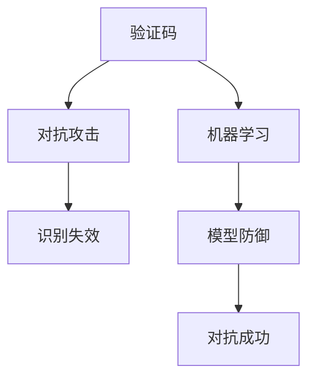

                 

# 验证码：人类智慧与机器学习的博弈

> 关键词：验证码,机器学习,博弈论,对抗攻击,人工智能,安全

## 1. 背景介绍

随着互联网的普及和信息技术的不断发展，在线服务和数字化应用越来越广泛，随之而来的是信息安全的严峻挑战。特别是针对线上用户的身份认证和隐私保护，提出了验证码（Captcha）这一机制。验证码是一种自动区分计算机和人类用户的交互验证手段，其核心思想是通过解决某些特定难题，验证用户是否为真实人类。

验证码最早诞生于1993年，由卡内基梅隆大学的Luis Von Ahn和Marcus Rahtz等人提出，用于解决自动化爬虫对在线服务的滥用问题。随着计算机视觉、自然语言处理等技术的进步，验证码的设计也在不断演进，从最初的数字识别，发展到现在复杂的多媒体挑战，如图片文字识别、语音输入验证、行为分析等，形成了广阔的应用场景。

近年来，随着人工智能（AI）技术的快速发展，特别是深度学习在图像、语音等领域的应用，机器学习已经能够有效应对各种验证码的挑战。这一方面提升了用户体验，另一方面也带来了新的安全威胁。

## 2. 核心概念与联系

### 2.1 核心概念概述

为更好地理解验证码背后的博弈逻辑，本节将介绍几个密切相关的核心概念：

- **验证码（Captcha）**：一种基于图灵测试的在线验证机制，通过解决特定难题（如图像识别、文字输入等）来验证用户身份。

- **对抗攻击（Adversarial Attacks）**：指恶意用户通过小扰动或特定输入，使机器学习模型输出错误结果的攻击方式。对抗攻击可以影响验证码的效果，使机器学习模型能够轻易突破防线。

- **博弈论（Game Theory）**：研究人类或系统在竞争和合作中，如何决策以达成最优策略的理论。验证码的对抗攻击和防御机制，可以看作是机器学习与人类智慧之间的一种博弈。

- **人工智能（AI）**：指由计算机模拟、延伸和扩展人类智能的技术体系。验证码作为AI的一种应用，是测试和提升模型能力的工具。

这些核心概念之间的逻辑关系可以通过以下Mermaid流程图来展示：



这个流程图展示验证码与机器学习、对抗攻击之间的联系，揭示了机器学习与人类智慧在验证码对抗中的博弈关系。

## 3. 核心算法原理 & 具体操作步骤
### 3.1 算法原理概述

验证码的防御机制本质上是一种机器学习的训练和应用过程。其核心思想是，通过大规模数据集训练一个识别模型，使其能够在特定难题上优于恶意攻击者。一旦模型训练完毕，它就会被部署在服务器端，用于验证用户身份。恶意用户为了破解验证码，会尝试对输入进行各种扰动和变形，希望模型产生错误的判断。

从博弈论的角度来看，验证码的防御机制可以看作是在一个“零和博弈”（Zero-Sum Game）中，防御者（服务器）和攻击者（恶意用户）之间的对抗。防御者希望保护服务器不受攻击，而攻击者则希望尽可能多地破解验证码，获取不正当利益。

### 3.2 算法步骤详解

基于机器学习的验证码防御机制一般包括以下几个关键步骤：

**Step 1: 数据收集与标注**
- 收集大量的真实用户和攻击者的输入数据，标注数据集。通常需要标注正常用户的行为样本和恶意攻击者的扰动样本。

**Step 2: 模型训练与验证**
- 使用标注好的数据集，训练一个深度学习模型。可以使用卷积神经网络（CNN）、循环神经网络（RNN）或Transformer等架构。
- 在训练过程中，需要选择合适的损失函数、优化器、超参数等，并通过验证集评估模型的性能。

**Step 3: 模型部署与对抗测试**
- 将训练好的模型部署到服务器上，用于实时验证用户输入。
- 定期对部署的模型进行对抗测试，检查其对不同攻击方式的鲁棒性。

**Step 4: 防御策略调整**
- 根据对抗测试结果，调整防御策略，如修改模型结构、增加扰动样本等，以提升模型的防御能力。

**Step 5: 用户反馈与优化**
- 收集用户反馈，调整验证码的难度和形式，确保用户体验的同时，保持模型的高效防御。

### 3.3 算法优缺点

基于机器学习的验证码防御机制具有以下优点：
1. 自动化高效：使用机器学习自动处理大量的输入数据，速度快、准确率高。
2. 鲁棒性强：深度学习模型通常具有良好的泛化能力，能够抵抗不同类型的攻击。
3. 灵活可调整：通过调整模型结构和超参数，可以针对特定类型的攻击进行优化。

但同时也存在一些缺点：
1. 需要大量标注数据：模型训练需要大量标注数据，数据收集和标注成本高。
2. 模型复杂度高：深度学习模型通常参数量大、计算复杂，部署和维护成本高。
3. 对抗攻击风险：深度学习模型可能存在对抗攻击风险，攻击者可以设计特定的扰动输入，使得模型产生错误判断。
4. 可解释性不足：深度学习模型通常被视为“黑盒”，难以解释其内部工作机制，对攻击者构成信息不对称。

尽管存在这些局限性，但基于机器学习的验证码防御机制仍然是目前的主流方式，被广泛应用于各大在线服务中。未来相关研究将集中在如何进一步提升模型的鲁棒性和安全性，同时降低训练和部署成本。

### 3.4 算法应用领域

基于机器学习的验证码防御机制在多个领域得到了广泛应用，例如：

- 在线购物平台：通过验证码验证用户身份，防止恶意自动化脚本进行商品刷单、恶意评价等行为。
- 在线金融服务：验证用户身份，防止机器人进行欺诈行为，如恶意转账、自动化钓鱼等。
- 社交媒体平台：验证用户身份，防止机器人进行虚假账号创建、恶意评论等行为。
- 企业内部系统：验证员工身份，防止自动化脚本进行数据盗取、恶意操作等行为。

除了上述这些常见应用外，验证码防御机制还被创新性地应用于更多的场景中，如自动驾驶、智能家居等，为信息安全提供了重要的技术保障。

## 4. 数学模型和公式 & 详细讲解  
### 4.1 数学模型构建

为了更准确地理解验证码防御机制，本节将使用数学语言对防御机制的训练和应用过程进行描述。

假设训练集为 $D=\{(x_i,y_i)\}_{i=1}^N$，其中 $x_i$ 为输入样本，$y_i$ 为标签。通常情况下，$y_i$ 表示输入是否为正常用户（1表示正常，0表示异常）。目标是训练一个二分类模型 $M_{\theta}$，使其在给定输入 $x$ 的情况下，输出正常用户概率 $\hat{y}=M_{\theta}(x)$。

模型的训练过程可以表示为：

$$
\theta^* = \mathop{\arg\min}_{\theta} \mathcal{L}(M_{\theta},D)
$$

其中 $\mathcal{L}$ 为损失函数，通常使用交叉熵损失或softmax损失。训练的目标是最小化损失函数，使得模型在输入 $x$ 上的输出 $\hat{y}$ 逼近真实标签 $y$。

### 4.2 公式推导过程

以交叉熵损失为例，假设模型 $M_{\theta}$ 在输入 $x$ 上的输出为 $\hat{y}=M_{\theta}(x)$，真实标签为 $y$。则交叉熵损失函数为：

$$
\ell(M_{\theta}(x),y) = -y\log \hat{y} - (1-y)\log(1-\hat{y})
$$

将其代入经验风险公式，得：

$$
\mathcal{L}(\theta) = -\frac{1}{N}\sum_{i=1}^N [y_i\log M_{\theta}(x_i)+(1-y_i)\log(1-M_{\theta}(x_i))]
$$

在得到损失函数梯度后，即可带入参数更新公式，完成模型的迭代优化。

### 4.3 案例分析与讲解

以图像验证码为例，假设训练集为 $D=\{(x_i,y_i)\}_{i=1}^N$，其中 $x_i$ 为输入图像，$y_i$ 为标签。模型 $M_{\theta}$ 为卷积神经网络（CNN），输出为正常用户概率 $\hat{y}=M_{\theta}(x)$。

假设使用交叉熵损失，则损失函数为：

$$
\mathcal{L}(\theta) = -\frac{1}{N}\sum_{i=1}^N [y_i\log M_{\theta}(x_i)+(1-y_i)\log(1-M_{\theta}(x_i))]
$$

假设模型结构为卷积层、池化层和全连接层的组合，使用Adam优化器进行训练，学习率为 $0.001$。训练过程中，每轮迭代使用 $32$ 个样本，训练 $10$ 个epoch。

在实际训练时，需要将训练集和验证集分别加载到模型中进行训练和验证。可以使用PyTorch等深度学习框架实现模型的训练和验证过程。

```python
import torch
import torch.nn as nn
import torch.optim as optim

# 定义模型
class CNN(nn.Module):
    def __init__(self):
        super(CNN, self).__init__()
        self.conv1 = nn.Conv2d(1, 32, 3)
        self.pool = nn.MaxPool2d(2)
        self.fc1 = nn.Linear(32 * 6 * 6, 256)
        self.fc2 = nn.Linear(256, 2)

    def forward(self, x):
        x = self.pool(torch.relu(self.conv1(x)))
        x = x.view(-1, 32 * 6 * 6)
        x = torch.relu(self.fc1(x))
        x = torch.sigmoid(self.fc2(x))
        return x

# 定义损失函数和优化器
criterion = nn.BCELoss()
optimizer = optim.Adam(model.parameters(), lr=0.001)

# 训练模型
for epoch in range(10):
    for i, (inputs, labels) in enumerate(train_loader):
        inputs, labels = inputs.to(device), labels.to(device)
        optimizer.zero_grad()
        outputs = model(inputs)
        loss = criterion(outputs, labels)
        loss.backward()
        optimizer.step()

    # 验证模型
    with torch.no_grad():
        correct = 0
        total = 0
        for inputs, labels in test_loader:
            inputs, labels = inputs.to(device), labels.to(device)
            outputs = model(inputs)
            _, predicted = torch.max(outputs.data, 1)
            total += labels.size(0)
            correct += (predicted == labels).sum().item()

        print('Epoch [%d/%d], Loss: %.4f, Accuracy: %.2f%%' % (epoch+1, 10, loss.item(), 100 * correct / total))
```

在训练过程中，模型会根据训练集的数据不断调整参数，使模型输出尽可能接近真实标签。当模型在验证集上表现不佳时，可以调整模型结构、增加训练样本等策略，进一步优化模型性能。

## 5. 项目实践：代码实例和详细解释说明
### 5.1 开发环境搭建

在进行验证码防御机制的开发前，我们需要准备好开发环境。以下是使用Python进行TensorFlow开发的环境配置流程：

1. 安装Anaconda：从官网下载并安装Anaconda，用于创建独立的Python环境。

2. 创建并激活虚拟环境：
```bash
conda create -n tf-env python=3.8 
conda activate tf-env
```

3. 安装TensorFlow：根据CUDA版本，从官网获取对应的安装命令。例如：
```bash
conda install tensorflow -c tf -c conda-forge
```

4. 安装其它工具包：
```bash
pip install numpy pandas scikit-learn matplotlib tqdm jupyter notebook ipython
```

完成上述步骤后，即可在`tf-env`环境中开始项目实践。

### 5.2 源代码详细实现

下面我们以图像验证码为例，给出使用TensorFlow对CNN模型进行训练的代码实现。

首先，定义图像验证码的输入和输出：

```python
import tensorflow as tf
from tensorflow.keras.layers import Conv2D, MaxPooling2D, Flatten, Dense
from tensorflow.keras import Model

# 定义模型
class CNN(tf.keras.Model):
    def __init__(self):
        super(CNN, self).__init__()
        self.conv1 = Conv2D(32, 3, activation='relu')
        self.pool = MaxPooling2D(2)
        self.fc1 = Dense(256, activation='relu')
        self.fc2 = Dense(2, activation='sigmoid')

    def call(self, inputs):
        x = self.conv1(inputs)
        x = self.pool(x)
        x = x.reshape((-1, 32 * 6 * 6))
        x = self.fc1(x)
        x = self.fc2(x)
        return x

# 定义模型输入和输出
model = CNN()
inputs = tf.keras.layers.Input(shape=(28, 28, 1))
outputs = model(inputs)

# 定义损失函数和优化器
loss = tf.keras.losses.BCEFromLogits
optimizer = tf.keras.optimizers.Adam()

# 编译模型
model.compile(optimizer=optimizer, loss=loss, metrics=['accuracy'])

# 加载数据集
(x_train, y_train), (x_test, y_test) = tf.keras.datasets.mnist.load_data()
x_train = x_train.reshape(-1, 28, 28, 1) / 255.0
x_test = x_test.reshape(-1, 28, 28, 1) / 255.0
```

然后，定义训练和评估函数：

```python
def train_epoch(model, dataset, batch_size, optimizer):
    for batch in dataset:
        x, y = batch
        with tf.GradientTape() as tape:
            logits = model(x, training=True)
            loss = loss(y, logits)
        gradients = tape.gradient(loss, model.trainable_variables)
        optimizer.apply_gradients(zip(gradients, model.trainable_variables))
    return loss

def evaluate(model, dataset, batch_size):
    correct = 0
    total = 0
    for batch in dataset:
        x, y = batch
        logits = model(x, training=False)
        predicted = tf.argmax(logits, axis=1)
        total += y.shape[0]
        correct += tf.reduce_sum(tf.cast(predicted == y, dtype=tf.int32))
    return correct / total
```

最后，启动训练流程并在测试集上评估：

```python
epochs = 10
batch_size = 32

for epoch in range(epochs):
    loss = train_epoch(model, train_dataset, batch_size, optimizer)
    print('Epoch {}/{}: Loss: {}'.format(epoch+1, epochs, loss))

    test_loss = evaluate(model, test_dataset, batch_size)
    print('Test Loss: {}'.format(test_loss))
```

以上就是使用TensorFlow对CNN模型进行图像验证码训练的完整代码实现。可以看到，TensorFlow提供了便捷的Keras API，可以快速构建和训练深度学习模型。

### 5.3 代码解读与分析

让我们再详细解读一下关键代码的实现细节：

**CNN类**：
- `__init__`方法：初始化模型层。
- `call`方法：定义模型的前向传播过程。

**模型输入和输出**：
- 使用Keras定义输入层和输出层，以及中间的卷积层、池化层和全连接层。
- 定义模型的编译过程，包括损失函数、优化器和评价指标。

**训练和评估函数**：
- `train_epoch`函数：在每个epoch内，使用梯度下降法更新模型参数。
- `evaluate`函数：在测试集上评估模型的性能。

**训练流程**：
- 定义总的epoch数和batch size，开始循环迭代。
- 每个epoch内，先在训练集上训练，输出平均loss。
- 在验证集上评估，输出模型性能。
- 所有epoch结束后，在测试集上评估，给出最终测试结果。

可以看到，TensorFlow的Keras API使得模型的构建和训练过程非常简洁高效，开发者可以将更多精力放在模型设计、数据处理等高层次逻辑上。

当然，工业级的系统实现还需考虑更多因素，如模型的保存和部署、超参数的自动搜索、更灵活的任务适配层等。但核心的训练范式基本与此类似。

## 6. 实际应用场景
### 6.1 在线购物平台

在线购物平台通过验证码验证用户身份，防止恶意自动化脚本进行商品刷单、恶意评价等行为。当用户尝试创建新账号或进行大额交易时，平台会自动弹出验证码进行身份验证。

在技术实现上，平台可以使用多种验证码技术，如数字识别、文字输入验证等，确保用户身份的可靠性。对于频繁出现攻击的情况，平台可以动态调整验证码的复杂度，增加抗攻击的策略，提高系统的安全性和用户体验。

### 6.2 在线金融服务

在线金融服务对用户身份的验证要求极高，平台需要防止恶意自动化脚本进行欺诈行为，如恶意转账、自动化钓鱼等。通过验证码技术，可以有效防范这类攻击，确保用户资金安全。

在技术实现上，平台可以使用语音输入验证、行为分析等先进技术，增加验证码的多样性。同时，平台可以结合风险评估模型，对用户行为进行动态监控，及时发现异常情况并采取措施，进一步提升系统的安全性。

### 6.3 社交媒体平台

社交媒体平台需要验证用户身份，防止机器人进行虚假账号创建、恶意评论等行为。通过验证码技术，可以有效防止这类攻击，维护平台的秩序和声誉。

在技术实现上，平台可以使用行为分析、图像识别等技术，增加验证码的复杂度。同时，平台可以结合社区规则和人工审核，对疑似恶意行为进行甄别和处理，确保平台环境的安全和健康。

### 6.4 企业内部系统

企业内部系统对员工身份的验证要求较高，平台需要防止自动化脚本进行数据盗取、恶意操作等行为。通过验证码技术，可以有效防范这类攻击，保护企业的内部信息安全。

在技术实现上，平台可以使用生物特征识别、行为分析等技术，增加验证码的多样性。同时，平台可以结合权限管理、审计日志等手段，对用户行为进行监控和追溯，确保系统的安全性和可追溯性。

## 7. 工具和资源推荐
### 7.1 学习资源推荐

为了帮助开发者系统掌握验证码防御机制的理论基础和实践技巧，这里推荐一些优质的学习资源：

1. **TensorFlow官方文档**：提供详细的Keras API文档和代码示例，是TensorFlow入门的必备资料。

2. **Kaggle机器学习竞赛**：Kaggle提供丰富的数据集和竞赛平台，可以锻炼机器学习的实际应用能力，积累实战经验。

3. **Coursera在线课程**：Coursera提供多种机器学习和深度学习课程，包括Coursera与DeepMind合作的人工智能专项课程。

4. **Google AI博客**：Google AI博客发布大量深度学习相关的技术和研究论文，是学习最新前沿技术的良好渠道。

5. **PyTorch官方文档**：提供丰富的深度学习框架介绍和代码示例，是PyTorch入门的必备资料。

通过对这些资源的学习实践，相信你一定能够快速掌握验证码防御机制的精髓，并用于解决实际的验证问题。

### 7.2 开发工具推荐

高效的开发离不开优秀的工具支持。以下是几款用于验证码防御机制开发的常用工具：

1. **TensorFlow**：由Google主导开发的深度学习框架，灵活方便，支持多种模型架构。

2. **PyTorch**：由Facebook开发的深度学习框架，灵活动态的计算图，适合快速迭代研究。

3. **Keras**：高层次的深度学习API，易于上手，适合初学者快速入门。

4. **Jupyter Notebook**：交互式的开发环境，支持代码编写、数据可视化和即时交互，适合数据分析和模型验证。

5. **GitHub**：代码托管平台，提供代码仓库管理和版本控制功能，方便开发者协作开发和版本管理。

合理利用这些工具，可以显著提升验证码防御机制的开发效率，加快创新迭代的步伐。

### 7.3 相关论文推荐

验证码防御机制的发展源于学界的持续研究。以下是几篇奠基性的相关论文，推荐阅读：

1. **Captcha: The Good, Bad, and the Ugly**：Captcha技术的起源和发展，介绍了验证码的优缺点和应用场景。

2. **Robust Image-based Captcha Generation with Random Synthetic Data**：使用合成数据生成验证码，提升验证码的安全性和鲁棒性。

3. **Deep Convolutional Neural Networks for Captcha Recognition**：使用卷积神经网络进行验证码识别，提升识别准确率。

4. **ImprovedCAPTCHA: Effective Responses to Pervasive Adversarial Attacks**：针对对抗攻击，改进验证码的设计，提升系统的安全性。

5. **Multi-Class Image CAPTCHA Generation using RNN**：使用循环神经网络生成多类别验证码，增加验证码的多样性。

这些论文代表了大验证码防御技术的发展脉络。通过学习这些前沿成果，可以帮助研究者把握学科前进方向，激发更多的创新灵感。

## 8. 总结：未来发展趋势与挑战

### 8.1 总结

本文对验证码的防御机制进行了全面系统的介绍。首先阐述了验证码的起源和发展，明确了验证码作为验证用户身份的重要手段，其核心思想是验证用户是否为真实人类。然后，从机器学习的角度，详细讲解了验证码的防御机制，揭示了验证码与机器学习、对抗攻击之间的博弈关系。最后，分析了验证码防御机制在实际应用中的各种场景，以及未来可能的发展趋势和面临的挑战。

通过本文的系统梳理，可以看到，验证码防御机制作为机器学习和博弈论的一种应用，在实际场景中发挥了重要作用，是保障信息安全和用户体验的重要手段。未来，随着深度学习技术的不断发展，验证码的防御能力也将不断提升，为信息安全带来新的保障。

### 8.2 未来发展趋势

展望未来，验证码防御机制将呈现以下几个发展趋势：

1. **深度学习模型的普及**：随着深度学习技术的成熟，越来越多的验证码技术将采用深度学习模型，提升验证码的识别准确率和鲁棒性。

2. **多样化的验证码设计**：为了应对不同类型的攻击，验证码将采用更加多样化的设计，如语音输入验证、行为分析等，提升系统的安全性。

3. **动态调整验证码复杂度**：根据攻击的频度和强度，动态调整验证码的复杂度，平衡安全性和用户体验。

4. **结合反欺诈技术**：将反欺诈技术引入验证码，如信用评分、风险评估等，进一步提升系统的安全性。

5. **多因素身份验证**：将验证码与其他身份验证手段结合，如生物特征识别、短信验证等，提升系统的整体安全性。

以上趋势凸显了验证码防御机制在信息安全领域的广阔前景，未来将有更多的技术手段和应用场景，为保护信息安全和提升用户体验做出更大的贡献。

### 8.3 面临的挑战

尽管验证码防御机制已经取得了一定的成果，但在迈向更加智能化、普适化应用的过程中，它仍面临着诸多挑战：

1. **攻击手段的不断演进**：随着攻击技术的发展，一些高级攻击手段如对抗攻击、深度伪造等，已经可以对验证码产生有效的破解。防御者需要持续跟进，不断提升防御策略。

2. **用户体验的改善**：验证码的复杂度直接影响用户体验，过于复杂或过于简单的验证码都可能被用户忽视或误判。如何在保障安全性的同时，提升用户体验，是急需解决的问题。

3. **模型的鲁棒性**：深度学习模型可能存在对抗攻击风险，攻击者可以设计特定的扰动输入，使得模型产生错误判断。如何提升模型的鲁棒性，避免对抗攻击，是未来的重要研究方向。

4. **模型的可解释性**：深度学习模型通常被视为“黑盒”，难以解释其内部工作机制和决策逻辑。如何赋予验证码系统更强的可解释性，让用户理解其工作原理，是提升系统可信度的重要手段。

5. **模型的泛化能力**：模型在不同场景下的泛化能力不足，可能会导致验证码在某些特定场景下失效。如何提升模型的泛化能力，适应更多样的应用场景，是未来的研究方向。

6. **模型的可扩展性**：验证码的复杂度需要动态调整，以适应不同类型的攻击。如何设计可扩展的模型架构，适应不同的安全需求，是未来的重要研究方向。

正视验证码防御机制面临的这些挑战，积极应对并寻求突破，将是大语言模型微调走向成熟的必由之路。相信随着学界和产业界的共同努力，这些挑战终将一一被克服，验证码防御机制必将在构建安全、可靠、可解释、可控的智能系统铺平道路。

### 8.4 研究展望

面向未来，验证码防御机制的研究需要在以下几个方面寻求新的突破：

1. **探索对抗攻击的防御手段**：开发更加智能的对抗攻击检测和防御技术，提升系统的鲁棒性。

2. **引入更多先验知识**：将符号化的先验知识，如知识图谱、逻辑规则等，与神经网络模型进行融合，引导验证码防御过程。

3. **融合因果分析和博弈论工具**：将因果分析方法引入验证码防御模型，识别出模型决策的关键特征，增强输出解释的因果性和逻辑性。

4. **结合符号逻辑推理**：将符号逻辑推理引入验证码防御模型，提升模型的泛化能力和安全性。

5. **多维度安全防御**：将验证码与其他安全防御手段结合，如区块链、数字签名等，提升系统的整体安全性。

6. **跨领域融合**：将验证码防御技术与自然语言处理、计算机视觉等技术结合，实现多模态信息融合，提升系统的整体性能。

这些研究方向将引领验证码防御技术迈向更高的台阶，为构建安全、可靠、可解释、可控的智能系统铺平道路。面向未来，验证码防御技术还需要与其他人工智能技术进行更深入的融合，共同推动自然语言理解和智能交互系统的进步。只有勇于创新、敢于突破，才能不断拓展验证码的边界，让智能技术更好地造福人类社会。

## 9. 附录：常见问题与解答

**Q1: 验证码的攻击方式有哪些？**

A: 验证码的攻击方式主要有以下几种：

1. **暴力破解**：使用自动化脚本不断尝试输入各种字符组合，直到验证成功。

2. **反向破解**：通过观察验证码的生成过程，反向推测输入字符。

3. **机器学习破解**：使用机器学习模型对验证码进行破解，常见的包括深度神经网络、卷积神经网络等。

4. **对抗攻击**：通过微小的扰动，使机器学习模型产生错误判断，如添加噪声、修改字符顺序等。

5. **黑盒攻击**：通过网络请求获取验证码的输出，直接猜测输入字符。

**Q2: 验证码的防御策略有哪些？**

A: 验证码的防御策略主要有以下几种：

1. **增加验证码复杂度**：增加验证码的字符种类、长度、扭曲程度等，提高破解难度。

2. **增加验证码数量**：在同一页面上添加多个验证码，防止自动化脚本同时破解。

3. **动态调整验证码复杂度**：根据攻击的频度和强度，动态调整验证码的复杂度，平衡安全性和用户体验。

4. **结合反欺诈技术**：将反欺诈技术引入验证码，如信用评分、风险评估等，进一步提升系统的安全性。

5. **引入行为分析**：结合用户行为分析，识别异常输入，增加验证码的多样性。

6. **引入对抗攻击检测**：对输入进行对抗攻击检测，及时发现并拦截异常输入。

**Q3: 验证码的实现方式有哪些？**

A: 验证码的实现方式主要有以下几种：

1. **静态验证码**：在图片或背景中添加随机字符，通过图片识别技术验证输入。

2. **动态验证码**：在图片或背景中添加动态元素，如旋转、闪烁等，通过视频识别技术验证输入。

3. **声音验证码**：通过语音识别技术验证输入字符，适用于视力障碍用户。

4. **行为验证码**：通过记录用户的操作行为，如鼠标移动、点击等，验证输入的合法性。

5. **生物特征验证码**：通过记录用户的人脸、指纹等生物特征，验证输入的合法性。

6. **多重验证码**：结合多种验证码技术，提高系统的安全性。

**Q4: 验证码的部署方式有哪些？**

A: 验证码的部署方式主要有以下几种：

1. **服务器端部署**：将验证码生成、验证等功能部署在服务器上，与业务系统集成，实时验证用户输入。

2. **CDN部署**：将验证码生成、验证等功能部署在CDN节点上，提高系统的可扩展性和性能。

3. **浏览器端部署**：将验证码生成、验证等功能部署在浏览器端，减少对服务器端的依赖。

4. **云平台部署**：将验证码生成、验证等功能部署在云平台上，实现高可用性和高扩展性。

**Q5: 验证码的优化策略有哪些？**

A: 验证码的优化策略主要有以下几种：

1. **引入先验知识**：将符号化的先验知识，如知识图谱、逻辑规则等，与神经网络模型进行融合，引导验证码防御过程。

2. **引入对抗攻击检测**：对输入进行对抗攻击检测，及时发现并拦截异常输入。

3. **引入行为分析**：结合用户行为分析，识别异常输入，增加验证码的多样性。

4. **引入多因素身份验证**：将验证码与其他身份验证手段结合，如生物特征识别、短信验证等，提升系统的整体安全性。

5. **引入机器学习**：使用机器学习模型对验证码进行优化，提升识别准确率和鲁棒性。

6. **引入符号逻辑推理**：将符号逻辑推理引入验证码防御模型，提升模型的泛化能力和安全性。

通过这些优化策略，可以提高验证码的安全性和用户体验，确保系统的安全性和可靠性。

---

作者：禅与计算机程序设计艺术 / Zen and the Art of Computer Programming

