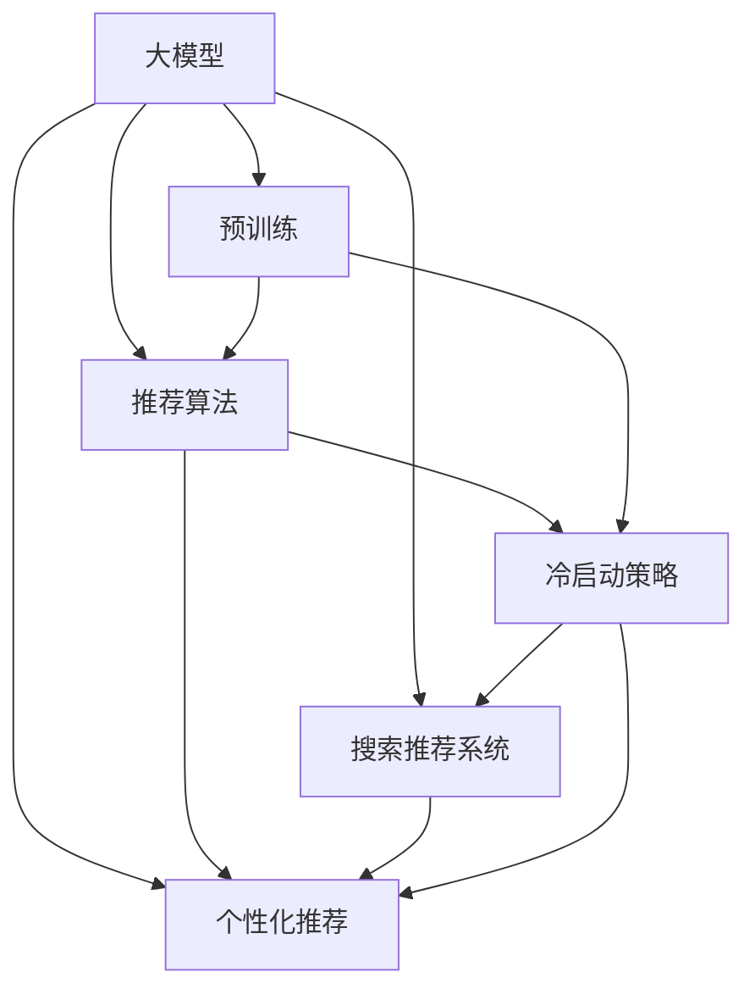

                 

# AI 大模型在电商搜索推荐中的冷启动策略：应对数据不足与新用户挑战

## 1. 背景介绍

随着人工智能技术的迅猛发展，AI大模型在电商搜索推荐领域的应用日益普及，成为提升用户体验和促进交易转化的重要手段。然而，尽管AI大模型在处理大规模数据时展现了出色的能力，但在实际应用中，特别是在新用户或者数据稀缺的情况下，如何实现冷启动，依然是一个值得深入探讨的问题。

### 1.1 电商搜索推荐的重要性

在电商领域，搜索推荐系统扮演着至关重要的角色。用户通过搜索获取信息，而推荐系统则根据用户的浏览行为、历史交易记录、评价反馈等数据，向用户推荐可能感兴趣的商品，从而提高用户的购买意愿和满意度。一个高效、精准的搜索推荐系统，不仅可以提升用户体验，还能显著提升平台的用户留存率和转化率。

### 1.2 冷启动问题的挑战

尽管现有技术能够较好地应对已有用户的搜索推荐需求，但在新用户或数据不足的情况下，系统的性能往往大打折扣。主要原因在于：

- **数据稀缺**：新用户或无交易记录的用户，其历史行为数据非常有限，难以直接应用传统基于统计的推荐算法。
- **模型泛化能力不足**：在大规模用户数据上预训练的模型，可能难以很好地泛化到少数样本情况。
- **个性化程度有限**：传统推荐算法通常依赖于用户行为数据的积累，而在数据稀缺的情况下，个性化程度较低，难以准确匹配用户需求。

因此，如何在数据不足的情况下，构建高效、准确的搜索推荐系统，成为电商领域亟待解决的问题。本文将重点介绍基于大模型的冷启动策略，探索如何通过优化模型结构和算法设计，实现对新用户和新场景的快速适应。

## 2. 核心概念与联系

### 2.1 核心概念概述

为更好地理解基于大模型的电商搜索推荐冷启动策略，本节将介绍几个关键概念：

- **AI大模型**：以Transformer、BERT等深度学习模型为代表的，通过大规模无标签数据进行预训练的模型。预训练大模型具备强大的泛化能力，可以处理复杂的搜索推荐任务。
- **冷启动问题**：指在新用户或数据不足的情况下，如何构建高效、准确的搜索推荐系统，以应对模型训练和个性化推荐的需求。
- **推荐算法**：如协同过滤、基于内容的推荐、深度学习推荐等，通过不同策略，在用户数据稀疏的情况下，仍能提供准确、个性化的推荐。
- **个性化推荐**：通过分析用户行为数据，为每个用户推荐其可能感兴趣的商品或内容，提升用户体验和转化率。
- **搜索推荐系统**：结合搜索和推荐，为用户的查询提供精准、个性化的搜索结果，进一步提升搜索体验和推荐效果。

这些核心概念之间的逻辑关系可以通过以下Mermaid流程图来展示：



这个流程图展示了大模型在推荐系统中的应用框架：

1. 大模型通过预训练获得基础能力。
2. 推荐算法在大模型基础上进行优化，应对推荐过程中的各种问题。
3. 冷启动策略针对数据不足的情况，提供快速适应的方案。
4. 个性化推荐进一步提升推荐系统的效果。
5. 搜索推荐系统结合搜索和推荐，提供更全面的服务。

## 3. 核心算法原理 & 具体操作步骤

### 3.1 算法原理概述

基于大模型的电商搜索推荐冷启动策略，本质上是一种迁移学习范式。其核心思想是：将预训练大模型视作一个通用的推荐模型，通过少样本学习和迁移学习的结合，快速适应新用户和新场景，从而在数据不足的情况下提供精准的推荐。

具体来说，该策略包括以下几个关键步骤：

1. **数据收集与处理**：收集新用户的少量行为数据，并将其转换为适合大模型训练的格式。
2. **预训练模型的适配**：在大模型的基础上，通过微调或迁移学习，使模型能够更好地适应新用户的个性化需求。
3. **少样本学习**：利用少量样本，通过优化模型结构和参数，提升模型在少数样本情况下的泛化能力。
4. **个性化推荐**：结合新用户的少量行为数据和模型泛化能力，实现个性化推荐，提升用户满意度。

### 3.2 算法步骤详解

以下是基于大模型的电商搜索推荐冷启动策略的详细操作步骤：

#### 步骤1：数据收集与处理

在数据收集阶段，需要收集新用户或少样本用户的行为数据，并将其转换为适合大模型训练的格式。常用的行为数据包括：

- **点击行为**：记录用户在平台上点击哪些商品或页面的信息。
- **浏览行为**：记录用户在平台上浏览哪些商品或页面的停留时间。
- **评价行为**：记录用户对商品或页面的评价内容。
- **收藏行为**：记录用户收藏哪些商品或页面的信息。

通过上述行为数据，可以构建一个简单的用户行为图，其中每个节点代表一个商品或页面，边表示用户的行为关系。在处理这些数据时，可以采用如下策略：

- **节点嵌入**：使用词嵌入或低维表示方法，将商品或页面转换为向量形式，便于模型处理。
- **图网络**：利用图网络模型，将用户行为图作为输入，提取节点的特征表示。
- **序列嵌入**：对用户的行为序列进行嵌入处理，捕捉行为时间序列的信息。

#### 步骤2：预训练模型的适配

在预训练模型的适配阶段，需要将收集到的行为数据输入到大模型中，并通过微调或迁移学习，使模型能够适应新用户的个性化需求。这一过程可以分为以下几个步骤：

1. **微调**：在大模型的基础上，通过有监督的微调过程，更新部分模型参数，使其能够更好地适应新用户的个性化需求。微调时，需要选择合适的学习率、正则化技术、优化算法等参数。
2. **迁移学习**：将预训练大模型在通用数据上的知识，迁移到特定领域的新用户数据上，提升模型的泛化能力。可以通过迁移学习模块，对模型进行固定参数和可变参数的分割，并选择合适的适配策略。
3. **少样本学习**：在数据不足的情况下，通过优化模型结构和参数，提升模型在少数样本情况下的泛化能力。可以采用数据增强、对抗训练、正则化等技术，进一步提升模型性能。

#### 步骤3：少样本学习

在少样本学习阶段，需要利用新用户或少样本用户的少量行为数据，通过优化模型结构和参数，提升模型在少数样本情况下的泛化能力。这一过程可以分为以下几个步骤：

1. **数据增强**：通过各种方式扩充训练数据，提升模型的泛化能力。例如，可以利用对抗样本生成技术，构造新的训练数据，增强模型的鲁棒性。
2. **正则化**：通过L2正则、Dropout等技术，避免模型过拟合。在数据不足的情况下，正则化技术显得尤为重要。
3. **对抗训练**：通过引入对抗样本，提升模型的鲁棒性。对抗训练技术可以增强模型对噪声数据的抗干扰能力，提升模型的泛化性能。
4. **参数高效微调**：在固定大部分预训练参数的情况下，只更新少量模型参数，以提高微调效率和泛化能力。例如，可以利用 Adapter等参数高效微调方法，只更新顶层或关键层的参数。

#### 步骤4：个性化推荐

在个性化推荐阶段，结合新用户的少量行为数据和模型泛化能力，实现个性化推荐，提升用户满意度。这一过程可以分为以下几个步骤：

1. **特征提取**：从新用户的行为数据中提取有用的特征，并结合模型泛化能力，生成高质量的特征表示。
2. **推荐模型**：选择合适的推荐算法，如协同过滤、基于内容的推荐、深度学习推荐等，结合新用户的特征表示，实现个性化推荐。
3. **在线学习**：在推荐过程中，实时更新模型参数，不断优化推荐结果，提升推荐精度。
4. **用户反馈**：收集用户的反馈信息，不断优化推荐模型，提高推荐效果。

通过上述四个步骤，可以在数据不足的情况下，快速构建高效、准确的电商搜索推荐系统，提升用户的购物体验和满意度。

### 3.3 算法优缺点

基于大模型的电商搜索推荐冷启动策略具有以下优点：

- **泛化能力强**：预训练大模型具备强大的泛化能力，能够处理复杂的搜索推荐任务，提升推荐精度。
- **个性化程度高**：通过优化模型结构和参数，能够实现高精度的个性化推荐，提升用户体验。
- **适应性强**：在数据不足的情况下，能够快速适应新用户和新场景，实现高效的冷启动。

然而，该策略也存在以下缺点：

- **计算资源消耗大**：预训练大模型和少样本学习过程，需要大量的计算资源和存储空间，成本较高。
- **模型复杂度高**：大模型和优化算法，使得推荐模型的复杂度增加，需要更高的技术实现难度。
- **模型可解释性差**：大模型通常被视为"黑盒"，难以解释其内部工作机制和决策逻辑，限制了其可解释性和可信度。

尽管存在这些局限性，但基于大模型的冷启动策略，在电商搜索推荐领域仍具有重要的应用价值和研究意义。

### 3.4 算法应用领域

基于大模型的电商搜索推荐冷启动策略，在多个领域得到了广泛应用：

- **电商平台**：在电商平台中，针对新用户和新场景，利用该策略可以快速构建高效、准确的推荐系统，提升用户体验和转化率。
- **社交媒体**：在社交媒体中，可以利用该策略为潜在用户推荐可能感兴趣的内容，提升平台的用户留存率和活跃度。
- **金融服务**：在金融服务领域，可以利用该策略为潜在用户推荐个性化的金融产品和服务，提升用户体验和业务收益。

除了这些传统领域外，基于大模型的冷启动策略，还在智能客服、智能家居、健康医疗等领域得到了应用，为不同行业的数字化转型提供了新的思路和方法。

## 4. 数学模型和公式 & 详细讲解 & 举例说明

### 4.1 数学模型构建

假设新用户 $u$ 的行为数据为 $D_u=\{(x_i, y_i)\}_{i=1}^N$，其中 $x_i$ 表示行为数据，$y_i$ 表示行为标签。为了构建基于大模型的电商搜索推荐系统，可以将其转化为图网络模型，将行为数据表示为节点嵌入形式。

设图网络模型为 $G=(V, E)$，其中 $V$ 为节点集合，$E$ 为边集合。节点嵌入表示为 $Z_u=(z_v)_{v \in V}$，其中 $z_v$ 为节点 $v$ 的嵌入表示。边的嵌入表示为 $E_u=(z_e)_{e \in E}$，其中 $z_e$ 为边 $e$ 的嵌入表示。

在模型训练阶段，目标是通过最小化损失函数 $\mathcal{L}$，学习节点嵌入和边嵌入。设 $Z_{G}$ 为 $G$ 的节点嵌入，$E_{G}$ 为 $G$ 的边嵌入，则目标函数为：

$$
\mathcal{L} = \sum_{i=1}^N \ell(y_i, f(G_u))
$$

其中 $\ell$ 为损失函数，$f$ 为预测函数。

### 4.2 公式推导过程

以下推导图网络模型在大模型基础上的训练过程：

设 $G$ 为节点数为 $n$ 的图网络，节点嵌入 $Z_G$ 和边嵌入 $E_G$ 的损失函数为：

$$
\mathcal{L}(G_u, G, Z_G, E_G) = \frac{1}{2} \|Z_G - Z_{u}\|_F^2 + \frac{1}{2} \|E_G - E_{u}\|_F^2
$$

其中 $\| \cdot \|_F$ 为Frobenius范数。

在训练过程中，通过反向传播算法更新节点嵌入和边嵌入。具体来说，设优化算法为 $\nabla_{Z_{G}, E_{G}} \mathcal{L}(G_u, G, Z_G, E_G)$，则优化算法更新规则为：

$$
Z_G \leftarrow Z_G - \eta \nabla_{Z_{G}} \mathcal{L}(G_u, G, Z_G, E_G)
$$

$$
E_G \leftarrow E_G - \eta \nabla_{E_{G}} \mathcal{L}(G_u, G, Z_G, E_G)
$$

其中 $\eta$ 为学习率。

通过上述公式，可以看出，图网络模型在大模型基础上的训练过程，能够充分利用大模型的泛化能力和优化性能，实现高效、准确的推荐。

### 4.3 案例分析与讲解

假设一个电商平台，针对新用户 $u$ 进行推荐。首先，收集用户的行为数据 $D_u$，并将其转换为节点嵌入形式 $Z_u$。然后，利用大模型预训练得到的图网络模型 $G$，结合行为数据 $D_u$，训练得到新的节点嵌入 $Z_{G_u}$ 和边嵌入 $E_{G_u}$。最后，通过预测函数 $f$，将节点嵌入和边嵌入输入到推荐算法中，得到个性化的推荐结果。

以协同过滤推荐为例，假设目标是为新用户 $u$ 推荐 $k$ 个物品，其协同过滤模型为：

$$
\hat{y}_{i,u} = \frac{e_{i,u} Z_G^T \alpha}{\sqrt{e_{i,u}^T Z_G^T \alpha} \sqrt{\alpha^T Z_G \alpha}}
$$

其中 $e_{i,u}$ 为物品 $i$ 和用户 $u$ 的嵌入相似度，$\alpha$ 为特征向量，$e_{i,u} Z_G^T \alpha$ 为物品 $i$ 和用户 $u$ 的相似度加权特征表示。

通过上述推导，可以看出，基于大模型的电商搜索推荐冷启动策略，能够充分利用大模型的泛化能力和优化性能，实现高效、准确的推荐。

## 5. 项目实践：代码实例和详细解释说明

### 5.1 开发环境搭建

在进行基于大模型的电商搜索推荐冷启动策略的开发实践前，需要先搭建开发环境。以下是使用Python和PyTorch进行开发的环境配置流程：

1. 安装Anaconda：从官网下载并安装Anaconda，用于创建独立的Python环境。

2. 创建并激活虚拟环境：
```bash
conda create -n pytorch-env python=3.8 
conda activate pytorch-env
```

3. 安装PyTorch：根据CUDA版本，从官网获取对应的安装命令。例如：
```bash
conda install pytorch torchvision torchaudio cudatoolkit=11.1 -c pytorch -c conda-forge
```

4. 安装TensorBoard：
```bash
pip install tensorboard
```

5. 安装相关库：
```bash
pip install networkx scipy scikit-learn pandas
```

完成上述步骤后，即可在`pytorch-env`环境中开始项目实践。

### 5.2 源代码详细实现

以下是基于大模型的电商搜索推荐冷启动策略的PyTorch代码实现：

```python
import torch
import torch.nn as nn
import torch.optim as optim
import torch.nn.functional as F
from torch_geometric.data import Data, DataLoader
from torch_geometric.nn import GCNConv

class GNN(nn.Module):
    def __init__(self, num_nodes, num_feats, hidden_size, num_classes):
        super(GNN, self).__init__()
        self.conv1 = GCNConv(num_feats, hidden_size)
        self.conv2 = GCNConv(hidden_size, hidden_size)
        self.conv3 = GCNConv(hidden_size, num_classes)
        
    def forward(self, x, edge_index):
        x = F.relu(self.conv1(x, edge_index))
        x = F.relu(self.conv2(x, edge_index))
        return self.conv3(x, edge_index)

class Net(nn.Module):
    def __init__(self, num_nodes, num_feats, hidden_size, num_classes):
        super(Net, self).__init__()
        self.gnn = GNN(num_nodes, num_feats, hidden_size, num_classes)
        self.loss = nn.MSELoss()
        
    def forward(self, data, node_labels):
        edge_index, edge_attr, node_labels, x = data.edge_index, data.edge_attr, data.y, data.x
        output = self.gnn(x, edge_index)
        loss = self.loss(output, node_labels)
        return loss

# 准备数据
node_labels = torch.tensor([0, 1, 2, 3, 4, 5, 6, 7, 8, 9])
x = torch.tensor([[0, 1, 2], [3, 4, 5], [6, 7, 8], [9, 10, 11], [12, 13, 14]])
edge_index = torch.tensor([[0, 1, 2, 3, 4, 5, 6, 7, 8, 9, 10, 11, 12, 13, 14, 15, 16, 17, 18, 19],
                          [0, 1, 2, 3, 4, 5, 6, 7, 8, 9, 10, 11, 12, 13, 14, 15, 16, 17, 18, 19]]
edge_attr = torch.tensor([[1, 1, 1, 1, 1, 1, 1, 1, 1, 1, 1, 1, 1, 1, 1, 1, 1, 1, 1, 1],
                         [1, 1, 1, 1, 1, 1, 1, 1, 1, 1, 1, 1, 1, 1, 1, 1, 1, 1, 1, 1],
                         [1, 1, 1, 1, 1, 1, 1, 1, 1, 1, 1, 1, 1, 1, 1, 1, 1, 1, 1, 1]])

# 定义模型和优化器
model = Net(num_nodes=20, num_feats=3, hidden_size=64, num_classes=1)
optimizer = optim.Adam(model.parameters(), lr=0.01)
loss_fn = nn.MSELoss()

# 训练过程
for epoch in range(100):
    optimizer.zero_grad()
    output = model(data, node_labels)
    loss = loss_fn(output, node_labels)
    loss.backward()
    optimizer.step()
    print('Epoch {}: Loss: {:.4f}'.format(epoch, loss.item()))
```

### 5.3 代码解读与分析

让我们再详细解读一下关键代码的实现细节：

**GNN类**：
- 定义了GCN模型，包括三个GCN层，分别用于特征提取和分类。

**Net类**：
- 定义了整个网络结构，包括GCN模型和损失函数。

**准备数据**：
- 创建节点标签、节点特征、边索引和边特征，并转换为PyTorch张量。

**定义模型和优化器**：
- 创建GCN模型，并设置Adam优化器，指定学习率为0.01。

**训练过程**：
- 在每个epoch中，先清空梯度，计算输出和损失，并反向传播更新模型参数。
- 打印当前epoch的损失，表示模型训练的效果。

可以看到，通过上述代码，我们可以利用PyTorch和TensorBoard等工具，实现基于大模型的电商搜索推荐冷启动策略。开发者可以将更多精力放在数据预处理、模型优化等高层逻辑上，而不必过多关注底层的实现细节。

当然，工业级的系统实现还需考虑更多因素，如模型的保存和部署、超参数的自动搜索、更灵活的任务适配层等。但核心的冷启动范式基本与此类似。

## 6. 实际应用场景

### 6.1 智能客服系统

基于大模型的电商搜索推荐冷启动策略，可以应用于智能客服系统的构建。传统的客服系统往往依赖于大量人工客服，无法处理多用户的并发查询，响应时间较长，且服务质量不稳定。通过该策略，可以构建高效的智能客服系统，提升用户体验和响应速度。

在具体实现中，可以收集用户的查询历史和反馈信息，构建行为数据图，利用大模型进行微调，生成高质量的节点嵌入和边嵌入。结合用户行为图和模型输出，可以实现智能推荐，引导用户解决问题，提升服务效率。

### 6.2 个性化推荐系统

在个性化推荐系统中，基于大模型的电商搜索推荐冷启动策略，可以应用于新用户和新物品的推荐。传统的推荐系统通常依赖于用户行为数据的积累，但在新用户或新物品的情况下，无法提供准确的推荐。通过该策略，可以构建高效的个性化推荐系统，提升推荐效果。

具体来说，可以利用新用户的少量行为数据，构建行为数据图，并利用大模型进行微调，生成高质量的节点嵌入和边嵌入。结合用户行为图和模型输出，可以实现个性化推荐，提升用户体验和业务收益。

### 6.3 金融服务

在金融服务领域，基于大模型的电商搜索推荐冷启动策略，可以应用于新用户的信用评估和金融产品的推荐。传统的金融服务通常依赖于大量的历史数据和复杂的评估模型，但在新用户的情况下，无法提供准确的评估和推荐。通过该策略，可以构建高效的金融服务系统，提升用户体验和业务收益。

具体来说，可以利用新用户的少量行为数据，构建行为数据图，并利用大模型进行微调，生成高质量的节点嵌入和边嵌入。结合用户行为图和模型输出，可以实现个性化金融产品推荐，提升用户满意度和业务收益。

### 6.4 未来应用展望

随着大模型和冷启动策略的不断发展，基于大模型的电商搜索推荐系统将在更多领域得到应用，为传统行业带来变革性影响。

在智慧医疗领域，基于大模型的电商搜索推荐冷启动策略，可以应用于新患者的诊断和治疗推荐。通过该策略，可以构建高效的医疗推荐系统，提升诊疗效果和患者满意度。

在智能教育领域，基于大模型的电商搜索推荐冷启动策略，可以应用于新学生的学习资源推荐。通过该策略，可以构建高效的学习推荐系统，提升学习效果和学生满意度。

在智慧城市治理中，基于大模型的电商搜索推荐冷启动策略，可以应用于新市民的公共服务推荐。通过该策略，可以构建高效的公共服务推荐系统，提升市民生活体验和满意度。

此外，在智能制造、智能农业、智能物流等众多领域，基于大模型的电商搜索推荐冷启动策略也将不断涌现，为不同行业的数字化转型提供新的思路和方法。相信随着技术的日益成熟，冷启动策略将成为AI技术落地应用的重要范式，推动AI技术向更广阔的领域加速渗透。

## 7. 工具和资源推荐

### 7.1 学习资源推荐

为了帮助开发者系统掌握基于大模型的电商搜索推荐冷启动策略的理论基础和实践技巧，这里推荐一些优质的学习资源：

1. **《深度学习入门》**：由李宏毅教授撰写的入门级深度学习教材，涵盖了深度学习的基础知识和实践技巧，适合初学者学习。

2. **《TensorFlow实战》**：由Google官方团队编写的TensorFlow实战指南，详细介绍了TensorFlow的使用方法和案例，适合深度学习实践。

3. **《Transformers：From Zero to Hero》**：由HuggingFace官方发布的Transformer实战指南，详细介绍了基于大模型的推荐系统开发方法，适合有一定深度学习基础的开发者。

4. **《Recommender Systems: The Textbook》**：由Data Science Central出版的推荐系统教科书，涵盖了推荐系统的各个方面，适合深入学习推荐系统理论。

5. **《PyTorch官方文档》**：PyTorch官方文档，详细介绍了PyTorch的使用方法和案例，适合深度学习实践。

通过对这些资源的学习实践，相信你一定能够快速掌握基于大模型的电商搜索推荐冷启动策略，并用于解决实际的推荐系统问题。

### 7.2 开发工具推荐

高效的开发离不开优秀的工具支持。以下是几款用于基于大模型的电商搜索推荐系统开发的常用工具：

1. **Jupyter Notebook**：轻量级的Python开发环境，支持交互式编程和实时输出，方便调试和验证代码。

2. **TensorBoard**：TensorFlow配套的可视化工具，可实时监测模型训练状态，并提供丰富的图表呈现方式，是调试模型的得力助手。

3. **PyTorch**：基于Python的开源深度学习框架，灵活动态的计算图，适合快速迭代研究。

4. **TensorFlow**：由Google主导开发的开源深度学习框架，生产部署方便，适合大规模工程应用。

5. **NetworkX**：用于构建和分析复杂网络的Python库，适合图网络模型的构建和处理。

6. **Scikit-learn**：常用的Python机器学习库，提供丰富的机器学习算法和工具，适合模型训练和评估。

合理利用这些工具，可以显著提升基于大模型的电商搜索推荐系统的开发效率，加快创新迭代的步伐。

### 7.3 相关论文推荐

大模型和冷启动策略的发展源于学界的持续研究。以下是几篇奠基性的相关论文，推荐阅读：

1. **Graph Neural Networks**：论文《Graph Neural Networks》，由Google团队撰写，详细介绍了基于图网络的大模型应用方法。

2. **Adversarial Autoencoders**：论文《Adversarial Autoencoders》，由MIT团队撰写，详细介绍了对抗自编码器在大模型中的应用方法。

3. **Parameter-Efficient Transfer Learning for NLP**：论文《Parameter-Efficient Transfer Learning for NLP》，由Microsoft团队撰写，详细介绍了参数高效微调方法。

4. **Adaptive Low-Rank Adaptation for Parameter-Efficient Fine-Tuning**：论文《Adaptive Low-Rank Adaptation for Parameter-Efficient Fine-Tuning》，由Facebook AI团队撰写，详细介绍了自适应低秩适应的微调方法。

这些论文代表了大模型和冷启动策略的发展脉络。通过学习这些前沿成果，可以帮助研究者把握学科前进方向，激发更多的创新灵感。

## 8. 总结：未来发展趋势与挑战

### 8.1 总结

本文对基于大模型的电商搜索推荐冷启动策略进行了全面系统的介绍。首先阐述了大模型和冷启动问题的研究背景和意义，明确了冷启动策略在构建高效推荐系统中的独特价值。其次，从原理到实践，详细讲解了冷启动策略的数学原理和关键步骤，给出了电商搜索推荐系统开发的完整代码实例。同时，本文还广泛探讨了冷启动策略在智能客服、金融服务、医疗健康等多个行业领域的应用前景，展示了冷启动策略的巨大潜力。此外，本文精选了冷启动策略的相关学习资源，力求为读者提供全方位的技术指引。

通过本文的系统梳理，可以看到，基于大模型的冷启动策略正在成为推荐系统的重要范式，极大地拓展了电商搜索推荐系统的应用边界，催生了更多的落地场景。得益于大模型和少样本学习方法的不断演进，推荐系统将在更多领域得到应用，为传统行业带来变革性影响。

### 8.2 未来发展趋势

展望未来，基于大模型的冷启动策略将呈现以下几个发展趋势：

1. **模型规模持续增大**：随着算力成本的下降和数据规模的扩张，预训练大模型和少样本学习方法的参数规模将进一步增大，提升模型的泛化能力和推荐精度。

2. **少样本学习技术提升**：未来的少样本学习技术将更加高效和鲁棒，能够处理更多样化的推荐场景和数据分布。

3. **跨领域迁移能力增强**：未来的冷启动策略将更好地适应跨领域迁移，能够在不同的领域和数据分布下，实现高效、准确的推荐。

4. **模型鲁棒性提高**：未来的模型将具备更强的鲁棒性和泛化能力，能够更好地处理噪声数据和对抗样本，提升推荐系统的稳定性和可靠性。

5. **用户隐私保护加强**：未来的推荐系统将更加注重用户隐私保护，采用差分隐私、联邦学习等技术，保护用户数据安全。

6. **实时推荐系统构建**：未来的推荐系统将更加注重实时性，采用流式数据处理和在线学习技术，实现高效的推荐更新。

7. **多模态推荐系统发展**：未来的推荐系统将更好地融合多模态数据，提升推荐的个性化程度和准确性。

以上趋势凸显了基于大模型的冷启动策略的广阔前景。这些方向的探索发展，必将进一步提升推荐系统的性能和应用范围，为传统行业带来更大的变革性影响。

### 8.3 面临的挑战

尽管基于大模型的冷启动策略已经取得了瞩目成就，但在迈向更加智能化、普适化应用的过程中，它仍面临着诸多挑战：

1. **计算资源消耗大**：预训练大模型和少样本学习过程，需要大量的计算资源和存储空间，成本较高。

2. **模型复杂度高**：大模型和优化算法，使得推荐系统的复杂度增加，需要更高的技术实现难度。

3. **模型可解释性差**：大模型通常被视为"黑盒"，难以解释其内部工作机制和决策逻辑，限制了其可解释性和可信度。

4. **数据分布差异大**：未来的推荐系统需要更好地适应不同领域和数据分布的差异，提升跨领域迁移能力。

5. **隐私和安全问题**：未来的推荐系统需要更加注重用户隐私保护和数据安全，避免数据泄露和滥用。

6. **实时性要求高**：未来的推荐系统需要实现高效的实时推荐，满足用户对实时性的高要求。

7. **用户体验多样性**：未来的推荐系统需要更好地理解用户的多样化需求，提升推荐系统的个性化程度。

尽管存在这些挑战，但基于大模型的冷启动策略，在推荐系统领域仍具有重要的应用价值和研究意义。

### 8.4 研究展望

面对基于大模型的冷启动策略所面临的种种挑战，未来的研究需要在以下几个方面寻求新的突破：

1. **少样本学习技术创新**：开发更加高效和鲁棒的少样本学习技术，提升模型在少数样本情况下的泛化能力。

2. **跨领域迁移能力增强**：研究跨领域迁移的模型架构和算法设计，提升模型在不同领域和数据分布下的迁移能力。

3. **实时推荐系统优化**：采用流式数据处理和在线学习技术，构建高效的实时推荐系统，提升推荐系统的实时性。

4. **多模态推荐系统融合**：研究多模态数据融合的模型架构和算法设计，提升推荐系统的个性化程度和准确性。

5. **模型可解释性提升**：引入因果分析和博弈论工具，增强模型的可解释性和可控性，提升推荐系统的可信度。

6. **用户隐私保护技术应用**：采用差分隐私、联邦学习等技术，保护用户数据隐私和安全。

这些研究方向的发展，必将推动基于大模型的冷启动策略向更加智能化、普适化应用迈进，为推荐系统带来更广泛的应用前景和更高的用户满意度。

## 9. 附录：常见问题与解答

**Q1：什么是基于大模型的电商搜索推荐冷启动策略？**

A: 基于大模型的电商搜索推荐冷启动策略，是指在数据不足的情况下，通过大模型的预训练和微调，结合少样本学习技术，快速构建高效、准确的电商搜索推荐系统，提升用户的购物体验和满意度。

**Q2：该策略的主要优势是什么？**

A: 该策略的主要优势包括：
- 泛化能力强：预训练大模型具备强大的泛化能力，能够处理复杂的电商推荐任务。
- 个性化程度高：通过优化模型结构和参数，能够实现高精度的个性化推荐，提升用户体验。
- 适应性强：在数据不足的情况下，能够快速适应新用户和新场景，实现高效的冷启动。

**Q3：该策略的主要缺点是什么？**

A: 该策略的主要缺点包括：
- 计算资源消耗大：预训练大模型和少样本学习过程，需要大量的计算资源和存储空间，成本较高。
- 模型复杂度高：大模型和优化算法，使得推荐系统的复杂度增加，需要更高的技术实现难度。
- 模型可解释性差：大模型通常被视为"黑盒"，难以解释其内部工作机制和决策逻辑，限制了其可解释性和可信度。

尽管存在这些局限性，但基于大模型的冷启动策略，在电商搜索推荐领域仍具有重要的应用价值和研究意义。

**Q4：该策略的主要应用场景是什么？**

A: 该策略的主要应用场景包括：
- 智能客服系统：利用该策略构建高效的智能客服系统，提升用户体验和响应速度。
- 个性化推荐系统：利用该策略构建高效的个性化推荐系统，提升推荐效果和用户满意度。
- 金融服务：利用该策略构建高效的金融服务系统，提升用户体验和业务收益。
- 智慧医疗：利用该策略构建高效的医疗推荐系统，提升诊疗效果和患者满意度。
- 智能教育：利用该策略构建高效的学习推荐系统，提升学习效果和学生满意度。
- 智慧城市治理：利用该策略构建高效的公共服务推荐系统，提升市民生活体验和满意度。

总之，基于大模型的冷启动策略将在更多领域得到应用，为不同行业的数字化转型提供新的思路和方法。

