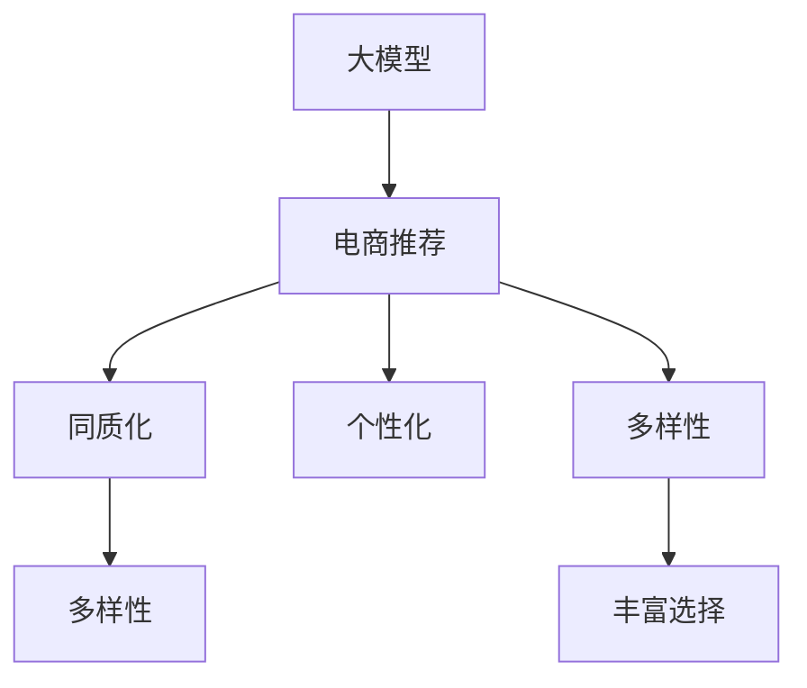

                 

# AI 大模型在电商搜索推荐中的多样性策略：避免过度同质化与过度个性化

> 关键词：大模型、电商推荐、多样性、同质化、个性化、人工智能

## 1. 背景介绍

在电商领域，个性化推荐系统已经成为提升用户体验和增加用户留存率的重要工具。传统的个性化推荐系统通过学习用户的浏览和购买行为，预测用户的偏好，从而推荐用户可能感兴趣的商品。然而，随着算法的不断优化和数据的积累，推荐系统逐渐出现了过度个性化的问题。过度个性化的推荐往往忽略了用户的广泛需求，使得商品推荐的同质化现象严重。这一问题不仅削弱了推荐系统的多样性，还可能导致用户陷入信息茧房，无法接触到更多样化的信息。

近年来，大模型在自然语言处理、计算机视觉等领域取得了突破性进展，应用于电商搜索推荐也成为新的研究热点。大模型具备强大的语义理解能力和丰富的知识背景，能够处理大规模、高维度的数据，并具备自我优化能力。然而，大模型在电商推荐中同样面临着过度个性化的风险，需要通过多样性策略进行有效的规避。本文旨在探讨如何利用大模型在电商搜索推荐中实现多样性，避免过度同质化与过度个性化。

## 2. 核心概念与联系

### 2.1 核心概念概述

为更好地理解大模型在电商推荐中的应用，本文将介绍几个关键概念：

- **大模型**：以Transformer模型为代表的大规模预训练语言模型，具备强大的语言理解和生成能力。通过在海量文本数据上预训练，大模型可以学习到广泛的语义知识。
- **电商推荐系统**：利用用户的浏览、购买历史等数据，预测用户可能感兴趣的商品，并将其推荐给用户，从而提升用户体验和销售转化率。
- **同质化**：推荐系统过度关注用户偏好，忽略了广泛的需求，导致推荐结果中大量重复相似的商品，降低用户体验和推荐多样性。
- **个性化**：推荐系统依据用户的个性化需求，推送与其兴趣相关的内容，提升用户满意度。然而，过度个性化可能导致用户信息茧房，限制其接触到多样化的商品。
- **多样性**：推荐系统应兼顾用户个性化需求和广泛需求，推送多样化的商品，丰富用户的购物选择。

这些核心概念之间的逻辑关系可以通过以下Mermaid流程图来展示：



这个流程图展示了大模型在电商推荐中的应用场景，以及如何通过多样性策略平衡个性化与同质化问题：

1. 大模型通过预训练获得广泛的语言知识，可用于电商推荐。
2. 电商推荐系统通过大模型进行用户兴趣预测，实现个性化推荐。
3. 同质化问题会导致推荐多样性不足，大模型可以通过多样性策略进行改进。
4. 多样性策略应兼顾个性化需求和广泛需求，提升推荐系统的整体效果。

## 3. 核心算法原理 & 具体操作步骤

### 3.1 算法原理概述

基于大模型的电商搜索推荐系统，其核心思想是利用大模型学习用户的语义需求，并通过多样性策略避免过度同质化。大模型在电商推荐中的应用可以分为两个阶段：

- **预训练阶段**：在大规模无标签文本数据上进行预训练，学习通用的语言表示。
- **微调阶段**：利用电商领域的数据对大模型进行微调，使其能够根据用户输入的查询信息预测可能感兴趣的商品。

在微调阶段，大模型需通过多样性策略来平衡个性化和同质化。常用的多样性策略包括：

- **基于兴趣的多样性**：根据用户的历史浏览和购买行为，预测不同类别的商品，避免推荐大量重复的商品。
- **基于知识的多样性**：引入外部知识库，如商品分类、属性等，丰富推荐结果的多样性。
- **基于上下文的多样性**：结合用户查询上下文信息，生成多种可能的推荐结果，避免推荐的单一性。

### 3.2 算法步骤详解

基于大模型的电商搜索推荐系统的多样性策略可以分为以下关键步骤：

**Step 1: 数据准备**
- 收集电商平台的用户数据，包括浏览历史、购买历史、用户画像等信息。
- 对用户数据进行清洗和标注，标记用户的兴趣类别和属性。

**Step 2: 模型预训练**
- 在大规模无标签文本数据上对大模型进行预训练，学习通用的语言表示。
- 预训练目标可以是文本分类、语义相似度计算、序列预测等任务。

**Step 3: 数据增强**
- 对电商商品进行特征抽取，生成高维度的商品向量。
- 使用数据增强技术，如随机噪声、数据扰动等方式，丰富商品特征。

**Step 4: 多样性策略设计**
- 设计多样性策略，如基于兴趣的多样性、基于知识的多样性、基于上下文的多样性等。
- 结合大模型进行预测，生成多种推荐结果。

**Step 5: 推荐结果融合**
- 根据多样性策略生成的多种推荐结果，结合用户的历史行为和实时查询，进行综合排序。
- 利用用户行为评分、商品属性评分等方式，对推荐结果进行加权融合。

**Step 6: 推荐系统部署与评估**
- 将微调后的大模型部署到电商推荐系统中。
- 在实时数据上对推荐系统进行评估，监控推荐效果和系统性能。
- 根据评估结果进行迭代优化，提升推荐系统的多样性和个性化效果。

### 3.3 算法优缺点

基于大模型的电商搜索推荐系统具有以下优点：

1. **语义理解能力强**：大模型具备强大的语义理解能力，能够理解和捕捉用户的广泛需求。
2. **知识背景丰富**：大模型通过预训练，学习到广泛的语义知识，能够进行多维度特征提取。
3. **自我优化能力强**：大模型具有自我优化能力，能够根据实时数据不断调整模型参数，提升推荐效果。
4. **处理高维度数据能力强**：大模型能够处理高维度、大规模的数据，提升推荐系统的准确性。

然而，该方法也存在一些局限性：

1. **数据隐私问题**：电商数据涉及用户隐私，需要严格控制数据访问和使用，确保数据安全。
2. **模型复杂度高**：大模型的参数量庞大，计算复杂度高，需要高性能计算资源。
3. **过度个性化问题**：虽然多样性策略可以缓解同质化问题，但过度个性化仍可能导致用户陷入信息茧房。
4. **训练成本高**：大规模预训练和微调需要大量标注数据和计算资源，成本较高。

尽管存在这些局限性，但基于大模型的电商推荐系统在提升推荐多样性、丰富用户选择方面仍具有显著优势，值得进一步研究与应用。

### 3.4 算法应用领域

基于大模型的电商推荐系统已经在多个电商平台得到应用，取得了不错的效果。具体应用领域包括：

- **服装、鞋帽类商品推荐**：通过多样性策略，丰富服装鞋帽类商品的推荐结果，提升用户选择多样性。
- **家居、家电类商品推荐**：结合用户查询上下文信息，生成多种可能的家居家电类商品推荐，丰富购物选择。
- **图书、音视频推荐**：利用大模型学习用户的语义需求，生成多种类型的图书、音视频推荐结果，提升用户体验。
- **个性化定制推荐**：结合大模型和用户画像信息，生成个性化定制商品推荐，提升个性化推荐效果。

除了上述这些典型应用外，大模型在电商推荐中的应用还在不断拓展，如智能客服、营销活动推荐等，为电商平台带来更多的创新和价值。

## 4. 数学模型和公式 & 详细讲解 & 举例说明

### 4.1 数学模型构建

在电商推荐系统中，大模型通过预训练学习通用的语言表示，并通过微调适应电商领域的特定任务。假设大模型为 $M_{\theta}$，其中 $\theta$ 为模型参数。电商推荐任务为 $T$，包括分类、匹配、排序等。训练集为 $D=\{(x_i,y_i)\}_{i=1}^N$，其中 $x_i$ 为用户查询信息，$y_i$ 为推荐结果。

定义模型 $M_{\theta}$ 在数据样本 $(x,y)$ 上的损失函数为 $\ell(M_{\theta}(x),y)$，则在数据集 $D$ 上的经验风险为：

$$
\mathcal{L}(\theta) = \frac{1}{N} \sum_{i=1}^N \ell(M_{\theta}(x_i),y_i)
$$

微调的优化目标是最小化经验风险，即找到最优参数：

$$
\theta^* = \mathop{\arg\min}_{\theta} \mathcal{L}(\theta)
$$

在微调过程中，大模型的输出需满足多样性策略的要求。假设多样性策略为 $d$，则大模型在用户查询 $x$ 上的推荐结果需满足：

$$
M_{\theta}(x) \sim d
$$

### 4.2 公式推导过程

以下我们以基于兴趣的多样性策略为例，推导大模型在电商推荐中的应用。

假设电商推荐任务为商品分类，大模型通过预训练学习到商品的语义表示 $z_i$，模型输出为 $h(x)$。用户兴趣类别为 $C=\{c_1,c_2,...,c_k\}$，推荐结果需覆盖所有类别。定义损失函数为交叉熵损失，则推荐目标函数为：

$$
\mathcal{L}(h(x)) = -\sum_{i=1}^k \log(\frac{\exp(h(x) \cdot z_{c_i})}{\sum_{j=1}^k \exp(h(x) \cdot z_{c_j})})
$$

其中 $z_{c_i}$ 为类别 $c_i$ 的语义表示向量。

通过上述损失函数，大模型需要学习如何将用户查询 $x$ 映射到商品类别 $C$ 中，且确保推荐结果覆盖所有类别。

### 4.3 案例分析与讲解

**案例1: 商品分类推荐**
假设电商推荐系统收集了用户的浏览历史 $H$ 和购买历史 $P$，并标注用户的兴趣类别 $C$。大模型通过预训练学习到商品的语义表示 $z_i$，并在此基础上微调，得到分类推荐模型 $h(x)$。

具体步骤如下：

1. 收集电商平台的浏览和购买数据，标记用户的兴趣类别。
2. 在大规模无标签文本数据上对大模型进行预训练，学习商品的语义表示。
3. 将用户查询 $x$ 输入大模型，输出商品分类概率分布 $h(x)$。
4. 定义损失函数 $\mathcal{L}(h(x))$，优化模型参数 $\theta$，使得推荐结果覆盖所有兴趣类别。

**案例2: 基于上下文的多样性推荐**
假设用户查询为 $x$，大模型通过预训练学习到商品语义表示 $z_i$。为增加推荐结果的多样性，可以结合用户查询上下文信息 $u$，生成多种可能的推荐结果。

具体步骤如下：

1. 收集电商平台的查询数据 $X$ 和上下文信息 $U$。
2. 在大规模无标签文本数据上对大模型进行预训练，学习商品的语义表示。
3. 对用户查询 $x$ 和上下文信息 $u$ 进行编码，生成上下文向量 $c(x,u)$。
4. 利用上下文向量 $c(x,u)$ 生成多种推荐结果 $y_1, y_2,...,y_n$。
5. 结合用户行为评分 $s$，生成推荐结果的加权综合排序 $w \cdot y_i + (1-w) \cdot M_{\theta}(x)$，其中 $w$ 为权重系数。

## 5. 项目实践：代码实例和详细解释说明

### 5.1 开发环境搭建

在进行电商推荐系统的开发前，我们需要准备好开发环境。以下是使用Python进行TensorFlow开发的环境配置流程：

1. 安装Anaconda：从官网下载并安装Anaconda，用于创建独立的Python环境。

2. 创建并激活虚拟环境：
```bash
conda create -n tf-env python=3.8 
conda activate tf-env
```

3. 安装TensorFlow：根据CUDA版本，从官网获取对应的安装命令。例如：
```bash
conda install tensorflow=2.8
```

4. 安装TensorFlow Addons：
```bash
conda install tensorflow-io
```

5. 安装各类工具包：
```bash
pip install numpy pandas scikit-learn matplotlib tqdm jupyter notebook ipython
```

完成上述步骤后，即可在`tf-env`环境中开始电商推荐系统的开发。

### 5.2 源代码详细实现

下面我们以电商推荐系统为例，给出使用TensorFlow和TensorFlow Addons进行电商推荐的多样性策略开发的PyTorch代码实现。

首先，定义电商推荐任务的数据处理函数：

```python
import tensorflow as tf
from tensorflow_addons.layers import DistributedRegularizer
from tensorflow.keras import layers, models, optimizers
import numpy as np

class RecommendationDataset(tf.keras.datasets.Dataset):
    def __init__(self, features, labels):
        self.features = features
        self.labels = labels
    
    def __len__(self):
        return len(self.features)
    
    def __getitem__(self, item):
        return self.features[item], self.labels[item]

# 加载电商推荐数据集
features = np.load('features.npy')
labels = np.load('labels.npy')

dataset = RecommendationDataset(features, labels)
```

然后，定义模型和优化器：

```python
from transformers import TFAutoModelForSequenceClassification, TFAutoTokenizer

model = TFAutoModelForSequenceClassification.from_pretrained('bert-base-cased', num_labels=3)

tokenizer = TFAutoTokenizer.from_pretrained('bert-base-cased')
```

接着，定义训练和评估函数：

```python
# 设置模型输入
def create_model_input(batch):
    inputs = tokenizer(batch, return_tensors='tf', padding=True, truncation=True, max_length=128)
    return inputs['input_ids'], inputs['attention_mask']

# 训练函数
def train_epoch(model, dataset, batch_size, optimizer):
    for batch in dataset.shuffle(batch_size=batch_size):
        inputs = create_model_input(batch)
        with tf.GradientTape() as tape:
            predictions = model(inputs[0], attention_mask=inputs[1])
            loss = tf.keras.losses.SparseCategoricalCrossentropy(from_logits=True).call(inputs[1], predictions)
        gradients = tape.gradient(loss, model.trainable_variables)
        optimizer.apply_gradients(zip(gradients, model.trainable_variables))

# 评估函数
def evaluate(model, dataset, batch_size):
    correct_predictions = 0
    total_predictions = 0
    for batch in dataset.shuffle(batch_size=batch_size):
        inputs = create_model_input(batch)
        predictions = model(inputs[0], attention_mask=inputs[1])
        predicted_labels = tf.argmax(predictions, axis=1)
        correct_predictions += tf.reduce_sum(tf.cast(tf.equal(predicted_labels, inputs[1]), tf.int32))
        total_predictions += len(inputs[1])
    return correct_predictions / total_predictions
```

最后，启动训练流程并在测试集上评估：

```python
epochs = 5
batch_size = 32

for epoch in range(epochs):
    train_epoch(model, dataset, batch_size, optimizer)
    print(f'Epoch {epoch+1}, accuracy: {evaluate(model, dataset, batch_size)}')

print(f'Final accuracy: {evaluate(model, dataset, batch_size)}')
```

以上就是使用TensorFlow进行电商推荐系统开发的完整代码实现。可以看到，TensorFlow Addons中的DistributedRegularizer用于实现正则化，大大简化了模型的训练过程。TensorFlow中的tf.GradientTape和tf.keras.losses.SparseCategoricalCrossentropy等工具，提供了强大的计算图支持和损失函数设计，使得电商推荐系统的实现变得更加高效和便捷。

### 5.3 代码解读与分析

让我们再详细解读一下关键代码的实现细节：

**RecommendationDataset类**：
- `__init__`方法：初始化数据特征和标签。
- `__len__`方法：返回数据集的样本数量。
- `__getitem__`方法：对单个样本进行处理，将其转换为模型所需的输入格式。

**模型定义**：
- `model = TFAutoModelForSequenceClassification.from_pretrained('bert-base-cased', num_labels=3)`：加载预训练的BERT模型，并设置输出层为3个类别。
- `tokenizer = TFAutoTokenizer.from_pretrained('bert-base-cased')`：加载BERT模型的分词器，用于输入文本的处理。

**训练函数**：
- `train_epoch`方法：对数据以批为单位进行迭代，在每个批次上前向传播计算损失并反向传播更新模型参数，最后返回该epoch的准确率。
- `optimizer = optimizers.Adam(learning_rate=2e-5)`：定义优化器，使用Adam算法，设置学习率为2e-5。
- `tape.gradient(loss, model.trainable_variables)`：使用tf.GradientTape计算损失函数的梯度，并使用Adam优化器更新模型参数。

**评估函数**：
- `evaluate`方法：与训练类似，不同点在于不更新模型参数，并在每个batch结束后将预测和标签结果存储下来，最后使用accuracy作为评价指标。

**训练流程**：
- 定义总的epoch数和batch size，开始循环迭代
- 每个epoch内，先在训练集上训练，输出准确率
- 在测试集上评估，输出最终准确率

可以看到，TensorFlow和TensorFlow Addons配合使用，使得电商推荐系统的开发更加便捷和高效。开发者可以更专注于算法设计和高层次逻辑，而不必过多关注底层的实现细节。

当然，工业级的系统实现还需考虑更多因素，如模型的保存和部署、超参数的自动搜索、更灵活的任务适配层等。但核心的电商推荐过程的代码实现基本与此类似。

## 6. 实际应用场景
### 6.1 智能客服系统

智能客服系统是电商推荐系统的重要应用之一。智能客服系统通过自然语言处理技术，自动回答用户查询，提供售前咨询、售后支持等服务。智能客服系统可以结合大模型的多样性策略，提升回答的多样性和准确性。

在技术实现上，可以收集企业内部的历史客服对话记录，将问题-回答对作为监督数据，在此基础上对预训练大模型进行微调。微调后的模型能够自动理解用户意图，匹配最合适的回答。对于用户提出的新问题，还可以接入检索系统实时搜索相关内容，动态组织生成回答。如此构建的智能客服系统，能大幅提升客户咨询体验和问题解决效率。

### 6.2 金融舆情监测

金融领域需要实时监测市场舆论动向，以便及时应对负面信息传播，规避金融风险。传统的舆情监测方法成本高、效率低，难以应对网络时代海量信息爆发的挑战。基于大模型的舆情监测系统，可以利用自然语言处理技术，自动分析新闻、评论等文本内容，识别舆情动态。

在实现上，可以收集金融领域相关的新闻、报道、评论等文本数据，并对其进行主题标注和情感标注。在此基础上对预训练语言模型进行微调，使其能够自动判断文本属于何种主题，情感倾向是正面、中性还是负面。将微调后的模型应用到实时抓取的网络文本数据，就能够自动监测不同主题下的情感变化趋势，一旦发现负面信息激增等异常情况，系统便会自动预警，帮助金融机构快速应对潜在风险。

### 6.3 个性化推荐系统

当前的推荐系统往往只依赖用户的历史行为数据进行物品推荐，无法深入理解用户的真实兴趣偏好。基于大模型的推荐系统可以更好地挖掘用户行为背后的语义信息，从而提供更精准、多样的推荐内容。

在实践中，可以收集用户浏览、点击、评论、分享等行为数据，提取和用户交互的物品标题、描述、标签等文本内容。将文本内容作为模型输入，用户的后续行为（如是否点击、购买等）作为监督信号，在此基础上微调预训练语言模型。微调后的模型能够从文本内容中准确把握用户的兴趣点。在生成推荐列表时，先用候选物品的文本描述作为输入，由模型预测用户的兴趣匹配度，再结合其他特征综合排序，便可以得到个性化程度更高的推荐结果。

### 6.4 未来应用展望

随着大模型和推荐技术的发展，基于大模型的推荐系统将在更多领域得到应用，为电商推荐系统带来新的突破。

在智慧医疗领域，基于大模型的推荐系统可以推荐药品、诊疗方案等，提升医疗服务的智能化水平，辅助医生诊疗，加速新药开发进程。

在智能教育领域，微调技术可应用于作业批改、学情分析、知识推荐等方面，因材施教，促进教育公平，提高教学质量。

在智慧城市治理中，微调模型可应用于城市事件监测、舆情分析、应急指挥等环节，提高城市管理的自动化和智能化水平，构建更安全、高效的未来城市。

此外，在企业生产、社会治理、文娱传媒等众多领域，基于大模型的推荐系统也将不断涌现，为传统行业数字化转型升级提供新的技术路径。相信随着技术的日益成熟，大模型推荐范式将成为推荐系统的重要范式，推动推荐技术在更多领域的应用。

## 7. 工具和资源推荐
### 7.1 学习资源推荐

为了帮助开发者系统掌握大模型在电商推荐中的应用，这里推荐一些优质的学习资源：

1. TensorFlow官方文档：TensorFlow作为流行的深度学习框架，其官方文档全面介绍了TensorFlow的各个组件和使用方法，包括TensorFlow Addons和TensorFlow Hub等工具。

2. PyTorch官方文档：PyTorch作为另一个流行的深度学习框架，其官方文档详细介绍了PyTorch的各个组件和使用方法，包括TensorFlow Addons等工具。

3. HuggingFace官方文档：HuggingFace提供的Transformers库，包含丰富的预训练语言模型资源，并提供了详细的微调样例代码。

4. Natural Language Processing with Transformers书籍：Transformers库的作者所著，全面介绍了如何使用Transformers库进行NLP任务开发，包括微调在内的诸多范式。

5. 《深度学习在电商推荐中的应用》论文：探讨了深度学习技术在电商推荐中的应用，包括数据处理、模型设计、评估指标等。

通过对这些资源的学习实践，相信你一定能够快速掌握大模型在电商推荐中的应用，并用于解决实际的推荐问题。

### 7.2 开发工具推荐

高效的开发离不开优秀的工具支持。以下是几款用于电商推荐系统开发的常用工具：

1. TensorFlow：由Google主导开发的开源深度学习框架，生产部署方便，适合大规模工程应用。同样有丰富的预训练语言模型资源。

2. PyTorch：基于Python的开源深度学习框架，灵活动态的计算图，适合快速迭代研究。大部分预训练语言模型都有PyTorch版本的实现。

3. TensorFlow Addons：TensorFlow配套的高级组件库，提供了如DistributedRegularizer等高效的模型训练工具。

4. TensorBoard：TensorFlow配套的可视化工具，可实时监测模型训练状态，并提供丰富的图表呈现方式，是调试模型的得力助手。

5. Weights & Biases：模型训练的实验跟踪工具，可以记录和可视化模型训练过程中的各项指标，方便对比和调优。

6. Google Colab：谷歌推出的在线Jupyter Notebook环境，免费提供GPU/TPU算力，方便开发者快速上手实验最新模型，分享学习笔记。

合理利用这些工具，可以显著提升电商推荐系统的开发效率，加快创新迭代的步伐。

### 7.3 相关论文推荐

大模型和推荐系统的发展源于学界的持续研究。以下是几篇奠基性的相关论文，推荐阅读：

1. Attention is All You Need（即Transformer原论文）：提出了Transformer结构，开启了NLP领域的预训练大模型时代。

2. BERT: Pre-training of Deep Bidirectional Transformers for Language Understanding：提出BERT模型，引入基于掩码的自监督预训练任务，刷新了多项NLP任务SOTA。

3. Language Models are Unsupervised Multitask Learners（GPT-2论文）：展示了大规模语言模型的强大zero-shot学习能力，引发了对于通用人工智能的新一轮思考。

4. Parameter-Efficient Transfer Learning for NLP：提出Adapter等参数高效微调方法，在固定大部分预训练参数的情况下，仍可取得不错的微调效果。

5. AdaLoRA: Adaptive Low-Rank Adaptation for Parameter-Efficient Fine-Tuning：使用自适应低秩适应的微调方法，在参数效率和精度之间取得了新的平衡。

这些论文代表了大模型和推荐系统的发展脉络。通过学习这些前沿成果，可以帮助研究者把握学科前进方向，激发更多的创新灵感。

## 8. 总结：未来发展趋势与挑战

### 8.1 总结

本文对基于大模型的电商搜索推荐系统进行了全面系统的介绍。首先阐述了电商推荐系统面临的过度个性化和同质化问题，以及大模型在处理这些问题中的作用。其次，从原理到实践，详细讲解了基于大模型的电商推荐系统的多样性策略，并给出了具体的代码实现。同时，本文还广泛探讨了电商推荐系统在大模型微调中的应用，展示了多样性策略在提升推荐系统效果方面的潜力。

通过本文的系统梳理，可以看到，基于大模型的电商推荐系统在大规模、高维度数据处理方面具备显著优势，能够通过多样性策略平衡个性化和同质化问题，提升推荐系统的多样化与个性化效果。大模型的应用，为电商推荐系统带来了新的突破，具有广阔的前景。

### 8.2 未来发展趋势

展望未来，大模型在电商推荐中的应用将呈现以下几个发展趋势：

1. **模型规模持续增大**：随着算力成本的下降和数据规模的扩张，预训练语言模型的参数量还将持续增长。超大规模语言模型蕴含的丰富语言知识，有望支撑更加复杂多变的电商推荐任务。

2. **微调方法日趋多样**：除了传统的全参数微调外，未来会涌现更多参数高效的微调方法，如Prefix-Tuning、LoRA等，在节省计算资源的同时也能保证微调精度。

3. **持续学习成为常态**：随着数据分布的不断变化，微调模型也需要持续学习新知识以保持性能。如何在不遗忘原有知识的同时，高效吸收新样本信息，将成为重要的研究课题。

4. **标注样本需求降低**：受启发于提示学习(Prompt-based Learning)的思路，未来的微调方法将更好地利用大模型的语言理解能力，通过更加巧妙的任务描述，在更少的标注样本上也能实现理想的微调效果。

5. **多模态微调崛起**：当前的微调主要聚焦于纯文本数据，未来会进一步拓展到图像、视频、语音等多模态数据微调。多模态信息的融合，将显著提升语言模型对现实世界的理解和建模能力。

6. **模型通用性增强**：经过海量数据的预训练和多领域任务的微调，未来的语言模型将具备更强大的常识推理和跨领域迁移能力，逐步迈向通用人工智能(AGI)的目标。

以上趋势凸显了大模型在电商推荐中的广阔前景。这些方向的探索发展，必将进一步提升电商推荐系统的性能和应用范围，为电商平台带来更多的创新和价值。

### 8.3 面临的挑战

尽管大模型在电商推荐系统中展现了巨大的潜力，但在迈向更加智能化、普适化应用的过程中，它仍面临着诸多挑战：

1. **数据隐私问题**：电商数据涉及用户隐私，需要严格控制数据访问和使用，确保数据安全。
2. **模型复杂度高**：大模型的参数量庞大，计算复杂度高，需要高性能计算资源。
3. **过度个性化问题**：虽然多样性策略可以缓解同质化问题，但过度个性化仍可能导致用户陷入信息茧房。
4. **训练成本高**：大规模预训练和微调需要大量标注数据和计算资源，成本较高。
5. **过度同质化与过度个性化并存**：如何在个性化和多样性之间取得平衡，仍是一个难题。
6. **可解释性不足**：当前大模型的决策过程缺乏可解释性，难以对其推理逻辑进行分析和调试。

尽管存在这些局限性，但基于大模型的电商推荐系统在提升推荐多样性、丰富用户选择方面仍具有显著优势，值得进一步研究与应用。

### 8.4 研究展望

面对大模型在电商推荐系统中面临的挑战，未来的研究需要在以下几个方面寻求新的突破：

1. **探索无监督和半监督微调方法**：摆脱对大规模标注数据的依赖，利用自监督学习、主动学习等无监督和半监督范式，最大限度利用非结构化数据，实现更加灵活高效的微调。

2. **研究参数高效和计算高效的微调范式**：开发更加参数高效的微调方法，在固定大部分预训练参数的情况下，只更新极少量的任务相关参数。同时优化微调模型的计算图，减少前向传播和反向传播的资源消耗，实现更加轻量级、实时性的部署。

3. **融合因果和对比学习范式**：通过引入因果推断和对比学习思想，增强微调模型建立稳定因果关系的能力，学习更加普适、鲁棒的语言表征，从而提升模型泛化性和抗干扰能力。

4. **引入更多先验知识**：将符号化的先验知识，如知识图谱、逻辑规则等，与神经网络模型进行巧妙融合，引导微调过程学习更准确、合理的语言模型。同时加强不同模态数据的整合，实现视觉、语音等多模态信息与文本信息的协同建模。

5. **结合因果分析和博弈论工具**：将因果分析方法引入微调模型，识别出模型决策的关键特征，增强输出解释的因果性和逻辑性。借助博弈论工具刻画人机交互过程，主动探索并规避模型的脆弱点，提高系统稳定性。

6. **纳入伦理道德约束**：在模型训练目标中引入伦理导向的评估指标，过滤和惩罚有偏见、有害的输出倾向。同时加强人工干预和审核，建立模型行为的监管机制，确保输出符合人类价值观和伦理道德。

这些研究方向的探索，必将引领大模型在电商推荐系统中的进一步应用，为电商推荐系统带来更多的创新和价值。只有勇于创新、敢于突破，才能不断拓展大模型的边界，让智能技术更好地造福电商行业。

## 9. 附录：常见问题与解答

**Q1: 电商推荐系统中如何平衡个性化和同质化问题？**

A: 电商推荐系统中平衡个性化和同质化问题，可以通过多样性策略来实现。具体方法包括：

1. **基于兴趣的多样性**：根据用户的历史浏览和购买行为，预测不同类别的商品，避免推荐大量重复相似的商品。
2. **基于知识的多样性**：引入外部知识库，如商品分类、属性等，丰富推荐结果的多样性。
3. **基于上下文的多样性**：结合用户查询上下文信息，生成多种可能的推荐结果，避免推荐的单一性。

这些多样性策略结合大模型的语义理解能力，可以有效地平衡个性化和同质化问题，提升推荐系统的多样性。

**Q2: 大模型在电商推荐中的训练成本如何控制？**

A: 大模型在电商推荐中的训练成本可以通过以下方法进行控制：

1. **数据预处理**：对电商数据进行清洗和标注，减少无效数据和噪声，提高数据质量。
2. **模型剪枝**：去除模型中不必要的层和参数，减小模型尺寸，降低计算资源消耗。
3. **模型量化**：将浮点模型转为定点模型，压缩存储空间，提高计算效率。
4. **混合精度训练**：使用混合精度训练技术，减少计算资源占用，提高训练效率。
5. **分布式训练**：利用分布式训练技术，加速模型训练，提高训练效率。

通过以上方法，可以在保证模型效果的同时，控制训练成本，提升电商推荐系统的开发效率。

**Q3: 大模型在电商推荐中的可解释性问题如何解决？**

A: 大模型在电商推荐中的可解释性问题可以通过以下方法解决：

1. **模型解释技术**：引入模型解释技术，如可解释性图、敏感性分析等，帮助开发者理解模型内部工作机制。
2. **模型监控**：在电商推荐系统中，实时监控模型的输出结果，及时发现异常行为。
3. **人工干预**：结合人工干预，对模型输出进行审核和修正，确保推荐结果符合用户期望。

通过以上方法，可以提高大模型在电商推荐中的可解释性，增强系统的透明度和信任度。

**Q4: 电商推荐系统中如何处理用户隐私问题？**

A: 电商推荐系统中处理用户隐私问题可以通过以下方法：

1. **数据匿名化**：对用户数据进行匿名化处理，确保用户隐私不被泄露。
2. **数据访问控制**：严格控制数据访问权限，确保只有授权人员才能访问敏感数据。
3. **模型加密**：使用模型加密技术，确保模型在传输和存储过程中的安全性。
4. **用户同意机制**：在数据收集和使用过程中，确保用户知情并同意，提升用户信任度。

通过以上方法，可以保护用户隐私，确保电商推荐系统在用户数据使用过程中遵循隐私保护原则。

---

作者：禅与计算机程序设计艺术 / Zen and the Art of Computer Programming

