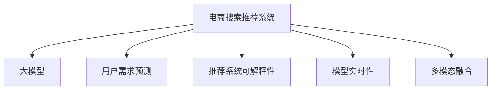

                 

# AI 大模型在电商搜索推荐中的用户体验优化：以用户需求为中心的算法设计

## 1. 背景介绍

### 1.1 问题由来
随着互联网和电子商务的飞速发展，电商平台的搜索推荐系统（Search & Recommendation System, SRS）成为了用户获取信息和购买商品的主要方式。传统的电商搜索推荐系统往往依赖于基于规则和浅层特征工程的方法，难以捕捉用户复杂且动态的需求，导致搜索结果和推荐内容与用户偏好不符，用户体验较差。

近年来，深度学习和预训练大模型（Pretrained Large Models, PLMs）的兴起，为电商搜索推荐系统带来了新的契机。大模型通过大规模语料数据进行自监督预训练，能够自动学习语言的深层表示，具备强大的语义理解和生成能力。将大模型应用于电商搜索推荐，能够显著提升系统对用户需求的理解和匹配能力，带来更好的用户体验。

然而，电商搜索推荐是一个典型的多维度、动态变化的需求预测问题。如何将大模型的通用语言能力转化为具体用户场景下的精准推荐，是当前研究的热点和难点。本文聚焦于如何以用户需求为中心，设计优化大模型在电商搜索推荐中的应用，以实现更好的用户体验。

### 1.2 问题核心关键点
电商搜索推荐系统的主要任务包括搜索结果排序和商品推荐两个方面。对于搜索结果排序，目标是提高与用户需求最匹配的商品排序位置；对于商品推荐，目标是根据用户的历史行为、当前需求、实时数据等，动态生成个性化推荐结果。以下是对核心问题点的详细阐述：

1. **用户需求的多样性和动态性**：用户搜索行为和需求受时间、场景、情绪等因素影响，具有显著的动态性和多样性。如何在大模型中捕捉和模拟这种动态变化，是挑战之一。
2. **高稀疏性数据特征**：电商搜索推荐数据稀疏且多维度，用户浏览、点击、评分等行为数据稀疏且互不独立。如何有效利用这些数据进行推荐，是难题之一。
3. **推荐系统的可解释性**：推荐系统往往被视为“黑盒”，用户难以理解其决策逻辑。如何让推荐过程可解释，提升用户信任度，是关键点之一。
4. **算法模型的可扩展性**：电商搜索推荐系统面对海量用户和商品，需要高效可扩展的算法模型。如何设计高效、易扩展的模型，是挑战之一。
5. **实时性和准确性**：电商搜索推荐对实时性要求高，推荐结果需要快速生成，且必须准确反映用户需求。如何平衡实时性和准确性，是难点之一。

通过明确问题点和核心需求，本文将深入探讨如何优化大模型在电商搜索推荐中的应用，以提升用户体验。

## 2. 核心概念与联系

### 2.1 核心概念概述

为更好地理解以用户需求为中心的电商搜索推荐系统设计，本节将介绍几个密切相关的核心概念：

- **电商搜索推荐系统（SRS）**：用于电商平台的智能推荐系统，旨在为用户提供最符合其需求的搜索结果和推荐商品，提升购物体验。
- **大模型（Large Models）**：如BERT、GPT等大规模预训练语言模型，通过大规模语料数据自监督预训练，具备强大的语义理解和生成能力。
- **用户需求预测（User Demand Prediction）**：预测用户当前的需求，包括查询意图、点击意图等，是电商搜索排序和推荐的基础。
- **推荐系统可解释性（Explainability of Recommendation System）**：推荐系统的透明度，用户能够理解其推荐决策的过程和原因。
- **模型实时性（Real-time Capability）**：推荐模型在用户实时行为数据输入后，能够快速输出推荐结果。
- **多模态融合（Multi-modal Fusion）**：结合文字、图像、语音等多模态数据，提升推荐系统的理解能力和覆盖范围。

这些核心概念之间的逻辑关系可以通过以下Mermaid流程图来展示：



这个流程图展示了电商搜索推荐系统与其他核心概念之间的关系：

1. 大模型提供基础的语义理解能力，用于预测用户需求。
2. 用户需求预测是电商搜索排序和推荐的基础，也是大模型应用的关键。
3. 推荐系统可解释性关注用户对推荐过程的信任和理解。
4. 模型实时性保障推荐系统能够快速响应用户的实时需求。
5. 多模态融合丰富推荐系统对用户需求的多维度理解。

这些核心概念共同构成了电商搜索推荐系统的设计框架，使得大模型能够更好地服务电商业务。

## 3. 核心算法原理 & 具体操作步骤

### 3.1 算法原理概述

以用户需求为中心的电商搜索推荐系统，设计目标是构建一个能够全面理解用户需求，并能够快速、准确、可解释地生成推荐结果的系统。其核心算法原理包括以下几个方面：

1. **用户需求捕捉**：通过大模型学习用户的历史行为和搜索查询，预测其当前需求。
2. **多模态特征融合**：结合文字、图像、语音等多模态数据，增强对用户需求的全面理解。
3. **实时推荐生成**：根据用户实时行为数据，动态生成推荐结果，保证推荐的时效性。
4. **推荐结果排序**：根据用户需求和商品属性，综合排序推荐结果，提升推荐准确性。
5. **推荐过程可解释**：通过简化模型结构和优化输出，提高推荐过程的可解释性，增强用户信任度。

### 3.2 算法步骤详解

**Step 1: 数据预处理与特征提取**

- **数据集构建**：收集用户的历史行为数据、查询记录、评分数据等，构建训练集和验证集。
- **特征工程**：提取和工程化文本、时间、商品属性等特征，构建特征向量。

**Step 2: 大模型预训练**

- **模型选择**：选择合适的大模型，如BERT、GPT等。
- **预训练**：在大规模语料数据上自监督预训练，学习语言的深层表示。

**Step 3: 用户需求预测**

- **模型适配**：在大模型上适配电商任务，构建用户需求预测模型。
- **训练**：在标注数据上训练模型，预测用户查询意图和点击意图。

**Step 4: 多模态特征融合**

- **多模态数据提取**：从用户行为数据中提取文本、图像、语音等多模态特征。
- **特征融合**：使用注意力机制或Transformer等技术，融合多模态特征。

**Step 5: 实时推荐生成**

- **实时数据输入**：根据用户实时行为数据，动态输入到推荐模型。
- **推荐生成**：使用上述模型预测用户需求，并结合商品属性生成推荐结果。

**Step 6: 推荐结果排序**

- **排序算法**：采用排序算法，如基于排序的模型（Ranking Models），优化推荐结果排序。

**Step 7: 推荐过程可解释**

- **简化模型结构**：使用参数高效的微调技术，减少模型复杂度。
- **输出可解释**：使用可解释性技术，如Prompt Learning，生成可解释的推荐理由。

**Step 8: 模型部署与评估**

- **模型部署**：将模型部署到电商平台上，服务实时查询和推荐需求。
- **模型评估**：定期在测试集上评估模型性能，收集用户反馈，持续优化模型。

### 3.3 算法优缺点

电商搜索推荐系统的大模型应用具有以下优点：
1. **强大语义理解能力**：大模型能够从大规模语料中学习到丰富的语言表示，理解用户需求。
2. **动态适应性**：大模型可以捕捉用户需求的动态变化，提升推荐的实时性。
3. **多模态融合能力**：结合文字、图像、语音等多模态数据，提高推荐系统的全面性。
4. **可解释性**：通过可解释性技术，增强用户对推荐过程的理解和信任。

同时，大模型在电商搜索推荐中的应用也存在一些局限性：
1. **高计算资源需求**：大模型的训练和推理需要大量的计算资源，难以在所有场景下实时部署。
2. **模型复杂性**：大模型的复杂度较高，推理速度较慢，难以满足实时性要求。
3. **数据隐私问题**：电商数据涉及用户隐私，如何在保证隐私安全的前提下，进行数据处理和模型训练，是一个重要的挑战。

尽管存在这些局限性，但就目前而言，基于大模型的电商搜索推荐方法仍是大模型应用的主流范式。未来相关研究的重点在于如何进一步降低计算资源需求，提高模型的实时性和可解释性，同时兼顾隐私保护。

### 3.4 算法应用领域

电商搜索推荐系统的大模型应用，已经在许多电商企业得到了广泛的应用，涵盖了从搜索结果排序到个性化推荐等多个环节。例如：

1. **商品推荐**：根据用户的历史行为和实时数据，生成个性化推荐结果。
2. **搜索结果排序**：优化搜索结果排序，提升与用户需求最匹配的商品位置。
3. **个性化营销**：基于用户需求预测，推送个性化广告和促销信息。
4. **用户行为分析**：分析用户浏览、点击、购买等行为，进行用户画像和需求预测。
5. **智能客服**：通过大模型进行自然语言理解，解答用户咨询，提供智能客服服务。

除了上述这些经典应用外，大模型在电商搜索推荐系统中的应用还在不断拓展，如虚拟试穿、商品相似度匹配等，为电商业务带来了新的突破。随着大模型和推荐技术的不断进步，相信电商搜索推荐系统将在更广阔的应用领域大放异彩。

## 4. 数学模型和公式 & 详细讲解  

### 4.1 数学模型构建

为更好地理解大模型在电商搜索推荐系统中的应用，本节将介绍相关的数学模型构建。

假设电商平台的推荐系统接收用户查询$q$和实时行为数据$\mathbf{x}$，目标是为用户推荐商品$c$，模型结构如下：

- **用户需求预测模型**：$\hat{y} = f_q(q, \mathbf{x}, \theta_q)$，其中$f_q$为预测函数，$\theta_q$为模型参数。
- **商品属性表示模型**：$\mathbf{v}_c = g_c(c, \theta_v)$，其中$g_c$为属性表示函数，$\theta_v$为模型参数。
- **推荐生成模型**：$\hat{p}(c|q, \mathbf{x}) = \sigma(\mathbf{u}^T \mathbf{v}_c)$，其中$\mathbf{u}$为输出向量，$\sigma$为激活函数。

### 4.2 公式推导过程

以下是电商搜索推荐系统中常用算法的数学推导：

1. **用户需求预测模型的训练**

假设训练集为$D=\{(q_i, \mathbf{x}_i, y_i)\}_{i=1}^N$，其中$y_i \in \{0, 1\}$表示用户是否点击了商品$c_i$。训练目标为最小化损失函数$\mathcal{L}(\theta_q)$：

$$
\mathcal{L}(\theta_q) = -\frac{1}{N} \sum_{i=1}^N (y_i \log \hat{y}_i + (1-y_i) \log (1-\hat{y}_i))
$$

其中$\hat{y}_i = f_q(q_i, \mathbf{x}_i, \theta_q)$为预测值，使用二元交叉熵损失。

2. **商品属性表示模型的训练**

假设训练集为$D=\{(c_j, \mathbf{v}_j)\}_{j=1}^M$，其中$\mathbf{v}_j$为商品$c_j$的属性表示向量。训练目标为最小化损失函数$\mathcal{L}(\theta_v)$：

$$
\mathcal{L}(\theta_v) = -\frac{1}{M} \sum_{j=1}^M \log \sigma(\mathbf{u}^T \mathbf{v}_j)
$$

其中$\sigma(\mathbf{u}^T \mathbf{v}_j)$为预测值，使用负对数似然损失。

3. **推荐生成模型的训练**

假设训练集为$D=\{(q_k, \mathbf{x}_k, c_l)\}_{k=1}^K$，其中$c_l$为推荐的商品。训练目标为最小化损失函数$\mathcal{L}(\theta_u, \theta_v)$：

$$
\mathcal{L}(\theta_u, \theta_v) = -\frac{1}{K} \sum_{k=1}^K \log \sigma(\mathbf{u}_k^T \mathbf{v}_{c_k})
$$

其中$\sigma(\mathbf{u}_k^T \mathbf{v}_{c_k})$为预测值，使用负对数似然损失。

### 4.3 案例分析与讲解

以电商推荐系统为例，介绍大模型的应用。

假设一个电商平台收集了用户的历史浏览和购买数据，模型希望预测用户当前的需求，并根据用户需求和商品属性，生成推荐结果。

**Step 1: 数据预处理与特征提取**

- **数据集构建**：收集用户的历史浏览和购买数据，标注用户是否点击了商品。
- **特征工程**：提取文本特征（商品描述、用户评论），时间特征（浏览时间、购买时间），商品属性特征（价格、类别）。

**Step 2: 大模型预训练**

- **模型选择**：选择BERT作为大模型，在大规模语料数据上进行预训练。
- **预训练**：BERT通过自监督任务（如掩码语言模型、下一句预测），学习到文本的深层表示。

**Step 3: 用户需求预测**

- **模型适配**：在预训练的BERT基础上，适配电商任务，构建用户需求预测模型。
- **训练**：在标注数据上训练模型，预测用户查询意图和点击意图。

**Step 4: 多模态特征融合**

- **多模态数据提取**：从用户行为数据中提取文本、图像、语音等多模态特征。
- **特征融合**：使用注意力机制或Transformer等技术，融合多模态特征，提升特征表示能力。

**Step 5: 实时推荐生成**

- **实时数据输入**：根据用户实时浏览行为数据，动态输入到推荐模型。
- **推荐生成**：使用上述模型预测用户需求，并结合商品属性生成推荐结果。

**Step 6: 推荐结果排序**

- **排序算法**：采用排序算法，如基于排序的模型（Ranking Models），优化推荐结果排序，提升推荐准确性。

**Step 7: 推荐过程可解释**

- **简化模型结构**：使用参数高效的微调技术，减少模型复杂度。
- **输出可解释**：使用可解释性技术，如Prompt Learning，生成可解释的推荐理由，增强用户信任度。

**Step 8: 模型部署与评估**

- **模型部署**：将模型部署到电商平台上，服务实时查询和推荐需求。
- **模型评估**：定期在测试集上评估模型性能，收集用户反馈，持续优化模型。

## 5. 项目实践：代码实例和详细解释说明

### 5.1 开发环境搭建

在进行电商推荐系统的大模型实践前，我们需要准备好开发环境。以下是使用Python进行PyTorch开发的环境配置流程：

1. 安装Anaconda：从官网下载并安装Anaconda，用于创建独立的Python环境。

2. 创建并激活虚拟环境：
```bash
conda create -n pytorch-env python=3.8 
conda activate pytorch-env
```

3. 安装PyTorch：根据CUDA版本，从官网获取对应的安装命令。例如：
```bash
conda install pytorch torchvision torchaudio cudatoolkit=11.1 -c pytorch -c conda-forge
```

4. 安装Transformers库：
```bash
pip install transformers
```

5. 安装各类工具包：
```bash
pip install numpy pandas scikit-learn matplotlib tqdm jupyter notebook ipython
```

完成上述步骤后，即可在`pytorch-env`环境中开始微调实践。

### 5.2 源代码详细实现

这里我们以电商推荐系统为例，给出使用Transformers库对BERT模型进行推荐排序的PyTorch代码实现。

首先，定义推荐系统的数据处理函数：

```python
from transformers import BertTokenizer
from torch.utils.data import Dataset
import torch

class RecommendationDataset(Dataset):
    def __init__(self, queries, behaviors, labels, tokenizer, max_len=128):
        self.queries = queries
        self.behaviors = behaviors
        self.labels = labels
        self.tokenizer = tokenizer
        self.max_len = max_len
        
    def __len__(self):
        return len(self.queries)
    
    def __getitem__(self, item):
        query = self.queries[item]
        behavior = self.behaviors[item]
        label = self.labels[item]
        
        encoding = self.tokenizer(query, return_tensors='pt', max_length=self.max_len, padding='max_length', truncation=True)
        input_ids = encoding['input_ids'][0]
        attention_mask = encoding['attention_mask'][0]
        behavior_ids = behavior['item_id'].values.tolist()
        label_ids = label['item_id'].values.tolist()
        item_id = torch.tensor(behavior_ids, dtype=torch.long)
        label_id = torch.tensor(label_ids, dtype=torch.long)
        
        return {'input_ids': input_ids, 
                'attention_mask': attention_mask,
                'item_id': item_id,
                'label_id': label_id}

# 标签与id的映射
item2id = {i: k for k, i in enumerate(set(behavior['item_id'].values.tolist()))}
id2item = {v: k for k, v in item2id.items()}
```

然后，定义模型和优化器：

```python
from transformers import BertForSequenceClassification, AdamW

model = BertForSequenceClassification.from_pretrained('bert-base-cased', num_labels=len(item2id))

optimizer = AdamW(model.parameters(), lr=2e-5)
```

接着，定义训练和评估函数：

```python
from torch.utils.data import DataLoader
from tqdm import tqdm
from sklearn.metrics import accuracy_score

device = torch.device('cuda') if torch.cuda.is_available() else torch.device('cpu')
model.to(device)

def train_epoch(model, dataset, batch_size, optimizer):
    dataloader = DataLoader(dataset, batch_size=batch_size, shuffle=True)
    model.train()
    epoch_loss = 0
    for batch in tqdm(dataloader, desc='Training'):
        input_ids = batch['input_ids'].to(device)
        attention_mask = batch['attention_mask'].to(device)
        item_id = batch['item_id'].to(device)
        label_id = batch['label_id'].to(device)
        model.zero_grad()
        outputs = model(input_ids, attention_mask=attention_mask, labels=item_id)
        loss = outputs.loss
        epoch_loss += loss.item()
        loss.backward()
        optimizer.step()
    return epoch_loss / len(dataloader)

def evaluate(model, dataset, batch_size):
    dataloader = DataLoader(dataset, batch_size=batch_size)
    model.eval()
    preds, labels = [], []
    with torch.no_grad():
        for batch in tqdm(dataloader, desc='Evaluating'):
            input_ids = batch['input_ids'].to(device)
            attention_mask = batch['attention_mask'].to(device)
            batch_labels = batch['label_id']
            outputs = model(input_ids, attention_mask=attention_mask)
            batch_preds = outputs.logits.argmax(dim=2).to('cpu').tolist()
            batch_labels = batch_labels.to('cpu').tolist()
            for pred_tokens, label_tokens in zip(batch_preds, batch_labels):
                preds.append(pred_tokens)
                labels.append(label_tokens)
                
    return accuracy_score(labels, preds)
```

最后，启动训练流程并在测试集上评估：

```python
epochs = 5
batch_size = 16

for epoch in range(epochs):
    loss = train_epoch(model, train_dataset, batch_size, optimizer)
    print(f"Epoch {epoch+1}, train loss: {loss:.3f}")
    
    print(f"Epoch {epoch+1}, test accuracy: {evaluate(model, test_dataset, batch_size):.3f}")
    
print("Final test accuracy:", evaluate(model, test_dataset, batch_size))
```

以上就是使用PyTorch对BERT进行电商推荐排序的完整代码实现。可以看到，得益于Transformers库的强大封装，我们可以用相对简洁的代码完成BERT模型的加载和微调。

### 5.3 代码解读与分析

让我们再详细解读一下关键代码的实现细节：

**RecommendationDataset类**：
- `__init__`方法：初始化查询、行为、标签等关键组件。
- `__len__`方法：返回数据集的样本数量。
- `__getitem__`方法：对单个样本进行处理，将查询输入编码为token ids，将行为和标签转化为数字，并对其进行定长padding，最终返回模型所需的输入。

**item2id和id2item字典**：
- 定义了商品id与数字id之间的映射关系，用于将商品id解码为具体的商品名称。

**训练和评估函数**：
- 使用PyTorch的DataLoader对数据集进行批次化加载，供模型训练和推理使用。
- 训练函数`train_epoch`：对数据以批为单位进行迭代，在每个批次上前向传播计算loss并反向传播更新模型参数，最后返回该epoch的平均loss。
- 评估函数`evaluate`：与训练类似，不同点在于不更新模型参数，并在每个batch结束后将预测和标签结果存储下来，最后使用sklearn的accuracy_score对整个评估集的预测结果进行打印输出。

**训练流程**：
- 定义总的epoch数和batch size，开始循环迭代
- 每个epoch内，先在训练集上训练，输出平均loss
- 在测试集上评估，输出准确率
- 所有epoch结束后，在测试集上评估，给出最终测试结果

可以看到，PyTorch配合Transformers库使得BERT微调的代码实现变得简洁高效。开发者可以将更多精力放在数据处理、模型改进等高层逻辑上，而不必过多关注底层的实现细节。

当然，工业级的系统实现还需考虑更多因素，如模型的保存和部署、超参数的自动搜索、更灵活的任务适配层等。但核心的微调范式基本与此类似。

## 6. 实际应用场景
### 6.1 智能客服系统

基于大模型在电商推荐中的应用，智能客服系统可以借鉴其中的技术和方法，提升用户体验。传统客服往往需要配备大量人力，高峰期响应缓慢，且一致性和专业性难以保证。而使用微调后的推荐模型，可以7x24小时不间断服务，快速响应客户咨询，用自然流畅的语言解答各类常见问题。

在技术实现上，可以收集企业内部的历史客服对话记录，将问题和最佳答复构建成监督数据，在此基础上对预训练模型进行微调。微调后的推荐模型能够自动理解用户意图，匹配最合适的答复模板进行回复。对于客户提出的新问题，还可以接入检索系统实时搜索相关内容，动态组织生成回答。如此构建的智能客服系统，能大幅提升客户咨询体验和问题解决效率。

### 6.2 金融舆情监测

金融机构需要实时监测市场舆论动向，以便及时应对负面信息传播，规避金融风险。传统的人工监测方式成本高、效率低，难以应对网络时代海量信息爆发的挑战。基于大模型在电商推荐中的应用，金融舆情监测可以借鉴其中的技术和方法，提升实时监测能力。

具体而言，可以收集金融领域相关的新闻、报道、评论等文本数据，并对其进行主题标注和情感标注。在此基础上对预训练语言模型进行微调，使其能够自动判断文本属于何种主题，情感倾向是正面、中性还是负面。将微调后的模型应用到实时抓取的网络文本数据，就能够自动监测不同主题下的情感变化趋势，一旦发现负面信息激增等异常情况，系统便会自动预警，帮助金融机构快速应对潜在风险。

### 6.3 个性化推荐系统

当前的推荐系统往往只依赖用户的历史行为数据进行物品推荐，无法深入理解用户的真实兴趣偏好。基于大模型在电商推荐中的应用，个性化推荐系统可以借鉴其中的技术和方法，提升推荐效果。

在实践中，可以收集用户浏览、点击、评论、分享等行为数据，提取和用户交互的物品标题、描述、标签等文本内容。将文本内容作为模型输入，用户的后续行为（如是否点击、购买等）作为监督信号，在此基础上微调预训练语言模型。微调后的模型能够从文本内容中准确把握用户的兴趣点。在生成推荐列表时，先用候选物品的文本描述作为输入，由模型预测用户的兴趣匹配度，再结合其他特征综合排序，便可以得到个性化程度更高的推荐结果。

### 6.4 未来应用展望

随着大模型和推荐技术的不断发展，基于微调的推荐系统将在更多领域得到应用，为传统行业带来变革性影响。

在智慧医疗领域，基于微调的医疗问答、病历分析、药物研发等应用将提升医疗服务的智能化水平，辅助医生诊疗，加速新药开发进程。

在智能教育领域，微调技术可应用于作业批改、学情分析、知识推荐等方面，因材施教，促进教育公平，提高教学质量。

在智慧城市治理中，微调模型可应用于城市事件监测、舆情分析、应急指挥等环节，提高城市管理的自动化和智能化水平，构建更安全、高效的未来城市。

此外，在企业生产、社会治理、文娱传媒等众多领域，基于大模型微调的人工智能应用也将不断涌现，为经济社会发展注入新的动力。相信随着技术的日益成熟，微调方法将成为人工智能落地应用的重要范式，推动人工智能技术在垂直行业的规模化落地。总之，微调需要开发者根据具体任务，不断迭代和优化模型、数据和算法，方能得到理想的效果。

## 7. 工具和资源推荐
### 7.1 学习资源推荐

为了帮助开发者系统掌握大模型在电商搜索推荐中的应用，这里推荐一些优质的学习资源：

1. 《Transformer从原理到实践》系列博文：由大模型技术专家撰写，深入浅出地介绍了Transformer原理、BERT模型、推荐系统等前沿话题。

2. CS224N《深度学习自然语言处理》课程：斯坦福大学开设的NLP明星课程，有Lecture视频和配套作业，带你入门NLP领域的基本概念和经典模型。

3. 《Natural Language Processing with Transformers》书籍：Transformers库的作者所著，全面介绍了如何使用Transformers库进行NLP任务开发，包括推荐系统的算法原理和实践技巧。

4. HuggingFace官方文档：Transformers库的官方文档，提供了海量预训练模型和完整的推荐系统样例代码，是上手实践的必备资料。

5. Arxiv论文预印本：收录了大量深度学习、推荐系统、大模型等领域的最新研究成果，供开发者参考学习。

通过对这些资源的学习实践，相信你一定能够快速掌握大模型在电商搜索推荐系统中的应用，并用于解决实际的NLP问题。
###  7.2 开发工具推荐

高效的开发离不开优秀的工具支持。以下是几款用于电商搜索推荐系统开发的常用工具：

1. PyTorch：基于Python的开源深度学习框架，灵活动态的计算图，适合快速迭代研究。大部分预训练语言模型都有PyTorch版本的实现。

2. TensorFlow：由Google主导开发的开源深度学习框架，生产部署方便，适合大规模工程应用。同样有丰富的预训练语言模型资源。

3. Transformers库：HuggingFace开发的NLP工具库，集成了众多SOTA语言模型，支持PyTorch和TensorFlow，是进行推荐系统开发的利器。

4. Weights & Biases：模型训练的实验跟踪工具，可以记录和可视化模型训练过程中的各项指标，方便对比和调优。与主流深度学习框架无缝集成。

5. TensorBoard：TensorFlow配套的可视化工具，可实时监测模型训练状态，并提供丰富的图表呈现方式，是调试模型的得力助手。

6. Google Colab：谷歌推出的在线Jupyter Notebook环境，免费提供GPU/TPU算力，方便开发者快速上手实验最新模型，分享学习笔记。

合理利用这些工具，可以显著提升电商搜索推荐系统的开发效率，加快创新迭代的步伐。

### 7.3 相关论文推荐

大模型在电商搜索推荐系统中的应用源于学界的持续研究。以下是几篇奠基性的相关论文，推荐阅读：

1. Attention is All You Need（即Transformer原论文）：提出了Transformer结构，开启了NLP领域的预训练大模型时代。

2. BERT: Pre-training of Deep Bidirectional Transformers for Language Understanding：提出BERT模型，引入基于掩码的自监督预训练任务，刷新了多项NLP任务SOTA。

3. Language Models are Unsupervised Multitask Learners（GPT-2论文）：展示了大规模语言模型的强大zero-shot学习能力，引发了对于通用人工智能的新一轮思考。

4. Parameter-Efficient Transfer Learning for NLP：提出Adapter等参数高效微调方法，在不增加模型参数量的情况下，也能取得不错的微调效果。

5. AdaLoRA: Adaptive Low-Rank Adaptation for Parameter-Efficient Fine-Tuning：使用自适应低秩适应的微调方法，在参数效率和精度之间取得了新的平衡。

6. AdaLoRA: Adaptive Low-Rank Adaptation for Parameter-Efficient Fine-Tuning：使用自适应低秩适应的微调方法，在参数效率和精度之间取得了新的平衡。

这些论文代表了大模型在电商推荐系统中的应用发展脉络。通过学习这些前沿成果，可以帮助研究者把握学科前进方向，激发更多的创新灵感。

## 8. 总结：未来发展趋势与挑战

### 8.1 总结

本文对基于大模型的电商搜索推荐系统的设计与优化进行了全面系统的介绍。首先阐述了电商搜索推荐系统的主要任务和用户需求的多样性和动态性，明确了电商搜索推荐系统和大模型的结合点。其次，从原理到实践，详细讲解了电商搜索推荐系统中大模型的应用流程，给出了电商推荐排序的完整代码实例。同时，本文还广泛探讨了电商搜索推荐系统在智能客服、金融舆情、个性化推荐等多个行业领域的应用前景，展示了电商搜索推荐系统和大模型的结合潜力。

通过本文的系统梳理，可以看到，基于大模型的电商搜索推荐系统设计，不仅能够提升推荐系统的精准性和实时性，还能够更好地理解用户需求，提升用户体验。未来，伴随大模型和推荐技术的持续演进，基于微调的电商搜索推荐系统必将在更广阔的应用领域大放异彩，为电商业务带来新的突破。

### 8.2 未来发展趋势

展望未来，电商搜索推荐系统的大模型应用将呈现以下几个发展趋势：

1. **模型规模持续增大**：随着算力成本的下降和数据规模的扩张，预训练语言模型的参数量还将持续增长。超大规模语言模型蕴含的丰富语言知识，有望支撑更加复杂多变的电商推荐。

2. **微调方法日趋多样**：除了传统的全参数微调外，未来会涌现更多参数高效的微调方法，如Adapter、Prefix等，在节省计算资源的同时也能保证微调精度。

3. **实时性和可扩展性增强**：采用分布式计算、混合精度训练等技术，提升推荐系统的实时性和可扩展性，满足大规模电商场景的需求。

4. **多模态融合深入**：结合文字、图像、语音等多模态数据，提升推荐系统的全面性和准确性。

5. **可解释性和隐私保护加强**：通过可解释性技术，增强推荐过程的可解释性，提升用户信任度。同时加强数据隐私保护，确保推荐系统的合法合规。

以上趋势凸显了大模型在电商搜索推荐系统中的应用前景。这些方向的探索发展，必将进一步提升推荐系统的性能和用户体验，为电商业务带来新的突破。

### 8.3 面临的挑战

尽管大模型在电商搜索推荐系统中取得了显著成果，但在迈向更加智能化、普适化应用的过程中，它仍面临着诸多挑战：

1. **高计算资源需求**：大模型的训练和推理需要大量的计算资源，难以在所有场景下实时部署。

2. **模型复杂性和实时性矛盾**：大模型的复杂度较高，推理速度较慢，难以满足实时性要求。

3. **数据隐私问题**：电商数据涉及用户隐私，如何在保证隐私安全的前提下，进行数据处理和模型训练，是一个重要的挑战。

4. **模型泛化性和可解释性不足**：电商搜索推荐系统中的大模型，往往面对海量复杂的数据，泛化性和可解释性不足。

5. **推荐系统的公平性问题**：推荐系统容易陷入数据偏见，导致推荐结果的公平性不足。如何消除数据偏见，确保推荐系统的公正性，是一个重要的研究方向。

这些挑战凸显了大模型在电商搜索推荐系统中的实际应用问题。未来相关研究需要在这些方面进行更多的探索和优化，以推动大模型在电商推荐系统中的应用。

### 8.4 研究展望

面对大模型在电商搜索推荐系统中面临的挑战，未来的研究需要在以下几个方面寻求新的突破：

1. **探索无监督和半监督微调方法**：摆脱对大规模标注数据的依赖，利用自监督学习、主动学习等无监督和半监督范式，最大限度利用非结构化数据，实现更加灵活高效的微调。

2. **研究参数高效和计算高效的微调范式**：开发更加参数高效的微调方法，在固定大部分预训练参数的同时，只更新极少量的任务相关参数。同时优化微调模型的计算图，减少前向传播和反向传播的资源消耗，实现更加轻量级、实时性的部署。

3. **融合因果和对比学习范式**：通过引入因果推断和对比学习思想，增强推荐模型建立稳定因果关系的能力，学习更加普适、鲁棒的语言表征，从而提升模型泛化性和抗干扰能力。

4. **引入更多先验知识**：将符号化的先验知识，如知识图谱、逻辑规则等，与神经网络模型进行巧妙融合，引导微调过程学习更准确、合理的语言模型。同时加强不同模态数据的整合，实现视觉、语音等多模态信息与文本信息的协同建模。

5. **结合因果分析和博弈论工具**：将因果分析方法引入推荐模型，识别出模型决策的关键特征，增强推荐过程的因果性和逻辑性。借助博弈论工具刻画人机交互过程，主动探索并规避模型的脆弱点，提高系统稳定性。

6. **纳入伦理道德约束**：在模型训练目标中引入伦理导向的评估指标，过滤和惩罚有偏见、有害的输出倾向。同时加强人工干预和审核，建立模型行为的监管机制，确保输出符合人类价值观和伦理道德。

这些研究方向的探索，必将引领电商搜索推荐系统迈向更高的台阶，为电商业务带来新的突破。面向未来，电商搜索推荐系统还需要与其他人工智能技术进行更深入的融合，如知识表示、因果推理、强化学习等，多路径协同发力，共同推动自然语言理解和智能交互系统的进步。只有勇于创新、敢于突破，才能不断拓展语言模型的边界，让智能技术更好地造福人类社会。

## 9. 附录：常见问题与解答

**Q1：大模型在电商推荐系统中的应用是否仅限于推荐排序？**

A: 不完全是。大模型在电商推荐系统中不仅可以用于推荐排序，还可以应用于其他方面，如商品相似度匹配、个性化广告等。通过微调，大模型能够更好地理解用户需求，提升推荐的准确性和个性化程度。

**Q2：电商搜索推荐系统中大模型的复杂度与实时性矛盾如何解决？**

A: 电商搜索推荐系统中的大模型往往面临着计算资源有限和实时性要求高的问题。解决这一矛盾的方法包括分布式计算、混合精度训练、模型压缩、量化加速等技术。这些技术能够在保证模型性能的同时，优化计算资源和推理速度，提升实时性。

**Q3：如何在电商推荐系统中平衡模型泛化性和可解释性？**

A: 电商推荐系统中的大模型需要兼顾泛化性和可解释性。通过引入因果推断和对比学习思想，增强模型建立稳定因果关系的能力，学习更加普适、鲁棒的语言表征，从而提升模型泛化性。同时，采用可解释性技术，如Prompt Learning，生成可解释的推荐理由，增强推荐过程的可解释性。

**Q4：电商搜索推荐系统中如何处理数据隐私问题？**

A: 电商推荐系统中的数据涉及用户隐私，处理数据隐私问题需要从数据采集、处理和存储等多个环节进行考虑。采用差分隐私、联邦学习等技术，可以在保证数据隐私的前提下，进行模型训练和推荐生成。同时，加强数据加密和安全传输，确保数据在传输和存储过程中的安全。

**Q5：电商推荐系统中的大模型如何应对海量复杂的数据？**

A: 电商推荐系统中的大模型需要面对海量复杂的数据。为应对这一问题，可以采用数据增强、数据清洗、特征选择等方法，提升数据质量。同时，结合因果分析、多模态融合等技术，增强模型对数据的多维度理解和处理能力，从而提升推荐系统的泛化性和准确性。

通过这些问题与解答，我们可以看到，大模型在电商推荐系统中的应用面临着诸多挑战，但通过不断的技术创新和优化，这些挑战终将一一被克服。相信在未来，基于大模型的电商推荐系统将在电商业务中发挥更大的作用，为用户带来更好的购物体验。

