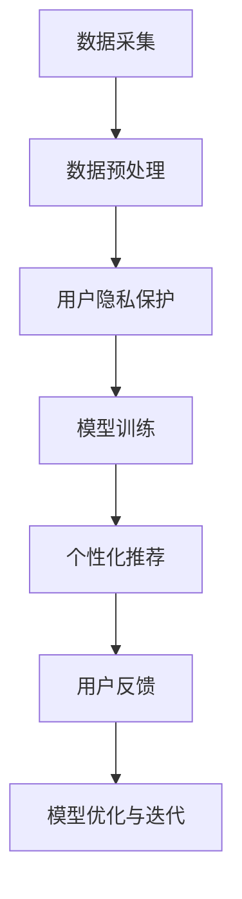
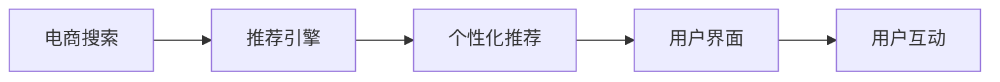
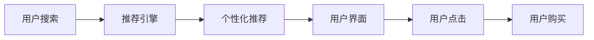
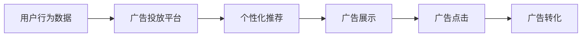

                 

## 1. 背景介绍

在数字化转型浪潮下，电商企业积极利用AI大模型驱动个性化推荐系统，以优化用户体验，提升转化率和留存率。然而，个性化推荐在提升商业价值的同时，也引发了用户隐私保护的广泛关注。如何在追求高质量推荐的同时，确保用户隐私权益，成为电商搜索推荐领域亟待解决的难题。本文旨在探索AI大模型在电商搜索推荐中实现用户隐私保护的有效措施，平衡推荐效果与用户隐私。

## 2. 核心概念与联系

### 2.1 核心概念概述

- **AI大模型**：基于深度学习的大规模神经网络模型，如BERT、GPT-3、Transformer等，具备强大的自然语言处理能力。
- **个性化推荐系统**：利用用户行为数据和AI模型，为用户推荐符合其兴趣和需求的电商商品。
- **用户隐私保护**：保护用户的个人信息和数据安全，避免数据泄露和滥用。
- **数据匿名化**：将用户数据进行去标识化处理，保护用户隐私，防止个人身份识别。
- **差分隐私**：在数据分析或模型训练过程中，加入噪声，限制单个用户数据的敏感性。
- **联邦学习**：多方参与计算，模型在本地训练后，参数在无需传输数据的情况下进行共享更新。

这些概念通过AI大模型和个性化推荐系统构建的推荐流程紧密联系，如图：



其中：

- **数据采集**：从用户行为、历史浏览记录等获取数据。
- **数据预处理**：清洗和标注数据，便于后续处理。
- **用户隐私保护**：在数据处理和模型训练过程中，采用差分隐私和数据匿名化等技术保护用户隐私。
- **模型训练**：利用AI大模型进行个性化推荐模型的训练。
- **个性化推荐**：利用训练好的模型，对新用户进行推荐。
- **用户反馈**：收集用户的反馈信息，进行模型优化和迭代。

### 2.2 核心概念原理和架构的 Mermaid 流程图


以上流程展示了从用户数据到个性化推荐模型优化的整体过程。数据隐私保护技术的应用，确保了用户隐私权益，同时也提升了推荐模型的泛化能力和鲁棒性。

## 3. 核心算法原理 & 具体操作步骤

### 3.1 算法原理概述

AI大模型在电商搜索推荐中的核心算法原理包括数据预处理、用户隐私保护和个性化推荐模型训练。具体来说，需要：

1. **数据预处理**：对原始数据进行清洗和标注，便于后续处理。
2. **用户隐私保护**：在数据处理和模型训练过程中，应用差分隐私、数据匿名化等技术。
3. **个性化推荐模型训练**：利用AI大模型进行个性化推荐模型的训练和优化。

### 3.2 算法步骤详解

#### 3.2.1 数据预处理

数据预处理包括数据清洗、特征工程和数据标注等步骤：

1. **数据清洗**：去除无用、缺失或异常数据，保留高质量的数据。
2. **特征工程**：根据业务需求，选择和构造有意义的特征。
3. **数据标注**：为训练数据添加标签，如用户行为标签、商品属性标签等。

#### 3.2.2 用户隐私保护

隐私保护包括数据匿名化和差分隐私两个关键步骤：

1. **数据匿名化**：通过替换、去标识化等手段，使数据无法直接识别用户身份。例如，使用K-匿名化、L-多样化等方法，使单个用户的特征难以被识别。
2. **差分隐私**：在数据处理和模型训练过程中，加入噪声，减少单个用户数据的敏感性。例如，使用拉普拉斯机制、高斯机制等方法，保护用户隐私。

#### 3.2.3 个性化推荐模型训练

个性化推荐模型训练涉及模型选择、损失函数定义和模型优化等步骤：

1. **模型选择**：根据业务需求选择合适的推荐模型，如协同过滤、内容推荐、混合推荐等。
2. **损失函数定义**：定义推荐模型的损失函数，衡量推荐结果与实际用户行为的一致性。例如，使用平均绝对误差、均方误差等。
3. **模型优化**：利用AI大模型进行模型训练和优化。例如，使用随机梯度下降、Adam等优化算法，最小化损失函数。

### 3.3 算法优缺点

**优点**：

1. **提高推荐效果**：利用AI大模型的强大能力，提高个性化推荐的精准度和覆盖率。
2. **增强用户隐私保护**：通过数据匿名化和差分隐私等技术，确保用户隐私权益。

**缺点**：

1. **计算资源消耗大**：AI大模型训练和推理的计算资源消耗较大。
2. **隐私保护效果有限**：差分隐私等技术对隐私保护的保障程度有限，仍可能存在隐私泄露的风险。
3. **模型泛化能力受限**：过度关注隐私保护可能导致模型泛化能力下降，影响推荐效果。

### 3.4 算法应用领域

AI大模型在电商搜索推荐中的应用领域广泛，如图：



其中：

- **电商搜索**：用户输入搜索词，获取搜索结果。
- **推荐引擎**：根据用户行为和电商商品数据，生成推荐结果。
- **个性化推荐**：利用AI大模型进行推荐模型训练和优化。
- **用户界面**：显示搜索结果和推荐商品。
- **用户互动**：用户点击、购买商品，形成新数据。

## 4. 数学模型和公式 & 详细讲解 & 举例说明

### 4.1 数学模型构建

构建个性化推荐系统的数学模型，涉及数据表示、模型训练和推荐优化等。

1. **数据表示**：将用户数据和商品数据表示为向量形式。例如，使用one-hot编码、词向量等方法。
2. **模型训练**：利用AI大模型进行模型训练和优化。例如，使用TensorFlow、PyTorch等框架，进行深度学习模型训练。
3. **推荐优化**：根据推荐模型，优化推荐结果。例如，使用协同过滤、内容推荐等方法。

### 4.2 公式推导过程

**协同过滤模型**：

协同过滤模型是一种常见的个性化推荐模型，其基本公式为：

$$ R_{ui} = \frac{\sum_{j=1}^{n} A_{uj} B_{ji}}{\sqrt{\sum_{j=1}^{n} A_{uj}^2 \sum_{j=1}^{n} B_{ji}^2}} $$

其中，$R_{ui}$表示用户$u$对商品$i$的预测评分，$A_{uj}$表示用户$u$对商品$j$的评分，$B_{ji}$表示商品$i$对商品$j$的评分。

**内容推荐模型**：

内容推荐模型利用用户特征和商品特征进行推荐，其基本公式为：

$$ P_{ui} = \prod_{k=1}^{m} \frac{A_{uk}^{\alpha_k}}{1+B_{ik}^{\alpha_k}} $$

其中，$P_{ui}$表示用户$u$对商品$i$的预测概率，$A_{uk}$表示用户$u$的特征向量，$B_{ik}$表示商品$i$的特征向量，$\alpha_k$表示特征权重。

### 4.3 案例分析与讲解

**案例：电商商品推荐**

电商企业利用用户历史浏览、购买数据，构建用户画像和商品特征向量，利用AI大模型进行推荐模型训练，生成推荐结果。具体步骤如下：

1. **数据采集**：从电商平台获取用户历史浏览、购买数据。
2. **数据预处理**：清洗和标注数据，例如，使用one-hot编码表示商品类别，使用词向量表示用户行为。
3. **用户隐私保护**：采用差分隐私和数据匿名化技术，确保用户隐私权益。
4. **模型训练**：利用AI大模型进行协同过滤或内容推荐模型的训练和优化。
5. **推荐优化**：根据模型预测结果，优化推荐算法，提升推荐效果。
6. **结果展示**：将推荐结果展示给用户，收集用户反馈，进行模型迭代和优化。

## 5. 项目实践：代码实例和详细解释说明

### 5.1 开发环境搭建

1. **Python环境**：安装Python 3.7及以上版本，推荐使用Anaconda或Miniconda进行环境管理。
2. **深度学习框架**：安装TensorFlow或PyTorch，安装示例：

   ```bash
   pip install tensorflow
   pip install torch
   ```

3. **AI大模型库**：安装huggingface的Transformers库，安装示例：

   ```bash
   pip install transformers
   ```

### 5.2 源代码详细实现

**代码示例**：

```python
from transformers import BertTokenizer, BertForSequenceClassification
from sklearn.model_selection import train_test_split
import tensorflow as tf
import numpy as np
import pandas as pd

# 加载数据
data = pd.read_csv('user_browsing_data.csv')

# 数据预处理
tokenizer = BertTokenizer.from_pretrained('bert-base-uncased')
inputs = tokenizer(data['browsing_text'].tolist(), return_tensors='tf', padding=True, truncation=True)
labels = np.array(data['browsing_label'].tolist())

# 划分训练集和测试集
train_inputs, test_inputs, train_labels, test_labels = train_test_split(inputs['input_ids'], labels, test_size=0.2, random_state=42)

# 模型构建和训练
model = BertForSequenceClassification.from_pretrained('bert-base-uncased', num_labels=2)
model.compile(optimizer=tf.keras.optimizers.Adam(learning_rate=2e-5), loss=tf.keras.losses.BinaryCrossentropy(from_logits=True), metrics=['accuracy'])

# 模型训练
model.fit(train_inputs, train_labels, epochs=3, batch_size=32, validation_data=(test_inputs, test_labels))

# 模型推理
test_inputs = tokenizer(['这是一条测试文本'], return_tensors='tf', padding=True, truncation=True)
predictions = model.predict(test_inputs)
```

**代码解读**：

1. **数据加载**：使用Pandas加载用户浏览数据，包括文本和标签。
2. **数据预处理**：使用BertTokenizer进行文本分词和编码，转化为TensorFlow所需的格式。
3. **数据划分**：使用sklearn的train_test_split函数，将数据划分为训练集和测试集。
4. **模型构建**：使用BertForSequenceClassification构建分类模型。
5. **模型训练**：使用TensorFlow进行模型训练，优化器和损失函数的设置。
6. **模型推理**：对新文本进行编码和推理，获取预测结果。

### 5.3 代码解读与分析

**详细解释**：

1. **数据加载**：使用Pandas读取CSV文件，其中包含用户浏览文本和标签。
2. **数据预处理**：使用BertTokenizer将文本进行分词和编码，生成TensorFlow所需的张量。
3. **数据划分**：将数据划分为训练集和测试集，用于模型训练和测试。
4. **模型构建**：利用huggingface的BertForSequenceClassification类，构建基于Bert的分类模型。
5. **模型训练**：使用TensorFlow进行模型训练，设定优化器和损失函数，进行多轮迭代。
6. **模型推理**：使用模型对新文本进行编码和推理，获取预测结果。

## 6. 实际应用场景

### 6.1 电商搜索推荐

AI大模型在电商搜索推荐中的应用场景如图：



其中：

- **用户搜索**：用户输入搜索词，获取搜索结果。
- **推荐引擎**：根据用户行为和电商商品数据，生成推荐结果。
- **个性化推荐**：利用AI大模型进行推荐模型训练和优化。
- **用户界面**：显示搜索结果和推荐商品。
- **用户点击**：用户点击商品查看详情。
- **用户购买**：用户购买商品，形成新数据。

### 6.2 广告投放

AI大模型在广告投放中的应用场景如图：



其中：

- **用户行为数据**：收集用户浏览、点击、购买等行为数据。
- **广告投放平台**：利用AI大模型进行广告推荐。
- **个性化推荐**：利用用户行为和广告内容进行推荐模型训练和优化。
- **广告展示**：在用户界面展示推荐广告。
- **广告点击**：用户点击广告进入详情页。
- **广告转化**：用户购买商品或完成其他转化行为。

## 7. 工具和资源推荐

### 7.1 学习资源推荐

1. **《深度学习》课程**：由斯坦福大学提供的深度学习课程，系统讲解深度学习的基础理论和实践方法。
2. **《自然语言处理》课程**：Coursera上的自然语言处理课程，涵盖NLP中的经典算法和技术。
3. **《Python机器学习》书籍**：由Sebastian Raschka所著，讲解Python在机器学习中的应用。
4. **《Transformers》书籍**：由Jacob Devlin等人所著，讲解Transformers库的使用和应用。
5. **huggingface官方文档**：Transformers库的官方文档，提供丰富的预训练模型和微调示例。

### 7.2 开发工具推荐

1. **Anaconda**：用于创建和管理Python环境，方便安装和管理第三方库。
2. **TensorFlow**：深度学习框架，提供强大的计算图支持和丰富的深度学习算法。
3. **PyTorch**：深度学习框架，提供了动态计算图和易用的API。
4. **TensorBoard**：TensorFlow的可视化工具，用于监控模型训练和推理过程。
5. **Weights & Biases**：模型训练的实验跟踪工具，记录和可视化模型训练过程中的各项指标。

### 7.3 相关论文推荐

1. **《一种基于深度学习的推荐系统》**：介绍深度学习在推荐系统中的应用，涉及协同过滤和内容推荐等模型。
2. **《差分隐私在推荐系统中的应用》**：讨论差分隐私技术在推荐系统中的应用，提升推荐系统的隐私保护能力。
3. **《联邦学习在个性化推荐中的应用》**：介绍联邦学习技术在推荐系统中的应用，实现多方参与计算，提升推荐模型的泛化能力。

## 8. 总结：未来发展趋势与挑战

### 8.1 研究成果总结

AI大模型在电商搜索推荐中的应用已经取得了显著成效，通过数据预处理和隐私保护，显著提升了推荐效果。差分隐私和联邦学习等技术的引入，有效保护了用户隐私。然而，AI大模型的高计算资源消耗和隐私保护效果的局限，仍是挑战之一。

### 8.2 未来发展趋势

未来AI大模型在电商搜索推荐中的应用将呈现以下趋势：

1. **多模态数据融合**：结合文本、图像、语音等多种模态数据，提升推荐系统的精准度和覆盖率。
2. **自适应推荐**：根据用户行为实时调整推荐模型，提升推荐系统的个性化水平。
3. **动态推荐**：结合实时数据，动态调整推荐模型参数，提升推荐效果。
4. **边缘计算**：在边缘设备上进行推荐模型的推理，提升推荐系统的实时性。

### 8.3 面临的挑战

尽管AI大模型在电商搜索推荐中的应用取得了一定进展，但仍面临以下挑战：

1. **计算资源消耗大**：AI大模型训练和推理的计算资源消耗较大，需要高效的计算平台和算法支持。
2. **隐私保护效果有限**：差分隐私和数据匿名化等技术对隐私保护的保障程度有限，仍存在隐私泄露的风险。
3. **模型泛化能力受限**：过度关注隐私保护可能导致模型泛化能力下降，影响推荐效果。

### 8.4 研究展望

未来需要在以下几个方面进行探索：

1. **多模态推荐**：结合文本、图像、语音等多种模态数据，提升推荐系统的精准度和覆盖率。
2. **自适应推荐**：根据用户行为实时调整推荐模型，提升推荐系统的个性化水平。
3. **动态推荐**：结合实时数据，动态调整推荐模型参数，提升推荐效果。
4. **边缘计算**：在边缘设备上进行推荐模型的推理，提升推荐系统的实时性。

## 9. 附录：常见问题与解答

**Q1：差分隐私是什么？**

A: 差分隐私是一种隐私保护技术，在数据处理和模型训练过程中，加入噪声，减少单个用户数据的敏感性。例如，使用拉普拉斯机制、高斯机制等方法，保护用户隐私。

**Q2：联邦学习是什么？**

A: 联邦学习是一种分布式机器学习技术，多方参与计算，模型在本地训练后，参数在无需传输数据的情况下进行共享更新。例如，在电商搜索推荐中，多方合作伙伴共享推荐模型参数，提升模型的泛化能力和鲁棒性。

**Q3：如何实现个性化推荐？**

A: 个性化推荐主要通过以下步骤实现：

1. 数据采集：从电商平台获取用户历史浏览、购买数据。
2. 数据预处理：清洗和标注数据，例如，使用one-hot编码表示商品类别，使用词向量表示用户行为。
3. 模型训练：利用AI大模型进行协同过滤或内容推荐模型的训练和优化。
4. 推荐优化：根据模型预测结果，优化推荐算法，提升推荐效果。

**Q4：如何在电商搜索推荐中保护用户隐私？**

A: 在电商搜索推荐中，保护用户隐私主要通过以下步骤实现：

1. 数据匿名化：通过替换、去标识化等手段，使数据无法直接识别用户身份。例如，使用K-匿名化、L-多样化等方法，使单个用户的特征难以被识别。
2. 差分隐私：在数据处理和模型训练过程中，加入噪声，减少单个用户数据的敏感性。例如，使用拉普拉斯机制、高斯机制等方法，保护用户隐私。

---

作者：禅与计算机程序设计艺术 / Zen and the Art of Computer Programming

