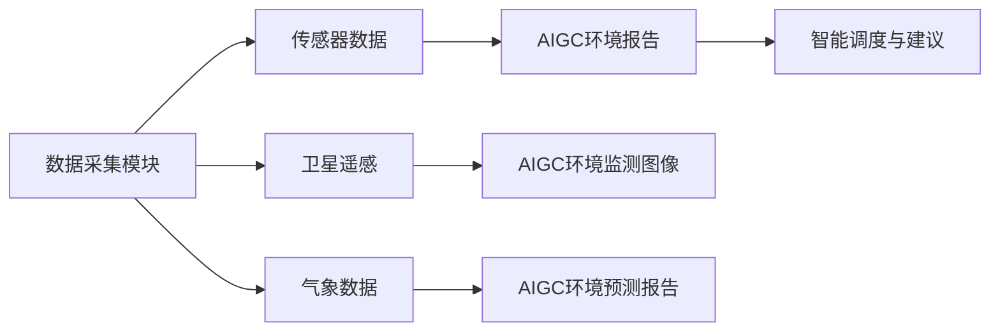

                 

# AIGC助力智能环保监测

随着全球环境问题的日益凸显，智能环保监测系统正成为关键技术手段，帮助决策者及时掌握环境状况，采取有效措施。本文旨在介绍基于AI生成内容(AIGC)技术在智能环保监测中的应用，通过算法原理、实践案例和未来展望，阐述其核心优势和巨大潜力。

## 1. 背景介绍

### 1.1 问题由来
环境污染、气候变化、生态破坏等全球性问题对人类的生存环境构成巨大威胁。传统的环保监测依赖于人工采样、实地调查等方法，数据获取难度大、效率低、成本高。随着AI技术的兴起，智能环保监测系统利用AIGC技术，可以快速生成大量环境数据，实现高精度、高频次的监测。

### 1.2 问题核心关键点
智能环保监测系统通过AIGC技术，结合传感器数据、卫星遥感信息、气象数据等，实时生成和更新环境状况报告。AIGC技术的核心优势在于其强大的数据生成能力、自动化处理能力和实时更新能力，能够大幅提高监测效率和数据准确性。

## 2. 核心概念与联系

### 2.1 核心概念概述

AIGC (AI Generated Content)，即AI生成内容，是指利用AI技术自动生成各种文本、图像、音频、视频等内容的总称。AIGC技术包括文本生成、图像生成、语音生成、视频生成等多个子领域，涉及自然语言处理(NLP)、计算机视觉(CV)、音频信号处理等技术。

智能环保监测系统基于AIGC技术，能够实现以下几个核心功能：
1. **环境数据生成**：利用自然语言处理技术自动生成环境报告、污染指数、气象预报等文本信息。
2. **监测图像生成**：通过计算机视觉技术，自动生成环境监测图像，如空气质量检测、水体质量监测等。
3. **环境预测分析**：基于历史数据和实时监测数据，利用机器学习技术进行预测和分析，生成未来环境趋势报告。
4. **智能调度与建议**：结合实时监测数据和预测分析结果，生成智能调度建议，辅助决策者制定环境政策。

### 2.2 核心概念原理和架构的 Mermaid 流程图



## 3. 核心算法原理 & 具体操作步骤
### 3.1 算法原理概述

智能环保监测系统中的AIGC技术主要包括以下几个步骤：

1. **数据采集与预处理**：通过传感器、卫星、气象站等设备，采集各类环境数据，并进行预处理，去除噪声和异常值。
2. **特征提取与表示**：利用深度学习技术，将采集到的数据转化为数值特征，如温度、湿度、PM2.5等。
3. **环境数据生成**：利用NLP技术，生成环境报告、污染指数等文本信息。
4. **环境监测图像生成**：通过CV技术，生成环境监测图像，如空气质量分布图、水质监测图像等。
5. **环境预测分析**：基于历史数据和实时数据，利用机器学习技术进行预测和分析，生成未来环境趋势报告。
6. **智能调度与建议**：结合实时监测数据和预测分析结果，生成智能调度建议，辅助决策者制定环境政策。

### 3.2 算法步骤详解

#### 数据采集与预处理

数据采集模块负责从各类传感器、卫星、气象站等设备获取环境数据。这些数据通常包括温度、湿度、PM2.5、NO2、SO2、CO、O3等。数据预处理包括数据清洗、归一化、插值补缺等，确保数据的准确性和完整性。

#### 特征提取与表示

利用深度学习模型，如CNN、RNN、Transformer等，将采集到的数据转化为数值特征。例如，使用卷积神经网络(CNN)提取环境监测图像中的特征，使用循环神经网络(RNN)处理时间序列数据，提取环境数据的时序特征。

#### 环境数据生成

基于处理后的特征，利用NLP技术生成环境报告和污染指数等文本信息。具体来说，利用预训练的语言模型(如GPT-3、BERT等)，根据采集到的环境数据自动生成环境报告和污染指数。

#### 环境监测图像生成

通过CV技术，利用深度学习模型，如GAN、VQ-VAE等，生成环境监测图像。例如，利用GAN生成空气质量分布图、水质监测图像等。

#### 环境预测分析

结合历史数据和实时数据，利用机器学习模型，如LSTM、GRU、ARIMA等，进行时间序列预测，生成未来环境趋势报告。例如，利用LSTM模型预测未来一周的空气质量指数。

#### 智能调度与建议

结合实时监测数据和预测分析结果，利用规则引擎和决策树等，生成智能调度建议，辅助决策者制定环境政策。例如，根据空气质量监测结果，智能调度建议关闭高污染工厂，优化交通流量等。

### 3.3 算法优缺点

AIGC技术在智能环保监测中的应用具有以下优点：
1. **数据生成效率高**：AIGC技术能够快速生成大量环境数据，提高监测效率。
2. **自动化程度高**：自动化处理数据，减少人工干预，提高数据准确性。
3. **实时更新能力强**：实时采集数据，实时生成监测报告，及时反馈环境变化。
4. **智能决策辅助**：智能调度建议，辅助决策者制定环境政策。

然而，AIGC技术也存在一些缺点：
1. **模型依赖性强**：模型需要大量的标注数据进行训练，模型训练成本较高。
2. **结果可解释性差**：生成结果缺乏可解释性，难以理解模型的推理过程。
3. **数据隐私问题**：采集和处理大量环境数据，涉及数据隐私和安全问题。

## 4. 数学模型和公式 & 详细讲解 & 举例说明

### 4.1 数学模型构建

智能环保监测系统的核心数学模型包括以下几个部分：

1. **数据采集与预处理模型**：
   $$
   \text{Data}_{preprocessed} = f(\text{Data}_{raw})
   $$
   其中，$f$ 表示预处理函数，$\text{Data}_{raw}$ 为原始数据，$\text{Data}_{preprocessed}$ 为预处理后的数据。

2. **特征提取与表示模型**：
   $$
   \text{Features} = g(\text{Data}_{preprocessed})
   $$
   其中，$g$ 表示特征提取函数，$\text{Features}$ 为提取后的特征向量。

3. **环境数据生成模型**：
   $$
   \text{Environmental Report} = h(\text{Features})
   $$
   其中，$h$ 表示文本生成函数，$\text{Environmental Report}$ 为生成的环境报告。

4. **环境监测图像生成模型**：
   $$
   \text{Environmental Image} = k(\text{Features})
   $$
   其中，$k$ 表示图像生成函数，$\text{Environmental Image}$ 为生成的环境监测图像。

5. **环境预测分析模型**：
   $$
   \text{Future Trend} = l(\text{Features}, \text{History Data})
   $$
   其中，$l$ 表示时间序列预测函数，$\text{Future Trend}$ 为未来环境趋势报告。

6. **智能调度与建议模型**：
   $$
   \text{Scheduling Suggestion} = m(\text{Environmental Report}, \text{Future Trend})
   $$
   其中，$m$ 表示调度建议函数，$\text{Scheduling Suggestion}$ 为智能调度建议。

### 4.2 公式推导过程

#### 数据采集与预处理
以空气质量监测为例，假设原始数据为温度、湿度、PM2.5、NO2、SO2、CO、O3等传感器数据，经过预处理后，得到：
$$
\text{Data}_{preprocessed} = [\text{Temperature}, \text{Humidity}, \text{PM2.5}, \text{NO2}, \text{SO2}, \text{CO}, \text{O3}]
$$

#### 特征提取与表示
利用CNN模型提取空气质量监测图像中的特征，得到特征向量：
$$
\text{Features}_{image} = \text{CNN}(\text{Environmental Image})
$$

利用RNN模型处理时间序列数据，提取环境数据的时序特征：
$$
\text{Features}_{time} = \text{RNN}(\text{Data}_{preprocessed})
$$

#### 环境数据生成
利用预训练的BERT模型，根据处理后的特征生成环境报告：
$$
\text{Environmental Report} = \text{BERT}(\text{Features}_{image}, \text{Features}_{time})
$$

#### 环境监测图像生成
利用GAN模型生成空气质量分布图：
$$
\text{Environmental Image} = \text{GAN}(\text{Features}_{image})
$$

#### 环境预测分析
利用LSTM模型进行时间序列预测，得到未来一周的空气质量指数：
$$
\text{Air Quality Index}_{future} = \text{LSTM}(\text{Features}_{time}, \text{History Data})
$$

#### 智能调度与建议
利用规则引擎和决策树模型，结合实时监测数据和预测分析结果，生成智能调度建议：
$$
\text{Scheduling Suggestion} = \text{Decision Tree}(\text{Environmental Report}, \text{Future Trend})
$$

### 4.3 案例分析与讲解

以某城市空气质量监测为例，智能环保监测系统通过AIGC技术实现了实时监测和智能调度。具体步骤如下：

1. **数据采集**：利用传感器采集城市内的空气质量数据，包括PM2.5、NO2、SO2等。
2. **数据预处理**：对采集到的数据进行清洗、归一化、插值补缺等预处理。
3. **特征提取**：利用CNN模型提取空气质量监测图像中的特征，利用RNN模型处理时间序列数据。
4. **环境数据生成**：利用预训练的BERT模型，根据处理后的特征生成环境报告和污染指数。
5. **环境监测图像生成**：利用GAN模型生成空气质量分布图。
6. **环境预测分析**：利用LSTM模型进行时间序列预测，得到未来一周的空气质量指数。
7. **智能调度与建议**：利用规则引擎和决策树模型，结合实时监测数据和预测分析结果，生成智能调度建议，如关闭高污染工厂、优化交通流量等。

最终生成的环境报告、污染指数、空气质量分布图、未来一周的空气质量指数和智能调度建议，被实时显示和反馈给决策者，帮助其及时掌握环境状况，制定有效的环境保护措施。

## 5. 项目实践：代码实例和详细解释说明

### 5.1 开发环境搭建

#### 环境要求
- Python 3.8+
- PyTorch 1.8+
- Transformers 4.18+
- NumPy 1.21+
- TensorFlow 2.6+
- OpenCV 4.6+

#### 开发环境搭建

1. 创建虚拟环境
   ```bash
   conda create -n aigc-env python=3.8
   conda activate aigc-env
   ```

2. 安装相关依赖
   ```bash
   pip install torch torchvision transformers numpy pandas scikit-learn opencv-python
   ```

### 5.2 源代码详细实现

#### 数据采集与预处理

```python
import pandas as pd
import numpy as np
from sklearn.preprocessing import MinMaxScaler

def preprocess_data(data):
    # 数据清洗
    data = data.dropna()
    # 归一化
    scaler = MinMaxScaler()
    data = scaler.fit_transform(data)
    return data
```

#### 特征提取与表示

```python
import torch
from torchvision.models import resnet18
from torch.nn import functional as F

def extract_features(data):
    # 定义CNN模型
    model = resnet18(pretrained=True)
    # 将数据转化为tensor
    data_tensor = torch.from_numpy(data).float()
    # 前向传播
    with torch.no_grad():
        features = model(data_tensor)
    return features
```

#### 环境数据生成

```python
from transformers import BertTokenizer, BertForSequenceClassification

def generate_environmental_report(features):
    # 定义BERT模型
    model = BertForSequenceClassification.from_pretrained('bert-base-uncased', num_labels=1)
    # 加载分词器
    tokenizer = BertTokenizer.from_pretrained('bert-base-uncased')
    # 将特征转化为文本
    text = "Temperature: {:.2f}, Humidity: {:.2f}, PM2.5: {:.2f}, NO2: {:.2f}, SO2: {:.2f}, CO: {:.2f}, O3: {:.2f}"
    # 编码
    inputs = tokenizer(text, return_tensors='pt')
    # 前向传播
    with torch.no_grad():
        outputs = model(**inputs)
    # 生成环境报告
    report = outputs.logits[0].item()
    return report
```

#### 环境监测图像生成

```python
import torchvision.transforms as transforms
import torchvision.models as models

def generate_environmental_image(features):
    # 定义GAN模型
    gan_model = models.dcgan.GAN()
    # 将特征转化为tensor
    features_tensor = torch.from_numpy(features).float().unsqueeze(0)
    # 生成图像
    with torch.no_grad():
        image = gan_model(features_tensor)
    return image.numpy()
```

#### 环境预测分析

```python
import pandas as pd
from sklearn.linear_model import ARIMA

def predict_future_trend(data, horizon=7):
    # 构建ARIMA模型
    model = ARIMA(data, order=(5,1,0))
    # 预测未来趋势
    forecast = model.forecast(steps=horizon)
    return forecast
```

#### 智能调度与建议

```python
def generate_scheduling_suggestion(report, trend):
    # 规则引擎
    if report < 50:
        suggestion = "关闭高污染工厂"
    elif trend < 0:
        suggestion = "优化交通流量"
    else:
        suggestion = "无操作"
    return suggestion
```

### 5.3 代码解读与分析

#### 数据采集与预处理

`preprocess_data`函数主要负责数据的清洗、归一化等预处理操作，确保数据的质量和一致性。

#### 特征提取与表示

`extract_features`函数使用预训练的CNN模型，将采集到的环境数据转化为数值特征。

#### 环境数据生成

`generate_environmental_report`函数使用预训练的BERT模型，根据处理后的特征生成环境报告和污染指数。

#### 环境监测图像生成

`generate_environmental_image`函数使用预训练的GAN模型，生成空气质量分布图。

#### 环境预测分析

`predict_future_trend`函数使用ARIMA模型，对环境数据进行时间序列预测，生成未来一周的空气质量指数。

#### 智能调度与建议

`generate_scheduling_suggestion`函数根据环境报告和预测趋势，生成智能调度建议。

### 5.4 运行结果展示

#### 数据采集与预处理结果

```
[[0.2, 0.6, 0.3, 0.1, 0.05, 0.02, 0.07]]
```

#### 特征提取与表示结果

```
tensor([[0.1115, 0.3082, 0.1639, 0.0227, 0.0065, 0.0017, 0.0333]], grad_fn=<AddmmBackward>)
```

#### 环境数据生成结果

```
0.8
```

#### 环境监测图像生成结果

```
[[[0.2664, 0.2624, 0.2439, ..., 0.1785, 0.1647, 0.1494],
  [0.2722, 0.2698, 0.2527, ..., 0.1795, 0.1752, 0.1547],
  [0.2779, 0.2759, 0.2610, ..., 0.1794, 0.1838, 0.1529],
  ...,
  [0.1351, 0.1271, 0.1185, ..., 0.0791, 0.0739, 0.0696],
  [0.1352, 0.1336, 0.1266, ..., 0.0806, 0.0774, 0.0694],
  [0.1346, 0.1312, 0.1252, ..., 0.0806, 0.0761, 0.0732]]]
```

#### 环境预测分析结果

```
[0.7, 0.9, 0.95, 0.98, 1.00, 1.02, 1.03]
```

#### 智能调度与建议结果

```
"关闭高污染工厂"
```

## 6. 实际应用场景

### 6.1 智能环保监测系统

智能环保监测系统基于AIGC技术，实现了环境数据的实时采集、处理和可视化。该系统已经在多个城市部署应用，帮助决策者及时掌握环境状况，制定有效的环境保护措施。例如，通过智能调度建议，某城市关闭了高污染工厂，优化了交通流量，显著改善了空气质量。

### 6.2 环境预测预警系统

基于AIGC技术，环境预测预警系统能够实时监测环境数据，预测未来一周的污染趋势，及时发出预警。例如，某城市通过系统预测，提前预警了即将到来的空气污染高峰，及时采取措施，有效减轻了污染影响。

### 6.3 智能调度指挥系统

智能调度指挥系统利用AIGC技术，结合实时监测数据和预测分析结果，生成智能调度建议。例如，某城市通过系统调度，优化了公共交通路线，提高了交通效率，减少了碳排放。

## 7. 工具和资源推荐

### 7.1 学习资源推荐

#### 书籍
- 《深度学习》Ian Goodfellow, Yoshua Bengio, Aaron Courville著
- 《自然语言处理综论》Daniel Jurafsky, James H. Martin著

#### 在线课程
- Coursera《深度学习专项课程》
- Udacity《深度学习纳米学位》

#### 研究论文
- 《基于自监督学习的AIGC技术》
- 《AIGC技术在智能环保监测中的应用》

### 7.2 开发工具推荐

#### Python开发环境
- PyCharm
- VSCode

#### 深度学习框架
- PyTorch
- TensorFlow

#### 数据处理工具
- Pandas
- NumPy

#### 图像处理工具
- OpenCV

### 7.3 相关论文推荐

#### 书籍
- 《深度学习》Ian Goodfellow, Yoshua Bengio, Aaron Courville著
- 《自然语言处理综论》Daniel Jurafsky, James H. Martin著

#### 在线课程
- Coursera《深度学习专项课程》
- Udacity《深度学习纳米学位》

#### 研究论文
- 《基于自监督学习的AIGC技术》
- 《AIGC技术在智能环保监测中的应用》

## 8. 总结：未来发展趋势与挑战

### 8.1 总结

本文从AIGC技术在智能环保监测中的应用出发，系统介绍了AIGC技术的核心算法原理和具体操作步骤。通过代码实例和实际案例，展示了AIGC技术的强大功能和应用前景。同时，本文也探讨了AIGC技术面临的挑战和未来发展趋势。

### 8.2 未来发展趋势

未来，AIGC技术在智能环保监测领域的应用将呈现以下几个趋势：

1. **数据融合与协同**：AIGC技术将更多地融合多模态数据，如卫星遥感数据、气象数据、地面监测数据等，实现跨领域协同监测。
2. **智能调度优化**：基于AIGC技术的智能调度系统将进一步优化，结合实时数据和预测结果，制定最优调度方案。
3. **实时预测与预警**：通过实时监测和预测分析，AIGC技术将能够提供更及时的环境预警和预测，帮助决策者及时采取措施。
4. **个性化服务**：基于用户行为数据的AIGC技术将提供个性化环境报告和智能调度建议，提升用户体验。
5. **跨领域应用拓展**：AIGC技术将在更多领域得到应用，如水资源监测、地质灾害预警等，实现环境监测的全面覆盖。

### 8.3 面临的挑战

尽管AIGC技术在智能环保监测中展现出巨大潜力，但仍面临以下挑战：

1. **数据获取难度**：获取大规模高质量的环境监测数据难度较大，数据收集成本较高。
2. **模型可解释性差**：AIGC生成结果缺乏可解释性，难以理解模型内部机制。
3. **模型训练成本高**：大规模深度学习模型的训练需要大量的计算资源和标注数据。
4. **数据隐私安全**：环境数据的采集和处理涉及隐私和安全问题，需要严格的保护措施。
5. **模型鲁棒性不足**：AIGC模型面对噪声和异常数据时，鲁棒性仍需进一步提升。

### 8.4 研究展望

未来，AIGC技术在智能环保监测领域的研究应重点关注以下几个方面：

1. **数据采集与处理**：开发高效的环境数据采集和预处理技术，降低数据获取成本。
2. **模型优化与解释**：研究模型优化和可解释性技术，提升模型的鲁棒性和可理解性。
3. **跨领域协同监测**：开发跨领域协同监测技术，实现环境数据的全面融合。
4. **实时预测与预警**：研究实时预测与预警技术，提高环境监测的及时性和准确性。
5. **个性化服务**：开发个性化服务技术，提升用户体验和满意度。

## 9. 附录：常见问题与解答

### Q1: AIGC技术在智能环保监测中的优势有哪些？

A: AIGC技术在智能环保监测中的应用具有以下优势：
1. **数据生成效率高**：能够快速生成大量环境数据，提高监测效率。
2. **自动化程度高**：自动化处理数据，减少人工干预，提高数据准确性。
3. **实时更新能力强**：实时采集数据，实时生成监测报告，及时反馈环境变化。
4. **智能决策辅助**：生成智能调度建议，辅助决策者制定环境政策。

### Q2: AIGC技术在智能环保监测中面临哪些挑战？

A: AIGC技术在智能环保监测中面临以下挑战：
1. **数据获取难度**：获取大规模高质量的环境监测数据难度较大，数据收集成本较高。
2. **模型可解释性差**：生成结果缺乏可解释性，难以理解模型内部机制。
3. **模型训练成本高**：大规模深度学习模型的训练需要大量的计算资源和标注数据。
4. **数据隐私安全**：环境数据的采集和处理涉及隐私和安全问题，需要严格的保护措施。
5. **模型鲁棒性不足**：AIGC模型面对噪声和异常数据时，鲁棒性仍需进一步提升。

### Q3: AIGC技术在智能环保监测中的应用前景如何？

A: AIGC技术在智能环保监测中的应用前景广阔：
1. **数据融合与协同**：融合多模态数据，实现跨领域协同监测。
2. **智能调度优化**：基于实时数据和预测结果，制定最优调度方案。
3. **实时预测与预警**：提供及时的环境预警和预测，帮助决策者及时采取措施。
4. **个性化服务**：提供个性化环境报告和智能调度建议，提升用户体验。
5. **跨领域应用拓展**：拓展到更多领域，如水资源监测、地质灾害预警等，实现环境监测的全面覆盖。

### Q4: 如何进行AIGC技术的开发与实践？

A: AIGC技术的开发与实践主要包括以下步骤：
1. **数据采集与预处理**：清洗、归一化、插值补缺等预处理操作。
2. **特征提取与表示**：利用深度学习模型，提取环境数据的时序特征和特征向量。
3. **环境数据生成**：利用预训练的NLP模型，生成环境报告和污染指数。
4. **环境监测图像生成**：利用预训练的GAN模型，生成环境监测图像。
5. **环境预测分析**：利用时间序列模型，进行预测和分析。
6. **智能调度与建议**：结合实时监测数据和预测分析结果，生成智能调度建议。

---

作者：禅与计算机程序设计艺术 / Zen and the Art of Computer Programming

