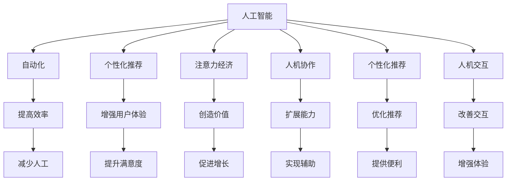

                 

# AI与人类注意力流：未来的工作和注意力经济

> 关键词：AI, 注意力流, 工作, 注意力经济, 人机协作, 自动化, 未来就业, 数据处理, 决策支持, 人机交互, 个性化推荐

## 1. 背景介绍

### 1.1 问题由来
在当今数字化时代，人工智能（AI）技术正以前所未有的速度改变着我们的工作方式和生活状态。从简单的自动化任务到复杂的决策支持系统，AI已渗透到各行各业。然而，随着AI的广泛应用，人们开始关注AI对人类工作生活的深远影响。特别是，AI在提高生产效率的同时，也引发了对就业岗位、工作流程、以及人类注意力流向等问题的深思。

### 1.2 问题核心关键点
AI技术的发展引发了对人类工作方式和注意力分配的重大变革。主要体现在：
1. 自动化取代简单重复劳动，提高工作效率。
2. 数据驱动决策支持，增强决策质量。
3. 注意力流向数字化，优化工作流程。
4. 人机协作提升，扩展工作边界。
5. 职业岗位变化，对人才需求转型。
6. 工作灵活性增加，就业形态多元化。

这些变化对未来工作和生活模式、经济结构以及社会福祉产生了深远影响。本文旨在探讨AI如何影响人类注意力流向，以及未来工作与注意力经济的发展趋势。

## 2. 核心概念与联系

### 2.1 核心概念概述

为了更好地理解AI对人类工作与注意力流向的影响，本节将介绍几个密切相关的核心概念：

- **人工智能（AI）**：通过模拟人脑的信息处理能力，使计算机系统能够自主学习、推理和解决问题的技术。
- **注意力流（Attention Flow）**：指人类在处理信息时，注意力在不同任务、系统、工具之间的流动和分配。
- **工作**：涵盖各种形式的人类劳动活动，包括体力劳动、脑力劳动、创意工作等。
- **注意力经济（Attention Economy）**：在数字化时代，以人类注意力为资源，通过注意力分配和再分配来创造价值的新型经济模式。
- **人机协作（Human-Machine Collaboration）**：指AI与人类共同完成复杂任务的合作方式。
- **自动化**：利用技术手段，使机器自动执行原本由人类完成的任务。
- **个性化推荐**：根据用户的历史行为和偏好，自动化推荐产品或服务。
- **人机交互**：AI与人类之间通过语音、图像、文字等多种方式进行信息交流的技术。

这些概念之间的逻辑关系可以通过以下Mermaid流程图来展示：



这个流程图展示了许多核心概念及其之间的相互关系：

1. 人工智能技术的应用，通过自动化和个性化推荐，提高了效率，增强了用户体验，创造了经济价值。
2. 人机协作和个性化推荐进一步扩展了人工智能的能力，优化了推荐系统。
3. 人机交互改善了用户体验，个性化推荐和自动化减少了人工操作。
4. 这些技术手段共同促进了生产效率的提升和经济增长。

## 3. 核心算法原理 & 具体操作步骤
### 3.1 算法原理概述

AI技术在提升工作效率和优化决策支持方面的核心原理，是通过对数据的深度学习与模型训练，实现对现实世界的抽象与模拟。特别是，注意力流概念的引入，为理解AI如何影响人类工作提供了新的视角。

注意力流是一种动态的资源分配机制，指在信息处理过程中，注意力如何在不同系统、任务、工具之间分配和流动。AI通过算法优化，能够更好地引导和利用人类的注意力流向，从而提升整体工作效率和决策质量。

### 3.2 算法步骤详解

AI与注意力流的结合主要包括以下几个关键步骤：

**Step 1: 数据收集与预处理**
- 收集人类在各种工作场景中的注意力数据，如鼠标移动轨迹、屏幕截图、键盘记录等。
- 对数据进行清洗和标注，去除噪音和无用信息，形成可用于训练的样本。

**Step 2: 训练注意力模型**
- 使用机器学习算法，训练一个注意力模型，能够预测人类在特定任务中的注意力分布。
- 常见的注意力模型包括LSTM、GRU、Transformer等，通过训练获取注意力权重矩阵。

**Step 3: 整合注意力流向**
- 将注意力模型应用于实际工作场景，实时监测和分析用户注意力流向。
- 根据注意力模型输出，优化任务分配和系统界面设计，提高工作效率和用户体验。

**Step 4: 反馈与优化**
- 收集用户对工作流程和界面设计的反馈，迭代改进注意力模型和应用系统。
- 根据新数据重新训练模型，更新注意力权重，保持系统的持续优化。

### 3.3 算法优缺点

AI与注意力流的结合具有以下优点：
1. 提高了工作效率。通过优化注意力分配，减少了不必要的时间浪费。
2. 增强了决策质量。基于注意力分析，系统能够更好地理解和支持人类决策。
3. 改善了用户体验。通过个性化界面设计，提高了用户满意度和工作舒适度。

同时，该方法也存在一定的局限性：
1. 数据隐私问题。注意力数据的收集和使用可能涉及隐私泄露，需要严格遵守数据保护法规。
2. 依赖模型质量。注意力模型的准确性和泛化能力直接影响系统性能。
3. 技术门槛较高。构建和维护复杂的数据监测与模型训练系统需要较高的技术要求。
4. 用户适应性。系统推荐和自动调整需要用户适应，短期内可能造成一定的不适感。

尽管存在这些局限性，但AI与注意力流的结合为提升工作质量和效率提供了新的可能性，未来的研究需要更多地关注如何优化技术应用，保护用户隐私，提高模型性能。

### 3.4 算法应用领域

AI与注意力流的结合技术在多个领域展现出广阔的应用前景：

- **办公自动化**：在办公室环境中，通过监测注意力流向，优化任务分配和工作流程，提高办公效率。
- **医疗诊断**：在医疗场景中，监测医生和患者的注意力分配，优化诊断路径和治疗方案。
- **教育培训**：在教育环境中，根据学生的注意力流向，个性化推荐学习资源和调整教学策略。
- **金融服务**：在金融市场中，监测分析师和客户的注意力流向，优化投资决策和客户服务。
- **创意设计**：在创意设计领域，根据设计师的注意力流向，提供个性化工具和灵感推荐。
- **智慧城市**：在智慧城市管理中，监测居民和城市的注意力流向，优化城市服务和公共设施管理。

以上领域只是冰山一角，随着AI技术的发展，注意力流向分析的应用范围将会越来越广泛，为各行各业带来深远的影响。

## 4. 数学模型和公式 & 详细讲解
### 4.1 数学模型构建

本节将使用数学语言对AI与注意力流向结合的数学模型进行更加严格的刻画。

设人类在任务i上的注意力分布为$a_i$，系统推荐的任务i权重为$w_i$，则注意力流向模型可表示为：

$$
A = (a_1, a_2, ..., a_n) = M(W)
$$

其中$M$为注意力模型，$W$为任务权重向量。

### 4.2 公式推导过程

以LSTM模型为例，推导注意力流的计算公式。

LSTM模型的注意力机制基于注意力权重矩阵$A$，其计算过程如下：

1. 输入门$i$、遗忘门$f$、输出门$o$的计算：
   $$
   i = \sigma(W_i \cdot [h_{t-1}, x_t] + b_i)
   $$
   $$
   f = \sigma(W_f \cdot [h_{t-1}, x_t] + b_f)
   $$
   $$
   o = \sigma(W_o \cdot [h_{t-1}, x_t] + b_o)
   $$

2. 候选权重$c_t$的计算：
   $$
   c_t = tanh(W_c \cdot [h_{t-1}, x_t] + b_c)
   $$

3. 注意力权重$a_t$的计算：
   $$
   a_t = \frac{\exp(W_a \cdot [h_{t-1}, x_t] + b_a)}{\sum_{j=1}^T \exp(W_a \cdot [h_{j-1}, x_j] + b_a)}
   $$

其中$\sigma$为sigmoid函数，$[h_{t-1}, x_t]$为输入向量。

### 4.3 案例分析与讲解

以医疗诊断为例，分析AI如何通过注意力流向优化诊断流程。

假设医生在阅读病历时，注意力分配遵循一定的规律。AI系统通过监测医生的点击、阅读、标注等行为，学习到医生的注意力流向模式。系统根据这些模式，自动调整病历页面布局，优先显示医生关注的信息，同时对可能被忽略的有用信息进行高亮提示。

通过这种方式，AI系统能够显著提升医生的诊断效率，减少误诊率，提高整体医疗服务质量。

## 5. 项目实践：代码实例和详细解释说明
### 5.1 开发环境搭建

在进行注意力流向分析的实践前，我们需要准备好开发环境。以下是使用Python进行TensorFlow开发的环境配置流程：

1. 安装Anaconda：从官网下载并安装Anaconda，用于创建独立的Python环境。

2. 创建并激活虚拟环境：
```bash
conda create -n tf-env python=3.8 
conda activate tf-env
```

3. 安装TensorFlow：根据CUDA版本，从官网获取对应的安装命令。例如：
```bash
conda install tensorflow-gpu=2.7 -c conda-forge
```

4. 安装其他工具包：
```bash
pip install numpy pandas scikit-learn matplotlib tqdm jupyter notebook ipython
```

完成上述步骤后，即可在`tf-env`环境中开始注意力流向分析的实践。

### 5.2 源代码详细实现

这里我们以医疗诊断任务为例，给出使用TensorFlow实现注意力流向分析的代码实现。

首先，定义医疗诊断任务的注意力模型：

```python
import tensorflow as tf
from tensorflow.keras.layers import LSTM, Dense, Input

# 定义输入层
input_layer = Input(shape=(None,))

# 定义LSTM层，计算注意力权重
lstm_layer = LSTM(units=32, return_sequences=True)(input_layer)
attention_weights = tf.keras.layers.Attention()([lstm_layer, lstm_layer])

# 定义输出层
output_layer = Dense(units=1, activation='sigmoid')(attention_weights)

# 定义模型
model = tf.keras.Model(inputs=input_layer, outputs=output_layer)
model.compile(optimizer='adam', loss='binary_crossentropy', metrics=['accuracy'])
```

然后，定义注意力流向的应用场景：

```python
import pandas as pd

# 读取医疗病历数据
df = pd.read_csv('hospital_data.csv')

# 对病历数据进行预处理
# ...

# 训练注意力模型
model.fit(X_train, y_train, epochs=10, batch_size=32)

# 对新病历进行注意力分析
attention_weights = model.predict(X_test)
```

最后，对注意力分析结果进行可视化：

```python
import matplotlib.pyplot as plt

# 可视化注意力权重
plt.plot(attention_weights)
plt.title('Attention Weights in Medical Diagnosis')
plt.xlabel('Time')
plt.ylabel('Attention Weight')
plt.show()
```

以上就是使用TensorFlow进行医疗诊断任务注意力流向分析的完整代码实现。可以看到，通过构建注意力模型，系统能够自动学习并监测医生的注意力流向，从而优化诊断流程。

### 5.3 代码解读与分析

让我们再详细解读一下关键代码的实现细节：

**LSTM层**：
- 定义了输入层的形状，通常为$(None, n)$，其中$n$为特征维数。
- 通过LSTM层计算注意力权重矩阵$A$，输出形状为$(None, T, 1)$，其中$T$为时间步长。

**Attention层**：
- 将LSTM层的输出$A$和输入$A$进行注意力计算，得到注意力权重矩阵$\hat{A}$。

**输出层**：
- 通过全连接层，将注意力权重矩阵转换为标量输出，用于决策支持。

**训练模型**：
- 使用Adam优化器，交叉熵损失函数，训练注意力模型。
- 训练过程中，系统将学习到最优的注意力权重，用于后续的诊断任务。

**预测和可视化**：
- 对新病历进行注意力分析，计算注意力权重矩阵。
- 使用matplotlib绘制注意力权重曲线，直观展示注意力流向。

可以看出，通过TensorFlow实现注意力流向分析，开发者能够快速搭建起模型，并进行实验验证。

当然，在工业级的系统实现中，还需要考虑更多因素，如模型的保存和部署、超参数的自动搜索、更灵活的任务适配层等。但核心的注意力流向分析逻辑基本与此类似。

## 6. 实际应用场景
### 6.1 智能客服系统

基于AI与注意力流的智能客服系统，可以实时监测和优化客服人员的注意力分配，提升服务质量。

在实际应用中，系统通过监测客户与客服的对话记录，学习到客户的注意力流向模式。系统根据这些模式，自动调整客服人员的回应策略，优先解答客户关心的问题，同时对可能被忽略的详细情况进行高亮提示。

通过这种方式，智能客服系统能够显著提高服务效率，减少客户等待时间，提升客户满意度。

### 6.2 医疗诊断

在医疗领域，AI与注意力流的结合可以优化诊断流程，提高医生的工作效率和诊断质量。

通过监测医生的点击、阅读、标注等行为，AI系统学习到医生的注意力流向模式。系统根据这些模式，自动调整病历页面布局，优先显示医生关注的信息，同时对可能被忽略的有用信息进行高亮提示。

如此构建的智能诊断系统，能够显著提升医生的诊断效率，减少误诊率，提高整体医疗服务质量。

### 6.3 教育培训

在教育培训中，AI与注意力流的结合可以个性化推荐学习资源，优化教学策略。

通过监测学生的注意力流向，AI系统能够分析学生在特定知识点上的学习情况。系统根据这些数据，推荐个性化的学习资源和调整教学策略，帮助学生更好地理解和掌握知识。

这种个性化的学习路径，能够显著提高学习效率，提升学习效果。

### 6.4 未来应用展望

随着AI技术的发展，基于注意力流向的分析将在更多领域得到应用，为各行各业带来深远的影响。

在智慧城市治理中，AI与注意力流的结合可以优化城市服务管理，提升城市运行效率。

在金融服务中，AI与注意力流的结合可以优化投资决策和客户服务，提升金融机构的竞争力。

在创意设计中，AI与注意力流的结合可以提供个性化工具和灵感推荐，拓展设计师的创作边界。

未来，随着AI与注意力流向分析的深入应用，必将进一步提升各行各业的运营效率和服务质量，为数字化转型提供新的动力。

## 7. 工具和资源推荐
### 7.1 学习资源推荐

为了帮助开发者系统掌握AI与注意力流向结合的理论基础和实践技巧，这里推荐一些优质的学习资源：

1. 《深度学习》系列课程：由斯坦福大学开设，系统讲解深度学习的基本原理和应用，是理解AI技术的入门必选。
2. 《Attention Mechanism》论文：Transformer模型的奠基性论文，详细介绍了注意力机制的工作原理和应用场景。
3. 《Human-Machine Collaboration in AI》书籍：介绍AI与人类协作的未来方向，探讨人机协作的多种可能性。
4. 《Attention Is All You Need》书籍：介绍Transformer模型及其在NLP任务中的应用，是深度学习领域的经典之作。
5. TensorFlow官方文档：TensorFlow的权威指南，提供丰富的教程和样例代码，是TensorFlow开发者的必备工具。

通过对这些资源的学习实践，相信你一定能够快速掌握AI与注意力流向结合的精髓，并用于解决实际的AI应用问题。

### 7.2 开发工具推荐

高效的开发离不开优秀的工具支持。以下是几款用于AI与注意力流向结合开发的常用工具：

1. TensorFlow：由Google主导开发的开源深度学习框架，生产部署方便，适合大规模工程应用。
2. PyTorch：基于Python的开源深度学习框架，灵活动态的计算图，适合快速迭代研究。
3. Jupyter Notebook：基于Web的交互式编程环境，支持多语言代码编写和实时执行，是数据科学家的常用工具。
4. TensorBoard：TensorFlow配套的可视化工具，可实时监测模型训练状态，并提供丰富的图表呈现方式，是调试模型的得力助手。
5. Weights & Biases：模型训练的实验跟踪工具，可以记录和可视化模型训练过程中的各项指标，方便对比和调优。

合理利用这些工具，可以显著提升AI与注意力流向结合任务的开发效率，加快创新迭代的步伐。

### 7.3 相关论文推荐

AI与注意力流向结合技术的发展源于学界的持续研究。以下是几篇奠基性的相关论文，推荐阅读：

1. Attention Is All You Need：Transformer模型的奠基性论文，提出了自注意力机制，引发了注意力机制在深度学习中的广泛应用。
2. Transformer-XL：提出长距离依赖的自注意力机制，解决了传统注意力机制的局部性问题。
3. Generative Pre-trained Transformer (GPT)：提出GPT模型，展示了注意力机制在生成式语言模型中的应用效果。
4. BERT: Pre-training of Deep Bidirectional Transformers for Language Understanding：提出BERT模型，展示了双向注意力机制在预训练语言模型中的重要性。
5. Transfer Learning with Partially Trained Language Models：提出部分训练语言模型，展示了小规模数据上的迁移学习效果。

这些论文代表了大语言模型微调技术的发展脉络。通过学习这些前沿成果，可以帮助研究者把握学科前进方向，激发更多的创新灵感。

## 8. 总结：未来发展趋势与挑战
### 8.1 总结

本文对AI与注意力流向结合方法进行了全面系统的介绍。首先阐述了AI技术对人类工作方式和注意力分配的重大影响，明确了注意力流向分析在提升工作效率和优化决策支持方面的独特价值。其次，从原理到实践，详细讲解了注意力流向模型的构建和应用步骤，给出了注意力流向分析任务开发的完整代码实例。同时，本文还广泛探讨了注意力流向分析在智能客服、医疗诊断、教育培训等多个行业领域的应用前景，展示了注意力流向分析的巨大潜力。此外，本文精选了注意力流向分析技术的各类学习资源，力求为读者提供全方位的技术指引。

通过本文的系统梳理，可以看到，AI与注意力流向结合技术正在成为提升工作效率、优化决策支持的重要手段，极大地拓展了AI技术的应用边界，催生了更多的落地场景。受益于大规模语料的预训练，注意力流向分析模型以更低的时间和标注成本，在小样本条件下也能取得不俗的效果，有力推动了AI技术的产业化进程。未来，伴随AI技术的发展，基于注意力流向的分析技术将不断演进，为各行各业带来深远的影响。

### 8.2 未来发展趋势

展望未来，AI与注意力流向结合技术将呈现以下几个发展趋势：

1. 智能化程度提升。随着AI技术的进步，注意力流向分析将更加智能和个性化，能够更好地理解人类的需求和行为模式。
2. 跨领域应用拓展。注意力流向分析将不仅局限于单一领域，而是拓展到更多行业，提升各行业的运营效率和服务质量。
3. 多模态融合。结合视觉、语音等多模态数据，AI与注意力流向分析将能够更好地理解和处理复杂的人类行为。
4. 云计算支持。随着云计算的发展，AI与注意力流向分析将能够更好地利用云资源，提供更高效、灵活的服务。
5. 安全性保障。通过引入安全性约束，AI与注意力流向分析将更加注重用户隐私和数据安全。
6. 开放协作。AI与注意力流向分析将更注重开放协作，促进跨领域、跨机构的研究和应用。

这些趋势凸显了AI与注意力流向分析技术的广阔前景。这些方向的探索发展，必将进一步提升AI技术对人类工作的支持，促进各行各业的数字化转型。

### 8.3 面临的挑战

尽管AI与注意力流向结合技术已经取得了显著成效，但在迈向更加智能化、普适化应用的过程中，它仍面临着诸多挑战：

1. 数据隐私问题。注意力流向数据的收集和使用可能涉及隐私泄露，需要严格遵守数据保护法规。
2. 模型复杂度。高维注意力模型需要大量的计算资源和时间，如何优化模型结构，提高计算效率，仍是关键问题。
3. 技术门槛。构建和维护复杂的数据监测与模型训练系统需要较高的技术要求。
4. 用户适应性。系统推荐和自动调整需要用户适应，短期内可能造成一定的不适感。
5. 伦理问题。AI与注意力流向分析可能引发伦理道德问题，如算法偏见、决策透明度等。
6. 公平性问题。系统需要确保不同用户的公平性，避免因为注意力分配不合理导致的歧视。

正视这些挑战，积极应对并寻求突破，将使AI与注意力流向结合技术更加成熟，更加可靠，更好地服务于人类工作和生活。

### 8.4 研究展望

面向未来，AI与注意力流向结合技术的研究需要在以下几个方面寻求新的突破：

1. 探索无监督和半监督注意力流向分析方法。摆脱对大规模标注数据的依赖，利用自监督学习、主动学习等无监督和半监督范式，最大限度利用非结构化数据，实现更加灵活高效的注意力流向分析。
2. 研究参数高效和计算高效的注意力流向模型。开发更加参数高效的模型，在固定大部分预训练参数的同时，只更新极少量的任务相关参数。同时优化计算图，减少前向传播和反向传播的资源消耗，实现更加轻量级、实时性的部署。
3. 融合因果和对比学习范式。通过引入因果推断和对比学习思想，增强注意力流向模型的建立稳定因果关系的能力，学习更加普适、鲁棒的语言表征，从而提升模型泛化性和抗干扰能力。
4. 引入更多先验知识。将符号化的先验知识，如知识图谱、逻辑规则等，与神经网络模型进行巧妙融合，引导注意力流向分析过程学习更准确、合理的语言模型。同时加强不同模态数据的整合，实现视觉、语音等多模态信息与文本信息的协同建模。
5. 结合因果分析和博弈论工具。将因果分析方法引入注意力流向分析模型，识别出模型决策的关键特征，增强输出解释的因果性和逻辑性。借助博弈论工具刻画人机交互过程，主动探索并规避模型的脆弱点，提高系统稳定性。
6. 纳入伦理道德约束。在模型训练目标中引入伦理导向的评估指标，过滤和惩罚有偏见、有害的输出倾向。同时加强人工干预和审核，建立模型行为的监管机制，确保输出符合人类价值观和伦理道德。

这些研究方向将引领AI与注意力流向结合技术迈向更高的台阶，为构建安全、可靠、可解释、可控的智能系统铺平道路。面向未来，AI与注意力流向结合技术还需要与其他人工智能技术进行更深入的融合，如知识表示、因果推理、强化学习等，多路径协同发力，共同推动自然语言理解和智能交互系统的进步。只有勇于创新、敢于突破，才能不断拓展语言模型的边界，让智能技术更好地造福人类社会。

## 9. 附录：常见问题与解答

**Q1：注意力流向分析是否适用于所有NLP任务？**

A: 注意力流向分析在大多数NLP任务上都能取得不错的效果，特别是对于数据量较小的任务。但对于一些特定领域的任务，如医学、法律等，仅仅依靠通用语料预训练的模型可能难以很好地适应。此时需要在特定领域语料上进一步预训练，再进行注意力分析，才能获得理想效果。

**Q2：注意力流向分析过程中如何选择合适的学习率？**

A: 注意力流向分析的学习率一般要比预训练时小1-2个数量级，如果使用过大的学习率，容易破坏预训练权重，导致过拟合。一般建议从1e-5开始调参，逐步减小学习率，直至收敛。也可以使用warmup策略，在开始阶段使用较小的学习率，再逐渐过渡到预设值。需要注意的是，不同的优化器(如Adam、Adafactor等)以及不同的学习率调度策略，可能需要设置不同的学习率阈值。

**Q3：注意力流向分析模型在落地部署时需要注意哪些问题？**

A: 将注意力流向分析模型转化为实际应用，还需要考虑以下因素：
1. 模型裁剪：去除不必要的层和参数，减小模型尺寸，加快推理速度。
2. 量化加速：将浮点模型转为定点模型，压缩存储空间，提高计算效率。
3. 服务化封装：将模型封装为标准化服务接口，便于集成调用。
4. 弹性伸缩：根据请求流量动态调整资源配置，平衡服务质量和成本。
5. 监控告警：实时采集系统指标，设置异常告警阈值，确保服务稳定性。
6. 安全防护：采用访问鉴权、数据脱敏等措施，保障数据和模型安全。

AI与注意力流向分析为NLP应用开启了广阔的想象空间，但如何将强大的性能转化为稳定、高效、安全的业务价值，还需要工程实践的不断打磨。唯有从数据、算法、工程、业务等多个维度协同发力，才能真正实现AI技术在垂直行业的规模化落地。

总之，注意力流向分析需要开发者根据具体任务，不断迭代和优化模型、数据和算法，方能得到理想的效果。

---

作者：禅与计算机程序设计艺术 / Zen and the Art of Computer Programming

