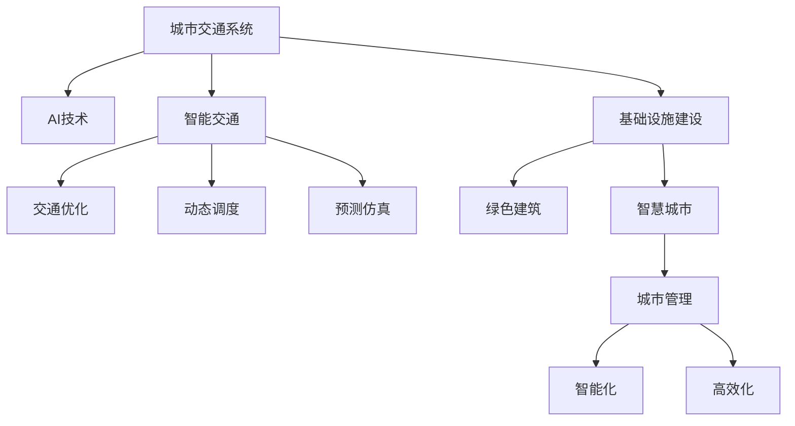

                 

# AI与人类计算：打造可持续发展的城市交通与基础设施建设规划建设

## 1. 背景介绍

### 1.1 问题由来
随着全球人口的不断增长和城市化进程的加快，城市交通与基础设施建设问题日益凸显。面对日益拥堵的交通、资源匮乏的基础设施以及环境污染等挑战，如何在保障效率的同时，实现可持续发展，成为城市建设的重要课题。

与此同时，人工智能（AI）技术以其强大的数据分析、模式识别和决策能力，为解决城市交通与基础设施问题提供了新的思路和方法。通过AI与人类计算的结合，可以更高效地进行城市交通与基础设施规划建设，推动智能交通、绿色建筑、智慧城市等新业态的发展。

### 1.2 问题核心关键点
AI在城市交通与基础设施建设中的主要作用包括：

- **数据分析与处理**：通过AI对海量交通和基础设施数据进行挖掘和分析，识别出其中的规律和趋势，为决策提供科学依据。
- **交通优化与调度**：利用AI算法优化交通流量、规划路线、动态调整信号灯等，提升交通效率和安全性。
- **智能设施管理**：通过AI技术对城市基础设施进行实时监控和预测维护，降低运营成本，提高服务质量。
- **预测与仿真**：基于AI模型进行交通与基础设施建设的模拟仿真，提前发现和规避潜在风险，提升规划的科学性和可行性。
- **能效优化**：利用AI技术优化能源消耗，提升绿色建筑和智能设施的能效，减少碳排放。

这些关键点构成了AI在城市交通与基础设施建设中的核心应用场景，通过深度学习、强化学习、决策优化等方法，实现高效、智能、可持续的城市建设目标。

### 1.3 问题研究意义
研究AI在城市交通与基础设施建设中的应用，对于推动城市可持续发展、提升居民生活质量、促进绿色低碳转型具有重要意义：

1. **提高效率**：通过AI技术优化交通和基础设施管理，减少拥堵和资源浪费，提高整体运营效率。
2. **降低成本**：利用AI进行智能维护和预测，延长设施使用寿命，降低运营和维护成本。
3. **增强安全性**：通过AI技术提高交通管理和设施监控的智能化水平，减少事故和灾害风险。
4. **促进可持续发展**：通过AI优化能效，减少资源消耗和碳排放，推动绿色建筑和智能城市建设。
5. **推动科技创新**：AI技术的应用将促进城市交通与基础设施的智能化升级，加速相关领域的科技创新。

## 2. 核心概念与联系

### 2.1 核心概念概述

为更好地理解AI在城市交通与基础设施建设中的作用，本节将介绍几个密切相关的核心概念：

- **城市交通系统**：包括道路、轨道交通、公共交通、出租车、自行车等交通方式，通过规划、建设和管理，实现人车物的有效流通。
- **基础设施建设**：涉及道路、桥梁、地铁、污水处理、能源供应等，是城市运行的基础设施，保障城市运行的各项功能。
- **AI技术**：包括机器学习、深度学习、强化学习、自然语言处理、计算机视觉等，是AI在城市建设中应用的主要手段。
- **智能交通**：通过AI技术对交通系统进行优化和调度，实现交通智能化、自动化的目标。
- **绿色建筑**：采用节能、环保、可持续的技术和材料，提升建筑的能效和环境友好性。
- **智慧城市**：通过信息通信技术、大数据、AI等手段，实现城市管理的智能化和高效化。

这些核心概念之间的逻辑关系可以通过以下Mermaid流程图来展示：



这个流程图展示了一个基于AI的城市交通与基础设施建设的总体框架，包括交通系统的智能化、基础设施的绿色化和智慧城市的建设，这些共同构成了AI在城市建设中的核心应用。

## 3. 核心算法原理 & 具体操作步骤
### 3.1 算法原理概述

AI在城市交通与基础设施建设中的应用，核心在于将大数据分析与AI算法相结合，通过智能优化和决策支持，实现系统的智能化和高效化。

具体而言，包括以下几个关键步骤：

1. **数据收集与预处理**：从交通系统、基础设施、环境监测等渠道收集数据，并进行清洗、归一化等预处理操作。
2. **特征提取与建模**：利用AI算法提取数据中的关键特征，建立数学模型或神经网络模型，用于预测和优化。
3. **优化与调度**：基于模型进行交通流量优化、路线规划、信号灯控制等，实现交通的智能化和高效化。
4. **仿真与评估**：使用AI模型进行交通与基础设施建设的仿真，评估其效果和可行性，优化规划方案。
5. **维护与更新**：利用AI技术对基础设施进行实时监控和预测维护，提升设施的可靠性和安全性。

### 3.2 算法步骤详解

#### 3.2.1 数据收集与预处理

- **数据来源**：交通流量数据、车辆位置数据、信号灯状态、环境监测数据等。
- **数据清洗**：去除噪声、处理缺失值、归一化等。
- **数据划分**：划分为训练集、验证集和测试集，用于模型训练、调参和评估。

#### 3.2.2 特征提取与建模

- **特征选择**：根据领域知识选择关键特征，如车速、交通密度、信号灯状态等。
- **模型选择**：根据任务需求选择适当的模型，如回归模型、分类模型、神经网络模型等。
- **模型训练**：使用训练集数据对模型进行训练，最小化损失函数。
- **模型评估**：在验证集上评估模型性能，选择最优模型。
- **模型调参**：根据评估结果调整模型参数，如学习率、正则化强度等。

#### 3.2.3 优化与调度

- **交通流量优化**：使用回归模型或深度学习模型预测交通流量，调整信号灯控制，优化流量分配。
- **路线规划**：使用路径规划算法，如Dijkstra算法、A*算法等，优化路线选择，减少拥堵。
- **动态调度**：基于实时数据，使用强化学习算法动态调整信号灯控制策略，提升交通效率。

#### 3.2.4 仿真与评估

- **仿真环境构建**：使用仿真软件构建虚拟交通环境，模拟交通与基础设施建设的效果。
- **仿真结果评估**：根据仿真结果，评估交通和基础设施的可行性、效率和安全性。
- **规划方案优化**：根据评估结果，优化规划方案，提高交通和基础设施建设的科学性和可行性。

#### 3.2.5 维护与更新

- **设施监控**：利用传感器、摄像头等设备，实时监控基础设施的状态。
- **预测维护**：基于监控数据和历史数据，使用预测模型预测设施的故障和维护需求。
- **维护调度**：根据预测结果，动态调整维护计划，确保设施的正常运行。

### 3.3 算法优缺点

AI在城市交通与基础设施建设中的应用，具有以下优点：

1. **高效性**：通过数据分析和智能优化，能够快速识别和解决问题，提升交通和基础设施的运营效率。
2. **精确性**：基于数据的分析，可以提供科学、准确的预测和决策依据，减少人为误差。
3. **灵活性**：AI算法具有高度灵活性，能够适应各种复杂场景和变化，满足不同需求。
4. **可扩展性**：随着数据量的增加和算法的改进，AI系统可以不断扩展和优化，提升整体性能。

同时，也存在一些缺点：

1. **数据依赖**：AI模型的效果依赖于高质量的数据，数据质量差或不足可能影响模型性能。
2. **算法复杂性**：AI算法复杂，需要专业知识和技能，应用成本较高。
3. **安全性问题**：AI系统依赖于模型和数据的准确性，模型偏差或数据泄露可能带来安全隐患。
4. **透明度问题**：AI模型的决策过程不透明，难以解释和调试，可能影响信任度。

### 3.4 算法应用领域

AI在城市交通与基础设施建设中的应用，已经涵盖了多个领域，例如：

- **智能交通系统**：通过AI技术优化交通流量、规划路线、动态调整信号灯等，提升交通效率和安全性。
- **绿色建筑**：利用AI技术优化能源消耗，提升建筑的能效，实现绿色建筑目标。
- **智慧城市**：通过信息通信技术、大数据、AI等手段，实现城市管理的智能化和高效化。
- **基础设施管理**：利用AI技术对基础设施进行实时监控和预测维护，提高设施的可靠性和安全性。
- **交通预测与仿真**：使用AI模型进行交通与基础设施建设的模拟仿真，提前发现和规避潜在风险，提升规划的科学性和可行性。
- **交通监控与预警**：通过AI技术实时监控交通状况，预测可能出现的交通拥堵或事故，及时预警和应对。

## 4. 数学模型和公式 & 详细讲解  
### 4.1 数学模型构建

本节将使用数学语言对AI在城市交通与基础设施建设中的数学模型进行更加严格的刻画。

假设交通系统中有$n$个交叉口，每个交叉口的流量为$x_i$，$i=1,2,...,n$。设交通流量的基线模型为$y_i=f(x_i;\theta)$，其中$f$为回归模型，$\theta$为模型参数。交通流量的预测模型为$y_i'=\hat{f}(x_i;\phi)$，其中$\hat{f}$为训练后的回归模型，$\phi$为模型参数。

定义交通流量的预测误差为$\epsilon_i=y_i-y_i'$，则预测误差的均方误差（MSE）为：

$$
\text{MSE}(\phi) = \frac{1}{N} \sum_{i=1}^N (y_i-y_i')^2
$$

通过最小化MSE，可以优化模型参数$\phi$，使其预测效果最佳。

### 4.2 公式推导过程

以下我们以交通流量预测为例，推导回归模型的损失函数及其梯度计算公式。

假设交通流量的预测模型为：

$$
y_i'=\hat{f}(x_i;\phi)=\phi_0+\phi_1x_i
$$

其中$\phi_0,\phi_1$为模型参数。回归模型的损失函数为：

$$
\mathcal{L}(\phi)=\frac{1}{N}\sum_{i=1}^N(y_i-y_i')^2
$$

对$\phi$求导，得：

$$
\frac{\partial \mathcal{L}(\phi)}{\partial \phi_k} = -\frac{2}{N}\sum_{i=1}^N(y_i-y_i')\frac{\partial \hat{f}(x_i;\phi)}{\partial \phi_k}
$$

其中$\frac{\partial \hat{f}(x_i;\phi)}{\partial \phi_k}$可通过自动微分技术完成计算。

通过梯度下降等优化算法，逐步更新模型参数$\phi$，最小化损失函数$\mathcal{L}(\phi)$，得到最优模型参数$\phi^*$。

### 4.3 案例分析与讲解

假设某城市交通网络中有10个交叉口，每个交叉口的基线流量为1000辆/小时。通过历史数据，建立回归模型预测每个交叉口的流量。

设预测模型为：

$$
y_i'=\hat{f}(x_i;\phi)=\phi_0+\phi_1x_i
$$

其中$x_i$为交叉口的流量基线，$\phi_0,\phi_1$为模型参数。

假设模型参数$\phi=(\phi_0,\phi_1)$的初始值为$(1,1)$。通过历史数据，训练模型，得到最优模型参数$\phi^*=(\phi_0^*,\phi_1^*)$。

在测试集上评估模型性能，得到均方误差（MSE）为0.1。

## 5. 项目实践：代码实例和详细解释说明
### 5.1 开发环境搭建

在进行AI在城市交通与基础设施建设中的应用实践前，我们需要准备好开发环境。以下是使用Python进行Scikit-Learn和TensorFlow开发的环境配置流程：

1. 安装Anaconda：从官网下载并安装Anaconda，用于创建独立的Python环境。

2. 创建并激活虚拟环境：
```bash
conda create -n ai-env python=3.8 
conda activate ai-env
```

3. 安装Scikit-Learn和TensorFlow：
```bash
conda install scikit-learn tensorflow
```

4. 安装其他相关库：
```bash
pip install numpy pandas matplotlib seaborn joblib
```

完成上述步骤后，即可在`ai-env`环境中开始AI在城市交通与基础设施建设中的应用实践。

### 5.2 源代码详细实现

下面我们以交通流量预测为例，给出使用Scikit-Learn和TensorFlow对回归模型进行训练和预测的Python代码实现。

```python
import numpy as np
from sklearn.linear_model import LinearRegression
from sklearn.metrics import mean_squared_error
import tensorflow as tf

# 准备数据
x = np.array([1000, 1100, 1200, 1300, 1400, 1500, 1600, 1700, 1800, 1900])
y = np.array([1100, 1200, 1300, 1400, 1500, 1600, 1700, 1800, 1900, 2000])
x_train = x[:8]
y_train = y[:8]
x_test = x[8:]
y_test = y[8:]

# 训练模型
model = LinearRegression()
model.fit(x_train.reshape(-1, 1), y_train.reshape(-1, 1))
y_pred = model.predict(x_test.reshape(-1, 1))
mse = mean_squared_error(y_test, y_pred)
print(f"均方误差: {mse:.2f}")

# 使用TensorFlow重新训练模型
x_train = tf.convert_to_tensor(x_train)
y_train = tf.convert_to_tensor(y_train)
x_test = tf.convert_to_tensor(x_test)
y_test = tf.convert_to_tensor(y_test)
model = tf.keras.Sequential([
    tf.keras.layers.Dense(1, input_shape=(1,))
])
model.compile(optimizer=tf.keras.optimizers.SGD(learning_rate=0.01), loss='mse')
model.fit(x_train, y_train, epochs=100, verbose=0)
y_pred = model.predict(x_test)
mse = tf.keras.metrics.mean_squared_error(y_test, y_pred).numpy()
print(f"均方误差: {mse:.2f}")
```

### 5.3 代码解读与分析

让我们再详细解读一下关键代码的实现细节：

**数据准备**：
- `x`和`y`分别表示历史交通流量数据，其中`x`为交叉口流量基线，`y`为实际流量。
- `x_train`和`y_train`为训练集，`x_test`和`y_test`为测试集。

**模型训练**：
- 使用Scikit-Learn中的`LinearRegression`模型进行回归模型训练。
- 使用TensorFlow中的`Sequential`模型进行神经网络训练。

**模型评估**：
- 使用Scikit-Learn中的`mean_squared_error`函数计算均方误差。
- 使用TensorFlow中的`mean_squared_error`函数计算均方误差。

通过以上步骤，我们可以得到回归模型的预测效果，并使用不同的算法进行对比。在实际应用中，我们还需要根据具体问题，选择适当的算法和模型，进行更复杂的优化和调试。

## 6. 实际应用场景
### 6.1 智能交通系统

AI在智能交通系统中的应用，主要体现在交通流量预测、路线规划和动态调度等方面。通过AI技术，可以实现交通的智能化和高效化，提升城市的运行效率和安全性。

**交通流量预测**：利用AI模型对交通流量进行预测，帮助城市管理者及时发现拥堵点，优化交通信号灯控制，减少拥堵。

**路线规划**：基于AI算法优化路线选择，推荐最佳行驶路线，提升交通效率，减少燃料消耗和碳排放。

**动态调度**：利用AI技术实时监控交通状况，动态调整信号灯控制策略，提升交通流量的稳定性。

### 6.2 绿色建筑

AI在绿色建筑中的应用，主要体现在能效优化和智能化管理方面。通过AI技术，可以实现能源消耗的优化，提升建筑的能效和环境友好性。

**能效优化**：利用AI技术对建筑能耗进行监控和分析，优化能源消耗，减少碳排放，提升绿色建筑的能效。

**智能化管理**：通过AI技术对建筑设施进行智能化管理，提升设施的可靠性和安全性。

### 6.3 智慧城市

AI在智慧城市中的应用，主要体现在城市管理的智能化和高效化方面。通过AI技术，可以实现城市管理的智能化和高效化，提升城市运行效率和服务质量。

**城市管理智能化**：利用AI技术对城市基础设施进行监控和管理，提升城市的智能化水平。

**数据管理高效化**：通过AI技术对城市数据进行高效管理和分析，提供决策支持，提升城市管理效率。

## 7. 工具和资源推荐
### 7.1 学习资源推荐

为了帮助开发者系统掌握AI在城市交通与基础设施建设中的应用理论基础和实践技巧，这里推荐一些优质的学习资源：

1. **《人工智能：一种现代方法》**：Walter K. Newell、Shlomo Rubinfield、Gerald Sussman著，全面介绍了人工智能的理论基础和应用技术。
2. **《机器学习：周志华》**：周志华著，系统讲解了机器学习的理论、算法和应用。
3. **《深度学习》**：Ian Goodfellow、Yoshua Bengio、Aaron Courville著，介绍了深度学习的理论、算法和应用。
4. **《Python机器学习》**：Sebastian Raschka、Vahid Mirjalili著，介绍了Python中的机器学习库和应用。
5. **《TensorFlow实战Google深度学习》**：李沐著，介绍了TensorFlow的使用方法和深度学习的应用。

通过对这些资源的学习实践，相信你一定能够快速掌握AI在城市交通与基础设施建设中的应用精髓，并用于解决实际的NLP问题。

### 7.2 开发工具推荐

高效的开发离不开优秀的工具支持。以下是几款用于AI在城市交通与基础设施建设中应用开发的常用工具：

1. **Scikit-Learn**：基于Python的开源机器学习库，提供了丰富的机器学习算法和工具，适合快速原型开发。
2. **TensorFlow**：由Google主导开发的开源深度学习框架，适合大规模工程应用和生产部署。
3. **Jupyter Notebook**：免费的交互式编程环境，支持Python、R等多种编程语言，适合快速迭代和共享学习笔记。
4. **Hadoop**：Apache基金会开发的分布式计算平台，支持大规模数据处理和分布式计算。
5. **Kubernetes**：开源的容器编排平台，支持容器化和自动化管理，适合大规模生产环境部署。

合理利用这些工具，可以显著提升AI在城市交通与基础设施建设中的应用开发效率，加快创新迭代的步伐。

### 7.3 相关论文推荐

AI在城市交通与基础设施建设中的应用源于学界的持续研究。以下是几篇奠基性的相关论文，推荐阅读：

1. **《Intelligent Transportation Systems: A Survey》**：Jack Chua-Farlow著，系统回顾了智能交通系统的发展和应用。
2. **《Energy-Efficient Smart Grid and Home Automation for Sustainability》**：John Homer、Robert J. Doyle、Michael C. Weisz著，介绍了智能电网和智能家居的能效优化技术。
3. **《Smart Cities: Review, Challenges, and Future Directions》**：Christian Gjørnet、Per Arne Melhus、Mikkel Nielsen著，系统回顾了智慧城市的发展和应用。
4. **《Robust Control of Urban Infrastructure with Model Predictive Control and Stochastic Optimization》**：Pietro Murari、Mario Pelillo著，介绍了城市基础设施的模型预测控制和随机优化技术。
5. **《Machine Learning-Based Building Energy Consumption Prediction》**：Claudio Ciccarella、Massimo Giona、Giulio Panzarasa著，介绍了基于机器学习的建筑能耗预测方法。

这些论文代表了大规模交通与基础设施建设中的AI应用的最新研究成果，为后续的研究和实践提供了理论支持。

## 8. 总结：未来发展趋势与挑战
### 8.1 总结

本文对AI在城市交通与基础设施建设中的应用进行了全面系统的介绍。首先阐述了AI在城市交通与基础设施建设中的研究背景和意义，明确了AI在提高交通效率、优化能效、提升城市管理等方面的重要作用。其次，从原理到实践，详细讲解了AI在城市交通与基础设施建设中的应用流程，给出了具体的代码实现。同时，本文还广泛探讨了AI在智能交通、绿色建筑、智慧城市等多个领域的应用前景，展示了AI技术在城市建设中的巨大潜力。此外，本文精选了AI技术的各类学习资源，力求为读者提供全方位的技术指引。

通过本文的系统梳理，可以看到，AI技术在城市交通与基础设施建设中的应用前景广阔，正逐步成为推动城市智能化的重要力量。这些方向的探索发展，必将进一步提升城市交通与基础设施的智能化水平，为城市可持续发展注入新的动力。

### 8.2 未来发展趋势

展望未来，AI在城市交通与基础设施建设中的应用将呈现以下几个发展趋势：

1. **智能化水平提升**：通过更先进、更复杂的AI算法，实现城市交通和基础设施的更高智能化水平，提升整体运行效率和服务质量。
2. **绿色低碳转型加速**：AI技术将进一步推动绿色建筑、智能设施等应用，实现更高效的能耗管理，减少碳排放。
3. **数据驱动决策**：利用AI技术对海量数据进行分析和挖掘，提供更科学、更精确的决策支持，提升城市管理水平。
4. **跨领域融合发展**：AI技术与物联网、大数据、区块链等技术结合，推动智慧城市、智能交通等领域的协同发展。
5. **算法和模型创新**：基于新算法和模型架构的创新，提升AI系统的性能和应用效果，实现更高效的智能交通和绿色建筑。
6. **人机协同提升**：AI技术将与人类计算相结合，提升交通管理和城市运营的人机协同水平，增强用户体验。

这些趋势凸显了AI在城市交通与基础设施建设中的广泛应用前景，AI技术的深入应用将为城市建设带来更多创新和突破。

### 8.3 面临的挑战

尽管AI在城市交通与基础设施建设中的应用已经取得了显著进展，但在迈向更加智能化、普适化应用的过程中，仍面临诸多挑战：

1. **数据质量问题**：AI模型依赖于高质量的数据，数据质量差或数据量不足可能导致模型性能下降。
2. **模型复杂性问题**：AI模型复杂，需要专业知识和技能，应用成本较高。
3. **安全性问题**：AI模型和数据可能带来安全风险，需要加强安全防护措施。
4. **隐私和伦理问题**：AI系统可能涉及个人隐私和伦理问题，需要制定相应的隐私保护和伦理规范。
5. **可持续性问题**：AI技术的发展需要考虑其对环境和社会的影响，实现可持续发展。

### 8.4 研究展望

面对AI在城市交通与基础设施建设中面临的挑战，未来的研究需要在以下几个方面寻求新的突破：

1. **数据质量提升**：改进数据采集和处理技术，提升数据质量和数据量，为AI模型提供更好的训练基础。
2. **模型简化和优化**：开发更简单、更高效的AI模型，降低应用成本，提升模型性能。
3. **安全性和隐私保护**：加强AI系统的安全性和隐私保护，确保数据和系统的安全性。
4. **伦理和规范研究**：制定AI技术的伦理规范和隐私保护政策，确保AI技术的公平性和透明度。
5. **可持续性研究**：研究AI技术对环境和社会的影响，制定可持续发展策略，实现绿色AI发展。

这些研究方向的探索，必将引领AI在城市交通与基础设施建设中的应用向更成熟、更智能、更可持续的方向发展。

## 9. 附录：常见问题与解答

**Q1：AI在城市交通与基础设施建设中的应用前景如何？**

A: AI在城市交通与基础设施建设中的应用前景广阔。通过AI技术，可以实现交通流量预测、路线规划、智能调度、能效优化、绿色建筑、智慧城市等多方面的智能化管理。AI技术将推动城市交通与基础设施建设向更高效、更智能化、更绿色、更可持续的方向发展。

**Q2：AI在城市交通与基础设施建设中需要注意哪些问题？**

A: AI在城市交通与基础设施建设中需要注意以下几个问题：

1. 数据质量：AI模型依赖于高质量的数据，需要加强数据采集和处理，确保数据的质量和完整性。
2. 模型性能：AI模型需要根据实际应用场景进行优化和调参，确保模型性能最优。
3. 安全性：AI系统可能涉及个人隐私和伦理问题，需要制定相应的隐私保护和伦理规范。
4. 可持续发展：AI技术的应用需要考虑其对环境和社会的影响，实现绿色AI发展。

**Q3：AI在城市交通与基础设施建设中的应用案例有哪些？**

A: AI在城市交通与基础设施建设中的应用案例包括：

1. 智能交通系统：通过AI技术实现交通流量预测、路线规划、智能调度等，提升交通效率和安全性。
2. 绿色建筑：利用AI技术优化能源消耗，提升建筑的能效，实现绿色建筑目标。
3. 智慧城市：通过AI技术实现城市管理的智能化和高效化，提升城市运行效率和服务质量。
4. 智能设施管理：利用AI技术对基础设施进行实时监控和预测维护，提升设施的可靠性和安全性。

**Q4：AI在城市交通与基础设施建设中的核心算法和模型有哪些？**

A: AI在城市交通与基础设施建设中的核心算法和模型包括：

1. 回归模型：用于交通流量预测、能效优化等应用。
2. 深度学习模型：用于交通流量预测、智能调度等应用。
3. 强化学习模型：用于动态调度、交通管理等应用。
4. 神经网络模型：用于智能化管理和决策支持等应用。
5. 自然语言处理模型：用于智能客服、信息检索等应用。

**Q5：AI在城市交通与基础设施建设中如何实现可持续发展？**

A: AI在城市交通与基础设施建设中实现可持续发展，可以从以下几个方面入手：

1. 数据采集：采用环保、节能的传感器和设备，采集数据时尽量减少能源消耗。
2. 模型优化：优化AI模型架构和算法，减少计算资源消耗，提高能效。
3. 绿色设施：采用环保、节能的材料和工艺，建设绿色建筑和基础设施。
4. 智能维护：利用AI技术进行智能维护和预测，延长设施使用寿命，减少资源浪费。
5. 数据分析：利用AI技术进行数据分析，优化资源配置，减少能源消耗和碳排放。

通过以上措施，可以实现AI在城市交通与基础设施建设中的可持续发展，推动绿色智能城市建设。

---

作者：禅与计算机程序设计艺术 / Zen and the Art of Computer Programming

