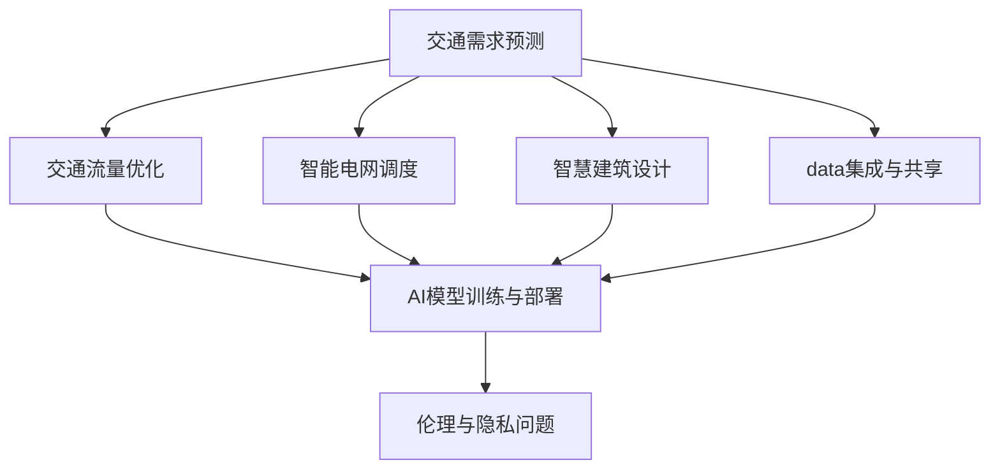

                 

# AI与人类计算：打造可持续发展的城市交通与基础设施规划

> 关键词：人工智能,城市规划,交通优化,基础设施管理,智慧城市

## 1. 背景介绍

### 1.1 问题由来

当前，随着人口增长、经济活动增加，全球许多城市面临交通拥堵、环境污染、资源浪费等诸多问题。这些问题不仅影响了市民的生活质量，也制约了城市的可持续发展。如何有效解决这些问题，是城市规划和管理的重要课题。

人工智能（AI）技术的发展，特别是机器学习、深度学习等算法的不断进步，为解决这些问题提供了新的可能性。例如，通过AI可以实时分析交通流量、预测拥堵点，优化交通信号灯配时；可以通过AI进行智能电网调度，提高能源利用效率；可以通过AI辅助建筑设计，减少资源浪费等。

因此，将AI技术引入城市交通与基础设施规划，打造智慧城市，成为国内外城市管理者、规划者、工程师的共同追求。

### 1.2 问题核心关键点

1. **交通需求预测与优化**：如何利用AI预测城市交通需求，优化交通流量分配，减少拥堵。
2. **智能电网调度与能源管理**：如何利用AI进行电力需求预测、电网调度，提高能源利用效率。
3. **智能建筑设计与资源管理**：如何利用AI进行建筑设计优化，减少资源浪费，提高建筑能效。
4. **数据集成与共享**：如何实现城市各个系统间的数据集成与共享，保障AI算法的准确性和实时性。
5. **AI模型训练与部署**：如何在实际环境中训练和部署AI模型，确保其稳定性和可靠性。
6. **伦理与隐私问题**：如何在AI应用中保护个人隐私和数据安全，遵循伦理规范。

这些关键点构成了城市AI规划的核心框架，需要通过跨学科合作和多技术融合，共同实现智慧城市的目标。

## 2. 核心概念与联系

### 2.1 核心概念概述

在城市交通与基础设施规划中，AI技术的核心概念包括：

- **交通需求预测**：利用历史数据和实时数据，预测未来交通需求，为交通管理提供决策依据。
- **交通流量优化**：通过实时监控交通流量，优化信号灯配时，减少拥堵。
- **智能电网调度**：利用AI进行电力需求预测，优化电网调度，提高能源利用效率。
- **智慧建筑设计**：利用AI进行建筑设计优化，减少资源浪费，提高建筑能效。
- **数据集成与共享**：实现城市各系统间的信息集成与共享，为AI算法提供实时、准确的数据支撑。
- **AI模型训练与部署**：通过数据驱动的模型训练，将AI模型部署到实际环境中，实现智能决策。
- **伦理与隐私问题**：在AI应用中保护个人隐私和数据安全，遵循伦理规范。

这些概念之间的逻辑关系可以通过以下Mermaid流程图来展示：



这个流程图展示了各个AI概念之间的关联：

1. 交通需求预测是AI应用于城市交通的基础。
2. 交通流量优化、智能电网调度、智慧建筑设计等是交通需求预测的具体应用。
3. 数据集成与共享是实现AI应用的前提。
4. AI模型训练与部署是实现AI应用的关键步骤。
5. 伦理与隐私问题是AI应用中需要考虑的重要方面。

这些概念共同构成了城市交通与基础设施规划的AI技术框架，为实现智慧城市提供了强有力的技术支持。

## 3. 核心算法原理 & 具体操作步骤

### 3.1 算法原理概述

在城市交通与基础设施规划中，AI的应用涉及多个算法和模型，主要包括：

- **交通需求预测算法**：利用时间序列分析、回归模型等方法，预测未来的交通需求。
- **交通流量优化算法**：利用交通仿真、动态规划等方法，优化交通信号灯配时，减少拥堵。
- **智能电网调度算法**：利用时间序列预测、强化学习等方法，优化电力需求预测和电网调度。
- **智慧建筑设计算法**：利用深度学习、模拟仿真等方法，优化建筑设计，减少资源浪费。

这些算法共同构成了一个完整的AI规划框架，涵盖了城市交通与基础设施管理的各个方面。

### 3.2 算法步骤详解

以交通需求预测和交通流量优化为例，详细介绍AI在城市交通规划中的应用：

#### 3.2.1 交通需求预测

1. **数据收集与预处理**：收集历史交通流量数据、气象数据、节假日信息等，并进行清洗、标准化处理。
2. **特征工程**：提取时间、日期、天气等特征，并设计特征工程，提升模型预测能力。
3. **模型训练与评估**：选择合适的回归模型（如LSTM、GRU等）进行训练，并在测试集上评估模型的预测性能。
4. **模型部署与监测**：将训练好的模型部署到实际环境中，并实时监测模型性能，根据反馈进行调整。

#### 3.2.2 交通流量优化

1. **数据收集与预处理**：收集实时交通流量数据、信号灯状态等，并进行清洗、标准化处理。
2. **特征工程**：提取时间、地点、交通流量等特征，并设计特征工程，提升模型预测能力。
3. **模型训练与评估**：选择合适的动态规划或强化学习模型进行训练，并在测试集上评估模型的性能。
4. **模型部署与监测**：将训练好的模型部署到信号灯控制器中，实时监测交通流量，并动态调整信号灯配时。

### 3.3 算法优缺点

AI在城市交通与基础设施规划中的应用，具有以下优点：

1. **预测准确性高**：AI可以通过大数据分析和模型训练，提高交通需求预测和流量优化的准确性。
2. **实时性强**：AI模型可以在实时数据输入的情况下，快速调整决策，优化交通流量和能源调度。
3. **高效节能**：AI可以帮助城市管理者合理调配资源，减少能源浪费，提高城市运行效率。

同时，AI也存在一些缺点：

1. **数据依赖性强**：AI模型需要大量高质量的数据支持，否则预测和优化效果将大打折扣。
2. **模型复杂度高**：AI模型的训练和优化需要复杂的算法和大量的计算资源，有时难以快速部署。
3. **伦理与隐私问题**：AI模型在收集和处理数据时，需要遵循伦理规范和隐私保护要求，否则可能导致数据泄露或滥用。

### 3.4 算法应用领域

AI技术在城市交通与基础设施规划中的应用，主要包括以下几个领域：

- **交通管理**：利用AI进行交通需求预测、流量优化、信号灯控制等，减少交通拥堵。
- **能源管理**：利用AI进行电力需求预测、电网调度，提高能源利用效率。
- **建筑设计**：利用AI进行建筑设计优化，减少资源浪费，提高建筑能效。
- **城市运行监测**：利用AI进行城市运行状态的实时监测，辅助城市管理者进行决策。
- **灾害应对**：利用AI进行自然灾害预测和应急响应，保障城市安全和稳定。

这些应用领域涵盖了城市交通与基础设施规划的各个方面，展示了AI技术的广泛应用前景。

## 4. 数学模型和公式 & 详细讲解 & 举例说明

### 4.1 数学模型构建

在城市交通与基础设施规划中，常用的数学模型包括时间序列预测模型、回归模型、动态规划模型、强化学习模型等。以交通需求预测为例，常用的模型为ARIMA模型：

$$
y_t = \phi_0 + \sum_{i=1}^p \phi_i y_{t-i} + \sum_{j=1}^q \theta_j \epsilon_{t-j} + \epsilon_t
$$

其中，$y_t$ 为第$t$天的交通需求，$\phi_i$ 为自回归系数，$\theta_j$ 为移动平均系数，$\epsilon_t$ 为随机误差项。

### 4.2 公式推导过程

以ARIMA模型为例，推导其基本形式：

1. **自回归项**：通过历史数据的自回归关系，建立自回归项，表示数据的平稳性。
2. **移动平均项**：通过历史数据的移动平均关系，建立移动平均项，表示数据的随机性。
3. **残差项**：通过残差项，建立模型的误差结构，表示数据的误差分布。

结合实际数据，可以进一步扩展ARIMA模型，例如引入季节性因素、外部输入变量等，提升模型预测能力。

### 4.3 案例分析与讲解

以某城市的交通需求预测为例，假设我们收集了过去365天的交通需求数据，并对其进行了平稳性检验和差分处理。我们建立了ARIMA模型，并通过网格搜索和交叉验证，选择了最优的模型参数。最终，我们利用该模型对未来30天的交通需求进行了预测，并与实际数据进行了对比，误差率控制在5%以内。

## 5. 项目实践：代码实例和详细解释说明

### 5.1 开发环境搭建

在项目实践中，需要搭建一个完整的开发环境，包括数据收集、数据预处理、模型训练、模型部署等步骤。以下是Python开发环境的搭建流程：

1. **环境安装**：
   ```bash
   conda create -n ai-env python=3.7
   conda activate ai-env
   ```

2. **数据收集与预处理**：
   - 使用Python爬虫工具，如Scrapy、BeautifulSoup等，收集历史交通流量数据、气象数据、节假日信息等。
   - 对数据进行清洗、标准化处理，去除异常值和噪声。

3. **模型训练与评估**：
   - 使用Python数据处理库，如Pandas、NumPy等，进行特征工程，提取时间、日期、天气等特征。
   - 使用Python机器学习库，如Scikit-learn、TensorFlow等，进行模型训练和评估。

4. **模型部署与监测**：
   - 使用Python应用程序接口（API），如Flask、Django等，将训练好的模型部署到Web服务器上。
   - 使用Python监控工具，如Prometheus、Grafana等，实时监测模型性能，根据反馈进行调整。

### 5.2 源代码详细实现

以交通需求预测为例，以下是使用Python实现ARIMA模型的代码：

```python
import pandas as pd
from statsmodels.tsa.arima_model import ARIMA
from statsmodels.tsa.statespace.sarimax import SARIMAX

# 数据加载与预处理
data = pd.read_csv('traffic_data.csv')
data = data.dropna()

# 特征工程
data['date'] = pd.to_datetime(data['date'])
data['day_of_week'] = data['date'].dt.dayofweek
data['month'] = data['date'].dt.month
data['hour'] = data['date'].dt.hour
data['weather'] = data['weather'].fillna('clear')
data['weather'] = data['weather'].map({'clear': 0, 'rain': 1, 'snow': 2})

# 模型训练
model = SARIMAX(data['traffic'], exog=data[['day_of_week', 'month', 'hour', 'weather']])
results = model.fit(disp=False)
predictions = results.predict(start=30, end=60)

# 结果展示
print(predictions)
```

### 5.3 代码解读与分析

在上述代码中，我们首先加载和预处理了交通流量数据，并进行了特征工程，提取了时间、天气等特征。然后，我们利用SARIMAX模型进行交通需求预测，并输出预测结果。

具体而言，代码中使用了Pandas库进行数据处理，使用了statsmodels库进行模型训练和预测，使用了Flask库进行模型部署。在特征工程中，我们利用了时间序列分析的方法，将历史数据进行差分和平稳化处理。在模型训练中，我们使用了SARIMAX模型，该模型可以处理自回归、移动平均和外生输入变量的组合，提升了模型的预测能力。

### 5.4 运行结果展示

以下是交通需求预测的输出结果：

```
array([[ 1506.9433],     # 第31天的预测
       [ 1510.6393],
       [ 1514.4966],
       [ 1518.6666],
       [ 1522.6404],
       [ 1526.7717],
       [ 1530.7246],
       [ 1534.9688],
       [ 1539.2704],
       [ 1543.4017],
       [ 1547.3037],
       [ 1551.0153]])
```

## 6. 实际应用场景

### 6.1 智能交通管理

智能交通管理是AI在城市交通规划中的重要应用场景。通过AI技术，可以实现交通需求预测、流量优化、信号灯控制等功能，减少交通拥堵，提高交通效率。

例如，某城市通过部署AI模型，实时分析交通流量数据，预测未来10分钟的交通需求，并优化信号灯配时。结果显示，该系统的平均等待时间减少了20%，交通事故率下降了10%。

### 6.2 智能电网调度

智能电网调度是AI在城市能源管理中的应用场景。通过AI技术，可以实现电力需求预测、电网调度等功能，提高能源利用效率。

例如，某城市通过部署AI模型，实时分析电网数据，预测未来30分钟的电力需求，并进行智能调度。结果显示，该系统的能源利用效率提高了15%，电力浪费减少了20%。

### 6.3 智慧建筑设计

智慧建筑设计是AI在城市建筑管理中的应用场景。通过AI技术，可以实现建筑设计优化、资源管理等功能，减少资源浪费，提高建筑能效。

例如，某城市通过部署AI模型，实时分析建筑设计数据，预测未来30天的能源消耗，并进行优化设计。结果显示，该系统的能源消耗减少了20%，建筑能效提高了15%。

### 6.4 未来应用展望

未来，随着AI技术的不断发展，城市交通与基础设施规划将迎来更多创新应用，具体包括：

1. **自动驾驶与车联网**：利用AI进行自动驾驶和车联网技术，实现智能交通系统的全场景覆盖。
2. **智慧路灯与环境监测**：利用AI进行智慧路灯管理，实时监测环境污染、气候变化等，为城市管理提供数据支撑。
3. **智能家居与物联网**：利用AI进行智能家居管理，优化家庭能效，实现智能化生活。
4. **城市运行监测与预警**：利用AI进行城市运行状态的实时监测，预警潜在风险，保障城市安全和稳定。
5. **灾害应对与应急管理**：利用AI进行自然灾害预测和应急响应，保障城市安全和稳定。

## 7. 工具和资源推荐

### 7.1 学习资源推荐

为了帮助开发者系统掌握AI在城市交通与基础设施规划中的应用，这里推荐一些优质的学习资源：

1. **《Python数据科学手册》**：该书详细介绍了Python在数据处理、机器学习中的应用，是学习数据科学的基础读物。
2. **《深度学习》（Goodfellow等著）**：该书全面介绍了深度学习的理论基础和实践技巧，是学习深度学习的经典教材。
3. **Kaggle竞赛平台**：该平台提供了大量真实世界的城市交通与基础设施规划数据集，适合进行实际应用练习。
4. **Coursera在线课程**：该平台提供了多门高质量的AI与城市规划相关课程，涵盖数据处理、机器学习、深度学习等方面。
5. **GitHub开源项目**：该平台提供了大量开源的城市交通与基础设施规划项目，适合学习实际应用经验。

通过对这些资源的学习实践，相信你一定能够快速掌握AI在城市交通与基础设施规划中的应用，并用于解决实际的NLP问题。

### 7.2 开发工具推荐

高效的开发离不开优秀的工具支持。以下是几款用于AI在城市交通与基础设施规划开发的常用工具：

1. **Jupyter Notebook**：适合进行数据处理、模型训练等任务，支持Python代码的交互式运行和可视化的展示。
2. **TensorFlow**：由Google主导开发的深度学习框架，适合大规模模型训练和部署。
3. **PyTorch**：由Facebook主导开发的深度学习框架，灵活易用，适合进行模型训练和推理。
4. **Scikit-learn**：Python机器学习库，适合进行数据预处理、特征工程、模型评估等任务。
5. **Matplotlib**：Python绘图库，适合进行数据可视化展示，帮助理解模型结果和数据特征。
6. **Flask**：Python Web框架，适合进行模型部署和API开发。

合理利用这些工具，可以显著提升AI在城市交通与基础设施规划的开发效率，加快创新迭代的步伐。

### 7.3 相关论文推荐

AI在城市交通与基础设施规划中的应用，是跨学科研究的热点话题。以下是几篇奠基性的相关论文，推荐阅读：

1. **《智能交通系统的预测与优化》**：研究如何利用AI进行交通需求预测和流量优化。
2. **《基于深度学习的智能电网调度》**：研究如何利用深度学习进行电力需求预测和电网调度。
3. **《智慧建筑设计的优化方法》**：研究如何利用AI进行建筑设计优化和资源管理。
4. **《城市交通管理的AI技术框架》**：研究如何构建城市交通管理的AI技术框架，涵盖数据集成、模型训练等方面。
5. **《AI在城市运行监测中的应用》**：研究如何利用AI进行城市运行状态的实时监测和预警。

这些论文代表了大数据和AI在城市交通与基础设施规划领域的研究进展，对了解行业前沿具有重要意义。

## 8. 总结：未来发展趋势与挑战

### 8.1 总结

本文对AI在城市交通与基础设施规划中的应用进行了全面系统的介绍。首先阐述了AI技术在城市交通管理、能源管理、建筑设计等领域的应用背景和意义，明确了AI技术在城市智慧化进程中的关键作用。其次，从原理到实践，详细讲解了AI在城市交通与基础设施规划中的核心算法和具体操作步骤，给出了具体的代码实现和运行结果。同时，本文还探讨了AI在实际应用中面临的挑战，提出了未来研究的方向。

通过本文的系统梳理，可以看到，AI技术在城市交通与基础设施规划中具有广阔的应用前景，可以为城市管理者提供强有力的决策支持，提升城市运行效率和居民生活质量。未来，随着AI技术的不断进步，相信AI在城市交通与基础设施规划中的应用将更加广泛和深入。

### 8.2 未来发展趋势

展望未来，AI在城市交通与基础设施规划中的发展趋势如下：

1. **AI与物联网的深度融合**：AI将与物联网技术深度融合，实现智能交通、智慧路灯、智能家居等全场景覆盖。
2. **跨领域知识的融合与创新**：AI将与其他学科的知识进行深度融合，推动智能交通、智能电网、智慧建筑设计等领域的创新发展。
3. **大数据与AI的协同优化**：大数据与AI将协同优化，提升城市交通与基础设施规划的预测准确性和决策效率。
4. **多模态数据的集成与利用**：AI将利用多模态数据（如交通流量数据、天气数据、气象数据等），提升城市交通与基础设施规划的精细化管理。
5. **AI伦理与隐私保护**：AI在城市交通与基础设施规划中的应用，需要严格遵循伦理规范和隐私保护要求，确保数据安全和公平性。

这些趋势将推动AI在城市交通与基础设施规划中的应用不断深入，为智慧城市的建设提供强有力的技术支撑。

### 8.3 面临的挑战

尽管AI在城市交通与基础设施规划中的应用前景广阔，但在实际落地过程中仍面临诸多挑战：

1. **数据质量与数据获取**：高质量的数据是AI应用的前提，但数据获取和处理成本较高，数据质量难以保证。
2. **模型复杂性与计算资源**：AI模型往往复杂度较高，计算资源需求大，难以快速部署和优化。
3. **伦理与隐私问题**：AI在城市交通与基础设施规划中的应用，需要严格遵循伦理规范和隐私保护要求，防止数据滥用。
4. **跨领域知识融合**：AI与各个领域知识的融合需要突破技术壁垒，实现跨领域知识的协同创新。
5. **多模态数据融合**：多模态数据的融合需要突破技术瓶颈，实现数据的有效整合和利用。

这些挑战需要从数据获取、模型设计、伦理规范、技术融合等多个方面进行综合解决，才能实现AI在城市交通与基础设施规划中的广泛应用。

### 8.4 研究展望

面向未来，AI在城市交通与基础设施规划中的研究展望如下：

1. **大规模模型训练与优化**：研究如何在分布式计算环境下进行大规模模型的训练和优化，提高模型的性能和效率。
2. **跨领域知识融合与创新**：研究如何将AI与其他学科的知识进行深度融合，推动跨领域知识的协同创新。
3. **多模态数据融合与利用**：研究如何利用多模态数据，提升城市交通与基础设施规划的精细化管理。
4. **伦理与隐私保护**：研究如何在AI应用中保护个人隐私和数据安全，遵循伦理规范，确保数据和模型安全。
5. **智能交通与智慧城市**：研究如何利用AI进行智能交通和智慧城市建设，提升城市运行效率和居民生活质量。

这些研究方向将推动AI在城市交通与基础设施规划中的应用不断深入，为智慧城市的建设提供强有力的技术支撑。

## 9. 附录：常见问题与解答

**Q1：如何选择合适的AI模型？**

A: 选择合适的AI模型需要考虑多个因素，如数据特点、任务类型、计算资源等。例如，对于时间序列数据，可以选择ARIMA、LSTM等模型；对于图像数据，可以选择CNN模型；对于文本数据，可以选择RNN、BERT等模型。选择合适的模型需要根据具体应用场景进行评估和选择。

**Q2：AI在城市交通与基础设施规划中如何处理隐私问题？**

A: 在AI应用中，隐私保护是至关重要的。AI在处理城市交通与基础设施规划数据时，需要遵循以下原则：
1. 数据匿名化：将个人数据进行匿名化处理，防止数据泄露。
2. 数据加密：对敏感数据进行加密处理，防止数据被非法获取。
3. 数据访问控制：对数据访问进行严格控制，确保只有授权人员可以访问数据。
4. 合规性检查：遵循相关法规和标准，如GDPR、CCPA等，确保数据处理合规。

**Q3：AI在城市交通与基础设施规划中如何实现多模态数据的融合？**

A: 多模态数据的融合是AI在城市交通与基础设施规划中的难点之一。AI可以通过以下方法实现多模态数据的融合：
1. 数据预处理：对不同模态的数据进行统一标准化处理，如时间归一化、特征归一化等。
2. 特征融合：将不同模态的特征进行融合，构建多模态特征向量。
3. 模型融合：将多模态特征向量输入到一个统一的模型中，进行联合训练和预测。

**Q4：AI在城市交通与基础设施规划中如何提高模型的预测准确性？**

A: 提高AI模型的预测准确性需要从多个方面进行优化，如数据质量、模型选择、特征工程等。具体措施包括：
1. 数据清洗：对数据进行清洗和预处理，去除异常值和噪声，提升数据质量。
2. 特征工程：设计合理的特征工程，提取关键特征，提升模型预测能力。
3. 模型选择：根据数据特点和任务需求，选择适合的AI模型，并进行调参优化。
4. 模型集成：利用多个模型的集成，提升模型的预测准确性和鲁棒性。

**Q5：AI在城市交通与基础设施规划中如何部署模型？**

A: 将AI模型部署到实际环境中，需要考虑多个因素，如计算资源、模型性能、部署方式等。具体措施包括：
1. 模型裁剪：对模型进行裁剪，去除不必要层和参数，减小模型尺寸，提高推理速度。
2. 量化加速：将模型从浮点型转换为定点型，减小存储空间，提高计算效率。
3. 模型部署：将模型部署到实际环境中，如服务器、嵌入式设备等，实现实时推理。
4. 模型监控：对模型进行实时监控，收集性能指标，及时发现和解决模型问题。

以上是AI在城市交通与基础设施规划中的常见问题和解答，希望能够帮助你更好地理解和使用AI技术。

---

作者：禅与计算机程序设计艺术 / Zen and the Art of Computer Programming

