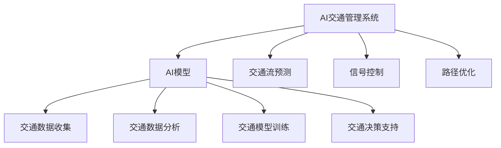

                 

# AI与人类计算：打造可持续发展的城市交通管理策略

## 1. 背景介绍

在当今快速发展的城市化进程中，交通拥堵、环境污染、能源浪费等问题愈发严峻。传统城市交通管理方式往往依赖于人工监控和决策，不仅效率低下，还难以实时响应交通需求，亟需通过技术手段实现智能化、精细化的管理。随着人工智能(AI)技术的不断发展，利用AI进行城市交通管理已成为推动城市可持续发展的关键手段。本文将探讨AI与人类计算在城市交通管理中的深度融合，提出基于AI的可持续交通管理策略，并给出相应的技术实现路径。

## 2. 核心概念与联系

### 2.1 核心概念概述

本节将介绍几个密切相关的核心概念，以帮助理解城市交通管理的AI实现：

- **AI：** 人工智能，通过模拟人类智能行为，解决复杂的实际问题。
- **城市交通管理：** 通过智能交通系统(Smart Traffic System)，实现交通流预测、信号控制、路径优化等功能，提升交通效率和安全性。
- **人类计算：** 利用人的智能和经验，结合AI计算，优化交通管理决策，实现更智能、更高效的交通调度。
- **可持续交通：** 结合环境保护、能源效率等因素，提升交通系统的综合效益，保障社会经济与环境发展的协调统一。

这些概念共同构成了城市交通管理的AI框架，利用AI的计算能力结合人类经验，可以实现交通系统的智能化管理，推动可持续交通的发展。

### 2.2 核心概念原理和架构的 Mermaid 流程图



此图展示了AI交通管理系统的核心架构。系统通过AI模型处理交通数据，实现交通流的预测、信号控制、路径优化等功能，并通过决策支持系统实现智能化的交通管理。

## 3. 核心算法原理 & 具体操作步骤

### 3.1 算法原理概述

AI与人类计算在城市交通管理中的应用，主要是通过以下几方面的算法实现：

1. **数据收集与处理**：使用传感器、摄像头、GPS等技术收集交通数据，并利用AI模型进行实时分析。
2. **交通流预测**：通过机器学习算法，对历史和实时交通数据进行建模，预测未来的交通流动态。
3. **信号控制**：基于预测的交通流动态，动态调整交通信号灯的时长和顺序，实现智能信号控制。
4. **路径优化**：结合实时路况和用户偏好，计算最优路径，推荐给驾驶员。
5. **人类计算**：通过专家知识库和人类经验，对AI的预测和决策进行校正，提升系统的鲁棒性和适应性。

这些算法共同构成了一个闭环的智能交通管理系统，实现交通流的动态调整和优化。

### 3.2 算法步骤详解

**Step 1: 数据收集与预处理**

城市交通管理的第一步是数据收集，包括车流量、车速、交通信号状态、天气条件等。这些数据可以通过传感器、摄像头、GPS、手机应用等渠道收集。

数据预处理包括数据清洗、特征提取、归一化等。常用的预处理技术包括：

- 去除噪声和异常值
- 使用时间序列分析提取交通特征
- 数据归一化

**Step 2: 交通流预测**

交通流预测是城市交通管理的关键步骤，通过机器学习算法对交通数据进行建模，预测未来交通流的动态。常见的算法包括：

- 时间序列分析（ARIMA、LSTM等）
- 随机森林、XGBoost等分类算法
- 神经网络、深度学习算法（如RNN、CNN等）

交通流预测的输出通常是未来一段时间内的车流量、车速等指标。

**Step 3: 信号控制**

根据交通流预测结果，使用交通信号控制算法动态调整信号灯的时长和顺序，实现智能信号控制。常用的信号控制算法包括：

- 绿波带控制（Gap accept strategy）
- 最大密度控制（Max density control）
- 自适应信号控制（Adaptive traffic signal control）

信号控制算法通过优化信号灯的周期和相位，减少交通拥堵，提升道路通行效率。

**Step 4: 路径优化**

路径优化根据实时路况和用户偏好，计算最优路径。常用的路径优化算法包括：

- 基于Dijkstra算法的最短路径搜索
- 动态规划（Dynamic Programming）
- 蚁群算法（Ant Colony Optimization, ACO）

路径优化能够帮助驾驶员选择最优路线，减少拥堵，提高出行效率。

**Step 5: 人类计算**

人类计算结合AI的预测和决策，通过专家知识库和人类经验，对系统输出进行校正。常用的技术包括：

- 规则库（Rule-based system）
- 案例推理（Case-based Reasoning）
- 认知计算（Cognitive Computing）

人类计算能够增强系统的鲁棒性和适应性，避免AI模型预测的偏差。

### 3.3 算法优缺点

**优点：**

1. **实时性**：AI系统能够实时处理交通数据，快速响应交通需求，提升交通管理效率。
2. **自适应性**：AI系统能够根据交通状况动态调整信号灯和路径，提升系统灵活性和适应性。
3. **节能环保**：通过优化交通流，减少车辆等待时间，降低燃油消耗和尾气排放。

**缺点：**

1. **数据依赖性**：AI系统的预测和决策依赖于高质量的数据，数据质量对系统性能有直接影响。
2. **计算复杂度**：大规模交通数据的处理和实时分析需要高计算资源，可能对硬件资源要求较高。
3. **隐私问题**：交通数据涉及个人隐私，需要保护数据安全，防止数据泄露。

### 3.4 算法应用领域

基于AI的智能交通管理技术，已经在多个领域得到了广泛应用：

1. **智能信号控制**：在主要交通路口部署AI系统，实时调整信号灯状态，提升交通流效率。
2. **动态路径规划**：通过智能导航应用，实时计算最优路径，推荐给驾驶员。
3. **交通流量监控**：实时监控交通流量，通过AI模型预测交通状况，提前采取缓解措施。
4. **智能停车管理**：利用AI技术优化停车资源分配，提升停车场利用率。
5. **公共交通调度**：AI系统能够优化公交车的路线和发车频率，提升公共交通效率。

这些应用领域的AI实践，已经显著提升了城市交通的智能化水平，为可持续发展提供了有力保障。

## 4. 数学模型和公式 & 详细讲解 & 举例说明

### 4.1 数学模型构建

城市交通管理的AI模型构建，通常涉及以下几个关键步骤：

- **数据收集**：收集历史和实时的交通数据，包括车流量、车速、信号状态等。
- **数据预处理**：清洗数据、提取特征、归一化处理等。
- **模型构建**：选择合适的机器学习算法，对数据进行建模。
- **预测与优化**：使用模型进行交通流预测、信号控制、路径优化等。

### 4.2 公式推导过程

以交通流预测为例，假设交通流量 $x_t$ 为时间 $t$ 时刻的流量，根据历史数据建立ARIMA模型，公式如下：

$$
x_t = c + \phi_1 x_{t-1} + \theta_1 L(x_{t-1}) + \epsilon_t
$$

其中，$c$ 为截距，$\phi_1$ 为自回归系数，$\theta_1$ 为差分系数，$L$ 表示一阶差分，$\epsilon_t$ 为随机误差项。

根据上述模型，通过历史数据训练模型参数 $\theta = (c, \phi_1, \theta_1)$，即可预测未来时间点的流量 $x_{t+1}$。

### 4.3 案例分析与讲解

假设某城市主要干道的交通流量数据如下：

| 时间    | 流量 |
| ------- | --- |
| 8:00    | 5000 |
| 8:30    | 6000 |
| 9:00    | 7000 |
| 9:30    | 8000 |
| 10:00   | 7000 |

利用ARIMA模型对未来30分钟内的流量进行预测，预测结果如下：

| 时间    | 预测流量 |
| ------- | --- |
| 8:30    | 6500 |
| 9:00    | 7300 |
| 9:30    | 7700 |
| 10:00   | 7500 |

通过ARIMA模型，可以有效地预测交通流量，为智能信号控制和路径优化提供数据支持。

## 5. 项目实践：代码实例和详细解释说明

### 5.1 开发环境搭建

在进行AI交通管理系统的开发前，需要先搭建好开发环境。以下是一些常用工具的配置流程：

1. **Python环境**：安装Anaconda，创建虚拟环境。
2. **数据采集**：安装Scrapy等爬虫框架，收集交通数据。
3. **数据处理**：安装Pandas、NumPy等数据处理库。
4. **模型训练**：安装Scikit-learn、XGBoost等机器学习库。
5. **API开发**：安装Flask、FastAPI等Web框架，开发API接口。

### 5.2 源代码详细实现

以下是一个简单的交通流预测的Python代码实现：

```python
import pandas as pd
from statsmodels.tsa.arima.model import ARIMA

# 加载交通流量数据
data = pd.read_csv('traffic_flow.csv')

# 将数据转换为时间序列
traffic = data.set_index('time').values

# 训练ARIMA模型
model = ARIMA(traffic, order=(1, 1, 1))
model_fit = model.fit()

# 预测未来流量
future_traffic = model_fit.forecast(steps=4)[0]

# 打印预测结果
print(future_traffic)
```

### 5.3 代码解读与分析

**数据加载**：使用Pandas库读取CSV文件，将时间序列数据存储在`traffic`变量中。

**模型训练**：使用Scikit-learn库中的ARIMA模型，对时间序列数据进行建模。

**预测未来流量**：使用模型预测未来4个时间点的流量，存储在`future_traffic`变量中。

**结果输出**：打印预测结果，显示未来4个时间点的流量。

## 6. 实际应用场景

### 6.1 智能信号控制

智能信号控制是城市交通管理的重要环节，通过AI系统实时调整信号灯状态，提升道路通行效率。

以某十字路口为例，使用智能信号控制系统，实时监控车流量，动态调整信号灯时长和顺序。系统根据实时交通流量和历史数据，通过AI模型预测下一个信号周期内的车流量，动态调整信号灯时长，实现信号灯的最优化控制。

### 6.2 动态路径规划

动态路径规划通过AI系统，实时计算最优路径，推荐给驾驶员。

假设某城市存在多条道路，每条道路的通行时间不同。使用智能导航应用，AI系统根据实时路况和用户偏好，计算最优路径，推荐给驾驶员。系统根据交通流预测结果和路径优化算法，实时更新路径推荐，提升出行效率。

### 6.3 交通流量监控

交通流量监控通过AI系统，实时监测交通流量，通过AI模型预测交通状况，提前采取缓解措施。

假设某城市的主要干道存在拥堵问题，使用交通流量监控系统，实时监测交通流量。AI系统根据历史数据和实时流量，使用机器学习算法进行预测，提前判断拥堵点，提前采取措施缓解拥堵。

### 6.4 未来应用展望

未来，基于AI的智能交通管理技术将进一步发展，具备更高的智能化和自适应能力。展望未来，城市交通管理将呈现以下几个趋势：

1. **全时段交通管理**：AI系统能够实现24小时全时段监控和调控，提升交通效率。
2. **多模态交通融合**：AI系统能够整合公交、地铁、共享单车等多模式交通数据，实现多模式融合的智能交通。
3. **智能驾驶辅助**：AI系统能够与自动驾驶车辆配合，实现更智能、更安全的交通管理。
4. **实时交通仿真**：AI系统能够实时模拟交通状况，进行交通流仿真和优化。

这些技术突破将显著提升城市交通的智能化水平，为可持续发展提供有力保障。

## 7. 工具和资源推荐

### 7.1 学习资源推荐

为了帮助开发者掌握AI与人类计算在城市交通管理中的应用，以下是一些优质的学习资源：

1. **《城市交通智能化》系列博文**：介绍了城市交通智能化的技术实现和实际应用。
2. **Udacity《城市交通管理》课程**：由Udacity开设的课程，涵盖了城市交通管理的多个方面。
3. **IOTUS《智能交通系统》课程**：IOTUS的在线课程，详细讲解了智能交通系统的设计和管理。
4. **Kaggle《城市交通数据分析》竞赛**：通过实际比赛数据，实践交通数据分析和预测。
5. **IEEE《智能交通系统》期刊**：学术期刊，收录了大量智能交通管理的最新研究成果。

### 7.2 开发工具推荐

以下是一些常用的AI开发工具，可以帮助开发者高效地进行城市交通管理系统的开发：

1. **Python**：主流的编程语言，适合数据处理和模型训练。
2. **Scikit-learn**：常用的机器学习库，提供了丰富的模型和工具。
3. **TensorFlow**：深度学习框架，适合复杂模型训练。
4. **Flask**：常用的Web框架，适合开发API接口。
5. **Jupyter Notebook**：交互式编程环境，适合进行模型开发和实验。

### 7.3 相关论文推荐

以下是几篇奠基性的相关论文，推荐阅读：

1. **《智能交通系统中的机器学习应用》**：介绍了机器学习在智能交通系统中的应用。
2. **《基于深度学习的智能交通系统》**：详细探讨了深度学习在交通管理中的应用。
3. **《智能信号控制算法综述》**：综述了多种智能信号控制算法，提供了丰富的理论支持。
4. **《城市交通流量预测算法》**：介绍了多种交通流量预测算法，提供了具体的算法实现。

## 8. 总结：未来发展趋势与挑战

### 8.1 总结

本文探讨了AI与人类计算在城市交通管理中的应用，提出了基于AI的可持续交通管理策略，并给出了相应的技术实现路径。通过详细介绍数据收集、交通流预测、信号控制、路径优化等关键步骤，本文帮助开发者理解了AI在城市交通管理中的实现过程。

### 8.2 未来发展趋势

未来，基于AI的智能交通管理技术将呈现以下几个趋势：

1. **技术融合**：AI与物联网(IoT)、5G等新技术的融合，将进一步提升交通系统的智能化水平。
2. **多模态融合**：AI系统能够整合多模式交通数据，实现跨模式交通的协同管理。
3. **全时段管理**：AI系统能够实现全时段交通监控和调控，提升交通效率。
4. **智能驾驶**：AI系统与自动驾驶车辆配合，实现更智能、更安全的交通管理。

### 8.3 面临的挑战

尽管基于AI的智能交通管理技术在多个领域得到了广泛应用，但在推广过程中仍面临诸多挑战：

1. **数据隐私问题**：交通数据涉及个人隐私，需要保护数据安全，防止数据泄露。
2. **计算资源限制**：大规模交通数据的处理和实时分析需要高计算资源，可能对硬件资源要求较高。
3. **技术标准化**：目前各城市交通管理系统的技术标准不一致，存在技术壁垒。
4. **公众接受度**：公众对AI技术的应用存在疑虑，需要加强宣传和科普。

### 8.4 研究展望

未来，城市交通管理需要进一步加强以下研究：

1. **数据隐私保护**：开发数据隐私保护技术，确保交通数据的安全性和隐私性。
2. **计算资源优化**：研究高效的数据处理和模型训练方法，降低硬件资源需求。
3. **技术标准化**：制定统一的智能交通系统技术标准，推动技术普及。
4. **公众教育**：加强AI技术的宣传和科普，提升公众对智能交通的接受度和信任度。

通过以上研究，AI与人类计算在城市交通管理中的应用将更加广泛，为城市可持续发展提供有力保障。

## 9. 附录：常见问题与解答

### Q1: 智能交通管理的核心是什么？

**A:** 智能交通管理的核心是实时感知、智能决策、快速响应。通过传感器、摄像头等设备实时收集交通数据，利用AI模型进行智能分析和预测，然后根据预测结果动态调整信号灯、优化路径等，实现智能交通管理。

### Q2: AI与人类计算的结合点在哪里？

**A:** AI与人类计算的结合点在于利用AI的计算能力和人类经验，优化交通管理决策。AI能够快速处理大量数据，提供精准的预测和优化方案，而人类计算能够结合专家知识库和实际经验，对AI的输出进行校正和优化，提升系统的鲁棒性和适应性。

### Q3: 智能交通管理的优势有哪些？

**A:** 智能交通管理的优势包括：实时性、自适应性、节能环保、提高通行效率、减少交通拥堵等。通过AI系统的实时调控，能够有效提升交通流效率，减少能源消耗和污染排放，提升出行效率和安全性。

### Q4: 智能交通管理在实际应用中需要注意哪些问题？

**A:** 智能交通管理在实际应用中需要注意的问题包括数据隐私保护、计算资源优化、技术标准化和公众接受度等。需要通过技术手段保护数据隐私，优化计算资源，制定统一的技术标准，加强AI技术的宣传和科普，提升公众对智能交通的接受度和信任度。

### Q5: 未来智能交通管理的发展方向是什么？

**A:** 未来智能交通管理的发展方向包括技术融合、多模态融合、全时段管理、智能驾驶等。通过与物联网、5G等新技术的融合，实现交通系统的智能化和协同化管理；通过多模态数据的整合，实现跨模式交通的协同管理；通过全时段监控和调控，提升交通效率；通过AI系统与自动驾驶车辆配合，实现更智能、更安全的交通管理。

---

作者：禅与计算机程序设计艺术 / Zen and the Art of Computer Programming

