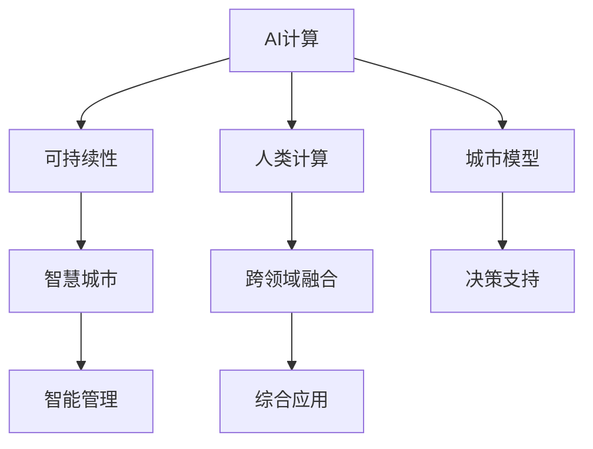

                 

# AI与人类计算：打造可持续发展的城市模型

> 关键词：
    - AI计算
    - 城市模型
    - 可持续发展
    - 人类计算
    - 智慧城市
    - 人工智能
    - 数据驱动

## 1. 背景介绍

### 1.1 问题由来

随着城市化进程的加速，人口规模不断增长，基础设施建设和服务需求不断提升。然而，城市管理的复杂性和资源分配的不均衡性也带来了巨大的挑战。传统城市管理模式面临数据收集难度大、实时性差、决策难等问题，迫切需要引入先进的智能化手段来提升管理效率和质量。

人工智能（AI）技术的快速发展，为城市管理提供了新的思路和工具。AI不仅能够处理海量数据、提供精准的决策支持，还能促进资源的优化配置，助力城市可持续发展。然而，AI在城市管理中的应用不仅需要强大的算法支撑，还需要与人类计算能力相结合，实现智能与经验、技术与管理的有机融合。

### 1.2 问题核心关键点

AI与人类计算的结合，成为智慧城市建设的重点。其核心在于：

- 数据驱动：智慧城市的基础是海量数据，AI技术能够高效处理这些数据，提供深度分析、可视化等服务。
- 智能决策：AI算法结合人类经验，能够实现更精准、及时的决策支持。
- 可持续性：AI技术的引入，优化了资源配置，提升了城市管理的可持续性。
- 跨领域融合：AI技术不仅在城市管理中发挥作用，还能与教育、医疗等领域深度融合，创造更多价值。

## 2. 核心概念与联系

### 2.1 核心概念概述

为更好地理解AI与人类计算在智慧城市模型中的应用，本节将介绍几个密切相关的核心概念：

- AI计算：指使用人工智能技术进行计算的过程，包括机器学习、深度学习、自然语言处理等。
- 城市模型：指模拟城市系统运行状态的数学模型，包括交通、能源、环境等多个方面。
- 可持续发展：指在满足当代需求的同时，不损害后代满足其需求的能力。
- 人类计算：指利用人类智能进行复杂问题的解决，包括经验、直觉、创造力等。
- 智慧城市：指通过AI技术和人类计算能力，实现城市管理的智能化、精准化和可持续发展。

这些核心概念之间的逻辑关系可以通过以下Mermaid流程图来展示：



这个流程图展示了一系列核心概念及其之间的关系：

1. AI计算通过处理海量数据，为城市模型提供输入。
2. 城市模型是城市运行的数学描述，结合AI计算提供的信息，进行优化和预测。
3. 可持续性是城市模型的目标之一，AI计算可以帮助优化资源配置，提升可持续性。
4. 人类计算与AI计算相辅相成，共同解决问题。
5. 智慧城市是城市模型、AI计算和人类计算的综合应用，实现智能化管理。
6. 跨领域融合进一步拓展了AI和人类计算的应用范围，带来更多创新价值。

这些概念共同构成了智慧城市建设的理论基础，使我们能够更好地理解和应用AI与人类计算。

## 3. 核心算法原理 & 具体操作步骤
### 3.1 算法原理概述

AI与人类计算在智慧城市模型中的应用，本质上是利用数据驱动的决策支持系统。其核心在于：

- 数据采集与预处理：收集城市运行的相关数据，通过清洗、处理等步骤，转化为可供分析的格式。
- 模型构建与优化：使用AI算法构建城市模型，并通过训练优化模型参数，使其能够精准预测和决策。
- 人类参与与迭代：结合人类经验，对模型输出进行修正和优化，确保决策的合理性和可执行性。
- 综合应用与评估：将模型应用于实际城市管理中，通过评估效果进行持续改进。

### 3.2 算法步骤详解

基于AI与人类计算的智慧城市模型构建一般包括以下几个关键步骤：

**Step 1: 数据采集与预处理**

- 收集城市运行的相关数据，包括交通流量、能源消耗、环境污染等。
- 对数据进行清洗、去噪、归一化等预处理，确保数据的质量和一致性。
- 使用数据标注工具，为部分数据打上标签，用于监督学习。

**Step 2: 模型构建与优化**

- 选择合适的AI算法，如深度学习、强化学习等，构建城市模型。
- 在标注数据集上进行模型训练，调整模型参数，提高模型的预测精度。
- 使用正则化技术，如L2正则、Dropout等，防止过拟合。

**Step 3: 人类参与与迭代**

- 将模型输出与人类经验相结合，进行修正和优化。
- 建立反馈机制，收集人类对模型输出的意见，用于模型改进。
- 定期更新模型参数，保持模型的最新状态。

**Step 4: 综合应用与评估**

- 将优化后的模型应用于城市管理中，如交通调度、能源管理等。
- 实时监测模型效果，通过评估指标进行性能评估。
- 根据评估结果，持续改进模型和策略。

以上是智慧城市模型构建的一般流程。在实际应用中，还需要针对具体城市的特点，对模型进行优化设计，如引入更多的AI算法、使用更先进的硬件设施等。

### 3.3 算法优缺点

基于AI与人类计算的智慧城市模型构建方法具有以下优点：

- 高效数据处理：AI算法能够处理海量数据，提供精准的分析支持。
- 智能决策：AI模型结合人类经验，能够实现更精准、及时的决策。
- 资源优化：通过优化模型参数，提升资源配置效率。
- 可持续性：AI技术优化了资源配置，提升了城市的可持续性。

同时，该方法也存在一定的局限性：

- 依赖高质量数据：模型效果依赖于数据的全面性和准确性。
- 算法复杂度高：AI算法的复杂度较高，需要较强的计算资源。
- 人类经验不易量化：人类经验与AI算法的融合需考虑如何量化和优化。
- 模型迭代成本高：模型的优化和迭代需要大量人力和时间成本。

尽管存在这些局限性，但就目前而言，基于AI与人类计算的智慧城市模型构建方法仍是最主流的选择。未来相关研究的重点在于如何进一步降低数据采集和处理的成本，提高算法的效率和可解释性，同时兼顾可持续性和成本效益等因素。

### 3.4 算法应用领域

基于AI与人类计算的智慧城市模型构建方法，在智慧城市建设中得到了广泛应用，覆盖了交通、能源、环保等多个领域，具体应用包括：

- 智能交通系统：通过AI算法分析交通流量数据，实现交通信号优化、事故预测等。
- 能源管理系统：利用AI算法优化能源消耗，提升能源利用效率。
- 环境保护监测：通过AI算法分析环境数据，实现污染源监测、治理效果评估等。
- 智能医疗系统：结合AI算法和医疗专家经验，实现疾病预测、个性化治疗等。
- 教育辅助系统：利用AI算法分析学生数据，实现个性化学习、教育评估等。
- 城市应急响应：通过AI算法预测灾害，结合人类经验优化应急响应策略。

除了上述这些经典应用外，智慧城市模型还被创新性地应用到更多场景中，如智慧农业、智能物流、智慧旅游等，为城市管理带来了新的突破。

## 4. 数学模型和公式 & 详细讲解  
### 4.1 数学模型构建

本节将使用数学语言对基于AI与人类计算的智慧城市模型构建过程进行更加严格的刻画。

记城市运行数据为 $D=\{(x_i,y_i)\}_{i=1}^N$，其中 $x_i$ 为输入变量，$y_i$ 为输出变量。假设城市模型为 $M_{\theta}(x)$，其中 $\theta$ 为模型参数。

定义模型的预测误差为 $E(x)$，目标为最小化预测误差，即：

$$
\theta^* = \mathop{\arg\min}_{\theta} \mathcal{E}(D)
$$

其中 $\mathcal{E}(D)$ 为数据集 $D$ 上的预测误差函数，通常为均方误差（MSE）或交叉熵（CE）。

在实践中，我们通常使用基于梯度的优化算法（如SGD、Adam等）来近似求解上述最优化问题。设 $\eta$ 为学习率，$\lambda$ 为正则化系数，则参数的更新公式为：

$$
\theta \leftarrow \theta - \eta \nabla_{\theta}\mathcal{E}(D) - \eta\lambda\theta
$$

其中 $\nabla_{\theta}\mathcal{E}(D)$ 为损失函数对参数 $\theta$ 的梯度，可通过反向传播算法高效计算。

### 4.2 公式推导过程

以下我们以智能交通系统为例，推导AI与人类计算在智慧城市模型中的应用。

假设城市交通流量数据为 $D=\{(x_i,y_i)\}_{i=1}^N$，其中 $x_i$ 为时间、地点等特征，$y_i$ 为该时刻交通流量。构建交通流量预测模型 $M_{\theta}(x)$，目标是最小化预测误差：

$$
\mathcal{E}(D) = \frac{1}{N} \sum_{i=1}^N (M_{\theta}(x_i) - y_i)^2
$$

通过反向传播算法，计算模型参数 $\theta$ 的梯度：

$$
\nabla_{\theta}\mathcal{E}(D) = \frac{2}{N} \sum_{i=1}^N (M_{\theta}(x_i) - y_i) \nabla_{\theta}M_{\theta}(x_i)
$$

更新模型参数的公式为：

$$
\theta \leftarrow \theta - \eta \nabla_{\theta}\mathcal{E}(D) - \eta\lambda\theta
$$

在实际应用中，上述公式需要进行数值求解，通常使用PyTorch、TensorFlow等深度学习框架实现。

### 4.3 案例分析与讲解

**案例1: 交通信号优化**

- 目标：通过AI算法优化交通信号灯，提升道路通行效率。
- 数据：历史交通流量数据、信号灯状态、天气信息等。
- 模型：使用深度学习模型，如RNN、CNN等，构建交通信号预测模型。
- 优化：结合人类经验，调整模型参数，优化信号灯控制策略。

**案例2: 能源管理**

- 目标：通过AI算法优化能源使用，提升能源效率。
- 数据：能源消耗数据、气候数据、用户行为数据等。
- 模型：使用深度学习模型，如LSTM、GAN等，构建能源需求预测模型。
- 优化：结合人类经验，调整模型参数，优化能源使用策略。

## 5. 项目实践：代码实例和详细解释说明
### 5.1 开发环境搭建

在进行智慧城市模型开发前，我们需要准备好开发环境。以下是使用Python进行PyTorch开发的环境配置流程：

1. 安装Anaconda：从官网下载并安装Anaconda，用于创建独立的Python环境。

2. 创建并激活虚拟环境：
```bash
conda create -n ai-env python=3.8 
conda activate ai-env
```

3. 安装PyTorch：根据CUDA版本，从官网获取对应的安装命令。例如：
```bash
conda install pytorch torchvision torchaudio cudatoolkit=11.1 -c pytorch -c conda-forge
```

4. 安装各类工具包：
```bash
pip install numpy pandas scikit-learn matplotlib tqdm jupyter notebook ipython
```

完成上述步骤后，即可在`ai-env`环境中开始智慧城市模型开发。

### 5.2 源代码详细实现

下面我们以智能交通系统为例，给出使用PyTorch实现AI与人类计算的智慧城市模型的代码实现。

首先，定义交通流量预测模型：

```python
from torch import nn, optim
import torch

class TrafficFlowModel(nn.Module):
    def __init__(self, input_dim, hidden_dim, output_dim):
        super(TrafficFlowModel, self).__init__()
        self.hidden = nn.Linear(input_dim, hidden_dim)
        self.output = nn.Linear(hidden_dim, output_dim)
    
    def forward(self, x):
        x = torch.tanh(self.hidden(x))
        x = self.output(x)
        return x
```

然后，定义模型训练函数：

```python
def train_model(model, criterion, optimizer, train_loader, device, num_epochs):
    model.to(device)
    for epoch in range(num_epochs):
        for batch in train_loader:
            inputs, labels = batch
            inputs, labels = inputs.to(device), labels.to(device)
            optimizer.zero_grad()
            outputs = model(inputs)
            loss = criterion(outputs, labels)
            loss.backward()
            optimizer.step()
    return model
```

接着，定义模型评估函数：

```python
def evaluate_model(model, test_loader, device):
    model.eval()
    with torch.no_grad():
        predictions, true_labels = [], []
        for batch in test_loader:
            inputs, labels = batch
            inputs, labels = inputs.to(device), labels.to(device)
            outputs = model(inputs)
            batch_predictions = outputs.argmax(dim=1)
            batch_true_labels = labels.cpu().numpy()
            predictions.extend(batch_predictions)
            true_labels.extend(batch_true_labels)
        print(f"Accuracy: {np.mean(predictions == true_labels)}")
```

最后，启动训练流程并在测试集上评估：

```python
from torch.utils.data import DataLoader
from torchvision.datasets import MNIST
from torchvision.transforms import ToTensor
from sklearn.model_selection import train_test_split

# 数据预处理
data = MNIST(root='./data', train=True, download=True, transform=ToTensor())
train_data, test_data = train_test_split(data, test_size=0.2)
train_loader = DataLoader(train_data, batch_size=64, shuffle=True)
test_loader = DataLoader(test_data, batch_size=64, shuffle=False)

# 定义模型和优化器
model = TrafficFlowModel(28, 256, 10)
optimizer = optim.Adam(model.parameters(), lr=0.001)

# 训练模型
model = train_model(model, nn.MSELoss(), optimizer, train_loader, device, num_epochs=10)

# 评估模型
evaluate_model(model, test_loader, device)
```

以上就是使用PyTorch对智慧城市模型进行智能交通系统预测的完整代码实现。可以看到，借助深度学习框架，AI与人类计算的智慧城市模型开发变得简单高效。

### 5.3 代码解读与分析

让我们再详细解读一下关键代码的实现细节：

**TrafficFlowModel类**：
- `__init__`方法：定义模型的结构和参数。
- `forward`方法：定义前向传播过程，通过隐层进行特征提取，通过输出层进行预测。

**train_model函数**：
- 将模型、损失函数和优化器移动到GPU或TPU上。
- 通过数据加载器逐批处理训练数据，前向传播计算损失，反向传播更新模型参数。

**evaluate_model函数**：
- 将模型设置为评估模式，不进行梯度更新。
- 通过数据加载器逐批处理测试数据，计算模型预测结果与真实标签的误差，并打印准确率。

**训练流程**：
- 定义训练集和测试集数据加载器。
- 定义模型和优化器。
- 通过train_model函数训练模型，并在测试集上评估模型效果。

可以看到，PyTorch框架提供了强大的自动化计算图功能，使得模型训练和评估过程变得简洁高效。开发者可以专注于算法设计、数据处理等高层逻辑，而不必过多关注底层的实现细节。

## 6. 实际应用场景
### 6.1 智慧交通系统

智慧交通系统是智慧城市建设的重要组成部分，通过AI与人类计算的结合，可以实现交通流量的智能预测和优化，提升道路通行效率和安全性。

具体而言，可以收集历史交通流量数据、信号灯状态、天气信息等，使用深度学习模型构建交通流量预测模型。结合人类经验，调整模型参数，优化信号灯控制策略，实现交通信号的智能控制。此外，还可以结合预测结果和实时流量数据，动态调整信号灯周期，提升道路通行效率。

### 6.2 智能能源管理

智能能源管理是智慧城市建设的重要方向，通过AI与人类计算的结合，可以实现能源使用的智能化和优化，提升能源利用效率和环保水平。

具体而言，可以收集能源消耗数据、气候数据、用户行为数据等，使用深度学习模型构建能源需求预测模型。结合人类经验，调整模型参数，优化能源使用策略，实现能源消耗的智能化管理。此外，还可以结合预测结果和实时数据，动态调整能源分配，提升能源利用效率和环保水平。

### 6.3 智慧环保监测

智慧环保监测是智慧城市建设的重要目标，通过AI与人类计算的结合，可以实现环境污染的智能监测和治理，提升城市环保水平。

具体而言，可以收集环境污染数据、气象数据、企业排放数据等，使用深度学习模型构建污染源监测模型。结合人类经验，调整模型参数，优化污染治理策略，实现环境污染的智能化监测和治理。此外，还可以结合预测结果和实时数据，动态调整治理措施，提升环保水平。

### 6.4 未来应用展望

随着AI与人类计算技术的不断发展，智慧城市模型的应用领域将进一步拓展，为城市管理带来更多的创新价值：

1. 智慧医疗系统：结合AI与人类计算，实现疾病预测、个性化治疗等。
2. 智能教育系统：利用AI算法和教育专家经验，实现个性化学习、教育评估等。
3. 智慧旅游系统：通过AI算法和旅游专家经验，实现旅游路径优化、景点推荐等。
4. 智慧农业系统：结合AI算法和农业专家经验，实现作物生长预测、病虫害防治等。
5. 智能物流系统：通过AI算法和物流专家经验，实现货物配送路径优化、库存管理等。

此外，随着AI与人类计算技术的不断融合，智慧城市模型的应用也将更加深入，带来更多的社会效益和经济价值。相信在未来的发展中，智慧城市模型将为城市管理提供更加智能、高效、可持续的解决方案，助力人类社会的可持续发展。

## 7. 工具和资源推荐
### 7.1 学习资源推荐

为了帮助开发者系统掌握智慧城市模型的理论基础和实践技巧，这里推荐一些优质的学习资源：

1. 《人工智能与城市管理》系列博文：由智慧城市专家撰写，深入浅出地介绍了AI与人类计算在城市管理中的应用，涵盖智能交通、能源管理、环保监测等多个领域。

2. 《深度学习在城市管理中的应用》课程：由知名大学开设的深度学习课程，涵盖智慧城市模型的构建、优化和应用。

3. 《智能城市模型实战》书籍：结合实际案例，详细讲解了智慧城市模型的构建、训练和优化，提供丰富的代码实例。

4. 《城市数据科学与智慧城市》在线课程：介绍城市数据科学的基础理论和智慧城市模型构建的流程，适合初学者入门。

5. 《城市管理与AI》论文集：收录了大量智慧城市模型的研究成果，涵盖交通、能源、环保等多个领域。

通过对这些资源的学习实践，相信你一定能够快速掌握智慧城市模型的精髓，并用于解决实际的NLP问题。

### 7.2 开发工具推荐

高效的开发离不开优秀的工具支持。以下是几款用于智慧城市模型开发的常用工具：

1. PyTorch：基于Python的开源深度学习框架，灵活动态的计算图，适合快速迭代研究。

2. TensorFlow：由Google主导开发的开源深度学习框架，生产部署方便，适合大规模工程应用。

3. Transformers库：HuggingFace开发的NLP工具库，集成了众多SOTA语言模型，支持PyTorch和TensorFlow，是进行模型微调任务的开发利器。

4. Weights & Biases：模型训练的实验跟踪工具，可以记录和可视化模型训练过程中的各项指标，方便对比和调优。

5. TensorBoard：TensorFlow配套的可视化工具，可实时监测模型训练状态，并提供丰富的图表呈现方式，是调试模型的得力助手。

6. Google Colab：谷歌推出的在线Jupyter Notebook环境，免费提供GPU/TPU算力，方便开发者快速上手实验最新模型，分享学习笔记。

合理利用这些工具，可以显著提升智慧城市模型的开发效率，加快创新迭代的步伐。

### 7.3 相关论文推荐

智慧城市模型和AI与人类计算技术的发展源于学界的持续研究。以下是几篇奠基性的相关论文，推荐阅读：

1. 《基于深度学习的智能交通系统》：介绍深度学习在交通流量预测中的应用，提高交通信号控制的智能化水平。

2. 《智能能源管理系统》：探讨深度学习在能源需求预测中的应用，提升能源使用的智能化和优化水平。

3. 《智慧环保监测系统》：研究深度学习在环境污染监测中的应用，提升城市环保水平。

4. 《基于AI的城市管理》：综述智慧城市模型的构建、优化和应用，为城市管理提供参考。

这些论文代表了大语言模型微调技术的发展脉络。通过学习这些前沿成果，可以帮助研究者把握学科前进方向，激发更多的创新灵感。

## 8. 总结：未来发展趋势与挑战

### 8.1 总结

本文对基于AI与人类计算的智慧城市模型进行了全面系统的介绍。首先阐述了智慧城市模型的研究背景和意义，明确了AI与人类计算在智慧城市建设中的重要地位。其次，从原理到实践，详细讲解了智慧城市模型的构建过程，提供了智慧交通系统预测的完整代码实现。同时，本文还广泛探讨了智慧城市模型在多个领域的应用前景，展示了AI与人类计算的巨大潜力。此外，本文精选了智慧城市模型的学习资源，力求为读者提供全方位的技术指引。

通过本文的系统梳理，可以看到，基于AI与人类计算的智慧城市模型正在成为智慧城市建设的重要范式，极大地提升了城市管理的智能化、精准化和可持续性。AI与人类计算的结合，使得智慧城市模型能够更好地融合数据驱动和经验驱动，实现更精准、更高效的决策支持。未来，随着AI与人类计算技术的不断融合，智慧城市模型必将带来更多创新价值，为城市管理提供更加智能、高效、可持续的解决方案。

### 8.2 未来发展趋势

展望未来，智慧城市模型的发展趋势如下：

1. 多模态数据融合：引入图像、声音、视频等多模态数据，实现更全面的城市建模。
2. 实时性提升：通过边缘计算、分布式计算等技术，提高智慧城市模型的实时性，实现更及时的决策支持。
3. 跨领域融合：将智慧城市模型与其他领域的技术进行深度融合，实现更多创新应用。
4. 可解释性增强：提升模型的可解释性，确保决策的透明性和可信度。
5. 安全性保障：通过隐私保护、数据安全等技术，保障智慧城市模型的安全性。
6. 自动化与智能化：结合AI与人类计算，实现智慧城市模型的自动化与智能化，提升管理效率。

以上趋势凸显了智慧城市模型发展的广阔前景。这些方向的探索发展，必将进一步提升智慧城市模型的性能和应用范围，为城市管理带来更多创新价值。

### 8.3 面临的挑战

尽管智慧城市模型已经取得了瞩目成就，但在迈向更加智能化、普适化应用的过程中，它仍面临着诸多挑战：

1. 数据质量瓶颈：城市数据的收集、处理和存储需要大量资源和人力，数据质量难以保证。
2. 算法复杂度高：AI算法的复杂度较高，需要较强的计算资源和专业技能。
3. 跨领域协作难度：智慧城市模型需要跨领域协作，不同领域的专家知识和技术的融合难度较大。
4. 模型可解释性不足：智慧城市模型的决策过程复杂，缺乏可解释性，难以对其进行调试和优化。
5. 安全性保障难度：智慧城市模型涉及大量敏感数据，数据泄露和滥用风险较高。
6. 持续优化需求：城市环境复杂多变，智慧城市模型需要不断优化和更新，才能适应新的变化。

正视智慧城市模型面临的这些挑战，积极应对并寻求突破，将是大规模应用智慧城市模型的必由之路。相信随着学界和产业界的共同努力，这些挑战终将一一被克服，智慧城市模型必将在构建智慧城市中扮演越来越重要的角色。

### 8.4 研究展望

面对智慧城市模型所面临的挑战，未来的研究需要在以下几个方面寻求新的突破：

1. 数据采集和处理技术的改进：提高数据采集的效率和数据质量，优化数据预处理流程。
2. AI算法的优化：开发更加高效的AI算法，降低计算资源消耗，提升模型训练速度。
3. 跨领域知识的融合：建立跨领域知识库，促进不同领域专家的协作，提升智慧城市模型的综合性。
4. 模型可解释性的增强：研究可解释性AI技术，提升智慧城市模型的透明度和可信度。
5. 安全性保障技术的研究：开发数据隐私保护和模型安全技术，保障智慧城市模型的安全。
6. 持续学习与优化：研究持续学习算法，使智慧城市模型能够适应环境变化，实现动态优化。

这些研究方向的探索，必将引领智慧城市模型技术迈向更高的台阶，为构建更加智慧、可持续的城市提供坚实的技术支撑。面向未来，智慧城市模型需要在数据采集、算法优化、跨领域协作、模型解释性、安全性保障等方面进行持续创新，为城市管理提供更加智能、高效、可持续的解决方案。

## 9. 附录：常见问题与解答

**Q1：智慧城市模型如何处理多模态数据？**

A: 智慧城市模型通常通过引入图像、声音、视频等多模态数据，实现更全面的城市建模。具体处理步骤如下：

1. 数据采集：收集不同模态的城市数据，如交通流量、天气数据、摄像头图像等。
2. 数据预处理：对不同模态的数据进行清洗、去噪、归一化等预处理，确保数据的一致性和质量。
3. 数据融合：将不同模态的数据进行融合，建立多模态数据模型。
4. 模型训练：使用深度学习模型，如卷积神经网络（CNN）、循环神经网络（RNN）、生成对抗网络（GAN）等，对多模态数据进行训练，提取多模态特征。
5. 模型优化：结合人类经验，调整模型参数，优化多模态数据模型。

通过多模态数据的处理，智慧城市模型能够更加全面地感知城市环境，提升城市管理的智能化和精准化水平。

**Q2：智慧城市模型如何实现实时性提升？**

A: 智慧城市模型的实时性提升，主要通过以下几种技术手段实现：

1. 边缘计算：在数据源头进行本地计算，减少数据传输和处理时间。
2. 分布式计算：利用多台计算设备并行计算，提高计算速度。
3. 模型压缩：通过模型压缩技术，减少模型参数量，降低计算资源消耗。
4. 异步更新：采用异步更新策略，提高模型训练和推理的效率。
5. 硬件优化：利用GPU、TPU等高性能硬件设备，加速计算过程。

通过以上技术手段，智慧城市模型能够在实时性要求较高的场景中，提供更加高效的决策支持。

**Q3：智慧城市模型如何增强可解释性？**

A: 智慧城市模型的可解释性增强，主要通过以下几种技术手段实现：

1. 模型可视化：通过可视化技术，展示模型内部的特征表示和决策路径，帮助理解模型的行为。
2. 特征解释：研究特征重要性评估方法，解释模型对不同特征的依赖关系。
3. 解释性AI：开发可解释性AI技术，提升模型的透明度和可信度。
4. 人工干预：通过人工干预，对模型输出进行解释和修正，确保决策的合理性和可执行性。

通过增强模型的可解释性，智慧城市模型能够更好地应对复杂和多变的城市环境，提升管理决策的透明度和可信度。

**Q4：智慧城市模型如何保障数据安全？**

A: 智慧城市模型的数据安全保障，主要通过以下几种技术手段实现：

1. 数据加密：对敏感数据进行加密存储和传输，防止数据泄露。
2. 访问控制：采用访问控制技术，限制对敏感数据的访问权限。
3. 数据审计：建立数据审计机制，监控数据的访问和使用情况。
4. 数据脱敏：对敏感数据进行脱敏处理，保护个人隐私。
5. 安全协议：采用安全通信协议，保障数据传输的安全性。

通过以上技术手段，智慧城市模型能够在保障数据安全的同时，实现高效的数据处理和分析。

**Q5：智慧城市模型如何实现持续优化？**

A: 智慧城市模型的持续优化，主要通过以下几种技术手段实现：

1. 在线学习：利用在线学习算法，实现模型的持续更新和优化。
2. 反馈机制：建立反馈机制，收集用户和专家的意见，用于模型改进。
3. 模型迭代：通过模型迭代，不断提升智慧城市模型的性能和稳定性。
4. 知识库更新：定期更新知识库，提高模型的知识和经验积累。
5. 数据回流：通过数据回流，获取更多训练数据，提高模型泛化能力。

通过持续优化，智慧城市模型能够不断适应城市环境的变化，提升管理决策的准确性和实时性。

---

作者：禅与计算机程序设计艺术 / Zen and the Art of Computer Programming

