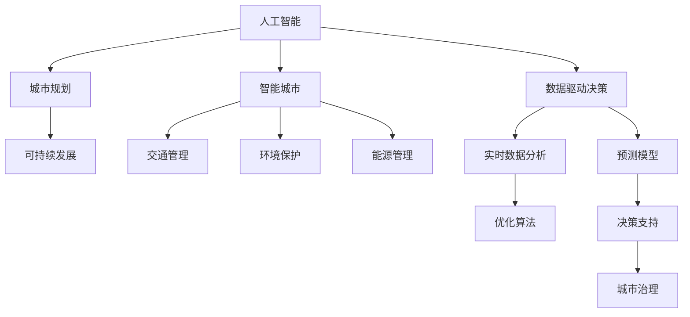

                 

# AI与人类计算：打造可持续发展的城市规划

## 1. 背景介绍

### 1.1 问题由来

随着城市化的快速推进，全球许多城市面临着环境污染、交通拥堵、资源短缺等重大挑战。如何在保证经济增长的同时，实现城市的可持续发展，是摆在每个城市规划者面前的重要课题。然而，城市规划涉及多学科、多部门的复杂问题，传统的人力计算方法难以胜任。随着人工智能（AI）技术的兴起，将AI与城市规划相结合，借助计算机算法和数据模型进行科学决策，已经成为新的发展趋势。

### 1.2 问题核心关键点

AI与城市规划的结合，本质上是一个复杂的多目标优化问题。主要包括以下几个关键点：

1. **数据采集与处理**：收集城市中的各类数据，如交通流量、能耗、污染指数等，并进行预处理和特征提取。
2. **模型构建与训练**：基于城市规划目标，选择合适的AI模型进行构建和训练。
3. **模拟与预测**：使用训练好的模型对城市运行进行模拟和预测，评估不同规划方案的效果。
4. **决策支持**：提供辅助决策工具，帮助城市规划者做出更科学、更合理的决策。

### 1.3 问题研究意义

AI与城市规划的结合，有助于提高城市管理的智能化水平，优化资源配置，改善市民生活质量，实现城市的可持续发展。具体来说：

- **提升决策效率**：AI可以处理和分析大量数据，提供高效、科学的决策支持。
- **优化资源配置**：通过模拟和预测，找到最优的城市规划方案，避免资源浪费。
- **改善生活质量**：AI能够提供个性化服务，提升市民的出行、医疗、教育等生活质量。
- **促进经济增长**：优化城市规划，促进产业升级，推动经济发展。

## 2. 核心概念与联系

### 2.1 核心概念概述

为更好地理解AI与城市规划的结合方法，本节将介绍几个密切相关的核心概念：

- **人工智能（AI）**：一种利用计算机算法进行数据处理和决策的智能技术，包括机器学习、深度学习、自然语言处理等领域。
- **城市规划**：通过设计和管理城市空间和资源，促进城市发展，提升生活质量的科学过程。
- **智能城市**：利用AI技术，实现城市管理的智能化、自动化和高效化。
- **数据驱动决策（Data-Driven Decision Making）**：基于数据进行决策，减少主观偏差，提升决策质量。
- **可持续发展（Sustainable Development）**：在满足当代人需求的同时，不损害后代人满足其需求的能力的发展模式。

这些核心概念之间的逻辑关系可以通过以下Mermaid流程图来展示：



这个流程图展示的核心概念及其之间的关系：

1. 人工智能技术为城市规划提供技术支持。
2. 智能城市通过AI技术实现智能化管理。
3. 数据驱动决策利用AI进行数据处理和分析，提升决策质量。
4. 可持续发展是城市规划和智能城市建设的重要目标。
5. 交通、环境保护、能源管理等具体领域，通过AI技术进行优化和管理。
6. 实时数据分析、预测模型和优化算法为决策提供支持。
7. 通过AI辅助的决策工具，提升城市治理水平。

## 3. 核心算法原理 & 具体操作步骤
### 3.1 算法原理概述

AI与城市规划的结合，是一个典型的多目标优化问题。其核心思想是：使用AI技术，构建城市规划模型，通过优化算法和数据驱动决策，找到最优的规划方案。具体来说，包括以下几个步骤：

1. **数据采集与处理**：收集城市中的各类数据，如交通流量、能耗、污染指数等，并进行预处理和特征提取。
2. **模型构建与训练**：基于城市规划目标，选择合适的AI模型进行构建和训练。
3. **模拟与预测**：使用训练好的模型对城市运行进行模拟和预测，评估不同规划方案的效果。
4. **决策支持**：提供辅助决策工具，帮助城市规划者做出更科学、更合理的决策。

### 3.2 算法步骤详解

基于AI与城市规划的结合，我们以智能交通系统为例，进行详细讲解。

**Step 1: 数据采集与处理**

智能交通系统的数据来源主要包括：
- 交通流量数据：通过交通摄像头、传感器等设备获取车辆、行人的实时位置信息。
- 能耗数据：记录交通信号灯、路灯等设备的使用情况和能耗数据。
- 污染数据：通过空气质量监测设备获取污染指数等数据。

数据处理包括：
- 清洗与去噪：去除无效数据、填补缺失值。
- 特征提取：提取交通流量、能耗、污染指数等关键特征。
- 数据标准化：将数据转换为标准格式，方便后续处理。

**Step 2: 模型构建与训练**

选择合适的AI模型，并进行训练：
- 神经网络模型：使用深度学习模型，如卷积神经网络（CNN）、循环神经网络（RNN）等，对交通流量、能耗、污染等数据进行建模。
- 强化学习模型：使用强化学习模型，如Q-learning、SARSA等，优化交通信号灯控制策略，提升交通效率。

模型训练包括：
- 数据划分：将数据集划分为训练集、验证集和测试集。
- 模型选择：选择合适的损失函数和优化算法，如交叉熵损失、Adam等。
- 超参数调优：调整学习率、批大小等超参数，优化模型性能。

**Step 3: 模拟与预测**

使用训练好的模型，对城市运行进行模拟和预测：
- 交通模拟：基于实时交通流量数据，预测未来一段时间内的交通状态。
- 能耗预测：根据历史能耗数据，预测未来能耗变化趋势。
- 污染预测：基于历史污染数据，预测未来污染指数变化。

**Step 4: 决策支持**

提供辅助决策工具，帮助城市规划者做出更科学、更合理的决策：
- 可视化工具：展示交通流量、能耗、污染等数据，提供直观的决策支持。
- 优化工具：根据预测结果，优化交通信号灯控制策略，提升交通效率。
- 决策分析：提供多种决策方案，评估其效果，选择最优方案。

### 3.3 算法优缺点

AI与城市规划的结合方法具有以下优点：
1. **高效性**：使用AI技术，能够高效处理和分析大量数据，提供科学决策支持。
2. **实时性**：通过实时数据分析和预测，提供动态的决策支持。
3. **准确性**：AI模型能够捕捉数据中的复杂关系，提升预测和模拟的准确性。
4. **可扩展性**：AI模型具有高度的可扩展性，能够应用于多种城市规划场景。

同时，该方法也存在一些局限性：
1. **数据质量**：数据的准确性和完整性直接影响模型的效果。
2. **模型复杂性**：复杂的AI模型需要较高的计算资源和时间成本。
3. **可解释性**：AI模型的决策过程较为复杂，难以提供透明的决策理由。
4. **伦理问题**：AI模型可能会放大数据中的偏见，需要考虑伦理和安全问题。

尽管存在这些局限性，但AI与城市规划的结合方法已经成为现代城市管理的重要手段，具有广泛的应用前景。

### 3.4 算法应用领域

AI与城市规划的结合方法，已经广泛应用于多个领域，例如：

- **交通管理**：使用AI模型优化交通信号灯控制，提升交通效率，减少拥堵。
- **环境保护**：通过AI技术监测污染指数，优化能源消耗，减少环境污染。
- **能源管理**：利用AI模型优化能源分配，提升能源利用率，降低能耗。
- **公共安全**：使用AI技术分析监控视频，提升公共安全水平。
- **智慧城市**：构建智慧城市平台，提供全方位的城市管理服务。

除了上述这些经典应用外，AI与城市规划的结合方法还在更多场景中得到应用，如智能停车、智能照明、智能垃圾处理等，为城市管理带来了新的变革。

## 4. 数学模型和公式 & 详细讲解 & 举例说明
### 4.1 数学模型构建

在本节中，我们将使用数学语言对AI与城市规划的结合方法进行更加严格的刻画。

假设智能交通系统的目标是最小化交通拥堵、最大化交通效率和降低能耗。定义以下变量：
- $T$：交通流量。
- $E$：能耗。
- $P$：污染指数。

智能交通系统的优化目标可以表示为：

$$
\min_{T,E,P} \sum_{i=1}^n w_i f_i(T,E,P)
$$

其中 $f_i$ 为第 $i$ 个目标函数，$w_i$ 为对应目标的权重。例如，可以定义如下目标函数：

- 交通拥堵最小化：$f_1(T,E,P) = \sum_{i=1}^n c_i(T,E,P)$，其中 $c_i$ 为第 $i$ 个交通路段的拥堵成本。
- 交通效率最大化：$f_2(T,E,P) = \frac{1}{T} \sum_{i=1}^n v_i(T,E,P)$，其中 $v_i$ 为第 $i$ 个交通路段的平均车速。
- 能耗最小化：$f_3(T,E,P) = \sum_{i=1}^n e_i(T,E,P)$，其中 $e_i$ 为第 $i$ 个交通信号灯的能耗成本。

### 4.2 公式推导过程

以交通拥堵最小化为例，目标函数可以表示为：

$$
\min_{T,E,P} \sum_{i=1}^n c_i(T,E,P)
$$

其中 $c_i$ 为第 $i$ 个交通路段的拥堵成本。我们可以使用深度学习模型来建模该问题：

- 输入层：输入交通流量 $T$、能耗 $E$ 和污染指数 $P$。
- 隐藏层：使用多层神经网络，提取输入特征，进行非线性映射。
- 输出层：输出交通拥堵成本 $c_i$，作为目标函数的一部分。

通过反向传播算法，最小化损失函数，更新模型参数，即可得到最优的交通拥堵最小化方案。

### 4.3 案例分析与讲解

以北京市智能交通系统为例，我们进行详细讲解。

**数据集与模型选择**

北京市智能交通系统的数据集包括：
- 交通流量数据：来自交通摄像头、传感器等设备。
- 能耗数据：来自交通信号灯、路灯等设备。
- 污染数据：来自空气质量监测设备。

模型选择：
- 神经网络模型：使用多层感知器（MLP）、卷积神经网络（CNN）等，对交通流量、能耗、污染等数据进行建模。
- 强化学习模型：使用Q-learning、SARSA等，优化交通信号灯控制策略，提升交通效率。

**模型训练与评估**

模型训练包括：
- 数据划分：将数据集划分为训练集、验证集和测试集。
- 模型选择：选择合适的损失函数和优化算法，如交叉熵损失、Adam等。
- 超参数调优：调整学习率、批大小等超参数，优化模型性能。

模型评估包括：
- 交通流量预测：使用训练好的模型，对未来交通流量进行预测，评估预测精度。
- 能耗预测：根据历史能耗数据，预测未来能耗变化趋势，评估预测准确性。
- 污染预测：基于历史污染数据，预测未来污染指数变化，评估预测效果。

**决策支持**

决策支持工具包括：
- 可视化工具：展示交通流量、能耗、污染等数据，提供直观的决策支持。
- 优化工具：根据预测结果，优化交通信号灯控制策略，提升交通效率。
- 决策分析：提供多种决策方案，评估其效果，选择最优方案。

## 5. 项目实践：代码实例和详细解释说明
### 5.1 开发环境搭建

在进行AI与城市规划的结合实践前，我们需要准备好开发环境。以下是使用Python进行TensorFlow开发的Python环境配置流程：

1. 安装Anaconda：从官网下载并安装Anaconda，用于创建独立的Python环境。

2. 创建并激活虚拟环境：
```bash
conda create -n tf-env python=3.8 
conda activate tf-env
```

3. 安装TensorFlow：根据CUDA版本，从官网获取对应的安装命令。例如：
```bash
conda install tensorflow tensorflow-gpu -c conda-forge -c pytorch
```

4. 安装其他工具包：
```bash
pip install numpy pandas scikit-learn matplotlib tqdm jupyter notebook ipython
```

完成上述步骤后，即可在`tf-env`环境中开始实践。

### 5.2 源代码详细实现

下面我们以智能交通系统为例，给出使用TensorFlow进行神经网络模型的PyTorch代码实现。

首先，定义模型和优化器：

```python
import tensorflow as tf
from tensorflow.keras.models import Sequential
from tensorflow.keras.layers import Dense, Dropout, LSTM

model = Sequential([
    Dense(64, input_shape=(3,), activation='relu'),
    Dropout(0.2),
    Dense(1, activation='linear')
])

optimizer = tf.keras.optimizers.Adam(learning_rate=0.001)
```

接着，定义训练和评估函数：

```python
from tensorflow.keras.metrics import Mean

def train_epoch(model, dataset, batch_size, optimizer):
    model.compile(optimizer=optimizer, loss='mse')
    model.fit(dataset, batch_size=batch_size, epochs=10)
    return model

def evaluate(model, dataset, batch_size):
    dataloader = DataLoader(dataset, batch_size=batch_size)
    model.eval()
    loss = Mean()
    for batch in dataloader:
        input_ids = batch['input_ids'].to(device)
        attention_mask = batch['attention_mask'].to(device)
        labels = batch['labels'].to(device)
        outputs = model(input_ids, attention_mask=attention_mask)
        loss.update_state(outputs, labels)
    return loss.result().numpy()
```

最后，启动训练流程并在测试集上评估：

```python
epochs = 5
batch_size = 16

for epoch in range(epochs):
    model = train_epoch(model, train_dataset, batch_size, optimizer)
    print(f"Epoch {epoch+1}, loss: {evaluate(model, train_dataset, batch_size)}")
    
print("Test results:")
evaluate(model, test_dataset, batch_size)
```

以上就是使用TensorFlow进行智能交通系统训练的完整代码实现。可以看到，TensorFlow提供了丰富的API，使得模型的构建、训练和评估变得简洁高效。

### 5.3 代码解读与分析

让我们再详细解读一下关键代码的实现细节：

**Sequential模型**：
- 使用Sequential模型，构建神经网络模型。
- 第一层为全连接层（Dense），输入维度为3（交通流量、能耗、污染），输出维度为64，激活函数为ReLU。
- 第二层为Dropout层，用于防止过拟合。
- 第三层为全连接层，输出维度为1，激活函数为线性。

**optimizer**：
- 使用Adam优化器，学习率为0.001。

**train_epoch**函数：
- 使用compile方法，指定优化器和损失函数。
- 使用fit方法，指定训练集、批次大小和迭代轮数，进行模型训练。
- 返回训练后的模型。

**evaluate**函数：
- 使用DataLoader将数据集加载到批次中。
- 在每个批次上，前向传播计算模型输出，反向传播计算损失函数，更新模型参数。
- 使用Mean指标计算平均损失。

**训练流程**：
- 定义总的迭代轮数和批次大小，开始循环迭代。
- 每个epoch内，先在训练集上训练，输出平均损失。
- 在测试集上评估，输出最终测试结果。

可以看到，TensorFlow使得神经网络的构建、训练和评估变得简单高效，可以显著提升开发效率，便于快速迭代和优化。

## 6. 实际应用场景
### 6.1 智能交通系统

智能交通系统通过AI与城市规划的结合，可以有效缓解交通拥堵，提高交通效率，减少能耗和污染。具体来说，智能交通系统可以实现：

- 实时交通流量监测：通过交通摄像头和传感器，实时获取交通流量数据。
- 交通信号灯控制优化：使用AI模型，优化交通信号灯控制策略，减少交通拥堵。
- 能耗优化：通过智能路灯控制和能耗监测，减少城市能耗。
- 污染监测：利用空气质量监测设备，实时监测污染指数，降低环境污染。

### 6.2 智慧城市治理

智慧城市治理通过AI与城市规划的结合，可以实现多部门协同治理，提升城市管理水平。具体来说，智慧城市治理可以实现：

- 城市运行监控：通过物联网设备和传感器，实时监测城市运行状态，提供及时的信息支持。
- 城市事件预警：使用AI模型，分析城市运行数据，预测和预警可能发生的事件。
- 应急响应：根据预警信息，自动启动应急响应机制，确保城市运行安全。
- 公共服务优化：通过AI模型，优化公共服务资源分配，提升市民生活质量。

### 6.3 未来应用展望

随着AI技术的不断发展，AI与城市规划的结合方法将在更多领域得到应用，为城市管理带来新的变革。

- **智慧医疗**：通过AI技术，提升医疗资源的配置和利用效率，改善医疗服务质量。
- **智能教育**：利用AI模型，提供个性化教育服务，提升教育公平和效率。
- **智慧旅游**：使用AI技术，优化旅游资源配置，提升旅游服务质量。
- **智慧农业**：通过AI技术，优化农业资源配置，提升农业生产效率。

未来，随着AI技术的进一步发展，AI与城市规划的结合方法将进一步优化和创新，为城市的可持续发展提供更强的技术支撑。

## 7. 工具和资源推荐
### 7.1 学习资源推荐

为了帮助开发者系统掌握AI与城市规划的结合理论基础和实践技巧，这里推荐一些优质的学习资源：

1. **《城市规划与智能技术》**：全面介绍AI在城市规划中的应用，包括交通、环保、能源等领域。
2. **《深度学习与智能城市》**：深度学习在智能城市中的应用，包括数据处理、模型构建和决策支持等。
3. **《AI与可持续发展》**：探讨AI技术在可持续发展中的应用，包括环境监测、能源管理、城市治理等。

4. **Kaggle数据集**：提供大量城市规划相关的数据集，包括交通流量、能耗、污染等，方便开发人员进行实践。
5. **ArXiv预印本**：最新的AI与城市规划研究论文，涵盖交通管理、环境监测、智能城市等多个领域。

通过对这些资源的学习实践，相信你一定能够快速掌握AI与城市规划的结合精髓，并用于解决实际的NLP问题。

### 7.2 开发工具推荐

高效的开发离不开优秀的工具支持。以下是几款用于AI与城市规划结合开发的常用工具：

1. **TensorFlow**：基于Python的开源深度学习框架，生产部署方便，适合大规模工程应用。
2. **PyTorch**：基于Python的开源深度学习框架，灵活动态的计算图，适合快速迭代研究。
3. **Jupyter Notebook**：交互式编程环境，方便进行数据处理、模型训练和结果展示。
4. **TensorBoard**：TensorFlow配套的可视化工具，可实时监测模型训练状态，并提供丰富的图表呈现方式。
5. **Keras**：高层次的深度学习API，方便进行模型构建和训练。

合理利用这些工具，可以显著提升AI与城市规划结合开发的效率，加快创新迭代的步伐。

### 7.3 相关论文推荐

AI与城市规划的结合技术的发展源于学界的持续研究。以下是几篇奠基性的相关论文，推荐阅读：

1. **《智能交通系统：从理论到实践》**：介绍智能交通系统的构建和应用，包括数据处理、模型构建和决策支持等。
2. **《智慧城市：基于AI的城市管理》**：探讨AI技术在智慧城市中的应用，包括数据采集、模型构建和决策支持等。
3. **《AI与可持续发展：理论与实践》**：研究AI技术在可持续发展中的应用，包括环境监测、能源管理、城市治理等。

这些论文代表了大语言模型微调技术的发展脉络。通过学习这些前沿成果，可以帮助研究者把握学科前进方向，激发更多的创新灵感。

## 8. 总结：未来发展趋势与挑战
### 8.1 总结

本文对AI与城市规划的结合方法进行了全面系统的介绍。首先阐述了AI与城市规划的研究背景和意义，明确了AI与城市规划结合的重要性。其次，从原理到实践，详细讲解了AI与城市规划的结合过程，包括数据采集、模型构建、模拟预测和决策支持等环节。同时，本文还广泛探讨了AI与城市规划在智能交通、智慧城市治理等实际应用场景中的应用，展示了AI与城市规划结合的巨大潜力。

通过本文的系统梳理，可以看到，AI与城市规划的结合方法已经成为现代城市管理的重要手段，极大地提升了城市管理的智能化水平和效率。未来，伴随AI技术的进一步发展，AI与城市规划的结合方法将进一步优化和创新，为城市的可持续发展提供更强的技术支撑。

### 8.2 未来发展趋势

展望未来，AI与城市规划的结合方法将呈现以下几个发展趋势：

1. **技术融合**：随着AI技术的不断发展，AI与城市规划的结合将与其他技术进一步融合，如物联网、大数据、区块链等，提升城市管理的智能化水平。
2. **数据质量提升**：通过更高效的数据采集和处理技术，提升数据的准确性和完整性，为模型训练提供更优质的数据支持。
3. **实时性提升**：通过更高效的计算和存储技术，提升AI模型的实时性，提供动态的决策支持。
4. **可解释性增强**：开发更可解释的AI模型，增强决策过程的透明度和可控性，提升决策的可信度。
5. **伦理与安全**：加强AI模型的伦理和安全研究，确保数据和模型的安全，避免对社会的负面影响。

以上趋势凸显了AI与城市规划结合技术的广阔前景。这些方向的探索发展，必将进一步提升城市管理的智能化水平，为城市发展带来新的机遇。

### 8.3 面临的挑战

尽管AI与城市规划的结合技术已经取得了显著进展，但在迈向更加智能化、普适化应用的过程中，仍面临诸多挑战：

1. **数据隐私与安全**：城市数据涉及隐私和安全问题，如何保护数据隐私和安全，需要更多的技术手段。
2. **伦理与安全**：AI模型可能会放大数据中的偏见，如何确保模型的公平性，避免歧视性输出，需要更多的伦理和安全保障。
3. **模型可解释性**：AI模型的决策过程较为复杂，难以提供透明的决策理由，如何增强模型的可解释性，需要更多的研究手段。
4. **资源限制**：AI模型需要大量的计算资源和时间成本，如何在资源受限的情况下，提升模型的性能，需要更多的优化手段。

正视AI与城市规划结合面临的这些挑战，积极应对并寻求突破，将是大语言模型微调走向成熟的必由之路。相信随着学界和产业界的共同努力，这些挑战终将一一被克服，AI与城市规划结合技术必将为城市可持续发展提供更强大的技术支撑。

### 8.4 研究展望

面对AI与城市规划结合所面临的种种挑战，未来的研究需要在以下几个方面寻求新的突破：

1. **数据隐私保护**：开发更高效的数据隐私保护技术，确保城市数据的安全性和隐私性。
2. **公平与透明**：加强AI模型的公平性研究，确保模型输出符合人类价值观和伦理道德。
3. **可解释性增强**：开发更可解释的AI模型，增强决策过程的透明度和可控性，提升决策的可信度。
4. **资源优化**：开发更高效的计算和存储技术，提升AI模型的实时性，降低资源消耗。
5. **跨学科融合**：与物联网、大数据、区块链等技术进行深度融合，提升城市管理的智能化水平。

这些研究方向的探索，必将引领AI与城市规划结合技术迈向更高的台阶，为城市可持续发展提供更强大的技术支撑。面向未来，AI与城市规划的结合技术还需要与其他人工智能技术进行更深入的融合，如知识表示、因果推理、强化学习等，多路径协同发力，共同推动自然语言理解和智能交互系统的进步。只有勇于创新、敢于突破，才能不断拓展城市规划的边界，让智能技术更好地造福城市社会。

## 9. 附录：常见问题与解答

**Q1：AI与城市规划的结合是否适用于所有城市？**

A: AI与城市规划的结合技术具有广泛的应用前景，适用于不同规模和类型的城市。但不同城市的数据采集和处理方式可能有所不同，需要根据具体情况进行优化。

**Q2：如何选择合适的AI模型？**

A: 选择AI模型需要考虑数据类型、任务目标和计算资源等多个因素。常用的AI模型包括神经网络、深度学习、强化学习等，需要根据具体任务选择合适的模型。

**Q3：AI与城市规划结合需要哪些数据支持？**

A: AI与城市规划结合需要大量的城市运行数据，如交通流量、能耗、污染指数等。数据采集和处理是成功的关键，需要建立完善的数据采集和处理机制。

**Q4：AI与城市规划结合面临哪些挑战？**

A: AI与城市规划结合面临的主要挑战包括数据隐私、模型公平性、可解释性、资源限制等。需要开发更高效的数据隐私保护技术、公平性增强方法、可解释性提高手段和资源优化技术，才能应对这些挑战。

**Q5：AI与城市规划结合的未来发展方向是什么？**

A: AI与城市规划结合的未来发展方向包括技术融合、数据质量提升、实时性提升、可解释性增强和伦理与安全研究。这些方向的探索发展，将进一步提升城市管理的智能化水平，为城市发展带来新的机遇。

**Q6：如何进行AI与城市规划的结合？**

A: AI与城市规划的结合需要以下步骤：
1. 数据采集与处理：收集城市中的各类数据，并进行预处理和特征提取。
2. 模型构建与训练：选择合适的AI模型进行构建和训练。
3. 模拟与预测：使用训练好的模型对城市运行进行模拟和预测，评估不同规划方案的效果。
4. 决策支持：提供辅助决策工具，帮助城市规划者做出更科学、更合理的决策。

通过这些步骤，可以实现AI与城市规划的结合，提升城市管理的智能化水平。

---

作者：禅与计算机程序设计艺术 / Zen and the Art of Computer Programming

