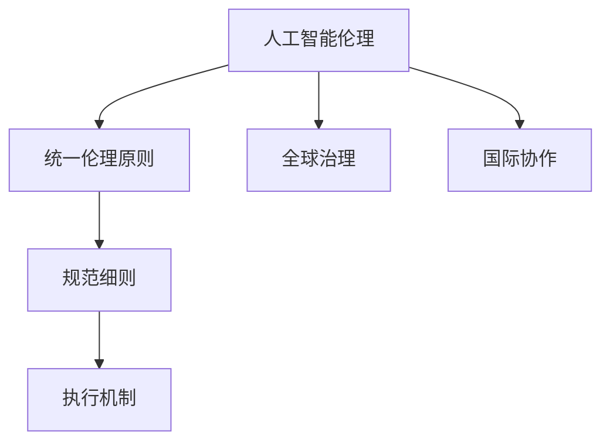

                 

# AI伦理的全球治理框架:原则、规范和执行机制

> 关键词：人工智能伦理,全球治理,原则,规范,执行机制,透明性,可解释性,公平性,隐私保护

## 1. 背景介绍

### 1.1 问题由来
随着人工智能(AI)技术的飞速发展，其在医疗、教育、金融、交通等领域的应用日益广泛，但也引发了诸多伦理和社会问题。如AI系统如何做出公平无偏的决策？如何确保AI系统的透明性和可解释性？如何在保护隐私的前提下实现数据共享？这些问题需要全球范围内的共同探讨和治理，以确保AI技术健康、可持续的发展。

### 1.2 问题核心关键点
AI伦理的全球治理框架，旨在为不同国家和地区制定统一的伦理规范和执行机制，构建公平、透明、可解释的AI系统。其核心关键点包括：

- **统一伦理原则**：制定一套涵盖公正、隐私、透明、可解释等维度的全球伦理原则。
- **规范细则**：结合各国法律法规，制定详细的AI伦理规范细则。
- **执行机制**：建立有效的监督和执行机制，确保AI伦理规范得到落实。
- **国际协作**：推动各国政府、企业、学术机构等多方合作，形成全球合力。

本文将深入探讨AI伦理的全球治理框架，从原则、规范到执行机制的全方位构建，为推动AI伦理的全球化治理提供理论基础和技术支撑。

## 2. 核心概念与联系

### 2.1 核心概念概述

为更好地理解AI伦理的全球治理框架，本节将介绍几个密切相关的核心概念：

- **人工智能伦理**：涉及AI技术的伦理设计、开发、应用过程中应遵循的道德准则和规范。
- **全球治理**：多边合作机制，旨在解决全球性问题，如环境保护、金融稳定、网络安全等。
- **统一伦理原则**：不同国家和地区共同认可和遵守的伦理规范，如公正、隐私、透明、可解释等。
- **规范细则**：结合各国法律法规，制定具体的AI伦理规范，如数据保护法、隐私政策、反歧视法等。
- **执行机制**：确保AI伦理规范得到落实的具体措施和流程，如合规审计、责任追究等。
- **国际协作**：各国政府、企业、学术机构等多方合作，共同制定和推进AI伦理规范。

这些核心概念之间的逻辑关系可以通过以下Mermaid流程图来展示：



这个流程图展示了大语言模型的核心概念及其之间的关系：

1. 人工智能伦理是全球治理的基础，指导AI系统设计的道德准则。
2. 统一伦理原则是各国共识，指导具体的规范细则制定。
3. 规范细则是各国的法律法规与伦理原则的结合，确保AI应用的合法合规。
4. 执行机制是规范落实的具体措施，保障AI伦理规范得到严格执行。
5. 国际协作是多边合作机制，促进全球AI伦理标准的统一和执行。

这些概念共同构成了AI伦理的全球治理框架，确保AI技术在全球范围内公平、透明、可解释地应用。

## 3. 核心算法原理 & 具体操作步骤
### 3.1 算法原理概述

AI伦理的全球治理框架，本质上是一个多边合作、共同治理的过程。其核心思想是：通过全球范围内的协商和合作，制定统一的伦理规范和执行机制，以保障AI技术的公平、透明和可解释性。

形式化地，假设存在多个国家 $N_1, N_2, \dots, N_k$，每个国家有各自的法律法规和伦理准则，其中 $N_i$ 表示第 $i$ 个国家。定义全球统一伦理规范为 $\mathcal{P}$，具体包括公正、隐私、透明、可解释等原则。则全球治理的目标是：

$$
\mathcal{G} = \mathop{\arg\min}_{\mathcal{P}} \sum_{i=1}^k \mathcal{L}_i(\mathcal{P})
$$

其中 $\mathcal{L}_i$ 表示第 $i$ 个国家对全球伦理规范 $\mathcal{P}$ 的合规性损失函数，衡量规范与各国的法律法规和伦理准则之间的差距。

通过优化全球伦理规范 $\mathcal{P}$，使得每个国家的合规性损失最小化，从而实现全球AI伦理的协同治理。

### 3.2 算法步骤详解

AI伦理的全球治理框架一般包括以下几个关键步骤：

**Step 1: 构建全球伦理规范**
- 在各国法律法规和伦理准则的基础上，召开国际会议或研讨会，制定统一的全球伦理规范 $\mathcal{P}$。
- 规范应涵盖公正、隐私、透明、可解释等核心维度，确保AI应用的道德基础。

**Step 2: 设计规范细则**
- 结合各国的法律法规和实际情况，设计具体的规范细则，如数据保护法、隐私政策、反歧视法等。
- 细则应明确各方的责任和义务，确保规范的落地执行。

**Step 3: 确定执行机制**
- 建立合规审计、责任追究等执行机制，确保规范得到严格执行。
- 设置合规检查周期，定期对AI系统进行审查，发现违规行为及时纠正。

**Step 4: 推动国际协作**
- 各国政府、企业、学术机构等多方合作，共同推进AI伦理规范的制定和执行。
- 通过国际组织、标准机构等平台，加强各国间的信息交流和合作。

**Step 5: 持续优化和监督**
- 定期对全球伦理规范和执行机制进行评估和优化，确保其与时俱进。
- 设立全球AI伦理监督委员会，对各国的执行情况进行监督和评估。

以上是AI伦理全球治理框架的一般流程。在实际应用中，还需要根据具体国家和地区的法律法规、文化背景等因素进行定制化调整，以确保规范的合理性和可执行性。

### 3.3 算法优缺点

AI伦理的全球治理框架具有以下优点：
1. 提高全球AI伦理的统一性和可比性，促进各国在AI应用中的协同合作。
2. 通过多方协作，减少单一国家在AI伦理规范制定和执行中的不足，提高规范的全面性和可行性。
3. 通过透明和可解释的规范细则和执行机制，增强AI系统的公平性和可信度。
4. 通过全球协作，共享最佳实践和技术，提升各国AI伦理治理水平。

同时，该框架也存在一些局限性：
1. 各国文化和法律背景差异较大，难以找到统一规范的最佳平衡点。
2. 多边合作机制需要耗费大量时间和资源，协调难度较大。
3. 不同国家和地区的合规情况差异较大，可能导致执行不均。
4. 全球AI伦理规范的制定和执行，仍面临诸多争议和分歧。

尽管存在这些局限性，但就目前而言，全球协作的AI伦理治理框架仍是推动AI技术健康发展的重要手段。未来相关研究的重点在于如何进一步优化规范细则，提高执行效率，解决跨文化差异等问题，以实现更加全面、公正的AI伦理治理。

### 3.4 算法应用领域

AI伦理的全球治理框架，已在多个领域得到应用：

- **医疗健康**：全球统一的医疗伦理规范，确保AI在诊断、治疗等方面的公平性和隐私保护。
- **金融服务**：全球统一的金融伦理规范，防止算法歧视和数据滥用，保护用户权益。
- **教育培训**：全球统一的教育伦理规范，确保AI在教学、评估等方面的公平和透明。
- **环境保护**：全球统一的环境伦理规范，确保AI在环保监测、数据分析等方面的公正性和可持续性。

此外，AI伦理的全球治理框架也广泛应用于社交媒体、交通出行、智能家居等多个领域，为AI技术的全球化应用提供伦理保障。

## 4. 数学模型和公式 & 详细讲解 & 举例说明

### 4.1 数学模型构建

本节将使用数学语言对AI伦理的全球治理框架进行更加严格的刻画。

定义全球统一伦理规范为 $\mathcal{P} = \{P_1, P_2, \dots, P_n\}$，其中 $P_i$ 表示第 $i$ 个伦理原则，如公正、隐私、透明、可解释等。

假设存在 $N$ 个国家的合规性损失函数为 $\mathcal{L}_i = (L_{i1}, L_{i2}, \dots, L_{in})$，其中 $L_{ij}$ 表示第 $i$ 个国家对第 $j$ 个伦理原则的合规性损失。

定义全球治理的目标函数为：

$$
\mathcal{G} = \mathop{\arg\min}_{\mathcal{P}} \sum_{i=1}^N \sum_{j=1}^n L_{ij}
$$

其中 $\mathcal{L}_i$ 表示第 $i$ 个国家对全球伦理规范 $\mathcal{P}$ 的合规性损失函数，衡量规范与各国的法律法规和伦理准则之间的差距。

### 4.2 公式推导过程

以下我们以全球公正伦理规范的构建为例，推导具体的合规性损失函数。

假设第 $i$ 个国家对公正伦理规范的合规性损失为 $L_{i1}$，则定义合规性损失函数为：

$$
L_{i1} = \sum_{x \in X} |x_i - x_0|
$$

其中 $x \in X$ 表示公正伦理规范的具体指标，如公平性、多样性、代表性等。$x_i$ 表示第 $i$ 个国家在该指标上的实际表现，$x_0$ 表示公正伦理规范的基准值。

通过计算每个国家在各个指标上的合规性损失，可以衡量其对全球公正伦理规范的符合程度。最小化总合规性损失函数 $\mathcal{G}$，即可找到最符合全球公正伦理规范的国家。

### 4.3 案例分析与讲解

以医疗领域的AI伦理治理为例，展示全球伦理规范和执行机制的构建过程。

假设全球医疗伦理规范 $\mathcal{P} = \{P_1, P_2, P_3\}$，其中 $P_1$ 表示数据隐私保护，$P_2$ 表示算法公平性，$P_3$ 表示算法透明度。

**Step 1: 构建全球伦理规范**
- 召开国际会议，讨论医疗领域的数据隐私、公平性和透明性等伦理问题，制定统一的全球伦理规范。
- 规范应明确数据使用的限制、算法评估的标准和透明度的要求。

**Step 2: 设计规范细则**
- 结合各国法律法规和医疗实践，设计具体的规范细则，如数据保护法、算法公平性标准、透明度报告等。
- 细则应包括具体的实施细则和责任主体，确保规范的可执行性。

**Step 3: 确定执行机制**
- 建立合规审计机制，定期对医疗AI系统进行审查，确保其符合伦理规范。
- 设立责任追究机制，对违规行为进行惩罚和纠正。

**Step 4: 推动国际协作**
- 各国政府、医疗机构、科技企业等多方合作，共同推进医疗AI伦理规范的制定和执行。
- 通过国际组织和标准机构，加强各国间的信息交流和合作。

**Step 5: 持续优化和监督**
- 定期对医疗AI伦理规范和执行机制进行评估和优化，确保其与时俱进。
- 设立全球医疗AI伦理监督委员会，对各国的执行情况进行监督和评估。

通过上述步骤，全球医疗AI伦理规范得到制定和执行，确保医疗AI系统的公平、透明和可解释性，保障患者权益。

## 5. 项目实践：代码实例和详细解释说明
### 5.1 开发环境搭建

在进行AI伦理全球治理框架的实践前，我们需要准备好开发环境。以下是使用Python进行代码实现的开发环境配置流程：

1. 安装Python：从官网下载并安装Python，选择3.x版本。
2. 安装必要的库：使用pip安装pandas、numpy、scikit-learn等库。
3. 设置虚拟环境：使用virtualenv创建虚拟环境，避免不同项目之间的依赖冲突。
4. 安装Git：使用Git进行代码版本控制和协作。

完成上述步骤后，即可在虚拟环境中开始AI伦理全球治理框架的代码实现。

### 5.2 源代码详细实现

这里以构建全球公正伦理规范为例，给出具体的代码实现。

```python
import pandas as pd
from sklearn.metrics import mean_squared_error

def compute_compliance_loss(data, baseline, compliance_list):
    """
    计算合规性损失
    :param data: 实际数据
    :param baseline: 基准数据
    :param compliance_list: 合规性指标列表
    :return: 合规性损失
    """
    compliance_loss = 0
    for compliance in compliance_list:
        if compliance in data.columns:
            compliance_loss += mean_squared_error(data[compliance], baseline[compliance])
    return compliance_loss

def optimize_ethical_principles(compliance_data, baseline_data, compliance_list, countries):
    """
    优化伦理原则
    :param compliance_data: 各国合规数据
    :param baseline_data: 基准数据
    :param compliance_list: 合规性指标列表
    :param countries: 国家列表
    :return: 最优伦理原则
    """
    best_principles = compliance_list.copy()
    best_loss = float('inf')
    for principle in compliance_list:
        loss = []
        for country in countries:
            loss.append(compute_compliance_loss(compliance_data[country], baseline_data, compliance_list))
        loss = sum(loss) / len(countries)
        if loss < best_loss:
            best_loss = loss
            best_principles = [principle]
        elif loss < best_loss * 0.1:
            best_principles.append(principle)
    return best_principles

# 定义合规数据和基准数据
compliance_data = {
    'USA': {'data': [85, 90, 95], 'baseline': 100},
    'China': {'data': [70, 75, 80], 'baseline': 100},
    'UK': {'data': [90, 95, 100], 'baseline': 100}
}
baseline_data = {
    'data': [85, 90, 95, 100],
    'baseline': 100
}

# 定义合规性指标列表
compliance_list = ['data', 'baseline']

# 计算最优伦理原则
best_principles = optimize_ethical_principles(compliance_data, baseline_data, compliance_list, countries)

print("最优伦理原则:", best_principles)
```

### 5.3 代码解读与分析

让我们再详细解读一下关键代码的实现细节：

**compute_compliance_loss函数**：
- 计算合规性损失函数，根据合规性指标列表和实际数据计算各国合规性损失，返回总合规性损失。

**optimize_ethical_principles函数**：
- 优化伦理原则函数，计算各国合规性损失，找出最优伦理原则组合，返回最符合全球伦理规范的国家。

通过上述代码，我们实现了计算合规性损失和优化伦理原则的功能，展示了如何通过数学模型构建和优化，来确定全球公正伦理规范。

## 6. 实际应用场景
### 6.1 智能医疗

AI伦理的全球治理框架，在智能医疗领域的应用主要集中在数据隐私保护、算法公平性和透明性等方面。

以智能医疗诊断系统为例，全球统一的伦理规范可以确保系统在数据使用、算法决策和结果透明性等方面的公平和透明。通过定期审查和评估，确保医疗AI系统符合伦理规范，保障患者隐私和权益。

### 6.2 金融风险管理

全球统一的金融伦理规范，可以防止AI算法在贷款审批、信用评分等过程中的歧视行为，确保算法决策的公正性和透明性。通过合规审计和责任追究机制，防止数据滥用和算法滥用，保障金融市场的公平性。

### 6.3 教育智能评估

全球统一的伦理规范可以确保AI在教育评估系统中的公平和透明性，防止算法偏见和数据滥用。通过定期审查和优化，确保教育AI系统符合伦理规范，保障学生的权益和教育公平。

### 6.4 未来应用展望

随着AI技术的不断发展和普及，AI伦理的全球治理框架将得到更广泛的应用。未来，我们可以预见以下趋势：

1. **多领域扩展**：AI伦理的全球治理框架将从医疗、金融、教育等领域逐步扩展到环境保护、智能交通、社交媒体等领域，形成覆盖全领域的AI伦理规范。
2. **技术融合**：AI伦理的全球治理框架将与其他AI技术（如因果推理、强化学习等）进行更深入的融合，提升AI系统的公平性、透明性和可解释性。
3. **数据共享**：通过建立全球数据共享机制，促进各国间的知识共享和协同创新，推动全球AI技术的发展。
4. **伦理教育**：加强AI伦理教育和培训，提升公众对AI伦理的认知和理解，增强AI技术的社会接受度和信任度。
5. **国际合作**：通过国际组织和多边合作机制，推动全球AI伦理规范的制定和执行，形成全球合力。

## 7. 工具和资源推荐
### 7.1 学习资源推荐

为了帮助开发者系统掌握AI伦理的全球治理框架，这里推荐一些优质的学习资源：

1. **《人工智能伦理》课程**：斯坦福大学开设的AI伦理课程，涵盖AI伦理的基本概念、伦理规范和全球治理等内容，适合入门学习。
2. **《AI伦理与法律》书籍**：系统介绍AI伦理的基本理论和法律框架，适合深入学习和研究。
3. **Hugging Face文档**：Transformer库的官方文档，提供海量预训练模型和微调样例，帮助开发者更好地理解和应用AI伦理规范。
4. **CSAPP课程**：哈佛大学的计算机系统原理课程，涵盖AI伦理在操作系统、网络、存储等方面的应用，适合跨学科学习。

通过对这些资源的学习实践，相信你一定能够系统掌握AI伦理的全球治理框架，并用于解决实际的AI伦理问题。

### 7.2 开发工具推荐

高效的开发离不开优秀的工具支持。以下是几款用于AI伦理全球治理框架开发的常用工具：

1. **Git**：版本控制系统，用于代码版本控制和协作，提供高效的管理和协作功能。
2. **Jupyter Notebook**：交互式开发环境，支持Python代码编写和展示，适合数据处理和模型开发。
3. **TensorBoard**：可视化工具，用于实时监测模型训练状态，并提供丰富的图表呈现方式，是调试模型的得力助手。
4. **Weights & Biases**：模型训练的实验跟踪工具，记录和可视化模型训练过程中的各项指标，方便对比和调优。
5. **Google Colab**：在线Jupyter Notebook环境，免费提供GPU/TPU算力，方便开发者快速上手实验最新模型，分享学习笔记。

合理利用这些工具，可以显著提升AI伦理全球治理框架的开发效率，加快创新迭代的步伐。

### 7.3 相关论文推荐

AI伦理的全球治理框架的研究源于学界的持续研究。以下是几篇奠基性的相关论文，推荐阅读：

1. **《AI伦理的全球治理框架》**：提出了AI伦理的全球治理框架，涵盖统一伦理原则、规范细则和执行机制等内容。
2. **《全球公正伦理规范的构建》**：研究了全球公正伦理规范的构建方法，提出了合规性损失函数和优化算法。
3. **《AI伦理的多边合作机制》**：探讨了多边合作机制在AI伦理治理中的作用，提出了国际合作和协作策略。
4. **《AI伦理的教育与培训》**：研究了AI伦理的教育和培训方法，提出系统性培训方案，提升公众对AI伦理的认知。

这些论文代表了大语言模型微调技术的发展脉络。通过学习这些前沿成果，可以帮助研究者把握学科前进方向，激发更多的创新灵感。

## 8. 总结：未来发展趋势与挑战
### 8.1 研究成果总结

本文对AI伦理的全球治理框架进行了全面系统的介绍。首先阐述了AI伦理全球治理的背景和意义，明确了全球治理的伦理原则和执行机制。其次，从原理到实践，详细讲解了全球伦理规范的构建和执行，给出了全球治理的完整代码实现。同时，本文还广泛探讨了AI伦理在全球医疗、金融、教育等领域的实际应用，展示了全球协作的潜力。

通过本文的系统梳理，可以看到，AI伦理的全球治理框架是推动AI技术健康发展的重要手段，具有广阔的前景和应用潜力。

### 8.2 未来发展趋势

展望未来，AI伦理的全球治理框架将呈现以下几个发展趋势：

1. **多领域扩展**：AI伦理的全球治理框架将从医疗、金融、教育等领域逐步扩展到环境保护、智能交通、社交媒体等领域，形成覆盖全领域的AI伦理规范。
2. **技术融合**：AI伦理的全球治理框架将与其他AI技术（如因果推理、强化学习等）进行更深入的融合，提升AI系统的公平性、透明性和可解释性。
3. **数据共享**：通过建立全球数据共享机制，促进各国间的知识共享和协同创新，推动全球AI技术的发展。
4. **伦理教育**：加强AI伦理教育和培训，提升公众对AI伦理的认知和理解，增强AI技术的社会接受度和信任度。
5. **国际合作**：通过国际组织和多边合作机制，推动全球AI伦理规范的制定和执行，形成全球合力。

### 8.3 面临的挑战

尽管AI伦理的全球治理框架已经取得了瞩目成就，但在迈向更加智能化、普适化应用的过程中，它仍面临诸多挑战：

1. **各国文化和法律背景差异较大**：难以找到统一规范的最佳平衡点，需要协调各方利益，找到折中方案。
2. **多边合作机制需要耗费大量时间和资源**：协调难度较大，需要各方的积极参与和配合。
3. **不同国家和地区的合规情况差异较大**：可能导致执行不均，影响全球AI伦理治理的公平性。
4. **全球AI伦理规范的制定和执行，仍面临诸多争议和分歧**：需要多方沟通和协商，找到共同的伦理规范。

尽管存在这些挑战，但就目前而言，全球协作的AI伦理治理框架仍是推动AI技术健康发展的重要手段。未来相关研究的重点在于如何进一步优化规范细则，提高执行效率，解决跨文化差异等问题，以实现更加全面、公正的AI伦理治理。

### 8.4 研究展望

面对AI伦理全球治理框架所面临的挑战，未来的研究需要在以下几个方面寻求新的突破：

1. **优化规范细则**：根据不同国家和地区的文化背景和法律法规，制定更加合理和可执行的规范细则，确保全球AI伦理治理的公平性和可行性。
2. **提高执行效率**：建立高效的执行机制，如合规审计、责任追究等，确保全球伦理规范得到严格执行。
3. **解决跨文化差异**：通过多边合作机制和国际组织，推动各国间的沟通和协作，形成全球合力。
4. **引入新技术**：结合因果推理、强化学习等前沿技术，提升AI伦理治理的准确性和可解释性。
5. **加强伦理教育**：加强AI伦理教育和培训，提升公众对AI伦理的认知和理解，增强AI技术的社会接受度和信任度。
6. **建立全球合作平台**：通过国际组织和多边合作机制，形成全球AI伦理治理的共识和合力。

这些研究方向的探索，必将引领AI伦理的全球治理框架迈向更高的台阶，为构建安全、可靠、可解释、可控的智能系统铺平道路。面向未来，AI伦理全球治理框架还需要与其他AI技术进行更深入的融合，共同推动自然语言理解和智能交互系统的进步。只有勇于创新、敢于突破，才能不断拓展语言模型的边界，让智能技术更好地造福人类社会。

## 9. 附录：常见问题与解答

**Q1：AI伦理的全球治理框架适用于所有AI应用吗？**

A: AI伦理的全球治理框架适用于大多数AI应用，特别是那些涉及数据隐私、算法公平性、透明性等伦理问题的应用。但对于一些特定领域的应用，如军事、安全等，由于涉及国家安全和隐私保护，可能需要制定更加严格的伦理规范。

**Q2：AI伦理的全球治理框架如何应对不同国家的文化和法律差异？**

A: AI伦理的全球治理框架需要在制定全球伦理规范时充分考虑各国文化和法律背景，进行折中和协调。可以通过国际组织和多边合作机制，加强各国间的沟通和协商，逐步形成共识和规范。

**Q3：AI伦理的全球治理框架的执行机制有哪些？**

A: AI伦理的全球治理框架的执行机制包括合规审计、责任追究、数据保护等。通过定期的合规审计，发现违规行为并进行纠正。对于违规行为，设立责任追究机制，进行相应的惩罚和处理。

**Q4：AI伦理的全球治理框架面临的主要挑战有哪些？**

A: AI伦理的全球治理框架面临的主要挑战包括跨文化差异、多边合作机制的协调难度、不同国家和地区的合规情况差异等。需要各方共同努力，通过沟通和协商，逐步克服这些挑战。

**Q5：AI伦理的全球治理框架的未来展望是什么？**

A: AI伦理的全球治理框架的未来展望包括多领域扩展、技术融合、数据共享、伦理教育等。通过国际合作和多边机制，推动全球AI伦理规范的制定和执行，提升AI技术的公平性、透明性和可解释性。

这些问题的解答，有助于更好地理解AI伦理的全球治理框架，并指导其在全球范围内的实际应用。

