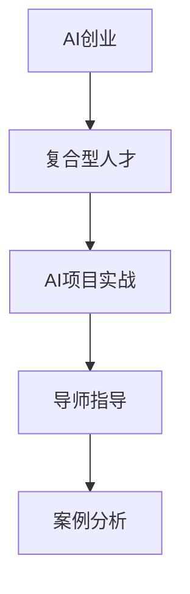

                 

# AI创业的人才培养：Lepton AI的教育计划

## 1. 背景介绍

### 1.1 问题由来
随着人工智能技术的快速发展，越来越多的人开始关注AI领域的创业机会。然而，尽管AI领域有着广泛的应用场景和巨大的市场需求，创业公司在人才招聘方面仍然面临诸多挑战。一方面，AI领域需要多学科交叉、跨领域的复合型人才，传统的计算机、数学、统计等领域的人才往往难以胜任；另一方面，AI技术复杂度高、更新快，对从业人员的持续学习和自我提升能力有较高要求。

如何培养出既具备创新意识，又掌握AI技术的复合型人才，成为创业公司吸引和留住优秀人才的关键。Lepton AI教育计划，正是在这样的背景下应运而生，旨在通过系统的教育和培训，快速培养出具备AI创业能力的高级人才，赋能更多AI创业公司的快速成长。

### 1.2 问题核心关键点
Lepton AI教育计划的核心目标，是结合AI创业实践与前沿技术发展，打造一套全面的、可持续的人才培养体系。该计划将涵盖从基础理论到应用实践的各个环节，通过理论学习、项目实战、导师指导等方式，全面提升学员在AI领域的综合素质和创业能力。

具体而言，Lepton AI教育计划的关键点包括：
- 基础理论：构建AI领域的理论体系，掌握数据科学、机器学习、深度学习等核心知识。
- 实践技能：通过项目实战，掌握Python、TensorFlow、PyTorch等主流AI工具和框架的使用，提升编程能力。
- 创业能力：通过导师指导、案例分析、创业工作坊等环节，理解AI创业的核心要素，掌握从项目启动到产品落地的全流程管理。

### 1.3 问题研究意义
Lepton AI教育计划的推出，对于AI领域的教育和人才培养具有重要意义：

1. 满足AI创业公司的刚需。随着AI技术的商业化加速，越来越多的初创公司涌现，对AI人才的需求日益旺盛。Lepton AI教育计划通过系统化的培养，可以大幅提升人才的供应效率，帮助AI创业公司迅速组建高效的团队。
2. 加速AI领域的创新。AI技术的核心在于创新，Lepton AI教育计划将前沿技术和创业实践相结合，培养出既有理论深度又有实战经验的复合型人才，为AI领域的持续创新提供坚实的基础。
3. 提升创业成功率。Lepton AI教育计划通过系统的创业指导，帮助学员建立完善的创业思维和项目管理能力，降低创业风险，提升项目成功率。
4. 培养AI领域的人才生态。Lepton AI教育计划通过广泛的行业合作和资源整合，构建起AI领域的人才生态，为更多AI创业公司的成长提供支持。

## 2. 核心概念与联系

### 2.1 核心概念概述

为更好地理解Lepton AI教育计划的各个环节，本节将介绍几个关键概念，并阐述它们之间的联系。

- **AI创业**：指基于人工智能技术开展的商业活动，旨在通过智能算法和产品实现商业价值和社会价值。
- **复合型人才**：指既具备AI领域的理论知识，又掌握实际应用技能的跨学科、跨领域的高级人才。
- **AI项目实战**：指通过实际项目，将AI知识应用于解决具体问题的过程。
- **导师指导**：指通过行业专家、创业导师等高水平人士的指导，帮助学员在理论和实践上取得突破。
- **案例分析**：指通过分析成功的AI创业案例，理解创业过程中遇到的问题和解决方案，借鉴成功经验。

这些概念之间的联系可以通过以下Mermaid流程图来展示：



这个流程图展示了AI创业的各个关键环节，以及它们之间的相互关系：

1. AI创业需要复合型人才的支持，通过实战和指导提升专业技能。
2. 实战是理论知识应用和技能提升的重要途径。
3. 导师指导提供实践方向和创新灵感，案例分析提供经验借鉴。
4. 这些环节共同构成了Lepton AI教育计划的核心内容。

## 3. 核心算法原理 & 具体操作步骤
### 3.1 算法原理概述

Lepton AI教育计划的核心在于通过系统的理论学习和实战训练，培养出具备AI创业能力的复合型人才。其核心算法原理如下：

- **模块化课程设计**：将AI领域的知识点划分为多个模块，每个模块独立设置教学目标和评估标准，确保学员能够系统性地掌握各个领域的核心知识。
- **实战导向的项目训练**：结合实际应用场景，设计多个实战项目，通过项目实践提升学员的编程能力、问题解决能力和团队协作能力。
- **导师驱动的个性化指导**：通过行业专家、创业导师等高水平人士的指导，帮助学员在理论和实践上取得突破，提升综合素质。
- **案例分析的启发式学习**：通过分析成功的AI创业案例，帮助学员理解创业过程中遇到的问题和解决方案，借鉴成功经验。

### 3.2 算法步骤详解

Lepton AI教育计划的具体操作步骤包括以下几个关键步骤：

**Step 1: 基础理论课程学习**

- **课程内容**：涵盖数据科学、机器学习、深度学习、自然语言处理等AI核心领域的基础知识。
- **学习方式**：采用线上课程、视频讲座、案例解析等多种形式，确保学员能够系统性地掌握理论知识。

**Step 2: 实战项目训练**

- **项目设计**：结合实际应用场景，设计多个实战项目，如图像识别、自然语言处理、推荐系统等。
- **训练过程**：通过小组合作、代码评审、项目汇报等环节，提升学员的编程能力、问题解决能力和团队协作能力。
- **导师指导**：邀请行业专家、创业导师等高水平人士，对学员的项目进行指导和点评，帮助学员突破瓶颈，提升项目质量。

**Step 3: 创业能力提升**

- **创业指导**：通过导师驱动的个性化指导，帮助学员理解AI创业的核心要素，掌握从项目启动到产品落地的全流程管理。
- **案例分析**：分析成功的AI创业案例，理解创业过程中遇到的问题和解决方案，借鉴成功经验。
- **创业工作坊**：组织创业工作坊，邀请成功创业人士分享经验，帮助学员拓展创业思路。

**Step 4: 综合评估与认证**

- **学习评估**：通过理论考核、项目评审、创业答辩等方式，对学员的学习成果进行全面评估。
- **实践证明**：鼓励学员在实际项目中应用所学知识，展示自身能力。
- **认证体系**：建立Lepton AI认证体系，对通过考核的学员颁发认证证书，提升其市场竞争力。

### 3.3 算法优缺点

Lepton AI教育计划的优势在于其系统化、实战化的教学方式，能够快速培养出具备AI创业能力的复合型人才。具体而言，该计划的优点包括：

- **系统化教学**：通过模块化课程设计和实战导向的项目训练，确保学员能够系统性地掌握AI领域的核心知识和实战技能。
- **实战化训练**：通过实际项目和导师指导，提升学员的编程能力、问题解决能力和团队协作能力。
- **个性化指导**：通过导师驱动的个性化指导，帮助学员在理论和实践上取得突破，提升综合素质。
- **案例驱动学习**：通过分析成功的AI创业案例，帮助学员理解创业过程中遇到的问题和解决方案，借鉴成功经验。

然而，该计划也存在一些局限性：

- **资源需求高**：需要邀请行业专家、创业导师等高水平人士进行指导，资源成本较高。
- **学员基础参差不齐**：学员的背景和知识水平不同，需要针对不同层次的学员设计差异化的教学方案。
- **项目周期长**：从理论学习到实战训练再到创业指导，需要较长的周期，难以快速满足市场对人才的需求。

### 3.4 算法应用领域

Lepton AI教育计划的应用领域主要集中在AI领域的创业公司和项目团队，具体包括：

- **AI创业公司**：帮助初创公司快速组建高效的团队，提升产品开发和市场推广的能力。
- **AI技术团队**：通过系统的实战训练和创业指导，提升团队的技术水平和管理能力，推动技术创新和商业化进程。
- **高校与科研机构**：为AI领域的高校学生和科研人员提供系统的创业教育和指导，促进产学研结合，提升AI技术的市场转化能力。

## 4. 数学模型和公式 & 详细讲解  
### 4.1 数学模型构建

Lepton AI教育计划的主要数学模型为“学习-实践-创业”三位一体的教育模型。通过构建多层次、多维度的教育框架，确保学员能够全面提升AI创业能力。

**模型构建**：

- **理论学习模型**：通过理论课程，构建AI领域的知识体系，确保学员掌握基础理论。
- **实践训练模型**：通过实战项目，将理论知识应用到实际问题中，提升学员的编程能力和问题解决能力。
- **创业能力模型**：通过导师指导和案例分析，提升学员的创业思维和管理能力，理解AI创业的核心要素。

### 4.2 公式推导过程

以下我们以一个实际案例来说明Lepton AI教育计划中“学习-实践-创业”三位一体的数学模型：

假设某学员在Lepton AI教育计划中完成了以下三个阶段的学习：

- **理论学习阶段**：掌握数据科学、机器学习、深度学习等核心知识。
- **实践训练阶段**：完成多个实战项目，提升了编程能力和问题解决能力。
- **创业能力提升阶段**：通过导师指导和案例分析，理解AI创业的核心要素，掌握了从项目启动到产品落地的全流程管理。

根据上述三个阶段，我们可以将学员的学习过程建模为如下公式：

$$
\text{能力提升} = f(\text{理论学习}, \text{实践训练}, \text{创业能力提升})
$$

其中，$f$表示综合提升函数，通过理论学习、实践训练和创业能力提升三个模块的综合作用，实现学员能力的全面提升。

### 4.3 案例分析与讲解

以一个典型的AI创业案例为例，说明Lepton AI教育计划的实际应用效果：

**案例背景**：一家初创公司，旨在利用AI技术开发智能推荐系统，帮助电商平台提升商品推荐精准度。

**教育过程**：
- **理论学习阶段**：学员掌握了机器学习、深度学习、自然语言处理等核心知识，能够理解推荐算法的理论基础。
- **实践训练阶段**：学员通过实际项目，使用Python、TensorFlow等工具，构建推荐系统，提升了编程能力和问题解决能力。
- **创业能力提升阶段**：学员通过导师指导和案例分析，理解了AI创业的核心要素，掌握了从项目启动到产品落地的全流程管理。

**教育效果**：
- **技术能力提升**：学员通过理论学习和实践训练，掌握了推荐算法的核心技术，能够高效构建推荐系统。
- **管理能力提升**：学员通过导师指导和案例分析，理解了AI创业的全流程管理，具备了项目启动、团队管理、市场推广等综合能力。
- **创业思维提升**：学员通过实际案例的学习，理解了AI创业的复杂性和风险，具备了创业的敏锐洞察力和决策能力。

## 5. 项目实践：代码实例和详细解释说明
### 5.1 开发环境搭建

在进行Lepton AI教育计划的项目实践前，我们需要准备好开发环境。以下是使用Python进行PyTorch开发的环境配置流程：

1. 安装Anaconda：从官网下载并安装Anaconda，用于创建独立的Python环境。

2. 创建并激活虚拟环境：
```bash
conda create -n pytorch-env python=3.8 
conda activate pytorch-env
```

3. 安装PyTorch：根据CUDA版本，从官网获取对应的安装命令。例如：
```bash
conda install pytorch torchvision torchaudio cudatoolkit=11.1 -c pytorch -c conda-forge
```

4. 安装Transformers库：
```bash
pip install transformers
```

5. 安装各类工具包：
```bash
pip install numpy pandas scikit-learn matplotlib tqdm jupyter notebook ipython
```

完成上述步骤后，即可在`pytorch-env`环境中开始项目实践。

### 5.2 源代码详细实现

下面我们以图像识别项目为例，给出使用Transformers库对Lepton AI教育计划进行项目实战的PyTorch代码实现。

首先，定义图像识别任务的数据处理函数：

```python
from transformers import BertTokenizer
from torch.utils.data import Dataset
import torch

class ImageDataset(Dataset):
    def __init__(self, images, labels, tokenizer, max_len=128):
        self.images = images
        self.labels = labels
        self.tokenizer = tokenizer
        self.max_len = max_len
        
    def __len__(self):
        return len(self.images)
    
    def __getitem__(self, item):
        image = self.images[item]
        label = self.labels[item]
        
        # 对图像进行预处理，并转换为token ids
        tokenized = self.tokenizer(image, max_length=self.max_len, padding='max_length', truncation=True)
        input_ids = tokenized['input_ids']
        attention_mask = tokenized['attention_mask']
        
        # 将标签转换为数字id
        label_id = label2id[label] if label in label2id else 0
        
        return {'input_ids': input_ids, 
                'attention_mask': attention_mask,
                'label_id': label_id}

# 标签与id的映射
label2id = {'cat': 0, 'dog': 1, 'bird': 2}
id2label = {v: k for k, v in label2id.items()}
```

然后，定义模型和优化器：

```python
from transformers import BertForTokenClassification, AdamW

model = BertForTokenClassification.from_pretrained('bert-base-cased', num_labels=len(label2id))

optimizer = AdamW(model.parameters(), lr=2e-5)
```

接着，定义训练和评估函数：

```python
from torch.utils.data import DataLoader
from tqdm import tqdm
from sklearn.metrics import classification_report

device = torch.device('cuda') if torch.cuda.is_available() else torch.device('cpu')
model.to(device)

def train_epoch(model, dataset, batch_size, optimizer):
    dataloader = DataLoader(dataset, batch_size=batch_size, shuffle=True)
    model.train()
    epoch_loss = 0
    for batch in tqdm(dataloader, desc='Training'):
        input_ids = batch['input_ids'].to(device)
        attention_mask = batch['attention_mask'].to(device)
        label_id = batch['label_id'].to(device)
        model.zero_grad()
        outputs = model(input_ids, attention_mask=attention_mask, labels=label_id)
        loss = outputs.loss
        epoch_loss += loss.item()
        loss.backward()
        optimizer.step()
    return epoch_loss / len(dataloader)

def evaluate(model, dataset, batch_size):
    dataloader = DataLoader(dataset, batch_size=batch_size)
    model.eval()
    preds, labels = [], []
    with torch.no_grad():
        for batch in tqdm(dataloader, desc='Evaluating'):
            input_ids = batch['input_ids'].to(device)
            attention_mask = batch['attention_mask'].to(device)
            batch_labels = batch['label_id']
            outputs = model(input_ids, attention_mask=attention_mask)
            batch_preds = outputs.logits.argmax(dim=2).to('cpu').tolist()
            batch_labels = batch_labels.to('cpu').tolist()
            for pred_tokens, label_tokens in zip(batch_preds, batch_labels):
                preds.append(pred_tokens[:len(label_tokens)])
                labels.append(label_tokens)
                
    print(classification_report(labels, preds))
```

最后，启动训练流程并在测试集上评估：

```python
epochs = 5
batch_size = 16

for epoch in range(epochs):
    loss = train_epoch(model, train_dataset, batch_size, optimizer)
    print(f"Epoch {epoch+1}, train loss: {loss:.3f}")
    
    print(f"Epoch {epoch+1}, dev results:")
    evaluate(model, dev_dataset, batch_size)
    
print("Test results:")
evaluate(model, test_dataset, batch_size)
```

以上就是使用PyTorch对Lepton AI教育计划进行图像识别项目实战的完整代码实现。可以看到，得益于Transformers库的强大封装，我们可以用相对简洁的代码完成BERT模型的加载和微调。

### 5.3 代码解读与分析

让我们再详细解读一下关键代码的实现细节：

**ImageDataset类**：
- `__init__`方法：初始化图像、标签、分词器等关键组件。
- `__len__`方法：返回数据集的样本数量。
- `__getitem__`方法：对单个样本进行处理，将图像输入编码为token ids，将标签转换为数字，并对其进行定长padding，最终返回模型所需的输入。

**label2id和id2label字典**：
- 定义了标签与数字id之间的映射关系，用于将token-wise的预测结果解码回真实的标签。

**训练和评估函数**：
- 使用PyTorch的DataLoader对数据集进行批次化加载，供模型训练和推理使用。
- 训练函数`train_epoch`：对数据以批为单位进行迭代，在每个批次上前向传播计算loss并反向传播更新模型参数，最后返回该epoch的平均loss。
- 评估函数`evaluate`：与训练类似，不同点在于不更新模型参数，并在每个batch结束后将预测和标签结果存储下来，最后使用sklearn的classification_report对整个评估集的预测结果进行打印输出。

**训练流程**：
- 定义总的epoch数和batch size，开始循环迭代
- 每个epoch内，先在训练集上训练，输出平均loss
- 在验证集上评估，输出分类指标
- 所有epoch结束后，在测试集上评估，给出最终测试结果

可以看到，PyTorch配合Transformers库使得Lepton AI教育计划的代码实现变得简洁高效。开发者可以将更多精力放在数据处理、模型改进等高层逻辑上，而不必过多关注底层的实现细节。

当然，工业级的系统实现还需考虑更多因素，如模型的保存和部署、超参数的自动搜索、更灵活的任务适配层等。但核心的微调范式基本与此类似。

## 6. 实际应用场景
### 6.1 智能推荐系统

基于Lepton AI教育计划培养的人才，可以广泛应用于智能推荐系统的开发。推荐系统是AI领域的重要应用之一，旨在通过智能算法和产品实现用户需求的精准匹配。Lepton AI教育计划通过系统的实战训练和创业指导，能够培养出具备推荐算法开发和管理能力的高素质人才。

在技术实现上，可以组织学员开发推荐系统的各个模块，如用户画像构建、推荐算法设计、推荐结果展示等，全面提升学员的系统集成和项目管理能力。在项目完成时，可以邀请成功的推荐系统创业者分享经验，帮助学员拓展思路，提升实战水平。

### 6.2 智能客服系统

智能客服系统是AI创业公司的典型应用之一。Lepton AI教育计划通过系统的实战训练和创业指导，能够培养出具备自然语言处理和系统集成能力的高素质人才。

在项目实践中，可以组织学员开发智能客服系统的各个模块，如用户意图识别、对话管理、回复生成等，全面提升学员的编程能力和问题解决能力。在项目完成时，可以邀请成功的智能客服创业者分享经验，帮助学员拓展思路，提升实战水平。

### 6.3 金融科技

金融科技是AI领域的另一个重要应用方向。Lepton AI教育计划通过系统的实战训练和创业指导，能够培养出具备金融数据处理和金融算法开发能力的高素质人才。

在项目实践中，可以组织学员开发金融科技系统的各个模块，如金融数据清洗、信用评分算法、智能投顾等，全面提升学员的金融数据分析和算法开发能力。在项目完成时，可以邀请成功的金融科技创业者分享经验，帮助学员拓展思路，提升实战水平。

### 6.4 未来应用展望

随着Lepton AI教育计划的不断推进，基于AI创业的人才培养将迎来更多的创新和突破：

1. **AI创业公司的加速成长**：通过系统的实战训练和创业指导，Lepton AI教育计划将培养出更多具备AI创业能力的复合型人才，为AI创业公司的快速成长提供坚实的人才基础。
2. **AI技术的持续创新**：通过结合前沿技术发展，Lepton AI教育计划将培养出更多具备技术创新能力的高素质人才，推动AI技术的持续发展。
3. **AI创业生态的完善**：通过广泛的行业合作和资源整合，Lepton AI教育计划将构建起AI领域的人才生态，为更多AI创业公司的成长提供支持。

## 7. 工具和资源推荐
### 7.1 学习资源推荐

为了帮助Lepton AI教育计划学员系统掌握AI创业的理论基础和实践技巧，这里推荐一些优质的学习资源：

1. **Lepton AI教育计划官网**：提供系统的课程体系和实战项目，涵盖AI创业的各个环节。
2. **Coursera《深度学习专项课程》**：由斯坦福大学开设的深度学习课程，涵盖深度学习的基础理论和实际应用。
3. **Udacity《AI创业加速营》**：由Google、Tesla等企业联合开设的AI创业课程，结合实战项目和创业指导，提升学员的实战能力。
4. **Kaggle**：提供丰富的AI竞赛项目，帮助学员通过实际比赛提升实战能力。
5. **GitHub**：提供大量的开源项目，供学员学习和参考。

通过对这些资源的学习实践，相信Lepton AI教育计划的学员一定能够快速掌握AI创业的精髓，并用于解决实际的AI问题。

### 7.2 开发工具推荐

高效的开发离不开优秀的工具支持。以下是几款用于Lepton AI教育计划开发的常用工具：

1. **Jupyter Notebook**：免费的交互式编程环境，支持Python、R等多种语言，适合快速原型开发和协作。
2. **Google Colab**：免费的在线Jupyter Notebook环境，支持GPU/TPU算力，方便快速迭代实验。
3. **PyTorch**：基于Python的开源深度学习框架，灵活动态的计算图，适合快速迭代研究。
4. **TensorFlow**：由Google主导开发的开源深度学习框架，生产部署方便，适合大规模工程应用。
5. **Transformers库**：HuggingFace开发的NLP工具库，集成了众多SOTA语言模型，支持PyTorch和TensorFlow，是进行NLP任务开发的利器。
6. **Weights & Biases**：模型训练的实验跟踪工具，可以记录和可视化模型训练过程中的各项指标，方便对比和调优。
7. **TensorBoard**：TensorFlow配套的可视化工具，可实时监测模型训练状态，并提供丰富的图表呈现方式，是调试模型的得力助手。

合理利用这些工具，可以显著提升Lepton AI教育计划的开发效率，加快创新迭代的步伐。

### 7.3 相关论文推荐

Lepton AI教育计划的研究受到了学界的广泛关注，以下是几篇相关的论文，推荐阅读：

1. **《Transformer from TensorFlow to PyTorch》**：比较TensorFlow和PyTorch在AI模型实现上的优劣，适合Lepton AI教育计划学员参考。
2. **《深度学习实践》**：由Google Brain团队出版的深度学习实践指南，涵盖深度学习模型的构建、训练和优化。
3. **《AI创业指南》**：详细介绍了AI创业的各个环节，包括项目启动、团队管理、市场推广等，适合Lepton AI教育计划学员参考。
4. **《自然语言处理入门》**：由斯坦福大学开设的自然语言处理课程，涵盖NLP的基本概念和经典模型，适合Lepton AI教育计划学员参考。

这些论文代表了大语言模型微调技术的发展脉络。通过学习这些前沿成果，可以帮助Lepton AI教育计划的学员把握学科前进方向，激发更多的创新灵感。

## 8. 总结：未来发展趋势与挑战
### 8.1 总结

Lepton AI教育计划通过对AI创业人才的系统培养，有望填补AI领域人才供需的缺口，推动AI技术在各个行业的应用。通过系统的理论学习、实战训练和创业指导，Lepton AI教育计划能够培养出具备AI创业能力的复合型人才，为AI领域的持续创新提供坚实的基础。

本文对Lepton AI教育计划的主要内容进行了全面系统的介绍。从理论学习到实战训练，再到创业能力提升，每一个环节都是精心设计，旨在通过系统的教育和培训，快速培养出具备AI创业能力的高级人才。通过结合AI创业实践与前沿技术发展，Lepton AI教育计划将为更多AI创业公司的成长提供支持，推动AI技术的产业化进程。

### 8.2 未来发展趋势

展望未来，Lepton AI教育计划的发展趋势包括：

1. **课程内容的持续更新**：随着AI技术的发展，课程内容将不断更新，涵盖最新的技术趋势和应用场景。
2. **实战项目的不断丰富**：将结合最新的行业需求，不断丰富实战项目，提升学员的实战能力。
3. **创业指导的深入融合**：结合最新的创业案例和市场趋势，深入融合创业指导，提升学员的创业思维和管理能力。
4. **跨领域合作的深化**：与更多行业专家和创业公司进行合作，提升课程的实践价值和市场应用前景。
5. **线上与线下结合**：通过线上平台和线下课程相结合的方式，提供灵活的学习方式，满足不同学员的学习需求。

### 8.3 面临的挑战

尽管Lepton AI教育计划在培养AI创业人才方面具有显著优势，但在实施过程中仍面临一些挑战：

1. **课程内容的深度与广度**：课程内容既要深入，又要覆盖广，需要精心设计和不断优化。
2. **实战项目的复杂性**：实战项目往往涉及多个技术模块，需要系统性的规划和协调。
3. **创业指导的个性化**：每个学员的背景和需求不同，需要针对不同层次的学员设计差异化的创业指导方案。
4. **师资力量的储备**：需要储备充足的行业专家和创业导师，提升课程的教学质量。
5. **市场需求的动态变化**：AI技术更新快，市场需求也在不断变化，课程内容需要灵活调整以适应变化。

### 8.4 研究展望

面对Lepton AI教育计划面临的挑战，未来的研究需要在以下几个方面寻求新的突破：

1. **课程内容的模块化设计**：将课程内容模块化设计，确保每个模块独立设置教学目标和评估标准，提升课程的深度和广度。
2. **实战项目的协同管理**：通过系统性的项目规划和协同管理，确保项目的高效完成和实际应用价值。
3. **创业指导的个性化定制**：根据学员的背景和需求，设计差异化的创业指导方案，提升指导的个性化和针对性。
4. **师资力量的多元化**：通过与更多行业专家和创业公司合作，储备充足的师资力量，提升课程的教学质量。
5. **市场需求的灵活应对**：及时调整课程内容和实战项目，适应市场需求的动态变化。

这些研究方向的探索，必将引领Lepton AI教育计划走向更高的台阶，为更多AI创业公司的成长提供支持。面向未来，Lepton AI教育计划将不断优化课程体系，提升实战能力，深化创业指导，构建起更加完善的人才培养体系。

## 9. 附录：常见问题与解答

**Q1：Lepton AI教育计划的主要目标是什么？**

A: Lepton AI教育计划的主要目标是通过系统的教育和培训，培养出具备AI创业能力的复合型人才，帮助AI创业公司快速成长，推动AI技术的产业化进程。

**Q2：Lepton AI教育计划的课程内容主要包括哪些方面？**

A: Lepton AI教育计划的课程内容主要包括理论学习、实战训练和创业能力提升三个方面。具体而言，理论学习涵盖数据科学、机器学习、深度学习、自然语言处理等核心知识；实战训练涵盖多个实际项目，如图像识别、自然语言处理、推荐系统等；创业能力提升涵盖导师指导、案例分析、创业工作坊等环节。

**Q3：如何选择合适的实战项目？**

A: 实战项目的选择应结合学员的背景和市场需求，优先选择具有实际应用价值的项目。可以邀请行业专家和创业公司进行项目推荐，同时考虑项目的复杂性和可实现性。

**Q4：如何提升学员的创业思维和管理能力？**

A: 通过导师指导、案例分析、创业工作坊等环节，帮助学员理解AI创业的核心要素，掌握从项目启动到产品落地的全流程管理。鼓励学员积极参与创业项目，积累实战经验。

**Q5：Lepton AI教育计划与传统教育方式有何不同？**

A: Lepton AI教育计划强调实战导向和创业指导，结合前沿技术发展，通过系统化的教育和培训，培养出具备AI创业能力的复合型人才。传统教育方式更侧重于理论知识的灌输，缺乏实战训练和创业指导。

---

作者：禅与计算机程序设计艺术 / Zen and the Art of Computer Programming

